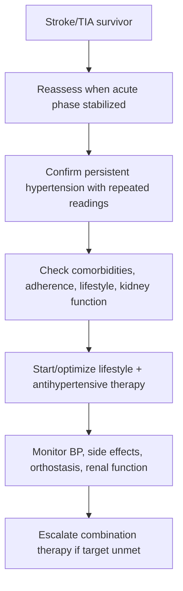
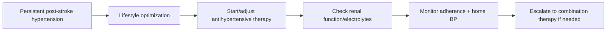

# Hypertension management for secondary stroke prevention

Related: [[../Stroke Medicine MOC|Stroke Medicine MOC]] · [[../Secondary Prevention|Secondary Prevention]] · [[Risk-factor modification|Risk-factor modification]] · [[Antiplatelet therapy after ischaemic stroke]] · [[Anticoagulation timing after cardioembolic stroke]] · [[Lipid lowering after stroke]]

> [!important]
> Hypertension is the **single most important modifiable risk factor** for recurrent stroke. The exam principle is: after the hyperacute phase has settled, aim for **sustained BP control**, individualized targets, and long-term adherence rather than abrupt aggressive early lowering.

## Learning Objectives
- Explain why BP control reduces recurrent stroke risk.
- Distinguish acute-stroke BP management from long-term secondary prevention.
- Outline drug choices, targets, comorbidity cautions, and monitoring.
- Recognize high-yield FCPS/MRCP pitfalls in post-stroke hypertension care.

## Definition
**Hypertension management for secondary stroke prevention** is the long-term assessment and treatment of elevated BP after TIA or stroke to reduce recurrence, vascular events, cognitive decline, and end-organ damage.

## Core Anatomy
- Chronic hypertension damages small penetrating arteries, large extracranial/intracranial vessels, and endothelium.
- It contributes to lacunar infarction, large-artery atheroma, intracerebral haemorrhage, and white-matter disease.
- Vascular remodeling affects both cerebral perfusion reserve and hemorrhagic vulnerability.

## Core Physiology
- High BP accelerates atherosclerosis, lipohyalinosis, endothelial dysfunction, and arterial stiffness.
- Good long-term control lowers risk of recurrent ischemic stroke, ICH, MI, heart failure, and renal decline.
- In the **hyperacute** stroke setting BP may be temporarily permissive, but in **secondary prevention** persistent hypertension should usually be treated.

## Normal Values / Important Cut-offs
- The main principle is **long-term controlled BP**, not permissive hypertension.
- Practical guideline-style targets often aim for **<140/90 mmHg** in many patients, with some higher-risk patients benefiting from lower targets if tolerated.
- Diabetes, CKD, or very high vascular risk may justify tighter control depending on tolerance and guideline context.
- Do not confuse these chronic targets with acute-thrombolysis or acute-ICH targets.

## Classification
### By post-stroke clinical context
1. Recent ischemic stroke or TIA
2. Prior intracerebral haemorrhage
3. Lacunar/small-vessel disease
4. Stroke with diabetes/CKD/heart failure

### By treatment approach
- Lifestyle optimization
- Single-drug therapy
- Combination therapy
- Resistant hypertension strategy

## Etiology / Causes
- Essential hypertension
- Poor adherence or interrupted treatment
- High salt intake, obesity, alcohol excess
- CKD or renal artery disease
- Endocrine secondary causes in selected cases
- Untreated sleep apnea
- Medication contributors such as NSAIDs or steroids

## Risk Factors
- Previous TIA/stroke
- Diabetes mellitus
- CKD
- Smoking
- Dyslipidaemia
- Older age
- Atrial fibrillation and broader vascular disease burden
- Sedentary lifestyle and obesity

## Pathophysiology
Persistent hypertension causes vessel wall thickening, impaired autoregulation, endothelial injury, and accelerated plaque formation. In cerebral small vessels it promotes lipohyalinosis and deep infarction; in larger vessels it worsens atherosclerosis and embolic risk. It also increases the risk of recurrent ICH by stressing fragile perforator vessels or amyloid-laden vessels in susceptible patients. Secondary prevention works by reducing chronic hemodynamic stress and vascular injury.

## Clinical Features
### What to assess after stroke/TIA
- Repeated clinic and home BP pattern
- Orthostatic symptoms
- Headache is not a reliable marker of chronic BP control
- Adherence, affordability, and pill burden
- Comorbid diabetes, CKD, heart failure, IHD

### Clues to poor control
- Persistently elevated clinic or home BP
- Missed doses / irregular follow-up
- High salt diet, obesity, alcohol excess
- Resistant hypertension despite multiple agents

## Approach / Algorithm

## Investigations
- Repeated seated BP measurements
- Home BP or ambulatory BP where helpful
- Serum creatinine/eGFR, electrolytes
- Urinalysis/proteinuria if CKD suspected
- ECG ± echocardiography depending on cardiac context
- HbA1c, lipid profile, weight/BMI review
- Secondary-cause workup only if clinically indicated

## Interpretation Frameworks
### Distinguish acute vs chronic BP thinking
| Context | Principle |
|---|---|
| Hyperacute ischemic stroke | Avoid reflex lowering unless indicated |
| Post-thrombolysis monitoring | Keep within protocol-safe range |
| Stable post-stroke secondary prevention | Persistent hypertension should be treated long-term |
| Prior ICH survivor | BP control is especially important for recurrence prevention |

### Practical post-stroke BP review
| Question | Why it matters |
|---|---|
| Is the acute phase over? | Chronic targets apply after stabilization |
| Are readings persistently high? | Avoid overtreating isolated stress elevations |
| Is there orthostatic intolerance? | Frail patients may need gentler titration |
| CKD/diabetes/heart failure present? | Drug choice and target nuance |
| Is non-adherence the main problem? | Fixing adherence may work better than adding drugs |

## Diagnosis
This is a **secondary prevention management problem** rather than a separate disease label. Diagnosis means identifying persistent hypertension or inadequate BP control after stroke/TIA and assessing recurrence-risk context.

## Differential Diagnosis
- White-coat hypertension
- Transient stress elevation after hospitalization
- Orthostatic hypotension from over-treatment
- Secondary hypertension in resistant cases

## Tables / Comparison Charts
### Common drug classes in post-stroke BP control
| Class | Benefits | Cautions |
|---|---|---|
| ACE inhibitor / ARB | Common first-line vascular protection strategy | Hyperkalaemia, renal function decline, pregnancy contraindication |
| Thiazide-like diuretic | Helpful in many stroke prevention regimens | Hyponatraemia, hypokalaemia, gout issues |
| Calcium-channel blocker | Good BP lowering, useful in older patients | Ankle edema, headache |
| Beta-blocker | Use when compelling cardiac indication exists | Not always ideal as sole uncomplicated first-line stroke-prevention drug |

### High-yield strategy principles
| Scenario | Practical approach |
|---|---|
| Recurrent stroke risk + persistent hypertension | Start/optimize long-term therapy |
| Frail patient with dizziness | Titrate slowly, check orthostatics |
| Diabetes/CKD | Renal and metabolic monitoring important |
| Prior ICH | Tight, sustained BP control especially important |

## Management
### Lifestyle measures
- Salt reduction
- Weight loss where appropriate
- Regular exercise/rehab-compatible activity
- Smoking cessation
- Alcohol moderation
- Sleep apnea evaluation where relevant
- Adherence counseling and family education

### Drug therapy
- Start or restart antihypertensive treatment once clinically stable and swallowing/route issues are addressed.
- Common regimens include an **ACE inhibitor/ARB**, **thiazide-like diuretic**, **calcium-channel blocker**, or combination therapy.
- Many patients require **2-drug therapy** for durable control.
- Choose based on age, renal function, diabetes, heart failure, ischemic heart disease, and tolerance.

### Monitoring
- Follow BP trends over time, not a single reading.
- Recheck renal function and electrolytes after RAAS blockers or diuretics.
- Review side effects, orthostasis, adherence, and affordability.

## Drug Interactions / Contraindications / Comorbidity Cautions
- ACEi/ARB: avoid in pregnancy, caution with renal artery stenosis, hyperkalaemia.
- Diuretics: may worsen gout, hyponatraemia, dehydration.
- Calcium-channel blockers: edema and headache may limit tolerance.
- Over-treatment can produce orthostatic falls in frail older patients.
- Do not carry forward **acute permissive-hypertension logic** into long-term secondary prevention.

## Procedures / Indications / Contraindications
### Ambulatory/home BP monitoring
- **Indication:** uncertain clinic readings, white-coat effect, masked hypertension, variable control.
- **Value:** improves confidence that chronic treatment is justified and adequate.

## Procedure Mini-Sections
### Home BP monitoring concept
- **Indication:** follow-up of chronic post-stroke BP control.
- **Preparation:** validated device, proper technique, logbook.
- **Principle:** repeated out-of-clinic readings guide safer titration.
- **Viva pearl:** one clinic reading should not dominate long-term management.

## Complications
- Recurrent ischemic stroke
- Intracerebral haemorrhage recurrence
- MI, heart failure, CKD progression
- Orthostatic symptoms from excessive treatment

## Red Flags / Emergencies
> [!warning]
> Escalate urgently if post-stroke hypertension is accompanied by:
> - hypertensive emergency features
> - acute heart failure / pulmonary edema
> - aortic syndrome concern
> - severe renal injury
> - profound symptomatic hypotension from over-treatment

## Prognosis
Sustained BP control markedly improves long-term vascular outcome and is one of the most effective secondary prevention interventions after stroke/TIA.

## Topic Correlation
- [[Lipid lowering after stroke]]
- [[Diabetes, smoking, and lifestyle modification in stroke prevention]]
- [[Antiplatelet therapy after ischaemic stroke]]
- [[Atrial fibrillation-related stroke prevention]]
- [[../Stroke Unit Care and Complications/Blood pressure management in acute ischaemic stroke|Blood pressure management in acute ischaemic stroke]]

## Special Situations
### Prior intracerebral haemorrhage
- Long-term BP control is especially important to reduce recurrence risk.

### CKD
- Drug choice and creatinine/potassium monitoring are central.

### Frail elderly patient
- Aim for control without falls, syncope, or cerebral hypoperfusion symptoms.

## FCPS/MRCP High-Yield Points
- Hypertension is the **top modifiable recurrent-stroke risk factor**.
- Do not confuse **acute-stroke BP rules** with **chronic secondary prevention**.
- Most patients need long-term treatment plus lifestyle change.
- ACEi/ARB and thiazide-like strategies are classically important in stroke prevention discussions.

## Common Viva Questions
- Why is BP control so important after stroke?
- When do you start long-term antihypertensives?
- Which drug classes are commonly used?
- Why is post-ICH BP control especially important?
- How do you avoid over-treatment in the elderly?

## Common Confusions / Exam Traps
- Using permissive-hypertension logic for chronic care.
- Treating a single stress-related reading as chronic uncontrolled hypertension.
- Forgetting renal/electrolyte monitoring after starting therapy.
- Ignoring adherence and lifestyle when “drug failure” is actually non-adherence.

## Mnemonics
### Post-stroke BP mnemonic: **PRESSURE**
- **P**ersistent readings matter
- **R**ecurrence prevention
- **E**lectrolytes/renal review
- **S**alt reduction
- **S**low titration in frail patients
- **U**se combinations when needed
- **R**eview adherence
- **E**xclude acute-phase confusion

## Mind Map
- Secondary stroke prevention
  - hypertension
    - lifestyle
    - ACEi/ARB
    - diuretic
    - CCB
    - monitoring
  - cautions
    - CKD
    - orthostasis
    - ICH history

## Flowchart

## Suggested Visuals / Image Notes
- Table comparing acute-stroke BP vs chronic secondary prevention BP.
- Drug-class chart for post-stroke BP control.
- Recurrent-stroke risk factor wheel.

## Suggested Video References
- Secondary stroke prevention overview
- Hypertension treatment after stroke/TIA
- Differentiating acute vs chronic BP management in stroke care

## One-Page Revision Summary
### Hypertension management for secondary stroke prevention
- Hypertension is the **most important modifiable recurrent-stroke risk factor**.
- Acute-stroke permissive BP logic does **not** apply to long-term prevention.
- Common long-term target framework: **<140/90 mmHg** in many patients, individualized by tolerance and comorbidity.
- Core measures:
  - salt reduction
  - weight control
  - exercise
  - smoking/alcohol counseling
  - antihypertensive drugs
- Common drugs: ACEi/ARB, thiazide-like diuretic, CCB, sometimes combination therapy.
- Monitor: renal function, potassium, orthostasis, adherence, home BP.

## 24-Hour Recall Prompts
- Why is hypertension so important after stroke?
- What is the key difference between acute and chronic BP management in stroke?
- Name 3 common drug classes.
- Why must you check renal function and electrolytes?
- Why is prior ICH a special situation?

## 7-Day / 15-Day / 30-Day Revision Tracker
- **Day 7:** recall PRESSURE mnemonic.
- **Day 15:** compare acute-stroke BP vs secondary prevention BP.
- **Day 30:** give a 2-minute viva on long-term BP control after stroke.

## Must Know / Should Know / Nice to Know
### Must Know
- Hypertension is the top modifiable recurrent-stroke risk factor
- Long-term control matters after stabilization
- Acute permissive-hypertension logic should not be misapplied

### Should Know
- Common drug classes and renal/electrolyte monitoring
- Orthostatic caution in frail patients
- Post-ICH importance

### Nice to Know
- Resistant-hypertension secondary-cause workup
- Ambulatory-monitoring nuance

## My Weak Points
- Do I confuse acute-stroke BP with secondary prevention BP?
- Can I explain why persistent control matters biologically?
- Do I remember monitoring after RAAS blockers/diuretics?

## Self-Test Scorecard
- Concept recall: /10
- Drug-choice confidence: /10
- Monitoring confidence: /10
- Viva confidence: /10
- Comorbidity nuance: /10

## Exam Answer Modes
### Short note frame
- Definition
- Why BP matters
- Targets/principles
- Drugs
- Monitoring
- Special situations

### Viva frame
- “Long-term BP control is one of the most effective ways to prevent recurrent stroke. Once the acute phase has stabilized, persistent hypertension should be treated with lifestyle measures and antihypertensive therapy, while avoiding confusion with acute permissive-hypertension rules.”

## Summary
Hypertension management after stroke is one of the highest-yield secondary prevention topics. The essential exam message is that **stable long-term BP control saves brains, hearts, and kidneys**, and should be individualized but actively pursued.

## MCQs (10)
1. The most important modifiable risk factor for recurrent stroke is:
   A. Hair color
   B. Hypertension
   C. Seasonal allergy
   D. Myopia

2. Long-term post-stroke BP management should be distinguished from:
   A. Smoking cessation
   B. Acute-stroke permissive hypertension rules
   C. Lipid lowering
   D. Swallow screening

3. A common long-term BP target framework in many stroke survivors is:
   A. <140/90 mmHg
   B. >200/120 mmHg
   C. SBP exactly 90 mmHg
   D. BP never needs review after discharge

4. Which drug class is commonly used in post-stroke BP control?
   A. ACE inhibitor / ARB
   B. Antifungal only
   C. Proton pump inhibitor only
   D. Antihistamine only

5. Which test is especially important after starting ACEi/ARB therapy?
   A. Audiogram
   B. Renal function and potassium
   C. Visual field testing
   D. Bone density

6. Which statement is true?
   A. Permissive hypertension should continue lifelong after stroke
   B. Long-term BP control reduces recurrent stroke risk
   C. One isolated ward BP proves chronic severe hypertension
   D. BP does not matter after TIA

7. Which patient needs especially careful orthostatic review?
   A. Frail elderly patient with dizziness
   B. Stable athlete only
   C. Young patient with normal readings
   D. Patient with isolated rash

8. BP control is particularly important after which event to reduce recurrence?
   A. Intracerebral haemorrhage
   B. Simple tension headache
   C. Peripheral neuropathy
   D. Otitis externa

9. Which lifestyle measure supports secondary prevention BP control?
   A. Salt reduction
   B. Bed rest forever
   C. Smoking continuation
   D. Excess alcohol use

10. Best summary?
   A. Hypertension management after stroke is a major long-term secondary prevention priority
   B. BP matters only during alteplase infusion
   C. Renal monitoring is unnecessary
   D. Lifestyle change has no role

## SBA Questions (10)
1. A 67-year-old man is reviewed 6 weeks after ischemic stroke. He has repeated BP readings around 154/92 mmHg. Best principle?
   A. Continue permissive hypertension indefinitely
   B. Start/optimize long-term BP control for secondary prevention
   C. Avoid treatment because stroke already happened
   D. Give thrombolysis

2. A frail 80-year-old woman with prior stroke becomes dizzy after intensification of antihypertensive therapy. Best next step?
   A. Ignore symptoms
   B. Review for orthostatic hypotension and adjust regimen cautiously
   C. Double the dose
   D. Stop all follow-up

3. Which patient most strongly benefits from careful sustained BP control to prevent another hemorrhagic event?
   A. Prior ICH survivor
   B. Patient with hay fever only
   C. Stable migraine without vascular risk
   D. Patient with healed ankle sprain

4. After starting an ARB and thiazide-like diuretic, what follow-up is especially important?
   A. Renal function and electrolytes
   B. Dermatology referral only
   C. Colonoscopy
   D. Ear microscopy

5. A patient’s clinic BP is high once after a stressful visit, but home readings are acceptable. Best principle?
   A. Diagnose resistant hypertension immediately
   B. Use repeated or home BP trends rather than one reading alone
   C. Stop all medication
   D. Assume stroke recurrence is imminent

6. Which pair best reflects typical long-term post-stroke risk-factor work?
   A. Salt reduction and antihypertensive adherence
   B. High-salt diet and alcohol excess
   C. Bed rest and smoking
   D. Ignoring weight and exercise

7. Why is the acute-stroke BP mindset different from secondary prevention?
   A. Because chronic BP no longer affects recurrence
   B. Because hyperacute perfusion concerns differ from long-term vascular protection goals
   C. Because BP is irrelevant in TIA
   D. Because only hemorrhagic stroke needs BP review

8. Which class may be particularly useful when a compelling cardiac indication such as IHD exists?
   A. Beta-blocker
   B. Antibiotic
   C. Antacid
   D. Antiemetic

9. Which statement best fits long-term post-stroke hypertension care?
   A. Many patients require more than one drug for control
   B. Lifestyle never matters
   C. Monitoring creatinine is unnecessary
   D. Dizziness proves treatment success

10. Best overall summary?
   A. Secondary prevention BP management is long-term, repeated, individualized vascular risk reduction
   B. One BP reading decides everything forever
   C. Permissive hypertension should be maintained permanently
   D. Stroke recurrence is unrelated to BP

## Flashcards
- Q: What is the most important modifiable recurrent-stroke risk factor?
  A: Hypertension.
- Q: Does acute-stroke permissive hypertension equal long-term secondary prevention strategy?
  A: No.
- Q: Give a common long-term BP target framework in many stroke patients.
  A: <140/90 mmHg, individualized by patient context.
- Q: Name 3 common drug classes for post-stroke BP control.
  A: ACEi/ARB, thiazide-like diuretic, calcium-channel blocker.
- Q: What monitoring is important after ACEi/ARB or diuretic initiation?
  A: Renal function and electrolytes.
- Q: Why is prior ICH a special situation?
  A: Good BP control is crucial to reduce hemorrhage recurrence risk.
- Q: Name 3 lifestyle measures for post-stroke BP control.
  A: Salt reduction, weight control, exercise, smoking cessation, alcohol moderation.
- Q: Why should one isolated ward BP not dominate long-term treatment?
  A: Stress/transient elevation may not represent chronic control.
- Q: What elderly-treatment complication should be watched for?
  A: Orthostatic hypotension and falls.
- Q: Why is adherence review essential?
  A: Poor control may reflect missed treatment rather than ineffective drugs.

## Answer Key with Explanations
### MCQs
1. **B** — Hypertension is the top modifiable recurrent-stroke risk factor.
2. **B** — Acute-stroke BP management is different from chronic prevention logic.
3. **A** — This is a common practical chronic target framework.
4. **A** — ACEi/ARB agents are classically important in post-stroke prevention.
5. **B** — RAAS blockade can affect creatinine and potassium.
6. **B** — Long-term BP control clearly reduces recurrence risk.
7. **A** — Frail elders may be harmed by over-treatment.
8. **A** — BP control is especially important after ICH to prevent recurrence.
9. **A** — Salt reduction is a key lifestyle measure.
10. **A** — This captures the core message.

### SBAs
1. **B** — This is classic persistent post-stroke hypertension requiring long-term prevention management.
2. **B** — Symptoms should trigger orthostatic review and gentler titration.
3. **A** — Prior ICH makes BP control especially important.
4. **A** — These are the most relevant safety-monitoring tests.
5. **B** — Repeated trends are better than one clinic reading.
6. **A** — Both are central parts of long-term risk-factor control.
7. **B** — Acute perfusion issues differ from chronic vascular-protection goals.
8. **A** — Beta-blockers may be useful when compelling cardiac indications coexist.
9. **A** — Combination therapy is common in real practice.
10. **A** — Secondary prevention BP care is a chronic, individualized process.

## PasTest Scenario SBAs (Clinical Vignettes)

> **Auto-generated PasTest/Mediscope-style scenario SBAs** grounded in the authored source. Each scenario tests a real clinical fact (triad, specific sign, contraindication, trial, first-line Rx) extracted from the topic. *Source: Ch 27: Neurology & Stroke — Hypertension management for secondary stroke prevention*

**Q1.** What is the most appropriate first-line therapy for Hypertension management for secondary stroke prevention?

  - **A.** Start or restart antihypertensive treatment once clinically stable and swallowing/route issues are addressed
  - **B.** An advanced/surgical therapy reserved for refractory disease
  - **C.** Symptomatic treatment only, no disease-modifying therapy
  - **D.** Empiric broad-spectrum therapy without specific indication

  > **Answer: A** — Start or restart antihypertensive treatment once clinically stable and swallowing/route issues are addressed
  >
  > *Source:* Start or restart antihypertensive treatment once clinically stable and swallowing/route issues are addressed.

