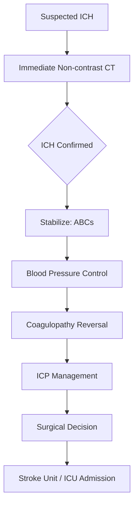
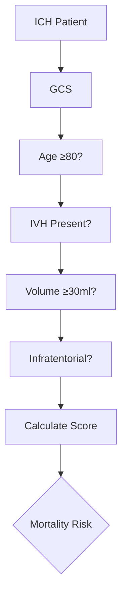

# Intracerebral Haemorrhage: Overview and Management

## Learning Objectives
- [ ] Diagnose ICH using clinical and imaging criteria
- [ ] Classify ICH by etiology and location
- [ ] Apply acute management: BP control, coagulopathy reversal, surgical indications
- [ ] Apply prognostic scores (ICH score, ABC/2 volume)
- [ ] Identify FCPS/MRCP high-yield ICH management points

---

## Definition & Epidemiology

| Feature | Detail |
|---------|--------|
| **Definition** | Spontaneous bleeding into brain parenchyma (non-traumatic) |
| **Incidence** | 15-30/100,000/year |
| **Proportion of Strokes** | **10-20%** (but 30-50% mortality) |
| **Male:Female** | 1:1 |
| **Age** | Mean 65-70 years |
| **Mortality (30-day)** | **35-50%** |
| **Functional Outcome** | ~20% independent at 90 days |

---

## Aetiological Classification

```mermaid
flowchart TD
    A[Intracerebral Haemorrhage] --> B{Primary vs Secondary}
    B -->|Primary (Spontaneous)| C[Hypertensive (50-60%)]
    B --> C[CAA (20-30%)]
    B --> C[Other/Unknown]
    B -->|Secondary| D[Anticoagulant-associated]
    B -->|Secondary| E[Structural: AVM, Aneurysm, Tumour]
    B -->|Secondary| F[Venous Sinus Thrombosis]
    B -->|Secondary| G[Drug-induced (Thrombolytics, Anticoagulants)]
```

| Type | Proportion | Key Features |
|------|-----------|--------------|
| **Hypertensive (Deep)** | **50-60%** | Basal ganglia, thalamus, pons, cerebellum |
| **CAA (Lobar)** | 20-30% | Lobar (cortical), elderly, microbleeds |
| **Anticoagulant-associated** | 10-15% | INR >3 / DOAC; lobar + deep |
| **AVM/Aneurysm** | 5-10% | Young; subarachnoid + parenchymal |
| **Tumour** | <5% | Irregular enhancement, oedema |
| **Amyloid Angiopathy** | See CAA | Lobar, microbleeds, elderly |

---

## Clinical Presentation

| Feature | Typical ICH |
|---------|-------------|
| **Onset** | **Sudden**, maximal at onset (seconds-minutes) |
| **Headache** | Severe, sudden ("thunderclap") |
| **Vomiting** | Common (↑ ICP) |
| **Consciousness** | Often impaired (GCS <14 in 50%) |
| **Focal Signs** | Hemiparesis, aphasia, gaze deviation, gaze palsy |
| **Signs of ↑ ICP** | Headache, vomiting, Cushing's triad (HTN, bradycardia, irregular breathing) |

> **FCPS/MRCP**: **Sudden onset + headache + vomiting + depressed consciousness = ICH until proven otherwise.**

---

## Causes by Location

| Location | Most Common Cause | Other Causes |
|----------|-------------------|--------------|
| **Basal Ganglia (Putamen)** | **Hypertension** (70%) | CAA, Amyloid, Tumour |
| **Thalamus** | **Hypertension** | Vascular malformation |
| **Pons** | **Hypertension** | AVM, Tumour |
| **Cerebellum** | **Hypertension** | CAA, AVM, Tumour |
| **Lobar (Cortical)** | **CAA (Amyloid)** | Tumour, AVM, Hypertensive (rare) |
| **Ventricular** | Extension from adjacent | Primary intraventricular rare |

---

## Diagnosis

### Clinical Suspicion
- Sudden headache + vomiting + focal deficit + ↓ GCS
- Hypertension at presentation (common)

### Imaging
| Modality | Role |
|----------|------|
| **Non-contrast CT** | **Gold Standard** (hyperdense haematoma) |
| **CTA** | Spot sign (active bleeding), vascular malformation |
| **MRI (GRE/SWI)** | Microbleeds, CAA, tumour, cavernoma |
| **MRI (DWI)** | Differentiate from acute infarct |

### CT Findings
| Feature | Appearance |
|----------|------------|
| **Acute Blood** | **Hyperdense** (40-80 HU) |
| **Oedema** | Hypodense rim (peaks 48-72h) |
| **IVH** | Hyperdense in ventricles |
| **Spot Sign (CTA)** | Contrast extravasation → predicts expansion |

---

## ICH Volume & Prognosis (ABC/2 Method)

```mermaid
flowchart TD
    A[CT Slice with Largest Haemorrhage] --> B[Measure A = Largest Diameter]
    B --> C[Measure B = Perpendicular Diameter]
    C --> D[Count C = Number of Slices with Haemorrhage]
    D --> E[Slice Thickness]
    E --> F[Volume = (A × B × C × Slice Thickness) / 2]
```

| Volume | 30-Day Mortality | Management Implication |
|--------|------------------|------------------------|
| **<30 ml** | <20% | Medical management |
| **30-60 ml** | 40-50% | Consider surgery if superficial |
| **>60 ml** | **>50%** | Surgical evaluation |

> **ABC/2 Formula**: **Volume = (A × B × C) / 2** where C = number of slices × slice thickness.

---

## ICH Score (Prognostication)

| Variable | Points |
|----------|--------|
| **GCS** | 15=0, 13-14=1, 11-12=2, 7-10=3, 5-6=4, 3-4=5 |
| **Age ≥80** | 1 |
| **IVH** | 1 |
| **Volume ≥30 ml** | 1 |
| **Infratentorial Origin** | 1 |

| Score | 30-Day Mortality |
|-------|------------------|
| **0** | 0% |
| **1** | 13% |
| **2** | 26% |
| **3** | 72% |
| **4** | 97% |
| **5-6** | 100% |

> **ICH Score ≥3 = Poor prognosis** — consider palliative goals.

---

## Acute Management



---

## Blood Pressure Management: INTERACT-2 / ATACH-2

| Phase | Target | Agent |
|-------|--------|-------|
| **Acute (0-1h)** | **SBP 110-140 mmHg** (INTERACT-2: <140) | Labetalol, Nicardipine, Urapidil |
| **Stabilization (1-24h)** | **SBP <140 mmHg** | IV infusion preferred |
| **Chronic (Day 1-7)** | **130-140 mmHg** | Oral agents |

> **INTERACT-2**: **Intensive SBP <140 mmHg** → ↓ haematoma expansion, ↑ functional outcome (mRS 0-3).
> **ATACH-2**: No difference in outcome with intensive vs standard; **avoid <110 mmHg**.

> **Target**: **SBP 110-140 mmHg** (avoid <110 — hypoperfusion risk).

---

## Coagulopathy Reversal

| Agent | Indication | Regimen |
|-------|------------|---------|
| **Warfarin (INR >1.4)** | Prothrombin Complex Concentrate (PCC) | **25-50 U/kg** 4F-PCC; **Vitamin K 10mg IV** |
| **DOACs (Direct Oral Anticoagulants)** | **Andexanet alfa** (factor Xa inhibitor reversal) | **Andexanet 400-800mg bolus + infusion** |
| **Dabigatran** | **Idarucizumab** | **5g IV** (2x 2.5g vials) |
| **Heparin/LMWH** | Protamine | 1mg/100 U heparin; 1mg/1mg LMWH |
| **Platelets <100k** | Platelet Transfusion | 1 Adult Pool (if <50k or active bleed) |

> **DOAC Reversal**: **Andexanet alfa** for factor Xa inhibitors (Apixaban, Rivaroxaban, Edoxaban); **Idarucizumab** for Dabigatran.

---

## Surgical Indications (STICH/STICH-II)

| Indication | Criteria |
|-----------|----------|
| **Supratentorial** | **GCS 9-12**, **Haematoma 20-50ml**, **<1cm from surface**, Age <80 |
| **Cerebellar** | **>3cm** OR **GCS <13** OR **Hydrocephalus / Brainstem compression** |
| **IVH + Hydrocephalus** | EVD → then assess haematoma |
| **Lobar (CAA)** | Generally **NOT** operated (high recurrence) |

> **STICH/STICH-II**: **No overall benefit** of routine early surgery; **selected cases** benefit.

---

## ICH Score Calculator



| ICH Score | 30-Day Mortality | Clinical Action |
|-----------|------------------|-----------------|
| **0** | 0% | Aggressive management |
| **1** | 13% | Full active management |
| **2** | 26% | Full active management |
| **3** | 72% | Consider goals of care |
| **4** | 97% | Palliative discussion |
| **≥5** | 100% | Comfort care |

---

## Anticoagulant-Associated ICH

| Anticoagulant | Reversal Agent | Dose |
|---------------|----------------|------|
| **Warfarin** | **4F-PCC** (25-50 U/kg) + **Vitamin K 10mg IV** | 25-50 U/kg PCC |
| **Apixaban / Rivaroxaban / Edoxaban** | **Andexanet alfa** | Low dose: 400mg bolus + 480mg infusion; High dose: 800mg bolus + 960mg |
| **Dabigatran** | **Idarucizumab** | 5g IV (2 × 2.5g vials) |
| **Heparin/LMWH** | Protamine | 1mg/100U Heparin; 1mg/1mg LMWH |

> **Vitamin K 10mg IV ALWAYS with PCC** for warfarin reversal.

---

## FCPS/MRCP High-Yield Summary

| Concept | Key Points |
|---------|------------|
| **Diagnosis** | **Non-contrast CT** = Gold standard (hyperdense) |
| **Volume** | ABC/2: (A×B×C)/2; **>60ml = poor prognosis** |
| **ICH Score** | 0-6; **≥3 = poor prognosis** |
| **BP Target** | **SBP 110-140 mmHg** (INTERACT-2); Avoid <110 |
| **Coagulopathy Reversal** | **Warfarin: 4F-PCC + Vit K**; **DOAC: Andexanet/Idarucizumab** |
| **Surgical Indication** | Cerebellar >3cm; Supratentorial GCS 9-12, vol 20-50ml, <1cm from surface |
| **ICH Score** | 0-6; **≥3 = poor prognosis** |
| **Anticoag Reversal** | Warfarin: PCC + Vit K; DOAC: Andexanet/Idarucizumab |
| **Cerebellar Haematoma** | >3cm OR GCS<13 OR Hydrocephalus → Surgery |
| **CAA** | Lobar microbleeds; Recurrent; Avoid anticoagulation |

---

## Viva Questions

1. **How do you calculate ICH volume using ABC/2 method?**
2. **What is the target SBP in acute ICH? Evidence?**
3. **What is the ICH score? Components? Score ≥3 significance?**
4. **How do you reverse warfarin-associated ICH?**
4. **How do you reverse DOAC-associated ICH?**
4. **What are surgical indications for ICH?**
5. **What is the ICH score? Components? Score ≥3 significance?**
5. **How do you reverse warfarin? DOAC? Heparin?**
6. **What is the spot sign on CTA? Significance?**
6. **What is the management of cerebellar haemorrhage?**
7. **What is the difference between hypertensive and amyloid ICH?**
8. **What is the spot sign? What does it predict?**
8. **What is the role of rFVIIa in ICH?**
9. **When is surgery indicated for ICH?**
10. **What is the ICH score and score ≥3 significance?**

---

## Confusions & Mnemonics

| Confusion | Clarification |
|-----------|---------------|
| BP Target ICH | **SBP 110-140** (INTERACT-2); **Avoid <110** (hypoperfusion) |
| Warfarin Reversal | **PCC + Vitamin K** (both needed) |
| DOAC Reversal | **Andexanet** (Xa inhibitors); **Idarucizumab** (Dabigatran) |
| ICH Score ≥3 | **≥3 = Poor prognosis** (72% mortality) |
| Spot Sign | **CTA contrast extravasation** → Predicts hematoma expansion |
| Cerebellar Haematoma | **>3cm OR GCS<13 OR Hydrocephalus** → Surgery |
| IVH | **Gravely poor prognosis** if large; EVD if obstructive hydrocephalus |
| PFA (Primary Fibrinolytic Agent) | **No role** in ICH (increases bleeding) |
| ICH Score Components | GCS, Age≥80, IVH, Vol≥30ml, Infratentorial |
| Warfarin Reversal | **PCC 25-50 U/kg + Vit K 10mg IV** |

---

## Mind Map

```mermaid
mindmap
  root((Intracerebral Haemorrhage))
    Aetiology
      Hypertensive (50-60%): Basal ganglia, thalamus, pons, cerebellum
      CAA (20-30%): Lobar, elderly, microbleeds
      Anticoagulant (10-15%): Warfarin, DOACs
      Structural: AVM, Aneurysm, Tumour
    Diagnosis
      NCCT: Hyperdense haematoma
      CTA: Spot sign
      MRI: Microbleeds (CAA)
    Volume
      ABC/2 = (A×B×C)/2
      >60ml = Poor prognosis
    Severity Scoring
      ICH Score (0-6)
      >=3 = Poor prognosis
    Management
      BP: SBP 110-140 (INTERACT-2)
      Coagulation reversal
      Surgery: Cerebellar >3cm, Supratentorial select
    Reversal
      Warfarin: PCC + Vit K
      DOAC: Andexanet (Xa) / Idarucizumab (Dabigatran)
    Scoring
      ICH Score 0-6
      >=3 = Poor prognosis
```

---

## One-Page Revision Card

| **ICH** | **Key Points** |
|---------|----------------|
| **Diagnosis** | NCCT: Hyperdense haematoma |
| **Volume** | **ABC/2 = (A×B×C)/2** |
| **ICH Score** | GCS, Age≥80, IVH, Vol≥30ml, Infratentorial |
| **ICH Score ≥3** | **72% 30-day mortality** |
| **BP Target** | **SBP 110-140 mmHg** (INTERACT-2) |
| **Volume Thresholds** | <30ml: Medical; 30-60ml: Consider surgery; >60ml: Poor prognosis |
| **Warfarin Reversal** | **PCC 25-50 U/kg + Vit K 10mg IV** |
| **DOAC Reversal** | **Andexanet (Xa) / Idarucizumab (Dabigatran)** |
| **Surgical Indications** | Cerebellar >3cm/GCS<13; Supratentorial GCS 9-12/Vol20-50ml/<1cm surface |
| **IVH** | EVD if hydrocephalus |
| **CCA** | Lobar, microbleeds, avoid anticoagulation |

---

## Spaced Repetition Tracker

| Day | 1 | 3 | 7 | 15 | 30 |
|-----|---|---|---|----|----|
| ABC/2 Formula | ☐ | ☐ | ☐ | ☐ | ☐ |
| ICH Score Components | ☐ | ☐ | ☐ | ☐ | ☐ |
| BP Target (INTERACT-2) | ☐ | ☐ | ☐ | ☐ | ☐ |
| Warfarin Reversal | ☐ | ☐ | ☐ | ☐ | ☐ |
| DOAC Reversal Agents | ☐ | ☐ | ☐ | ☐ | ☐ |

---

## Self-Test Scorecard

| Question | My Answer | Correct? |
|----------|-----------|----------|
| ABC/2 Formula |  |  |
| ICH Score Components |  |  |
| BP Target INTERACT-2 |  |  |
| Warfarin Reversal |  |  |
| DOAC Reversal |  |  |

---

## Local Navigation

- [[Intracerebral Haemorrhage/Hypertensive intracerebral haemorrhage|Hypertensive ICH]]
- [[Intracerebral Haemorrhage/Cerebellar haemorrhage|Cerebellar Haemorrhage]]
- [[Intracerebral Haemorrhage/Lobar haemorrhage and cerebral amyloid angiopathy clues|Lobar ICH / CAA]]
- [[Intracerebral Haemorrhage/Anticoagulant-associated intracerebral haemorrhage|Anticoagulant ICH]]
- [[Portal Hypertension and Complications/Acute variceal bleeding management|Variceal Bleed]]
---

## MCQs (10)
1. Most common cause of spontaneous ICH?
   A) Hypertension (deep) + amyloid (lobar)
   B) **A**
   C) 
   D) 
   **Answer: A**

2. Lobar ICH is associated with?
   A) Cerebral amyloid angiopathy (elderly)
   B) **B**
   C) 
   D) 
   **Answer: A**

3. Deep ICH location for hypertension?
   A) Basal ganglia, thalamus, pons, cerebellum
   B) **C**
   C) 
   D) 
   **Answer: A**

4. CT sensitivity for acute ICH?
   A) ~100%
   B) **D**
   C) 
   D) 
   **Answer: A**

5. ABC/2 method estimates?
   A) ICH volume
   B) **A**
   C) 
   D) 
   **Answer: A**

6. BP target in acute ICH?
   A) SBP < 140 (INTERACT-3)
   B) **B**
   C) 
   D) 
   **Answer: A**

7. Warfarin-associated ICH reversal?
   A) 4-factor PCC + vitamin K
   B) **C**
   C) 
   D) 
   **Answer: A**

8. Dabigatran reversal?
   A) Idarucizumab
   B) **D**
   C) 
   D) 
   **Answer: A**

9. Factor Xa inhibitor reversal?
   A) Andexanet alfa or 4-factor PCC
   B) **A**
   C) 
   D) 
   **Answer: A**

10. Surgical indication for ICH?
   A) Cerebellar ICH > 3 cm with mass effect
   B) **B**
   C) 
   D) 
   **Answer: A**

## SBA Questions (10)
1. Lobar ICH in 75-year-old normotensive — likely cause? | Cerebral amyloid angiopathy

2. Deep ICH (basal ganglia) in 60-year-old hypertensive — cause? | Hypertensive vasculopathy (Charcot-Bouchard microaneurysm)

3. ABC/2 method — formula? | A × B × C / 2

4. BP target in acute ICH (INTERACT-3)? | SBP < 140 mmHg within 1 h, sustained 7 days

5. Warfarin-associated ICH — reversal? | 4-factor PCC + vitamin K 10 mg IV

6. Dabigatran reversal? | Idarucizumab 5 g IV

7. Apixaban/rivaroxaban reversal? | Andexanet alfa or 4-factor PCC

8. Surgical evacuation of cerebellar ICH — when? | > 3 cm or with brainstem compression / hydrocephalus

9. STICH-II inclusion criteria for surgery? | Lobar ICH 10-100 mL, within 1 cm of cortex, GCS > 8, no IVH

10. Mortality of large ICH? | ~30-50% at 30 days

## Flashcards
**Q: Most common cause?**
A: HTN (deep) + amyloid (lobar)

**Q: Lobar ICH?**
A: Elderly, amyloid

**Q: Deep ICH?**
A: BG, thalamus, pons, cerebellum

**Q: CT sensitivity?**
A: ~100%

**Q: ABC/2?**
A: A × B × C / 2

**Q: BP target?**
A: SBP < 140 (INTERACT-3)

**Q: Warfarin Rx?**
A: PCC + Vit K

**Q: Dabigatran Rx?**
A: Idarucizumab

**Q: FXa Rx?**
A: Andexanet / PCC

**Q: Surgical?**
A: Cerebellar > 3 cm

## Answer Key with Explanations
### MCQs
1. **A** — Most common cause of spontaneous ICH?
2. **A** — Lobar ICH is associated with?
3. **A** — Deep ICH location for hypertension?
4. **A** — CT sensitivity for acute ICH?
5. **A** — ABC/2 method estimates?
6. **A** — BP target in acute ICH?
7. **A** — Warfarin-associated ICH reversal?
8. **A** — Dabigatran reversal?
9. **A** — Factor Xa inhibitor reversal?
10. **A** — Surgical indication for ICH?

### SBAs
1. **Cerebral amyloid angiopathy**
2. **Hypertensive vasculopathy (Charcot-Bouchard microaneurysm)**
3. **A × B × C / 2**
4. **SBP < 140 mmHg within 1 h, sustained 7 days**
5. **4-factor PCC + vitamin K 10 mg IV**
6. **Idarucizumab 5 g IV**
7. **Andexanet alfa or 4-factor PCC**
8. **> 3 cm or with brainstem compression / hydrocephalus**
9. **Lobar ICH 10-100 mL, within 1 cm of cortex, GCS > 8, no IVH**
10. **~30-50% at 30 days**

## Local Navigation

- [[../Stroke Medicine MOC|Stroke Medicine MOC]]
- [[../Davidson Chapter 29 - Stroke Medicine Hierarchy|Davidson Chapter 29 - Stroke Medicine Hierarchy]]
