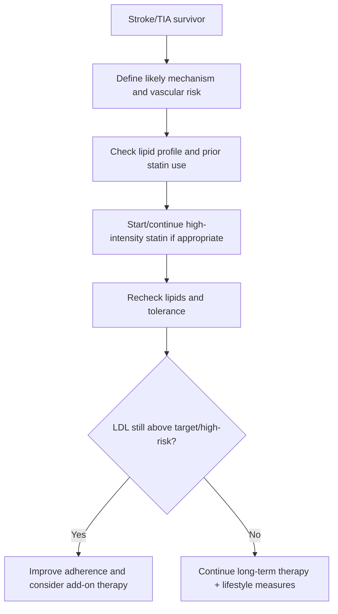
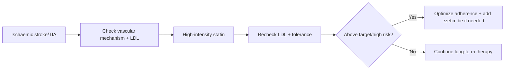

# Lipid lowering after stroke

Related: [[../Stroke Medicine MOC|Stroke Medicine MOC]] · [[../Secondary Prevention|Secondary Prevention]] · [[Risk-factor modification|Risk-factor modification]] · [[Hypertension management for secondary stroke prevention]] · [[Antiplatelet therapy after ischaemic stroke]] · [[Carotid stenosis and carotid endarterectomy indications]]

> [!important]
> Atherosclerotic stroke and TIA survivors usually need **aggressive LDL reduction**, most often with **high-intensity statin therapy** unless contraindicated. The exam emphasis is on vascular risk reduction, not just “cholesterol treatment.”

## Learning Objectives
- Explain the role of lipid lowering in recurrent stroke prevention.
- Recognize who benefits most from high-intensity statin therapy.
- Outline LDL-target thinking, add-on therapy, and safety monitoring.
- Identify common exam pitfalls, especially differences between stroke subtypes.

## Definition
**Lipid lowering after stroke** is the long-term use of statins and, when needed, additional lipid-lowering therapy to reduce recurrent cerebrovascular and cardiovascular events after ischemic stroke or TIA, especially when atherosclerosis is implicated.

## Core Anatomy
- Atherosclerotic plaque can affect carotid bifurcation, extracranial vertebral arteries, aortic arch, and intracranial vessels.
- Plaque instability and thromboembolism lead to ischemic stroke/TIA.
- Lipid lowering reduces plaque progression and promotes stabilization.

## Core Physiology
- LDL cholesterol promotes atheroma formation, endothelial dysfunction, and inflammatory plaque instability.
- Statins reduce LDL and have pleiotropic effects including plaque stabilization and anti-inflammatory benefits.
- Lower LDL means lower risk of recurrent ischemic stroke, MI, and other vascular events in appropriate patients.

## Normal Values / Important Cut-offs
- Exact LDL targets vary by guideline, but **“lower is better”** for high-risk atherosclerotic stroke patients is the common principle.
- Many secondary prevention frameworks aim for **high-intensity statin therapy** and/or LDL targets such as **<70 mg/dL (≈1.8 mmol/L)** in very high-risk patients.
- If LDL remains above target despite maximally tolerated statin, add-on therapy such as **ezetimibe** may be considered.

## Classification
### By stroke mechanism relevance
1. Atherosclerotic ischemic stroke/TIA
2. Cardioembolic stroke with vascular comorbidity
3. Lacunar stroke with broader vascular-risk burden
4. Primary ICH survivor where statin decisions may need more nuance

### By treatment intensity
- Lifestyle lipid management only
- High-intensity statin
- Statin + ezetimibe
- Advanced add-on therapy in selected very high-risk patients

## Etiology / Causes
This is a prevention domain. Lipid lowering is relevant when recurrent vascular risk is driven by:
- Carotid or intracranial atherosclerosis
- Mixed vascular risk syndrome
- Diabetes/metabolic syndrome
- Established ASCVD / prior MI / PAD
- High LDL despite prior therapy

## Risk Factors
- Previous ischemic stroke/TIA
- Carotid stenosis or large-artery disease
- Diabetes mellitus
- Smoking
- Hypertension
- Coronary disease / PAD
- CKD and metabolic syndrome

## Pathophysiology
Circulating LDL enters damaged endothelium and promotes plaque formation. In carotid and intracranial vessels, plaque rupture or thrombosis produces artery-to-artery embolism or in situ occlusion. Statins reduce hepatic cholesterol synthesis, upregulate LDL receptors, and lower circulating LDL. Over time, this reduces plaque progression and improves vascular stability, lowering recurrence risk.

## Clinical Features
### What to assess in follow-up
- Stroke subtype and likely mechanism
- Baseline lipid profile
- Previous statin use/intolerance
- Liver disease or myopathy history
- Coexisting CAD, diabetes, CKD

### Clues that intensification may be needed
- LDL remains elevated on therapy
- Recurrent vascular event despite treatment
- Significant carotid/intracranial atherosclerosis
- Poor adherence or statin discontinuation

## Approach / Algorithm

## Investigations
- Lipid profile (LDL, HDL, triglycerides, total cholesterol)
- Liver function tests when clinically relevant / per prescribing practice
- CK if significant muscle symptoms occur
- HbA1c, renal function, broader vascular risk assessment
- Carotid or vascular imaging context if mechanism clarification matters

## Interpretation Frameworks
### Which patients most strongly need aggressive LDL reduction?
| Patient type | Why |
|---|---|
| Large-artery atherosclerotic stroke | Highest direct mechanism link |
| Symptomatic carotid stenosis | Plaque stabilization matters |
| Diabetes + ischemic stroke | Very high vascular risk |
| Prior CAD/PAD + stroke | Systemic ASCVD burden |

### Practical follow-up logic
| Situation | Response |
|---|---|
| No statin yet after ischemic stroke/TIA | Start if no contraindication |
| LDL remains high on statin | Check adherence, optimize intensity, consider ezetimibe |
| Muscle symptoms | Assess severity, CK when needed, consider alternate strategy |
| Prior ICH | Use individualized risk-benefit discussion |

## Diagnosis
This is a **secondary prevention treatment domain**. The clinical task is to identify the patient’s atherosclerotic and overall vascular risk, then choose appropriate lipid-lowering intensity.

## Differential Diagnosis
- Non-atherosclerotic stroke where lipid lowering is still useful for global vascular risk but not the primary direct mechanism
- Statin-associated muscle symptoms vs unrelated myalgia
- Familial dyslipidaemia in selected younger/high-LDL patients

## Tables / Comparison Charts
### Lipid-lowering tools
| Therapy | Main role | Cautions |
|---|---|---|
| High-intensity statin | First-line in most atherosclerotic ischemic stroke/TIA | Liver enzyme issues, myalgia, rare rhabdomyolysis |
| Ezetimibe | Add-on if LDL remains above target | Generally well tolerated |
| PCSK9-pathway therapy | Selected very high-risk / refractory cases | Cost/access considerations |

### Why statins matter after stroke
| Effect | Clinical value |
|---|---|
| LDL reduction | Slows atherosclerosis |
| Plaque stabilization | Reduces embolic/occlusive events |
| Systemic vascular protection | Lowers MI and other ASCVD events |

## Management
### Lifestyle foundation
- Diet quality improvement
- Weight reduction where appropriate
- Exercise within rehab ability
- Smoking cessation
- Diabetes and BP optimization

### Drug therapy
- Use **high-intensity statin therapy** in appropriate ischemic stroke/TIA survivors unless contraindicated or not tolerated.
- Reassess lipid response and tolerance.
- If LDL remains above desired target/risk threshold, consider **ezetimibe** add-on.
- Advanced add-ons may be used in selected high-risk patients depending on access and overall ASCVD burden.

### Monitoring
- Follow adherence carefully.
- Review myalgia, weakness, dark urine, or liver-related symptoms.
- Recheck lipid profile to confirm effect.

## Drug Interactions / Contraindications / Comorbidity Cautions
- Statins: caution in active liver disease, severe intolerance, interacting drugs, and rare myopathy/rhabdomyolysis scenarios.
- Some statins interact with macrolides, azoles, and certain cardiac drugs depending on agent.
- CKD, frailty, and polypharmacy may increase adverse-effect complexity.
- Prior ICH requires individualized judgment rather than automatic one-size-fits-all statements.

## Procedures / Indications / Contraindications
### No invasive procedure is central here
- This is a pharmacologic and lifestyle prevention topic.

## Procedure Mini-Sections
### Lipid follow-up review concept
- **Indication:** post-stroke secondary prevention review.
- **Preparation:** repeat lipid panel, medication history, symptom review.
- **Principle:** ensure LDL reduction is actually achieved and tolerated.
- **Viva pearl:** prescribing a statin is not enough; response and adherence must be checked.

## Complications
- Recurrent ischemic stroke if undertreated vascular risk persists
- MI and systemic ASCVD events
- Statin intolerance or rare myopathy
- Poor adherence leading to “treatment failure” that is really nonadherence

## Red Flags / Emergencies
> [!warning]
> Seek urgent review if there is:
> - severe muscle pain/weakness with dark urine
> - jaundice or strong liver-toxicity concern
> - recurrent vascular event despite therapy

## Prognosis
Appropriate lipid lowering improves long-term vascular prognosis substantially, especially in atherosclerotic ischemic stroke and TIA.

## Topic Correlation
- [[Hypertension management for secondary stroke prevention]]
- [[Diabetes, smoking, and lifestyle modification in stroke prevention]]
- [[Carotid stenosis and carotid endarterectomy indications]]
- [[Atrial fibrillation-related stroke prevention]]

## Special Situations
### Symptomatic carotid disease
- Aggressive lipid lowering helps stabilize plaque while surgical/endovascular decisions are made as appropriate.

### Diabetes / systemic ASCVD
- These patients often merit especially intensive LDL lowering.

### Prior ICH
- Benefit-risk assessment may be more individualized, especially where recurrence concern is high.

## FCPS/MRCP High-Yield Points
- High-intensity statin therapy is central to secondary prevention after many ischemic strokes/TIAs.
- Aim for substantial LDL reduction; **lower is better** in high vascular risk.
- If LDL remains above target despite maximal tolerated statin, think **ezetimibe**.
- Always link statin use to **stroke mechanism and total ASCVD risk**.

## Common Viva Questions
- Why do statins help after ischemic stroke?
- Which patients need aggressive LDL lowering most?
- When would you add ezetimibe?
- What adverse effects do you monitor for?
- Why is prior ICH a more nuanced situation?

## Common Confusions / Exam Traps
- Treating lipid lowering as optional after clear atherosclerotic stroke.
- Prescribing a statin but never rechecking LDL or adherence.
- Forgetting plaque stabilization benefit beyond simple cholesterol numbers.
- Giving rigid dogma in prior ICH without acknowledging nuance.

## Mnemonics
### Lipid-lowering mnemonic: **PLAQUE**
- **P**laque stabilization
- **L**DL reduction
- **A**dd ezetimibe if above target
- **Q**uestion adherence
- **U**nderstand stroke mechanism
- **E**valuate side effects

## Mind Map
- Secondary stroke prevention
  - lipids
    - statin
    - ezetimibe
    - LDL target
    - adherence
    - myalgia monitoring
  - mechanism
    - carotid disease
    - large-artery atherosclerosis

## Flowchart

## Suggested Visuals / Image Notes
- Atherosclerotic plaque stabilization diagram.
- LDL-target ladder for stroke prevention.
- Table: statin adverse effects and actions.

## Suggested Video References
- Secondary prevention after ischemic stroke
- High-intensity statins and ASCVD risk reduction
- Carotid atherosclerosis and plaque stabilization

## One-Page Revision Summary
### Lipid lowering after stroke
- Key role: reduce recurrent ischemic stroke and broader ASCVD risk.
- Best suited especially to **atherosclerotic ischemic stroke/TIA**.
- Use **high-intensity statin** unless contraindicated or not tolerated.
- Principle: **lower LDL more aggressively in higher-risk patients**.
- Common practical target framework in very high risk: **LDL <70 mg/dL (~1.8 mmol/L)**.
- If LDL remains high despite maximal tolerated statin: check adherence and consider **ezetimibe**.
- Monitor for myalgia, weakness, dark urine, liver issues, and interactions.

## 24-Hour Recall Prompts
- Why do statins help after ischemic stroke?
- Which stroke mechanism most strongly points to aggressive lipid lowering?
- When do you think of ezetimibe?
- What side effects require monitoring?
- Why is prior ICH more nuanced?

## 7-Day / 15-Day / 30-Day Revision Tracker
- **Day 7:** recall PLAQUE mnemonic.
- **Day 15:** compare lipid lowering with BP control in secondary prevention.
- **Day 30:** give a 2-minute viva on post-stroke statin therapy.

## Must Know / Should Know / Nice to Know
### Must Know
- High-intensity statin is central after many ischemic strokes/TIAs
- Lower LDL aggressively in high-risk atherosclerotic patients
- Add ezetimibe if needed

### Should Know
- Side effects and interaction monitoring
- Carotid-disease relevance
- Prior-ICH nuance

### Nice to Know
- Familial dyslipidaemia scenarios
- Advanced lipid agents in refractory risk

## My Weak Points
- Do I connect lipid lowering to mechanism, not just a lab value?
- Do I remember to recheck LDL and adherence?
- Can I explain why carotid disease strengthens the indication?

## Self-Test Scorecard
- Mechanism understanding: /10
- Drug-strategy recall: /10
- Monitoring confidence: /10
- Viva confidence: /10
- Nuance awareness: /10

## Exam Answer Modes
### Short note frame
- Definition
- Why it matters
- Statin role
- LDL targets/principles
- Add-on therapy
- Monitoring

### Viva frame
- “After atherosclerotic ischemic stroke or TIA, high-intensity statin therapy is a major secondary prevention tool because it lowers LDL and stabilizes plaque. If LDL remains above target despite maximal tolerated statin, I would review adherence and consider adding ezetimibe.”

## Summary
Lipid lowering after stroke is a core secondary prevention intervention, especially for atherosclerotic mechanisms. The high-yield exam message is that **statins are prescribed to prevent recurrent vascular events, not merely to improve a lab number**.

## MCQs (10)
1. The main aim of lipid lowering after ischemic stroke is to:
   A. Improve vision only
   B. Reduce recurrent vascular events
   C. Treat infection
   D. Replace antiplatelet therapy entirely

2. Which therapy is most commonly first-line for atherosclerotic stroke secondary prevention?
   A. High-intensity statin
   B. Antibiotic
   C. Proton pump inhibitor
   D. Antihistamine

3. Which stroke mechanism most strongly supports aggressive lipid lowering?
   A. Large-artery atherosclerotic stroke
   B. Functional neurological disorder
   C. Simple syncope
   D. Bell palsy

4. A practical high-risk LDL target framework often cited is:
   A. <70 mg/dL
   B. >200 mg/dL
   C. LDL irrelevant after stroke
   D. HDL only matters

5. If LDL remains above target despite maximal tolerated statin, which add-on is commonly considered?
   A. Ezetimibe
   B. Aspirin only
   C. Prednisolone
   D. Morphine

6. Which adverse effect should make you think of statin muscle toxicity?
   A. Mild dandruff
   B. Severe myalgia with dark urine
   C. Itchy eyes
   D. Sneezing

7. Which statement is true?
   A. Statins only change a lab result and do not affect stroke risk
   B. Statins help stabilize plaque and reduce recurrence risk
   C. Lipid lowering has no role in carotid disease
   D. LDL should never be rechecked

8. Which factor increases the importance of aggressive lipid lowering?
   A. Symptomatic carotid stenosis
   B. Seasonal allergy
   C. Otitis externa
   D. Tension headache

9. Which is a key follow-up principle?
   A. Check adherence and repeat lipid profile
   B. Stop all review after discharge
   C. Use statins only for 3 days
   D. Ignore side effects

10. Best summary?
   A. Lipid lowering is a core secondary prevention strategy after many ischemic strokes/TIAs
   B. Lipid lowering is never relevant after stroke
   C. Ezetimibe must be first-line for everyone
   D. Statins replace BP control

## SBA Questions (10)
1. A 63-year-old man with symptomatic carotid atherosclerotic stroke has LDL 122 mg/dL. Best long-term drug principle?
   A. No lipid therapy needed
   B. High-intensity statin therapy
   C. Only short-term antibiotic therapy
   D. Stop all secondary prevention

2. A patient on maximal tolerated statin still has LDL above target after ischemic stroke. Best next principle?
   A. Ignore because statin was already started
   B. Check adherence and consider ezetimibe add-on
   C. Stop therapy permanently
   D. Replace with cough syrup

3. Which patient most strongly supports aggressive lipid lowering?
   A. Large-artery atherosclerotic stroke with diabetes
   B. Isolated peripheral vertigo
   C. Tension headache only
   D. Normal imaging with anxiety

4. Why are statins valuable beyond changing the lipid panel?
   A. They stabilize atherosclerotic plaque
   B. They replace swallow screening
   C. They cure AF
   D. They treat aspiration pneumonia

5. Which symptom should prompt concern about statin intolerance/myopathy?
   A. Severe muscle pain and weakness
   B. Mild nail discoloration
   C. Earwax
   D. Hiccups only

6. A patient with prior ischemic stroke says, “My LDL improved once, so I stopped the statin.” Best response principle?
   A. That is correct because treatment is only temporary
   B. Secondary prevention requires ongoing long-term therapy and adherence
   C. Switch to no therapy
   D. Stop follow-up completely

7. Which vascular finding most directly links stroke recurrence to lipid management?
   A. Carotid plaque/stenosis
   B. Tinea infection
   C. Migraine aura
   D. Carpal tunnel syndrome

8. Which test best confirms that therapy is achieving its goal?
   A. Repeat lipid profile
   B. Stool occult blood only
   C. Wrist X-ray
   D. Skin prick test

9. In which scenario may lipid-lowering decisions require more individual nuance?
   A. Prior intracerebral haemorrhage
   B. Simple TIA due to clear carotid plaque
   C. Symptomatic atherosclerotic disease only
   D. Hypertension alone

10. Best overall summary?
   A. After many ischemic strokes/TIAs, prescribe and monitor high-intensity LDL lowering as part of recurrent vascular-risk reduction
   B. Statins are cosmetic treatment only
   C. LDL control replaces antithrombotics and BP control
   D. Lipid therapy should end once the patient leaves hospital

## Flashcards
- Q: Why is lipid lowering used after ischemic stroke?
  A: To reduce recurrent stroke and broader ASCVD risk.
- Q: Which first-line drug class is most important?
  A: High-intensity statins.
- Q: Which mechanism most strongly indicates aggressive lipid lowering?
  A: Large-artery atherosclerotic stroke or TIA.
- Q: What practical high-risk LDL target is often cited?
  A: <70 mg/dL (~1.8 mmol/L).
- Q: What add-on is commonly used if LDL remains above target on maximal statin?
  A: Ezetimibe.
- Q: Name a serious statin adverse-effect red flag.
  A: Severe myalgia/weakness with dark urine.
- Q: Why does carotid stenosis strengthen the indication?
  A: Lipid lowering helps stabilize atherosclerotic plaque.
- Q: What must be reviewed besides prescribing the drug?
  A: Adherence, LDL response, and side effects.
- Q: Are statins only about numbers?
  A: No, they also reduce plaque instability and vascular events.
- Q: Which situation makes lipid decisions more nuanced?
  A: Prior intracerebral haemorrhage.

## Answer Key with Explanations
### MCQs
1. **B** — The purpose is recurrent vascular event reduction.
2. **A** — High-intensity statin therapy is the classic first-line approach.
3. **A** — Atherosclerotic stroke has the clearest direct mechanistic link.
4. **A** — This is a common high-risk target framework.
5. **A** — Ezetimibe is the usual next add-on.
6. **B** — This pattern suggests possible serious muscle toxicity.
7. **B** — Statins lower LDL and stabilize plaque, reducing events.
8. **A** — Carotid disease makes plaque-focused prevention especially relevant.
9. **A** — Follow-up must include adherence and lipid response.
10. **A** — This best summarizes the role of lipid lowering.

### SBAs
1. **B** — This is the classic indication for high-intensity statin therapy.
2. **B** — Check adherence first, then escalate with add-on therapy if needed.
3. **A** — Diabetes plus atherosclerotic stroke is very high vascular risk.
4. **A** — Plaque stabilization is a key benefit.
5. **A** — Severe muscle symptoms suggest intolerance or toxicity.
6. **B** — Secondary prevention therapy is usually long-term, not temporary.
7. **A** — Carotid plaque directly links to atherosclerotic stroke mechanism.
8. **A** — Lipid profile follow-up confirms response.
9. **A** — Prior ICH makes some prevention choices more individualized.
10. **A** — This is the core practical message.

## PasTest Scenario SBAs (Clinical Vignettes)

> **Auto-generated PasTest/Mediscope-style scenario SBAs** grounded in the authored source. Each scenario tests a real clinical fact (triad, specific sign, contraindication, trial, first-line Rx) extracted from the topic. *Source: Ch 27: Neurology & Stroke — Lipid lowering after stroke*

**Q1.** What is the most appropriate first-line therapy for Lipid lowering after stroke?

  - **A.** high-intensity statin therapy
  - **B.** An advanced/surgical therapy reserved for refractory disease
  - **C.** Symptomatic treatment only, no disease-modifying therapy
  - **D.** Empiric broad-spectrum therapy without specific indication

  > **Answer: A** — high-intensity statin therapy
  >
  > *Source:* Use **high-intensity statin therapy** in appropriate ischemic stroke/TIA survivors unless contraindicated or not tolerated.

