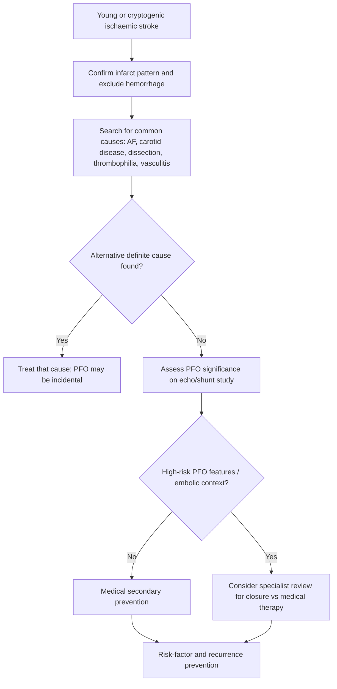
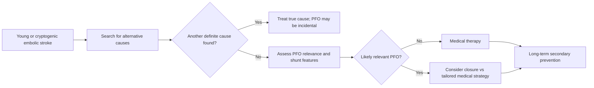

# Patent foramen ovale and selected young-stroke prevention issues

Related: [[../Stroke Medicine MOC|Stroke Medicine MOC]] · [[../Secondary Prevention|Secondary Prevention]] · [[Vascular and cardiac source management|Vascular and cardiac source management]] · [[Atrial fibrillation-related stroke prevention|Atrial fibrillation-related stroke prevention]] · [[Carotid stenosis and carotid endarterectomy indications|Carotid stenosis and carotid endarterectomy indications]] · [[../Special Stroke Scenarios/Basilar artery occlusion|Basilar artery occlusion]]

> [!important]
> In **young stroke** or apparently **cryptogenic stroke**, clinicians must think beyond routine atherosclerosis. **Patent foramen ovale (PFO)** may allow **paradoxical embolism**, but not every discovered PFO is causal. The exam theme is: **Was the stroke likely embolic and otherwise unexplained? Is the PFO clinically relevant? Should secondary prevention be antiplatelet therapy, anticoagulation, or closure in selected patients?**

## Learning Objectives
- Define PFO and explain how it may relate to stroke.
- Recognize when PFO is likely incidental versus clinically relevant.
- Outline evaluation of **young stroke** and cryptogenic embolic stroke.
- Distinguish medical therapy from selected **PFO closure** pathways.
- Recall the major FCPS/MRCP pearls and traps in young-stroke prevention.

## Definition
A **patent foramen ovale (PFO)** is a persistent communication between the right and left atria due to incomplete postnatal closure of the foramen ovale. In selected patients, especially younger adults with **cryptogenic embolic stroke**, it may provide a route for **paradoxical embolism**, allowing venous thrombus to bypass the pulmonary circulation and enter the arterial system.

## Core Anatomy
- The fetal foramen ovale allows blood flow from the **right atrium** to the **left atrium**.
- After birth, increased left atrial pressure usually functionally closes it.
- In some adults the flap remains potentially patent.
- PFO may coexist with:
  - **atrial septal aneurysm**
  - large interatrial shunt
  - prominent eustachian valve / Chiari network
- These associated findings may increase suspicion that the PFO is clinically relevant.

## Core Physiology
- Normally, venous thrombi are filtered by the pulmonary circulation.
- If right atrial pressure transiently exceeds left atrial pressure (e.g. Valsalva, cough, straining), a PFO may permit **right-to-left shunting**.
- A venous thrombus can then reach the cerebral circulation, causing **paradoxical embolic stroke**.
- However, PFO is common in the general population, so a detected PFO is **not automatically causal**.

## Normal Values / Important Cut-offs
- No single bedside percentage defines a causal PFO by itself; interpretation depends on context.
- High-yield exam logic:
  - **young patient**
  - **embolic-appearing stroke**
  - **no better cause found after proper workup**
  - **high-risk PFO features** → closure may be considered
- Antiplatelet therapy is often used when closure is not performed and no clear alternative indication for anticoagulation exists.
- Anticoagulation becomes more relevant if there is proven venous thrombosis or another thromboembolic indication.

## Classification
### By clinical relevance
- Incidental PFO
- Possible stroke-related PFO
- Probable clinically relevant PFO in otherwise cryptogenic embolic stroke

### By associated features
- PFO alone
- PFO with large shunt
- PFO with atrial septal aneurysm
- PFO with documented venous thromboembolism/paradoxical embolic context

### By prevention pathway
- Antiplatelet-based secondary prevention
- Anticoagulation in selected thromboembolic contexts
- Device closure + ongoing tailored antithrombotic therapy

## Etiology / Causes
### Causes of stroke in a young patient that must be considered alongside PFO
- Arterial dissection
- Cardioembolism including AF or structural heart disease
- Thrombophilia / hypercoagulable state
- Vasculitis
- Illicit drug-related stroke
- Migraine-associated mimic / nonvascular events
- Small-vessel rare disorders
- Infective or inflammatory causes

### Why PFO matters
- It provides a potential conduit for venous clot to reach systemic arteries.

## Risk Factors
### Features increasing suspicion that the PFO is relevant
- Younger age
- Embolic cortical infarct pattern
- No significant carotid/intracranial atherosclerosis
- No AF detected despite adequate monitoring
- Atrial septal aneurysm or large shunt
- History suggestive of venous thrombosis, long travel, immobilization, Valsalva trigger

### Features increasing suspicion that PFO is incidental
- Strong alternative stroke mechanism present
- Older patient with multiple vascular risk factors and atherothrombotic disease
- Lacunar infarct pattern
- No embolic imaging features

## Pathophysiology
Paradoxical embolism occurs when thrombus from the venous system crosses an interatrial communication into the systemic circulation. A PFO alone is not disease unless a clinically meaningful embolic event can plausibly be linked to it. In younger patients with embolic-appearing infarcts and no other identified cause, the PFO may be considered pathogenic, especially when associated with large shunt or atrial septal aneurysm. Secondary prevention then focuses on reducing future embolic passage through medical therapy and, in selected cases, closure.

## Clinical Features
### Clues suggesting a PFO-related stroke scenario
- Young or relatively young patient with ischemic stroke
- Embolic cortical infarct without obvious carotid or AF cause
- History of DVT, prolonged immobility, recent travel, postpartum state, or Valsalva trigger
- Coexisting atrial septal aneurysm or high-risk shunt features on imaging

### Young-stroke redirection clues
- Neck pain/trauma → think dissection
- Fever/infection → consider infective causes
- Drug history / vasoconstrictive substances
- Recurrent miscarriages / thrombosis history → thrombophilia/APS possibility
- Connective tissue or vasculitic symptoms

## Approach / Algorithm

## Investigations
### Stroke-mechanism workup
- CT/MRI brain to define infarct pattern
- Vascular imaging to exclude carotid/intracranial large-artery disease
- ECG and telemetry / prolonged rhythm monitoring to exclude AF
- Routine stroke blood work

### PFO-specific evaluation
- **Echocardiography**, often with **bubble study**
- Consider transesophageal echo when anatomy/detail matters
- Assess for:
  - shunt size
  - atrial septal aneurysm
  - associated structural findings

### Young-stroke extension workup when appropriate
- Venous thrombosis evaluation if clinical suspicion exists
- Thrombophilia/APS testing in selected patients
- Dissection evaluation if history or imaging suggests it
- Autoimmune/inflammatory workup when clinically indicated

## Interpretation Frameworks
### When a PFO is more likely causal
| Feature | Suggests higher relevance |
|---|---|
| Younger age | Yes |
| Embolic cortical infarct | Yes |
| No AF or carotid culprit | Yes |
| Atrial septal aneurysm / large shunt | Yes |
| Venous thrombotic context | Yes |

### When a PFO is more likely incidental
| Feature | Suggests incidental finding |
|---|---|
| Clear carotid stenosis or AF cause | Yes |
| Older patient with strong atherosclerotic mechanism | Yes |
| Lacunar infarct pattern | Yes |
| Minimal workup before labeling cryptogenic | Yes |

### Secondary-prevention options
| Situation | Likely strategy |
|---|---|
| PFO detected but likely incidental | Treat the true stroke mechanism |
| Cryptogenic embolic stroke with relevant PFO | Antiplatelet therapy or selected closure pathway |
| Proven venous thrombosis / thromboembolic state | Consider anticoagulation context |

## Diagnosis
PFO-related secondary prevention should only be considered after:
1. Confirming true ischemic stroke/TIA.
2. Performing a reasonable workup for competing causes.
3. Demonstrating PFO on appropriate imaging.
4. Judging whether the stroke is **cryptogenic/embolic** and the PFO is plausibly relevant rather than incidental.

## Differential Diagnosis
- Carotid stenosis-related stroke
- AF-related cardioembolic stroke
- Arterial dissection
- Small-vessel lacunar infarct
- Hypercoagulable state / antiphospholipid syndrome
- Vasculitis
- Infective endocarditis or structural cardiac embolic sources

## Tables / Comparison Charts
### PFO-related stroke vs AF-related stroke
| Feature | PFO-related/cryptogenic embolic stroke | AF-related stroke |
|---|---|---|
| Typical age | Younger | Older, but can vary |
| Core mechanism | Paradoxical embolism | Left atrial thromboembolism |
| Monitoring need | Search for competing causes | Confirm arrhythmia burden |
| Main long-term strategy | Antiplatelet or closure in selected cases | Anticoagulation |

### Young stroke approach
| Domain | Examples |
|---|---|
| Arterial | Dissection, vasculitis |
| Cardiac | PFO, cardiomyopathy, endocarditis |
| Hematologic | APS, thrombophilia |
| Toxin/drug | Cocaine, amphetamine-related vasculopathy |
| Miscellaneous | Genetic/rare vascular disorders |

## Management
### 1. Core principle
Do **not** assume every PFO discovered after stroke is causal. Mechanism attribution comes first.

### 2. If another clear stroke mechanism exists
- Treat that mechanism directly.
- The PFO may simply be incidental.

### 3. If embolic stroke is otherwise unexplained and PFO is considered relevant
- Use individualized secondary prevention.
- Options include:
  - **antiplatelet therapy**
  - **selected PFO closure** in suitable patients
  - **anticoagulation** if there is another compelling thromboembolic indication or venous thrombosis context

### 4. Selected PFO closure pathway
Closure may be considered when:
- the patient is relatively young,
- the stroke is non-lacunar and embolic in pattern,
- appropriate workup does not identify a better cause,
- and PFO features suggest likely relevance.

### 5. General young-stroke prevention
- Blood pressure, diabetes, smoking, lipids, exercise, and weight still matter.
- Avoid oral contraceptive / estrogen-related thrombosis risk when relevant.
- Evaluate pregnancy/postpartum context when appropriate.
- Treat DVT source if present.

### 6. Follow-up logic
- Review recurrence risk, symptoms, and adherence.
- Reassess if new rhythm evidence later shows AF or another clearer mechanism.

## Drug Interactions / Contraindications / Comorbidity Cautions
- Antiplatelets increase bleeding risk, especially with NSAIDs or prior GI bleed.
- Anticoagulation should not be chosen casually for every PFO; it is usually reserved for selected thromboembolic contexts.
- Device closure introduces procedural and short-term antithrombotic considerations.
- In women of childbearing age, pregnancy and estrogen exposure may alter thrombotic context and counseling.
- Thrombophilia/APS may redirect long-term strategy away from simple antiplatelet-alone logic.

## Procedures / Indications / Contraindications
### Bubble study / echo-based PFO assessment
**Indications**
- Cryptogenic or young embolic stroke evaluation

**Purpose**
- Detect interatrial shunt and define high-risk features

### PFO device closure
**Indications**
- Selected younger patients with likely PFO-related cryptogenic embolic stroke after proper exclusion of alternative causes

**Contraindications / cautions**
- PFO likely incidental
- Another definite stroke mechanism identified
- Unsuitable anatomy or procedural risk issues

## Procedure Mini-Sections
### Bubble study
- **Principle:** agitated saline demonstrates right-to-left interatrial shunt
- **Use:** supports PFO detection and shunt assessment
- **Viva pearl:** a positive bubble study alone does not prove causality.

### PFO closure
- **Principle:** device closure reduces future paradoxical embolic passage
- **Best use case:** selected younger patients with likely PFO-related cryptogenic embolic stroke
- **Complications:** procedural complications, arrhythmia, device-related issues
- **Viva pearl:** closure is not for every detected PFO; it is for the **right patient** after exclusion of better causes.

## Complications
### Of unrecognized relevant PFO in selected patients
- Recurrent embolic stroke/TIA
- Systemic embolism in paradoxical embolic states

### Of overcalling PFO causality
- Missing the true stroke mechanism
- Inappropriate closure or inappropriate antithrombotic strategy

### Of closure procedure
- Access complications
- Arrhythmia
- Device-related problems
- Need for follow-up antithrombotic planning

## Red Flags / Emergencies
- Young patient with embolic stroke and no obvious cause after initial workup
- DVT/PE symptoms in a stroke patient with PFO
- Recurrent cryptogenic embolic events despite medical therapy
- Cervical pain/trauma in “young stroke” — do not miss dissection
- Fever, murmur, or sepsis signs — do not miss endocarditis as the real cause

## Prognosis
- Prognosis depends mainly on correct mechanism identification.
- Selected patients with truly relevant PFO may have improved recurrence prevention with targeted therapy or closure.
- Mislabeling an incidental PFO as causal can worsen prognosis by delaying proper treatment of the real cause.

## Topic Correlation
- [[Atrial fibrillation-related stroke prevention]] — major cardioembolic competing mechanism
- [[Carotid stenosis and carotid endarterectomy indications]] — large-artery competing mechanism
- [[Antiplatelet therapy after ischaemic stroke]] — common medical therapy if closure is not chosen and no anticoagulation indication exists
- [[Anticoagulation timing after cardioembolic stroke]] — relevant when another embolic/thrombotic context requires anticoagulation

## Special Situations
### Pregnancy / postpartum state
- Hypercoagulability and venous thrombosis risk may make paradoxical embolism more plausible.

### Oral contraceptive / estrogen exposure
- Raises thrombotic considerations in young women.

### Suspected venous thrombosis
- Search for DVT/PE when paradoxical embolism is plausible.

### Older patient with incidental PFO
- Be cautious; an incidental PFO is common and often not the main cause.

## FCPS/MRCP High-Yield Points
- PFO is common; **finding it does not prove causation**.
- Think of PFO particularly in **young or cryptogenic embolic stroke**.
- The best candidate for closure is a **selected younger patient with embolic stroke and no better cause found**.
- Exclude AF, carotid disease, and dissection before blaming the PFO.
- Antiplatelet therapy is often used when closure is not performed and anticoagulation is not otherwise indicated.
- Anticoagulation is more relevant if venous thromboembolism or another clear thromboembolic indication exists.

## Common Viva Questions
- What is a patent foramen ovale?
- How can a PFO cause stroke?
- Why is every PFO not automatically treated?
- Which young stroke patients should make you think of PFO?
- When may PFO closure be considered?

## Common Confusions / Exam Traps
- Assuming every PFO found after stroke is causal.
- Forgetting to exclude AF and carotid disease first.
- Ignoring dissection and thrombophilia in young stroke workup.
- Treating all PFO patients with anticoagulation regardless of context.
- Forgetting that a lacunar pattern argues against paradoxical embolism as the main mechanism.

## Mnemonics
### PFO relevance: **Y-E-S**
- **Y**oung / cryptogenic stroke
- **E**mbolic pattern
- **S**hunt with no better Stroke cause

## Mind Map
- PFO and young stroke
  - anatomy
    - interatrial flap
    - shunt
  - mechanism
    - paradoxical embolism
    - DVT source
  - workup
    - echo + bubble study
    - AF monitoring
    - carotid imaging
    - thrombophilia/dissection review
  - treatment
    - antiplatelet
    - selected closure
    - anticoagulation in special contexts
  - cautions
    - incidental PFO
    - missed true mechanism

## Flowchart

## Suggested Visuals / Image Notes
- Diagram of **paradoxical embolism through PFO**
- Echo image / bubble study concept figure
- Comparison chart: **PFO-related young stroke vs AF-related stroke vs carotid stroke**
- Young-stroke evaluation map: dissection, thrombophilia, PFO, AF, vasculitis

## Suggested Video References
- Explainer on **PFO, bubble study, and paradoxical embolism**
- Review of **young stroke workup**
- Teaching video on **cryptogenic stroke and selected PFO closure indications**

## One-Page Revision Summary
### PFO and young stroke: last-minute exam sheet
- PFO = persistent interatrial communication.
- Possible stroke mechanism = **paradoxical embolism**.
- PFO is common and may be **incidental**.
- Suspect relevance when the patient is **young**, stroke is **embolic**, and no better cause is found.
- Workup should exclude **AF**, **carotid disease**, **dissection**, **thrombophilia**, and other cardiac causes.
- Echo with **bubble study** helps detect and characterize shunt.
- Antiplatelet therapy is often used when closure is not chosen and no anticoagulation indication exists.
- Anticoagulation is mainly for selected thromboembolic contexts, such as proven venous thrombosis.
- **PFO closure** is for selected younger patients with likely PFO-related cryptogenic embolic stroke.
- Never overcall causality without full mechanism review.

## 24-Hour Recall Prompts
- What is paradoxical embolism?
- Why is a PFO often incidental?
- What 4 alternative causes must you exclude in young stroke?
- When might closure be considered?
- When would anticoagulation be more relevant than antiplatelet therapy?

## 7-Day / 15-Day / 30-Day Revision Tracker
- **Day 1:** explain how a venous clot can cause arterial stroke through PFO.
- **Day 7:** redraw the young-stroke/PFO algorithm.
- **Day 15:** answer MCQs/SBAs without notes.
- **Day 30:** compare PFO-related stroke prevention with AF-related prevention aloud.

## Must Know / Should Know / Nice to Know
### Must Know
- PFO is common and may be incidental
- Paradoxical embolism is the proposed mechanism
- Closure is for selected younger cryptogenic embolic-stroke patients
- Exclude AF/carotid/dissection first

### Should Know
- Atrial septal aneurysm and large shunt increase suspicion of relevance
- DVT context supports paradoxical embolism

### Nice to Know
- Detailed device/procedural nuances and follow-up regimens

## My Weak Points
- Do I overcall every PFO as causal?
- Do I remember to exclude AF and dissection?
- Can I explain when closure is considered?
- Do I understand why antiplatelet vs anticoagulation depends on context?

## Self-Test Scorecard
- Mechanism understanding: /10
- Young-stroke workup recall: /10
- Treatment-selection confidence: /10
- Trap avoidance: /10
- Viva readiness: /10

**Interpretation**
- **<35/50** = weak topic
- **35–44/50** = acceptable but not secure
- **45+/50** = exam ready

## Exam Answer Modes
### Long-answer mode
Define PFO, describe paradoxical embolism, discuss how to evaluate cryptogenic/young stroke, explain how to judge whether PFO is causal or incidental, and outline medical versus closure-based secondary prevention.

### Short-note mode
PFO may cause stroke by paradoxical embolism but is often incidental. It becomes more clinically relevant in younger patients with embolic cryptogenic stroke and no alternative mechanism. Secondary prevention may involve antiplatelet therapy, selected anticoagulation contexts, or closure in carefully chosen patients.

### Viva mode
“PFO is important in selected **young or cryptogenic embolic stroke** patients, but it is not automatically causal. The first job is to exclude other stroke mechanisms such as AF, carotid disease, and dissection. If the PFO is likely relevant, selected patients may be considered for closure or tailored medical secondary prevention.”

## Summary
PFO is a common anatomical finding and only sometimes a meaningful stroke mechanism. In young or cryptogenic embolic stroke, paradoxical embolism through a PFO should be considered, especially if there are high-risk shunt features or venous thrombotic context and no better alternative cause. Proper secondary prevention depends on correct mechanism attribution and may include antiplatelet therapy, selected anticoagulation, or closure in carefully chosen patients.

## MCQs (10)
1. The proposed mechanism by which a PFO causes stroke is:
   - A. Rupture of berry aneurysm
   - B. Paradoxical embolism
   - C. Direct carotid vasculitis
   - D. Subdural hematoma
   - E. Demyelination

2. A discovered PFO after stroke should be considered:
   - A. Always causal
   - B. Always irrelevant
   - C. Potentially incidental unless context supports causality
   - D. A surgical emergency in all cases
   - E. Equivalent to AF

3. Which patient most strongly suggests a relevant PFO?
   - A. Elderly patient with lacunar infarct and severe carotid stenosis
   - B. Young patient with embolic cortical infarct and no other cause found
   - C. Patient with intracerebral hemorrhage
   - D. Patient with Bell palsy
   - E. Patient with chronic migraine only

4. Which investigation helps detect a PFO?
   - A. Spirometry
   - B. Bubble-study echocardiography
   - C. Colonoscopy
   - D. Audiogram
   - E. Nerve conduction study

5. Which condition must be excluded before attributing stroke to PFO?
   - A. AF
   - B. Carotid stenosis
   - C. Dissection
   - D. All of the above
   - E. None of the above

6. A high-risk associated feature that increases suspicion of PFO relevance is:
   - A. Atrial septal aneurysm
   - B. Sinus bradycardia only
   - C. Otitis media
   - D. Hypothyroidism
   - E. Cataract

7. In many selected PFO-related cryptogenic stroke patients without another anticoagulation indication, a common medical strategy is:
   - A. Antiplatelet therapy
   - B. Mannitol
   - C. Antibiotics
   - D. CEA
   - E. Corticosteroids only

8. PFO-related stroke is particularly considered in:
   - A. Posterior neck strain only
   - B. Young stroke / cryptogenic embolic stroke
   - C. Established hypertensive basal ganglia hemorrhage
   - D. Peripheral neuropathy
   - E. Parkinson disease

9. Why is PFO closure not recommended for every patient with PFO after stroke?
   - A. Because PFO is always benign
   - B. Because many PFOs are incidental and not causative
   - C. Because closure can never work
   - D. Because PFO never causes embolism
   - E. Because all patients need carotid stents instead

10. Which context makes anticoagulation more relevant in a PFO patient?
   - A. Proven venous thrombosis / thromboembolic state
   - B. Isolated tension headache
   - C. Mild eczema
   - D. Viral rhinitis
   - E. Cataract only

## SBA Questions (10)
1. A 34-year-old woman has an embolic cortical infarct. Carotid imaging is normal, ECG and telemetry show no AF, and bubble echo shows a PFO with atrial septal aneurysm. What is the key principle?
   - A. The PFO is automatically irrelevant
   - B. The PFO may be clinically relevant and specialist review for closure versus medical therapy is reasonable
   - C. She must have carotid endarterectomy
   - D. Antiplatelet therapy is always contraindicated
   - E. Stroke mechanism no longer matters

2. A 29-year-old man has stroke after long-haul travel and calf swelling. Echo shows PFO. What mechanism becomes especially plausible?
   - A. Hypertensive hemorrhage
   - B. Paradoxical embolism from venous thrombosis
   - C. Temporal arteritis
   - D. Subarachnoid hemorrhage
   - E. Trigeminal neuralgia

3. A 67-year-old patient has lacunar stroke and incidental PFO. What is the best statement?
   - A. PFO is definitely the cause
   - B. Lacunar pattern makes PFO less likely to be the main mechanism
   - C. Immediate closure is mandatory
   - D. AF workup is forbidden
   - E. Anticoagulation is always required

4. A young patient with stroke is found to have PFO. What must be done before labeling it causal?
   - A. Exclude competing causes such as AF, carotid disease, and dissection
   - B. Ignore vascular imaging
   - C. Assume all PFOs are pathogenic
   - D. Start steroids immediately
   - E. Avoid rhythm monitoring

5. Which test best demonstrates right-to-left shunt through a PFO?
   - A. Bubble study echocardiography
   - B. Pure-tone audiometry
   - C. Peak expiratory flow
   - D. EMG
   - E. Mantoux test

6. A 32-year-old woman has cryptogenic embolic stroke and a PFO but also newly discovered AF on prolonged monitoring. What is the key exam point?
   - A. AF may be the more important mechanism than the PFO
   - B. The PFO always overrides AF
   - C. Stroke prevention should ignore mechanism
   - D. Closure alone solves everything
   - E. Carotid surgery is mandatory

7. Which statement is most correct about PFO closure?
   - A. It is for every person with a PFO
   - B. It may be considered in selected younger patients with likely PFO-related cryptogenic embolic stroke
   - C. It replaces all stroke workup
   - D. It is the first-line treatment for lacunar stroke
   - E. It is only used for intracerebral hemorrhage

8. A patient with likely PFO-related stroke but no DVT and no other anticoagulation indication is being considered for medical therapy. What is a common option?
   - A. Antiplatelet therapy
   - B. Mannitol indefinitely
   - C. Acetazolamide only
   - D. High-dose steroids forever
   - E. No prevention needed

9. Why are young-stroke protocols broader than just PFO testing?
   - A. Because young stroke may also result from dissection, thrombophilia, vasculitis, and other non-atherosclerotic causes
   - B. Because PFO never causes stroke
   - C. Because MRI is useless in young patients
   - D. Because carotid disease is impossible in young adults
   - E. Because AF never occurs in younger adults

10. Which statement best summarizes this topic?
   - A. Every PFO after stroke should be closed
   - B. PFO is either always causal or always incidental
   - C. PFO relevance depends on age, embolic pattern, exclusion of other causes, and associated high-risk features
   - D. Stroke mechanism should not affect prevention strategy
   - E. All young strokes are caused by PFO

## Flashcards
- Q: What is the main stroke mechanism linked to PFO?
  A: Paradoxical embolism.

- Q: Why is every detected PFO not automatically causal?
  A: Because PFO is common in the general population and may be incidental.

- Q: What test commonly identifies a PFO shunt?
  A: Bubble-study echocardiography.

- Q: What associated feature may make a PFO more suspicious as a stroke mechanism?
  A: Atrial septal aneurysm or large shunt.

- Q: In what patient group is PFO especially considered?
  A: Young or cryptogenic embolic stroke patients.

- Q: What major competing causes must be excluded before blaming a PFO?
  A: AF, carotid disease, dissection, and other alternative causes.

- Q: When is anticoagulation more relevant than simple antiplatelet therapy in a PFO patient?
  A: When there is proven venous thrombosis or another thromboembolic indication.

- Q: What is the key principle about PFO closure?
  A: It is for selected patients, not every detected PFO.

- Q: What infarct pattern makes PFO less likely to be the main mechanism?
  A: Lacunar infarct pattern.

- Q: What is the simple exam rule?
  A: Young embolic cryptogenic stroke + no better cause + relevant PFO features = think selected closure/tailored prevention.

## Answer Key with Explanations
### MCQs
1. **B** — PFO-related stroke is classically explained by paradoxical embolism.
2. **C** — A detected PFO may be incidental unless the context supports causality.
3. **B** — Young patient, embolic pattern, and no better cause strongly support possible relevance.
4. **B** — Bubble-study echocardiography is a standard test for PFO detection.
5. **D** — AF, carotid disease, and dissection must all be considered before blaming a PFO.
6. **A** — Atrial septal aneurysm is a classic higher-risk associated feature.
7. **A** — Antiplatelet therapy is a common medical strategy in selected non-closure cases.
8. **B** — PFO is especially relevant in young/cryptogenic embolic stroke workup.
9. **B** — Many PFOs are incidental and not the true cause of stroke.
10. **A** — Anticoagulation becomes more relevant when proven venous thrombosis or another thromboembolic indication exists.

### SBAs
1. **B** — This is a classic scenario where the PFO may be genuinely relevant and closure discussion is reasonable.
2. **B** — Travel plus calf swelling strongly suggests DVT with possible paradoxical embolism.
3. **B** — Lacunar stroke makes PFO less likely to be the main mechanism.
4. **A** — Competing mechanisms must be excluded first.
5. **A** — Bubble-study echo is the standard way to demonstrate right-to-left shunt.
6. **A** — Newly discovered AF may be a more compelling embolic mechanism than the PFO.
7. **B** — Closure is for selected younger likely PFO-related cryptogenic embolic stroke patients.
8. **A** — Antiplatelet therapy is often used when closure is not done and anticoagulation is not otherwise indicated.
9. **A** — Young stroke has a broad differential beyond PFO.
10. **C** — PFO relevance depends on patient profile, stroke pattern, workup exclusion, and associated features.