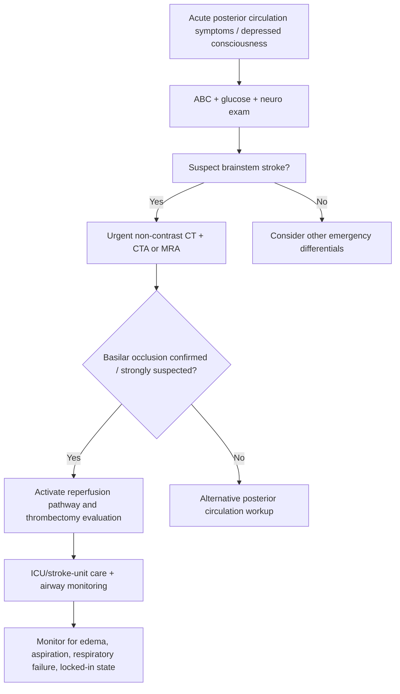
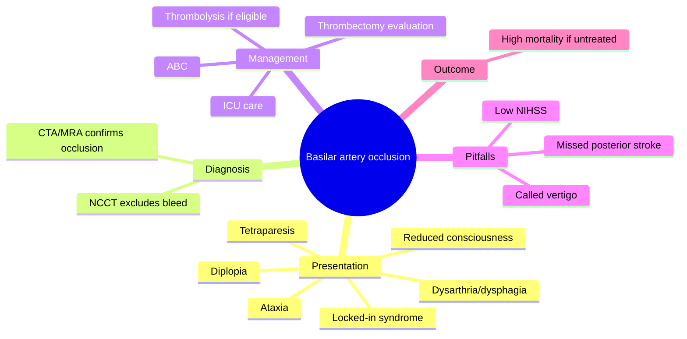
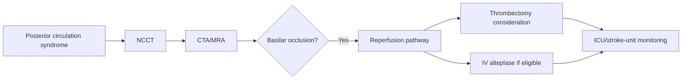

# Basilar artery occlusion

Related: [[../Stroke Medicine MOC|Stroke Medicine MOC]] · [[../Special Stroke Scenarios|Special Stroke Scenarios]] · [[Posterior circulation and brainstem issues|Posterior circulation and brainstem issues]] · [[Locked-in syndrome|Locked-in syndrome]] · [[Lateral medullary syndrome|Lateral medullary syndrome]] · [[../Reperfusion Therapy/Mechanical thrombectomy eligibility|Mechanical thrombectomy eligibility]]

> [!important]
> **Basilar artery occlusion (BAO)** is a devastating posterior-circulation emergency that is commonly missed because presentation may be variable. Think of it whenever there is acute **brainstem dysfunction**, **decreased consciousness**, **tetraparesis**, or a dramatic posterior-circulation syndrome.

## Learning Objectives
- Define basilar artery occlusion and explain why it is time-critical.
- Recognize classic and subtle clinical presentations, including locked-in syndrome.
- Outline acute imaging and reperfusion-oriented management with major exam cautions.

## Definition
**Basilar artery occlusion** is acute thrombosis or embolic obstruction of the basilar artery causing ischemia of the brainstem, cerebellum, thalami, occipital territories, or combinations of these posterior-circulation structures.

## Core Anatomy
- The **basilar artery** is formed by the union of the vertebral arteries.
- It supplies the **pons**, gives branches to the cerebellum, and contributes to **posterior cerebral circulation**.
- Key branch territories include perforators to the pons and major branches such as **AICA**, **SCA**, and terminal contribution to **PCA** territories.
- Occlusion can therefore produce mixed cranial nerve, long-tract, cerebellar, consciousness, and visual syndromes.

## Core Physiology
- Brainstem tissue has little tolerance for prolonged ischemia.
- Interruption of basilar flow can injure corticospinal, corticobulbar, reticular activating, and cerebellar pathways.
- Collateral flow may delay or fragment presentation, which can create diagnostic traps.
- Reperfusion can be lifesaving and disability-limiting if achieved quickly in suitable patients.

## Normal Values / Important Cut-offs
- Hyperacute recognition is crucial because reperfusion benefit falls with time.
- Posterior circulation stroke may have a **low or misleading NIHSS** despite severe pathology.
- Reduced consciousness, respiratory compromise, bilateral long-tract signs, and eye-movement abnormalities are major red flags.
- CTA/MRA is essential because non-contrast CT alone may miss the vascular occlusion itself.

## Classification
### By clinical severity
- Prodromal/fluctuating posterior circulation syndrome
- Established severe brainstem stroke
- Catastrophic BAO with coma or locked-in syndrome

### By mechanism
- Embolic occlusion
- In-situ thrombosis over vertebrobasilar atherosclerosis
- Dissection-related propagation in selected cases

### By topography
- Proximal basilar occlusion
- Mid-basilar occlusion
- Distal/top-of-the-basilar syndrome

## Etiology / Causes
- Large-artery atherosclerosis in vertebrobasilar circulation
- Cardioembolism
- Vertebral artery dissection with extension
- Thrombotic occlusion on existing basilar stenosis
- Less commonly hypercoagulable states

## Risk Factors
- Hypertension
- Diabetes mellitus
- Smoking
- Dyslipidaemia
- Atrial fibrillation or other embolic cardiac source
- Previous TIA/stroke
- Known vertebrobasilar disease

## Pathophysiology
Occlusion of the basilar artery reduces perfusion to critical brainstem and posterior circulation territories. Depending on clot location and collateral supply, patients may present with transient prodromal symptoms, stuttering deficits, or sudden collapse. Continued ischemia causes infarction of pontine structures, cranial nerve nuclei, cerebellar connections, and thalamic/occipital territories, producing coma, quadriparesis, gaze abnormalities, respiratory failure, or locked-in syndrome.

## Clinical Features
### Classic presentations
- Sudden reduced consciousness or coma
- Dysarthria and dysphagia
- Diplopia or abnormal eye movements
- Bilateral weakness or quadriparesis
- Ataxia
- Vertigo with focal brainstem signs
- Respiratory irregularity
- Visual symptoms or cortical blindness if distal involvement

### High-yield clues
- **Crossed signs** or multiple cranial nerve findings
- **Tetraparesis** rather than simple unilateral weakness
- **Fluctuating posterior symptoms** before collapse
- **Locked-in syndrome**: awake patient with quadriplegia and anarthria but preserved consciousness and vertical eye movements in classic cases

### Mimic traps
- “Dizziness” dismissed as benign vestibular disease despite focal signs
- Reduced consciousness misattributed only to metabolic causes
- Isolated low GCS without rapid posterior circulation imaging

## Approach / Algorithm

## Investigations
### Immediate
- ABC assessment and capillary blood glucose
- Non-contrast CT head to exclude hemorrhage
- **CT angiography** or **MR angiography** to identify basilar occlusion
- CBC, renal function, electrolytes
- ECG
- Coagulation profile if reperfusion therapy is being considered

### Additional / supportive
- MRI brain when diagnosis remains uncertain or to define infarct burden
- Cardiac rhythm monitoring / Holter / echocardiography for embolic source
- Vascular imaging of vertebral arteries in selected cases

## Interpretation Frameworks
### When to suspect BAO clinically
| Feature | Why it matters |
|---|---|
| Decreased consciousness + brainstem signs | Highly concerning for posterior circulation catastrophe |
| Bilateral long-tract deficits | Suggests central brainstem process |
| Dysarthria/dysphagia + ocular abnormalities | Strong brainstem localization clue |
| Severe posterior symptoms with low NIHSS | NIHSS may underestimate BAO |

### Imaging logic
1. Exclude hemorrhage on non-contrast CT.
2. Do **CTA/MRA urgently** when posterior circulation stroke is suspected.
3. Confirm site of basilar occlusion and look for associated vertebral disease.
4. Consider infarct burden and reperfusion candidacy.

## Diagnosis
Diagnosis is made by recognizing an acute posterior-circulation/brainstem syndrome and confirming basilar artery occlusion on vascular imaging.

## Differential Diagnosis
- Other posterior circulation ischemic stroke without basilar trunk occlusion
- Intracerebral hemorrhage in brainstem/cerebellum
- Cerebellitis or posterior fossa mass lesion
- Metabolic encephalopathy
- Seizure/post-ictal state
- Peripheral vestibular disorder when dizziness predominates but **without** focal brainstem signs

## Tables / Comparison Charts
### BAO vs benign vertigo-type presentation
| Feature | Basilar artery occlusion | Benign peripheral vestibular disorder |
|---|---|---|
| Brainstem signs | Present or evolving | Absent |
| Consciousness | May fall | Usually preserved |
| Weakness | May be bilateral | Absent |
| Eye movement abnormalities | Central patterns common | Peripheral pattern more likely |
| Outcome if missed | Catastrophic | Usually not catastrophic |

### Top-of-the-basilar clues
| Finding | Suggestion |
|---|---|
| Altered consciousness | Thalamic/brainstem involvement |
| Visual disturbance | PCA/top-of-basilar involvement |
| Oculomotor deficits | Midbrain/rostral brainstem ischemia |

## Management
### Immediate stabilization
- ABC first; airway support may be urgently needed.
- Treat as a **time-critical stroke emergency**.
- Avoid being falsely reassured by fluctuating symptoms or deceptively low NIHSS.

### Reperfusion strategy
- Evaluate urgently for **mechanical thrombectomy** when vascular imaging confirms BAO and patient is appropriate.
- IV thrombolysis may also be considered in eligible patients within thrombolysis criteria.
- Reperfusion decisions should move rapidly because untreated BAO carries high mortality and disability.

### Supportive neurocritical care
- ICU or high-dependency monitoring in severe cases
- Airway protection and ventilation if needed
- Aspiration precautions and swallow assessment when possible
- Temperature, glucose, and oxygen optimization
- Monitor for edema, respiratory failure, and further neurological decline

### Secondary prevention
- Once stabilized, define mechanism: atherosclerotic, cardioembolic, dissection, etc.
- Use antiplatelet, anticoagulation, statin, or vascular risk-factor control according to the true mechanism.

## Drug Interactions / Contraindications / Comorbidity Cautions
- Posterior stroke symptoms should not delay reperfusion evaluation simply because they do not look like classic MCA stroke.
- Thrombolysis bleeding risks and contraindications still apply.
- Sedation/intubation can obscure neurological examination; document pre-intubation findings when possible.
- Polypharmacy and hemodynamic instability in elderly patients complicate monitoring and airway management.

## Procedures / Indications / Contraindications
- **Mechanical thrombectomy**: major reperfusion procedure to consider in confirmed BAO where appropriate.
- **IV thrombolysis**: if otherwise eligible and within criteria.
- **Intubation/ventilatory support**: for airway compromise, reduced consciousness, or respiratory failure.

## Procedure Mini-Sections
- **Procedure:** Mechanical thrombectomy in BAO
- **Indications:** Confirmed basilar artery occlusion with appropriate reperfusion profile
- **Contraindications / cautions:** Depend on imaging, timing, established infarct burden, bleeding risk, and protocol factors
- **Principle:** Endovascular clot retrieval restores posterior circulation perfusion
- **Complications:** Vessel injury, hemorrhage, failed recanalization, edema/reperfusion injury
- **Viva pearl:** BAO is an exam-favorite example of a posterior circulation stroke where thrombectomy thinking is crucial

## Complications
- Coma
- Respiratory failure
- Locked-in syndrome
- Severe dysphagia with aspiration pneumonia
- Cerebellar/brainstem edema
- Death or profound disability

## Red Flags / Emergencies
- Falling consciousness
- Abnormal respiration
- Bilateral motor deficits
- Brainstem eye-movement abnormalities
- Suspected locked-in syndrome
- Posterior circulation symptoms with sudden collapse

## Prognosis
Untreated BAO has a grave prognosis with high mortality and severe disability. Early recognition and reperfusion can markedly improve outcome, but prognosis still depends on clot burden, collateral flow, brainstem infarction extent, age, and speed of treatment.

## Topic Correlation
- [[Locked-in syndrome|Locked-in syndrome]]
- [[Lateral medullary syndrome|Lateral medullary syndrome]]
- [[../Acute Ischaemic Stroke/Brainstem stroke syndromes|Brainstem stroke syndromes]]
- [[../Reperfusion Therapy/Mechanical thrombectomy eligibility|Mechanical thrombectomy eligibility]]
- [[../Reperfusion Therapy/Intravenous alteplase eligibility|Intravenous alteplase eligibility]]

## Special Situations
- **Prodromal transient symptoms:** may precede catastrophic occlusion and should not be ignored.
- **Intubated/comatose patient:** subtle eye movements or preserved awareness may reveal evolving locked-in syndrome.
- **Young patient:** consider vertebral dissection or unusual mechanisms.
- **Atrial fibrillation:** strongly consider cardioembolic cause.

## FCPS/MRCP High-Yield Points
- BAO is a **posterior circulation stroke emergency** with high mortality if missed.
- NIHSS may underestimate severity.
- CTA/MRA is crucial because non-contrast CT alone can miss the occlusion.
- Think of BAO in **decreased consciousness + brainstem signs**.
- **Locked-in syndrome** is a classic association.

## Common Viva Questions
1. What is basilar artery occlusion?
2. Why is basilar artery occlusion often missed?
3. What imaging is required to confirm the diagnosis?
4. How can BAO present clinically?
5. What is locked-in syndrome and why is it relevant here?

## Common Confusions / Exam Traps
- Calling severe posterior circulation stroke “just vertigo.”
- Relying on a low NIHSS to exclude catastrophic posterior stroke.
- Ordering only non-contrast CT and stopping the workup there.
- Missing preserved consciousness in a patient with near-total paralysis.
- Forgetting that BAO may have stuttering prodromal symptoms.

## Mnemonics
- **BASILAR**
  - **B**rainstem signs
  - **A**ltered consciousness
  - **S**peech/swallow problems
  - **I**maging with CTA/MRA urgently
  - **L**ocked-in syndrome clue
  - **A**irway at risk
  - **R**eperfusion pathway

## Mind Map

## Flowchart

## Suggested Visuals / Image Notes
- Vertebrobasilar circulation diagram
- Brainstem cross-section showing long-tract and cranial nerve pathway localization
- CTA image demonstrating basilar occlusion

## Suggested Video References
- Posterior circulation stroke and basilar artery occlusion recognition
- CTA interpretation for large-vessel posterior circulation stroke
- Locked-in syndrome clinical recognition teaching video

## One-Page Revision Summary
### Basilar Artery Occlusion at a Glance
- **Definition:** occlusion of the basilar artery causing brainstem/posterior circulation ischemia
- **Key symptoms:** reduced consciousness, dysarthria, diplopia, bilateral weakness, ataxia, abnormal eye movements
- **Classic association:** **locked-in syndrome**
- **Major trap:** NIHSS can underestimate severity
- **Key test:** **CTA/MRA** after initial hemorrhage exclusion
- **Treatment principle:** urgent reperfusion evaluation, especially thrombectomy thinking
- **Prognosis:** catastrophic if missed or untreated

## 24-Hour Recall Prompts
- Name five clinical clues to basilar artery occlusion.
- Why can BAO be missed on a stroke screen focused on anterior circulation signs?
- What imaging confirms the diagnosis?
- Why is locked-in syndrome classically associated with BAO?
- Why can NIHSS be falsely reassuring?

## 7-Day / 15-Day / 30-Day Revision Tracker
- **Day 1:** Reproduce the BAO emergency pathway from memory.
- **Day 7:** Compare BAO with peripheral vertigo and lateral medullary syndrome.
- **Day 15:** Practice posterior circulation case vignettes.
- **Day 30:** Redo questions and identify localization gaps.

## Must Know / Should Know / Nice to Know
### Must Know
- BAO is a catastrophic posterior circulation emergency
- CTA/MRA is needed to confirm occlusion
- Brainstem signs + low consciousness = major clue
- Thrombectomy thinking is crucial
- Locked-in syndrome association

### Should Know
- Top-of-the-basilar presentations
- Prodromal stuttering symptoms
- Mechanistic causes: embolic vs atherosclerotic vs dissection

### Nice to Know
- Advanced perfusion/imaging nuances beyond core exam need
- Detailed endovascular selection subtleties by protocol

## My Weak Points
- Do I remember that a low NIHSS does not rule out BAO?
- Can I recognize a locked-in patient?
- Do I reflexively order CTA/MRA in posterior circulation emergencies?

## Self-Test Scorecard
- Understanding /10
- Recall /10
- Localization /10
- MCQ performance /10
- Viva confidence /10

**Guide:**
- **<35/50** = weak topic
- **35–44/50** = acceptable but not secure
- **45+/50** = strong exam-ready topic

## Exam Answer Modes
### Long-answer skeleton
1. Definition and anatomy
2. Etiology and pathophysiology
3. Clinical features
4. Imaging diagnosis
5. Acute reperfusion-oriented management
6. Prognosis and complications

### Short-note skeleton
- Definition
- Posterior circulation features
- CTA/MRA diagnosis
- Thrombectomy/reperfusion importance
- Locked-in syndrome link

### Viva skeleton
- “What is BAO?”
- “How does it present?”
- “What imaging confirms it?”
- “Why is it dangerous?”

## Summary
Basilar artery occlusion is a high-mortality posterior circulation stroke caused by acute obstruction of the basilar artery. It can present with reduced consciousness, cranial nerve abnormalities, dysarthria, dysphagia, ataxia, bilateral weakness, or locked-in syndrome. Because clinical presentation may be variable and NIHSS may underestimate severity, a high index of suspicion is essential. Diagnosis requires vascular imaging such as **CTA/MRA**, and management centers on **rapid reperfusion evaluation**, including **mechanical thrombectomy** when appropriate, plus aggressive airway and neurocritical care support.

## MCQs (10)
1. Basilar artery occlusion primarily causes ischemia of the:
   A. Brainstem and posterior circulation structures  
   B. Brachial plexus  
   C. Femoral nerve  
   D. Thyroid gland

2. A classic catastrophic clinical association of BAO is:
   A. Carpal tunnel syndrome  
   B. Locked-in syndrome  
   C. Bell palsy  
   D. Migraine aura

3. Which imaging modality is essential to confirm BAO after initial hemorrhage exclusion?
   A. CTA or MRA  
   B. Skull X-ray  
   C. Bone scan  
   D. Spirometry

4. Which symptom combination most strongly suggests BAO?
   A. Bilateral weakness with dysarthria and reduced consciousness  
   B. Chronic knee pain and fever  
   C. Isolated finger numbness for months  
   D. Tinnitus alone

5. Why may BAO be under-recognized on routine stroke scoring?
   A. It never affects consciousness  
   B. NIHSS may underestimate posterior circulation severity  
   C. CT always shows it clearly without vascular imaging  
   D. It only occurs in children

6. Which of the following is a major management principle in confirmed BAO?
   A. Urgent reperfusion evaluation  
   B. Observation at home  
   C. Delay imaging for 24 hours  
   D. Immediate lumbar puncture

7. Which arterial territory is directly central to BAO?
   A. Vertebrobasilar system  
   B. Coronary circulation  
   C. Renal artery  
   D. Radial artery

8. A patient with severe vertigo, dysarthria, gaze palsy, and fluctuating consciousness should make you think first of:
   A. Benign paroxysmal positional vertigo only  
   B. Basilar artery occlusion  
   C. Carpal tunnel syndrome  
   D. Tension headache

9. Which feature best distinguishes BAO from a benign peripheral vestibular disorder?
   A. Brainstem signs and bilateral deficits  
   B. Earwax  
   C. Seasonal allergy  
   D. Normal CT chest

10. The prognosis of untreated BAO is generally:
    A. Excellent and benign  
    B. Potentially catastrophic with high mortality  
    C. Limited to mild headache only  
    D. Irrelevant clinically

## SBA Questions (10)
1. A 62-year-old man suddenly becomes drowsy, dysarthric, and quadriparetic. Eye movements are abnormal. What is the most important diagnosis to consider urgently?  
   A. Basilar artery occlusion  
   B. Bell palsy  
   C. Carpal tunnel syndrome  
   D. Ménière disease  
   E. Osteoarthritis

2. A patient with suspected posterior circulation stroke has a non-contrast CT that shows no hemorrhage. What is the best next imaging step if BAO is suspected?  
   A. CTA or MRA  
   B. Chest X-ray  
   C. Lumbar puncture only  
   D. Barium swallow  
   E. DEXA scan

3. A 70-year-old woman appears awake but cannot speak or move her limbs, though vertical eye movements are preserved. Which syndrome is most likely?  
   A. Locked-in syndrome  
   B. Guillain-Barré syndrome  
   C. Myasthenic crisis  
   D. Functional aphonia  
   E. Parkinson disease

4. Why is BAO sometimes missed in emergency settings?  
   A. It always presents with obvious aphasia and face-arm weakness only  
   B. Posterior circulation signs can be variable and NIHSS may look deceptively low  
   C. It is visible on ECG alone  
   D. It never causes altered consciousness  
   E. It occurs only after trauma

5. What is the best overall acute management principle once BAO is identified?  
   A. Urgent reperfusion pathway assessment  
   B. Discharge with antiemetics  
   C. Delay all treatment until MRI next week  
   D. Start oral antibiotics  
   E. Give no monitoring

6. A patient presents with acute vertigo, vomiting, dysarthria, and bilateral limb weakness. Which feature most strongly argues against benign peripheral vertigo?  
   A. Brainstem and bilateral motor signs  
   B. Nausea  
   C. Dizziness  
   D. Age over 50  
   E. Hypertension alone

7. In BAO, which reperfusion procedure is especially important to consider?  
   A. Mechanical thrombectomy  
   B. Pleural tap  
   C. Hemodialysis  
   D. Endoscopy  
   E. Cataract extraction

8. Which vessel forms the basilar artery by union?  
   A. Vertebral arteries  
   B. Carotid bifurcations  
   C. Brachial arteries  
   D. Pulmonary veins  
   E. External jugular veins

9. A patient with BAO becomes increasingly hypoventilated and obtunded. What is the most urgent supportive concern?  
   A. Airway and respiratory support  
   B. Knee physiotherapy  
   C. Colonoscopy  
   D. Ear syringing  
   E. Skin prick testing

10. Which statement about BAO prognosis is most accurate?  
    A. It is usually harmless if untreated  
    B. Untreated BAO may cause severe disability or death  
    C. It only causes transient ear symptoms  
    D. It is never associated with coma  
    E. It cannot affect swallowing

## Flashcards
- Q: What is basilar artery occlusion?  
  A: Acute obstruction of the basilar artery causing posterior circulation/brainstem ischemia.
- Q: Name three key clinical clues to BAO.  
  A: Reduced consciousness, dysarthria/dysphagia, bilateral weakness or brainstem eye signs.
- Q: Which imaging test confirms BAO after hemorrhage is excluded?  
  A: CTA or MRA.
- Q: Why can NIHSS be misleading in BAO?  
  A: Posterior circulation severity may be underestimated by the score.
- Q: What classic syndrome is strongly associated with BAO?  
  A: Locked-in syndrome.
- Q: What reperfusion strategy is especially important to consider in BAO?  
  A: Mechanical thrombectomy.
- Q: What benign diagnosis is a dangerous mimic trap in some BAO presentations?  
  A: Peripheral vestibular disorder/“just vertigo.”
- Q: Which vessel pair joins to form the basilar artery?  
  A: The vertebral arteries.
- Q: Why is airway protection often a major issue in BAO?  
  A: Brainstem dysfunction can impair consciousness, breathing, and swallowing.
- Q: What is the general prognosis of untreated BAO?  
  A: Often catastrophic with high mortality or severe disability.

## Answer Key with Explanations
### MCQs
1. **A** — BAO compromises brainstem and other posterior circulation structures.  
2. **B** — Locked-in syndrome is a classic severe consequence of pontine ischemia from BAO.  
3. **A** — Vascular imaging such as CTA/MRA is needed to confirm the occlusion.  
4. **A** — Bilateral deficits, dysarthria, and reduced consciousness strongly suggest brainstem/posterior circulation catastrophe.  
5. **B** — NIHSS may underestimate posterior circulation stroke severity.  
6. **A** — Reperfusion evaluation is central in this high-risk stroke syndrome.  
7. **A** — BAO is a vertebrobasilar circulation disease.  
8. **B** — This is classic for severe posterior circulation stroke, especially BAO.  
9. **A** — Brainstem signs and bilateral deficits are not features of benign peripheral vertigo.  
10. **B** — Untreated BAO carries a grave prognosis.

### SBAs
1. **A** — Drowsiness, quadriparesis, and abnormal eye movements strongly suggest BAO.  
2. **A** — After non-contrast CT excludes hemorrhage, vascular imaging is the critical next step.  
3. **A** — Preserved consciousness with vertical eye movements but quadriplegia/anarthria is classic locked-in syndrome.  
4. **B** — Variable posterior symptoms and low/atypical NIHSS lead to missed diagnosis.  
5. **A** — BAO requires urgent reperfusion-oriented assessment.  
6. **A** — Bilateral motor and brainstem signs point strongly away from benign peripheral vertigo.  
7. **A** — Mechanical thrombectomy is the major endovascular reperfusion strategy to consider.  
8. **A** — The basilar artery is formed by the union of the vertebral arteries.  
9. **A** — Brainstem stroke can rapidly threaten ventilation and airway protection.  
10. **B** — Severe disability or death is common if BAO is not recognized and treated promptly.
