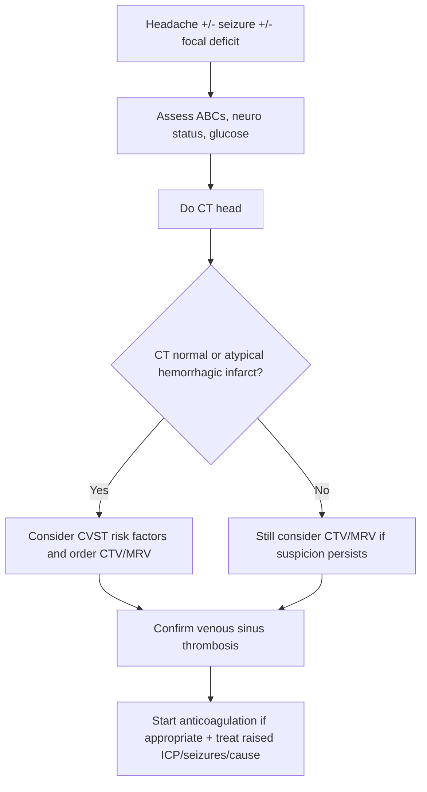
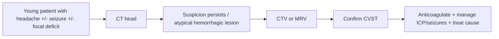

# Cerebral venous sinus thrombosis

Related: [[../Stroke Medicine MOC|Stroke Medicine MOC]] · [[../Special Stroke Scenarios|Special Stroke Scenarios]] · [[Young stroke and uncommon mechanisms|Young stroke and uncommon mechanisms]] · [[Stroke in the young approach|Stroke in the young approach]] · [[Pregnancy-related stroke|Pregnancy-related stroke]]

> [!important]
> **Cerebral venous sinus thrombosis (CVST)** is a venous stroke syndrome caused by thrombosis of the intracranial venous sinuses and/or cerebral veins. The exam pearl is that it often presents with **headache**, **seizure**, **papilloedema**, **focal deficits**, or **altered sensorium**, and may produce a **hemorrhagic venous infarct**. Unlike primary intracerebral haemorrhage, **anticoagulation is usually still indicated** unless there is another major contraindication.

## Learning Objectives
- Define CVST and distinguish it from arterial stroke.
- Understand venous sinus anatomy and the pathophysiology of raised intracranial pressure and venous infarction.
- Recognize the common risk factors including pregnancy, puerperium, thrombophilia, infection, and dehydration.
- Outline the imaging pathway and acute anticoagulation-based management.

## Definition
**Cerebral venous sinus thrombosis** is thrombosis affecting the **dural venous sinuses** and/or **cerebral veins**, impairing venous drainage from the brain and causing raised intracranial pressure, venous congestion, venous infarction, seizure, and sometimes secondary intracerebral hemorrhage.

## Core Anatomy
- Major dural venous sinuses include:
  - **superior sagittal sinus**
  - **transverse sinuses**
  - **sigmoid sinuses**
  - **straight sinus**
  - **cavernous sinus**
- Cerebral veins drain into these sinuses and then into the internal jugular system.
- Obstruction leads to:
  - impaired venous outflow
  - venous congestion
  - reduced CSF absorption at arachnoid granulations
  - raised intracranial pressure
  - venous infarction that may become hemorrhagic

## Core Physiology
- Venous obstruction raises capillary and venular pressure.
- High venous pressure reduces perfusion gradient and causes tissue edema/infarction.
- CSF resorption falls, producing intracranial hypertension and papilloedema.
- Because the mechanism is venous thrombosis, treatment logic differs from arterial ischemic stroke.

## Normal Values / Important Cut-offs
- New severe headache with focal signs, seizure, or papilloedema in a young patient should trigger consideration of CVST.
- A **hemorrhagic infarct** on imaging does **not** rule out CVST.
- Non-contrast CT may be normal or nonspecific; **CT venography (CTV)** or **MR venography (MRV)** is often needed.
- Pregnancy, postpartum state, dehydration, thrombophilia, and infection are major clue clusters.

## Classification
### By site
- Superior sagittal sinus thrombosis
- Transverse/sigmoid sinus thrombosis
- Deep cerebral venous thrombosis
- Multiple sinus thrombosis
- Cortical vein thrombosis

### By presentation
- Intracranial hypertension syndrome
- Focal neurological deficit syndrome
- Seizure-predominant presentation
- Encephalopathic/comatose presentation

## Etiology / Causes
- Pregnancy and puerperium
- Oral contraceptive or estrogen exposure
- Dehydration
- Severe infection including ear, sinus, mastoid, or CNS infection
- Malignancy
- Inherited/acquired thrombophilia
- Antiphospholipid syndrome
- Systemic inflammatory disease
- Nephrotic syndrome and other prothrombotic states
- Head injury or neurosurgical procedures in selected cases

## Risk Factors
| Risk factor | Why it matters |
|---|---|
| Pregnancy/postpartum | Hypercoagulable state |
| OCP/estrogen | Increased thrombosis risk |
| Dehydration | Hemoconcentration and thrombosis |
| Thrombophilia | Venous clot predisposition |
| Malignancy | Prothrombotic state |
| Local infection | Septic thrombosis risk |
| APS/autoimmune disease | Acquired thrombophilia |

## Pathophysiology
Thrombosis within the cerebral venous sinuses obstructs venous return from the brain. The resulting venous hypertension leads to tissue edema, venous infarction, and sometimes hemorrhagic transformation. In parallel, impaired CSF absorption causes raised intracranial pressure, explaining headache, papilloedema, vomiting, and visual symptoms. Depending on the site and extent of thrombosis, patients may develop focal deficits, seizures, encephalopathy, or coma.

## Clinical Features
### Common presentation patterns
- Headache, often progressive or severe
- Nausea/vomiting
- Papilloedema
- Visual obscurations or diplopia from raised ICP
- Seizures
- Focal weakness or aphasia
- Altered consciousness in severe cases

### High-yield clinical clues
- Young patient with stroke-like deficit
- Headache + seizure + focal deficit
- Postpartum or OCP-related presentation
- Hemorrhagic infarct without typical hypertensive ICH pattern
- Bilateral or atypical infarct pattern

## Approach / Algorithm

## Investigations
### Immediate
- CBC, electrolytes, renal function
- Coagulation profile
- Pregnancy test when relevant
- Non-contrast CT head
- **CT venography** or **MR venography**

### Additional workup
- MRI brain to define venous infarction/hemorrhage
- Thrombophilia/APS workup in selected patients
- Infection screen if septic source suspected
- Malignancy or systemic disease workup where indicated

## Interpretation Frameworks
### Imaging clues favoring CVST
| Imaging clue | Why it suggests CVST |
|---|---|
| Hemorrhagic venous infarct | Venous congestion/infarction pattern |
| Lesion crossing typical arterial boundaries | Not fitting one arterial territory |
| Venous sinus filling defect on CTV/MRV | Direct evidence of thrombosis |
| Diffuse edema/raised ICP signs | Venous outflow obstruction |

### When to think beyond arterial stroke
1. Headache is unusually prominent.
2. Seizure occurs early.
3. Patient is young/pregnant/postpartum.
4. CT pattern is hemorrhagic but atypical for primary ICH.

## Diagnosis
Diagnosis is made by clinical suspicion plus confirmation of thrombosis on **CTV** or **MRV**, with or without associated venous infarction or hemorrhage on brain imaging.

## Differential Diagnosis
- Arterial ischemic stroke
- Primary intracerebral haemorrhage
- Subarachnoid haemorrhage
- Idiopathic intracranial hypertension
- Meningitis/encephalitis
- Brain tumor with raised ICP
- Migraine with focal aura

## Tables / Comparison Charts
### CVST vs arterial ischemic stroke
| Feature | CVST | Arterial stroke |
|---|---|---|
| Headache | Very common | Less dominant |
| Seizure | More common early | Less common early |
| Papilloedema | May occur | Usually absent acutely |
| Infarct pattern | Venous, atypical, hemorrhagic possible | Arterial territory |
| Key vascular test | CTV/MRV | CTA/MRA |
| Core treatment | Anticoagulation | Antiplatelet/reperfusion logic |

## Management
### Acute management
- Stabilize ABCs and monitor neuro status.
- Start **therapeutic anticoagulation** in most confirmed CVST cases.
- Manage seizures if present.
- Treat raised intracranial pressure supportively.
- Treat underlying trigger: infection, dehydration, postpartum risk, thrombophilia-associated context.

### Time-sensitive practical points
- Hemorrhagic venous infarction does **not automatically contraindicate anticoagulation**.
- Severe deteriorating cases may need escalation to neurocritical care.
- Endovascular rescue/decompression is for selected severe refractory cases.

### Secondary prevention
- Continue anticoagulation for an appropriate duration depending on provoking factor and recurrence risk.
- Remove reversible triggers where possible.
- Counsel on future pregnancy, estrogen exposure, and thrombosis risk where relevant.

## Drug Interactions / Contraindications / Comorbidity Cautions
- Check platelet count, active bleeding context, and procedure needs before anticoagulation.
- Renal impairment influences anticoagulant choice/dose.
- In pregnancy, anticoagulation strategy should remain pregnancy-safe.
- Avoid missing septic CVST where infection treatment is also crucial.

## Procedures / Indications / Contraindications
- **CTV/MRV** is the decisive vascular study when suspicion is high.
- **Lumbar puncture** is not first-line when focal signs or mass effect concern exists.
- **Decompressive surgery/endovascular approaches** may be considered in selected malignant or refractory cases.

## Procedure Mini-Sections
### CT venography
- **Indication:** suspected CVST after CT or strong clinical suspicion.
- **Purpose:** identify venous sinus filling defect/non-opacification.
- **Exam pearl:** order venous imaging specifically; standard arterial imaging alone may miss the diagnosis.

## Complications
- Raised intracranial pressure with visual loss
- Venous infarction
- Intracerebral hemorrhage
- Recurrent seizures
- Reduced consciousness/coma
- Recurrent venous thrombosis

## Red Flags / Emergencies
- Drowsiness or rapidly falling GCS
- Refractory seizures/status epilepticus
- Severe papilloedema with threatened vision
- Expanding hemorrhagic venous infarction
- Postpartum severe headache with focal deficits

## Prognosis
- Many patients recover well if diagnosis is timely.
- Prognosis worsens with deep venous thrombosis, coma, extensive hemorrhage, or delayed treatment.
- Early diagnosis is often the main determinant because CVST is frequently missed initially.

## Topic Correlation
- [[Stroke in the young approach|Stroke in the young approach]]
- [[Pregnancy-related stroke|Pregnancy-related stroke]]
- [[../Stroke Unit Care and Complications/Cerebral oedema and raised intracranial pressure in stroke|Cerebral oedema and raised intracranial pressure in stroke]]

## Special Situations
- **Pregnancy/puerperium:** major exam association; think CVST with headache/seizures.
- **Infection-related CVST:** treat both clot and infection.
- **Visual symptoms:** papilloedema and ICP control become urgent.

## FCPS/MRCP High-Yield Points
- CVST is a **venous** stroke, not an arterial one.
- Common clues: **headache, seizure, papilloedema, focal deficit**.
- Pregnancy/postpartum and OCP use are classic risk factors.
- **CTV/MRV** is often required for diagnosis.
- **Anticoagulation is usually indicated even if venous infarct is hemorrhagic**.

## Common Viva Questions
- How does CVST differ from arterial ischemic stroke?
- Why can CVST produce papilloedema?
- Why is anticoagulation still used when hemorrhagic venous infarction is present?
- Which imaging test best confirms CVST?

## Common Confusions / Exam Traps
- Mislabeling it as migraine or meningitis when headache dominates.
- Assuming intracranial hemorrhage excludes anticoagulation.
- Forgetting venous imaging and ordering only arterial stroke imaging.
- Missing the postpartum association.

## Mnemonics
- **CVST = Clot in Veins, Seizure, headache, Thrombosis risk.**
- Think **“young headache stroke”** when headache + seizure + focal deficit coexist.

## Mind Map
- CVST
  - presentation
    - headache
    - seizure
    - papilloedema
    - focal deficit
  - risks
    - pregnancy/postpartum
    - OCP
    - thrombophilia
    - infection
    - dehydration
  - tests
    - CT
    - CTV/MRV
    - MRI
  - treatment
    - anticoagulation
    - seizure control
    - ICP management
    - trigger treatment

## Flowchart

## Suggested Visuals / Image Notes
- Diagram of major cerebral venous sinuses.
- CT/MRV examples showing sinus filling defect.
- Comparison table: venous infarct vs arterial infarct.

## Suggested Video References
- CVST overview with imaging explanation
- Raised intracranial pressure and papilloedema teaching videos
- Young stroke differentials review

## One-Page Revision Summary
### CVST in one page
- **Definition:** thrombosis of cerebral venous sinuses/veins.
- **Think of it when:** headache + seizure + focal deficit + papilloedema, especially in young/postpartum patient.
- **Risk factors:** pregnancy/puerperium, OCP, dehydration, thrombophilia, infection.
- **Best tests:** CT may suggest it, but **CTV/MRV confirms**.
- **Key management:** **therapeutic anticoagulation**, seizure control, manage ICP, treat cause.
- **Exam trap:** hemorrhagic venous infarct does **not** automatically mean “no anticoagulation.”

## 24-Hour Recall Prompts
- List 4 classic CVST clues.
- Name 3 major risk factors.
- Which imaging confirms the diagnosis?
- Why can papilloedema occur?
- Why is anticoagulation still used?

## 7-Day / 15-Day / 30-Day Revision Tracker
- **Day 7:** compare CVST with arterial stroke from memory.
- **Day 15:** redraw venous sinus anatomy and list key associations.
- **Day 30:** give a 2-minute viva on diagnosis and management.

## Must Know / Should Know / Nice to Know
### Must Know
- headache + seizure + focal deficit pattern
- postpartum/OCP association
- CTV/MRV diagnosis
- anticoagulation despite hemorrhagic venous infarct

### Should Know
- raised ICP mechanism
- deep venous thrombosis worse prognosis
- thrombophilia/infection workup

### Nice to Know
- unusual sinus-specific syndromes
- advanced rescue procedures in refractory malignant cases

## My Weak Points
- Do I remember to request venous imaging?
- Can I explain why venous infarcts may bleed?
- Can I state why anticoagulation still helps?

## Self-Test Scorecard
- Diagnosis recall /10
- Imaging logic /10
- Management recall /10
- Differential diagnosis /10
- Viva confidence /10

## Exam Answer Modes
### Short note skeleton
- Definition
- Risk factors
- Clinical features
- CTV/MRV diagnosis
- Anticoagulation-based management

### Viva mode
- CVST is thrombosis of the cerebral venous sinuses causing headache, papilloedema, seizure, and focal deficits.
- Pregnancy/postpartum state, OCP use, thrombophilia, dehydration, and infection are key risk factors.
- It is confirmed with CTV/MRV and treated mainly with anticoagulation.

## Summary
CVST is an important and often missed stroke mimic/variant in young adults and pregnancy-related contexts. It should be suspected when headache, seizure, papilloedema, and focal deficits coexist, especially with a prothrombotic background. Venous imaging confirms the diagnosis, and therapeutic anticoagulation remains the central treatment despite the frequent presence of hemorrhagic venous infarction.

## MCQs (10)
1. The best confirmatory imaging for suspected CVST is:
   - A. Carotid Doppler only
   - B. CT venography or MR venography
   - C. Skull X-ray
   - D. EEG
   - **Answer: B**

2. A classic risk factor for CVST is:
   - A. Hyperthyroidism alone
   - B. Pregnancy/puerperium
   - C. Cataract
   - D. Vitiligo
   - **Answer: B**

3. Which symptom is especially common in CVST?
   - A. Isolated tremor
   - B. Headache
   - C. Resting bradykinesia
   - D. Monocular diplopia only
   - **Answer: B**

4. Papilloedema in CVST occurs mainly because of:
   - A. Optic neuritis
   - B. Raised intracranial pressure from impaired venous drainage/CSF absorption
   - C. Myasthenia gravis
   - D. Lens edema
   - **Answer: B**

5. Which imaging pattern should raise suspicion of CVST?
   - A. Pure lacunar infarct only
   - B. Atypical hemorrhagic venous infarct not respecting arterial territory
   - C. Normal chest X-ray
   - D. Basal ganglia calcification only
   - **Answer: B**

6. Standard acute treatment in confirmed CVST usually includes:
   - A. No anticoagulation if any hemorrhage is seen
   - B. Therapeutic anticoagulation
   - C. Carotid endarterectomy
   - D. Thrombolysis in all cases without imaging
   - **Answer: B**

7. Which feature helps distinguish CVST from typical arterial ischemic stroke?
   - A. Headache and early seizure are more common
   - B. It never causes focal deficits
   - C. It never causes hemorrhage
   - D. It only occurs in elderly men
   - **Answer: A**

8. A key postpartum neurovascular emergency to remember is:
   - A. CVST
   - B. Bell palsy only
   - C. Essential tremor
   - D. Carpal tunnel syndrome
   - **Answer: A**

9. Which mechanism best explains tissue injury in CVST?
   - A. Venous congestion and raised venous pressure
   - B. Pure demyelination only
   - C. Basal ganglia degeneration
   - D. Peripheral nerve vasculitis only
   - **Answer: A**

10. Which of the following most strongly suggests CVST over migraine?
   - A. Recurrent photophobia only
   - B. Headache with seizure and papilloedema
   - C. Family history of migraine only
   - D. Isolated nausea
   - **Answer: B**

## SBA Questions (10)
1. A 26-year-old postpartum woman develops severe headache, vomiting, a generalized seizure, and right arm weakness. CT shows a hemorrhagic parietal lesion not conforming to one arterial territory. Most likely diagnosis?
   - A. Migraine
   - B. Cerebral venous sinus thrombosis
   - C. Parkinson disease
   - D. Bell palsy
   - **Answer: B**

2. What is the best next imaging test in suspected CVST after initial CT?
   - A. Plain skull radiograph
   - B. CT venography
   - C. Spirometry
   - D. Barium swallow
   - **Answer: B**

3. A young woman on OCPs presents with headache, papilloedema, and focal seizures. What is the most likely stroke mechanism?
   - A. Venous sinus thrombosis
   - B. Lacunar infarction only
   - C. Subdural hygroma
   - D. Peripheral vestibulopathy
   - **Answer: A**

4. In confirmed CVST with hemorrhagic venous infarction, the usual management principle is:
   - A. Avoid all anticoagulation permanently
   - B. Anticoagulate unless another major contraindication exists
   - C. Give carotid surgery
   - D. Use antibiotics only
   - **Answer: B**

5. Why can papilloedema occur in CVST?
   - A. Because venous outflow obstruction impairs CSF absorption and raises ICP
   - B. Because of corneal edema only
   - C. Because of myopia
   - D. Because retinal detachment is universal
   - **Answer: A**

6. Which risk factor cluster is most typical for CVST?
   - A. Smoking, cataract, eczema
   - B. Pregnancy, puerperium, dehydration, thrombophilia
   - C. Asthma, allergic rhinitis, psoriasis
   - D. Osteoarthritis and gout
   - **Answer: B**

7. Which clinical combination should most strongly trigger CVST suspicion?
   - A. Chronic back pain and insomnia
   - B. Headache, seizure, focal deficit
   - C. Isolated distal numbness
   - D. Tinnitus only
   - **Answer: B**

8. What is a major differential that may confuse early CVST?
   - A. Migraine or meningitis when headache dominates
   - B. Cataract
   - C. Tendinitis
   - D. Otitis externa only
   - **Answer: A**

9. Which vascular study may miss CVST if used alone?
   - A. Venous imaging
   - B. Arterial-only stroke imaging pathway
   - C. MR venography
   - D. CT venography
   - **Answer: B**

10. A patient with CVST becomes drowsy with worsening edema and recurrent seizures. Best interpretation?
   - A. Benign course
   - B. Neurocritical emergency needing escalation
   - C. Discharge is safe
   - D. Only outpatient follow-up is needed
   - **Answer: B**

## Flashcards
- Q: What is the hallmark symptom of CVST?
  A: Headache, often with seizure or focal deficit.
- Q: Which imaging confirms CVST?
  A: CT venography or MR venography.
- Q: Name a classic association.
  A: Pregnancy/postpartum state.
- Q: Can CVST cause hemorrhagic infarction?
  A: Yes.
- Q: Is anticoagulation usually still given?
  A: Yes, in most confirmed cases.
- Q: Why does papilloedema occur?
  A: Raised ICP from impaired venous drainage and CSF absorption.
- Q: Why is CVST often missed?
  A: Because headache may make it look like migraine or infection.
- Q: What is the core mechanism?
  A: Venous sinus/vein thrombosis with venous congestion.

## Answer Key with Explanations
- **MCQ 1: B** — Venous imaging is the key confirmatory test.
- **MCQ 2: B** — Pregnancy and puerperium are classic exam associations.
- **MCQ 3: B** — Headache is the commonest presenting complaint.
- **MCQ 4: B** — Raised ICP comes from impaired venous outflow and CSF absorption.
- **MCQ 5: B** — Venous infarcts often do not respect arterial territories.
- **MCQ 6: B** — Anticoagulation is the standard treatment principle.
- **MCQ 7: A** — Headache and early seizure are more typical of CVST than arterial stroke.
- **MCQ 8: A** — CVST is a classic postpartum thrombotic emergency.
- **MCQ 9: A** — Venous pressure and congestion drive injury.
- **MCQ 10: B** — Seizure + papilloedema strongly suggests raised ICP from CVST rather than simple migraine.
- **SBA 1: B** — This is a classic postpartum hemorrhagic venous infarction pattern.
- **SBA 2: B** — CTV is the best immediate confirmatory study in many acute settings.
- **SBA 3: A** — OCP use plus headache/seizure/papilloedema is classic for CVST.
- **SBA 4: B** — Hemorrhagic venous infarction does not automatically preclude anticoagulation.
- **SBA 5: A** — Venous obstruction raises ICP through impaired drainage/CSF handling.
- **SBA 6: B** — This cluster is the classic prothrombotic setting.
- **SBA 7: B** — Headache + seizure + focal deficit is the high-yield clue trio.
- **SBA 8: A** — Migraine and meningitis are common early distractors.
- **SBA 9: B** — An arterial-only pathway can miss a venous thrombosis.
- **SBA 10: B** — Deterioration with edema/seizures is a neurocritical emergency.

## PasTest Scenario SBAs (Clinical Vignettes)

> **Auto-generated PasTest/Mediscope-style scenario SBAs** grounded in the authored source. Each scenario tests a real clinical fact (triad, specific sign, contraindication, trial, first-line Rx) extracted from the topic. *Source: Ch 27: Neurology & Stroke — Cerebral Venous Sinus Thrombosis (CVST)*

**Q1.** Which of the following features is most specific or characteristic of Cerebral Venous Sinus Thrombosis (CVST)?

  - **A.** D-dimer
  - **B.** A feature common to many acute inflammatory conditions
  - **C.** A non-specific sign that does not localise the diagnosis
  - **D.** An investigation finding rather than a clinical feature

  > **Answer: A** — D-dimer
  >
  > *Source:* ften bilateral, parasagittal, not respecting arterial territory, often haemorrhagic - on SWI/GRE)
- **D-dimer** (often elevated, but can be normal - sensitive but not specific)
- **Bloods**: FBC, coag

**Q2.** What is the most appropriate first-line therapy for Cerebral Venous Sinus Thrombosis (CVST)?

  - **A.** Treat underlying
  - **B.** An advanced/surgical therapy reserved for refractory disease
  - **C.** Symptomatic treatment only, no disease-modifying therapy
  - **D.** Empiric broad-spectrum therapy without specific indication

  > **Answer: A** — Treat underlying
  >
  > *Source:* **Treat underlying**:

