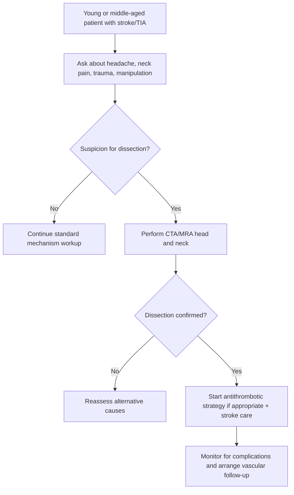
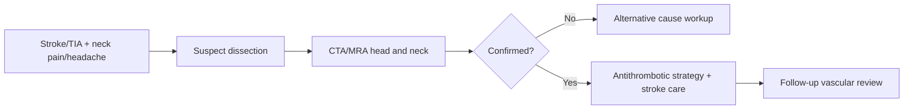

# Cervical artery dissection

Related: [[../Stroke Medicine MOC|Stroke Medicine MOC]] · [[../Special Stroke Scenarios|Special Stroke Scenarios]] · [[Young stroke and uncommon mechanisms|Young stroke and uncommon mechanisms]] · [[Stroke in the young approach|Stroke in the young approach]] · [[Basilar artery occlusion|Basilar artery occlusion]]

> [!important]
> **Cervical artery dissection** is a high-yield, potentially treatable cause of **stroke in younger adults**. The classic exam pattern is **headache or neck pain followed by focal neurological deficit**, sometimes with **partial Horner syndrome** or posterior circulation symptoms. Always think of it after **minor trauma, sudden neck movement, coughing, sports strain, or manipulation**, but remember it can also be spontaneous.

## Learning Objectives
- Define carotid and vertebral artery dissection.
- Recognize classic bedside clues and red flags.
- Interpret the role of CTA/MRA in diagnosis.
- Understand acute treatment and secondary prevention logic.
- Recall major FCPS/MRCP pearls and common traps.

## Definition
**Cervical artery dissection** is a tear within the wall of the **carotid** or **vertebral artery**, producing intramural hematoma, luminal narrowing, flap formation, pseudoaneurysm, or occlusion. Stroke occurs mainly from **artery-to-artery embolism** or reduced flow distal to the lesion.

## Core Anatomy
- The relevant vessels are:
  - **extracranial internal carotid artery**
  - **vertebral arteries**
- **Carotid dissection** often causes anterior-circulation ischemia.
- **Vertebral dissection** more often causes posterior-circulation symptoms.
- The arterial wall layers are important because blood enters and tracks within the wall, creating an intramural hematoma.

## Core Physiology
- Arterial wall disruption permits blood to dissect into the vessel wall.
- This may produce:
  - luminal stenosis
  - thrombus formation
  - embolization distally
  - pseudoaneurysm
  - complete occlusion
- Neurological deficits usually result from embolic infarction, but hemodynamic compromise may also contribute.

## Normal Values / Important Cut-offs
- There is no simple percentage cut-off like carotid atherosclerosis; diagnosis depends on **imaging morphology**.
- High-yield imaging concepts:
  - tapered stenosis
  - flame-shaped occlusion
  - mural hematoma
  - intimal flap/double lumen
  - dissecting pseudoaneurysm
- Always image the **head and neck vasculature** when dissection is suspected.

## Classification
### By artery involved
- Carotid artery dissection
- Vertebral artery dissection
- Multiple-vessel dissection

### By mechanism of symptom production
- Embolic ischemic stroke/TIA
- Hemodynamic ischemia
- Local compressive/pain syndrome

### By trigger context
- Spontaneous
- Trauma-associated
- Manipulation/exertion-associated

## Etiology / Causes
### Triggers/associations
- Minor neck trauma
- Sudden neck rotation or extension
- Sports strain
- Coughing, vomiting, sneezing
- Road traffic injury
- Cervical manipulation
- Connective tissue vulnerability in selected patients

### Underlying predisposition in some cases
- Connective tissue disorders
- Fibromuscular dysplasia
- Migraine association in some patients
- Vascular fragility syndromes

## Risk Factors
- Young or middle-aged adult with stroke
- Recent neck pain/headache
- Trauma or manipulation history
- Connective tissue disease features
- Fibromuscular dysplasia
- Prior dissection history

## Pathophysiology
An intimal tear or bleeding into the media creates an intramural hematoma. This narrows the lumen and promotes thrombus formation. The thrombus can embolize to intracranial arteries, causing TIA or stroke. Local vessel wall expansion may produce pain, cranial nerve irritation, Horner syndrome, or pseudoaneurysm formation. In vertebral dissection, posterior circulation ischemia may follow.

## Clinical Features
### Classic symptoms/signs
- Sudden or recent **neck pain**
- Headache, often unilateral
- TIA or ischemic stroke deficit
- Transient monocular visual symptoms in carotid dissection
- Posterior circulation symptoms in vertebral dissection

### High-yield examination clues
- **Partial Horner syndrome**: ptosis + miosis without prominent anhidrosis
- Cranial nerve palsy in some cases
- Brainstem/cerebellar signs with vertebral involvement
- Retinal or hemispheric ischemic symptoms with carotid involvement

### History clues
- Recent coughing/sneezing/vomiting
- Neck manipulation or massage
- Minor trauma or sports activity
- Sudden awkward neck movement

## Approach / Algorithm

## Investigations
### Essential
- **CT/MRI brain** to confirm ischemic stroke and territory
- **CTA head and neck** or **MRA head and neck**
- ECG and standard stroke blood work

### Imaging findings suggesting dissection
- Tapered stenosis
- Flame-shaped occlusion
- Intimal flap
- Double lumen
- Intramural hematoma
- Pseudoaneurysm

### Additional considerations
- Ultrasound may support extracranial assessment but is usually less definitive than CTA/MRA for full evaluation
- Consider imaging for fibromuscular dysplasia or other vascular disorders if clinically appropriate

## Interpretation Frameworks
### Carotid vs vertebral dissection clues
| Feature | Carotid dissection | Vertebral dissection |
|---|---|---|
| Pain location | Anterior/lateral neck, face, head | Occipital/upper neck pain |
| Stroke territory | Anterior circulation | Posterior circulation |
| Eye findings | Partial Horner syndrome may occur | Less typical |
| Symptoms | Aphasia/hemiparesis/amaurosis | Vertigo, diplopia, ataxia, dysarthria |

### Dissection clue set
| Clue | Why it matters |
|---|---|
| Young stroke patient | Raises pretest suspicion |
| Neck pain/headache first | Classic prodrome |
| Minor trauma/manipulation | Common trigger context |
| Partial Horner syndrome | Strong clinical hint for carotid dissection |
| Posterior circulation symptoms + occipital pain | Suggest vertebral dissection |

## Diagnosis
Diagnosis rests on:
1. A compatible clinical syndrome.
2. Vascular imaging showing dissection morphology.
3. Exclusion of a better alternative mechanism when necessary.

## Differential Diagnosis
- Atherosclerotic carotid stenosis
- Cardioembolic stroke
- Vasculitis
- Migraine with aura
- Posterior circulation TIA from other causes
- Intracranial artery disease
- Neck pain without vascular cause

## Tables / Comparison Charts
### Dissection vs atherosclerotic carotid disease
| Feature | Dissection | Atherosclerotic carotid disease |
|---|---|---|
| Age | Often younger | Often older |
| Trigger history | Trauma/manipulation/strain | Usually none |
| Pain | Common | Less prominent |
| Horner syndrome | May occur | Uncommon |
| Pathology | Arterial wall tear/hematoma | Plaque disease |

### Dissection red-flag pattern
| Pattern | Interpretation |
|---|---|
| Neck pain + focal deficit | Think dissection |
| Occipital pain + cerebellar/brainstem signs | Think vertebral dissection |
| Partial Horner + hemispheric ischemia | Think carotid dissection |

## Management
### 1. Acute stroke care
- Follow standard acute stroke stabilization and imaging pathway.
- If otherwise eligible, reperfusion decisions should follow imaging and stroke protocol principles.

### 2. Antithrombotic strategy
- Antithrombotic treatment is central after diagnosis unless contraindicated.
- In many exam settings, the main high-yield principle is that **antiplatelet or anticoagulation may be used depending on clinical context and protocol**, but the purpose is prevention of further thromboembolism.
- Avoid dogmatic oversimplification where local protocol or specialist judgment varies.

### 3. Monitoring and follow-up
- Watch for recurrent TIA/stroke symptoms.
- Arrange follow-up vascular imaging where appropriate.
- Counsel regarding avoidance of further neck trauma/manipulation during recovery.

### 4. Secondary prevention
- Tailor therapy to the confirmed mechanism.
- Also address smoking, BP, lipids, and broader vascular risk factors if present.

## Drug Interactions / Contraindications / Comorbidity Cautions
- Large infarcts, hemorrhagic transformation risk, or other bleeding risks affect antithrombotic choice.
- Trauma-associated dissection may coexist with other injuries influencing treatment.
- Connective tissue disorders may increase recurrence/fragility concerns.
- Do not confuse dissection with routine atherosclerotic carotid stenosis when deciding long-term strategy.

## Procedures / Indications / Contraindications
### CTA/MRA head and neck
**Indication**
- Any suspected dissection based on stroke plus pain/trigger clues

### Antithrombotic therapy
**Indication**
- Confirmed dissection without contraindication

**Caution**
- Intracranial extension, large infarct, bleeding risk, or trauma context may influence choice

## Procedure Mini-Sections
### Vascular imaging
- **Purpose:** confirm dissection morphology and vessel involvement
- **Viva pearl:** the diagnosis is often missed if head imaging is done but neck vascular imaging is omitted.

### Follow-up vascular reassessment
- **Purpose:** document healing or persistent abnormality
- **Viva pearl:** dissections may evolve, so follow-up planning matters.

## Complications
- Recurrent embolic stroke/TIA
- Vessel occlusion
- Pseudoaneurysm formation
- Persistent pain
- Rare cranial nerve complications

## Red Flags / Emergencies
- Young stroke/TIA with neck pain or headache
- Partial Horner syndrome
- Posterior circulation deficit after sudden neck movement
- Multifocal embolic stroke without obvious AF/carotid plaque in a younger patient
- Trauma-associated neurological deficit

## Prognosis
Many patients do well if the diagnosis is recognized early and recurrent embolization is prevented, but prognosis depends on stroke severity, vessel involved, recurrence, and timeliness of treatment. Failure to recognize dissection can lead to repeated ischemic events.

## Topic Correlation
- [[Stroke in the young approach]]
- [[Patent foramen ovale and selected young-stroke prevention issues]]
- [[Basilar artery occlusion]]
- [[Atrial fibrillation-related stroke prevention]]

## Special Situations
### Trauma-associated dissection
- Consider concomitant injuries and broader trauma management.

### Connective tissue disease/fibromuscular dysplasia
- May increase suspicion and recurrence considerations.

### Posterior circulation presentation
- Vertebral dissection may mimic other brainstem/cerebellar syndromes; maintain suspicion.

## FCPS/MRCP High-Yield Points
- Young stroke + neck pain = think dissection.
- Partial Horner syndrome is a classic clue to carotid dissection.
- Occipital pain + posterior circulation stroke suggests vertebral dissection.
- CTA/MRA head and neck is key for diagnosis.
- Dissection is usually an embolic problem from vessel-wall injury, not simple plaque disease.

## Common Viva Questions
- What is cervical artery dissection?
- How does it cause stroke?
- What clinical clues suggest carotid dissection?
- What clues suggest vertebral dissection?
- Which investigation confirms the diagnosis?

## Common Confusions / Exam Traps
- Missing the diagnosis because trauma was only minor.
- Assuming a normal non-contrast CT excludes the cause.
- Forgetting to image the neck vessels.
- Confusing dissection with routine atherosclerotic stenosis.
- Ignoring partial Horner syndrome.

## Mnemonics
### Dissection clue: **PAIN**
- **P**ain in head/neck
- **A**rtery wall tear
- **I**schemia from embolism
- **N**eck-vessel imaging needed

## Mind Map
- Cervical artery dissection
  - carotid
    - Horner
    - retinal/hemispheric stroke
  - vertebral
    - occipital pain
    - posterior circulation stroke
  - mechanism
    - wall tear
    - hematoma
    - thromboembolism
  - diagnosis
    - CTA/MRA
  - treatment
    - antithrombotic
    - follow-up imaging

## Flowchart

## Suggested Visuals / Image Notes
- Diagram of arterial wall dissection and intramural hematoma
- CTA examples of flame-shaped occlusion
- Carotid vs vertebral dissection symptom comparison chart
- Partial Horner syndrome bedside sketch

## Suggested Video References
- Teaching video on **cervical artery dissection recognition**
- CTA/MRA interpretation in dissection
- Young stroke mechanisms review

## One-Page Revision Summary
### Cervical artery dissection: last-minute exam sheet
- Important cause of **young stroke**.
- Vessels: **carotid** and **vertebral** arteries.
- Mechanism: wall tear → intramural hematoma → stenosis/thrombus → embolic stroke.
- Clues:
  - headache/neck pain
  - minor trauma/manipulation/cough/strain
  - partial Horner syndrome
  - posterior circulation symptoms with occipital pain
- Diagnosis: **CTA/MRA head and neck**.
- Treatment: stroke care + **antithrombotic strategy** unless contraindicated.
- Do not mistake it for routine plaque disease.

## 24-Hour Recall Prompts
- Name 4 clues suggesting cervical artery dissection.
- What is the difference between carotid and vertebral dissection presentation?
- Why is CTA/MRA essential?
- How does dissection produce stroke?
- What is partial Horner syndrome?

## 7-Day / 15-Day / 30-Day Revision Tracker
- **Day 1:** recite the carotid vs vertebral clue table.
- **Day 7:** redraw the diagnostic algorithm.
- **Day 15:** answer MCQs/SBAs without notes.
- **Day 30:** give a 2-minute viva on dissection.

## Must Know / Should Know / Nice to Know
### Must Know
- Young stroke + pain/trauma = suspect dissection
- CTA/MRA head and neck confirms diagnosis
- Carotid vs vertebral presentation differences

### Should Know
- Partial Horner syndrome significance
- Pseudoaneurysm and recurrence considerations

### Nice to Know
- Deeper subspecialty vessel-healing nuances

## My Weak Points
- Do I ask about neck pain and manipulation?
- Do I remember occipital pain in vertebral dissection?
- Do I remember to order neck vascular imaging?

## Self-Test Scorecard
- Recognition of clues: /10
- Imaging interpretation logic: /10
- Mechanism recall: /10
- Management confidence: /10
- Viva readiness: /10

**Interpretation**
- **<35/50** = weak topic
- **35–44/50** = acceptable but needs revision
- **45+/50** = exam ready

## Exam Answer Modes
### Long-answer mode
Define cervical artery dissection, describe carotid and vertebral presentations, explain the mechanism of ischemic stroke, discuss CTA/MRA diagnosis, and outline antithrombotic treatment plus follow-up.

### Short-note mode
Cervical artery dissection is a tear in the carotid or vertebral artery wall causing intramural hematoma, stenosis, and distal embolism. It is an important cause of young stroke and should be suspected in patients with head/neck pain, minor trauma/manipulation history, partial Horner syndrome, or posterior circulation symptoms. CTA/MRA head and neck is the key investigation.

### Viva mode
“In a young patient with stroke plus neck pain or headache, especially after minor trauma or manipulation, I strongly suspect cervical artery dissection. Carotid dissection can cause partial Horner syndrome and hemispheric symptoms, while vertebral dissection often causes occipital pain and posterior circulation deficits. CTA or MRA of the head and neck is the key diagnostic test.”

## Summary
Cervical artery dissection is a classic and examinable cause of young stroke. It should be suspected whenever a relatively young patient presents with stroke/TIA after headache, neck pain, manipulation, minor trauma, or strain. Diagnosis depends on vascular imaging of the head and neck, and treatment centers on appropriate antithrombotic stroke prevention plus follow-up of the dissected vessel.

## MCQs (10)
1. A classic cause of young stroke is:
   - A. Cervical artery dissection
   - B. Otitis externa
   - C. Glaucoma
   - D. Carpal tunnel syndrome
   - E. IBS

2. The most suggestive prodrome for cervical artery dissection is:
   - A. Neck pain or headache
   - B. Itchy skin only
   - C. Chronic low back pain only
   - D. Tinnitus only
   - E. Isolated fever without other clues

3. Which syndrome strongly suggests carotid dissection?
   - A. Partial Horner syndrome
   - B. Isolated tremor
   - C. Nephrotic edema
   - D. Jaundice
   - E. Clubbing

4. Vertebral artery dissection more commonly causes:
   - A. Posterior circulation symptoms
   - B. Isolated ulnar neuropathy
   - C. Cataract
   - D. Peptic ulcer
   - E. Dermatitis

5. The key investigation for suspected dissection is:
   - A. CTA/MRA head and neck
   - B. Spirometry
   - C. Colonoscopy
   - D. Audiogram
   - E. Nerve biopsy

6. Stroke in dissection most often results from:
   - A. Distal thromboembolism from the injured artery
   - B. Hyponatremia alone
   - C. CSF leak only
   - D. Optic neuritis
   - E. Pure venous congestion only

7. Which history increases suspicion for dissection?
   - A. Recent manipulation or minor trauma
   - B. Seasonal allergic rhinitis only
   - C. Nail fungal infection
   - D. Lactose intolerance
   - E. Myopia

8. Carotid dissection is usually linked to:
   - A. Anterior circulation ischemia
   - B. Isolated renal colic
   - C. Appendicitis
   - D. Peripheral edema only
   - E. Otitis media

9. Which statement is true?
   - A. A normal neck history excludes dissection
   - B. Major trauma is always required
   - C. Dissection may be spontaneous or follow minor triggers
   - D. Head imaging alone always proves the diagnosis
   - E. Dissection never affects younger adults

10. The main trap is:
   - A. Remembering dissection too often
   - B. Forgetting to image the neck vessels
   - C. Taking a trauma history
   - D. Checking the pupils
   - E. Doing CT/MRI brain

## SBA Questions (10)
1. A 36-year-old woman develops unilateral neck pain after yoga stretching, then transient aphasia and right arm weakness. What is the most likely cause?
   - A. Cervical carotid dissection
   - B. Bell palsy
   - C. Ménière disease
   - D. Multiple sclerosis relapse only
   - E. Tension headache alone

2. A 40-year-old man presents with occipital headache, vertigo, diplopia, and ataxia after sudden neck rotation. Which diagnosis is most likely?
   - A. Vertebral artery dissection
   - B. Otitis interna
   - C. Carpal tunnel syndrome
   - D. Migraine without vascular concern only
   - E. Sinusitis

3. A young stroke patient has ptosis and miosis without clear anhidrosis. What does this suggest?
   - A. Partial Horner syndrome from carotid dissection
   - B. Parkinson disease
   - C. Uveitis
   - D. Myasthenia only
   - E. Primary psychiatric illness

4. Which investigation best confirms suspected cervical artery dissection?
   - A. CTA/MRA head and neck
   - B. Stool culture
   - C. Audiometry
   - D. Peak flow
   - E. NCS/EMG

5. A 34-year-old patient has stroke after a coughing bout and severe unilateral neck pain. What is the key exam principle?
   - A. Minor triggers can still precipitate dissection
   - B. Coughing excludes vascular disease
   - C. Only major trauma matters
   - D. Stroke must be psychogenic
   - E. Neck pain is never relevant

6. What is the main mechanism of cerebral ischemia in cervical artery dissection?
   - A. Artery-to-artery embolism from mural thrombus
   - B. Pure meningitis
   - C. Hypocalcemia
   - D. Hyperthyroidism alone
   - E. Cataract

7. Which is the best management principle once dissection is diagnosed?
   - A. Appropriate antithrombotic stroke-prevention strategy unless contraindicated
   - B. No treatment is needed
   - C. Antibiotics for all cases
   - D. Immediate carotid endarterectomy in every case
   - E. Ignore follow-up imaging

8. A young patient with stroke is worked up only with non-contrast CT brain, and dissection is missed. What was the main error?
   - A. Failure to obtain head-and-neck vascular imaging
   - B. Excessive pupillary examination
   - C. Overuse of glucose testing
   - D. Checking the ECG
   - E. Taking history from the patient

9. Which feature best separates dissection from routine atherosclerotic stenosis?
   - A. Younger age with pain and trigger history
   - B. Raised LDL alone
   - C. Longstanding diabetes only
   - D. Chronic kidney disease only
   - E. Isolated painless bruit only

10. Which statement is most accurate?
   - A. Dissection never causes posterior circulation stroke
   - B. Carotid and vertebral dissections can present differently based on vascular territory
   - C. Pain is never part of the syndrome
   - D. Dissection cannot recur
   - E. Vascular imaging is optional if the CT brain is normal

## Flashcards
- Q: What is a classic cause of young stroke?
  A: Cervical artery dissection.

- Q: What symptom often precedes dissection-related stroke?
  A: Headache or neck pain.

- Q: What ocular sign suggests carotid dissection?
  A: Partial Horner syndrome.

- Q: What symptoms suggest vertebral dissection?
  A: Occipital pain and posterior circulation deficits such as vertigo, diplopia, or ataxia.

- Q: What is the key diagnostic test?
  A: CTA or MRA of the head and neck.

- Q: What is the main stroke mechanism in dissection?
  A: Distal embolization from the injured artery.

- Q: Can minor trauma trigger dissection?
  A: Yes.

- Q: Is dissection always traumatic?
  A: No, it may be spontaneous.

- Q: What is the biggest diagnostic trap?
  A: Forgetting to image the neck vessels.

- Q: What simple rule should you remember?
  A: Young stroke + neck pain/headache = think dissection.

## Answer Key with Explanations
### MCQs
1. **A** — Cervical artery dissection is a classic cause of young stroke.
2. **A** — Headache or neck pain is the commonest suggestive prodrome.
3. **A** — Partial Horner syndrome is a classic carotid dissection clue.
4. **A** — Vertebral dissection commonly causes posterior circulation symptoms.
5. **A** — CTA/MRA head and neck is the key investigation.
6. **A** — Thromboembolism from the injured arterial wall is the main ischemic mechanism.
7. **A** — Even minor trauma or manipulation can precipitate dissection.
8. **A** — Carotid dissection usually causes anterior circulation ischemia.
9. **C** — Dissection may be spontaneous or follow minor triggers.
10. **B** — The major trap is failing to obtain neck vascular imaging.

### SBAs
1. **A** — Neck stretch plus pain followed by hemispheric symptoms strongly suggests carotid dissection.
2. **A** — Occipital pain with posterior circulation symptoms suggests vertebral dissection.
3. **A** — Ptosis and miosis in this context point toward partial Horner syndrome.
4. **A** — CTA/MRA head and neck is the correct confirmatory test.
5. **A** — Minor triggers are sufficient in many cases.
6. **A** — Artery-to-artery embolism is the key ischemic mechanism.
7. **A** — Appropriate antithrombotic treatment is a core principle after diagnosis.
8. **A** — Non-contrast CT brain alone does not evaluate the cervical vessels.
9. **A** — Younger age plus pain/trigger history is a major distinguishing clue.
10. **B** — Presentation depends on whether carotid or vertebral territory is involved.