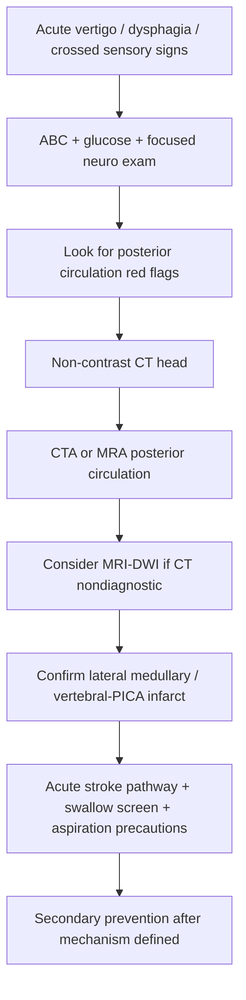
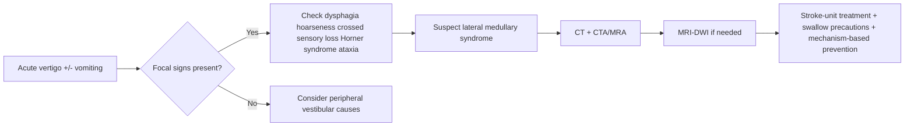

# Lateral medullary syndrome

Related: [[../Stroke Medicine MOC|Stroke Medicine MOC]] · [[../Special Stroke Scenarios|Special Stroke Scenarios]] · [[Posterior circulation and brainstem issues|Posterior circulation and brainstem issues]] · [[Basilar artery occlusion|Basilar artery occlusion]] · [[Locked-in syndrome|Locked-in syndrome]] · [[../Acute Ischaemic Stroke/Acute ischaemic stroke|Acute ischaemic stroke]]

> [!important]
> **Lateral medullary syndrome (Wallenberg syndrome)** is a **posterior-circulation stroke syndrome**, usually due to **vertebral artery** or **posterior inferior cerebellar artery (PICA)** territory ischemia. The high-yield exam pattern is **ipsilateral facial sensory loss + contralateral body pain/temperature loss + bulbar symptoms + ipsilateral Horner syndrome + cerebellar signs**.

## Learning Objectives
- Define lateral medullary syndrome and localize the lesion clinically.
- Relate the syndrome to vertebral/PICA vascular anatomy.
- Recognize the classic crossed neurological findings and dangerous swallowing/airway complications.
- Outline acute investigation, posterior-circulation imaging, and management.

## Definition
**Lateral medullary syndrome** is an ischemic brainstem stroke syndrome caused by infarction of the **lateral medulla**, most often from occlusion of the **vertebral artery** or **PICA**, producing a characteristic pattern of cranial nerve, sensory, autonomic, cerebellar, and bulbar dysfunction.

## Core Anatomy
- The **lateral medulla** contains:
  - **nucleus ambiguus** → palate, pharynx, larynx function
  - **spinal trigeminal nucleus and tract** → ipsilateral facial pain/temperature
  - **spinothalamic tract** → contralateral body pain/temperature
  - **inferior cerebellar peduncle** → ipsilateral ataxia
  - **descending sympathetic fibers** → ipsilateral Horner syndrome
  - **vestibular nuclei** → vertigo, nystagmus, nausea
- Blood supply is usually from:
  - **PICA**, or
  - penetrating branches of the **vertebral artery**.

## Core Physiology
- The medulla integrates **swallowing**, **phonation**, **autonomic tone**, and **vestibular coordination**.
- Injury to the **nucleus ambiguus** explains why dysphagia and hoarseness are especially prominent in this syndrome.
- Damage to crossed sensory pathways explains the classic **crossed sensory pattern**.
- Vestibulocerebellar pathway dysfunction causes **vertigo**, **nystagmus**, and **ipsilateral limb/gait ataxia**.

## Normal Values / Important Cut-offs
- Any **acute vertigo with focal neurological signs** should be treated as possible posterior-circulation stroke until proven otherwise.
- **Dysphagia, wet voice, choking, pooling secretions, or reduced cough** are major red flags for aspiration risk.
- Non-contrast CT may be **normal early** in posterior fossa infarction; **MRI with diffusion-weighted imaging** is more sensitive.
- **CTA or MRA** is important to identify vertebral/PICA disease or other posterior-circulation occlusion.

## Classification
### By vascular mechanism
- Vertebral artery atherothrombotic occlusion
- Vertebral artery dissection
- PICA occlusion
- Cardioembolic posterior-circulation stroke

### By clinical pattern
- Classic Wallenberg syndrome
- Incomplete lateral medullary syndrome
- Lateral medullary syndrome with associated cerebellar infarction

## Etiology / Causes
- Large-artery atherosclerosis of vertebral artery
- Vertebral artery dissection
- Cardioembolism
- Small-vessel occlusion less commonly
- Hypercoagulable states in selected younger patients

## Risk Factors
- Hypertension
- Diabetes mellitus
- Smoking
- Dyslipidaemia
- Atrial fibrillation or other embolic cardiac sources
- Neck trauma or sudden neck movement in vertebral dissection
- Young-stroke prothrombotic conditions in selected cases

## Pathophysiology
Occlusion of vertebral or PICA circulation causes ischemia in the lateral medulla. Because the lesion involves several compact brainstem pathways, patients develop a highly localizing syndrome: ipsilateral facial sensory loss from trigeminal tract involvement, contralateral body pain/temperature loss from spinothalamic interruption, dysphagia and hoarseness from nucleus ambiguus injury, and ipsilateral Horner syndrome from disruption of descending sympathetic fibers. Associated vestibular nuclei and inferior cerebellar peduncle involvement explain vertigo, nystagmus, nausea, and ataxia.

## Clinical Features
### Typical presentation
- Acute or subacute onset vertigo
- Nausea and vomiting
- Ipsilateral limb or gait ataxia
- Hoarseness
- Dysphagia
- Hiccups may occur
- Nystagmus and oscillopsia
- Ipsilateral facial pain/temperature loss
- Contralateral body pain/temperature loss
- Ipsilateral Horner syndrome

### High-yield localization clues
| Finding | Localization clue |
|---|---|
| Hoarseness + dysphagia | Nucleus ambiguus involvement |
| Ipsilateral facial pain/temp loss | Spinal trigeminal tract/nucleus |
| Contralateral body pain/temp loss | Spinothalamic tract |
| Ipsilateral Horner syndrome | Descending sympathetic fibers |
| Ipsilateral ataxia | Inferior cerebellar peduncle/cerebellar pathways |
| Vertigo + nystagmus | Vestibular nuclei |

### Exam traps
- Limb weakness is often **absent or mild**, so the patient may be misdiagnosed as peripheral vestibular disease.
- A normal early CT does **not** exclude posterior circulation infarction.
- Severe swallowing difficulty may be under-recognized unless specifically assessed.

## Approach / Algorithm

## Investigations
### Immediate
- ABC assessment and vital signs
- Capillary blood glucose
- Non-contrast CT head to exclude hemorrhage
- **CTA head/neck** or **MRA** for posterior circulation vessels
- ECG
- CBC, renal function, electrolytes
- Coagulation profile if reperfusion therapy is considered

### Useful next tests
- **MRI brain with DWI** to confirm posterior fossa infarction
- Cardiac rhythm monitoring and echocardiography for embolic source
- Lipids, HbA1c, vascular risk assessment
- Hypercoagulable or dissection-focused workup in selected young patients

## Interpretation Frameworks
### How to separate from peripheral vestibular disease
| Feature | Lateral medullary syndrome | Peripheral vestibular disorder |
|---|---|---|
| Dysphagia/hoarseness | Common | Absent |
| Crossed sensory findings | Present | Absent |
| Horner syndrome | May occur | Absent |
| Limb/gait ataxia | Often present | Usually milder gait imbalance only |
| Brainstem cranial-nerve signs | Present | Absent |
| MRI/vascular imaging | Ischemic lesion / vessel disease | No stroke lesion |

### High-yield bedside clue bundle
1. Acute vertigo is **not benign** if focal neurological signs coexist.
2. Dysphagia + hoarseness strongly suggest medullary involvement.
3. Crossed findings are classic for a brainstem lesion.
4. Order posterior-circulation vascular imaging early.

## Diagnosis
Diagnosis is made by recognition of a **posterior circulation brainstem syndrome** and confirmation of **lateral medullary infarction** or vertebral/PICA territory ischemia on MRI and/or vascular imaging.

## Differential Diagnosis
- Peripheral vestibular neuritis
- Cerebellar infarction
- Basilar artery occlusion
- Multiple sclerosis brainstem plaque
- Brainstem tumor or demyelinating lesion
- Intracerebral hemorrhage in posterior fossa
- Wernicke encephalopathy in selected contexts

## Tables / Comparison Charts
### Lateral medullary vs medial medullary syndrome
| Feature | Lateral medullary | Medial medullary |
|---|---|---|
| Major vessel | PICA / vertebral | Anterior spinal / vertebral perforators |
| Dysphagia/hoarseness | Prominent | Usually absent |
| Ipsilateral facial pain/temp loss | Present | Absent |
| Contralateral body pain/temp loss | Present | Absent |
| Contralateral weakness | Usually not dominant | Prominent pyramidal weakness |
| Tongue weakness | No classic LMN tongue palsy | Present in medial medulla |
| Horner syndrome | Can occur | Uncommon |

## Management
### Hyperacute management
- Treat as **acute ischemic stroke** and determine reperfusion eligibility.
- If within appropriate window and otherwise eligible, consider **IV thrombolysis**.
- If vascular imaging shows a treatable larger posterior-circulation occlusion, consider **endovascular therapy** where appropriate.
- Admit to stroke unit or high-dependency area depending on airway/swallow status.

### Supportive management
- Swallow screen urgently; keep **nil by mouth** until safe.
- Aspiration precautions and speech/swallow assessment.
- Maintain oxygenation, hydration, glucose, and temperature control.
- Manage nausea/vertigo symptomatically without obscuring serial neurological assessment.
- Start antiplatelet therapy if non-cardioembolic and no contraindication after hemorrhage is excluded.

### Cause-directed secondary prevention
- Antiplatelet and statin for atherosclerotic disease
- Anticoagulation if cardioembolic mechanism and timing is appropriate
- Dissection management according to vascular strategy and stroke-team guidance
- Aggressive risk-factor control: BP, smoking, diabetes, lipids

## Drug Interactions / Contraindications / Comorbidity Cautions
- Thrombolysis contraindications must be checked exactly as in other acute ischemic strokes.
- Sedating antiemetics or vestibular suppressants can cloud serial examination.
- Dysphagic patients should not receive oral medication until swallowing safety is addressed.
- Posterior fossa swelling can worsen rapidly; do not underestimate deterioration.

## Procedures / Indications / Contraindications
- **Nasogastric tube feeding** if prolonged unsafe swallow.
- **Airway support/intubation** if aspiration, bulbar failure, or reduced airway protection develops.
- **Vascular imaging** is not optional when posterior circulation stroke is suspected.

## Procedure Mini-Sections
### Swallow assessment
- **Indication:** all patients with hoarseness, dysphagia, brainstem stroke, or coughing on sips.
- **Purpose:** prevent aspiration pneumonia and guide feeding route.
- **Pitfall:** assuming speech is preserved means swallow is safe.

## Complications
- Aspiration pneumonia
- Dehydration and malnutrition
- Persistent dysphagia
- Falls from ataxia/vertigo
- Recurrent stroke
- Respiratory compromise if bulbar dysfunction is severe

## Red Flags / Emergencies
- Inability to swallow secretions
- Stridor, weak cough, or aspiration episodes
- Reduced consciousness or worsening posterior-circulation deficit
- New severe headache/neck pain suggesting vertebral dissection
- Progressive brainstem signs despite initial stability

## Prognosis
- Many patients survive but may have prolonged dysphagia, gait imbalance, or sensory symptoms.
- Prognosis depends on lesion size, airway complications, associated cerebellar infarction, and stroke mechanism.
- Early recognition improves functional outcome by reducing missed reperfusion opportunities and aspiration complications.

## Topic Correlation
- [[Basilar artery occlusion|Basilar artery occlusion]]
- [[Locked-in syndrome|Locked-in syndrome]]
- [[../Reperfusion Therapy/Mechanical thrombectomy eligibility|Mechanical thrombectomy eligibility]]
- [[../Stroke Unit Care and Complications/Aspiration pneumonia after stroke|Aspiration pneumonia after stroke]]

## Special Situations
- **Young patient with neck pain or minor trauma:** suspect vertebral artery dissection.
- **Severe persistent vertigo with normal CT:** pursue MRI and vascular imaging.
- **Prominent bulbar symptoms:** prioritize airway and swallow safety over symptom relief.

## FCPS/MRCP High-Yield Points
- Wallenberg syndrome = **lateral medullary infarction**.
- Most common vascular associations: **PICA** or **vertebral artery** occlusion.
- **Nucleus ambiguus** involvement explains **dysphagia and hoarseness**.
- Classic pattern: **ipsilateral facial pain/temp loss + contralateral body pain/temp loss**.
- **Ipsilateral Horner syndrome** and **cerebellar ataxia** are major clues.
- Posterior circulation stroke can be missed if labeled “vertigo” only.

## Common Viva Questions
- Why does lateral medullary syndrome cause dysphagia?
- Which artery is most commonly involved in Wallenberg syndrome?
- How do you distinguish lateral medullary syndrome from peripheral vertigo?
- Why may CT head be falsely reassuring early in posterior fossa stroke?

## Common Confusions / Exam Traps
- Confusing it with labyrinthitis/vestibular neuritis.
- Expecting dense hemiplegia; this is not the dominant classical feature.
- Forgetting that posterior-circulation stroke often needs **MRI/CTA**, not CT alone.
- Missing Horner syndrome because pupils are not examined carefully.

## Mnemonics
- **“Don’t PICA horse that can’t eat”** → PICA stroke causes **hoarseness** and **dysphagia**.
- **Wallenberg = crossed signs + swallowing trouble**.

## Mind Map
- Lateral medullary syndrome
  - vessel
    - PICA
    - vertebral artery
  - nucleus ambiguus
    - dysphagia
    - hoarseness
  - vestibular nuclei
    - vertigo
    - nystagmus
  - spinothalamic tract
    - contralateral body pain/temp loss
  - spinal trigeminal tract
    - ipsilateral facial pain/temp loss
  - sympathetic fibers
    - Horner syndrome
  - cerebellar pathways
    - ipsilateral ataxia

## Flowchart

## Suggested Visuals / Image Notes
- Diagram of lateral medulla with nucleus ambiguus, trigeminal tract, spinothalamic tract, sympathetic fibers, and inferior cerebellar peduncle.
- Vertebral artery and PICA vascular territory sketch.
- Crossed-signs comparison table for brainstem syndromes.

## Suggested Video References
- Posterior circulation stroke syndrome review
- Brainstem stroke localization videos
- Dysphagia and aspiration risk after brainstem stroke teaching clips

## One-Page Revision Summary
### Lateral medullary syndrome in one page
- **Definition:** lateral medullary infarction, usually due to **vertebral artery/PICA** ischemia.
- **Core signs:** vertigo, nystagmus, nausea, ipsilateral ataxia, dysphagia, hoarseness, ipsilateral facial pain/temp loss, contralateral body pain/temp loss, ipsilateral Horner syndrome.
- **Localization pearl:** nucleus ambiguus involvement is the reason for swallowing and voice symptoms.
- **Imaging pearl:** CT may miss posterior fossa infarction early; use **MRI-DWI** and **CTA/MRA**.
- **Main emergencies:** aspiration, airway compromise, progression of posterior-circulation stroke.
- **Management:** acute stroke pathway, assess reperfusion eligibility, swallow precautions, secondary prevention by mechanism.

## 24-Hour Recall Prompts
- State the classic crossed findings of lateral medullary syndrome.
- Which artery is classically involved?
- Why does the patient develop hoarseness and dysphagia?
- How would you distinguish this from peripheral vestibular neuritis?
- What is the most urgent bedside safety issue?

## 7-Day / 15-Day / 30-Day Revision Tracker
- **Day 7:** redraw the lesion anatomy from memory.
- **Day 15:** compare lateral vs medial medullary syndrome without notes.
- **Day 30:** explain acute management and aspiration precautions in 2 minutes.

## Must Know / Should Know / Nice to Know
### Must Know
- PICA/vertebral territory
- crossed sensory pattern
- dysphagia + hoarseness from nucleus ambiguus
- Horner syndrome + ipsilateral ataxia

### Should Know
- MRI/CTA imaging logic in posterior circulation stroke
- association with vertebral dissection
- common mimic with peripheral vertigo

### Nice to Know
- incomplete variants and overlap with cerebellar infarction
- detailed medullary tract anatomy beyond key exam fibers

## My Weak Points
- Can I localize the lesion from the combination of bulbar symptoms and crossed sensory loss?
- Do I remember that motor weakness may be absent?
- Can I list three reasons why this stroke is misdiagnosed?

## Self-Test Scorecard
- Localization confidence /10
- Anatomy recall /10
- Acute management recall /10
- Differentials recall /10
- Viva confidence /10

## Exam Answer Modes
### Short note skeleton
- Definition
- Vertebral/PICA blood supply
- Classical crossed clinical features
- Investigations and imaging
- Acute management and complications

### Viva mode
- Wallenberg syndrome is a lateral medullary stroke, usually due to vertebral or PICA occlusion.
- Dysphagia and hoarseness result from nucleus ambiguus involvement.
- The hallmark is ipsilateral facial sensory loss with contralateral body pain/temperature loss.

## Summary
Lateral medullary syndrome is a classic posterior-circulation brainstem stroke syndrome produced most often by vertebral or PICA ischemia. The syndrome is strongly localizing because it combines bulbar symptoms, ipsilateral Horner syndrome, vestibular/cerebellar dysfunction, and crossed sensory findings. Early diagnosis matters because posterior-fossa strokes are commonly missed, aspiration risk is high, and stroke-specific reperfusion and secondary-prevention decisions remain time sensitive.

## MCQs (10)
1. The artery most classically associated with lateral medullary syndrome is:
   - A. Anterior cerebral artery
   - B. Posterior inferior cerebellar artery
   - C. Lenticulostriate artery
   - D. Middle meningeal artery
   - **Answer: B**

2. Dysphagia and hoarseness in lateral medullary syndrome are mainly due to involvement of the:
   - A. Hypoglossal nucleus
   - B. Nucleus ambiguus
   - C. Red nucleus
   - D. Caudate nucleus
   - **Answer: B**

3. Which sensory pattern is typical of lateral medullary syndrome?
   - A. Ipsilateral body and face loss of vibration
   - B. Contralateral face and ipsilateral body numbness
   - C. Ipsilateral facial pain/temperature loss with contralateral body pain/temperature loss
   - D. Bilateral glove-and-stocking sensory loss
   - **Answer: C**

4. A common diagnostic trap in lateral medullary syndrome is mislabeling it as:
   - A. Myasthenia gravis
   - B. Peripheral vestibular disease
   - C. Parkinson disease
   - D. Migraine aura only
   - **Answer: B**

5. Ipsilateral Horner syndrome results from damage to:
   - A. Corticospinal tract
   - B. Medial lemniscus
   - C. Descending sympathetic fibers
   - D. Optic radiation
   - **Answer: C**

6. The most urgent bedside precaution in a patient with marked bulbar features is:
   - A. Restrict all imaging
   - B. Immediate swallow assessment and aspiration precautions
   - C. Start oral feeding early
   - D. Delay monitoring to avoid distress
   - **Answer: B**

7. Early CT may miss this stroke especially because it is located in the:
   - A. Frontal lobe
   - B. Posterior fossa
   - C. Corpus callosum
   - D. Pituitary fossa
   - **Answer: B**

8. Ipsilateral ataxia in lateral medullary syndrome is mainly due to involvement of the:
   - A. Inferior cerebellar peduncle
   - B. Internal capsule
   - C. Globus pallidus
   - D. Optic chiasm
   - **Answer: A**

9. Which finding is least typical of classic lateral medullary syndrome?
   - A. Hoarseness
   - B. Contralateral body pain/temperature loss
   - C. Ipsilateral facial pain/temperature loss
   - D. Dense pure motor hemiplegia as the dominant feature
   - **Answer: D**

10. Best imaging next step when posterior circulation stroke is suspected despite nondiagnostic CT is:
   - A. Skull X-ray
   - B. EEG
   - C. CTA/MRA and MRI as needed
   - D. Lumbar puncture first in all patients
   - **Answer: C**

## SBA Questions (10)
1. A 62-year-old man presents with sudden vertigo, vomiting, hoarseness, difficulty swallowing, left facial pain/temperature loss, right arm and leg pain/temperature loss, and left-sided ptosis. What is the most likely diagnosis?
   - A. Medial medullary syndrome
   - B. Lateral medullary syndrome
   - C. Bell palsy
   - D. Vestibular neuritis
   - **Answer: B**

2. A woman with acute vertigo is initially thought to have labyrinthitis. Which additional feature would most strongly support lateral medullary infarction?
   - A. Tinnitus only
   - B. Dysphagia and crossed sensory findings
   - C. Ear pain
   - D. Positional dizziness only
   - **Answer: B**

3. A patient with posterior circulation stroke has severe coughing when given water and a wet voice. What is the best immediate next step?
   - A. Encourage oral fluids
   - B. Discharge with antiemetics
   - C. Keep nil by mouth and obtain swallow assessment
   - D. Start benzodiazepines
   - **Answer: C**

4. A 39-year-old with sudden neck pain after minor trauma develops vertigo, ataxia, and hoarseness. What mechanism should be specifically considered?
   - A. Carotid plaque rupture only
   - B. Vertebral artery dissection
   - C. Temporal arteritis
   - D. Peripheral neuropathy
   - **Answer: B**

5. Which investigation best identifies the culprit vessel in suspected lateral medullary stroke?
   - A. Plain skull radiograph
   - B. CTA or MRA head/neck
   - C. Nerve conduction study
   - D. Spirometry
   - **Answer: B**

6. The bulbar symptoms of lateral medullary syndrome are mainly explained by infarction involving the:
   - A. Nucleus ambiguus
   - B. Substantia nigra
   - C. Caudate head
   - D. Optic tract
   - **Answer: A**

7. Which statement about motor power in classic lateral medullary syndrome is most accurate?
   - A. Dense hemiplegia is always present
   - B. Motor findings may be less prominent than sensory, vestibular, and bulbar signs
   - C. There are no neurological signs
   - D. Only lower motor neuron facial palsy occurs
   - **Answer: B**

8. In a patient with lateral medullary syndrome, which complication is especially important in the first days?
   - A. Hyperthyroidism
   - B. Aspiration pneumonia
   - C. Nephrotic syndrome
   - D. Tension pneumothorax
   - **Answer: B**

9. Which finding helps distinguish lateral medullary syndrome from pure cerebellar stroke?
   - A. Dysphagia and crossed sensory loss
   - B. Ataxia alone
   - C. Headache only
   - D. Intention tremor only
   - **Answer: A**

10. A patient has a normal CT but persistent posterior-circulation signs. What is the best interpretation?
   - A. Stroke is excluded
   - B. Posterior circulation stroke still remains likely and MRI/vascular imaging is needed
   - C. It must be functional neurological disorder
   - D. No further workup is necessary
   - **Answer: B**

## Flashcards
- Q: What is another name for lateral medullary syndrome?
  A: Wallenberg syndrome.
- Q: Which artery is classically involved?
  A: PICA or vertebral artery.
- Q: What nucleus explains dysphagia and hoarseness?
  A: Nucleus ambiguus.
- Q: What is the classic sensory pattern?
  A: Ipsilateral facial pain/temperature loss with contralateral body pain/temperature loss.
- Q: Why does Horner syndrome occur?
  A: Damage to descending sympathetic fibers.
- Q: Why is this stroke commonly misdiagnosed?
  A: Because vertigo and vomiting may mimic peripheral vestibular disease.
- Q: What is the key early safety issue?
  A: Swallow failure and aspiration.
- Q: Which imaging is especially important?
  A: CTA/MRA and MRI-DWI for posterior circulation stroke.

## Answer Key with Explanations
- **MCQ 1: B** — PICA is the classic artery; vertebral artery is also common.
- **MCQ 2: B** — Nucleus ambiguus controls pharyngeal/laryngeal function.
- **MCQ 3: C** — This is the hallmark crossed sensory pattern.
- **MCQ 4: B** — Peripheral vestibular disease is a classic mimic.
- **MCQ 5: C** — Horner syndrome reflects disruption of sympathetic fibers.
- **MCQ 6: B** — Aspiration prevention is a first-priority bedside issue.
- **MCQ 7: B** — Posterior fossa infarcts may be subtle on early CT.
- **MCQ 8: A** — Inferior cerebellar peduncle injury causes ipsilateral ataxia.
- **MCQ 9: D** — Dense pure motor hemiplegia is not the dominant classic pattern.
- **MCQ 10: C** — MRI and vascular imaging are needed when suspicion persists.
- **SBA 1: B** — This is the classic Wallenberg pattern.
- **SBA 2: B** — Dysphagia and crossed signs are central brainstem clues.
- **SBA 3: C** — Nil by mouth plus swallow evaluation prevents aspiration.
- **SBA 4: B** — Vertebral dissection is a key cause in younger patients.
- **SBA 5: B** — CTA/MRA identifies the posterior circulation lesion.
- **SBA 6: A** — Nucleus ambiguus explains bulbar symptoms.
- **SBA 7: B** — Weakness may be minor compared with bulbar and sensory findings.
- **SBA 8: B** — Aspiration pneumonia is a major early complication.
- **SBA 9: A** — Crossed sensory loss and dysphagia strongly localize to lateral medulla.
- **SBA 10: B** — CT cannot safely exclude early posterior-circulation infarction.