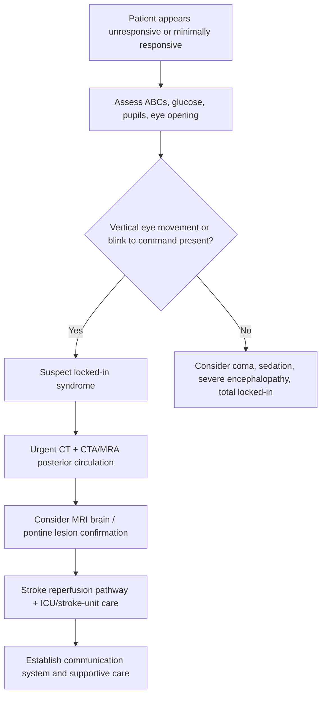
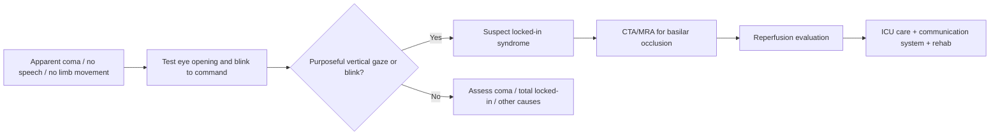

# Locked-in syndrome

Related: [[../Stroke Medicine MOC|Stroke Medicine MOC]] · [[../Special Stroke Scenarios|Special Stroke Scenarios]] · [[Posterior circulation and brainstem issues|Posterior circulation and brainstem issues]] · [[Basilar artery occlusion|Basilar artery occlusion]] · [[Lateral medullary syndrome|Lateral medullary syndrome]] · [[../Reperfusion Therapy/Mechanical thrombectomy eligibility|Mechanical thrombectomy eligibility]]

> [!important]
> **Locked-in syndrome** is a catastrophic brainstem syndrome in which the patient is **awake and conscious** but has near-complete **quadriplegia and anarthria**, classically due to a **ventral pontine infarction** from **basilar artery occlusion**. Preservation of **vertical eye movements** and blinking is the classic communication clue.

## Learning Objectives
- Define locked-in syndrome and explain the usual vascular mechanism.
- Distinguish locked-in syndrome from coma, akinetic mutism, and severe encephalopathy.
- Recognize why it is a reperfusion emergency in posterior-circulation stroke.
- Outline acute management, communication strategy, and prognosis.

## Definition
**Locked-in syndrome** is a state of preserved consciousness with severe paralysis of voluntary motor output, typically characterized by **quadriplegia**, **anarthria**, and preserved **vertical eye movements/blinking**, usually due to bilateral interruption of corticospinal and corticobulbar tracts in the ventral pons.

## Core Anatomy
- The **ventral pons** contains:
  - descending **corticospinal tracts** → limb movement
  - descending **corticobulbar tracts** → facial, bulbar, and speech output
- The **reticular activating system** may be spared, so consciousness is preserved.
- The **tegmentum** and vertical gaze pathways may be relatively spared in classic forms, allowing blinking or vertical eye communication.
- The usual vascular culprit is **basilar artery occlusion** affecting pontine perforators.

## Core Physiology
- Consciousness depends on intact ascending arousal pathways; these may remain preserved.
- Voluntary motor output is lost because major descending pathways are interrupted.
- Eye opening and vertical gaze may survive, creating the paradox of an alert but mute and immobile patient.
- Failure to recognize preserved cognition can lead to devastating communication neglect.

## Normal Values / Important Cut-offs
- Any patient with apparent coma but **eye opening, vertical tracking, or purposeful blinking** should be assessed for locked-in syndrome.
- Posterior-circulation stroke can be underdetected by low NIHSS; severe pontine ischemia may be clinically worse than the score suggests.
- Hyperacute **CTA/MRA** is essential when basilar occlusion is suspected.
- Airway, ventilation, and communication assessment are immediate priorities.

## Classification
### Classic locked-in syndrome
- Quadriplegia and anarthria
- Preserved consciousness
- Preserved vertical eye movements/blinking

### Incomplete locked-in syndrome
- Some minimal additional voluntary movement beyond eye movements remains.

### Total locked-in syndrome
- Consciousness preserved but even eye movements are absent, making diagnosis extremely difficult.

## Etiology / Causes
- **Basilar artery thrombosis/occlusion** causing ventral pontine infarction
- Pontine hemorrhage
- Central pontine myelinolysis less commonly
- Traumatic brainstem injury
- Rare inflammatory, neoplastic, or metabolic pontine lesions

## Risk Factors
- Hypertension
- Diabetes mellitus
- Smoking
- Dyslipidaemia
- Atrial fibrillation or other embolic source
- Vertebrobasilar atherosclerosis
- Conditions predisposing to pontine lesion or basilar thrombosis

## Pathophysiology
A lesion in the ventral pons interrupts the corticospinal and corticobulbar tracts bilaterally, abolishing voluntary movement of the limbs, lower face, tongue, pharynx, and larynx. Because the reticular activating system is often spared, the patient remains conscious. If the tegmentum and vertical gaze pathways are relatively preserved, eye opening and vertical eye movement survive, allowing limited communication despite profound paralysis.

## Clinical Features
### Typical features
- Sudden quadriplegia or near-total paralysis
- Anarthria or inability to speak
- Preserved consciousness
- Preserved eye opening
- Preserved vertical eye movements or blinking in classic cases
- Severe dysphagia
- Respiratory compromise may occur in acute brainstem stroke

### High-yield recognition clues
| Feature | Why it matters |
|---|---|
| Awake appearance or eye tracking | Distinguishes from deep coma |
| Blink-to-command response | Suggests intact consciousness |
| Quadriplegia with no speech | Pontine corticospinal/corticobulbar failure |
| Acute posterior-circulation context | Strong clue to basilar artery occlusion |

### Common misinterpretations
- Mistaken for coma
- Mistaken for severe encephalopathy
- Mistaken for vegetative/unresponsive state
- Assumed to have no awareness because speech and limb responses are absent

## Approach / Algorithm

## Investigations
### Immediate
- ABC assessment and respiratory evaluation
- Capillary blood glucose
- Non-contrast CT head
- **CTA head/neck** or **MRA** for basilar artery occlusion
- CBC, electrolytes, renal function
- ECG and cardiac monitoring
- Coagulation profile if reperfusion therapy is under consideration

### Further evaluation
- **MRI brain with DWI** for pontine infarction confirmation
- Echocardiography and embolic-source workup when appropriate
- Swallow and speech-language evaluation if survivable acute phase is passed
- Ventilatory assessment and secretion burden monitoring

## Interpretation Frameworks
### Locked-in syndrome vs coma
| Feature | Locked-in syndrome | Coma |
|---|---|---|
| Consciousness | Preserved | Absent |
| Eye opening | Often present | Usually absent or non-purposeful |
| Blink/vertical gaze to command | May be preserved | Absent |
| Limb movement | Absent or near absent | Absent |
| Speech | Absent | Absent |
| Brainstem vascular lesion | Common | Variable |

### Locked-in syndrome vs vegetative/unresponsive wakefulness state
| Feature | Locked-in syndrome | Vegetative/unresponsive wakefulness |
|---|---|---|
| Awareness | Preserved | Absent |
| Purposeful communication | Possible via eye movements | Absent |
| Cause | Ventral pontine lesion | Diffuse cortical/subcortical damage |
| Need for deliberate testing | Critical | Also important but pattern differs |

## Diagnosis
Diagnosis is clinical plus radiologic: a conscious patient with profound paralysis and anarthria, usually with preserved vertical gaze/blink, and imaging showing a ventral pontine lesion or basilar artery occlusion.

## Differential Diagnosis
- Coma from metabolic or structural causes
- Vegetative/unresponsive wakefulness state
- Akinetic mutism
- Severe Guillain-Barré syndrome with preserved eye movements and ventilation issues
- High cervical cord lesion with communication preserved
- Non-convulsive status with reduced interaction

## Tables / Comparison Charts
### Locked-in syndrome vs akinetic mutism
| Feature | Locked-in syndrome | Akinetic mutism |
|---|---|---|
| Consciousness | Preserved | Variable preserved wakefulness |
| Motivation/initiation | Intact but cannot execute motor response | Markedly reduced initiation |
| Voluntary limb movement | Severely absent | Reduced but not due to complete corticospinal interruption |
| Eye-blink communication | Often usable | Not the defining mode |
| Typical lesion | Ventral pons | Frontal/mesial frontal-diencephalic |

## Management
### Hyperacute stroke management
- Treat as **posterior-circulation reperfusion emergency**.
- Rapidly assess eligibility for **IV thrombolysis** if in window and no contraindication.
- Strongly consider **mechanical thrombectomy** when large-vessel posterior circulation occlusion is present and patient is eligible.
- Admit to ICU or specialized stroke unit.

### Supportive care
- Secure airway and support ventilation if needed.
- Prevent aspiration; maintain enteral nutrition safely.
- Establish a **communication method** early using blink or vertical gaze coding.
- Prevent pressure sores, DVT, contractures, and infections.
- Manage bladder, bowel, nutrition, and psychosocial needs.

### Rehabilitation and long-term care
- Intensive multidisciplinary rehabilitation.
- Speech and language team for communication systems.
- Physiotherapy and occupational therapy.
- Psychological support for patient and family because awareness is intact.

## Drug Interactions / Contraindications / Comorbidity Cautions
- Sedatives may worsen assessment and obscure preserved awareness.
- Neuromuscular weakness should not be assumed to equal lack of cognition.
- Standard thrombolysis contraindications still apply.
- Communication failure can lead to under-treatment of pain, distress, or delirium.

## Procedures / Indications / Contraindications
- **Intubation/ventilatory support** if respiratory failure or poor airway protection.
- **Feeding access** if persistent severe dysphagia.
- **Thrombectomy pathway activation** in eligible basilar occlusion.

## Procedure Mini-Sections
### Blink-code communication
- **Indication:** patient appears aware but cannot speak or move limbs.
- **Method:** yes/no communication using one blink for yes, two for no, or similar simple code.
- **Pearl:** always test comprehension before assuming inability to communicate.

## Complications
- Aspiration pneumonia
- Ventilator-associated complications
- DVT and pulmonary embolism
- Pressure ulcers
- Depression and severe psychological distress
- Recurrent stroke
- Long-term severe disability

## Red Flags / Emergencies
- Suspected basilar artery occlusion with reduced responsiveness
- Apparent coma with preserved blinking or vertical eye movement
- Rapid respiratory compromise
- Hemodynamic instability in posterior-circulation stroke
- Failure to recognize awareness leading to missed reperfusion or inadequate care

## Prognosis
- Prognosis is often poor, especially with delayed reperfusion or extensive pontine infarction.
- Some survivors retain severe disability but can regain limited communication.
- Outcomes improve when basilar artery occlusion is recognized and reperfused early.
- Recovery potential depends on lesion extent, reperfusion success, complications, and rehabilitation intensity.

## Topic Correlation
- [[Basilar artery occlusion|Basilar artery occlusion]]
- [[Lateral medullary syndrome|Lateral medullary syndrome]]
- [[../Reperfusion Therapy/Mechanical thrombectomy eligibility|Mechanical thrombectomy eligibility]]
- [[../Stroke Unit Care and Complications/Aspiration pneumonia after stroke|Aspiration pneumonia after stroke]]

## Special Situations
- **Apparent coma in ED/ICU:** always test blinking/vertical gaze to command.
- **Pontine hemorrhage:** can mimic or cause a locked-in picture but management differs from ischemic BAO.
- **Total locked-in syndrome:** diagnosis is especially difficult because eye movements may also be absent.

## FCPS/MRCP High-Yield Points
- Locked-in syndrome is classically due to **ventral pontine infarction** from **basilar artery occlusion**.
- Patient is **conscious** but **cannot speak or move limbs**.
- **Vertical eye movements and blinking** are often preserved.
- A major exam trap is confusing it with **coma**.
- This is a **posterior-circulation reperfusion emergency**.

## Common Viva Questions
- What is the usual lesion location in locked-in syndrome?
- Why is consciousness preserved?
- How do you distinguish locked-in syndrome from coma?
- Which vessel is classically responsible?
- How can such a patient communicate?

## Common Confusions / Exam Traps
- Assuming no motor response means no awareness.
- Forgetting to test vertical gaze/blink-to-command.
- Confusing with vegetative state.
- Missing the diagnosis because CT alone is unrevealing early.

## Mnemonics
- **Locked-in = mind intact, body trapped.**
- **Blink = bridge to communication.**

## Mind Map
- Locked-in syndrome
  - lesion
    - ventral pons
    - basilar artery occlusion
  - preserved
    - consciousness
    - vertical gaze
    - blinking
  - lost
    - speech
    - limb movement
    - bulbar motor output
  - priorities
    - airway
    - reperfusion
    - communication
    - complication prevention

## Flowchart

## Suggested Visuals / Image Notes
- Pontine cross-section showing ventral corticospinal and corticobulbar tracts.
- Diagram contrasting locked-in syndrome, coma, and vegetative state.
- Posterior-circulation vascular sketch showing basilar artery occlusion.

## Suggested Video References
- Brainstem stroke localization lectures
- Basilar artery occlusion and posterior-circulation emergency teaching videos
- Neurocritical care communication methods for locked-in syndrome

## One-Page Revision Summary
### Locked-in syndrome in one page
- **Definition:** conscious patient with quadriplegia and anarthria due to **ventral pontine lesion**, classically **basilar artery occlusion**.
- **Core clue:** preserved **vertical eye movement/blinking** despite apparent unresponsiveness.
- **Why conscious?** Reticular activating system may be spared.
- **Main differentials:** coma, vegetative state, akinetic mutism, severe neuromuscular paralysis.
- **Acute priorities:** airway, posterior-circulation imaging, reperfusion evaluation, communication setup.
- **Major complication:** aspiration/ventilatory failure and long-term severe disability.

## 24-Hour Recall Prompts
- Define locked-in syndrome in one sentence.
- Which vessel is most classically involved?
- Why does the patient remain conscious?
- How do you distinguish locked-in syndrome from coma at the bedside?
- What is the first simple communication tool to establish?

## 7-Day / 15-Day / 30-Day Revision Tracker
- **Day 7:** compare locked-in syndrome, coma, and vegetative state from memory.
- **Day 15:** draw the ventral pontine lesion anatomy.
- **Day 30:** give a 2-minute viva answer on recognition and acute management.

## Must Know / Should Know / Nice to Know
### Must Know
- ventral pontine lesion
- basilar artery occlusion
- conscious but quadriplegic/anarthric
- preserved vertical gaze/blink

### Should Know
- differentiation from coma and vegetative state
- need for posterior-circulation reperfusion pathway
- communication strategy and aspiration prevention

### Nice to Know
- incomplete vs total locked-in syndrome
- non-vascular causes such as CPM or trauma

## My Weak Points
- Do I automatically test blink-to-command in an apparently unresponsive posterior-circulation patient?
- Can I explain why consciousness is preserved?
- Can I contrast locked-in syndrome with coma in a viva-style answer?

## Self-Test Scorecard
- Localization confidence /10
- Differential diagnosis recall /10
- Acute management recall /10
- Communication strategy recall /10
- Viva confidence /10

## Exam Answer Modes
### Short note skeleton
- Definition
- Ventral pontine lesion and basilar artery occlusion
- Clinical features
- Differentials from coma
- Management and prognosis

### Viva mode
- Locked-in syndrome is a conscious state with quadriplegia and anarthria caused classically by ventral pontine infarction from basilar artery occlusion.
- Vertical eye movements and blinking are often preserved and allow communication.
- It must be distinguished urgently from coma because reperfusion may still be possible.

## Summary
Locked-in syndrome is one of the most dramatic posterior-circulation stroke presentations. The patient is awake but trapped within a paralysed body because ventral pontine corticospinal and corticobulbar pathways are interrupted, usually by basilar artery occlusion. Recognition depends on noticing preserved awareness through blinking or vertical gaze, and management requires immediate reperfusion evaluation, airway protection, supportive care, and compassionate communication planning.

## MCQs (10)
1. The classic anatomical lesion in locked-in syndrome is:
   - A. Occipital cortex
   - B. Ventral pons
   - C. Cerebellar vermis
   - D. Caudate nucleus
   - **Answer: B**

2. The vessel most classically implicated in ischemic locked-in syndrome is:
   - A. Middle cerebral artery
   - B. Basilar artery
   - C. Anterior cerebral artery
   - D. Ophthalmic artery
   - **Answer: B**

3. Which function is classically preserved in locked-in syndrome?
   - A. Spontaneous limb movement
   - B. Horizontal gaze in all cases
   - C. Vertical eye movements/blinking
   - D. Speech output
   - **Answer: C**

4. The main reason consciousness is preserved is relative sparing of the:
   - A. Basal ganglia loops
   - B. Reticular activating system
   - C. Optic chiasm
   - D. Peripheral nerves
   - **Answer: B**

5. A major bedside mistake is to misdiagnose locked-in syndrome as:
   - A. Cluster headache
   - B. Coma
   - C. Peripheral neuropathy only
   - D. Myopathy only
   - **Answer: B**

6. In classic locked-in syndrome, the patient is usually:
   - A. Unconscious and aphasic
   - B. Conscious with quadriplegia and anarthria
   - C. Confused with chorea
   - D. Drowsy with isolated hemianopia
   - **Answer: B**

7. The most important immediate imaging addition to CT is:
   - A. Sinus X-ray
   - B. CTA/MRA posterior circulation
   - C. Bone scan
   - D. Ultrasound thyroid
   - **Answer: B**

8. Which is the best first communication strategy if preserved blinking exists?
   - A. Ignore interaction until speech returns
   - B. Blink-code yes/no system
   - C. Use only limb commands
   - D. Avoid family contact
   - **Answer: B**

9. Which condition is least likely to preserve awareness with near-total paralysis?
   - A. Locked-in syndrome
   - B. Severe Guillain-Barré syndrome
   - C. Coma due to diffuse brain injury
   - D. Incomplete ventral pontine lesion
   - **Answer: C**

10. The acute stroke-management principle in ischemic locked-in syndrome is:
   - A. It is never reperfusion eligible
   - B. Treat as posterior-circulation reperfusion emergency
   - C. Only provide palliative care initially
   - D. Delay imaging until day 2
   - **Answer: B**

## SBA Questions (10)
1. A 68-year-old man suddenly collapses. He opens his eyes, appears awake, can blink to command, but cannot speak or move any limbs. What is the most likely diagnosis?
   - A. Delirium
   - B. Locked-in syndrome
   - C. Bell palsy
   - D. Functional neurological disorder
   - **Answer: B**

2. A patient with suspected basilar artery occlusion has quadriplegia and anarthria but preserved vertical gaze. Which lesion is most likely?
   - A. Ventral pons
   - B. Frontal lobe
   - C. Cerebellar hemisphere only
   - D. Lumbar cord
   - **Answer: A**

3. Which bedside feature most strongly distinguishes locked-in syndrome from coma?
   - A. Fever
   - B. Purposeful blink or vertical gaze to command
   - C. Bradycardia
   - D. Limb flaccidity alone
   - **Answer: B**

4. What is the best immediate next step once locked-in syndrome is suspected in the hyperacute setting?
   - A. Delay assessment until family arrives
   - B. Urgent posterior-circulation vascular imaging and reperfusion evaluation
   - C. Start oral fluids
   - D. Transfer out of monitored care
   - **Answer: B**

5. Why is communication assessment crucial in locked-in syndrome?
   - A. Because cognition is usually absent
   - B. Because awareness may be intact despite severe paralysis
   - C. Because it confirms peripheral neuropathy
   - D. Because only speech can show consciousness
   - **Answer: B**

6. A patient thought to be comatose is later found to blink once for yes and twice for no. What diagnostic lesson does this illustrate?
   - A. Posterior circulation strokes never affect consciousness
   - B. Always test for preserved communication in apparently unresponsive patients
   - C. CT alone always confirms the diagnosis
   - D. Swallow testing is unnecessary
   - **Answer: B**

7. Which complication is especially likely early in locked-in syndrome after stroke?
   - A. Aspiration pneumonia
   - B. Hyperthyroidism
   - C. Nephrolithiasis
   - D. Rheumatic fever
   - **Answer: A**

8. A patient with severe pontine stroke remains conscious but cannot move or speak. Which pathway set is primarily damaged?
   - A. Dorsal column only
   - B. Corticospinal and corticobulbar tracts bilaterally
   - C. Spinocerebellar tracts only
   - D. Optic radiations only
   - **Answer: B**

9. Which diagnosis is a key differential when evaluating preserved wakefulness without purposeful limb movement?
   - A. Vegetative/unresponsive wakefulness state
   - B. Gout
   - C. Peptic ulcer disease
   - D. Nephrotic syndrome
   - **Answer: A**

10. The best prognosis-improving acute factor in ischemic locked-in syndrome is:
   - A. Early recognition and reperfusion when eligible
   - B. Delayed imaging
   - C. Sedation before assessment
   - D. Avoidance of rehabilitation
   - **Answer: A**

## Flashcards
- Q: What is the classic lesion in locked-in syndrome?
  A: Ventral pontine lesion, usually from basilar artery occlusion.
- Q: Is consciousness preserved?
  A: Yes, typically preserved.
- Q: Which movements are classically spared?
  A: Vertical eye movements and blinking.
- Q: What are the major motor deficits?
  A: Quadriplegia and anarthria.
- Q: What is the biggest diagnostic trap?
  A: Mistaking it for coma or vegetative state.
- Q: What is the first simple communication method?
  A: Blink-code yes/no communication.
- Q: What imaging is urgently needed?
  A: CTA/MRA of posterior circulation, with MRI as needed.
- Q: What is the stroke principle?
  A: Treat as posterior-circulation reperfusion emergency.

## Answer Key with Explanations
- **MCQ 1: B** — Locked-in syndrome classically localizes to the ventral pons.
- **MCQ 2: B** — Basilar artery occlusion is the classic vascular mechanism.
- **MCQ 3: C** — Vertical gaze/blink preservation is the hallmark communication clue.
- **MCQ 4: B** — Preserved arousal pathways explain awareness.
- **MCQ 5: B** — This syndrome is often mistaken for coma.
- **MCQ 6: B** — Consciousness plus quadriplegia and anarthria define the syndrome.
- **MCQ 7: B** — Vascular imaging is crucial for posterior-circulation occlusion.
- **MCQ 8: B** — Blink-code communication should be established immediately.
- **MCQ 9: C** — Coma lacks preserved awareness.
- **MCQ 10: B** — Eligible ischemic cases require rapid reperfusion assessment.
- **SBA 1: B** — Awareness with blink communication and total paralysis is classic locked-in syndrome.
- **SBA 2: A** — Ventral pontine injury is the key lesion.
- **SBA 3: B** — Purposeful blink/vertical gaze reveals preserved awareness.
- **SBA 4: B** — Hyperacute vascular imaging and reperfusion pathway are essential.
- **SBA 5: B** — The patient may understand fully despite absent speech and movement.
- **SBA 6: B** — Always test for hidden awareness.
- **SBA 7: A** — Aspiration and respiratory complications are common.
- **SBA 8: B** — Bilateral corticospinal/corticobulbar disruption causes the syndrome.
- **SBA 9: A** — Vegetative state is an important differential because wakefulness may also be present.
- **SBA 10: A** — Earlier recognition and reperfusion offer the best chance of better outcome.