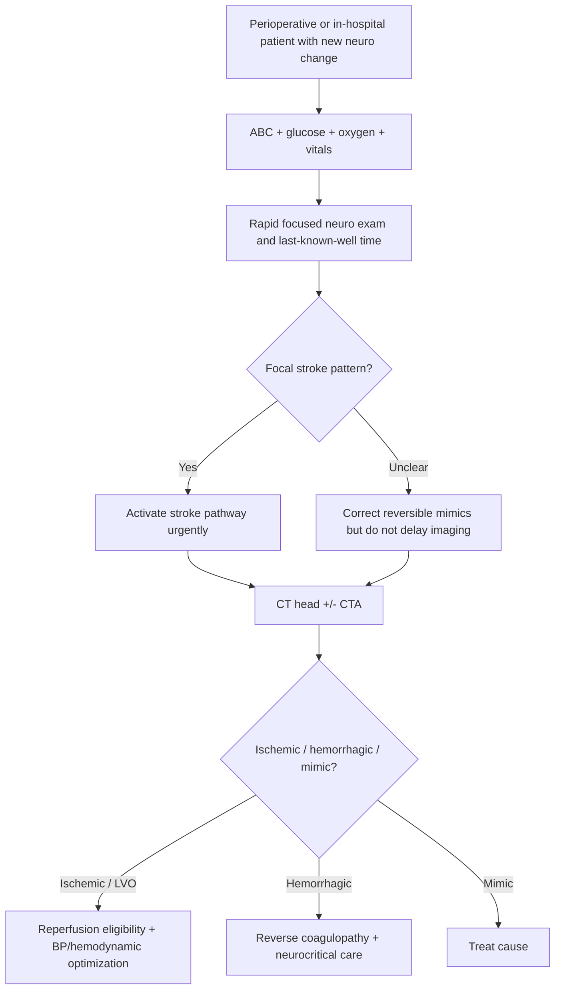
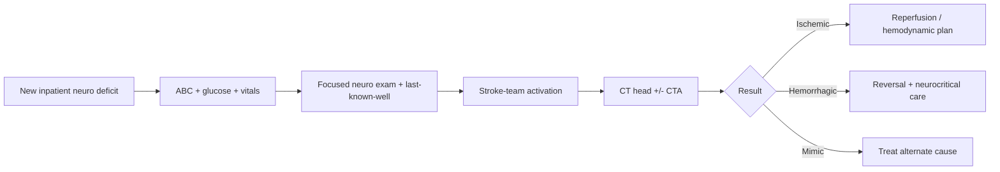

# Perioperative and in-hospital stroke recognition

Related: [[../Stroke Medicine MOC|Stroke Medicine MOC]] · [[../Special Stroke Scenarios|Special Stroke Scenarios]] · [[Special populations and situations|Special populations and situations]] · [[../Stroke Recognition and Clinical Assessment/Sudden focal neurological deficit recognition|Sudden focal neurological deficit recognition]] · [[../Neuroimaging and Acute Evaluation/Initial CT head interpretation in acute stroke|Initial CT head interpretation in acute stroke]]

> [!important]
> **Perioperative and in-hospital stroke** is a time-critical diagnosis that is often missed because sedation, postoperative pain, delirium, hypotension, or pre-existing illness can mask focal deficits. The exam pearl is: **new focal neurological deficit in the perioperative period or during hospitalization is stroke until proved otherwise**.

## Learning Objectives
- Define perioperative and in-hospital stroke and explain why it is often recognized late.
- Identify common perioperative stroke mechanisms and high-risk settings.
- Recognize stroke despite confounders such as sedation, intubation, delirium, and metabolic disturbance.
- Outline the urgent imaging and escalation pathway.
- Summarize acute management principles and prevention opportunities.

## Definition
**Perioperative stroke** is stroke occurring during surgery or in the immediate postoperative period. **In-hospital stroke** is stroke that develops while a patient is already admitted for another problem. Both are dangerous because recognition and reperfusion may be delayed by competing diagnoses, monitoring gaps, and uncertainty about last-known-well time.

## Core Anatomy
- Perioperative stroke may involve any arterial territory, but large-vessel cortical events are especially important because they can be severe and potentially reperfusion-eligible.
- Embolic material may arise from:
  - cardiac chambers
  - diseased valves
  - aortic arch manipulation
  - carotid plaque
  - intraoperative thrombus formation
- Watershed regions are vulnerable when perioperative hypotension or low-flow states reduce perfusion.
- Posterior circulation strokes may present subtly with reduced consciousness, gaze abnormalities, or unexplained failure to wake properly.

## Core Physiology
- Cerebral perfusion depends on mean arterial pressure, vascular patency, oxygenation, and cardiac output.
- Surgery can disturb these through:
  - hypotension
  - arrhythmia
  - blood loss
  - hypoxia
  - hypercoagulability
  - embolic release during vascular/cardiac procedures
- Hospitalized patients may have additional prothrombotic triggers such as infection, immobility, atrial fibrillation, heart failure, dehydration, or interruption of antithrombotic therapy.

## Normal Values / Important Cut-offs
- **Any sudden focal deficit in hospital requires urgent stroke-team activation**.
- A patient who “is not waking up normally” after anesthesia needs structured neurologic review, not reassurance alone.
- **Last-known-well time** is critical for reperfusion decisions; document it clearly.
- Postoperative BP, oxygenation, and glucose abnormalities can worsen salvageable penumbra.
- If the deficit is severe or cortical, **large-vessel occlusion** must be considered early.

## Classification
### By timing
- Intraoperative stroke
- Immediate postoperative stroke
- Delayed postoperative stroke
- Nonoperative in-hospital stroke

### By mechanism
- Cardioembolic
- Artery-to-artery embolic
- Hypoperfusion / watershed infarction
- Thrombotic large-vessel occlusion
- Hemorrhagic stroke

### By setting
- Cardiac surgery / aortic procedures
- Carotid or vascular surgery
- General surgical/orthopedic procedures
- ICU / ward-acquired stroke during medical admission

## Etiology / Causes
- Atrial fibrillation or perioperative arrhythmia
- Interruption of anticoagulation or antiplatelet therapy
- Cardiac/aortic embolization during surgery
- Carotid plaque embolization
- Prolonged hypotension or low-flow state
- Hypercoagulability from malignancy, infection, inflammation, or postoperative state
- Paradoxical embolism in selected cases
- Intracerebral hemorrhage related to hypertension, anticoagulation, or coagulopathy

## Risk Factors
| Risk factor | Why it matters |
|---|---|
| Advanced age | Higher baseline stroke risk |
| Atrial fibrillation | Common embolic source |
| Cardiac or vascular surgery | Strong embolic / hemodynamic risk |
| Antithrombotic interruption | Rebound thromboembolic risk |
| Postoperative hypotension | Watershed / low-flow infarction |
| Sepsis, dehydration, immobility | Prothrombotic in-hospital state |
| Carotid or aortic atherosclerosis | Embolic source |
| Prior stroke/TIA | Recurrent event risk |

## Pathophysiology
Perioperative and in-hospital stroke usually results from one of three major pathways: **embolism**, **hypoperfusion**, or **hemorrhage**. Embolism may arise from atrial fibrillation, valvular disease, mural thrombus, or manipulation of the heart/aorta/carotids during procedures. Hypoperfusion stroke occurs when cerebral blood flow drops in the setting of severe hypotension or impaired autoregulation, especially in patients with carotid disease. Hemorrhagic stroke may complicate hypertension, anticoagulation, thrombocytopenia, or postoperative coagulopathy. Recognition is often delayed because focal neurological signs are misattributed to sedation, delirium, or the primary reason for admission.

## Clinical Features
### Stroke clues in the ward or postoperative area
- Sudden hemiparesis
- New aphasia or dysarthria
- Visual field loss
- Gaze deviation
- New neglect
- Sudden reduced responsiveness not explained by sedatives alone
- Acute posterior-circulation symptoms: dizziness, diplopia, ataxia, dysphagia, decreased consciousness

### Recognition pitfalls
- Residual anesthetic effect
- Postictal state
- Delirium
- Hypoglycemia
- Sepsis-associated encephalopathy
- Opioid/sedative effect
- Baseline neurologic deficit after prior stroke

### High-yield warning scenario
A postoperative or ward patient who is **“not behaving normally neurologically”** should trigger a rapid ABC-glucose-stroke assessment rather than passive observation.

## Approach / Algorithm

## Investigations
### Immediate
- ABC assessment
- Capillary blood glucose
- Oxygen saturation and arterial blood gas if needed
- Blood pressure and cardiac rhythm review
- Focused neurological exam / NIHSS where feasible
- Non-contrast CT head
- CTA head/neck when LVO or vascular mechanism is suspected

### Inpatient/perioperative context review
- Exact last-known-well time from nursing/anaesthetic records
- Medication record: anticoagulants, antiplatelets, sedatives, insulin, opioids
- Operative/anesthetic notes
- CBC, coagulation profile, electrolytes, creatinine
- ECG and telemetry review
- Echocardiography if embolic source suspected

### Imaging interpretation priorities
- Exclude intracranial hemorrhage rapidly
- Look for large-vessel occlusion
- Consider watershed pattern if hypotension/low-flow history exists
- Consider multifocal embolic infarction in cardiac/vascular surgery patients

## Interpretation Frameworks
### Bedside recognition frame
1. **Is there a focal deficit?**
2. **Could the deficit be explained by sedation, hypoglycemia, or seizure?**
3. **If uncertain, image anyway** because stroke delay is more harmful than over-investigation.
4. **Document last-known-well clearly**.
5. **Look for perioperative mechanism**: AF, low flow, embolic surgery, anticoagulant interruption.

### Stroke vs common perioperative mimics
| Scenario | Clue favoring stroke | Clue favoring mimic |
|---|---|---|
| Residual anesthesia | Persistent focal asymmetry, gaze, aphasia | Global drowsiness improving steadily |
| Hypoglycemia | Focal deficit may occur but glucose low | Improvement after glucose correction |
| Delirium | Focal neuro signs or abrupt asymmetry | Fluctuating attention without lateralizing signs |
| Seizure/postictal | Focal signs may persist | Witnessed convulsion, resolving Todd paresis |
| Opioid effect | Pupillary/sedation pattern without lateralization | Improves with dose adjustment / time |

## Diagnosis
Diagnosis is made by recognizing an acute neurological deficit in a perioperative or inpatient setting and confirming stroke type on imaging. The practical diagnosis often becomes:
- acute ischemic stroke in hospital
- perioperative embolic stroke
- watershed infarction after hypotension
- postoperative intracerebral hemorrhage

## Differential Diagnosis
- Residual anesthesia / over-sedation
- Delirium
- Hypoglycemia or severe metabolic disturbance
- Seizure with postictal deficit
- Functional neurological disorder
- Sepsis-associated encephalopathy
- Brain metastasis or abscess with acute decompensation

## Tables / Comparison Charts
### Perioperative stroke mechanisms
| Mechanism | Typical clue |
|---|---|
| Cardioembolism | AF, cardiac surgery, embolic cortical pattern |
| Artery-to-artery embolism | Carotid/aortic disease, vascular procedure |
| Watershed infarction | Hypotension, bilateral border-zone pattern |
| Hemorrhagic stroke | Hypertension, anticoagulation, coagulopathy |

### Why in-hospital stroke is missed
| Problem | Consequence |
|---|---|
| Sedation / analgesia | Delayed neuro assessment |
| Poorly documented last-known-well | Missed reperfusion window |
| Diagnostic anchoring | “It is just delirium” or “post-op effect” |
| Fragmented escalation | Delayed imaging and stroke-team contact |

## Management
### Acute principles
- Treat as a stroke emergency.
- Optimize airway, breathing, oxygenation, glucose, and hemodynamics.
- Activate stroke pathway early.
- Obtain urgent CT head ± CTA.
- Involve anesthesia/surgery/ICU teams where relevant, but do not let this delay stroke imaging.

### If ischemic stroke is confirmed
- Assess reperfusion eligibility, including timing, recent surgery, bleeding risk, and vessel status.
- Mechanical thrombectomy may still be considered in selected large-vessel occlusion.
- BP and volume status should be optimized to preserve cerebral perfusion.
- Review perioperative antithrombotic interruption and likely mechanism.

### If hemorrhagic stroke is confirmed
- Reverse coagulopathy when appropriate.
- Control severe BP elevation.
- Escalate to neurocritical care/neurosurgical review if needed.

### In-hospital systems management
- Ensure nursing staff know stroke red flags.
- Improve documentation of last-seen-normal.
- Build rapid escalation pathways from ward/recovery/ICU to imaging.

## Drug Interactions / Contraindications / Comorbidity Cautions
- Recent major surgery may alter thrombolysis safety.
- Anticoagulants, antiplatelets, neuraxial procedures, and postoperative bleeding risk all affect reperfusion decisions.
- Hypotension should not be worsened by over-aggressive antihypertensive use if cerebral perfusion is threatened.
- Opioids/sedatives may hide deficits but should not be used as an excuse to defer imaging.
- Septic or ICU patients may have simultaneous bleeding and thrombotic risks.

## Procedures / Indications / Contraindications
- **Urgent CT head:** mandatory for new focal inpatient deficit.
- **CTA head/neck:** indicated when LVO or vascular pathology is suspected.
- **Stroke-team activation:** indicated immediately when focal deficit is suspected.
- **Mechanical thrombectomy:** indicated in selected LVO if criteria and local expertise allow.

## Procedure Mini-Sections
### Last-known-well reconstruction
- **Indication:** any inpatient/perioperative suspected stroke.
- **How:** use nursing charting, recovery-room notes, anesthetic records, and witness accounts.
- **Pearl:** reperfusion decisions may depend entirely on this step.

### Ward-to-CT escalation
- **Indication:** suspected in-hospital stroke.
- **Goal:** remove administrative delay between recognition and imaging.
- **Pearl:** the commonest preventable harm is late activation, not absence of technology.

## Complications
- Missed reperfusion opportunity
- Severe disability from delayed diagnosis
- Aspiration, pneumonia, DVT, pressure injury
- Hemorrhagic conversion
- Prolonged ICU/hospital stay
- Recurrent embolism if source untreated

## Red Flags / Emergencies
- New focal deficit after surgery
- Failure to wake as expected with asymmetrical findings
- Sudden aphasia/hemiparesis on the ward
- Acute unexplained dysphagia or gaze deviation
- Posterior-circulation symptoms with reduced consciousness
- Stroke symptoms in patient recently taken off anticoagulation

## Prognosis
- Prognosis depends strongly on time to recognition and treatment.
- In-hospital stroke often has worse outcomes because patients are already medically complex and diagnosis is delayed.
- System improvement in recognition can significantly reduce disability.

## Topic Correlation
- [[../Stroke Recognition and Clinical Assessment/Sudden focal neurological deficit recognition|Sudden focal neurological deficit recognition]]
- [[../Stroke Recognition and Clinical Assessment/Stroke mimics and common pitfalls|Stroke mimics and common pitfalls]]
- [[../Reperfusion Therapy/Mechanical thrombectomy eligibility|Mechanical thrombectomy eligibility]]
- [[Stroke with infective endocarditis or other embolic source clues]]

## Special Situations
- **Cardiac/aortic surgery:** embolic mechanisms are especially important.
- **ICU patient:** sedation, ventilation, and sepsis complicate recognition.
- **Anticoagulation interruption:** raises both embolic risk and treatment-complexity.
- **Posterior circulation stroke:** may present mainly with reduced consciousness, imbalance, or airway problems rather than obvious hemiparesis.

## FCPS/MRCP High-Yield Points
- In-hospital stroke is often missed because deficits are attributed to sedation or delirium.
- The first exam step is **recognition and urgent imaging**, not prolonged observation.
- Document **last-known-well time** carefully.
- Consider **large-vessel occlusion** in severe postoperative deficits.
- Perioperative stroke mechanisms include embolism, hypoperfusion, and hemorrhage.

## Common Viva Questions
- Why is in-hospital stroke commonly diagnosed late?
- What are the main mechanisms of perioperative stroke?
- Why is last-known-well time hard to define postoperatively?
- How do you distinguish stroke from residual sedation?
- What inpatient systems improve stroke outcomes?

## Common Confusions / Exam Traps
- Assuming a focal deficit is “just post-anesthetic.”
- Waiting for spontaneous recovery before imaging.
- Forgetting posterior-circulation stroke presentations.
- Not checking the medication chart for anticoagulant interruption.
- Failing to define or document last-known-well time.

## Mnemonics
- **POST-OP STROKE = THINK FAST**
  - **F**ocal deficit
  - **A**ctivate stroke pathway
  - **S**can urgently
  - **T**ime of onset matters
- **WARD STROKE = DO NOT WATCH, ESCALATE**

## Mind Map
- Perioperative and in-hospital stroke
  - mechanisms
    - embolic
    - low-flow
    - hemorrhagic
  - recognition barriers
    - sedation
    - delirium
    - poor documentation
  - key steps
    - ABC/glucose
    - focused neuro exam
    - last-known-well
    - CT/CTA
  - treatment
    - reperfusion review
    - BP/oxygen/glucose optimization
    - source correction

## Flowchart

## Suggested Visuals / Image Notes
- Timeline diagram of ward recognition to CT imaging.
- Table comparing stroke vs postoperative sedation/delirium.
- Watershed infarct pattern diagram.
- Perioperative stroke pathway poster for ward use.

## Suggested Video References
- In-hospital stroke recognition and rapid response teaching session.
- Perioperative stroke overview for anesthesia/critical care learners.
- Stroke mimics vs true stroke bedside assessment videos.

## One-Page Revision Summary
### Perioperative and in-hospital stroke recognition in one page
- **Definition:** stroke occurring during/after surgery or while already admitted.
- **Why dangerous:** missed because of sedation, delirium, hypotension, or poor onset documentation.
- **Main mechanisms:** embolic, low-flow/watershed, hemorrhagic.
- **First steps:** ABC, glucose, focused neuro exam, last-known-well, urgent CT ± CTA.
- **Big exam pearl:** new focal postoperative/ward deficit = **stroke until proved otherwise**.
- **Treatment logic:** recognize early, image early, assess reperfusion and bleeding risk, correct mechanism.

## 24-Hour Recall Prompts
- Name 3 reasons in-hospital stroke is recognized late.
- What 3 main mechanisms cause perioperative stroke?
- Why is last-known-well time critical?
- Give 2 clues favoring stroke over residual sedation.
- When should CTA be added to CT head?

## 7-Day / 15-Day / 30-Day Revision Tracker
- **Day 7:** compare embolic vs watershed perioperative stroke.
- **Day 15:** rehearse the bedside recognition algorithm from memory.
- **Day 30:** give a 2-minute viva answer on stroke after surgery.

## Must Know / Should Know / Nice to Know
### Must Know
- new focal inpatient/perioperative deficit = stroke emergency
- last-known-well documentation
- urgent CT head ± CTA
- common mechanisms: embolic, hypoperfusion, hemorrhagic
- sedation/delirium are common masking factors

### Should Know
- posterior-circulation subtleties
- medication-chart review for anticoagulant interruption
- large-vessel occlusion and thrombectomy logic

### Nice to Know
- detailed anesthetic-risk epidemiology
- advanced perioperative risk-prediction models

## My Weak Points
- Do I delay imaging when the patient is sedated?
- Can I quickly think of watershed infarction after hypotension?
- Do I remember that posterior-circulation stroke may look like “slow waking up”?

## Self-Test Scorecard
- Recognition logic /10
- Mechanism recall /10
- Imaging escalation /10
- Differential diagnosis /10
- Viva confidence /10

## Exam Answer Modes
### Short note skeleton
- Definition
- Why recognition is delayed
- Causes/mechanisms
- Acute approach
- Key management cautions

### Viva answer skeleton
- Perioperative/in-hospital stroke is frequently missed because sedation and illness mask focal deficits.
- Main mechanisms are embolic, low-flow, and hemorrhagic.
- Any new focal deficit needs ABC, glucose, last-known-well documentation, and urgent CT ± CTA.
- Reperfusion decisions depend on timing, surgery, and bleeding risk.
- System delay is the major preventable harm.

## Summary
Perioperative and in-hospital stroke recognition is a high-yield safety topic in stroke medicine. The core principle is to resist diagnostic anchoring on sedation, delirium, or postoperative status and instead treat any new focal neurological change as a potential stroke emergency. Early recognition, clear documentation of onset, and urgent neuroimaging are the decisive steps that prevent avoidable disability.

## MCQs (10)
1. A patient 3 hours after surgery develops sudden right arm weakness and aphasia. The best immediate interpretation is:
   - A. Expected postoperative fatigue
   - B. Stroke until proven otherwise
   - C. Opioid toxicity only
   - D. Migraine aura
   - E. Functional weakness by default

2. Which factor most commonly delays diagnosis of in-hospital stroke?
   - A. Absence of CT scanners in all hospitals
   - B. Automatic neurology bedside presence
   - C. Misattribution to sedation, delirium, or underlying illness
   - D. Lack of focal deficits ever occurring in wards
   - E. Universal contraindication to imaging

3. Which mechanism is especially suggested by severe perioperative hypotension?
   - A. Watershed infarction
   - B. Subdural hematoma
   - C. Bell palsy
   - D. Ménière disease
   - E. Tension headache

4. The most important time variable for reperfusion decision-making is:
   - A. Duration of hospital admission
   - B. Time since last meal
   - C. Last-known-well time
   - D. Time since first antibiotic dose
   - E. Time of ward round

5. Which postoperative presentation should strongly trigger a stroke assessment?
   - A. Mild predictable sleepiness only
   - B. New focal deficit or unexplained asymmetrical failure to wake
   - C. Normal pain at wound site
   - D. Constipation
   - E. Itching from adhesive tape

6. In severe in-hospital stroke with cortical signs, what additional imaging is often needed after CT head?
   - A. Sinus X-ray
   - B. CTA head/neck
   - C. Barium swallow
   - D. Bone scan
   - E. Mammography

7. Which is a common perioperative embolic source?
   - A. Atrial fibrillation
   - B. Otitis externa
   - C. Peptic ulcer disease
   - D. Benign prostatic enlargement
   - E. Cataract

8. Which statement is most correct?
   - A. Stroke is unlikely if the patient is already hospitalized
   - B. Delayed recognition worsens outcome in in-hospital stroke
   - C. Sedation fully excludes stroke
   - D. Posterior-circulation stroke never reduces consciousness
   - E. Last-known-well time does not matter in admitted patients

9. Which is an important differential diagnosis in the immediate postoperative period?
   - A. Residual anesthesia
   - B. Vitiligo
   - C. Osteoarthritis
   - D. Glaucoma only
   - E. Tinea corporis

10. The best systems-level improvement for in-hospital stroke is:
   - A. Watching for spontaneous recovery without imaging
   - B. Delayed documentation the next day
   - C. Rapid stroke-pathway activation from ward/recovery/ICU
   - D. Avoiding neurology consultation
   - E. Stopping all postoperative observations

## SBA Questions (10)
1. A 72-year-old man after hip surgery is noted to have sudden left facial droop and arm weakness. Nurses think he is “just drowsy from analgesia.” What is the most appropriate immediate step?
   - A. Reassure and review tomorrow
   - B. Activate stroke assessment and urgent brain imaging
   - C. Start physiotherapy first
   - D. Give sleeping medication
   - E. Restrict fluids only

2. A patient in ICU after major surgery is slow to wake. Examination reveals gaze deviation and right hemiplegia. What is the best interpretation?
   - A. Normal emergence from anesthesia
   - B. Strong suspicion of acute stroke
   - C. Simple postoperative pain behavior
   - D. Chronic dementia
   - E. Tension headache

3. A postoperative patient has bilateral border-zone infarcts on imaging after a major hypotensive episode. What is the most likely mechanism?
   - A. Watershed hypoperfusion injury
   - B. Bell palsy
   - C. Meningitis
   - D. Trigeminal neuralgia
   - E. Labyrinthitis

4. A ward patient develops sudden aphasia. Glucose is normal. What must be documented urgently to guide reperfusion decisions?
   - A. Shoe size
   - B. Last-known-well time
   - C. Bowel habit
   - D. Hemoglobin A1c from last year
   - E. Vaccination history only

5. A patient after vascular surgery develops a severe focal deficit. CT excludes hemorrhage. What extra imaging is most helpful if large-vessel occlusion is suspected?
   - A. CTA head/neck
   - B. Plain abdominal X-ray
   - C. DEXA scan
   - D. Skin biopsy
   - E. Echocardiogram only without brain imaging

6. Which factor most commonly causes missed in-hospital stroke?
   - A. Excessive MRI availability
   - B. Diagnostic anchoring on delirium or sedation
   - C. Overabundance of focal signs
   - D. Too many neurologists on the ward
   - E. Universal contraindication to CT

7. A patient recently taken off anticoagulation for surgery develops sudden hemiparesis. Which mechanism is especially important?
   - A. Thromboembolic stroke
   - B. Migraine with aura only
   - C. Peripheral neuropathy
   - D. Carpal tunnel syndrome
   - E. Costochondritis

8. Which statement best describes posterior-circulation in-hospital stroke?
   - A. It always presents with isolated chest pain
   - B. It may present mainly with reduced consciousness, dysphagia, or ataxia
   - C. It cannot occur after surgery
   - D. It is excluded by sedation
   - E. It never requires imaging

9. A postoperative patient has confusion without focal signs and improves after glucose correction. What is the best explanation?
   - A. Hypoglycemic mimic rather than definite stroke
   - B. Proven lacunar infarction
   - C. Mycotic aneurysm rupture
   - D. Basilar occlusion
   - E. SAH until proven otherwise only

10. What is the core management principle in perioperative stroke recognition?
   - A. Wait for complete anesthetic washout in all cases
   - B. Treat new focal deficits as stroke emergencies and image urgently
   - C. Avoid all neurologic examination after surgery
   - D. Assume delirium unless CT is abnormal the next day
   - E. Never involve surgery/anesthesia teams

## Flashcards
- Q: What is the key rule for new focal deficit after surgery or on the ward?
  A: Treat it as stroke until proven otherwise.
- Q: Name 3 common reasons in-hospital stroke is missed.
  A: Sedation, delirium, and poor onset documentation.
- Q: Which time point is critical for reperfusion decisions?
  A: Last-known-well time.
- Q: What mechanism is suggested by prolonged hypotension?
  A: Watershed hypoperfusion infarction.
- Q: What imaging is added when large-vessel occlusion is suspected?
  A: CTA head/neck.
- Q: Give one common embolic perioperative mechanism.
  A: Atrial fibrillation or procedure-related embolization.
- Q: Why are postoperative stroke outcomes often poor?
  A: Recognition is delayed in medically complex patients.
- Q: What bedside step should accompany stroke suspicion immediately?
  A: ABC assessment and glucose check.
- Q: Name one important mimic of postoperative stroke.
  A: Residual anesthesia, hypoglycemia, seizure, or delirium.
- Q: What is a subtle clue to posterior-circulation stroke in hospital?
  A: Unexplained reduced consciousness, dysphagia, or ataxia.

## Answer Key with Explanations
### MCQs
1. **B. Stroke until proven otherwise** — acute focal postoperative deficits demand emergency stroke evaluation.
2. **C. Misattribution to sedation, delirium, or underlying illness** — this is the classic delay mechanism.
3. **A. Watershed infarction** — low-flow states produce border-zone ischemia.
4. **C. Last-known-well time** — essential for reperfusion decisions.
5. **B. New focal deficit or unexplained asymmetrical failure to wake** — strong red flags.
6. **B. CTA head/neck** — helpful when LVO is suspected.
7. **A. Atrial fibrillation** — a major embolic source.
8. **B. Delayed recognition worsens outcome in in-hospital stroke** — true and high-yield.
9. **A. Residual anesthesia** — common immediate postoperative mimic.
10. **C. Rapid stroke-pathway activation from ward/recovery/ICU** — best systems fix.

### SBAs
1. **B. Activate stroke assessment and urgent brain imaging** — do not anchor on analgesia.
2. **B. Strong suspicion of acute stroke** — gaze deviation plus hemiplegia is not normal wake-up delay.
3. **A. Watershed hypoperfusion injury** — classic after major hypotension.
4. **B. Last-known-well time** — vital for treatment decisions.
5. **A. CTA head/neck** — evaluates LVO after hemorrhage is excluded.
6. **B. Diagnostic anchoring on delirium or sedation** — commonest recognition failure.
7. **A. Thromboembolic stroke** — anticoagulant interruption is a key clue.
8. **B. It may present mainly with reduced consciousness, dysphagia, or ataxia** — classic posterior-circulation nuance.
9. **A. Hypoglycemic mimic rather than definite stroke** — improvement after correction supports mimic.
10. **B. Treat new focal deficits as stroke emergencies and image urgently** — core principle.

## PasTest Scenario SBAs (Clinical Vignettes)

> **Auto-generated PasTest/Mediscope-style scenario SBAs** grounded in the authored source. Each scenario tests a real clinical fact (triad, specific sign, contraindication, trial, first-line Rx) extracted from the topic. *Source: Ch 27: Neurology & Stroke — Perioperative and in-hospital stroke recognition*

**Q1.** Which of the following features is most specific or characteristic of Perioperative and in-hospital stroke recognition?

  - **A.** A. Thromboembolic stroke
  - **B.** A feature common to many acute inflammatory conditions
  - **C.** A non-specific sign that does not localise the diagnosis
  - **D.** An investigation finding rather than a clinical feature

  > **Answer: A** — A. Thromboembolic stroke
  >
  > *Source:* **A. Thromboembolic stroke** — anticoagulant interruption is a key clue

