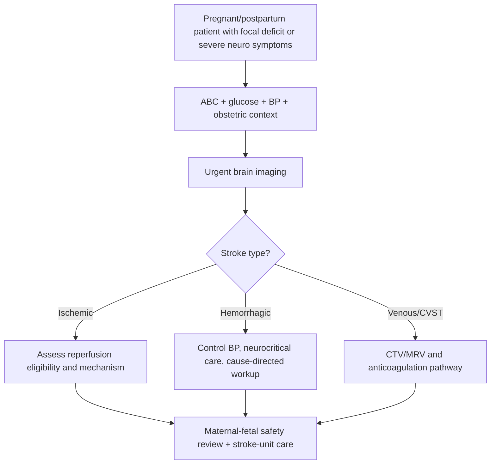
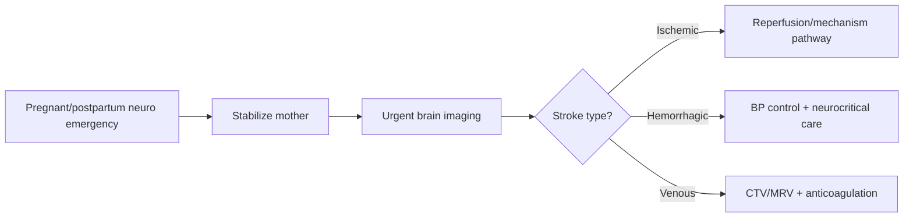

# Pregnancy-related stroke

Related: [[../Stroke Medicine MOC|Stroke Medicine MOC]] · [[../Special Stroke Scenarios|Special Stroke Scenarios]] · [[Special populations and situations|Special populations and situations]] · [[Stroke in the young approach|Stroke in the young approach]] · [[Cerebral venous sinus thrombosis|Cerebral venous sinus thrombosis]]

> [!important]
> **Pregnancy-related stroke** includes ischemic stroke, intracerebral hemorrhage, and venous stroke occurring during pregnancy or the puerperium. The exam logic is: think of standard stroke mechanisms **plus pregnancy-specific risks** such as **pre-eclampsia/eclampsia, severe hypertension, CVST, cardioembolism, arterial dissection, and postpartum vascular complications**.

## Learning Objectives
- Define pregnancy-related stroke and identify why the risk rises in late pregnancy and postpartum.
- Recognize the importance of hypertensive disorders, CVST, and postpartum complications.
- Understand imaging and treatment decisions that balance maternal and fetal safety.
- Outline acute management and mechanism-specific secondary prevention.

## Definition
**Pregnancy-related stroke** refers to ischemic, hemorrhagic, or venous cerebrovascular events that occur during **pregnancy** or the **postpartum/puerperal period**, where pregnancy-associated hemodynamic, vascular, and coagulation changes modify both risk and management.

## Core Anatomy
- Stroke may involve:
  - arterial territories causing ischemic stroke
  - intracerebral vessels causing hemorrhage
  - venous sinuses causing **CVST**
- Pregnancy-related stroke is often approached anatomically by first deciding whether the event is:
  - arterial ischemic
  - hemorrhagic
  - venous
- Obstetric complications may create severe hypertension or endothelial dysfunction, predisposing to cerebrovascular injury.

## Core Physiology
- Pregnancy is a **hypercoagulable state**.
- Blood volume and cardiac output increase.
- Hypertensive disorders may disrupt cerebral autoregulation and promote hemorrhage or edema.
- Postpartum period is especially high risk for thrombotic events including CVST.
- Management must consider both maternal stabilization and fetal implications when pregnancy is ongoing.

## Normal Values / Important Cut-offs
- New focal neurological deficit in pregnancy/postpartum is **stroke until proven otherwise**.
- Severe headache with seizure or visual symptoms should raise concern for:
  - eclampsia/preeclampsia-related complication
  - intracranial hemorrhage
  - CVST
  - PRES-related overlap scenarios
- Postpartum period is a major high-risk window for CVST and other thrombotic stroke mechanisms.
- Maternal stabilization always takes priority in a true stroke emergency.

## Classification
### By stroke type
- Ischemic stroke
- Intracerebral hemorrhage
- Subarachnoid hemorrhage where relevant differential exists
- Cerebral venous sinus thrombosis

### By timing
- Antepartum stroke
- Peripartum stroke
- Postpartum/puerperal stroke

### By mechanism
- Hypertensive/eclamptic cerebrovascular event
- Thrombotic/embolic stroke
- Dissection-related stroke
- Venous stroke (CVST)

## Etiology / Causes
- Severe hypertension, pre-eclampsia, eclampsia
- Cerebral venous sinus thrombosis
- Cardioembolism
- Arterial dissection
- Thrombophilia/APS
- Peripartum cardiomyopathy in selected cases
- Hemorrhage from uncontrolled hypertension or vascular lesion
- Reversible vasoconstrictive and postpartum vascular syndromes in some settings

## Risk Factors
| Risk factor | Why it matters |
|---|---|
| Pre-eclampsia/eclampsia | Major hemorrhagic/hypertensive risk |
| Postpartum state | Thrombotic risk, especially CVST |
| Thrombophilia/APS | Hypercoagulable tendency |
| Cesarean/immobility/dehydration | Venous thrombosis risk |
| Chronic hypertension | Stroke and hemorrhage risk |
| Heart disease/cardiomyopathy | Embolic risk |
| Older maternal age and vascular comorbidity | Higher baseline risk |

## Pathophysiology
Pregnancy and puerperium alter coagulation, hemodynamics, and vascular reactivity. This increases thrombotic tendency, especially postpartum, and amplifies the cerebrovascular consequences of hypertension and endothelial dysfunction. Some patients develop arterial ischemic stroke from cardioembolism or dissection; others develop intracerebral hemorrhage from severe hypertension or eclampsia-related vascular instability; many exam questions emphasize CVST because the postpartum state markedly increases venous thrombosis risk.

## Clinical Features
### Presentation clues
- Sudden focal weakness, speech disturbance, or visual deficit
- Severe headache
- Seizure
- Altered consciousness
- Postpartum headache with focal deficit
- Markedly elevated blood pressure or pre-eclampsia features
- Visual symptoms, papilloedema, or focal seizures suggesting CVST

### High-yield context clues
- Late pregnancy or early postpartum period
- Recent severe hypertension/preeclampsia/eclampsia
- Thrombotic risk factors or dehydration
- Cardiomyopathy/arrhythmia symptoms

## Approach / Algorithm

## Investigations
### Immediate
- ABC assessment
- Capillary blood glucose
- Blood pressure assessment
- CBC, renal function, liver function, electrolytes
- Coagulation profile
- Urine protein / pre-eclampsia workup where relevant
- ECG
- Non-contrast CT head or MRI depending on acute setting and availability

### Mechanism-focused
- CTA/MRA for arterial stroke suspicion
- **CTV/MRV** if CVST suspected
- Echocardiography if cardioembolic mechanism suspected
- Obstetric assessment and fetal status when pregnancy ongoing
- Thrombophilia/APS workup in selected patients

## Interpretation Frameworks
### Practical pregnancy-stroke decision frame
1. Confirm stroke type urgently: ischemic, hemorrhagic, or venous.
2. Identify pregnancy-specific triggers: hypertension/eclampsia, postpartum thrombosis, CVST, cardiomyopathy.
3. Stabilize mother first.
4. Use mechanism-specific treatment rather than generic “pregnancy neuro symptoms” labeling.

### Distinguishing key pregnancy-associated stroke scenarios
| Scenario | Typical clue |
|---|---|
| Hypertensive hemorrhagic/eclamptic event | Severe hypertension, seizure, pregnancy complications |
| CVST | Headache, seizure, papilloedema, postpartum state |
| Arterial ischemic stroke | Sudden focal deficit, arterial territory pattern |
| Dissection | Headache/neck pain with focal deficit |

## Diagnosis
Diagnosis requires confirmation of cerebrovascular event on imaging and then mechanism-specific classification into **ischemic**, **hemorrhagic**, or **venous** stroke in the setting of pregnancy or puerperium.

## Differential Diagnosis
- Eclampsia without stroke
- Migraine with aura
- Functional neurological disorder
- Hypoglycemia
- Encephalitis/meningitis
- PRES-related overlap presentations
- Seizure with post-ictal deficit

## Tables / Comparison Charts
### Pregnancy-related stroke vs ordinary young stroke
| Feature | Pregnancy-related stroke | Ordinary young stroke |
|---|---|---|
| Hypercoagulable state | Prominent | Variable |
| Hypertensive obstetric disorders | Major factor | Not typical |
| Postpartum CVST risk | High | Lower |
| Fetal considerations | Present if still pregnant | Absent |
| Management team | Stroke + obstetric | Stroke-focused mainly |

## Management
### Acute management principles
- Stabilize the mother first: airway, breathing, circulation, BP, glucose.
- Confirm stroke type rapidly with imaging.
- Use pregnancy-safe, mechanism-based treatment.
- Coordinate stroke, obstetric, anesthesia, and critical-care teams when needed.

### Ischemic stroke pathway
- Evaluate reperfusion eligibility just as urgently as in non-pregnant stroke, while weighing obstetric context.
- Manage blood pressure, oxygenation, glucose, and complications.
- Determine mechanism for secondary prevention.

### Hemorrhagic/hypertensive pathway
- Aggressive but careful BP control.
- Treat eclampsia/preeclampsia-related issues where relevant.
- Neurocritical care and obstetric coordination.

### CVST pathway
- Perform venous imaging if suspected.
- Anticoagulate in most confirmed cases.
- Manage seizures and raised ICP.

## Drug Interactions / Contraindications / Comorbidity Cautions
- Pregnancy changes medication choice and anticoagulant suitability.
- Severe hypertension must be controlled rapidly in hemorrhagic/eclamptic contexts.
- Imaging should not be delayed by excessive fear when maternal stroke is suspected.
- Multidisciplinary discussion is often needed for anticoagulation, delivery timing, and postpartum care.

## Procedures / Indications / Contraindications
- **Urgent brain imaging** is mandatory; do not treat as a routine headache disorder.
- **CTV/MRV** if CVST suspected.
- **Reperfusion pathway** when eligible ischemic stroke is identified.

## Procedure Mini-Sections
### Multidisciplinary stroke-obstetric escalation
- **Indication:** any moderate/severe pregnancy-related stroke.
- **Goal:** synchronize maternal stabilization, imaging, BP control, fetal assessment, and delivery-related decisions if relevant.
- **Pearl:** delay from team fragmentation is a preventable harm.

## Complications
- Maternal disability
- Intracerebral hemorrhage
- Recurrent seizure
- Raised ICP
- Fetal compromise if pregnancy ongoing
- Recurrent thrombosis or future pregnancy recurrence risk

## Red Flags / Emergencies
- Pregnancy/postpartum focal deficit
- Severe headache with seizure or visual disturbance
- Markedly elevated blood pressure with neuro symptoms
- Drowsiness or rapidly worsening deficit
- Postpartum headache with papilloedema/focal signs suggesting CVST

## Prognosis
- Outcome depends on stroke type, speed of diagnosis, BP control, presence of hemorrhage, and mechanism-specific treatment.
- Many patients recover well when diagnosed early, especially when CVST or reversible hypertensive causes are recognized promptly.
- Delayed diagnosis worsens both maternal and fetal risk.

## Topic Correlation
- [[Stroke in the young approach|Stroke in the young approach]]
- [[Cerebral venous sinus thrombosis|Cerebral venous sinus thrombosis]]
- [[../Intracerebral Haemorrhage/Intracerebral haemorrhage|Intracerebral haemorrhage]]

## Special Situations
- **Postpartum headache:** always think CVST, hemorrhage, and severe hypertension.
- **Ongoing pregnancy:** fetal considerations matter, but maternal emergency treatment comes first.
- **Future pregnancy counseling:** recurrence risk and thrombosis prevention planning may be needed.

## FCPS/MRCP High-Yield Points
- Pregnancy-related stroke includes **ischemic, hemorrhagic, and venous** stroke.
- The **postpartum period** is a high-risk thrombotic window.
- **Pre-eclampsia/eclampsia** strongly raises hemorrhagic and hypertensive neurovascular risk.
- **CVST** is a classic pregnancy/postpartum stroke mechanism.
- Do not delay imaging in a true maternal stroke emergency.

## Common Viva Questions
- Why is stroke risk increased in pregnancy and puerperium?
- Which stroke mechanism is especially associated with the postpartum period?
- How does pre-eclampsia/eclampsia contribute to stroke risk?
- What are the main categories of pregnancy-related stroke?

## Common Confusions / Exam Traps
- Attributing focal deficits to “just eclampsia” without imaging.
- Forgetting postpartum CVST.
- Delaying maternal stroke treatment because of overcautious imaging fear.
- Thinking pregnancy-related stroke means only hemorrhage.

## Mnemonics
- **Pregnancy stroke = 3 boxes: arterial, hemorrhagic, venous.**
- **Postpartum headache + neuro deficit = think CVST until excluded.**

## Mind Map
- Pregnancy-related stroke
  - types
    - ischemic
    - hemorrhagic
    - venous
  - key risks
    - pre-eclampsia/eclampsia
    - postpartum state
    - thrombophilia
    - cardiomyopathy
    - dissection
  - clues
    - severe headache
    - seizure
    - focal deficit
    - high BP
  - tests
    - CT/MRI
    - CTA/MRA
    - CTV/MRV
  - treatment
    - maternal stabilization
    - BP control
    - reperfusion when eligible
    - anticoagulation for CVST

## Flowchart

## Suggested Visuals / Image Notes
- Timeline diagram showing pregnancy vs postpartum stroke-risk emphasis.
- Table comparing ischemic, hemorrhagic, and CVST mechanisms in pregnancy.
- Visual summary of pre-eclampsia/eclampsia neurovascular complications.

## Suggested Video References
- Pregnancy and puerperium stroke review
- CVST in postpartum patients
- Neuro-obstetric emergency teaching videos

## One-Page Revision Summary
### Pregnancy-related stroke in one page
- **Definition:** ischemic, hemorrhagic, or venous stroke during pregnancy/puerperium.
- **Key mechanisms:** severe hypertension/eclampsia, CVST, arterial ischemic stroke, dissection, cardioembolism.
- **Postpartum pearl:** strong risk period for **CVST**.
- **Clinical clues:** focal deficit, severe headache, seizure, visual symptoms, marked hypertension.
- **Imaging:** urgent CT/MRI; add CTA/MRA or CTV/MRV according to suspected mechanism.
- **Management:** stabilize mother first, classify stroke type quickly, then treat mechanism specifically.

## 24-Hour Recall Prompts
- List the 3 main pregnancy-related stroke categories.
- Why is postpartum period high-risk?
- Name 3 pregnancy-specific stroke triggers.
- When should CVST be suspected?
- What is the first management priority?

## 7-Day / 15-Day / 30-Day Revision Tracker
- **Day 7:** compare pregnancy ischemic stroke, hemorrhage, and CVST.
- **Day 15:** list the hypertensive vs thrombotic causes from memory.
- **Day 30:** give a 2-minute viva answer on acute approach.

## Must Know / Should Know / Nice to Know
### Must Know
- ischemic/hemorrhagic/venous classification
- postpartum CVST risk
- pre-eclampsia/eclampsia association
- urgent imaging and maternal stabilization

### Should Know
- dissection/cardiomyopathy/thrombophilia mechanisms
- multidisciplinary management logic
- secondary prevention counseling

### Nice to Know
- finer obstetric anticoagulation nuances
- overlap with PRES/reversible vasoconstrictive states

## My Weak Points
- Do I automatically include CVST in postpartum headache with deficit?
- Can I separate hypertensive hemorrhage from venous stroke clues?
- Do I remember that maternal stabilization comes first?

## Self-Test Scorecard
- Mechanism recall /10
- Acute approach /10
- Differential diagnosis /10
- Pregnancy-specific risk recall /10
- Viva confidence /10

## Exam Answer Modes
### Short note skeleton
- Definition
- Types
- Risk factors
- Clinical features
- Acute investigation and management

### Viva mode
- Pregnancy-related stroke includes ischemic, hemorrhagic, and venous stroke.
- Major associations are pre-eclampsia/eclampsia, postpartum thrombosis, and CVST.
- Management depends on rapid imaging classification, with maternal stabilization first.

## Summary
Pregnancy-related stroke is an important neuro-obstetric emergency in which standard stroke mechanisms intersect with pregnancy-specific thrombotic and hypertensive risks. The key exam approach is to classify the event quickly into ischemic, hemorrhagic, or venous stroke, remember the strong postpartum association with CVST, and prioritize rapid imaging plus maternal stabilization before mechanism-specific treatment.

## MCQs (10)
1. Pregnancy-related stroke includes:
   - A. Only intracerebral hemorrhage
   - B. Ischemic, hemorrhagic, and venous stroke
   - C. Only migraine aura
   - D. Only seizures
   - **Answer: B**

2. The postpartum period is especially associated with:
   - A. CVST
   - B. Myasthenia gravis only
   - C. Optic neuritis only
   - D. Parkinson disease
   - **Answer: A**

3. A major pregnancy-specific stroke risk factor is:
   - A. Pre-eclampsia/eclampsia
   - B. Seasonal allergy
   - C. Acne
   - D. Tinea infection
   - **Answer: A**

4. In suspected maternal stroke, the first principle is:
   - A. Delay evaluation for fetal reasons
   - B. Maternal stabilization and urgent imaging
   - C. Treat all headaches as benign first
   - D. Avoid all scans
   - **Answer: B**

5. Which stroke mechanism is especially exam-relevant in postpartum patients with headache and seizure?
   - A. CVST
   - B. Essential tremor
   - C. Carpal tunnel syndrome
   - D. Bell palsy
   - **Answer: A**

6. Pregnancy-related stroke should first be classified as:
   - A. Psychiatric vs neurologic
   - B. Ischemic vs hemorrhagic vs venous
   - C. Acute vs chronic only
   - D. Primary vs secondary headache only
   - **Answer: B**

7. Which feature would raise concern for hypertensive/eclamptic cerebrovascular complication?
   - A. Markedly elevated blood pressure with neuro symptoms
   - B. Chronic mild dandruff
   - C. Seasonal sinusitis only
   - D. Isolated tinnitus
   - **Answer: A**

8. A major exam trap is:
   - A. Assuming postpartum focal deficit needs imaging
   - B. Forgetting CVST and attributing symptoms to routine postpartum headache
   - C. Treating stroke as emergency
   - D. Checking blood pressure
   - **Answer: B**

9. Which of the following best explains increased stroke risk in pregnancy?
   - A. Hypercoagulability and hypertensive vascular stress
   - B. Decreased total blood volume only
   - C. Pure peripheral neuropathy
   - D. Improved autoregulation only
   - **Answer: A**

10. Which team pattern is often needed in significant pregnancy-related stroke?
   - A. Stroke plus obstetric multidisciplinary care
   - B. Dermatology only
   - C. Ophthalmology only
   - D. No team input
   - **Answer: A**

## SBA Questions (10)
1. A 30-year-old woman 5 days postpartum develops severe headache, vomiting, focal left arm weakness, and a generalized seizure. Which diagnosis must be high on the list?
   - A. Tension headache
   - B. Cerebral venous sinus thrombosis
   - C. Benign positional vertigo
   - D. Essential tremor
   - **Answer: B**

2. A pregnant woman at 34 weeks develops sudden aphasia and right hemiparesis. What is the best immediate principle?
   - A. Delay imaging until after delivery
   - B. Treat as stroke emergency with urgent maternal stabilization and imaging
   - C. Assume functional disorder first
   - D. Observe at home
   - **Answer: B**

3. Which obstetric condition most strongly increases hemorrhagic stroke risk?
   - A. Pre-eclampsia/eclampsia
   - B. Mild nausea
   - C. Iron deficiency alone
   - D. Seasonal allergy
   - **Answer: A**

4. A postpartum patient has severe headache, papilloedema, and focal seizures. What stroke mechanism is most likely?
   - A. CVST
   - B. Peripheral neuropathy
   - C. ALS
   - D. Tension headache
   - **Answer: A**

5. Which classification should be made first after imaging a pregnancy-related neurovascular event?
   - A. Ischemic, hemorrhagic, or venous stroke
   - B. Viral vs bacterial
   - C. Motor vs sensory only
   - D. Primary vs secondary insomnia
   - **Answer: A**

6. Why is the postpartum period especially important in stroke medicine?
   - A. Because it is a high-risk thrombotic window
   - B. Because stroke cannot occur during pregnancy
   - C. Because all headaches are physiological then
   - D. Because blood pressure is always normal
   - **Answer: A**

7. A pregnant patient with focal deficit and very high blood pressure becomes confused. Best interpretation?
   - A. Neuro-obstetric emergency requiring urgent stroke/hypertensive evaluation
   - B. Simple anxiety only
   - C. Safe for discharge
   - D. No need for imaging
   - **Answer: A**

8. Which is a major management principle in pregnancy-related stroke?
   - A. Fetal imaging decisions always override maternal stabilization
   - B. Maternal stabilization comes first
   - C. Stroke medicine does not apply in pregnancy
   - D. All cases are venous strokes
   - **Answer: B**

9. Which mechanism may coexist within the young-stroke framework in pregnancy?
   - A. Arterial dissection
   - B. Only dementia
   - C. Only peripheral neuropathy
   - D. Only migraine without any vascular concern
   - **Answer: A**

10. In pregnancy-related stroke, which specialty coordination is commonly needed?
   - A. Stroke and obstetric teams
   - B. Dermatology and podiatry only
   - C. Dentistry alone
   - D. No team care
   - **Answer: A**

## Flashcards
- Q: What are the 3 main categories of pregnancy-related stroke?
  A: Ischemic, hemorrhagic, and venous stroke.
- Q: Which period is especially high-risk for CVST?
  A: Postpartum/puerperium.
- Q: Which obstetric disorder strongly raises stroke risk?
  A: Pre-eclampsia/eclampsia.
- Q: What is the first management principle?
  A: Maternal stabilization and urgent imaging.
- Q: Which venous stroke must be remembered in postpartum headache with seizure?
  A: Cerebral venous sinus thrombosis.
- Q: Why is stroke risk increased in pregnancy?
  A: Hypercoagulability, hemodynamic change, and hypertensive vascular stress.
- Q: Should focal deficits be assumed benign in pregnancy?
  A: No, treat as stroke until proven otherwise.
- Q: Which teams are often needed?
  A: Stroke plus obstetric multidisciplinary teams.

## Answer Key with Explanations
- **MCQ 1: B** — Pregnancy-related stroke is not limited to hemorrhage; venous and ischemic types also occur.
- **MCQ 2: A** — Postpartum period is a classic high-risk window for CVST.
- **MCQ 3: A** — Pre-eclampsia/eclampsia is a major stroke association.
- **MCQ 4: B** — Maternal stabilization and urgent imaging come first.
- **MCQ 5: A** — Postpartum headache with seizure is a classic CVST scenario.
- **MCQ 6: B** — This is the most useful first classification frame.
- **MCQ 7: A** — Severe hypertension with neuro symptoms is an emergency.
- **MCQ 8: B** — Missing CVST is a classic exam and clinical trap.
- **MCQ 9: A** — Hypercoagulability and hypertensive stress are central mechanisms.
- **MCQ 10: A** — Significant cases often need coordinated stroke-obstetric care.
- **SBA 1: B** — This is a classic postpartum CVST presentation.
- **SBA 2: B** — Pregnancy does not reduce the urgency of stroke diagnosis.
- **SBA 3: A** — Pre-eclampsia/eclampsia is a major hemorrhagic/hypertensive risk state.
- **SBA 4: A** — Papilloedema and focal seizures postpartum strongly suggest CVST.
- **SBA 5: A** — Stroke type classification guides treatment.
- **SBA 6: A** — Puerperium is a high-risk thrombotic period.
- **SBA 7: A** — This is a neuro-obstetric emergency.
- **SBA 8: B** — Maternal stabilization is the first principle.
- **SBA 9: A** — Pregnancy can coexist with arterial dissection within young-stroke differentials.
- **SBA 10: A** — Team coordination is often necessary.

## PasTest Scenario SBAs (Clinical Vignettes)

> **Auto-generated PasTest/Mediscope-style scenario SBAs** grounded in the authored source. Each scenario tests a real clinical fact (triad, specific sign, contraindication, trial, first-line Rx) extracted from the topic. *Source: Ch 27: Neurology & Stroke — Pregnancy-related stroke*

**Q1.** In the management of Pregnancy-related stroke, which of the following should be avoided or is contraindicated?

  - **A.** be delayed by excessive fear (avoid in maternal stroke is suspected)
  - **B.** Standard guideline-directed first-line therapy
  - **C.** Routine supportive care (fluids, oxygen, monitoring)
  - **D.** Symptom-directed treatment as needed

  > **Answer: A** — be delayed by excessive fear (avoid in maternal stroke is suspected)
  >
  > *Source:* - Imaging should not be delayed by excessive fear when maternal stroke is suspected.
- Multidisciplinary discussion is often needed for anticoagulation, delivery timing, and postpartum care

**Q2.** What is the most appropriate first-line therapy for Pregnancy-related stroke?

  - **A.** Use pregnancy-safe, mechanism-based treatment
  - **B.** An advanced/surgical therapy reserved for refractory disease
  - **C.** Symptomatic treatment only, no disease-modifying therapy
  - **D.** Empiric broad-spectrum therapy without specific indication

  > **Answer: A** — Use pregnancy-safe, mechanism-based treatment
  >
  > *Source:* Use pregnancy-safe, mechanism-based treatment.

