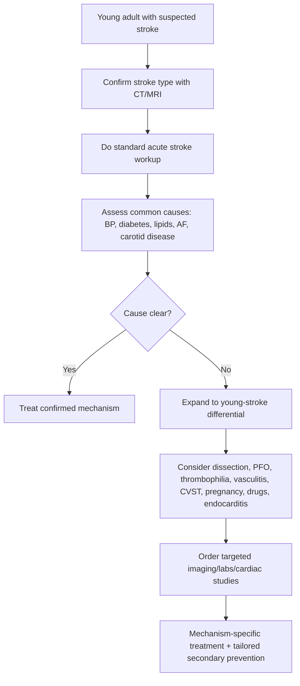
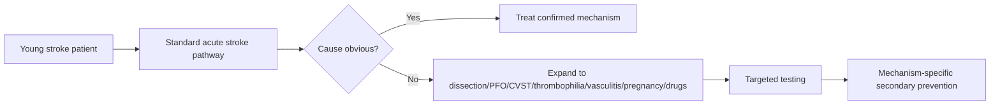

# Stroke in the young approach

Related: [[../Stroke Medicine MOC|Stroke Medicine MOC]] · [[../Special Stroke Scenarios|Special Stroke Scenarios]] · [[Young stroke and uncommon mechanisms|Young stroke and uncommon mechanisms]] · [[Patent foramen ovale and selected young-stroke prevention issues|Patent foramen ovale and selected young-stroke prevention issues]] · [[Cervical artery dissection|Cervical artery dissection]] · [[Cerebral venous sinus thrombosis|Cerebral venous sinus thrombosis]]

> [!important]
> **Stroke in the young** should never be approached as just “old-person stroke occurring early.” In younger adults, clinicians must still consider common causes, but they must actively search for **dissection, cardioembolism, PFO-related paradoxical embolism, thrombophilia, vasculitis, drug-related stroke, pregnancy-related mechanisms, and unusual vascular disorders**.

## Learning Objectives
- Define what is meant by stroke in the young.
- Apply a structured differential diagnosis beyond routine atherosclerosis.
- Recognize high-yield bedside clues that redirect workup toward uncommon causes.
- Plan acute evaluation and tailored secondary prevention in younger stroke patients.
- Recall FCPS/MRCP traps in young-stroke assessment.

## Definition
**Stroke in the young** generally refers to ischaemic or hemorrhagic stroke occurring in a relatively young adult, often below the age group in which atherosclerotic and degenerative vascular disease predominate. In practice, the term emphasizes a **broader and more cause-focused diagnostic strategy** rather than a strict age cut-off alone.

## Core Anatomy
- Young-stroke mechanisms may involve:
  - **cervical arteries**: carotid or vertebral dissection
  - **intracranial arteries**: vasculitis, reversible vasoconstrictive states, aneurysmal or structural disease
  - **venous system**: cerebral venous sinus thrombosis
  - **heart/interatrial septum**: PFO, cardiomyopathy, endocarditis, arrhythmia sources
- Depending on mechanism, infarcts may be:
  - cortical embolic
  - border-zone hemodynamic
  - posterior circulation
  - venous hemorrhagic infarction patterns

## Core Physiology
- Common older-age stroke mechanisms still occur in younger adults, but their frequency changes.
- In younger patients, stroke may result from:
  - embolism from heart or paradoxical shunt
  - arterial wall injury/dissection
  - thrombosis from hypercoagulable states
  - inflammatory or toxic vasculopathy
  - pregnancy-related hemostatic change
- Mechanism-specific treatment is crucial, so identifying the true cause is more important than reflexly labeling all young strokes as cryptogenic.

## Normal Values / Important Cut-offs
- No single age threshold is perfect; exam usage often focuses on a “younger-than-expected” stroke patient.
- High-yield logic:
  - young stroke = **expand the differential**
  - do **not** skip common causes such as AF, carotid disease, diabetes, hypertension, smoking, and lipid disorders
  - if no clear cause is found, intensify workup for **dissection, PFO, thrombophilia, vasculitis, CVST, illicit drug use, pregnancy/postpartum states, and infective causes**
- Always distinguish **ischaemic stroke**, **intracerebral hemorrhage**, and **CVST-related hemorrhagic infarction**.

## Classification
### By broad mechanism
- Large-artery disease
- Cardioembolic stroke
- Small-vessel disease
- Arterial dissection
- Hypercoagulable / thrombophilic state
- Vasculitic / inflammatory vasculopathy
- Venous stroke (CVST)
- Drug/toxin-related stroke
- Pregnancy/postpartum stroke
- Cryptogenic stroke

### By clinical syndrome
- Anterior circulation stroke
- Posterior circulation stroke
- Retinal ischemic event
- Hemorrhagic stroke syndrome
- Multifocal embolic syndrome

## Etiology / Causes
### Common causes still possible
- Hypertension
- Diabetes mellitus
- Smoking
- Dyslipidaemia
- Premature atherosclerosis
- Atrial fibrillation or structural heart disease

### Important young-stroke causes
- **Cervical artery dissection**
- **PFO/paradoxical embolism**
- **Cardiomyopathy / endocarditis / valvular disease**
- **Cerebral venous sinus thrombosis**
- **Inherited/acquired thrombophilia** including APS in selected contexts
- **Vasculitis** or connective tissue disease
- **Pregnancy/postpartum stroke mechanisms**
- **Drug-related vasospasm or thrombosis**
- Rare genetic/structural vasculopathies

## Risk Factors
### General vascular risk factors
- Smoking
- Hypertension
- Diabetes
- Obesity/inactivity
- Family history of premature vascular disease

### Clue-based young-stroke risk factors
- Neck trauma/manipulation → dissection
- Long travel/immobility/DVT symptoms → paradoxical embolism or VTE
- Recurrent miscarriage/autoimmune history → APS/thrombophilia
- Fever/murmur/IV drug use → infective endocarditis
- Pregnancy/puerperium/OCP use → thrombotic and vascular complications
- Cocaine/amphetamine exposure → vasospasm, hypertension, thrombosis

## Pathophysiology
The pathophysiology of young stroke is heterogeneous. Rather than one dominant late-life mechanism, several competing mechanisms may coexist. Arterial wall injury can cause dissection with thromboembolism. Interatrial shunts can permit paradoxical embolism. Hypercoagulable states can cause arterial or venous thrombosis. Inflammatory vasculopathies can narrow or damage vessels. Toxic/drug exposures may precipitate vasospasm or severe hypertension. Because treatment differs profoundly across these mechanisms, systematic cause attribution is essential.

## Clinical Features
### Bedside clues that should expand the differential
- Stroke occurring at unexpectedly young age
- Headache or neck pain preceding focal deficit
- Recurrent embolic-appearing events without clear AF or carotid cause
- Posterior circulation symptoms in a young patient
- Seizure, headache, papilloedema, or hemorrhagic infarct suggesting CVST
- Fever, murmur, embolic phenomena suggesting endocarditis
- Rash, arthralgia, ulcers, autoimmune symptoms suggesting vasculitis/APS
- Postpartum or pregnancy context
- Drug exposure or recent severe exertion/manipulation

### Young-stroke bedside redirections
- Neck pain + partial Horner syndrome → think carotid dissection
- Occipital headache + posterior circulation signs → think vertebral dissection
- Cortical embolic infarct + no cause + bubble study positivity → think PFO relevance
- Headache + seizures + papilloedema → think CVST

## Approach / Algorithm

## Investigations
### Standard acute stroke workup
- CT / MRI brain
- Blood glucose
- CBC
- Renal function, electrolytes
- Coagulation profile where relevant
- ECG
- Vascular imaging as appropriate

### Young-stroke extension workup
- **CTA/MRA head and neck** for dissection or unusual vasculopathy
- **Echocardiography** and rhythm monitoring for cardioembolic causes
- **Bubble study** if PFO/paradoxical embolism is suspected
- **Venous imaging / D-dimer context-specific testing** if CVST or DVT is suspected
- **Thrombophilia / APS testing** in selected patients, not indiscriminately in everyone
- **Inflammatory/autoimmune tests** if vasculitis/connective tissue disease is clinically suggested
- **Toxicology / drug exposure history** when relevant
- **Pregnancy-related evaluation** in the appropriate setting

## Interpretation Frameworks
### Young-stroke clue-to-cause table
| Clue | Cause to prioritize |
|---|---|
| Neck pain/trauma/manipulation | Cervical artery dissection |
| Embolic cortical stroke + no cause + PFO | PFO-related paradoxical embolism |
| Headache + seizures + papilloedema | CVST |
| Fever + murmur + embolic signs | Endocarditis |
| Autoimmune history / miscarriages | APS / vasculitis |
| Drug exposure / severe hypertension | Toxic vasculopathy / hemorrhagic event |

### Common-vs-uncommon logic
| Principle | Meaning |
|---|---|
| Do not ignore common causes | Young adults can still have AF, diabetes, hypertension, smoking-related vascular disease |
| Do not stop after a normal first ECG | Prolonged monitoring may still reveal arrhythmia |
| Do not label all PFOs as causal | Context determines relevance |
| Do not order every rare test blindly | Investigations should be clue-driven |

## Diagnosis
Diagnosis in young stroke is not a single disease label but a **structured mechanism-finding process**. A satisfactory diagnosis requires:
1. Confirmation of stroke type.
2. Standard mechanism assessment.
3. Expansion to young-specific causes when the initial workup is unrevealing or clues demand it.
4. Mechanism-linked acute and secondary prevention planning.

## Differential Diagnosis
- Ischaemic stroke from common vascular risk factors
- Intracerebral hemorrhage
- Cerebral venous sinus thrombosis
- Cervical artery dissection
- AF-related cardioembolism
- PFO-related paradoxical embolism
- Endocarditis-related embolism
- Vasculitis / connective tissue disease
- Stroke mimics: seizure with Todd’s paresis, migraine aura, hypoglycaemia, functional disorder

## Tables / Comparison Charts
### Young stroke vs typical older atherosclerotic stroke approach
| Feature | Young stroke approach | Typical older stroke approach |
|---|---|---|
| Differential breadth | Broader | Narrower/common causes dominate |
| Dissection consideration | High | Lower |
| PFO relevance | Higher | Often incidental |
| Thrombophilia/APS workup | More often considered | More selective |
| Pregnancy/drug mechanisms | Important | Usually less prominent |

### Arterial vs venous young-stroke clues
| Feature | Arterial ischemic stroke | CVST |
|---|---|---|
| Headache | May occur | Often prominent |
| Seizures | Less common | More common |
| Papilloedema | Uncommon | More suggestive |
| Infarct pattern | Arterial territory | Venous/hemorrhagic infarction possible |

## Management
### 1. Acute principles
- Treat as a true stroke emergency.
- Do not delay reperfusion decisions or hemorrhage management while overthinking rare causes.
- Stabilize ABCs, glucose, BP, and imaging-based acute pathway first.

### 2. Mechanism-finding after stabilization
- Complete standard stroke workup.
- Then expand toward dissection, PFO, CVST, thrombophilia, vasculitis, pregnancy-related causes, and infective/drug-related causes when indicated.

### 3. Tailored mechanism-specific management examples
- **Dissection** → antithrombotic strategy and vascular follow-up
- **PFO-related cryptogenic stroke** → antiplatelet vs closure in selected patients
- **AF-related stroke** → anticoagulation pathway
- **CVST** → venous thrombosis management
- **Endocarditis** → infection control plus embolic-risk management
- **APS/thrombophilia** → hematology/rheumatology-guided long-term prevention

### 4. Secondary prevention still matters broadly
- Smoking cessation
- BP control
- Diabetes management
- Lipid control when relevant
- Exercise/weight optimization
- Contraception/pregnancy counseling where needed
- Drug-use counseling

## Drug Interactions / Contraindications / Comorbidity Cautions
- Mechanism matters before choosing antiplatelet vs anticoagulation.
- Thrombolysis/reperfusion decisions must still follow stroke imaging rules regardless of age.
- Pregnancy may alter imaging, antithrombotic, and BP management considerations.
- Endocarditis and dissection can complicate routine antithrombotic assumptions.
- Hypercoagulable workup should be targeted; indiscriminate testing can confuse interpretation.

## Procedures / Indications / Contraindications
### Vascular imaging of head and neck
**Indications**
- Young stroke with headache, neck pain, trauma history, or unclear mechanism

### Echocardiography with bubble study
**Indications**
- Embolic stroke with no clear large-artery/AF cause

### Lumbar puncture / inflammatory workup
**Role**
- Selected cases when vasculitis, infection, or alternative pathology is suspected

## Procedure Mini-Sections
### CTA/MRA head and neck
- **Purpose:** look for dissection or unusual vasculopathy
- **Viva pearl:** in a young patient with stroke plus neck pain, vascular imaging of the neck is high-yield.

### Bubble study echo
- **Purpose:** detect interatrial shunt/PFO
- **Viva pearl:** PFO detection is meaningful only when the broader mechanism review supports relevance.

## Complications
- Recurrent stroke if the true mechanism is missed
- Inappropriate long-term prevention if stroke is mislabeled “cryptogenic” too early
- Missed CVST, endocarditis, or dissection with serious downstream morbidity
- Psychosocial and functional burden during prime working/family years

## Red Flags / Emergencies
- Young stroke with severe headache, seizures, or papilloedema
- Neck pain/trauma preceding focal deficit
- Fever, murmur, septic features in embolic stroke
- Pregnancy/postpartum stroke syndrome
- Recurrent multifocal embolic events with no initial cause found

## Prognosis
Prognosis depends on stroke severity, speed of recognition, and whether a treatable mechanism is identified. Young patients often have greater rehabilitation potential, but the long-term impact can be enormous because disability occurs during working and reproductive years. Accurate mechanism-based secondary prevention can markedly improve recurrence outlook.

## Topic Correlation
- [[Patent foramen ovale and selected young-stroke prevention issues]]
- [[Cervical artery dissection]]
- [[Cerebral venous sinus thrombosis]]
- [[Atrial fibrillation-related stroke prevention]]
- [[Pregnancy-related stroke]]
- [[Stroke with infective endocarditis or other embolic source clues]]

## Special Situations
### Pregnancy and postpartum
- Expand the differential toward CVST, hypertensive disorders, and thrombosis.

### Oral contraceptive use
- Raises thrombotic considerations depending on context.

### Exercise/manipulation-related onset
- Raises suspicion for dissection.

### Recurrent miscarriage/autoimmune background
- Consider APS or connective tissue disease.

## FCPS/MRCP High-Yield Points
- Young stroke = **broader differential**, not a different emergency pathway.
- Still exclude common causes first.
- Dissection, PFO, CVST, vasculitis, thrombophilia, pregnancy, and drugs are classic extra causes.
- Clue-driven testing is smarter than indiscriminate rare testing.
- Missing the true mechanism leads to wrong secondary prevention.

## Common Viva Questions
- What causes stroke in the young?
- Why is cervical artery dissection important in younger patients?
- Why is every PFO not automatically treated?
- What clues suggest CVST rather than arterial stroke?
- How do you balance common and uncommon causes in young stroke workup?

## Common Confusions / Exam Traps
- Assuming all young strokes are due to PFO.
- Ignoring AF, hypertension, smoking, diabetes, and carotid disease just because the patient is young.
- Ordering thrombophilia panels without clinical indication.
- Missing dissection when headache/neck pain preceded deficit.
- Forgetting CVST in headache-plus-seizure syndromes.

## Mnemonics
### Young stroke expansion: **D-P-C-V-P-D**
- **D**issection
- **P**FO/paradoxical embolism
- **C**ardiac causes
- **V**enous sinus thrombosis / vasculitis
- **P**regnancy/postpartum
- **D**rugs

## Mind Map
- Young stroke
  - common causes
    - HTN
    - DM
    - smoking
    - AF
  - special causes
    - dissection
    - PFO
    - CVST
    - APS/thrombophilia
    - vasculitis
    - endocarditis
    - pregnancy
    - drugs
  - evaluation
    - CT/MRI
    - CTA/MRA
    - ECG/telemetry
    - echo/bubble study
    - targeted labs
  - treatment
    - mechanism-specific prevention

## Flowchart

## Suggested Visuals / Image Notes
- Young-stroke differential map
- Comparison diagram: arterial stroke vs CVST vs dissection
- Echo bubble-study concept for PFO
- CTA example of carotid/vertebral dissection

## Suggested Video References
- Review video on **young stroke differential diagnosis**
- Short teaching video on **dissection vs PFO vs CVST clues**
- Mechanism-based stroke workup lecture for trainees

## One-Page Revision Summary
### Stroke in the young: last-minute exam sheet
- Young stroke requires a **broader differential**.
- Do **not** skip common causes such as HTN, DM, smoking, AF, carotid disease.
- Important added causes:
  - **dissection**
  - **PFO/paradoxical embolism**
  - **CVST**
  - **thrombophilia/APS**
  - **vasculitis**
  - **pregnancy/postpartum**
  - **drug-related stroke**
  - **endocarditis**
- Clues:
  - neck pain → dissection
  - headache + seizure + papilloedema → CVST
  - embolic stroke + no cause + PFO → possible paradoxical embolism
  - fever/murmur → endocarditis
- Use **standard acute stroke pathway first**, then add clue-driven young-stroke workup.
- Correct mechanism = correct long-term prevention.

## 24-Hour Recall Prompts
- List 6 important causes of young stroke.
- Which clues point toward dissection?
- Which clues point toward CVST?
- Why is every PFO not causal?
- Why must common causes still be checked?

## 7-Day / 15-Day / 30-Day Revision Tracker
- **Day 1:** recite the young-stroke differential from memory.
- **Day 7:** redraw the workup algorithm.
- **Day 15:** answer the MCQs and SBAs without notes.
- **Day 30:** give a 3-minute viva on young stroke approach.

## Must Know / Should Know / Nice to Know
### Must Know
- Standard stroke pathway still comes first
- Do not miss dissection, PFO, CVST, APS/vasculitis, pregnancy-related causes
- Mechanism-based prevention is essential

### Should Know
- Clue-driven targeted testing
- Interaction between pregnancy, thrombosis, and venous stroke

### Nice to Know
- Rare genetic vasculopathies and deeper subspecialty workup

## My Weak Points
- Do I overfocus on PFO and forget other causes?
- Do I remember to ask about neck pain, drugs, pregnancy, fever, and autoimmune history?
- Can I separate arterial from venous stroke clues?

## Self-Test Scorecard
- Differential recall: /10
- Bedside clue recognition: /10
- Investigation planning: /10
- Management linkage: /10
- Viva confidence: /10

**Interpretation**
- **<35/50** = weak topic
- **35–44/50** = acceptable but needs revision
- **45+/50** = exam ready

## Exam Answer Modes
### Long-answer mode
Define stroke in the young, explain why the differential is broader, list common and uncommon causes, describe clue-driven investigations, and discuss mechanism-specific secondary prevention.

### Short-note mode
Stroke in the young requires standard acute stroke management plus a broader mechanism search including dissection, PFO/paradoxical embolism, CVST, thrombophilia, vasculitis, pregnancy-related causes, endocarditis, and drugs, while still checking common vascular risk factors.

### Viva mode
“In young stroke, I first follow the standard stroke pathway, but I broaden the differential. I particularly look for dissection, PFO-related paradoxical embolism, CVST, thrombophilia, vasculitis, pregnancy-related mechanisms, and drug causes, while still excluding common causes like AF and carotid disease.”

## Summary
Stroke in the young is a mechanism-rich clinical problem requiring disciplined broad thinking. The clinician must avoid both extremes: neither dismissing common causes nor prematurely labeling the case cryptogenic. A systematic, clue-driven search for dissection, PFO-related embolism, CVST, thrombophilia, inflammatory disease, pregnancy-related mechanisms, endocarditis, and drugs enables targeted treatment and better recurrence prevention.

## MCQs (10)
1. The key principle in stroke in the young is:
   - A. Ignore common causes
   - B. Broaden the differential while still checking common causes
   - C. Assume every case is PFO-related
   - D. Avoid vascular imaging
   - E. Delay acute stroke treatment

2. Neck pain preceding focal neurological deficit in a young adult most strongly suggests:
   - A. Migraine only
   - B. Cervical artery dissection
   - C. Otitis media
   - D. Diabetic neuropathy
   - E. Bell palsy

3. Which combination most suggests CVST?
   - A. Headache, seizure, papilloedema
   - B. Isolated ankle pain
   - C. Pure cataract
   - D. Chronic arthritis alone
   - E. Epistaxis only

4. Which is a classic young-stroke mechanism?
   - A. PFO-related paradoxical embolism
   - B. Appendicitis
   - C. Psoriasis alone
   - D. Peptic ulcer alone
   - E. Tinnitus only

5. Which statement about PFO is correct?
   - A. Every PFO is causal after stroke
   - B. PFO is always irrelevant
   - C. PFO may be causal in selected young/cryptogenic embolic stroke
   - D. PFO causes only hemorrhagic stroke
   - E. PFO eliminates need for other workup

6. Which history raises suspicion for APS/thrombophilia?
   - A. Recurrent miscarriage
   - B. Toenail fungal infection
   - C. Seasonal allergy only
   - D. Myopia
   - E. Waxing and waning tinnitus

7. Why should AF still be checked in younger stroke patients?
   - A. Because age excludes arrhythmia
   - B. Because common causes can still occur in the young
   - C. Because AF only causes TIAs in the elderly
   - D. Because ECG is never useful
   - E. Because carotid disease is impossible in the young

8. Which test is especially useful when dissection is suspected?
   - A. CTA/MRA head and neck
   - B. Spirometry
   - C. Audiometry
   - D. Colonoscopy
   - E. Nerve conduction study

9. In young stroke, indiscriminate rare testing is poor practice because:
   - A. It may distract from clue-driven diagnosis
   - B. Rare causes never exist
   - C. Common causes do not matter
   - D. MRI is forbidden
   - E. Stroke needs no etiology workup

10. Which statement best summarizes management?
   - A. One prevention strategy fits all young-stroke cases
   - B. Mechanism-specific secondary prevention is essential
   - C. Antiplatelets solve all cases
   - D. Anticoagulation is mandatory in every patient
   - E. Rehabilitation is unnecessary in younger adults

## SBA Questions (10)
1. A 33-year-old man presents with acute stroke after recent neck manipulation and ipsilateral neck pain. Which cause should be prioritized?
   - A. Cervical artery dissection
   - B. Cataract
   - C. Tension headache
   - D. Otitis externa
   - E. Peripheral neuropathy

2. A 29-year-old woman presents with severe headache, focal deficit, and seizures in the postpartum period. Which diagnosis becomes especially important?
   - A. CVST
   - B. Carotid bruit syndrome only
   - C. Restless legs syndrome
   - D. Trigeminal neuralgia
   - E. Tetanus

3. A 38-year-old patient has embolic cortical infarct, no AF on telemetry, normal carotids, and a PFO on bubble echo. What is the key principle?
   - A. PFO may be relevant but other causes still must be considered carefully
   - B. PFO proves the case is finished
   - C. Carotid endarterectomy is mandatory
   - D. No secondary prevention is needed
   - E. All young strokes are venous

4. A 41-year-old patient has stroke plus fever and a new murmur. What should you think of?
   - A. Infective endocarditis-related embolism
   - B. Simple migraine
   - C. Bell palsy
   - D. Ménière disease
   - E. Chronic sinusitis only

5. Which is the best broad strategy in young stroke workup?
   - A. Ignore common vascular causes
   - B. Follow standard stroke workup first, then expand using clue-driven tests
   - C. Send every rare antibody panel immediately
   - D. Assume thrombophilia in all cases
   - E. Avoid cardiac studies

6. A 35-year-old woman with stroke reports recurrent miscarriages and livedo-like symptoms. What mechanism should be considered?
   - A. APS/hypercoagulability
   - B. Otosclerosis
   - C. IBS
   - D. Migraine without vascular relevance only
   - E. Labyrinthitis

7. Which statement about prognosis in young stroke is most accurate?
   - A. It is always excellent because the patient is young
   - B. It depends heavily on mechanism identification and prevention of recurrence
   - C. It is unrelated to rehabilitation
   - D. It is determined only by cholesterol
   - E. It never affects work or family life

8. A young patient has stroke and admits recent cocaine use. What is the exam point?
   - A. Drug-related stroke mechanisms must be considered
   - B. Drug history is irrelevant
   - C. Only PFO matters
   - D. MRI will always be normal
   - E. Carotid disease becomes impossible

9. What is the main mistake when handling young stroke?
   - A. Using a broader differential
   - B. Missing the true mechanism and giving wrong long-term prevention
   - C. Ordering brain imaging
   - D. Taking a history
   - E. Assessing pregnancy status

10. A patient with young stroke has normal first ECG. What is the best next principle?
   - A. Stop cardiac workup forever
   - B. Consider prolonged rhythm monitoring if embolic mechanism remains possible
   - C. Assume the cause is psychosomatic
   - D. Avoid all vascular imaging
   - E. Give antibiotics only

## Flashcards
- Q: What is the key principle in stroke in the young?
  A: Broaden the differential while still checking common causes.

- Q: Neck pain before stroke suggests what?
  A: Cervical artery dissection.

- Q: Headache + seizure + papilloedema in a young stroke patient suggests what?
  A: Cerebral venous sinus thrombosis.

- Q: What interatrial abnormality can matter in young cryptogenic stroke?
  A: Patent foramen ovale.

- Q: Why is every PFO not automatically causal?
  A: Because many PFOs are incidental.

- Q: What history can suggest APS?
  A: Recurrent miscarriage or autoimmune clues.

- Q: What pregnancy-related period raises thrombosis and stroke risk?
  A: The postpartum period.

- Q: Why is mechanism identification essential?
  A: Because long-term prevention depends on the true cause.

- Q: What imaging is high-yield for suspected dissection?
  A: CTA or MRA of head and neck.

- Q: What simple rule should you remember?
  A: Young stroke is not a diagnosis—it is a prompt to think wider.

## Answer Key with Explanations
### MCQs
1. **B** — The core principle is a broader differential without abandoning common-cause evaluation.
2. **B** — Neck pain plus stroke in the young is classic for dissection.
3. **A** — Headache, seizure, and papilloedema strongly suggest CVST.
4. **A** — PFO-related paradoxical embolism is a classic young-stroke mechanism.
5. **C** — PFO may be causal only in selected contexts.
6. **A** — Recurrent miscarriage is a classic clue to APS.
7. **B** — Common causes can still occur in the young.
8. **A** — CTA/MRA head and neck is key in suspected dissection.
9. **A** — Rare testing should be clue-driven, not indiscriminate.
10. **B** — Prevention must match the true mechanism.

### SBAs
1. **A** — Neck manipulation plus pain strongly points toward dissection.
2. **A** — Postpartum headache, seizures, and focal deficit should raise CVST urgently.
3. **A** — PFO may be relevant, but causal attribution still requires careful context review.
4. **A** — Fever and murmur suggest endocarditis-related embolic stroke.
5. **B** — Standard stroke workup first, then clue-driven extension, is the best approach.
6. **A** — Recurrent miscarriage and autoimmune-type clues suggest APS.
7. **B** — Young patients may recover well, but prognosis still depends heavily on mechanism and recurrence prevention.
8. **A** — Cocaine and similar drugs are important stroke triggers in younger patients.
9. **B** — The biggest danger is missing the actual etiology and choosing the wrong prevention strategy.
10. **B** — A single normal ECG does not exclude intermittent cardioembolic rhythm disorders.