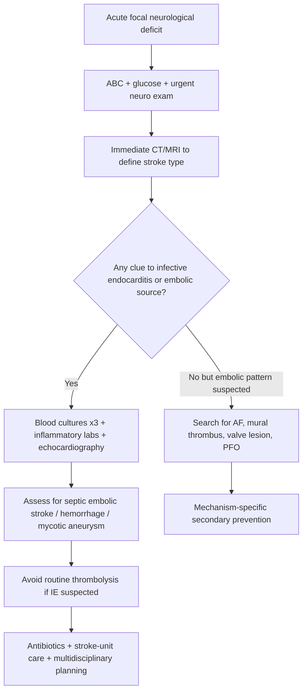
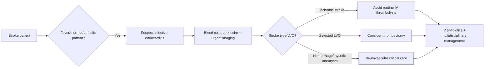

# Stroke with infective endocarditis or other embolic source clues

Related: [[../Stroke Medicine MOC|Stroke Medicine MOC]] · [[../Special Stroke Scenarios|Special Stroke Scenarios]] · [[Special populations and situations|Special populations and situations]] · [[../Secondary Prevention/Atrial fibrillation-related stroke prevention|Atrial fibrillation-related stroke prevention]] · [[Stroke in the young approach|Stroke in the young approach]]

> [!important]
> In stroke with **infective endocarditis (IE)**, the key exam logic is: **suspect septic cardioembolism**, confirm stroke type urgently with brain imaging, look for **fever / murmur / bacteremia / embolic stigmata**, and remember that **thrombolysis is generally avoided because intracranial bleeding risk is high**.

## Learning Objectives
- Recognize when acute stroke may be caused by infective endocarditis or another embolic cardiac source.
- Understand how septic emboli differ from ordinary bland cardioembolism.
- Outline the acute investigation pathway with blood cultures, echocardiography, and brain/vessel imaging.
- Explain why thrombolysis is hazardous in suspected infective-endocarditis stroke.
- Summarize mechanism-specific acute treatment and secondary prevention principles.

## Definition
**Stroke with infective endocarditis or other embolic source clues** refers to an acute focal neurological deficit caused by embolic cerebral ischemia, hemorrhage, or mixed cerebrovascular complications arising from a cardiac or proximal embolic source. In exams, the most important special scenario is **infective endocarditis**, where **septic vegetations** embolize to cerebral vessels and may also predispose to **hemorrhage, mycotic aneurysm, and multifocal infarction**.

## Core Anatomy
- Emboli from the **left heart** typically enter the cerebral circulation via the carotid or vertebrobasilar systems.
- **Middle cerebral artery territory** is commonly involved in cardioembolic stroke because large emboli lodge in proximal intracranial arteries.
- Septic emboli may produce:
  - territorial cortical infarcts
  - multifocal infarcts in different vascular territories
  - hemorrhagic transformation
  - infective arteritis or **mycotic aneurysm**
- Valvular lesions associated with IE may affect:
  - mitral valve
  - aortic valve
  - prosthetic valves
  - occasionally right-sided valves, though these more often cause pulmonary rather than cerebral emboli unless a shunt exists

## Core Physiology
- Normal cerebral perfusion depends on unobstructed arterial flow and intact autoregulation.
- In embolic stroke, sudden arterial occlusion causes abrupt reduction in perfusion with development of ischemic core and penumbra.
- In **septic embolism**, embolic material is not sterile clot alone; it carries infected thrombotic debris that may damage vessel walls and increase hemorrhagic risk.
- Embolic source physiology in stroke should prompt a search for:
  - arrhythmia
  - valvular vegetation
  - mural thrombus
  - cardiac tumor or other structural source

## Normal Values / Important Cut-offs
- **Suspected infective endocarditis** should rise sharply when stroke is accompanied by **fever, murmur, positive blood cultures, prosthetic valve, known valvular disease, or peripheral stigmata of IE**.
- **Multiple infarcts in different vascular territories** strongly suggest embolic showering.
- **Thrombolysis is usually avoided in infective-endocarditis-associated ischemic stroke** because of high intracranial hemorrhage risk.
- In any suspected IE stroke, obtain **blood cultures before antibiotics if this does not cause dangerous delay in care**.
- A new neurological deficit with sepsis-like features is a **red-flag stroke presentation**, not just delirium or weakness from infection.

## Classification
### By embolic source
- **Septic embolic stroke** from infective endocarditis
- **Bland cardioembolic stroke** from atrial fibrillation, mural thrombus, cardiomyopathy, or prosthetic valve thrombosis
- **Paradoxical embolic stroke** through PFO or intracardiac shunt
- **Artery-to-artery embolic stroke** from proximal plaque or aortic arch source

### By cerebrovascular event pattern
- Ischemic infarction
- Hemorrhagic transformation of infarct
- Intracerebral hemorrhage due to mycotic aneurysm rupture or fragile infected vessels
- Multifocal embolic infarction

### By infective endocarditis setting
- Native-valve IE
- Prosthetic-valve IE
- Healthcare-associated IE
- IV-drug-associated IE

## Etiology / Causes
### Infective endocarditis-related causes
- Mitral-valve vegetation
- Aortic-valve vegetation
- Prosthetic-valve infective endocarditis
- IE due to *Staphylococcus aureus*, viridans streptococci, enterococci, and other pathogens

### Other embolic source clues / causes
- Atrial fibrillation
- Recent myocardial infarction with mural thrombus
- Dilated cardiomyopathy
- Rheumatic or degenerative valvular disease with thrombus formation
- Cardiac myxoma
- Prosthetic valve thrombosis
- Aortic arch atheroma
- PFO with paradoxical embolism

## Risk Factors
| Risk factor | Why it matters |
|---|---|
| Known valvular heart disease | Predisposes to IE or thrombus formation |
| Prosthetic valve | Higher risk of endocarditis and embolism |
| Previous infective endocarditis | Recurrence risk |
| IV drug use | Strong IE risk factor |
| Indwelling lines / healthcare exposure | Bacteremia and healthcare-associated IE |
| Atrial fibrillation | Common bland cardioembolic source |
| Recent MI / cardiomyopathy | Ventricular thrombus risk |
| Persistent fever with stroke | Suggests septic embolic mechanism |

## Pathophysiology
In infective endocarditis, platelet-fibrin vegetations containing microorganisms form on cardiac valves or endocardial surfaces. Fragments may break off and embolize into the cerebral circulation. These **septic emboli** occlude arteries, causing territorial or multifocal ischemic infarction. Because the embolic material is infected and can inflame vessel walls, there is additional risk of **hemorrhagic transformation, arteritis, and mycotic aneurysm formation/rupture**. This is why the management logic differs from ordinary ischemic stroke and why reperfusion decisions are more restrictive. Other embolic sources, such as AF or mural thrombus, usually cause sterile emboli and do not carry the same infection-related hemorrhagic hazards.

## Clinical Features
### Stroke clues
- Sudden hemiparesis
- Aphasia
- Cortical visual loss or neglect
- Altered consciousness in large infarcts or multiple emboli
- Recurrent or stepwise deficits from embolic showering

### Infective-endocarditis clues
- Fever or recent febrile illness
- New or changing murmur
- Malaise, weight loss, sweats
- Peripheral stigmata of IE:
  - splinter hemorrhages
  - Janeway lesions
  - Osler nodes
  - Roth spots
- Signs of systemic embolization

### Imaging-pattern clues suggesting embolic source
- Multiple infarcts in different vascular territories
- Cortical infarcts rather than isolated lacunar pattern
- Hemorrhagic transformation without another clear cause
- Coexisting ischemic and hemorrhagic lesions

## Approach / Algorithm

## Investigations
### Immediate stroke evaluation
- ABC assessment
- Capillary blood glucose
- Non-contrast CT head
- MRI brain with diffusion where available
- CTA/MRA if large-vessel occlusion or vascular lesion is suspected
- ECG
- CBC, ESR/CRP, renal function, electrolytes, coagulation profile

### Infective endocarditis workup
- **Blood cultures x3 from separate sites before antibiotics when feasible**
- Transthoracic echocardiography (TTE)
- Transesophageal echocardiography (TEE) if TTE is nondiagnostic and suspicion remains high
- Repeat cultures if initial cultures are negative but suspicion persists
- Evaluate for other embolic or infective foci

### Additional mechanism-focused workup
- Prolonged rhythm monitoring if AF remains possible
- Troponin and cardiac assessment if recent MI or cardiomyopathy suspected
- CT/MR angiography if mycotic aneurysm or vasculitic vessel injury is suspected

## Interpretation Frameworks
### How to think of IE-related stroke in the exam
1. **Confirm stroke type first**: ischemic, hemorrhagic, or mixed.
2. **Look for septic clues**: fever, murmur, prosthetic valve, bacteremia, embolic stigmata.
3. **Interpret imaging pattern**: cortical or multifocal infarcts support embolic mechanism.
4. **Separate septic embolism from bland cardioembolism** because treatment differs.
5. **Avoid reflex thrombolysis** in suspected IE stroke.
6. **Link acute care with source treatment**: antibiotics, echo, culture-guided management, surgical discussion when needed.

### Pattern comparison
| Pattern | Septic embolic stroke from IE | Ordinary cardioembolic stroke |
|---|---|---|
| Fever / inflammatory syndrome | Common | Usually absent |
| Murmur / valve lesion | Common | Variable |
| Blood cultures | May be positive | Negative |
| Multifocal infarcts | Common | Can occur |
| Hemorrhagic risk | High | Lower than IE |
| Thrombolysis suitability | Usually poor / avoided | Sometimes eligible |

## Diagnosis
Diagnosis is based on:
- proof of acute cerebrovascular event on neuroimaging
- evidence or strong suspicion of **cardiac embolic source**
- and, in IE cases, fulfillment of clinical/microbiologic/echocardiographic evidence consistent with infective endocarditis

In practice, the diagnosis often becomes: **acute ischemic stroke likely secondary to septic embolism from infective endocarditis**.

## Differential Diagnosis
- Ordinary atrial-fibrillation-related cardioembolic stroke
- Lacunar stroke
- Large-artery atherosclerotic stroke
- Vasculitis
- Brain abscess with focal deficit
- Meningoencephalitis with focal signs
- Intracerebral hemorrhage from other causes
- Functional neurological disorder with coincidental fever

## Tables / Comparison Charts
### Clues that should trigger suspicion of infective endocarditis in a stroke patient
| Clue | Significance |
|---|---|
| Fever | Infection or septic embolic source |
| Murmur | Possible valvular lesion/vegetation |
| Prosthetic valve | Strong structural risk factor |
| Multifocal embolic infarcts | Supports embolic showering |
| Positive blood cultures | Major evidence for IE |
| Peripheral embolic stigmata | Strengthens systemic embolic diagnosis |

### Important embolic sources in FCPS/MRCP stroke questions
| Source | Typical clue |
|---|---|
| Atrial fibrillation | Irregular pulse, older patient, cortical infarct |
| IE vegetation | Fever, murmur, septic state |
| LV mural thrombus | Recent MI, low EF |
| Cardiac myxoma | Constitutional symptoms, emboli, positional cardiac findings |
| PFO/paradoxical embolus | Young stroke, DVT/Valsalva association |

## Management
### Acute principles
- Admit to stroke-capable monitored care.
- Stabilize airway, breathing, circulation, glucose, and temperature.
- Confirm stroke type urgently.
- Treat the source in parallel with stroke management.

### If infective endocarditis is suspected
- Obtain blood cultures promptly.
- Start **empiric IV antibiotics** after cultures, tailored later to culture results and local guidance.
- Involve neurology, cardiology, microbiology/infectious disease, and where relevant cardiac surgery.
- Search for additional embolic complications and valve destruction.

### Reperfusion decisions
- **IV thrombolysis is generally contraindicated / avoided in suspected IE-associated ischemic stroke** because of high risk of intracranial hemorrhage and mycotic aneurysm-related bleeding.
- **Mechanical thrombectomy** may still be considered in selected large-vessel occlusion when anatomy is favorable and expert center input is available, because it avoids systemic fibrinolysis.
- Management must be individualized after imaging and specialist discussion.

### Antithrombotic strategy
- Do not reflexively anticoagulate an IE-related stroke patient in the acute phase without specialist reasoning.
- Antithrombotic decisions depend on:
  - stroke type
  - hemorrhagic transformation
  - presence of prosthetic valve
  - alternate competing embolic mechanisms

### If another bland embolic source is found instead of IE
- Manage according to the source:
  - AF → anticoagulation timing as appropriate after infarct assessment
  - mural thrombus → cardiology-guided antithrombotic strategy
  - PFO → selected secondary prevention strategy

## Drug Interactions / Contraindications / Comorbidity Cautions
- **Thrombolysis** is the major exam trap: avoid in suspected IE-related stroke unless a highly unusual expert-supported situation exists.
- **Anticoagulation** may worsen hemorrhagic complications in IE-related cerebral lesions; use cautiously and source-specifically.
- Antibiotic selection must consider renal function, valve type, and culture results.
- Septic patients may also have renal dysfunction, sepsis-related instability, or DIC-like issues affecting treatment safety.
- Prosthetic-valve patients create difficult competing risks between embolism and bleeding.

## Procedures / Indications / Contraindications
- **Blood cultures:** indicated in stroke with fever, murmur, prosthetic valve, or septic clues.
- **Echocardiography:** indicated when cardiac source or IE is suspected.
- **CTA/MRA / catheter angiography:** considered when mycotic aneurysm or large-vessel occlusion is suspected.
- **Mechanical thrombectomy:** indicated in selected large-vessel occlusion after expert review.
- **IV thrombolysis:** usually contraindicated/avoided in IE-associated stroke.

## Procedure Mini-Sections
### Blood cultures before antibiotics
- **Indication:** suspected infective endocarditis.
- **Principle:** draw multiple sets from separate sites before starting antibiotics if the patient is stable enough.
- **Pearl:** do not delay life-saving stabilization or emergency stroke imaging while waiting unnecessarily.

### Echocardiography for embolic source confirmation
- **Indication:** suspected valvular vegetation or structural cardiac source.
- **Best step:** start with TTE, escalate to TEE when suspicion remains high.
- **Pearl:** TEE is more sensitive for vegetations, prosthetic-valve infection, and complications.

### Mechanical thrombectomy in septic embolic large-vessel occlusion
- **Indication:** selected LVO where benefit is plausible and local expertise exists.
- **Goal:** restore perfusion without systemic thrombolysis.
- **Caution:** still assess bleeding risk and vascular fragility.

## Complications
- Large territorial infarction
- Hemorrhagic transformation
- Intracerebral hemorrhage
- Mycotic aneurysm formation or rupture
- Recurrent embolization
- Sepsis and multiorgan complications
- Valve destruction / heart failure
- Brain abscess in rare complex cases

## Red Flags / Emergencies
- Acute stroke with fever
- Stroke plus new murmur or prosthetic valve history
- Multifocal infarcts on imaging
- Sudden neurological worsening with hemorrhagic conversion
- Severe headache or collapse suggesting mycotic aneurysm rupture
- Sepsis with focal neurological deficit

## Prognosis
- Prognosis depends on infarct size, hemorrhagic complications, speed of diagnosis, pathogen virulence, valve destruction, and recurrent embolic risk.
- IE-related stroke generally carries higher morbidity than uncomplicated bland cardioembolism because both brain injury and active infection must be controlled.
- Early recognition improves survival and reduces preventable hemorrhagic mismanagement.

## Topic Correlation
- [[../Secondary Prevention/Atrial fibrillation-related stroke prevention|Atrial fibrillation-related stroke prevention]]
- [[Stroke in the young approach|Stroke in the young approach]]
- [[Perioperative and in-hospital stroke recognition]]
- [[../Acute Ischaemic Stroke/Acute ischaemic stroke|Acute ischaemic stroke]]

## Special Situations
- **Prosthetic-valve IE:** higher diagnostic complexity; TEE is especially important.
- **Young patient with embolic stroke plus fever:** think IE, congenital lesion, PFO with infected source, or cardiac tumor.
- **Concurrent hemorrhage or mycotic aneurysm suspicion:** neurovascular specialist input is urgent.
- **Culture-negative IE:** prior antibiotics may obscure microbiology; do not discard the diagnosis if the echo/clinical picture fits.

## FCPS/MRCP High-Yield Points
- Infective endocarditis causes **septic embolic stroke**.
- Stroke pattern is often **cortical or multifocal**, not lacunar.
- **Fever + murmur + stroke** is a classic exam combination.
- **IV thrombolysis is usually avoided** in IE-associated ischemic stroke.
- Think about **mycotic aneurysm** when hemorrhage complicates the case.
- **Blood cultures and echocardiography** are central investigations.

## Common Viva Questions
- Why is thrombolysis dangerous in infective-endocarditis-associated stroke?
- What clinical clues suggest septic embolic stroke rather than ordinary AF-related stroke?
- Why can IE cause both ischemic and hemorrhagic cerebrovascular events?
- What is the role of echocardiography in embolic stroke workup?
- When might mechanical thrombectomy still be considered?

## Common Confusions / Exam Traps
- Giving thrombolysis before recognizing infective endocarditis clues.
- Assuming all cardioembolic strokes are managed the same way.
- Forgetting blood cultures before antibiotics when feasible.
- Ignoring hemorrhagic transformation or mycotic aneurysm risk.
- Labeling multifocal cortical infarcts as small-vessel disease.

## Mnemonics
- **FEVER stroke = think IE first**
  - **F**ever
  - **E**mbolic pattern
  - **V**alve lesion / vegetation
  - **E**cho needed
  - **R**isk of hemorrhage
- **Septic embolus = infarct + infection + bleeding danger**

## Mind Map
- Stroke with infective endocarditis
  - source clues
    - fever
    - murmur
    - prosthetic valve
    - positive cultures
  - brain patterns
    - cortical infarct
    - multifocal infarcts
    - hemorrhagic transformation
    - mycotic aneurysm
  - tests
    - CT/MRI
    - CTA/MRA
    - blood cultures
    - TTE/TEE
  - treatment
    - antibiotics
    - stroke-unit care
    - avoid routine thrombolysis
    - selected thrombectomy

## Flowchart

## Suggested Visuals / Image Notes
- Diagram of septic vegetation shedding emboli into cerebral circulation.
- Comparison chart: IE-related stroke vs AF-related cardioembolic stroke.
- Simple brain map showing multifocal embolic infarct pattern.
- Visual note explaining why mycotic aneurysm increases bleeding risk.

## Suggested Video References
- Infective endocarditis complications and systemic embolization review.
- Cardioembolic stroke mechanism teaching video.
- Stroke reperfusion contraindications / special scenarios review.

## One-Page Revision Summary
### Stroke with infective endocarditis in one page
- **Core idea:** septic vegetations embolize to the brain causing ischemic stroke, hemorrhagic transformation, or hemorrhage.
- **Clues:** fever, murmur, prosthetic valve, positive cultures, embolic stigmata, multifocal cortical infarcts.
- **Key investigations:** CT/MRI, blood cultures, TTE/TEE, vascular imaging when needed.
- **Big exam trap:** **do not routine-thrombolyse suspected IE stroke**.
- **Management:** antibiotics + stroke-unit care + source control; selected thrombectomy may be possible in LVO.
- **Complication pearl:** think **mycotic aneurysm** if bleeding occurs.

## 24-Hour Recall Prompts
- List 4 clues suggesting infective endocarditis in a stroke patient.
- Why is thrombolysis usually avoided in IE-associated stroke?
- Which imaging pattern suggests embolic showering?
- What two tests strongly support the source diagnosis?
- Name 2 hemorrhagic complications of IE-related stroke.

## 7-Day / 15-Day / 30-Day Revision Tracker
- **Day 7:** compare IE-related stroke with ordinary AF-related cardioembolic stroke.
- **Day 15:** recall the investigation sequence from memory: imaging, cultures, echo, vascular review.
- **Day 30:** give a 2-minute viva answer on why septic embolic stroke is a thrombolysis trap.

## Must Know / Should Know / Nice to Know
### Must Know
- fever + murmur + stroke = suspect infective endocarditis
- septic emboli can cause ischemia and hemorrhage
- blood cultures + echocardiography are essential
- IV thrombolysis is usually avoided
- mycotic aneurysm is a key complication

### Should Know
- multifocal cortical infarcts suggest embolic mechanism
- thrombectomy may still be considered in selected LVO
- prosthetic-valve and culture-negative IE nuances

### Nice to Know
- specific organism patterns and modified Duke-criteria detail
- advanced surgical timing debates after neurological complications

## My Weak Points
- Do I remember that not all cardioembolic strokes are safe for thrombolysis?
- Can I distinguish septic embolic clues from plain AF-related embolism?
- Do I automatically think of mycotic aneurysm when hemorrhage complicates IE?

## Self-Test Scorecard
- Source-recognition recall /10
- Imaging-pattern interpretation /10
- Management safety /10
- Complication recall /10
- Viva confidence /10

## Exam Answer Modes
### Short note skeleton
- Definition
- Clinical clues
- Investigations
- Why thrombolysis is avoided
- Management and complications

### Viva answer skeleton
- Septic emboli from valvular vegetations cause cortical or multifocal stroke.
- Fever, murmur, prosthetic valve, and positive cultures suggest the source.
- Brain imaging plus blood cultures and echocardiography confirm the syndrome.
- Thrombolysis is usually avoided because of hemorrhagic risk and mycotic aneurysm.
- Treat with antibiotics, stroke-unit care, and selected thrombectomy when appropriate.

## Summary
Stroke with infective endocarditis is a high-risk embolic stroke scenario in which the clinician must think beyond ordinary ischemic stroke algorithms. The essential exam approach is to identify **septic embolic clues**, define the cerebrovascular lesion with urgent imaging, perform **blood cultures and echocardiography**, avoid unsafe reflex thrombolysis, and treat both the **brain event** and the **infected cardiac source**.

## MCQs (10)
1. A patient presents with acute aphasia, fever, and a new cardiac murmur. MRI shows multiple cortical infarcts in different territories. The most likely mechanism is:
   - A. Lacunar infarction
   - B. Septic emboli from infective endocarditis
   - C. Hypertensive small-vessel disease
   - D. Functional neurological disorder
   - E. Migraine with aura

2. In ischemic stroke associated with suspected infective endocarditis, IV thrombolysis is usually avoided because:
   - A. It is ineffective in cortical stroke
   - B. The patient is always too old
   - C. Intracranial hemorrhage risk is high
   - D. CTA cannot be performed
   - E. Endocarditis only causes hemorrhage

3. Which investigation is central for microbiologic confirmation in suspected IE-related stroke?
   - A. Serum calcium
   - B. Blood cultures
   - C. EEG
   - D. Lumbar puncture
   - E. Stool culture

4. Which echocardiographic modality is more sensitive for valve vegetations when suspicion remains high after a nondiagnostic TTE?
   - A. Stress echo
   - B. TEE
   - C. MUGA scan
   - D. Carotid Doppler
   - E. Holter monitor

5. Which imaging pattern most strongly suggests an embolic mechanism?
   - A. Single tiny pontine lacune
   - B. Symmetric basal ganglia calcification
   - C. Multiple cortical infarcts in different vascular territories
   - D. Isolated chronic white-matter change
   - E. Empty sella

6. A feared hemorrhagic complication of infective endocarditis-related stroke is:
   - A. Subdural hygroma
   - B. Mycotic aneurysm rupture
   - C. Communicating hydrocephalus
   - D. Pituitary apoplexy
   - E. Central pontine myelinolysis

7. Which of the following best distinguishes septic embolic stroke from ordinary AF-related stroke?
   - A. Always lacunar pattern
   - B. Association with fever and positive blood cultures
   - C. Never causes cortical signs
   - D. Never causes hemorrhagic transformation
   - E. Always occurs in young adults only

8. A stroke patient has fever, prosthetic valve, and confusion. The most appropriate early source-focused step is:
   - A. Delay all tests for 24 hours
   - B. Blood cultures and echocardiography
   - C. Lumbar puncture before imaging
   - D. Immediate carotid endarterectomy
   - E. Start oral statin only

9. In selected infective-endocarditis patients with large-vessel occlusion, which reperfusion strategy may still be considered?
   - A. Routine IV alteplase
   - B. Mechanical thrombectomy
   - C. Hyperbaric oxygen only
   - D. Long-term aspirin alone as acute reperfusion
   - E. Intramuscular heparin bolus

10. Which statement is most correct?
   - A. Infective endocarditis causes only ischemic stroke
   - B. Fever excludes stroke
   - C. IE-related stroke may be ischemic, hemorrhagic, or mixed
   - D. Blood cultures are never helpful after stroke
   - E. All cardioembolic strokes have identical management

## SBA Questions (10)
1. A 48-year-old man presents with sudden right hemiplegia and aphasia. He has fever, a prosthetic aortic valve, and splinter hemorrhages. CT excludes hemorrhage. What is the most appropriate next step in mechanism-focused management?
   - A. Immediate IV alteplase
   - B. Blood cultures and echocardiographic evaluation for infective endocarditis
   - C. Lumbar puncture
   - D. Carotid endarterectomy the same hour
   - E. Discharge with aspirin only

2. A 63-year-old woman with acute left MCA syndrome has multiple acute infarcts in both hemispheres on MRI. She has a 2-week history of fever and weight loss. What is the best explanation for this pattern?
   - A. Small-vessel lipohyalinosis
   - B. Septic embolic showering from infective endocarditis
   - C. Functional weakness
   - D. Migraine aura
   - E. Carbon monoxide poisoning

3. A patient with suspected IE-related stroke deteriorates with sudden headache and reduced consciousness. What complication should be strongly suspected?
   - A. Benign positional vertigo
   - B. Mycotic aneurysm rupture or hemorrhagic transformation
   - C. Bell palsy
   - D. Normal-pressure hydrocephalus
   - E. Peripheral neuropathy

4. A 57-year-old patient with embolic-pattern stroke has negative initial TTE but high ongoing suspicion for infective endocarditis. What is the best next investigation?
   - A. TEE
   - B. EEG
   - C. Barium swallow
   - D. EMG
   - E. X-ray skull

5. A patient with acute stroke has fever and a new murmur. Why is routine thrombolysis unsafe?
   - A. Because embolic strokes are never reperfused
   - B. Because infected vascular lesions carry high intracranial bleeding risk
   - C. Because fever invalidates CT findings
   - D. Because MRI is impossible
   - E. Because antibiotics reverse stroke immediately

6. A 70-year-old man with AF and no fever has a single cortical infarct. Blood cultures are negative. Which mechanism is more likely than IE?
   - A. Bland cardioembolism from AF
   - B. Septic embolism from prosthetic-valve infection
   - C. Mycotic aneurysm rupture
   - D. Brain abscess
   - E. Vasospasm from SAH

7. Which combination most strongly points toward infective endocarditis as the embolic source?
   - A. Fever + murmur + positive blood cultures
   - B. Bradykinesia + tremor + rigidity
   - C. Productive cough + wheeze + edema
   - D. Hematuria + loin pain + edema
   - E. Jaundice + ascites + splenomegaly

8. What is the best broad management principle in IE-related stroke?
   - A. Treat the brain only and ignore the heart source until recovery
   - B. Combine stroke care with urgent source identification and antibiotic treatment
   - C. Start anticoagulation in all patients immediately
   - D. Avoid all cardiac imaging
   - E. Use thrombolysis before neuroimaging

9. A patient with IE develops a large-vessel occlusion but no intracranial hemorrhage on imaging. Specialist center opinion is sought. Which statement is most appropriate?
   - A. Mechanical thrombectomy may be considered in selected cases
   - B. No reperfusion strategy is ever possible
   - C. Give alteplase before checking source clues
   - D. Stroke-unit care is unnecessary if surgery is planned
   - E. Blood cultures are no longer useful

10. A young adult presents with embolic-pattern stroke, fever, and a history of IV drug use. What underlying diagnosis must be actively excluded?
   - A. Benign essential tremor
   - B. Infective endocarditis
   - C. Carpal tunnel syndrome
   - D. Ménière disease
   - E. Tension headache

## Flashcards
- Q: What classic triad should make you suspect infective endocarditis in a stroke patient?
  A: Stroke with fever, murmur/valvular lesion, and embolic-pattern imaging.
- Q: What is the major thrombolysis pearl in IE-related stroke?
  A: IV thrombolysis is usually avoided because intracranial hemorrhage risk is high.
- Q: Which two investigations are central for source confirmation?
  A: Blood cultures and echocardiography.
- Q: What imaging pattern suggests embolic showering?
  A: Multiple cortical infarcts in different vascular territories.
- Q: What hemorrhagic vascular complication should be remembered in IE?
  A: Mycotic aneurysm.
- Q: What is the usual embolic material in IE?
  A: Septic fragments from infected platelet-fibrin vegetations.
- Q: Which echo is more sensitive for vegetations, TTE or TEE?
  A: TEE.
- Q: Which reperfusion option may still be considered in selected IE-related LVO?
  A: Mechanical thrombectomy.
- Q: How does septic cardioembolism differ from bland cardioembolism?
  A: It carries infection-related vessel injury and higher hemorrhagic risk.
- Q: Name one strong risk factor for IE-related embolic stroke.
  A: Prosthetic valve, IV drug use, or known valvular disease.

## Answer Key with Explanations
### MCQs
1. **B. Septic emboli from infective endocarditis** — fever, murmur, and multifocal cortical infarcts are classic IE-related stroke clues.
2. **C. Intracranial hemorrhage risk is high** — septic emboli and mycotic aneurysm risk make thrombolysis hazardous.
3. **B. Blood cultures** — essential for microbiologic evidence of IE.
4. **B. TEE** — more sensitive than TTE when suspicion remains high.
5. **C. Multiple cortical infarcts in different vascular territories** — strongly suggests embolic showering.
6. **B. Mycotic aneurysm rupture** — classic bleeding complication in IE.
7. **B. Association with fever and positive blood cultures** — distinguishes septic from sterile cardioembolism.
8. **B. Blood cultures and echocardiography** — correct early mechanism-focused workup.
9. **B. Mechanical thrombectomy** — may be considered in selected large-vessel occlusion.
10. **C. IE-related stroke may be ischemic, hemorrhagic, or mixed** — this is the best integrative statement.

### SBAs
1. **B. Blood cultures and echocardiographic evaluation for infective endocarditis** — source confirmation is urgent and alteplase is unsafe here.
2. **B. Septic embolic showering from infective endocarditis** — multifocal bilateral cortical infarcts plus fever strongly suggest IE.
3. **B. Mycotic aneurysm rupture or hemorrhagic transformation** — sudden headache and deterioration are red flags.
4. **A. TEE** — next best test after nondiagnostic TTE with persistent high suspicion.
5. **B. Because infected vascular lesions carry high intracranial bleeding risk** — the key reason thrombolysis is avoided.
6. **A. Bland cardioembolism from AF** — AF without septic clues is more likely here.
7. **A. Fever + murmur + positive blood cultures** — most suggestive of IE.
8. **B. Combine stroke care with urgent source identification and antibiotic treatment** — brain plus source must be managed together.
9. **A. Mechanical thrombectomy may be considered in selected cases** — correct expert-level nuance.
10. **B. Infective endocarditis** — IV drug use plus fever and embolic stroke is a classic setup.
