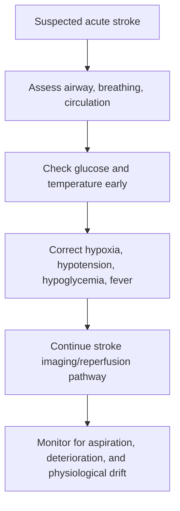
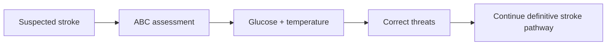

# Airway, breathing, circulation, glucose, and temperature priorities

Related: [[../Stroke Medicine MOC|Stroke Medicine MOC]] · [[../Stroke Recognition and Clinical Assessment|Stroke Recognition and Clinical Assessment]] · [[Stroke severity and bedside assessment|Stroke severity and bedside assessment]] · [[Dysphagia screening and aspiration risk]]

> [!important]
> **Before complex stroke decisions, stabilize the basics.** The exam pearl is that neglected ABC, glucose, or temperature problems can worsen brain injury, mimic stroke severity, or make otherwise treatable patients unsafe for reperfusion and monitoring.

## Learning Objectives
- Explain why ABC, glucose, and temperature are immediate stroke priorities.
- Recognize common airway and respiratory threats in acute stroke.
- Outline circulation goals and practical glucose/temperature management.
- Identify pitfalls such as unnecessary oxygen or missed hypoglycemia.
- Integrate these priorities into the first bedside minutes of stroke care.

## Definition
This topic covers the **initial physiological stabilization priorities** in suspected or confirmed acute stroke:
- **A**irway
- **B**reathing
- **C**irculation
- **Glucose**
- **Temperature**

These are early supportive measures that protect the brain and buy time for definitive stroke diagnosis and treatment.

## Core Anatomy
Acute stroke can compromise basic physiology through:
- brainstem dysfunction affecting airway protection and breathing
- reduced consciousness impairing airway safety
- bulbar weakness increasing aspiration risk
- hemispheric injury causing decreased alertness or poor secretion control

## Core Physiology
The ischemic penumbra is vulnerable to secondary injury. Hypoxia, hypotension, hypoglycemia, marked hyperglycemia, fever, aspiration, and poor perfusion worsen neuronal dysfunction and may enlarge the damaged area. Basic physiological optimization is therefore core stroke treatment, not just general supportive care.

## Normal Values / Important Cut-offs
- **Airway:** threatened in reduced consciousness, bulbar dysfunction, or poor secretion handling.
- **Breathing:** give oxygen only when clinically indicated by hypoxia or respiratory compromise; routine excessive oxygen is not universally beneficial.
- **Circulation:** avoid hypotension and major hemodynamic instability.
- **Glucose:** check immediately in all suspected stroke; hypoglycemia can mimic stroke and hyperglycemia worsens outcome.
- **Temperature:** fever should be recognized and treated because hyperthermia worsens brain injury.

## Classification
### By physiological domain
- airway threat
- breathing/oxygenation problem
- circulation/perfusion problem
- glucose disturbance
- temperature disturbance

## Etiology / Causes
### Airway/breathing problems in stroke
- depressed consciousness
- bulbar weakness
- aspiration
- coexisting pneumonia or pulmonary edema

### Glucose/temperature issues
- diabetes treatment causing hypoglycemia
- stress hyperglycemia
- infection causing fever
- central dysregulation in severe stroke

## Risk Factors
| Risk factor | Why it matters |
|---|---|
| Reduced consciousness | airway compromise risk |
| Brainstem stroke | bulbar and respiratory vulnerability |
| Dysphagia | aspiration risk |
| Diabetes | hypo-/hyperglycemia risk |
| Infection | pyrexia and deterioration |
| Severe stroke | greater physiological instability |

## Pathophysiology
Hypoxia and poor perfusion reduce oxygen delivery to already threatened tissue. Hypoglycemia deprives neurons of substrate and can mimic focal deficit. Hyperglycemia is associated with worse ischemic injury and poorer outcomes. Fever increases metabolic demand and amplifies secondary brain injury. Thus supportive physiology directly affects final neurological outcome.

## Clinical Features
### Airway warning signs
- reduced consciousness
- gurgling secretions
- poor cough/gag protection
- pooling saliva
- obvious aspiration

### Breathing warning signs
- hypoxia
- tachypnea or respiratory distress
- aspiration-related chest findings
- irregular breathing in severe brainstem disease

### Circulatory warning signs
- hypotension
- arrhythmia
- shock features
- severe hypertension requiring nuanced stroke-context management

### Glucose/temperature warning signs
- diaphoresis/confusion from hypoglycemia
- marked hyperglycemia
- fever/infection signs

## Approach / Algorithm

## Investigations
### Immediate bedside priorities
- pulse oximetry
- BP/heart rate
- capillary glucose
- temperature
- focused consciousness and bulbar assessment

### Additional context when indicated
- ECG
- ABG if respiratory failure or severe illness suspected
- infection workup if fever source suspected

## Interpretation Frameworks
### ABC-G-T frame
1. **Airway:** can the patient protect it?
2. **Breathing:** is oxygenation/ventilation adequate?
3. **Circulation:** is perfusion stable?
4. **Glucose:** low, normal, or high?
5. **Temperature:** febrile or normothermic?

### Oxygen principle
| Situation | Action |
|---|---|
| Hypoxic or respiratory distress | give oxygen and treat cause |
| Normal oxygenation without distress | routine excess oxygen not automatically needed |

## Diagnosis
This is not a separate disease diagnosis but a physiological stabilization framework applied in acute stroke care.

## Differential Diagnosis
- apparent stroke severity exaggerated by hypoglycemia
- altered consciousness from sepsis or intoxication
- respiratory distress from aspiration, pneumonia, pulmonary edema, or non-stroke illness

## Tables / Comparison Charts
### Immediate priorities and why they matter
| Priority | Why important |
|---|---|
| Airway | prevents hypoxia and aspiration |
| Breathing | ensures oxygen delivery |
| Circulation | preserves cerebral perfusion |
| Glucose | excludes mimic and prevents metabolic injury |
| Temperature | fever worsens brain injury |

## Management
### Airway
- position appropriately
- suction secretions if needed
- escalate airway support if unprotected airway or severe reduced consciousness

### Breathing
- monitor oxygen saturation
- give oxygen when hypoxic or clinically indicated
- treat aspiration/pulmonary complications promptly

### Circulation
- maintain hemodynamic stability
- avoid hypotension
- assess arrhythmia and shock causes
- interpret severe hypertension in stroke-specific context rather than reflexive over-lowering

### Glucose
- check immediately
- correct hypoglycemia urgently
- manage significant hyperglycemia according to protocol and context

### Temperature
- identify fever source
- use antipyretic/supportive cooling measures as appropriate
- treat infection when present

## Drug Interactions / Contraindications / Comorbidity Cautions
- Insulin or sulfonylurea use raises hypoglycemia risk.
- Sedatives can worsen airway compromise and mask deterioration.
- Overaggressive BP lowering may worsen cerebral perfusion in selected ischemic stroke patients.
- Excessive oxygen without indication is not a substitute for proper physiological monitoring.

## Procedures / Indications / Contraindications
- **Suction / airway adjuncts**
  - indication: secretion burden or impaired airway protection
- **Supplemental oxygen**
  - indication: hypoxia or respiratory distress
- **Capillary glucose testing**
  - indication: all suspected stroke cases
- **Temperature measurement and fever treatment**
  - indication: all acute stroke assessments

## Procedure Mini-Sections
### Capillary glucose check
- **Indication:** every suspected stroke.
- **Purpose:** detect hypoglycemia mimic and hyperglycemic burden.
- **Pearl:** one finger-prick test can completely change the immediate pathway.

### Airway protection strategy
- **Indication:** reduced consciousness or bulbar dysfunction.
- **Purpose:** prevent aspiration and hypoxia.
- **Pearl:** severe stroke care can fail early if airway risk is underestimated.

## Complications
- aspiration pneumonia
- hypoxic brain worsening
- hemodynamic collapse
- missed hypoglycemia mimic
- hyperglycemia-associated worse outcome
- fever-associated secondary injury

## Red Flags / Emergencies
- failing airway
- oxygen desaturation or respiratory distress
- persistent hypotension/shock
- severe hypo- or hyperglycemia
- high fever with neurological deterioration

## Prognosis
- Early physiological optimization improves the chance that definitive stroke therapies will help.
- Failure to stabilize basics may worsen disability even if imaging and reperfusion pathways are fast.

## Topic Correlation
- [[Prehospital stroke pathway and FAST/BE-FAST use]] starts recognition before arrival.
- [[NIHSS overview and practical use]] follows once the patient is stabilized enough for structured examination.
- [[Dysphagia screening and aspiration risk]] links directly to airway protection and aspiration prevention.

## Special Situations
### Brainstem stroke
- higher risk of airway and respiratory compromise.

### Diabetic patient
- always think of hypo-/hyperglycemia early.

### Septic/febrile patient
- fever may both mimic deterioration and worsen the stroke itself.

## FCPS/MRCP High-Yield Points
- ABC comes before fine neurological detail.
- Hypoglycemia is a critical stroke mimic.
- Fever worsens neurological injury and should be treated.
- Avoid unnecessary oxygen if not hypoxic, but never miss genuine respiratory compromise.
- Hypotension is dangerous because it reduces cerebral perfusion.

## Common Viva Questions
- Why is glucose checked immediately in suspected stroke?
- Why is fever harmful in acute stroke?
- When is oxygen indicated?
- How does reduced consciousness threaten the airway?
- Why must hypotension be avoided?

## Common Confusions / Exam Traps
- Focusing on NIHSS before stabilizing ABC.
- Forgetting glucose in every suspected stroke.
- Treating fever as trivial.
- Assuming normal speech means airway is safe.
- Reflexively giving oxygen to everyone regardless of saturation.

## Mnemonics
**A-B-C-G-T**
- **A**irway
- **B**reathing
- **C**irculation
- **G**lucose
- **T**emperature

## Mind Map
- Acute stroke physiological priorities
  - airway
  - breathing
  - circulation
  - glucose
  - temperature
  - aspiration prevention
  - cerebral perfusion

## Flowchart

## Suggested Visuals / Image Notes
- ABC-G-T acute stroke checklist
- Oxygen indication quick-reference table
- Hypoglycemia and fever caution box

## Suggested Video References
- Acute stroke resuscitation overview
- Airway protection in neurological patients
- Hyperacute stroke supportive care teaching

## One-Page Revision Summary
- Stabilize airway, breathing, and circulation first.
- Check glucose and temperature in every suspected stroke.
- Hypoglycemia can mimic stroke; hyperglycemia worsens outcome.
- Fever increases metabolic demand and worsens injury.
- Give oxygen when indicated by hypoxia, not blindly.
- Protect airway in reduced consciousness, bulbar weakness, and aspiration risk.

## 24-Hour Recall Prompts
- Why is glucose checked immediately?
- List 3 airway warning signs in stroke.
- Why is fever harmful in acute stroke?
- When should oxygen be given?
- Why can hypotension worsen outcome?

## 7-Day / 15-Day / 30-Day Revision Tracker
- **7 days:** reproduce the ABC-G-T framework from memory.
- **15 days:** explain oxygen, glucose, and temperature priorities without notes.
- **30 days:** give a viva answer on initial physiological stabilization in acute stroke.

## Must Know / Should Know / Nice to Know
### Must Know
- ABC first
- glucose in all cases
- fever harms brain
- protect airway and avoid hypotension

### Should Know
- oxygen only when indicated
- aspiration risk linkage
- hyperglycemia significance

### Nice to Know
- detailed institutional glucose/BP protocols
- advanced ventilation nuances in neurocritical care

## My Weak Points
- Do I remember glucose every time?
- Do I think about airway safety in drowsy patients?
- Do I overtreat oxygen or overlook fever?

## Self-Test Scorecard
- ABC recall /10
- Glucose/temperature recall /10
- Supportive management confidence /10
- Viva readiness /10
- Pitfall avoidance /10

## Exam Answer Modes
### Short note angle
Outline the importance of airway, breathing, circulation, glucose, and temperature priorities in acute stroke.

### Viva angle
“In suspected stroke I first stabilize airway, breathing, and circulation, check glucose and temperature early, correct hypoxia or hypoglycemia urgently, avoid hypotension, and treat fever because these secondary physiological insults worsen brain injury.”

## Summary
Airway, breathing, circulation, glucose, and temperature priorities form the physiological foundation of acute stroke care. Proper early supportive management prevents avoidable secondary injury and creates the conditions in which reperfusion and stroke-unit interventions can succeed.

## MCQs (10)
1. Which is an immediate priority in suspected stroke?
   - A. Capillary glucose
   - B. Colonoscopy
   - C. Thyroid ultrasound
   - D. Bone scan
   - E. Audiometry
2. Hypoglycemia is important because it:
   - A. can mimic stroke
   - B. proves hemorrhage
   - C. measures NIHSS
   - D. excludes TIA
   - E. predicts carotid stenosis
3. Fever in acute stroke is harmful because it:
   - A. lowers metabolic demand
   - B. worsens brain injury
   - C. guarantees infection absence
   - D. improves penumbral survival
   - E. always means migraine
4. Which patient most threatens the airway?
   - A. Reduced consciousness with bulbar dysfunction
   - B. Mild isolated hand numbness
   - C. Normal swallow and normal alertness
   - D. Stable chronic headache
   - E. Controlled BP alone
5. Oxygen in stroke should be:
   - A. given to all patients automatically at maximal flow
   - B. given when hypoxic or clinically indicated
   - C. never used
   - D. replaced by sugar water
   - E. used only after CT
6. Hypotension is dangerous because it:
   - A. may reduce cerebral perfusion
   - B. always causes seizure
   - C. proves mimic
   - D. lowers recurrence risk
   - E. is irrelevant in stroke
7. Which is part of the immediate stabilization bundle?
   - A. Temperature check
   - B. Hair examination only
   - C. Skin biopsy
   - D. Spirometry only
   - E. Bone density scan
8. A common pitfall is:
   - A. forgetting glucose testing
   - B. checking oxygen saturation
   - C. assessing consciousness
   - D. treating fever
   - E. considering aspiration
9. Which complication may follow poor airway protection?
   - A. Aspiration pneumonia
   - B. Cataract
   - C. Nephrolithiasis
   - D. Psoriasis
   - E. Otitis externa
10. Best overall summary?
   - A. Physiological stabilization is central to early stroke care
   - B. Only imaging matters
   - C. ABC can wait until after paperwork
   - D. Temperature is unimportant
   - E. Glucose is optional

## SBA Questions (10)
1. A drowsy stroke patient is gurgling with pooled secretions. Best immediate priority?
   - A. Oral feeding trial
   - B. Airway protection and suction/supportive management
   - C. Delayed assessment tomorrow
   - D. Ignore because CT is pending
   - E. Send home
2. A patient with unilateral weakness has capillary glucose 2.2 mmol/L. Best interpretation?
   - A. Hypoglycemia may be causing or contributing to the presentation and needs urgent correction
   - B. Stroke is impossible forever
   - C. This proves hemorrhage
   - D. Temperature is more important only
   - E. No treatment needed
3. Why is fever treated in acute stroke?
   - A. It worsens metabolic stress and brain injury
   - B. It confirms good prognosis
   - C. It excludes infection
   - D. It prevents all seizures
   - E. It proves TIA
4. A stroke patient has oxygen saturation 98% on room air and no distress. Best oxygen principle?
   - A. Maximal oxygen for everyone anyway
   - B. Routine excessive oxygen is not automatically necessary
   - C. Remove all monitoring
   - D. Ignore breathing
   - E. Start intubation immediately
5. Which patient is at higher aspiration risk?
   - A. Brainstem stroke with bulbar weakness
   - B. Alert patient with normal swallow
   - C. Mild isolated toe numbness
   - D. Stable outpatient migraine
   - E. Controlled hypertension only
6. Which circulatory problem is especially dangerous in acute ischemic stroke?
   - A. Hypotension
   - B. Mild dandruff
   - C. Presbyopia
   - D. Normal pulse
   - E. Mild eczema
7. Why is supportive care not “secondary” in stroke?
   - A. Because hypoxia, hypotension, hypo-/hyperglycemia, and fever worsen outcome
   - B. Because only nurses do it
   - C. Because imaging is useless
   - D. Because NIHSS is optional always
   - E. Because stroke cannot worsen
8. Which investigation belongs in the first minutes of acute stroke assessment?
   - A. Temperature measurement
   - B. Colon biopsy
   - C. Sleep study
   - D. Audiogram
   - E. DEXA scan
9. A stroke patient deteriorates with cough, crackles, and desaturation. Likely early complication linked to these priorities?
   - A. Aspiration-related respiratory compromise
   - B. Cataract
   - C. Psoriasis flare
   - D. Renal stone
   - E. Tinnitus
10. Best summary?
   - A. Airway, breathing, circulation, glucose, and temperature should be assessed early in every suspected stroke
   - B. Glucose and temperature are optional extras
   - C. Oxygen is always given regardless of saturation
   - D. Airway only matters after CT
   - E. Fever helps recovery

## Flashcards
- Q: What 5-priority shorthand is useful in early stroke supportive care?
  A: A-B-C-G-T = Airway, Breathing, Circulation, Glucose, Temperature.
- Q: Why check glucose in all suspected stroke patients?
  A: Hypoglycemia can mimic stroke and hyperglycemia worsens outcome.
- Q: Why is fever bad in acute stroke?
  A: It increases metabolic stress and worsens brain injury.
- Q: When is oxygen indicated?
  A: When the patient is hypoxic or clinically requires it.
- Q: Name one airway red flag in stroke.
  A: Reduced consciousness, pooled secretions, or bulbar weakness.
- Q: Why is hypotension harmful?
  A: It reduces cerebral perfusion.
- Q: Give one complication of poor airway protection.
  A: Aspiration pneumonia.
- Q: Does supportive care matter even before definitive stroke subtype is known?
  A: Yes.
- Q: Which stroke type especially threatens airway protection?
  A: Brainstem stroke or any stroke with reduced consciousness.
- Q: What is a common pitfall?
  A: Forgetting glucose testing or minimizing fever.

## Answer Key with Explanations
### MCQs
1. **A** — Glucose is an early universal check.
2. **A** — Hypoglycemia can mimic or worsen stroke presentation.
3. **B** — Fever worsens brain injury.
4. **A** — Reduced consciousness and bulbar dysfunction threaten airway safety.
5. **B** — Oxygen is used when clinically indicated, not blindly.
6. **A** — Hypotension reduces cerebral perfusion.
7. **A** — Temperature is part of the early physiological bundle.
8. **A** — Omitting glucose is a classic error.
9. **A** — Aspiration pneumonia is a key complication.
10. **A** — Early physiological stabilization is fundamental.

### SBAs
1. **B** — Protect the airway immediately.
2. **A** — Urgent correction of hypoglycemia is essential.
3. **A** — Fever increases metabolic injury.
4. **B** — Routine excessive oxygen is not automatically needed in a non-hypoxic patient.
5. **A** — Bulbar weakness greatly increases aspiration risk.
6. **A** — Hypotension is especially dangerous in acute stroke.
7. **A** — Secondary physiological insults worsen neurological outcome.
8. **A** — Temperature belongs in the early assessment.
9. **A** — This pattern suggests aspiration-related respiratory compromise.
10. **A** — ABC, glucose, and temperature are early essentials.
