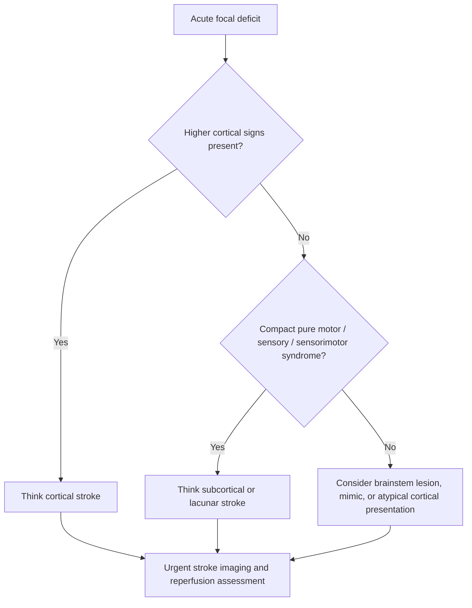

# Cortical vs subcortical stroke patterns

Related: [[../Stroke Medicine MOC|Stroke Medicine MOC]] · [[../Stroke Recognition and Clinical Assessment|Stroke Recognition and Clinical Assessment]] · [[Localization and vascular territory clues|Localization and vascular territory clues]] · [[Lacunar syndromes]]

> [!important]
> The quickest bedside distinction is this: **cortical stroke produces higher cortical dysfunction**, whereas **subcortical stroke typically causes compact motor/sensory syndromes without aphasia, neglect, gaze deviation, or cortical visual phenomena**.

## Learning Objectives
- Distinguish cortical from subcortical stroke at the bedside.
- Recognize clinical clues that imply hemispheric cortex involvement.
- Link subcortical patterns with lacunar or deep penetrating vessel disease.
- Use the distinction to guide imaging urgency, differential diagnosis, and acute management.

## Definition
A **cortical stroke** affects the cerebral cortex, especially frontal, parietal, temporal, or occipital cortical areas.

A **subcortical stroke** affects deeper structures such as:
- internal capsule
- corona radiata
- basal ganglia
- thalamus
- deep white matter
- brainstem pathways in compact motor/sensory syndromes

## Relevant Anatomy
### Cortical territories
- MCA cortex -> face-arm weakness, aphasia, neglect, gaze deviation
- ACA cortex -> leg-predominant weakness, abulia, frontal release features
- PCA cortex -> visual field defects, visual processing deficits

### Subcortical territories
- internal capsule -> dense pure motor weakness
- thalamus -> pure sensory syndromes
- corona radiata / deep white matter -> sensorimotor patterns
- basal ganglia and adjacent deep pathways -> compact focal deficits without cortical signs

## Core Physiological Logic
Cortical lesions disturb:
- language networks
- attentional networks
- visual association cortex
- praxis and cortical sensory integration

Subcortical lesions mainly interrupt:
- descending corticospinal tracts
- ascending sensory pathways
- compact relay systems

Therefore, the examination often shows:
- **cortical stroke** -> focal deficit plus higher cortical dysfunction
- **subcortical stroke** -> focal deficit without higher cortical dysfunction

## Classical Bedside Pattern
### Clues favoring cortical stroke
- aphasia
- neglect or inattention
- gaze deviation
- visual field defect with cortical pattern
- apraxia
- cortical sensory loss, extinction, astereognosis
- seizures at onset more often than in deep lacunar stroke

### Clues favoring subcortical stroke
- pure motor hemiparesis
- pure sensory stroke
- sensorimotor stroke
- dysarthria-clumsy hand syndrome
- ataxic hemiparesis
- absence of aphasia, neglect, and gaze deviation

## Comparison Table
| Feature | Cortical stroke | Subcortical stroke |
|---|---|---|
| Aphasia | Common if dominant hemisphere involved | Absent in classic cases |
| Neglect | Common in nondominant cortical stroke | Absent |
| Gaze deviation | Can occur | Uncommon |
| Visual field defect | Common cortical clue | Less typical as isolated deep sign |
| Pure motor syndrome | Less typical | Classic |
| Pure sensory syndrome | Less typical | Classic with thalamic lesions |
| Higher cortical deficits | Present | Absent |
| Common mechanism | Large-vessel embolic/atherothrombotic cortical infarct | Small-vessel / perforator disease |

## Pathophysiology
### Cortical stroke
Usually due to:
- embolic occlusion
- large-artery atherothrombosis
- branch occlusion affecting cortex

### Subcortical stroke
Usually due to:
- lipohyalinosis of penetrating arteries
- microatheroma
- branch perforator occlusion

## Bedside Recognition Algorithm

## Clinical Examples
### Cortical examples
- aphasia + right hemiparesis -> dominant MCA cortex
- neglect + left hemiparesis -> nondominant MCA cortex
- homonymous hemianopia + visual agnosia -> posterior cortical involvement

### Subcortical examples
- pure motor hemiparesis -> internal capsule lacune
- pure sensory stroke -> thalamic lacune
- dysarthria-clumsy hand -> deep pontine/internal capsule lesion

## Investigations
- non-contrast CT to exclude haemorrhage
- MRI with DWI when CT is nondiagnostic or lesion is small
- CTA/MRA if cortical large-vessel disease or thrombectomy pathway is possible
- ECG and routine stroke blood work

> [!tip]
> A clinically subcortical syndrome does not eliminate the need for standard acute stroke evaluation. Patients may still be within thrombolysis windows.

## Differential Diagnosis
### Mimics of cortical stroke
- post-ictal aphasia or Todd paresis
- migraine aura
- hypoglycaemia
- brain tumor or subdural lesion

### Mimics of subcortical stroke
- hypoglycaemia
- functional neurological disorder
- demyelination
- brainstem lesion
- intracerebral haemorrhage in deep structures

## Acute Management Relevance
The cortical-versus-subcortical distinction helps prioritize:
- suspicion of **large-vessel occlusion**
- need for vascular imaging
- reperfusion pathway urgency
- prognosis and complication monitoring

### Practical bedside consequences
- cortical stroke -> think embolic source, LVO, edema risk, seizures, neglect-related falls
- subcortical stroke -> think lacunar mechanism and aggressive risk-factor control, but do not delay hyperacute treatment decisions

## Complications
### Cortical stroke
- malignant edema in large infarcts
- seizures
- aphasia-related disability
- neglect and safety risk

### Subcortical stroke
- persistent pure motor disability
- gait dysfunction
- recurrent lacunes and vascular cognitive decline if risk factors persist

## FCPS/MRCP High-Yield Points
- **Aphasia, neglect, gaze deviation, apraxia, and cortical sensory loss** point to cortical stroke.
- **Pure motor or pure sensory syndromes without cortical signs** strongly suggest subcortical/lacunar stroke.
- A small deep infarct can still be clinically important and does not exempt the patient from acute stroke treatment pathways.
- MRI often detects small subcortical infarcts better than CT.

## Common Exam Traps
- Labeling a syndrome as lacunar despite clear aphasia or neglect.
- Assuming a mild stroke must be subcortical.
- Forgetting PCA cortical strokes may present mainly with visual syndromes.
- Missing the fact that deep hemorrhage can mimic subcortical ischemic stroke.

## One-Page Revision Summary
- Cortical stroke = higher cortical dysfunction present.
- Subcortical stroke = compact motor/sensory syndrome without cortical signs.
- Cortical clues: aphasia, neglect, gaze deviation, visual field defect, apraxia.
- Subcortical clues: pure motor, pure sensory, sensorimotor, dysarthria-clumsy hand, ataxic hemiparesis.
- Cortical patterns often imply larger-vessel disease; subcortical patterns often imply small-vessel disease.

## Must Know / Should Know / Nice to Know
### Must Know
- cortical signs imply cortical lesion
- pure motor/pure sensory patterns imply subcortical lesion
- lacunar syndromes are classic subcortical presentations

### Should Know
- MCA cortical syndromes vs internal capsule syndromes
- why subcortical strokes lack higher cortical deficits

### Nice to Know
- recurrent subcortical infarcts contribute to vascular cognitive impairment

## MCQs (10)
1. A feature most strongly favoring cortical stroke is: A. Aphasia B. Pure motor weakness C. Pure sensory loss D. Dysarthria-clumsy hand syndrome **Answer: A**
2. A classical subcortical presentation is: A. Pure motor hemiparesis B. Neglect C. Apraxia D. Gaze deviation **Answer: A**
3. Neglect usually implies involvement of: A. Cortex B. Internal capsule only C. Peripheral nerve D. Neuromuscular junction **Answer: A**
4. Pure sensory stroke is classically linked to: A. Thalamic subcortical lesion B. Frontal cortex C. Temporal cortex D. Cerebellar cortex **Answer: A**
5. Gaze deviation is more typical of: A. Cortical hemispheric stroke B. Lacunar stroke C. Peripheral vertigo D. Radiculopathy **Answer: A**
6. The usual mechanism of many subcortical lacunar strokes is: A. Small-vessel disease B. Myasthenia C. Meningitis D. Migraine **Answer: A**
7. Which does not fit a classic subcortical syndrome? A. Aphasia B. Pure motor weakness C. Sensorimotor stroke D. Ataxic hemiparesis **Answer: A**
8. MRI is especially useful in stroke because it better shows: A. Small deep infarcts B. Hair loss C. Asthma D. Skin lesions **Answer: A**
9. A dense hemiparesis without aphasia or neglect suggests: A. Subcortical/internal capsule lesion B. Occipital cortex lesion C. Retinal detachment D. Peripheral facial palsy **Answer: A**
10. The main bedside value of this distinction is to: A. Localize stroke pattern and guide acute pathway B. Replace imaging C. Exclude all mimics D. Diagnose epilepsy **Answer: A**

## SBA Questions (10)
1. A 66-year-old man develops sudden right-sided weakness affecting face, arm, and leg equally, with no aphasia, neglect, or gaze deviation. Most likely pattern? A. Subcortical stroke B. Cortical MCA stroke C. Migraine aura D. Functional blindness **Answer: A**
2. A patient has left hemiparesis plus right gaze preference and neglect. This most strongly suggests: A. Cortical hemispheric stroke B. Pure lacunar syndrome C. Peripheral neuropathy D. Brainstem demyelination **Answer: A**
3. Which symptom most reliably points away from a lacunar syndrome? A. Aphasia B. Mild weakness C. Dysarthria D. Sensory loss **Answer: A**
4. A pure sensory stroke is classically due to infarction in the: A. Thalamus B. Frontal cortex C. Cerebellum D. Occipital pole **Answer: A**
5. A patient with dysarthria-clumsy hand syndrome most likely has a: A. Subcortical/deep small-vessel stroke B. Cortical visual stroke C. Peripheral nerve lesion D. Conversion disorder **Answer: A**
6. The next best step after bedside localization remains: A. Acute stroke imaging B. Reassurance only C. Lumbar puncture first D. Spirometry **Answer: A**
7. Which mechanism best explains many cortical strokes? A. Large-vessel embolic/atherothrombotic disease B. Hair follicle inflammation C. Renal colic D. Osteoarthritis **Answer: A**
8. Which lesion is most associated with pure motor hemiparesis? A. Internal capsule B. Dominant temporal cortex C. Occipital cortex D. Vestibular apparatus **Answer: A**
9. A clinician labels a patient “lacunar” despite hemianopia and neglect. What is the best criticism? A. Cortical signs were ignored B. Stroke was excluded C. MRI is contraindicated D. Neglect is non-neurological **Answer: A**
10. A major exam pearl is: A. Higher cortical dysfunction implies cortical involvement B. Every stroke with weakness is cortical C. All subcortical strokes are benign D. Aphasia is a brainstem sign **Answer: A**

## Flashcards
- Q: What is the key clue to cortical stroke?  
  A: Higher cortical dysfunction such as aphasia, neglect, gaze deviation, apraxia, or cortical sensory loss.
- Q: What is the key clue to subcortical stroke?  
  A: Compact motor/sensory syndrome without higher cortical deficits.
- Q: What syndrome classically indicates internal capsule involvement?  
  A: Pure motor hemiparesis.
- Q: What syndrome classically indicates thalamic involvement?  
  A: Pure sensory stroke.
- Q: Does a subcortical-looking syndrome remove the need for acute stroke workflow?  
  A: No.

## Answer Key with Explanations
- Cortical signs are the most reliable bedside separators from classic subcortical/lacunar syndromes.
- Pure motor, pure sensory, and related compact syndromes are high-yield clues to subcortical disease.
- The distinction helps localization and mechanism thinking, but imaging still confirms diagnosis and guides treatment.
