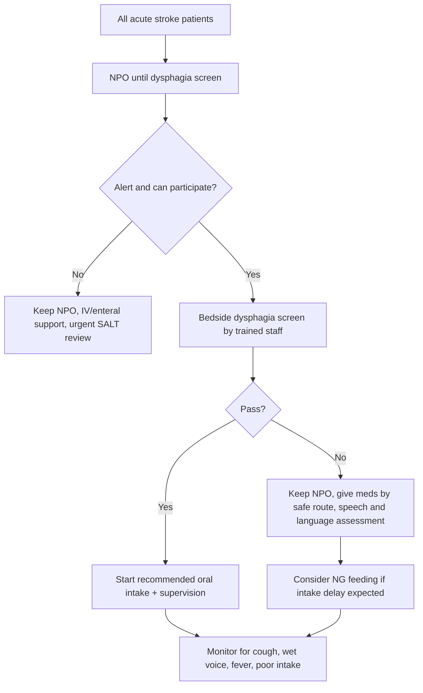

# Dysphagia screening and aspiration risk

Related: [[../Stroke Medicine MOC|Stroke Medicine MOC]] · [[../Stroke Recognition and Clinical Assessment|Stroke Recognition and Clinical Assessment]] · [[Stroke severity and bedside assessment|Stroke severity and bedside assessment]] · [[Airway, breathing, circulation, glucose, and temperature priorities]]

> [!important]
> Dysphagia is common after stroke and is a major driver of **aspiration pneumonia, dehydration, malnutrition, prolonged admission, and worse functional outcome**. Every acute stroke patient should be considered **nil by mouth until screened** unless already proven safe.

## Learning Objectives
- Recognize why dysphagia screening is a time-critical bedside task after stroke.
- Identify clinical clues that suggest unsafe swallowing and aspiration risk.
- Distinguish bedside screening from formal swallow assessment.
- Outline immediate management for unsafe swallow.
- Prevent aspiration, malnutrition, and medication-related errors in the acute stroke unit.

## Definition
**Post-stroke dysphagia** is impaired swallowing due to disruption of cortical, subcortical, brainstem, cerebellar, sensory, or motor pathways involved in oral, pharyngeal, and oesophageal phases of swallowing.

**Aspiration** means entry of food, fluid, saliva, or gastric content below the vocal cords. It may be:
- **Overt aspiration**: cough, choking, wet voice
- **Silent aspiration**: no visible cough despite airway contamination

## Why this matters in stroke
- Stroke-related dysphagia is common, especially early after onset.
- It increases risk of:
  - aspiration pneumonia
  - hypoxia and respiratory deterioration
  - dehydration and electrolyte disturbance
  - poor caloric intake and malnutrition
  - inability to give oral antiplatelets or other medication safely
  - prolonged hospitalization and worse rehabilitation outcome

## Relevant Anatomy and Physiology
Swallowing requires coordinated function of:
- **Cerebral cortex**: initiation and voluntary oral phase
- **Insula / frontal operculum**: swallowing planning and coordination
- **Internal capsule / corticobulbar tracts**: descending motor control
- **Brainstem swallowing centers**: nucleus tractus solitarius and nucleus ambiguus
- **Cranial nerves**:
  - V: mastication
  - VII: lip seal, oral control
  - IX: pharyngeal sensation
  - X: palate, pharynx, larynx, cough, vocal cord closure
  - XII: tongue movement and bolus propulsion

Normal swallowing depends on:
- adequate consciousness
- airway protection via laryngeal elevation and vocal cord closure
- intact cough reflex
- good posture and coordination
- synchronized breathing-swallow pattern

## Pathophysiology in stroke
Stroke may cause dysphagia by:
- reduced level of consciousness
- facial weakness and poor lip seal
- tongue weakness with impaired bolus propulsion
- delayed swallow trigger
- reduced pharyngeal contraction
- impaired laryngeal elevation / glottic closure
- impaired pharyngeal sensation causing silent aspiration
- poor attention, neglect, or cognitive dysfunction affecting feeding safety
- brainstem involvement causing severe bulbar dysfunction

## High-Risk Stroke Patterns
Dysphagia is particularly concerning in:
- **brainstem stroke**
- large hemispheric stroke
- bilateral lesions
- severe stroke with high NIHSS
- reduced consciousness
- pseudobulbar/bulbar weakness
- recurrent stroke
- posterior circulation stroke with cranial nerve involvement

## Clinical Features Suggesting Dysphagia
### History / observation
- drooling or pooling of saliva
- difficulty initiating swallow
- coughing during or after swallowing
- choking episodes
- repeated throat clearing
- wet / gurgly voice after sips
- nasal regurgitation
- prolonged mealtime
- inability to manage tablets
- unexplained desaturation during feeding
- recurrent fever or chest infection
- dehydration or poor intake

### Examination clues
- dysarthria
- facial weakness
- palatal weakness
- absent or weak cough
- reduced gag is not a reliable screening test alone
- poor tongue movement
- reduced alertness
- poor sitting balance/head control

## Aspiration Risk Factors
- drowsiness or delirium
- severe facial, lingual, palatal, or bulbar weakness
- brainstem stroke
- poor cough reflex
- prior neurological disease affecting swallowing
- severe aphasia/cognitive impairment with poor cooperation
- vomiting/reflux
- inability to sit upright
- oxygen dependence or respiratory compromise

## Bedside Approach / Algorithm

## Bedside Screening Principles
A bedside dysphagia screen should be:
- performed **before any food, drink, or oral medication**
- done by trained staff using local stroke-unit protocol
- repeated if the clinical state changes

Typical components:
- alertness and cooperation
- ability to sit up safely
- oral motor examination
- saliva control
- voice quality
- voluntary cough
- trial swallows if appropriate, often beginning with small water volumes depending on protocol

> [!warning]
> Do **not** force a water swallow in a clearly unsafe patient who is drowsy, choking on secretions, or has obvious bulbar weakness.

## What bedside screening can and cannot do
### Can do
- identify obvious unsafe swallow
- rapidly separate patients needing urgent specialist review
- support early prevention of aspiration

### Cannot do reliably
- exclude **silent aspiration** in all cases
- define exact texture/fluid modification for every patient
- replace instrumental assessment when concern persists

## Formal Swallow Assessment
A formal speech and language therapist / swallowing team assessment may include:
- detailed bedside swallow evaluation
- advice on texture and fluid consistency
- posture and compensatory manoeuvres
- safe medication administration plan
- need for instrumental testing

## Instrumental Assessment
Consider when the patient has:
- persistent dysphagia
- recurrent aspiration despite bedside adjustments
- suspected silent aspiration
- discrepancy between symptoms and bedside findings
- need for precise rehabilitation strategy

Common tests:
- **VFSS / modified barium swallow**
- **FEES** (fibreoptic endoscopic evaluation of swallowing)

## Investigations and Monitoring
- pulse oximetry if clinically indicated
- chest examination and CXR when aspiration pneumonia suspected
- hydration markers: urine output, urea, creatinine, sodium
- nutritional assessment: weight trend, intake chart, dietitian review
- inflammatory markers if infection suspected

## Diagnosis
Diagnosis is clinical at first contact:
- acute stroke + unsafe swallow signs = **suspected dysphagia with aspiration risk**

Formal confirmation comes from:
- structured swallow assessment
- VFSS / FEES where needed

## Differential Diagnosis / Mimics
- reduced consciousness from metabolic disturbance
- sedative effects
- pre-existing Parkinsonism/MND/myasthenia
- oesophageal obstruction
- post-ictal state
- severe respiratory distress causing poor swallow-breath coordination

## Management
## Immediate priorities
- keep patient **NPO** until screened
- sit upright if possible
- suction secretions if needed
- maintain hydration by IV route if oral route unsafe
- avoid routine oral tablets until swallow safety established
- request speech and language therapy assessment

## Safe medication strategy
If oral route is unsafe:
- use IV/rectal/NG alternatives where appropriate
- do not crush medications blindly
- check whether modified administration is safe and effective
- coordinate with pharmacy and stroke team

## Nutrition and Hydration
If swallowing unsafe beyond the initial period:
- consider **nasogastric feeding** for short- to medium-term support
- involve dietitian early
- monitor calorie/protein intake, hydration, glucose, and electrolytes
- PEG is generally considered for prolonged need rather than immediate hyperacute management

## Aspiration Prevention Measures
- upright positioning during and after feeding
- supervised feeding when advised
- appropriate texture-modified diet and thickened fluids if recommended
- small bolus size and slow pacing
- good oral hygiene
- stop feeding immediately if cough, wet voice, distress, or fatigue appears

## Management of Aspiration Pneumonia Suspicion
Look for:
- fever
- tachypnoea
- increased oxygen need
- cough with crepitations
- infiltrate on CXR when present

Management principles:
- oxygen if hypoxic
- sepsis assessment if unwell
- antibiotics if clinical aspiration pneumonia is likely
- chest physiotherapy/supportive care where appropriate
- continue swallow safety strategy; do not restart oral intake casually

## Rehabilitation
Swallowing function often improves over days to weeks, but not always.
Rehabilitation may include:
- repeated swallow reassessment
- compensatory manoeuvres
- texture progression
- strengthening / task-specific swallow therapy
- education of patient and caregivers

## Complications
- aspiration pneumonia
- dehydration
- hypernatraemia
- malnutrition
- medication omission
- delirium
- prolonged admission
- recurrent chest infection

## Red Flags / Emergencies
- drowsy stroke patient with secretions pooling in mouth
- brainstem stroke with weak cough and bulbar signs
- oxygen desaturation during swallowing
- recurrent choking or inability to clear airway
- fever and respiratory deterioration after oral intake
- silent aspiration suspicion despite apparently mild findings

## FCPS/MRCP High-Yield Points
- **Nil by mouth until screened** is the key acute rule.
- Brainstem stroke is strongly associated with severe dysphagia.
- Absence of cough does **not** exclude aspiration; silent aspiration occurs.
- Bedside screen is a triage tool, not the final word in persistent cases.
- Oral hygiene matters because colonized secretions worsen aspiration pneumonia risk.
- NG feeding is preferred over prolonged starvation when swallow recovery is delayed.

## Common Exam Traps
- Giving aspirin or water before swallow screening.
- Assuming normal speech means normal swallow.
- Using gag reflex alone to rule out dysphagia.
- Restarting oral feeding after one better-looking meal without reassessment.
- Forgetting medication-route review when oral route is unsafe.

## Table: Safe swallow decisions
| Situation | Best immediate action |
|---|---|
| Not yet screened | Keep NPO |
| Drowsy / poor airway protection | NPO + urgent specialist review |
| Failed bedside screen | NPO + alternative hydration/med route |
| Persistent concern despite passing | Formal swallow assessment / instrumental study as appropriate |
| Delayed oral recovery | NG feeding + dietitian/SALT input |

## One-Page Revision Summary
- Dysphagia after stroke is common and dangerous because it causes aspiration pneumonia, dehydration, and malnutrition.
- Every acute stroke patient should remain **NPO until screened**.
- High-risk features: drowsiness, brainstem stroke, bulbar weakness, weak cough, wet voice, drooling, repeated choking.
- Bedside screen is done by trained staff and checks alertness, oral motor function, saliva handling, voice, cough, and trial swallow when safe.
- Failed screen or obvious unsafe swallow -> no food/drink/oral meds, urgent SALT review, IV hydration, consider NG feeding.
- Persistent doubt or silent aspiration concern -> VFSS or FEES.
- Good oral hygiene, upright posture, supervised feeding, and texture modification reduce complications.

## Must Know / Should Know / Nice to Know
### Must Know
- NPO until screened
- overt vs silent aspiration
- aspiration pneumonia risk
- failed screen -> SALT review + alternative route for meds/fluids

### Should Know
- brainstem stroke and bulbar dysfunction
- VFSS/FEES indications
- NG vs PEG principles

### Nice to Know
- detailed rehabilitative manoeuvres and protocol variations

## 24-Hour Recall Prompts
- Why is dysphagia screening time-critical in stroke?
- Name 5 bedside clues of unsafe swallow.
- What should you do if a stroke patient fails swallow screen?
- Why is gag reflex alone unreliable?
- When should VFSS/FEES be considered?

## Revision Tracker
- Day 1: Rehearse NPO rule and aspiration red flags.
- Day 7: Rebuild bedside dysphagia algorithm from memory.
- Day 15: Compare overt vs silent aspiration and NG vs PEG roles.
- Day 30: Answer all MCQs/SBAs without notes.

## MCQs (10)
1. The most important immediate rule in acute stroke regarding oral intake is:
   A. Give water immediately if thirsty  
   B. Keep the patient nil by mouth until swallow screening  
   C. Start thickened fluids in all patients  
   D. Test gag reflex only  
   **Answer: B**

2. A common major complication of post-stroke dysphagia is:
   A. Pulmonary embolism  
   B. Aspiration pneumonia  
   C. Urinary retention  
   D. DVT only  
   **Answer: B**

3. Which finding suggests overt aspiration?
   A. Normal chest expansion  
   B. Coughing immediately after swallowing  
   C. Bradycardia at rest  
   D. Hyperreflexia  
   **Answer: B**

4. Silent aspiration means:
   A. Aspiration with no cough or obvious distress  
   B. Aspiration only during sleep  
   C. No aspiration on VFSS  
   D. Oesophageal dysmotility  
   **Answer: A**

5. The stroke location most strongly associated with severe dysphagia is often:
   A. Occipital lobe only  
   B. Brainstem  
   C. Frontal scalp  
   D. Cauda equina  
   **Answer: B**

6. Which is NOT sufficient alone to clear a patient for oral feeding?
   A. Structured swallow screen  
   B. Formal SALT assessment  
   C. Instrumental swallow study when indicated  
   D. Intact gag reflex by itself  
   **Answer: D**

7. If oral intake remains unsafe for an ongoing period after stroke, early nutritional support usually involves:
   A. Total fasting only  
   B. NG feeding  
   C. Immediate PEG in all patients  
   D. Oral supplements regardless of choking  
   **Answer: B**

8. Which measure reduces aspiration risk during feeding?
   A. Supine feeding  
   B. Large bolus volumes  
   C. Upright posture and supervision  
   D. Sedation before meals  
   **Answer: C**

9. Which clinical sign may suggest unsafe swallow after stroke?
   A. Wet gurgly voice  
   B. Isolated ankle edema  
   C. Clubbing  
   D. Tinnitus  
   **Answer: A**

10. Persistent concern about silent aspiration is a reason to request:
   A. EEG  
   B. Holter monitor  
   C. VFSS or FEES  
   D. Colonoscopy  
   **Answer: C**

## SBA Questions (10)
1. A 72-year-old man with acute lateral medullary stroke is drooling and coughing on his saliva. What is the best immediate action?  
   A. Start thickened fluids  
   B. Give aspirin orally  
   C. Keep NPO and request urgent swallow assessment  
   D. Encourage repeated water sips  
   **Answer: C**

2. A woman with MCA stroke has normal speech but coughs after drinking water. What is the best interpretation?  
   A. Swallow is safe because speech is normal  
   B. She likely has dysphagia and needs formal assessment  
   C. This excludes aspiration  
   D. She should continue oral tablets  
   **Answer: B**

3. A stroke patient passed an initial screen but repeatedly develops wet voice and desaturation at meals. Next best step?  
   A. Ignore because the first screen was normal  
   B. Reassess swallowing and consider instrumental study  
   C. Increase meal volume  
   D. Stop all rehabilitation  
   **Answer: B**

4. Which patient is at highest aspiration risk?  
   A. Mild pure sensory stroke, fully alert  
   B. Brainstem stroke with weak cough  
   C. Old lacunar infarct with no symptoms  
   D. Migraine aura  
   **Answer: B**

5. A patient fails bedside swallow screen. How should antiplatelet therapy be approached?  
   A. Delay all treatment permanently  
   B. Use a safe non-oral or appropriately supervised enteral route as advised  
   C. Crush every tablet in water immediately  
   D. Force tablets orally  
   **Answer: B**

6. A dysphagic stroke patient becomes febrile with crackles and hypoxia after attempted feeding. Most likely complication?  
   A. Pulmonary oedema only  
   B. Aspiration pneumonia  
   C. Tension pneumothorax  
   D. Status epilepticus  
   **Answer: B**

7. In post-stroke dysphagia, good oral hygiene is important because it:
   A. Prevents constipation  
   B. Reduces bacterial load available for aspiration  
   C. Lowers ICP  
   D. Improves NIHSS directly  
   **Answer: B**

8. Which bedside finding best suggests pharyngeal phase dysfunction?  
   A. Polyuria  
   B. Wet voice after swallow  
   C. Tremor only  
   D. Back pain  
   **Answer: B**

9. Which investigation best defines aspiration events and swallow biomechanics?  
   A. Carotid Doppler  
   B. VFSS  
   C. EMG lower limb  
   D. Echocardiography  
   **Answer: B**

10. A stroke patient is too drowsy to participate in swallow screening. Best plan?  
    A. Offer teaspoon water trial  
    B. Keep NPO and reassess when clinically safer  
    C. Start full oral diet  
    D. Ignore swallowing until discharge  
    **Answer: B**

## Flashcards
- Q: First oral-intake rule after acute stroke?  
  A: Keep nil by mouth until swallow screening is completed.
- Q: Major pulmonary complication of post-stroke dysphagia?  
  A: Aspiration pneumonia.
- Q: Which stroke location commonly causes severe bulbar dysphagia?  
  A: Brainstem stroke.
- Q: What does a wet voice after swallowing suggest?  
  A: Possible pharyngeal residue/aspiration risk.
- Q: Name two instrumental swallow tests.  
  A: VFSS and FEES.
- Q: Does intact gag reflex exclude dysphagia?  
  A: No.
- Q: What feeding route is often used when swallow is unsafe for days?  
  A: Nasogastric feeding.
- Q: What kind of aspiration may occur without cough?  
  A: Silent aspiration.

## Answer Strategy for Viva
- Start with the rule: **All stroke patients are NPO until screened.**
- Then mention consequences: aspiration pneumonia, dehydration, malnutrition.
- Then bedside clues: cough, wet voice, drooling, poor cough, brainstem signs.
- End with management: NPO, SALT assessment, safe medication route, NG if needed.

## Answer Key with Explanations

This file uses a Viva Answer Frame approach to highlight the highest-yield teaching points. For explicit MCQ/SBA answer lines, the **Answer: X** annotations within each MCQ/SBA item provide the key. The Viva Answer Frame covers the same key concepts in viva-friendly format.

For cross-reference and exam preparation:
- All 10 MCQs have **Answer: X** inline
- All 10 SBAs have **Answer: X** inline
- Flashcards have **A:** formatted answers
- The Viva Answer Frame covers high-yield teaching points

---

## Local Navigation

- [[../Stroke Medicine MOC|Stroke Medicine MOC]]
- [[../Davidson Chapter 29 - Stroke Medicine Hierarchy|Davidson Chapter 29 - Stroke Medicine Hierarchy]]
- [[Stroke recognition and first approach]]
- [[Sudden focal neurological deficit recognition]]
- [[NIHSS overview and practical use]]
- [[Airway, breathing, circulation, glucose, and temperature priorities]]
- [[Dysphagia screening and aspiration risk]]
- [[Prehospital stroke pathway and FAST/BE-FAST use]]
- [[Anterior vs posterior circulation stroke clues]]
- [[Lacunar syndromes]]
- [[Cortical vs subcortical stroke patterns]]
- [[Stroke mimics and common pitfalls]]

## PasTest Scenario SBAs (Clinical Vignettes)

> **Auto-generated PasTest/Mediscope-style scenario SBAs** grounded in the authored source. Each scenario tests a real clinical fact (triad, specific sign, contraindication, trial, first-line Rx) extracted from the topic. *Source: Ch 27: Neurology & Stroke — Dysphagia screening and aspiration risk*

**Q1.** Which of the following features is most specific or characteristic of Dysphagia screening and aspiration risk?

  - **A.** Answer: X
  - **B.** A feature common to many acute inflammatory conditions
  - **C.** A non-specific sign that does not localise the diagnosis
  - **D.** An investigation finding rather than a clinical feature

  > **Answer: A** — Answer: X
  >
  > *Source:* For explicit MCQ/SBA answer lines, the **Answer: X** annotations within each MCQ/SBA item provide the key

**Q2.** What is the most appropriate first-line therapy for Dysphagia screening and aspiration risk?

  - **A.** use IV/rectal/NG alternatives where appropriate
  - **B.** An advanced/surgical therapy reserved for refractory disease
  - **C.** Symptomatic treatment only, no disease-modifying therapy
  - **D.** Empiric broad-spectrum therapy without specific indication

  > **Answer: A** — use IV/rectal/NG alternatives where appropriate
  >
  > *Source:* use IV/rectal/NG alternatives where appropriate

