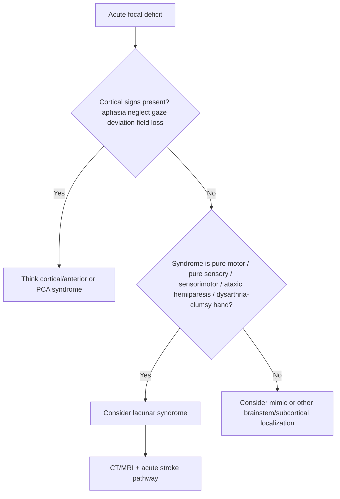

# Lacunar syndromes

Related: [[../Stroke Medicine MOC|Stroke Medicine MOC]] · [[../Stroke Recognition and Clinical Assessment|Stroke Recognition and Clinical Assessment]] · [[Localization and vascular territory clues|Localization and vascular territory clues]] · [[Secondary Prevention/Blood pressure control after stroke|Blood pressure control after stroke]]

> [!important]
> Lacunar stroke is a **small subcortical infarct** caused by occlusion of a penetrating artery, classically linked to **longstanding hypertension and small-vessel disease**. The bedside clue is a **pure motor, pure sensory, or sensorimotor focal syndrome without cortical signs**.

## Learning Objectives
- Define lacunar infarction and its vascular basis.
- Recognize the major classical lacunar syndromes.
- Distinguish lacunar syndromes from cortical stroke patterns.
- Outline investigation and acute management principles.
- Connect lacunar stroke with long-term vascular risk control.

## Definition
A **lacunar infarct** is a small deep brain infarct, usually in the territory of a single perforating artery, commonly affecting:
- internal capsule
- corona radiata
- thalamus
- pons
- basal ganglia

## Relevant Anatomy
Penetrating small vessels arise from larger parent arteries such as:
- MCA lenticulostriate branches
- ACA perforators
- PCA thalamoperforators
- basilar perforators

Structures commonly involved:
- posterior limb of internal capsule -> pure motor deficits
- thalamus -> pure sensory deficits
- basis pontis/internal capsule variants -> dysarthria-clumsy hand or ataxic hemiparesis

## Pathophysiology
The usual mechanism is **small-vessel lipohyalinosis or microatheroma** related to:
- chronic hypertension
- diabetes mellitus
- ageing
- smoking
- other vascular risk factors

Less often, a small deep infarct may reflect:
- branch atheromatous disease
- embolic occlusion of a perforator
- unusual vasculopathy

## Key Clinical Principle
Lacunar syndromes usually **lack cortical signs**.

This means typically **no**:
- aphasia
- neglect
- visual field loss from cortical lesions
- gaze deviation
- cortical sensory extinction/apraxia

## Classical Lacunar Syndromes
### 1. Pure motor hemiparesis
- contralateral weakness of face, arm, and leg
- no cortical signs
- often due to internal capsule or basis pontis lesion

### 2. Pure sensory stroke
- contralateral hemisensory loss
- often thalamic lesion
- can later develop dysaesthesia or central post-stroke pain

### 3. Sensorimotor stroke
- combined contralateral weakness and sensory loss
- usually deep subcortical lesion

### 4. Ataxic hemiparesis
- ipsilateral limb ataxia with contralateral weakness pattern overall affecting one side
- classically from pons/internal capsule/corona radiata region

### 5. Dysarthria-clumsy hand syndrome
- prominent dysarthria
- clumsy weak hand
- facial weakness may coexist
- usually small deep infarct in internal capsule or pons

## Clinical Features
- abrupt onset focal deficit
- often milder than large-vessel cortical stroke, but may still be disabling
- pure motor, pure sensory, or compact brainstem/subcortical syndrome
- preserved higher cortical function
- alert patient without neglect/aphasia in classic cases

## Bedside Recognition Algorithm

## Risk Factors
- hypertension
- diabetes mellitus
- smoking
- dyslipidaemia
- chronic kidney disease
- age-related small-vessel disease

## Investigations
### Acute imaging
- non-contrast CT head to exclude haemorrhage
- MRI with DWI is more sensitive for small deep infarcts

### Additional workup
Even if lacunar syndrome appears obvious, standard stroke evaluation is still needed:
- ECG
- blood glucose
- lipids, renal profile, CBC
- BP assessment
- vascular/cardiac studies as clinically appropriate

> [!tip]
> A clinically lacunar syndrome does not absolutely prove a lacunar mechanism; imaging and standard etiologic assessment are still important.

## Diagnosis
Diagnosis involves combining:
- a **typical clinical syndrome without cortical signs**
- imaging showing a small deep infarct when visible
- risk-factor pattern supporting small-vessel disease

## Differential Diagnosis
- cortical stroke without obvious aphasia early
- brainstem stroke
- hypoglycaemia
- seizure with Todd paresis
- demyelination
- functional neurological disorder
- intracerebral haemorrhage in deep structures

## Acute Management
Acute treatment principles are the same overarching stroke principles:
- rapid recognition and brain imaging
- reperfusion eligibility assessment if within window and appropriate
- control glucose, oxygenation, temperature
- screen swallowing if needed
- start secondary prevention after stroke type clarified

### Important nuance
A “lacunar-looking” syndrome should not delay acute stroke workflow. Some patients may still have a treatable acute ischemic stroke within thrombolysis windows.

## Secondary Prevention
Secondary prevention strongly targets small-vessel disease:
- sustained blood pressure control
- antiplatelet therapy for non-cardioembolic ischemic stroke
- statin therapy as indicated
- diabetes optimization
- smoking cessation
- exercise, diet, weight control

## Complications and Prognosis
- often better survival than large hemispheric strokes
- motor disability may still be substantial
- recurrent lacunes can accumulate and cause gait/cognitive impairment
- multiple small-vessel infarcts contribute to vascular cognitive impairment
- some thalamic lesions cause chronic central post-stroke pain

## FCPS/MRCP High-Yield Points
- Lacunar syndrome = **small deep infarct syndrome without cortical signs**.
- Classic patterns: pure motor, pure sensory, sensorimotor, ataxic hemiparesis, dysarthria-clumsy hand.
- Hypertension is the classic risk factor.
- MRI is more sensitive than CT for small lacunes.
- Do not assume “small stroke” means “unimportant”; risk-factor control is crucial.

## Common Exam Traps
- Calling a syndrome lacunar despite clear aphasia or neglect.
- Skipping thrombolysis consideration because deficits seem small.
- Forgetting thalamic sensory stroke among classic lacunar patterns.
- Assuming CT must always show the infarct immediately.

## Table: Classical lacunar syndromes
| Syndrome | Typical features | Common sites |
|---|---|---|
| Pure motor hemiparesis | Face-arm-leg weakness, no cortical signs | Internal capsule, pons |
| Pure sensory stroke | Contralateral hemisensory loss | Thalamus |
| Sensorimotor stroke | Combined weakness + sensory loss | Thalamocapsular/deep lesion |
| Ataxic hemiparesis | Weakness + disproportionate ataxia | Pons, internal capsule, corona radiata |
| Dysarthria-clumsy hand | Dysarthria + clumsy hand | Basis pontis/internal capsule |

## One-Page Revision Summary
- Lacunar strokes are small deep infarcts from penetrating artery occlusion.
- Classic risk factors: hypertension, diabetes, smoking, age.
- Think lacunar syndrome when there is a compact focal deficit **without cortical signs**.
- Five classics: pure motor, pure sensory, sensorimotor, ataxic hemiparesis, dysarthria-clumsy hand.
- MRI is better than CT for demonstrating small deep infarcts.
- Acute stroke pathway still applies; then focus on BP and vascular risk-factor control.

## Must Know / Should Know / Nice to Know
### Must Know
- no cortical signs
- 5 classical lacunar syndromes
- hypertension as major cause

### Should Know
- common sites: internal capsule, thalamus, pons
- MRI sensitivity and branch atheromatous caveat

### Nice to Know
- long-term link with vascular cognitive impairment and gait disorder

## 24-Hour Recall Prompts
- What defines a lacunar syndrome clinically?
- Name the 5 classic lacunar syndromes.
- Which cortical signs argue against a lacunar syndrome?
- Which risk factor is classically associated?
- Why can MRI be helpful when CT is normal?

## Revision Tracker
- Day 1: Memorize the 5 classic lacunar syndromes.
- Day 7: Compare lacunar vs cortical stroke from memory.
- Day 15: Practice 3 localization vignettes.
- Day 30: Redo MCQs/SBAs timed.

## MCQs (10)
1. A lacunar infarct is most commonly caused by occlusion of a:
   A. Large cortical vein  
   B. Small penetrating artery  
   C. Dural sinus  
   D. Coronary artery  
   **Answer: B**

2. The classic major risk factor for lacunar stroke is:
   A. Asthma  
   B. Hypertension  
   C. Hyperthyroidism  
   D. Peptic ulcer disease  
   **Answer: B**

3. Which feature argues against a classical lacunar syndrome?
   A. Pure motor hemiparesis  
   B. Aphasia  
   C. Dysarthria-clumsy hand  
   D. Pure sensory loss  
   **Answer: B**

4. Pure sensory stroke most often localizes to the:
   A. Thalamus  
   B. Cerebellar vermis  
   C. Frontal sinus  
   D. Cauda equina  
   **Answer: A**

5. Which is a classical lacunar syndrome?
   A. Neglect with gaze deviation  
   B. Ataxic hemiparesis  
   C. Cortical blindness  
   D. Alexia without agraphia  
   **Answer: B**

6. MRI is useful in suspected lacunar stroke because:
   A. CT always shows lacunes immediately  
   B. MRI is more sensitive for small deep infarcts  
   C. MRI excludes all mimics completely  
   D. MRI removes need for examination  
   **Answer: B**

7. Dysarthria-clumsy hand syndrome is most consistent with a lesion in the:
   A. Internal capsule or pons  
   B. Retina  
   C. Thoracic cord  
   D. Peripheral vestibular system  
   **Answer: A**

8. Which statement is true of lacunar stroke?  
   A. It always produces aphasia  
   B. It is usually associated with cortical signs  
   C. It may present as pure motor hemiparesis  
   D. It never recurs  
   **Answer: C**

9. A lacunar-looking syndrome should:
   A. Bypass acute stroke evaluation  
   B. Still undergo standard acute stroke assessment  
   C. Be treated as migraine by default  
   D. Never receive reperfusion consideration  
   **Answer: B**

10. Multiple lacunes over time may contribute to:
   A. Vascular cognitive impairment  
   B. Acute appendicitis  
   C. Hyperacusis  
   D. Pneumothorax  
   **Answer: A**

## SBA Questions (10)
1. A 64-year-old hypertensive man develops sudden right face-arm-leg weakness with no aphasia, no neglect, and no visual field defect. Most likely syndrome?  
   A. Lacunar pure motor stroke  
   B. MCA cortical stroke with aphasia  
   C. Subarachnoid haemorrhage  
   D. Meniere disease  
   **Answer: A**

2. A woman has abrupt left-sided numbness affecting face, arm, and leg. She is alert, fluent, and has no neglect. Most likely classical lacunar syndrome?  
   A. Pure sensory stroke  
   B. Cortical blindness  
   C. Broca aphasia  
   D. Locked-in syndrome  
   **Answer: A**

3. Which finding would most strongly suggest this is NOT a lacunar syndrome?  
   A. Dysarthria  
   B. Clumsy hand  
   C. Aphasia  
   D. Pure motor weakness  
   **Answer: C**

4. A patient has weakness and marked ipsilateral limb ataxia on one side of the body. Which lacunar syndrome fits best?  
   A. Ataxic hemiparesis  
   B. Neglect syndrome  
   C. Cortical sensory loss  
   D. Occipital syndrome  
   **Answer: A**

5. The vascular pathology classically underlying lacunar infarcts is:
   A. Lipohyalinosis of penetrating arteries  
   B. Aortic dissection  
   C. Venous sinus thrombosis  
   D. Endocarditis vegetation only  
   **Answer: A**

6. CT head is normal in a patient with probable lacunar stroke 2 hours after onset. Best interpretation?  
   A. Stroke excluded  
   B. MRI may still show a small deep infarct  
   C. Diagnosis must be peripheral neuropathy  
   D. No further stroke workup is needed  
   **Answer: B**

7. A lacunar syndrome with dysarthria and hand clumsiness is classically called:  
   A. Dysarthria-clumsy hand syndrome  
   B. Anton syndrome  
   C. Gerstmann syndrome  
   D. Wallenberg syndrome  
   **Answer: A**

8. Which long-term measure is especially important after lacunar stroke?  
   A. BP control  
   B. Avoiding all exercise forever  
   C. Routine steroids  
   D. Long-term antibiotics  
   **Answer: A**

9. A patient with presumed lacunar stroke presents within thrombolysis window. Best principle?  
   A. Reperfusion consideration still applies if otherwise eligible  
   B. Thrombolysis is automatically forbidden in all lacunar syndromes  
   C. Delay imaging because the stroke is small  
   D. Send home if walking  
   **Answer: A**

10. Recurrent multiple lacunes over years may lead to:  
    A. Vascular cognitive impairment and gait difficulty  
    B. Acute peritonitis  
    C. Addisonian crisis  
    D. Optic neuritis only  
    **Answer: A**

## Flashcards
- Q: Main vessel type involved in lacunar stroke?  
  A: Small penetrating artery.
- Q: Most classic risk factor for lacunar infarction?  
  A: Hypertension.
- Q: Name 3 classical lacunar syndromes.  
  A: Pure motor, pure sensory, sensorimotor.
- Q: Two more classical lacunar syndromes?  
  A: Ataxic hemiparesis and dysarthria-clumsy hand.
- Q: What key exam feature is usually absent in lacunar stroke?  
  A: Cortical signs such as aphasia or neglect.
- Q: Best MRI sequence for acute small infarct detection?  
  A: Diffusion-weighted imaging.
- Q: Common site of pure sensory lacunar stroke?  
  A: Thalamus.
- Q: Long-term consequence of recurrent lacunes?  
  A: Vascular cognitive impairment/gait disorder.

## Viva Answer Frame
- Define lacunar stroke as a small deep perforator infarct.
- Mention hypertension/small-vessel disease.
- State the absence of cortical signs.
- List the 5 classical syndromes.
- End with MRI usefulness and aggressive secondary prevention.

## Answer Key with Explanations

This file uses a Viva Answer Frame approach to highlight the highest-yield teaching points. For explicit MCQ/SBA answer lines, the **Answer: X** annotations within each MCQ/SBA item provide the key. The Viva Answer Frame covers the same key concepts in viva-friendly format.

For cross-reference and exam preparation:
- All 10 MCQs have **Answer: X** inline
- All 10 SBAs have **Answer: X** inline
- Flashcards have **A:** formatted answers
- The Viva Answer Frame covers high-yield teaching points

---

## Local Navigation

- [[../Stroke Medicine MOC|Stroke Medicine MOC]]
- [[../Davidson Chapter 29 - Stroke Medicine Hierarchy|Davidson Chapter 29 - Stroke Medicine Hierarchy]]
- [[Stroke recognition and first approach]]
- [[Sudden focal neurological deficit recognition]]
- [[NIHSS overview and practical use]]
- [[Airway, breathing, circulation, glucose, and temperature priorities]]
- [[Dysphagia screening and aspiration risk]]
- [[Prehospital stroke pathway and FAST/BE-FAST use]]
- [[Anterior vs posterior circulation stroke clues]]
- [[Lacunar syndromes]]
- [[Cortical vs subcortical stroke patterns]]
- [[Stroke mimics and common pitfalls]]
