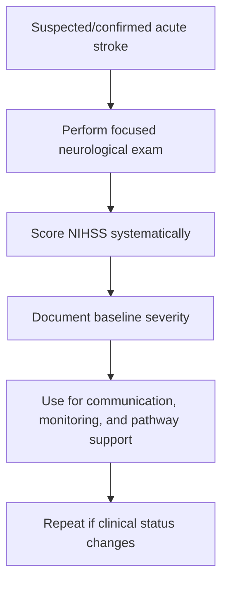
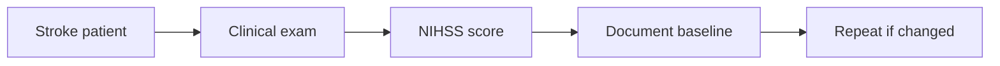

# NIHSS overview and practical use

Related: [[../Stroke Medicine MOC|Stroke Medicine MOC]] · [[../Stroke Recognition and Clinical Assessment|Stroke Recognition and Clinical Assessment]] · [[Stroke severity and bedside assessment|Stroke severity and bedside assessment]] · [[Sudden focal neurological deficit recognition]]

> [!important]
> **The NIHSS is a structured severity tool, not a substitute for full clinical judgment.** The exam pearl is to know both what it does well—**standardized stroke deficit quantification**—and what it does less well—especially some posterior circulation and subtle cognitive syndromes.

## Learning Objectives
- Define the NIHSS and its purpose.
- Describe the major domains assessed by the NIHSS.
- Interpret practical severity ranges.
- Explain how NIHSS helps communication, monitoring, and reperfusion decision-making.
- Recognize important limitations of the scale.

## Definition
The **National Institutes of Health Stroke Scale (NIHSS)** is a standardized bedside tool used to quantify neurological impairment in acute stroke.

It is mainly used to:
- assess initial stroke severity
- track change over time
- support team communication
- contribute to reperfusion and monitoring decisions

## Core Anatomy
NIHSS items sample deficits arising from multiple brain systems:
- consciousness and attention networks
- language cortex
- visual fields and eye movement pathways
- corticospinal motor pathways
- sensory pathways
- cerebellar coordination components
- neglect/inattention networks

Because it samples several but not all stroke domains, it is highly useful but incomplete.

## Core Physiology
Acute stroke disrupts localized neural function. NIHSS provides a reproducible numerical expression of this deficit burden. Higher scores generally reflect larger or more disabling network failure, though the same score can arise from different lesion patterns.

## Normal Values / Important Cut-offs
### Practical severity bands
- **0** = no measurable deficit on the scale
- **1–4** = mild stroke
- **5–15** = moderate stroke
- **16–20** = moderate-severe stroke
- **>20** = severe stroke

### Important cautions
- A low NIHSS does **not** exclude important stroke, especially posterior circulation or isolated cortical syndromes.
- Serial change in NIHSS may be as important as the baseline score.

## Classification
### By use case
- baseline severity assessment
- serial monitoring tool
- communication/documentation tool
- reperfusion/pathway support tool

## Etiology / Causes
The NIHSS does not diagnose cause; it quantifies **neurological consequences** of stroke, whether ischemic or hemorrhagic.

## Risk Factors
This is a severity-assessment topic rather than a risk-factor topic, but higher scores are often associated with:
- large-vessel occlusion
- larger infarct burden
- cortical plus subcortical involvement
- reduced consciousness

## Pathophysiology
More extensive or strategically placed brain injury produces greater deficits across the NIHSS domains. However, selective lesions—such as cerebellar or some brainstem strokes—may appear less severe numerically than they truly are functionally.

## Clinical Features
### Major NIHSS domains
- level of consciousness
- gaze
- visual fields
- facial palsy
- arm motor function
- leg motor function
- limb ataxia
- sensory loss
- language
- dysarthria
- extinction/inattention

## Approach / Algorithm

## Investigations
### NIHSS as bedside assessment
- performed at bedside by trained clinician
- repeated after deterioration/improvement or after reperfusion therapy when indicated
- interpreted alongside imaging and full exam

## Interpretation Frameworks
### What NIHSS is good for
| Strength | Why it helps |
|---|---|
| standardized language | improves handover |
| severity quantification | supports urgency and prognosis framing |
| serial monitoring | tracks deterioration/improvement |
| reperfusion communication | helps describe deficit burden |

### What NIHSS can underrepresent
| Limitation | Example |
|---|---|
| posterior circulation stroke | disabling vertigo/ataxia/brainstem deficits |
| subtle cognitive deficits | executive dysfunction not well captured |
| isolated visual or gait issues | may be functionally major but numerically modest |

## Diagnosis
NIHSS is not a diagnosis. It is a structured severity score to accompany the clinical diagnosis of stroke or suspected stroke.

## Differential Diagnosis
- apparent worsening from hypoglycemia or seizure mimic rather than true stroke progression
- language barrier or poor cooperation affecting score accuracy
- drowsiness from medication rather than stroke burden alone

## Tables / Comparison Charts
### NIHSS severity interpretation
| Score range | Practical interpretation |
|---|---|
| 0 | no measurable deficit on scale |
| 1–4 | mild stroke |
| 5–15 | moderate stroke |
| 16–20 | moderate-severe stroke |
| >20 | severe stroke |

## Management
### Clinical uses of NIHSS
- quantify baseline deficit
- communicate with stroke team
- help identify deterioration early
- aid documentation around reperfusion candidacy and monitoring intensity

### Good practice
- score systematically, not impressionistically
- interpret together with full examination and imaging
- repeat when the patient changes clinically

## Drug Interactions / Contraindications / Comorbidity Cautions
- Sedatives, intoxication, hypoglycemia, postictal state, and delirium may distort scoring.
- Aphasia or reduced education/language mismatch may complicate some items.
- Do not treat the score as more important than the patient’s actual function.

## Procedures / Indications / Contraindications
- **NIHSS assessment**
  - indication: suspected or confirmed acute stroke
- **Serial NIHSS reassessment**
  - indication: clinical change, post-reperfusion monitoring, evolving stroke

## Procedure Mini-Sections
### Baseline NIHSS
- **Indication:** early acute stroke assessment.
- **Goal:** objective severity documentation.
- **Pearl:** record before and after major therapeutic events when relevant.

### Repeat NIHSS
- **Indication:** deterioration or improvement.
- **Goal:** detect change reproducibly.
- **Pearl:** a rising score may signal hemorrhagic transformation, edema, re-occlusion, or another complication.

## Complications
- false reassurance from a low score in posterior circulation stroke
- inaccurate trend assessment if performed inconsistently
- inappropriate overreliance on score alone

## Red Flags / Emergencies
- rising NIHSS after initial stabilization
- sudden new aphasia, gaze deviation, or worsening hemiparesis
- clinical severity out of proportion to apparently low score

## Prognosis
- Higher NIHSS generally correlates with worse functional outcome and greater likelihood of major vessel occlusion.
- Still, prognosis depends on lesion type, location, treatment, and clinical course—not score alone.

## Topic Correlation
- [[Sudden focal neurological deficit recognition]] comes before severity scoring.
- [[Functional outcome prediction after stroke]] uses baseline severity as a major predictor.
- [[Early neurological deterioration after stroke]] often requires repeat NIHSS assessment.

## Special Situations
### Posterior circulation stroke
- may be functionally severe despite a modest NIHSS.

### Aphasic patient
- language-related scoring may be high even with preserved limb strength.

### Intubated or drowsy patient
- consciousness/language items may be affected by non-stroke factors.

## FCPS/MRCP High-Yield Points
- NIHSS is a bedside **severity** tool.
- It supports communication and monitoring.
- Low NIHSS does not guarantee minor functional impact.
- Posterior circulation stroke is a classic limitation.
- Trends over time matter.

## Common Viva Questions
- What is the NIHSS used for?
- How do you interpret common score ranges?
- What are the limitations of the NIHSS?
- Why is repeat scoring helpful?
- Why can a low NIHSS still be dangerous?

## Common Confusions / Exam Traps
- Treating NIHSS as a diagnostic test.
- Assuming low NIHSS equals low risk.
- Ignoring posterior circulation limitations.
- Forgetting serial changes matter.

## Mnemonics
**NIHSS USE**
- **U**niform scoring
- **S**everity tracking
- **E**volving trend recognition

## Mind Map
- NIHSS
  - purpose
    - severity
    - communication
    - monitoring
  - domains
    - consciousness
    - gaze/vision
    - motor
    - language
    - neglect
  - limits
    - posterior stroke
    - subtle cognition

## Flowchart

## Suggested Visuals / Image Notes
- NIHSS severity-band summary card
- Table of strengths vs limitations
- Posterior circulation caution box beside NIHSS

## Suggested Video References
- NIHSS bedside demonstration videos
- Stroke-team handover using NIHSS
- Posterior circulation stroke limitation teaching

## One-Page Revision Summary
- NIHSS quantifies stroke severity at bedside.
- Useful for baseline documentation, communication, and serial monitoring.
- Practical bands: 1–4 mild, 5–15 moderate, 16–20 moderate-severe, >20 severe.
- Limitation: low score does not exclude serious posterior or selectively disabling stroke.
- Always interpret with the full clinical picture.

## 24-Hour Recall Prompts
- What is the NIHSS for?
- Give the practical severity bands.
- Name 3 NIHSS limitations.
- Why are serial NIHSS scores useful?
- Why can posterior circulation stroke be underrepresented?

## 7-Day / 15-Day / 30-Day Revision Tracker
- **7 days:** list NIHSS severity bands from memory.
- **15 days:** explain strengths and limitations without notes.
- **30 days:** give a viva answer on NIHSS use in acute stroke.

## Must Know / Should Know / Nice to Know
### Must Know
- bedside severity tool
- common severity bands
- serial use
- posterior circulation limitation

### Should Know
- communication/prognostic role
- low score can still be clinically important

### Nice to Know
- item-by-item memorization details beyond core conceptual use

## My Weak Points
- Do I overinterpret a low NIHSS?
- Do I remember trends are important?
- Do I think about posterior stroke limitations?

## Self-Test Scorecard
- Purpose recall /10
- Severity band recall /10
- Limitation recall /10
- Viva confidence /10
- Practical application /10

## Exam Answer Modes
### Short note angle
Define NIHSS, describe its uses, give practical severity ranges, and explain limitations.

### Viva angle
“The NIHSS is a structured bedside stroke severity score used for baseline quantification, communication, and serial monitoring. It is useful but not complete, and it may underrepresent some posterior circulation strokes.”

## Summary
The NIHSS is one of the most important acute stroke bedside tools because it translates examination findings into a reproducible severity score. Its value lies in structured monitoring and communication, but it must always be interpreted with anatomical, imaging, and clinical context.

## MCQs (10)
1. NIHSS is primarily used to:
   - A. diagnose diabetes
   - B. quantify stroke severity
   - C. measure kidney function
   - D. diagnose infection
   - E. replace imaging
2. A practical NIHSS range for mild stroke is:
   - A. 1–4
   - B. 10–14
   - C. 20–25
   - D. >30
   - E. none
3. Which is a key NIHSS limitation?
   - A. It cannot be repeated
   - B. It may underrepresent posterior circulation stroke
   - C. It measures cholesterol poorly
   - D. It requires MRI to calculate
   - E. It only applies in hemorrhage
4. A rising NIHSS after thrombolysis may suggest:
   - A. improvement only
   - B. complication or deterioration
   - C. lab error only
   - D. guaranteed recovery
   - E. discharge readiness
5. Which domain is included in NIHSS?
   - A. Language
   - B. Liver span
   - C. Joint laxity
   - D. Thyroid size
   - E. Hearing threshold only
6. Which statement is correct?
   - A. Low NIHSS always means trivial stroke
   - B. NIHSS is a severity tool, not a full substitute for clinical judgment
   - C. NIHSS replaces the neurological exam
   - D. It is only for chronic stroke follow-up
   - E. It excludes stroke mimics automatically
7. Which use of NIHSS is especially helpful?
   - A. Standardized team communication
   - B. Replacing CT scan
   - C. Diagnosing atrial fibrillation
   - D. Measuring temperature
   - E. Predicting glucose
8. Which condition can distort NIHSS interpretation?
   - A. Hypoglycemia
   - B. Normal BP
   - C. Good sleep
   - D. Normal ECG
   - E. Corrected vision
9. Which score range is severe?
   - A. >20
   - B. 1–2
   - C. 0 only
   - D. 3–4 only
   - E. none
10. Best summary?
   - A. NIHSS is a useful structured stroke severity scale with important limits
   - B. NIHSS alone defines the whole diagnosis
   - C. NIHSS is unnecessary in acute stroke
   - D. NIHSS fully captures posterior stroke
   - E. NIHSS replaces prognosis assessment

## SBA Questions (10)
1. A patient with suspected acute stroke is first assessed in the emergency room. Why perform NIHSS?
   - A. To quantify baseline neurological severity
   - B. To replace imaging
   - C. To diagnose hemorrhage directly
   - D. To measure long-term cholesterol risk only
   - E. To prove LVO with certainty
2. A patient with severe ataxia and diplopia has a relatively low NIHSS. Best explanation?
   - A. Posterior circulation deficits may be underrepresented by the score
   - B. The patient cannot have stroke
   - C. The score always excludes disability
   - D. Imaging is unnecessary
   - E. This proves migraine
3. Which scenario most strongly justifies repeat NIHSS?
   - A. Clinical deterioration after initial stabilization
   - B. Stable patient with no change ever
   - C. Normal outpatient check without stroke
   - D. Routine skin rash
   - E. Seasonal allergy review
4. A patient’s NIHSS rises after an initially improving course. Best principle?
   - A. Ignore it if BP is normal
   - B. Consider new complication or worsening stroke and reassess urgently
   - C. Discharge because the score is subjective
   - D. It only reflects mood
   - E. It proves seizure only
5. Which statement about NIHSS is best?
   - A. It is most useful as a standardized bedside communication tool
   - B. It eliminates the need for neurological examination
   - C. It measures social support
   - D. It is only useful after discharge
   - E. It has no prognostic relevance
6. Which factor may falsely worsen NIHSS interpretation?
   - A. Sedation or low glucose
   - B. Good collateral history
   - C. Normal swallowing
   - D. Statin use
   - E. Family support
7. A patient with isolated aphasia may have a significant NIHSS despite preserved limb strength because:
   - A. Language is an important NIHSS domain
   - B. Motor function is the only scored domain
   - C. Aphasia is never scored
   - D. NIHSS ignores cortical deficits
   - E. The scale only measures coma
8. Which practical range is usually considered moderate stroke?
   - A. 5–15
   - B. 0 only
   - C. >30 only
   - D. 1–2 only
   - E. none
9. Why should NIHSS not be interpreted in isolation?
   - A. Stroke severity and function depend on location, imaging, and context too
   - B. Numbers are never useful
   - C. Imaging is always irrelevant
   - D. Posterior stroke does not exist
   - E. Clinical examination is optional
10. Best overall summary?
   - A. NIHSS is a reproducible severity scale that supports monitoring and communication but has important limitations
   - B. NIHSS replaces all clinical judgment
   - C. NIHSS is only for research, not practice
   - D. NIHSS fully defines reperfusion eligibility by itself
   - E. NIHSS excludes all stroke mimics

## Flashcards
- Q: What is the NIHSS mainly used for?
  A: Quantifying acute stroke severity.
- Q: Mild NIHSS range?
  A: 1–4.
- Q: Moderate NIHSS range?
  A: 5–15.
- Q: Severe NIHSS range?
  A: >20.
- Q: Name one important limitation of NIHSS.
  A: It may underrepresent posterior circulation stroke.
- Q: Why repeat NIHSS?
  A: To track improvement or deterioration.
- Q: Does NIHSS replace the full neurological exam?
  A: No.
- Q: Name one non-stroke factor that can distort NIHSS.
  A: Hypoglycemia or sedation.
- Q: Why is NIHSS useful in handover?
  A: It provides standardized communication of deficit severity.
- Q: Can a low NIHSS still be clinically important?
  A: Yes.

## Answer Key with Explanations
### MCQs
1. **B** — NIHSS quantifies stroke severity.
2. **A** — 1–4 is commonly used as mild.
3. **B** — Posterior circulation stroke may be underrepresented.
4. **B** — Rising score suggests deterioration or complication.
5. **A** — Language is a core NIHSS item.
6. **B** — NIHSS helps but never replaces clinical judgment.
7. **A** — Standardized communication is a major strength.
8. **A** — Hypoglycemia can distort the picture.
9. **A** — >20 is severe in practical bedside interpretation.
10. **A** — This best captures NIHSS value and limitation.

### SBAs
1. **A** — Baseline severity quantification is the main purpose.
2. **A** — Posterior deficits may be numerically underweighted.
3. **A** — Change in status should prompt repeat NIHSS.
4. **B** — Rising NIHSS must be taken seriously.
5. **A** — Standardization for communication is a major clinical use.
6. **A** — Sedation and hypoglycemia can alter scoring.
7. **A** — Language is directly scored and can drive severity.
8. **A** — 5–15 is the common moderate band.
9. **A** — Location and function matter beyond the number.
10. **A** — NIHSS is valuable but not all-sufficient.
