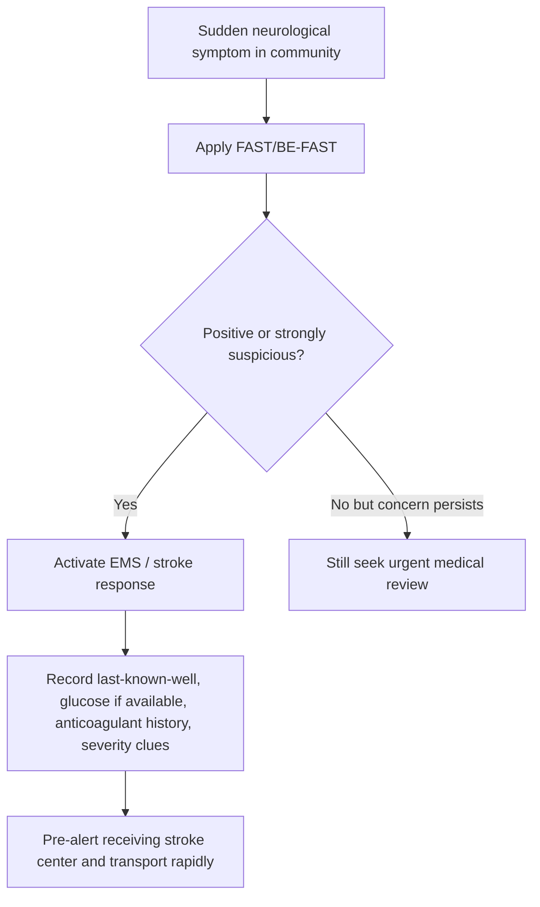
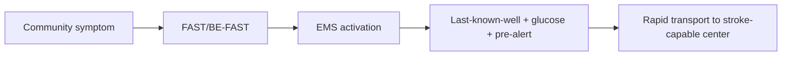

# Prehospital stroke pathway and FAST/BE-FAST use

Related: [[../Stroke Medicine MOC|Stroke Medicine MOC]] · [[../Stroke Recognition and Clinical Assessment|Stroke Recognition and Clinical Assessment]] · [[Stroke recognition and first approach|Stroke recognition and first approach]] · [[Sudden focal neurological deficit recognition]] · [[Stroke mimics and common pitfalls]]

> [!important]
> **Time lost before hospital arrival is brain lost.** The exam pearl is that the prehospital phase is not only about recognizing stroke; it is about **rapid recognition, time stamping, triage, bypass logic, and pre-alerting the stroke center**.

## Learning Objectives
- Explain the purpose of the prehospital stroke pathway.
- Describe FAST and BE-FAST screening tools.
- Identify what information must be transmitted before hospital arrival.
- Recognize limitations of FAST/BE-FAST and the risk of missed posterior circulation stroke.
- Outline a practical prehospital algorithm for suspected acute stroke.

## Definition
The **prehospital stroke pathway** is the organized sequence from symptom recognition in the community to emergency dispatch, field assessment, rapid transport, and stroke-center pre-alert.

**FAST** = Face, Arm, Speech, Time.  
**BE-FAST** adds **Balance** and **Eyes** to improve recognition of posterior circulation or visual syndromes.

## Core Anatomy
Prehospital tools detect major functional failures produced by acute focal brain injury:
- **facial droop** → corticobulbar involvement
- **arm weakness** → corticospinal dysfunction
- **speech disturbance** → dominant hemisphere or dysarthric brainstem/cortical involvement
- **balance/ataxia** → cerebellar or brainstem involvement
- **eye/visual symptoms** → occipital, brainstem, ocular motor, or visual pathway dysfunction

## Core Physiology
Stroke causes abrupt focal failure of brain networks supplied by compromised blood flow or hemorrhage. The prehospital goal is not definitive diagnosis but **rapid suspicion** and **time-sensitive routing** so reperfusion or hemorrhage-directed care is not delayed.

## Normal Values / Important Cut-offs
- **Last-known-well** is the critical time anchor, not simply time found.
- Sudden onset of FAST/BE-FAST symptoms should trigger emergency transport.
- Prehospital delay reduces reperfusion benefit in ischemic stroke.
- False negatives occur, especially in posterior circulation stroke, mild aphasia, isolated visual symptoms, or subtle neglect.

## Classification
### By screening tool
- FAST
- BE-FAST
- local EMS stroke scales / LVO-oriented scales

### By transport logic
- nearest stroke-capable hospital
- direct transport to thrombectomy-capable center when justified by protocol and geography

## Etiology / Causes
Prehospital stroke activation is triggered by suspected:
- acute ischemic stroke
- intracerebral hemorrhage
- TIA with ongoing or very recent focal symptoms

## Risk Factors
| Risk factor | Why it matters |
|---|---|
| Advanced age | common stroke demographic, but stroke can occur at any age |
| Hypertension | increases ischemic and hemorrhagic risk |
| Atrial fibrillation | cardioembolic stroke risk |
| Diabetes/smoking | vascular risk burden |
| Prior TIA/stroke | recurrence risk |

## Pathophysiology
The prehospital phase influences final outcome because early recognition shortens the time to imaging, thrombolysis, thrombectomy selection, BP guidance, and stroke-unit care. Missed recognition leads to preventable penumbral loss or delayed hemorrhage care.

## Clinical Features
### FAST features
- **Face:** facial asymmetry/droop
- **Arm:** unilateral arm weakness or drift
- **Speech:** slurring, aphasia, inability to repeat or understand
- **Time:** urgency of emergency response

### BE-FAST additions
- **Balance:** new gait instability, severe truncal ataxia
- **Eyes:** sudden visual loss, diplopia, gaze deviation, field cut

### Other prehospital clues
- abrupt onset
- focal pattern
- witnessed collapse with focal signs
- wake-up deficit discovered on waking

## Approach / Algorithm

## Investigations
### Prehospital assessment priorities
- time of onset / last-known-well
- FAST/BE-FAST findings
- glucose where EMS protocols allow
- anticoagulant use
- seizure vs stroke context if relevant
- baseline function / witness history

## Interpretation Frameworks
### FAST strengths and limits
| Tool element | Strength | Limitation |
|---|---|---|
| Face | easy to observe | may miss visual/ataxic syndromes |
| Arm | captures common motor stroke | mild weakness may be subtle |
| Speech | catches aphasia/dysarthria | isolated neglect/vision may be missed |
| BE additions | improves posterior/visual sensitivity | not perfect; still screening only |

### Pre-alert information bundle
1. last-known-well
2. positive deficits
3. glucose result if available
4. anticoagulant/bleeding history
5. suspected seizure/mimic context
6. transport ETA

## Diagnosis
Prehospital diagnosis is **suspected stroke**, not final stroke subtype. The key clinical outcome is accurate triage and rapid transport, not bedside certainty.

## Differential Diagnosis
- seizure/postictal state
- hypoglycemia
- migraine aura
- syncope with transient confusion
- functional neurological disorder
- peripheral vestibular disorder in isolated dizziness

## Tables / Comparison Charts
### FAST vs BE-FAST
| Scale | Components | Main advantage |
|---|---|---|
| FAST | face, arm, speech, time | simple, widely used |
| BE-FAST | balance, eyes, face, arm, speech, time | better recognition of posterior/visual presentations |

## Management
### Prehospital priorities
- treat as emergency
- do not delay for prolonged observation at home
- document last-known-well
- transport urgently via EMS when possible
- pre-alert stroke-capable center

### System-level goals
- reduce onset-to-door time
- route to the correct facility
- prepare imaging/reperfusion team before arrival

## Drug Interactions / Contraindications / Comorbidity Cautions
- Anticoagulant history matters because it changes downstream hemorrhage/reperfusion decisions.
- Hypoglycemia can mimic stroke and must be checked where possible.
- Sedatives/intoxication may cloud recognition but do not exclude stroke.

## Procedures / Indications / Contraindications
- **EMS stroke activation**
  - indication: sudden focal neurological syndrome suspicious for stroke
- **Pre-alert to stroke center**
  - indication: likely acute stroke within actionable pathway
- **Point-of-care glucose**
  - indication: suspected stroke where available/protocolized

## Procedure Mini-Sections
### Last-known-well capture
- **Indication:** every suspected acute stroke.
- **Principle:** use the last time the patient was definitely normal.
- **Pearl:** this may differ from discovery time or collapse time.

### Hospital pre-alert
- **Indication:** probable acute stroke.
- **Principle:** lets the receiving team prepare CT and stroke response.
- **Pearl:** pre-alert shortens door-to-needle time.

## Complications
- missed thrombolysis/thrombectomy window
- transport to wrong facility
- missed posterior circulation stroke
- avoidable prehospital delay from under-recognition

## Red Flags / Emergencies
- sudden hemiparesis or aphasia
- gaze deviation or severe visual disturbance
- severe new ataxia/imbalance
- reduced consciousness with focal signs
- anticoagulated patient with abrupt focal deficit

## Prognosis
- Good prehospital recognition improves reperfusion opportunity and disability outcomes.
- The earlier the stroke pathway is activated, the better the chance of salvageable tissue in ischemic stroke.

## Topic Correlation
- [[Sudden focal neurological deficit recognition]] is the clinical recognition core.
- [[Anterior vs posterior circulation stroke clues]] explains why BE-FAST helps.
- [[NIHSS overview and practical use]] becomes more relevant on arrival/in-hospital.

## Special Situations
### Wake-up stroke
- exact onset may be uncertain, but urgent pathway still applies.

### Posterior circulation stroke
- may be FAST-negative but BE-FAST-positive.

### Rural/long-distance transport
- destination choice and pre-alert become especially important.

## FCPS/MRCP High-Yield Points
- FAST is simple but not perfect.
- BE-FAST helps detect balance/eye symptoms.
- Last-known-well is essential.
- Pre-alert and rapid transport influence eligibility for reperfusion therapy.
- Posterior circulation stroke is a common missed scenario.

## Common Viva Questions
- What does FAST stand for?
- Why add B and E in BE-FAST?
- What prehospital information must be communicated?
- Why is last-known-well important?
- Why can posterior circulation stroke be missed prehospital?

## Common Confusions / Exam Traps
- Using discovery time instead of last-known-well.
- Assuming a negative FAST excludes stroke.
- Missing visual or balance-predominant stroke.
- Delaying EMS activation to “watch and wait.”

## Mnemonics
**BE-FAST**
- **B**alance
- **E**yes
- **F**ace
- **A**rm
- **S**peech
- **T**ime

## Mind Map
- Prehospital stroke pathway
  - recognition
    - FAST
    - BE-FAST
  - history
    - last-known-well
    - witness account
    - anticoagulants
  - transport
    - EMS
    - pre-alert
    - destination choice

## Flowchart

## Suggested Visuals / Image Notes
- FAST vs BE-FAST comparison card
- Prehospital information handoff checklist
- Posterior circulation warning symptom infographic

## Suggested Video References
- EMS stroke recognition demonstrations
- FAST/BE-FAST teaching videos
- Prehospital-to-door stroke pathway overview

## One-Page Revision Summary
- FAST = Face, Arm, Speech, Time; BE-FAST adds Balance and Eyes.
- Prehospital goal: rapid recognition, last-known-well capture, EMS transport, and pre-alert.
- BE-FAST helps catch posterior circulation and visual syndromes.
- Negative FAST does not fully exclude stroke.
- Delay in prehospital activation worsens outcome.

## 24-Hour Recall Prompts
- Expand FAST and BE-FAST.
- Why is last-known-well more important than discovery time?
- Name 3 pre-alert items.
- Why can posterior circulation stroke be missed by FAST?
- How does pre-alert help reperfusion care?

## 7-Day / 15-Day / 30-Day Revision Tracker
- **7 days:** write FAST/BE-FAST from memory.
- **15 days:** list the full pre-alert bundle without notes.
- **30 days:** explain the prehospital stroke pathway in a 2-minute viva.

## Must Know / Should Know / Nice to Know
### Must Know
- FAST and BE-FAST
- last-known-well
- pre-alert and urgent transport
- posterior circulation limitations of FAST

### Should Know
- destination triage logic
- anticoagulant history relevance
- EMS glucose role

### Nice to Know
- local LVO prehospital scales
- regional bypass protocols

## My Weak Points
- Do I confuse discovery time with last-known-well?
- Do I remember that BE-FAST helps posterior circulation recognition?
- Do I include anticoagulant history in the handoff?

## Self-Test Scorecard
- FAST/BE-FAST recall /10
- Pre-alert bundle recall /10
- Posterior stroke awareness /10
- Viva readiness /10
- System-thinking confidence /10

## Exam Answer Modes
### Short note angle
Define the prehospital stroke pathway, describe FAST and BE-FAST, and explain why time stamping and rapid transport matter.

### Viva angle
“Prehospital stroke care starts with rapid recognition using FAST or BE-FAST, immediate EMS activation, documentation of last-known-well, quick glucose check where available, and pre-alert to the receiving stroke center.”

## Summary
The prehospital stroke pathway and FAST/BE-FAST use are central to hyperacute stroke systems. They reduce delay by recognizing likely stroke early, capturing key decision-making information, and routing the patient rapidly to appropriate definitive care.

## MCQs (10)
1. FAST stands for:
   - A. Face, Arm, Speech, Time
   - B. Fever, Appetite, Sleep, Temperature
   - C. Face, Ataxia, Seizure, Trauma
   - D. Field, Arm, Sensory, Tone
   - E. None
2. BE-FAST adds which two domains?
   - A. Blood and ECG
   - B. Balance and Eyes
   - C. Brain and Ear
   - D. Breathing and Face
   - E. Blood pressure and Eyes
3. The most important prehospital time point is:
   - A. Time ambulance arrives
   - B. Time patient is found
   - C. Last-known-well
   - D. Time of CT
   - E. Time of first IV line
4. A limitation of FAST is that it may miss:
   - A. Posterior circulation stroke
   - B. Fever
   - C. Hypertension
   - D. Diabetes
   - E. Smoking history
5. Which action best improves hospital readiness before arrival?
   - A. Pre-alerting the stroke center
   - B. Waiting for family consensus
   - C. Giving oral fluids first
   - D. Delaying transport
   - E. Avoiding witness history
6. Which symptom is specifically better captured by BE-FAST than FAST?
   - A. Ataxia
   - B. Rash
   - C. Hematuria
   - D. Weight loss
   - E. Night sweats
7. Which statement is most correct?
   - A. Negative FAST excludes stroke
   - B. FAST is useful but imperfect
   - C. Prehospital time does not affect outcome
   - D. Stroke should be observed at home first
   - E. Pre-alert is unnecessary
8. Prehospital glucose matters because:
   - A. Hypoglycemia can mimic stroke
   - B. It diagnoses hemorrhage
   - C. It measures infarct size
   - D. It replaces CT
   - E. It rules out seizure
9. Which patient especially needs rapid routing to an appropriate center?
   - A. Suspected large-vessel occlusion pattern
   - B. Stable chronic back pain
   - C. Chronic insomnia only
   - D. Mild osteoarthritis
   - E. Seasonal allergy
10. Best summary?
   - A. FAST/BE-FAST are definitive diagnostic tools
   - B. They are prehospital screening tools supporting urgent stroke triage
   - C. They replace imaging
   - D. They apply only in ICU
   - E. They are not useful in posterior stroke

## SBA Questions (10)
1. A patient develops sudden aphasia and arm weakness at home. Best first community action?
   - A. Wait 2 hours
   - B. Activate EMS / emergency stroke pathway immediately
   - C. Give oral food and observe
   - D. Schedule clinic next week
   - E. Ignore because it may improve
2. A witness says the patient was normal at 7:00 AM and found weak at 8:30 AM. Which time should be used?
   - A. 8:30 AM
   - B. 7:00 AM
   - C. Time ambulance arrives
   - D. Time hospital registers patient
   - E. Time CT report returns
3. A patient has sudden diplopia, ataxia, and vomiting but no facial droop. Best lesson?
   - A. FAST-negative means no stroke
   - B. Posterior circulation stroke may still be present; BE-FAST helps
   - C. It must be gastroenteritis
   - D. It must be migraine only
   - E. It is not urgent
4. Which item is important in pre-alert handoff?
   - A. Last-known-well
   - B. Favorite food
   - C. Shoe size
   - D. Vaccination history only
   - E. Long-term family tree
5. Why is prehospital routing important?
   - A. It helps reach the right level of stroke care faster
   - B. It removes the need for imaging
   - C. It cures stroke in the field
   - D. It avoids all mimics
   - E. It only matters in hemorrhage
6. Which statement about FAST is true?
   - A. It detects every stroke syndrome
   - B. It is simple and useful but can miss some posterior/visual cases
   - C. It replaces medical assessment
   - D. It is not relevant to EMS
   - E. It applies only to TIA
7. EMS checks glucose in suspected stroke mainly because:
   - A. Low glucose can mimic focal deficit
   - B. Glucose identifies thrombectomy site
   - C. It measures NIHSS
   - D. It confirms carotid stenosis
   - E. It excludes hemorrhage
8. In a rural area with suspected severe stroke and long transport, pre-alert is especially useful because:
   - A. It shortens preparation time at the receiving center
   - B. It replaces ambulance transport
   - C. It guarantees thrombolysis
   - D. It removes need for CT
   - E. It stops progression in the field
9. A common error is:
   - A. Recording last-known-well
   - B. Pre-alerting early
   - C. Waiting at home to see if symptoms resolve
   - D. Considering posterior symptoms
   - E. Checking witness history
10. Best overall summary?
   - A. Prehospital stroke care is mainly documentation only
   - B. Recognition, timing, triage, and pre-alert are all critical
   - C. Only hospital treatment matters
   - D. Posterior stroke cannot be screened at all
   - E. BE-FAST is unrelated to stroke systems

## Flashcards
- Q: What does FAST stand for?
  A: Face, Arm, Speech, Time.
- Q: What does BE-FAST add?
  A: Balance and Eyes.
- Q: Most important prehospital stroke time anchor?
  A: Last-known-well.
- Q: Why is BE-FAST useful?
  A: It improves recognition of posterior/visual stroke syndromes.
- Q: What does pre-alert do?
  A: It prepares the receiving stroke team before arrival.
- Q: Does negative FAST fully exclude stroke?
  A: No.
- Q: Why check glucose prehospital?
  A: Hypoglycemia can mimic stroke.
- Q: Give one key handoff item.
  A: Last-known-well or anticoagulant history.
- Q: What is the core prehospital goal?
  A: Rapid recognition and transport to appropriate care.
- Q: Why are rural routing decisions important?
  A: They affect timely access to reperfusion-capable centers.

## Answer Key with Explanations
### MCQs
1. **A** — FAST = Face, Arm, Speech, Time.
2. **B** — BE-FAST adds Balance and Eyes.
3. **C** — Last-known-well is the crucial decision time.
4. **A** — FAST can miss posterior circulation presentations.
5. **A** — Pre-alert prepares imaging and stroke response.
6. **A** — Ataxia is better captured by BE-FAST.
7. **B** — FAST is helpful but imperfect.
8. **A** — Hypoglycemia is an important mimic.
9. **A** — Suspected LVO patterns especially need appropriate routing.
10. **B** — FAST/BE-FAST are screening tools, not definitive diagnosis.

### SBAs
1. **B** — Suspected stroke needs immediate EMS activation.
2. **B** — Use the last time known normal.
3. **B** — Posterior circulation stroke may be FAST-negative.
4. **A** — Last-known-well is a key handoff element.
5. **A** — Proper routing speeds access to appropriate treatment.
6. **B** — FAST is useful but misses some syndromes.
7. **A** — Low glucose may mimic stroke.
8. **A** — Pre-alert reduces downstream delay.
9. **C** — Waiting at home is a major error.
10. **B** — Prehospital care is about recognition, time, triage, and communication.
