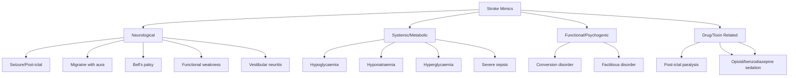
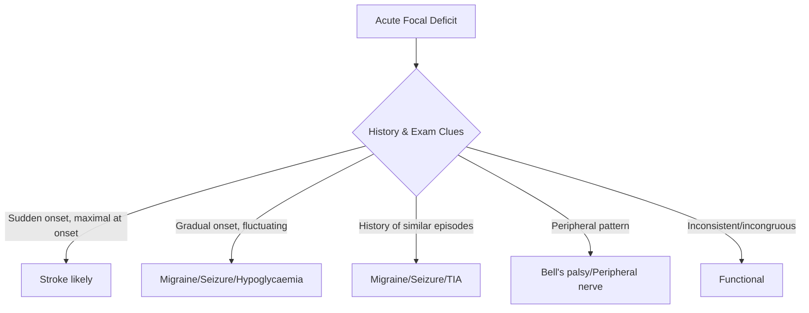
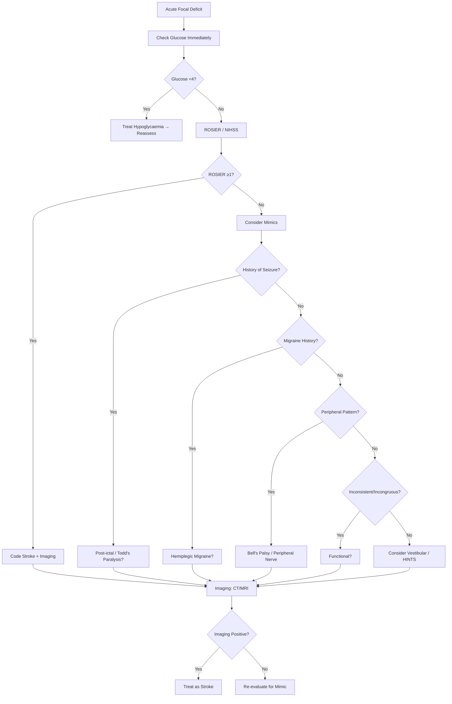
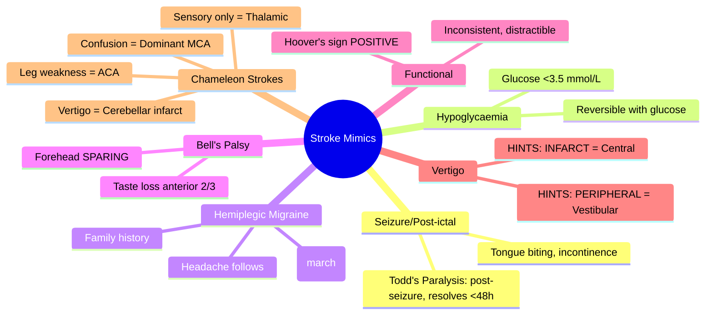

## Definition

**Stroke mimics** are non-vascular conditions presenting with acute focal neurological deficits that resemble stroke. They account for 20-30% of suspected stroke presentations. Common mimics include seizure (post-ictal Todd's paresis), migraine with aura, syncope, hypoglycaemia, functional (conversion) disorder, brain tumour, and subdural haematoma.

# Stroke Mimics and Common Pitfalls

## Learning Objectives
- [ ] Identify common stroke mimics and their distinguishing features
- [ ] Apply structured approach to differentiate stroke from mimics
- [ ] Recognize "chameleon" presentations of stroke
- [ ] Apply imaging and clinical criteria to avoid misdiagnosis
- [ ] Identify FCPS/MRCP high-yield mimics and pitfalls

---

## Stroke Mimics: Epidemiology

| Statistic | Value |
|-----------|-------|
| **Proportion of stroke admissions that are mimics** | **15-30%** |
| **Most common mimic category** | **Seizure / post-ictal state** |
| **Mimic rate in thrombolysis trials** | **3-15%** (in modern trials with imaging) |
| **Cost of misdiagnosis** | Delayed treatment for true stroke; unnecessary thrombolysis risks |

> **FCPS/MRCP**: **1 in 5 "stroke alerts" is a mimic** — systematic approach essential.

---

## Classification of Stroke Mimics

---

## Top 10 Stroke Mimics: Clinical Differentiation

### 1. Seizure / Post-ictal State (Most Common Mimic)
| Feature | Stroke | Post-ictal / Todd's Paralysis |
|-------|--------|------------------------------|
| **Onset** | Sudden, maximal at onset | **After witnessed seizure** |
| **Duration** | Persistent | **Resolves** (minutes to 48h) |
| **Tone** | Flaccid → spastic | Usually flaccid |
| **Eye Deviation** | Toward lesion | **Toward seizure focus** (ipsilateral) |
| **Babinski** | Usually + | Usually - |
| **Other Clues** | Tongue biting, incontinence, tongue injury | Post-ictal confusion, myalgia |
| **EEG** | Nonspecific slowing | **Epileptiform activity** |

> **Todd's Paralysis**: **Post-ictal weakness resolves within 48h** — key differentiator.

---

### 2. Hypoglycaemia
| Feature | Stroke | Hypoglycaemia |
|-------|--------|---------------|
| **Onset** | Sudden focal deficit | **Global confusion + focal signs** |
| **Glucose** | Normal | **<3.5 mmol/L (<63 mg/dL)** |
| **Symptoms** | Focal deficit | **Sweating, tachycardia, hunger, confusion** |
| **Resolution** | Persists | **Rapid with glucose** |
| **Exam** | Focal signs | **May have hemiparesis** (resolves with glucose) |

> **Critical**: **Check capillary glucose FIRST in ALL acute focal deficits** — reversible, excludes thrombolysis if <4 mmol/L.

---

### 3. Migraine with Aura (Hemiplegic Migraine)
| Feature | Stroke | Hemiplegic Migraine |
|-------|--------|---------------------|
| **Onset** | **Sudden, maximal at onset** | **Gradual spread** (minutes) |
| **Progression** | Immediate maximal | **March** (spreads over minutes) |
| **Headache** | Variable | **Severe, throbbing** (often follows) |
| **Visual Symptoms** | Field cut | **Scintillating scotoma, fortification spectra** |
| **Duration** | Persistent | **Resolves** (minutes-hours) |
| **Family History** | Variable | **Often positive** |
| **Trigger** | None | **Stress, sleep, diet, hormonal** |

> **Hemiplegic Migraine**: **Positive family history** (CACNA1A, ATP1A2, SCN1A mutations) — genetic testing if recurrent.

---

### 4. Bell's Palsy (Facial Nerve Palsy)
| Feature | Stroke (Pontine/Cortical) | Bell's Palsy |
|-------|---------------------------|--------------|
| **Forehead Sparing** | **No** (upper motor neuron) | **Yes** (lower motor neuron) |
| **Eye Closure** | Incomplete | **Incomplete** |
| **Brow Movement** | **Preserved** | **Absent** |
| **Other CN Signs** | Often present (VI, VIII) | **Isolated CN VII** |
| **Arm/Leg Weakness** | May be present | **Absent** |
| **Taste** | Normal | **Anterior 2/3 loss** |

> **Key**: **Forehead sparing = Bell's palsy**; **Forehead involved = central (stroke)**.

---

### 5. Functional Neurological Disorder (Conversion Disorder)
| Feature | Stroke | Functional / Conversion |
|-------|--------|-------------------------|
| **Onset** | Sudden | **Abrupt, often stress-related** |
| **Consistency** | **Consistent**, follows anatomy | **Inconsistent**, gives way, non-anatomic |
| **Effort** | Maximal effort | **Gives way**, "collapse" |
| **Hoover's Sign** | Negative | **Positive** (pressure on paretic heel when lifting good leg) |
| **Distractibility** | Not distracted | **Distractible** (improves with distraction) |
| **Sensory** | Follows dermatomes | **Stocking/glove**, non-dermatomal |

> **Hoover's Sign**: **Positive = functional** — patient presses down with good leg when asked to lift weak leg.

---

### 6. Vestibular Neuritis / Labyrinthitis
| Feature | Posterior Stroke (Cerebellar) | Vestibular Neuritis |
|-------|-------------------------------|---------------------|
| **Vertigo** | Constant, directional | **Paroxysmal, head-movement triggered** |
| **Nystagmus** | **Direction-changing, vertical/torsional** | **Unidirectional, horizontal-torsional** |
| **HINTS Exam** | **HINTS "Central"** | **HINTS "Peripheral"** |
| **Hearing Loss** | Rare | **Labyrinthitis: Yes** |
| **Other CNS Signs** | Often present (ataxia, dysarthria) | **Absent** |

> **HINTS Exam**: **Head Impulse, Nystagmus, Test of Skew** — **"INFARCT" = normal Head Impulse, Direction-changing Nystagmus, Skew deviation** → Central (Stroke).

---

## "Chameleon" Strokes: Strokes Masquerading as Mimics

| Presentation | Actual Stroke Syndrome | Key Clue |
|--------------|------------------------|-----------|
| **Acute Vertigo + Nausea** | **Cerebellar/PICA infarct** | **HINTS "Central"** |
| **Acute Confusion/Aphasia** | **Dominant MCA infarct** | **No fever, negative infection workup** |
| **Acute Leg Weakness + Urinary Incontinence** | **ACA infarct (Paracentral)** | **Urinary incontinence** |
| **Isolated Horner's + Vertigo** | **Lateral Medullary (Wallenberg)** | **Ipsilateral Horner's + contralateral pain/temp loss** |
| **Pure Sensory Stroke** | **Thalamic (VPL) infarct** | **Hemisensory loss, no motor deficit** |
| **Peduncular Stroke** | Midbrain (CN III palsy + contralateral hemiparesis) | **Contralateral ataxia (Claude syndrome)** |

---

## Diagnostic Approach to Suspected Mimic

---

## FCPS/MRCP High-Yield Summary

| Mimic | Key Differentiator | FCPS/MRCP Pearl |
|-------|-------------------|-----------------|
| **Post-ictal/Todd's** | **Follows witnessed seizure**; resolves <48h | **Tongue biting, incontinence** = seizure |
| **Hypoglycaemia** | **Glucose <3.5**; improves with glucose | **Check glucose FIRST** in all focal deficits |
| **Hemiplegic Migraine** | **Gradual spread (march)**; headache; family hx | **Positive family hx** in hemiplegic migraine |
| **Bell's Palsy** | **Forehead SPARING** (LMN); taste loss | **Forehead involved = Stroke (UMN)** |
| **Bell's vs Stroke** | **Forehead sparing = Bell's**; no other deficits | **HV + 6th nerve = Pontine stroke** |
| **Functional** | **Inconsistent, Hoover's +ve, distractible** | **Hoover's +ve = Functional** |
| **Vertigo** | **HINTS "INFARCT" = Central**; "PERIPHERAL" = Vestibular | **HINTS: INFARCT = Central** |
| **Hypoglycaemia** | **Glucose <3.5**; reversible with glucose | **CHECK GLUCOSE FIRST** |
| **Todd's Paralysis** | **Post-seizure weakness resolves <48h** | **Witnessed seizure = key history** |
| **Conversion** | **Hoover's +ve, distractible, non-anatomic** | **Hoover's sign = Functional** |

---

## Viva Questions

1. **What are the top 3 stroke mimics?**
2. **How do you differentiate Todd's paralysis from acute stroke?**
3. **What is the key feature distinguishing Bell's palsy from pontine stroke?**
4. **How do you differentiate hemiplegic migraine from stroke?**
4. **What is Hoover's sign and what does it indicate?**
5. **How does HINTS exam distinguish central from peripheral vertigo?**
5. **What is the "INFARCT" mnemonic in HINTS?**
6. **How do you distinguish functional weakness from stroke?**
7. **What is the key differentiating feature of hypoglycaemia vs stroke?**
8. **What is Todd's paralysis and how long does it last?**
9. **How do you identify a "chameleon" stroke presenting as vertigo?**
10. **List 5 common stroke mimics and one distinguishing feature for each.**

---

## Confusions & Mnemonics

| Confusion | Clarification |
|-----------|---------------|
| Todd's Paralysis vs Stroke | **Todd's = post-seizure, resolves <48h**; Stroke = persistent |
| Bell's Palsy vs Pontine Stroke | **Forehead sparing = Bell's**; Forehead involved = central |
| Hemiplegic Migraine vs Stroke | **Gradual spread (march)** vs **sudden maximal onset** |
| Functional vs Stroke | **Inconsistent, Hoover's +ve, distractible** vs consistent, anatomic |
| Central vs Peripheral Vertigo | **HINTS: INFARCT = Central** (Stroke); **PERIPHERAL = Vestibular** |
| Todd's Paralysis Duration | **<48 hours** — if longer, think stroke |
| Hypoglycaemia vs Stroke | **Glucose <3.5 mmol/L**; Rapid reversal with glucose |
| Conversion vs Stroke | **Inconsistent, Hoover's +ve, non-anatomic** |

---

## Mind Map

---

## One-Page Revision Card

| **Mimic** | **Key Differentiator** | **Management** |
|-----------|------------------------|----------------|
| **Todd's Paralysis** | Post-seizure; resolves <48h | Observe; treat underlying epilepsy |
| **Hypoglycaemia** | Glucose <3.5 mmol/L; rapid reversal | Glucose IV → reassess |
| **Hemiplegic Migraine** | Gradual spread; family hx; headache | Migraine prophylaxis; no thrombolysis |
| **Bell's Palsy** | **Forehead SPARING** (LMN) | Steroids + eye care; NO thrombolysis |
| **Functional** | Hoover's +ve; inconsistent; distractible | Psychiatric liaison; rehab |
| **Vertigo - Central** | HINTS "INFARCT" | **Treat as stroke** (thrombolysis if within window) |
| **Vertigo - Peripheral** | HINTS "PERIPHERAL" | Symptomatic (antiemetics, vestibular rehab) |
| **Chameleon: Vertigo** | HINTS "INFARCT" + no hearing loss | **Treat as cerebellar stroke** |

---

## Spaced Repetition Tracker

| Day | 1 | 3 | 7 | 15 | 30 |
|-----|---|---|---|----|----|
| Top 5 Mimics | ☐ | ☐ | ☐ | ☐ | ☐ |
| Todd's Paralysis vs Stroke | ☐ | ☐ | ☐ | ☐ | ☐ |
| Bell's Palsy vs Stroke | ☐ | ☐ | ☐ | ☐ | ☐ |
| HINTS Exam Mnemonic | ☐ | ☐ | ☐ | ☐ | ☐ |
| Functional Weakness Signs | ☐ | ☐ | ☐ | ☐ | ☐ |

---

## Self-Test Scorecard

| Question | My Answer | Correct? |
|----------|-----------|----------|
| Top 3 mimics |  |  |
| Todd's vs Stroke |  |  |
| Bell's Palsy forehead |  |  |
| HINTS INFARCT |  |  |
| Functional Hoover's |  |  |

---

## Local Navigation

- [[Stroke Recognition and Clinical Assessment/Stroke recognition and first approach|Stroke Recognition]]
- [[Stroke Recognition and Clinical Assessment/Sudden focal neurological deficit recognition|Sudden Focal Deficit]]
- [[Neuroimaging and Acute Evaluation/When to search for stroke mimics and alternative diagnoses|Imaging Mimics]]
- [[Acute Ischaemic Stroke/Acute ischaemic stroke|Acute Ischaemic Stroke]]
- [[Stroke Recognition and Clinical Assessment/Prehospital stroke pathway and FAST/BE-FAST use|Prehospital FAST/BE-FAST]]
---

## MCQs (10)
1. % of suspected strokes that are mimics?
   A) 20-30%
   B) **A**
   C) 
   D) 
   **Answer: A**

2. Most common stroke mimic?
   A) Seizure (Todd's paresis)
   B) **B**
   C) 
   D) 
   **Answer: A**

3. Always check in suspected stroke?
   A) Capillary blood glucose
   B) **C**
   C) 
   D) 
   **Answer: A**

4. Migraine aura spreads over?
   A) 5-20 minutes
   B) **D**
   C) 
   D) 
   **Answer: A**

5. Hoover's sign is positive in?
   A) Functional (conversion) weakness
   B) **A**
   C) 
   D) 
   **Answer: A**

6. Tongue biting + incontinence suggests?
   A) Seizure (post-ictal)
   B) **B**
   C) 
   D) 
   **Answer: A**

7. Posterior circulation chameleon can present as?
   A) Isolated vertigo, ataxia, nausea
   B) **C**
   C) 
   D) 
   **Answer: A**

8. HINTS exam differentiates?
   A) Central vs peripheral vertigo
   B) **D**
   C) 
   D) 
   **Answer: A**

9. Hypoglycaemia mimicking stroke — threshold?
   A) BG < 2.8 mmol/L
   B) **A**
   C) 
   D) 
   **Answer: A**

10. Always-exclude mimic?
   A) Hypoglycaemia, seizure, migraine, syncope
   B) **B**
   C) 
   D) 
   **Answer: A**

## SBA Questions (10)
1. Sudden right arm weakness after witnessed generalised tonic-clonic seizure — diagnosis? | Todd's paresis (post-ictal)

2. Sudden aphasia with BG 2.3 mmol/L — first action? | IV dextrose 50 mL of 50%

3. Gradual visual scotomata spreading over 15 min followed by headache — diagnosis? | Migraine with aura

4. Sudden vertigo with vertical nystagmus and skew deviation — likely? | Central (brainstem stroke)

5. Hoover's sign positive on exam — diagnosis? | Functional (conversion) weakness

6. Sudden LOC with prodromal lightheadedness, full recovery in 30 sec — diagnosis? | Syncope

7. Sudden right hemiparesis with sensory march over 5 min, no cortical signs — diagnosis? | Migraine

8. Sudden isolated confusion with right arm drift — likely? | Stroke (NOT mimic)

9. Sudden gait ataxia with vertical nystagmus — likely? | Posterior circulation stroke (NOT labyrinthitis)

10. Hypoglycaemia — when does it cause focal deficits? | BG < 2.8 mmol/L

## Flashcards
**Q: Mimic %?**
A: 20-30%

**Q: Top mimics?**
A: Seizure, migraine

**Q: Always check?**
A: Glucose

**Q: Migraine aura?**
A: 5-20 min spread

**Q: Hoover's?**
A: Functional

**Q: Tongue biting?**
A: Seizure

**Q: Chameleon?**
A: Stroke presenting as non-stroke

**Q: HINTS?**
A: Central vs peripheral

**Q: BG threshold?**
A: < 2.8 mmol/L

**Q: Syncope?**
A: Brief LOC, rapid recovery

## Answer Key with Explanations
### MCQs
1. **A** — % of suspected strokes that are mimics?
2. **A** — Most common stroke mimic?
3. **A** — Always check in suspected stroke?
4. **A** — Migraine aura spreads over?
5. **A** — Hoover's sign is positive in?
6. **A** — Tongue biting + incontinence suggests?
7. **A** — Posterior circulation chameleon can present as?
8. **A** — HINTS exam differentiates?
9. **A** — Hypoglycaemia mimicking stroke — threshold?
10. **A** — Always-exclude mimic?

### SBAs
1. **Todd's paresis (post-ictal)**
2. **IV dextrose 50 mL of 50%**
3. **Migraine with aura**
4. **Central (brainstem stroke)**
5. **Functional (conversion) weakness**
6. **Syncope**
7. **Migraine**
8. **Stroke (NOT mimic)**
9. **Posterior circulation stroke (NOT labyrinthitis)**
10. **BG < 2.8 mmol/L**

## Local Navigation

- [[../Stroke Medicine MOC|Stroke Medicine MOC]]
- [[../Davidson Chapter 29 - Stroke Medicine Hierarchy|Davidson Chapter 29 - Stroke Medicine Hierarchy]]
