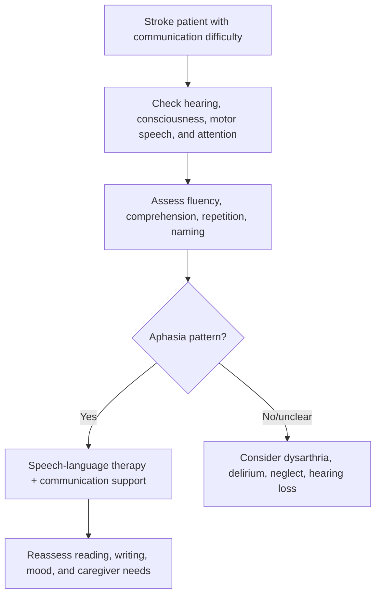
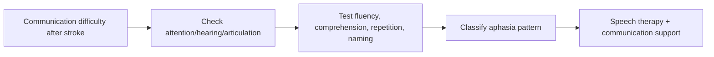

# Aphasia after stroke

Related: [[../Stroke Medicine MOC|Stroke Medicine MOC]] · [[../Recovery, Rehabilitation, and Prognosis|Recovery, Rehabilitation, and Prognosis]] · [[Communication and swallowing sequelae|Communication and swallowing sequelae]] · [[Neglect and cognitive impairment after stroke]] · [[Persistent dysphagia and nutrition planning]]

> [!important]
> **Aphasia is a language disorder, not a disorder of intelligence.** The exam pearl is to separate **aphasia** from **dysarthria**, **confusion**, **hearing loss**, and **neglect**, because communication failure after stroke is often mislabeled.

## Learning Objectives
- Define aphasia after stroke.
- Distinguish aphasia from dysarthria and delirium.
- Recognize major aphasia patterns and vascular localization.
- Outline assessment and rehabilitation principles.
- Summarize prognosis and communication-support strategies.

## Definition
**Aphasia** is an acquired impairment of language affecting comprehension, expression, naming, repetition, reading, or writing due to dominant-hemisphere cortical/subcortical dysfunction, most commonly after stroke.

## Core Anatomy
- Usually associated with the **dominant hemisphere**, most often the **left hemisphere**.
- Important regions include:
  - inferior frontal language areas → nonfluent output
  - posterior superior temporal/parietal regions → fluent but impaired comprehension
  - arcuate/perisylvian connections → repetition disturbance
- Most stroke-related aphasia is due to **MCA territory** lesions.

## Core Physiology
- Language depends on integrated cortical networks for auditory decoding, semantic processing, motor speech planning, and written language.
- Stroke disrupts these networks, causing selective deficits in comprehension, fluency, repetition, naming, reading, and writing.
- Recovery depends on lesion size, reperfusion, neuroplasticity, therapy intensity, and cognitive reserve.

## Normal Values / Important Cut-offs
- Sudden new language impairment is **stroke until proved otherwise**.
- Any patient with suspected aphasia requires assessment of:
  - fluency
  - comprehension
  - repetition
  - naming
- Aphasia may prevent valid consent/history-taking unless communication is adapted.
- Severe global aphasia is a major functional disability even if motor power is relatively preserved.

## Classification
### Major clinical patterns
- **Broca (expressive/nonfluent) aphasia**
- **Wernicke (receptive/fluent) aphasia**
- **Global aphasia**
- **Conduction aphasia**
- **Anomic aphasia**

### By function affected
- expressive predominant
- receptive predominant
- mixed severe language failure

## Etiology / Causes
- Dominant-hemisphere ischemic stroke
- Intracerebral hemorrhage affecting language networks
- Large MCA infarction
- Less commonly: tumor, encephalitis, trauma, seizures/postictal states

## Risk Factors
| Risk factor | Why it matters |
|---|---|
| Left MCA stroke | Commonest vascular setting |
| Large cortical infarct | Greater language network injury |
| Older age / low reserve | Slower recovery in some patients |
| Associated neglect/cognitive impairment | Harder rehabilitation |
| Delayed speech-language therapy | Functional recovery may lag |

## Pathophysiology
Stroke injures dominant-hemisphere language networks. Nonfluent aphasia tends to reflect impaired language production with relatively better comprehension, while fluent aphasia reflects impaired comprehension and semantic monitoring. Severe large-vessel or extensive cortical strokes may cause global aphasia with major loss of both output and understanding. Secondary frustration, isolation, depression, and reduced participation in rehabilitation worsen outcome if communication support is poor.

## Clinical Features
### Typical features
- word-finding difficulty
- reduced or effortful speech
- impaired understanding of spoken language
- paraphasic errors
- inability to repeat phrases
- impaired reading/writing

### Clues by pattern
- **Broca:** halting speech, frustrated patient, relatively better comprehension
- **Wernicke:** fluent but meaningless speech, impaired comprehension, poor insight
- **Global:** severe impairment of both comprehension and expression
- **Anomic:** prominent naming difficulty with relatively preserved fluency/comprehension

## Approach / Algorithm

## Investigations
### Core assessment
- bedside language exam
- NIHSS language item where relevant
- brain imaging defining stroke site/type
- formal speech and language therapy assessment

### Additional practical assessment
- reading and writing ability
- naming and repetition tasks
- ability to follow 1-step and 2-step commands
- mood/frustration screening

## Interpretation Frameworks
### Aphasia bedside frame
1. Is speech **fluent or nonfluent**?
2. Is **comprehension preserved or impaired**?
3. Can the patient **repeat**?
4. Is there **naming difficulty**?
5. Could the issue instead be dysarthria, confusion, neglect, or hearing loss?

### Aphasia vs common mimics
| Problem | Key clue |
|---|---|
| Aphasia | language content/comprehension impaired |
| Dysarthria | words correct but articulation slurred |
| Delirium | fluctuating global attention failure |
| Hearing loss | language formulation intact if heard properly |
| Neglect | inattention rather than pure language failure |

## Diagnosis
Diagnosis is clinical, based on impaired language function after stroke with localization supported by brain imaging. A practical diagnosis may be:
- Broca aphasia after left MCA infarct
- Wernicke aphasia after posterior dominant-hemisphere stroke
- global aphasia after large left MCA stroke

## Differential Diagnosis
- Dysarthria
- Delirium/confusional state
- Hearing impairment
- Postictal aphasia
- Dementia with acute decompensation
- Functional communication disorder

## Tables / Comparison Charts
### High-yield aphasia patterns
| Type | Fluency | Comprehension | Repetition |
|---|---|---|---|
| Broca | reduced | relatively preserved | impaired |
| Wernicke | fluent | impaired | impaired |
| Global | reduced | impaired | impaired |
| Conduction | fluent-ish | relatively preserved | markedly impaired |
| Anomic | fluent | relatively preserved | relatively preserved |

## Management
### Core principles
- identify aphasia early
- involve **speech and language therapy** promptly
- adapt all communication with the patient
- educate family/caregivers
- screen for depression and frustration

### Practical communication support
- use short simple sentences
- allow extra response time
- ask one question at a time
- use gesture, writing, pictures, yes/no formats
- confirm understanding rather than assuming it

### Rehabilitation
- task-specific language therapy
- naming/comprehension exercises
- reading/writing practice where appropriate
- family-assisted communication practice

## Drug Interactions / Contraindications / Comorbidity Cautions
- Sedatives may worsen communication assessment.
- Severe aphasia complicates consent, discharge teaching, and medication adherence unless communication is adapted.
- Depression and social isolation commonly coexist and reduce rehab participation.

## Procedures / Indications / Contraindications
- **Formal speech-language therapy assessment:** indicated in all significant post-stroke language disorders.
- **Communication aids:** indicated when verbal communication alone is inadequate.
- **Caregiver training:** indicated early for safe daily interaction.

## Procedure Mini-Sections
### Supported conversation approach
- **Indication:** any function-limiting aphasia.
- **Goal:** improve understanding and expression in real interactions.
- **Pearl:** good communication technique can immediately improve function even before neurological recovery.

### Naming/comprehension therapy tasks
- **Indication:** ongoing aphasia rehabilitation.
- **Goal:** promote recovery and compensatory strategies.
- **Pearl:** repetition and structured practice matter.

## Complications
- inability to express needs
- impaired consent/capacity communication
- depression and frustration
- social isolation
- reduced participation in rehabilitation
- caregiver stress

## Red Flags / Emergencies
- sudden new aphasia = acute stroke emergency
- aphasia with reduced consciousness or worsening neurology
- severe communication barrier causing unsafe feeding/medication errors
- major distress, agitation, or depression due to inability to communicate

## Prognosis
- Better recovery is more likely with smaller lesions, early reperfusion, preserved comprehension, and early therapy.
- Global aphasia and large dominant-MCA strokes often predict slower or incomplete recovery.
- Meaningful improvement can continue over months with therapy and practice.

## Topic Correlation
- [[Neglect and cognitive impairment after stroke]]
- [[Persistent dysphagia and nutrition planning]]
- [[../Stroke Recognition and Clinical Assessment/Cortical vs subcortical stroke patterns|Cortical vs subcortical stroke patterns]]
- [[../Acute Ischaemic Stroke/Middle cerebral artery stroke|Middle cerebral artery stroke]]

## Special Situations
- **Severe aphasia with good motor recovery:** disability may be underestimated unless language is assessed carefully.
- **Bilingual patients:** deficits may differ across languages.
- **Aphasia plus depression:** especially disabling and easy to miss.

## FCPS/MRCP High-Yield Points
- Aphasia is a **language** disorder, not simply slurred speech.
- Most stroke aphasia is due to **dominant MCA territory** lesions.
- Broca = nonfluent; Wernicke = fluent but poor comprehension.
- Speech and language therapy is central to management.
- Communication support changes day-to-day function immediately.

## Common Viva Questions
- Differentiate aphasia from dysarthria.
- How do you examine aphasia at the bedside?
- What are Broca and Wernicke aphasia?
- Why does aphasia worsen rehabilitation outcome?
- What practical communication strategies help?

## Common Confusions / Exam Traps
- Calling all speech difficulty “aphasia.”
- Missing receptive aphasia because the patient is fluent.
- Assuming aphasia means low intelligence.
- Ignoring reading/writing deficits.
- Failing to adapt consent and education processes.

## Mnemonics
- **FCRN for bedside aphasia:** **F**luency, **C**omprehension, **R**epetition, **N**aming.
- **Broca broken, Wernicke wordy.**

## Mind Map
- Aphasia after stroke
  - patterns
    - Broca
    - Wernicke
    - Global
    - Conduction
    - Anomic
  - assess
    - fluency
    - comprehension
    - repetition
    - naming
    - reading/writing
  - manage
    - speech therapy
    - supported communication
    - caregiver education
    - mood support

## Flowchart

## Suggested Visuals / Image Notes
- Simple dominant-hemisphere language map.
- Comparison table of Broca vs Wernicke vs global aphasia.
- Bedside aphasia assessment checklist.

## Suggested Video References
- Stroke aphasia bedside examination tutorial.
- Supported conversation techniques for aphasia.
- Language localization after dominant-hemisphere stroke.

## One-Page Revision Summary
### Aphasia after stroke in one page
- **Definition:** acquired language disorder after dominant-hemisphere stroke.
- **Most common site:** left MCA territory.
- **Assess:** fluency, comprehension, repetition, naming, reading, writing.
- **Broca:** nonfluent; **Wernicke:** fluent but poor comprehension; **Global:** severe both.
- **Differentiate from:** dysarthria, delirium, hearing loss, neglect.
- **Management:** speech therapy + supported communication + caregiver education.

## 24-Hour Recall Prompts
- Define aphasia.
- What 4 bedside language domains should you assess?
- Differentiate Broca from Wernicke aphasia.
- Why is aphasia not the same as dysarthria?
- Give 3 supportive communication strategies.

## 7-Day / 15-Day / 30-Day Revision Tracker
- **Day 7:** recall aphasia pattern table from memory.
- **Day 15:** practice a 2-minute bedside aphasia assessment script.
- **Day 30:** explain why receptive aphasia may be missed.

## Must Know / Should Know / Nice to Know
### Must Know
- aphasia = language disorder
- dominant MCA localization
- Broca vs Wernicke distinction
- speech therapy role
- communication adaptation principles

### Should Know
- conduction and anomic aphasia
- reading/writing involvement
- capacity and consent implications

### Nice to Know
- advanced language rehabilitation models and detailed aphasia batteries

## My Weak Points
- Do I confuse dysarthria with aphasia?
- Do I remember receptive aphasia can be fluent?
- Do I assess comprehension before assuming cooperation is poor?

## Self-Test Scorecard
- Localization recall /10
- Bedside assessment /10
- Pattern differentiation /10
- Management recall /10
- Viva confidence /10

## Exam Answer Modes
### Short note skeleton
- Definition
- Types
- Clinical features
- Bedside assessment
- Management and prognosis

### Viva answer skeleton
- Aphasia is a language disorder due to dominant-hemisphere stroke.
- Assess fluency, comprehension, repetition, and naming.
- Broca is nonfluent; Wernicke is fluent with poor comprehension.
- Distinguish it from dysarthria and confusion.
- Use speech therapy and supported communication.

## Summary
Aphasia after stroke is a high-yield cortical deficit that affects rehabilitation, consent, mood, and independence. The essential clinical method is to analyze fluency, comprehension, repetition, and naming, then classify the likely aphasia pattern and support communication immediately while rehabilitation proceeds.

## MCQs (10)
1. Aphasia is best defined as:
   - A. Slurred articulation only
   - B. Acquired language disorder after cortical dysfunction
   - C. Hearing loss only
   - D. Global dementia only
   - E. Muscle weakness of the tongue only
2. The most common vascular territory associated with aphasia after stroke is:
   - A. Left MCA
   - B. Right PCA
   - C. Basilar tip only
   - D. Left PICA only
   - E. ACA always
3. Which bedside domain is central to aphasia assessment?
   - A. Naming
   - B. Nailfold capillaroscopy
   - C. Visual acuity only
   - D. Ankle reflex only
   - E. Hearing aid brand
4. Broca aphasia is classically:
   - A. Fluent with poor comprehension
   - B. Nonfluent with relatively preserved comprehension
   - C. Purely hearing loss
   - D. Only dysarthria
   - E. Always global confusion
5. Wernicke aphasia is classically:
   - A. Nonfluent with perfect repetition
   - B. Fluent with impaired comprehension
   - C. Pure motor weakness
   - D. A cerebellar syndrome
   - E. A peripheral neuropathy
6. Which is the best distinction between aphasia and dysarthria?
   - A. Aphasia affects language content/comprehension; dysarthria affects articulation
   - B. Aphasia always causes tongue wasting
   - C. Dysarthria causes poor comprehension
   - D. They are identical
   - E. Aphasia never affects writing
7. A major management step in aphasia is:
   - A. Immediate long-term bed rest
   - B. Speech and language therapy
   - C. Avoid all communication attempts
   - D. Give antibiotics routinely
   - E. Ignore caregiver involvement
8. Which aphasia type is usually most severe overall?
   - A. Anomic
   - B. Global
   - C. Conduction
   - D. Mild Broca only
   - E. None can be severe
9. Which statement is most correct?
   - A. Aphasia implies low intelligence
   - B. Receptive aphasia may sound fluent despite poor understanding
   - C. Aphasia is always due to brainstem stroke
   - D. Reading and writing are never affected
   - E. Communication support is unnecessary
10. A useful mnemonic for bedside aphasia assessment is:
   - A. ABCDE airway only
   - B. FCRN: fluency, comprehension, repetition, naming
   - C. RICE
   - D. FAST exclusively
   - E. MONA

## SBA Questions (10)
1. A 66-year-old man speaks in short effortful phrases but follows commands well. What is the most likely aphasia pattern?
   - A. Broca aphasia
   - B. Wernicke aphasia
   - C. Pure dysarthria only
   - D. Global amnesia
   - E. Labyrinthitis
2. A patient speaks fluently but answers inappropriately and cannot follow simple commands. What is the most likely diagnosis?
   - A. Wernicke aphasia
   - B. Broca aphasia
   - C. Bell palsy
   - D. Myasthenia gravis
   - E. Peripheral vertigo
3. A patient after left MCA stroke cannot name objects, repeat phrases, or follow conversation properly. What is the most appropriate next specialist input?
   - A. Speech and language therapy
   - B. Dermatology
   - C. Orthopedics only
   - D. Dentistry
   - E. ENT wax clearance only
4. Which bedside step best helps distinguish aphasia from dysarthria?
   - A. Assess comprehension and naming
   - B. Check only limb tone
   - C. Check only temperature
   - D. Ask about constipation only
   - E. Perform fundoscopy only
5. A patient with aphasia becomes frustrated and withdrawn. What common complication should be actively considered?
   - A. Depression/social isolation
   - B. Hyperthyroidism
   - C. Otitis externa
   - D. Renal colic
   - E. Cataract
6. Which statement best explains why aphasia affects rehabilitation?
   - A. It prevents any stroke recovery
   - B. It impairs understanding, expression, participation, and education
   - C. It only changes handwriting
   - D. It never affects caregivers
   - E. It is unrelated to stroke severity
7. A patient has communication difficulty but intact writing, naming, and comprehension; speech is slurred. What is more likely than aphasia?
   - A. Dysarthria
   - B. Global aphasia
   - C. Wernicke aphasia
   - D. Conduction aphasia
   - E. Delirium necessarily
8. What is the best communication approach for aphasia?
   - A. Use long complex sentences rapidly
   - B. One short question at a time with extra response time
   - C. Speak louder only
   - D. Avoid eye contact
   - E. Give no gesture or visual support
9. Which lesion location most strongly suggests stroke aphasia?
   - A. Dominant perisylvian cortex
   - B. Peripheral nerve
   - C. Lumbar root
   - D. Cerebellar hemisphere only
   - E. Median nerve wrist lesion
10. What is the best broad prognosis statement?
   - A. Recovery stops after 24 hours
   - B. Improvement may continue for months with therapy and practice
   - C. Global aphasia always fully resolves in a week
   - D. Therapy has no value
   - E. All aphasias have identical outcome

## Flashcards
- Q: What is aphasia?
  A: An acquired language disorder after dominant-hemisphere dysfunction.
- Q: What vascular territory most commonly causes aphasia?
  A: Left MCA territory.
- Q: What 4 bedside domains should be tested?
  A: Fluency, comprehension, repetition, naming.
- Q: Broca aphasia key pattern?
  A: Nonfluent speech with relatively better comprehension.
- Q: Wernicke aphasia key pattern?
  A: Fluent speech with impaired comprehension.
- Q: Aphasia vs dysarthria?
  A: Aphasia affects language; dysarthria affects articulation.
- Q: Which specialist is central in management?
  A: Speech and language therapist.
- Q: Name one psychosocial complication.
  A: Depression or social isolation.
- Q: Can aphasia affect reading/writing?
  A: Yes.
- Q: Key bedside mnemonic?
  A: FCRN.

## Answer Key with Explanations
### MCQs
1. **B** — aphasia is a language disorder, not just slurred speech.
2. **A** — dominant/left MCA territory is classic.
3. **A** — naming is one of the core language domains.
4. **B** — Broca aphasia is nonfluent with better comprehension.
5. **B** — Wernicke aphasia is fluent with impaired understanding.
6. **A** — this is the key distinction from dysarthria.
7. **B** — speech and language therapy is central.
8. **B** — global aphasia is usually most severe.
9. **B** — fluent speech can mask poor comprehension.
10. **B** — FCRN is useful for bedside recall.

### SBAs
1. **A** — effortful nonfluent speech with better comprehension suggests Broca aphasia.
2. **A** — fluent but inappropriate output with poor command-following suggests Wernicke aphasia.
3. **A** — formal speech-language therapy assessment is indicated.
4. **A** — comprehension and naming help separate language from articulation disorders.
5. **A** — depression and isolation are common and important.
6. **B** — aphasia reduces participation and understanding in rehab.
7. **A** — intact language with slurred speech suggests dysarthria.
8. **B** — short simple supported communication is best.
9. **A** — dominant perisylvian cortex is the classic localization.
10. **B** — recovery can continue over months with therapy.

## PasTest Scenario SBAs (Clinical Vignettes)

> **Auto-generated PasTest/Mediscope-style scenario SBAs** grounded in the authored source. Each scenario tests a real clinical fact (triad, specific sign, contraindication, trial, first-line Rx) extracted from the topic. *Source: Ch 27: Neurology & Stroke — Aphasia after stroke*

**Q1.** What is the most appropriate first-line therapy for Aphasia after stroke?

  - **A.** use short simple sentences
  - **B.** An advanced/surgical therapy reserved for refractory disease
  - **C.** Symptomatic treatment only, no disease-modifying therapy
  - **D.** Empiric broad-spectrum therapy without specific indication

  > **Answer: A** — use short simple sentences
  >
  > *Source:* use short simple sentences

