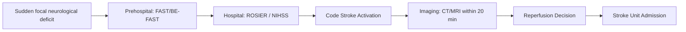
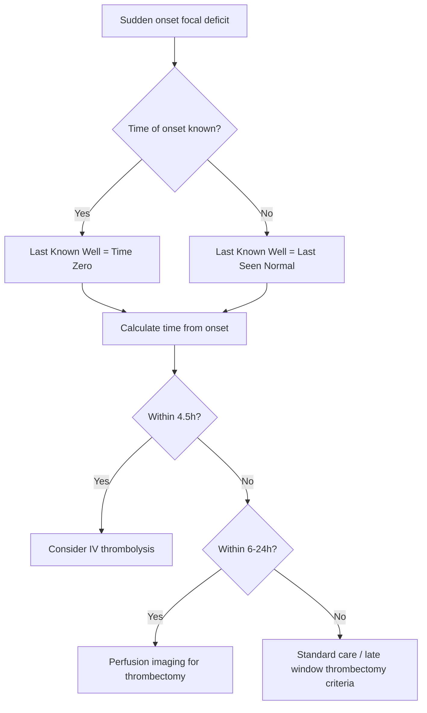
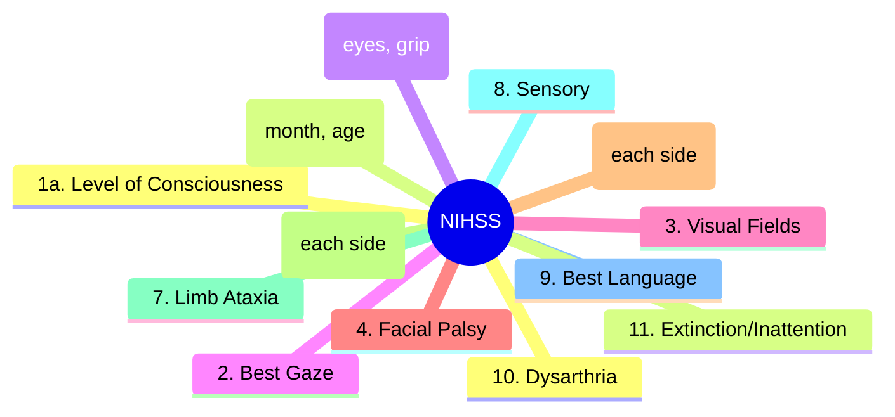
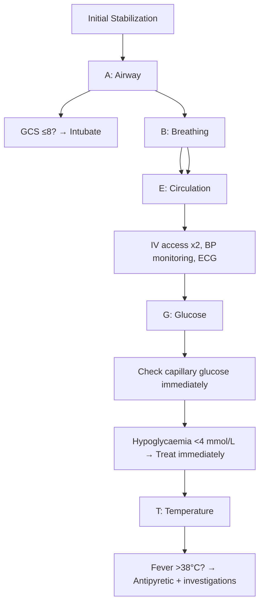
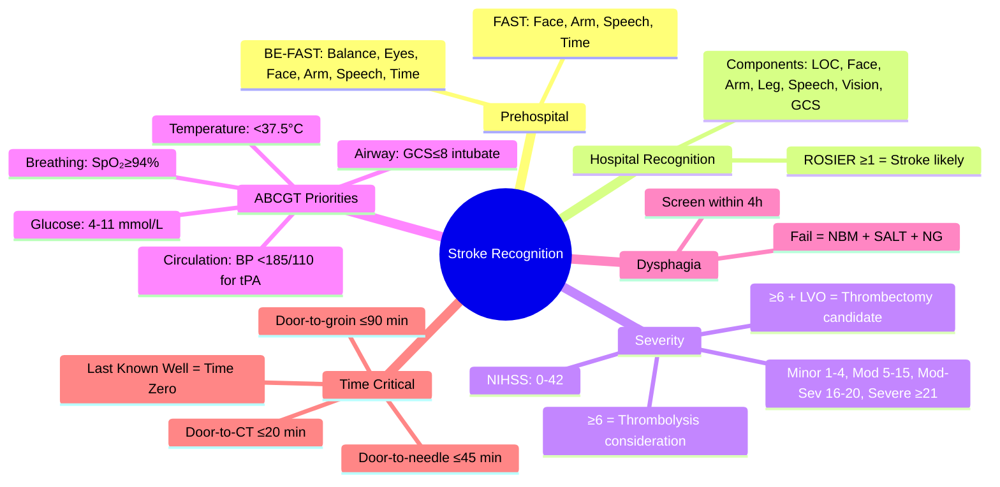

## Definition

**Stroke recognition and first approach** is the rapid clinical identification of stroke using tools (FAST, BE-FAST, ROSIER, NIHSS) and the immediate ABCGT priorities (Airway, Breathing, Circulation, Glucose, Temperature) plus imaging. Time is brain — every minute of large-vessel occlusion loses ~1.9 million neurons.

# Stroke Recognition and Clinical Assessment

## Learning Objectives
- [ ] Recognize sudden focal neurological deficits as potential stroke
- [ ] Apply FAST/BE-FAST and ROSIER scales for prehospital/hospital screening
- [ ] Perform rapid bedside neurological assessment using NIHSS
- [ ] Differentiate stroke from common mimics
- [ ] Prioritize ABC + glucose + temperature stabilization
- [ ] Identify FCPS/MRCP high-yield recognition patterns

---

## Core Concept: Time is Brain

> **FCPS/MRCP**: **"Time is Brain"** — Every minute of delay = 1.9 million neurons lost. Target: Door-to-CT ≤20 min, Door-to-needle ≤45 min, Door-to-groin puncture ≤90 min.

---

## Prehospital Recognition: FAST & BE-FAST

| Scale | Components | Sensitivity | Specificity |
|-------|------------|-------------|-------------|
| **FAST** | Face droop, Arm weakness, Speech disturbance, Time | 88% | 66% |
| **BE-FAST** | Balance, Eyes, Face, Arm, Speech, Time | 95% | 45% |

> **FCPS/MRCP**: **BE-FAST adds Balance & Eyes** — captures posterior circulation strokes missed by FAST.

### BE-FAST Components
| Letter | Assessment | Positive Finding |
|--------|------------|------------------|
| **B** | Balance | Sudden loss of balance/coordination |
| **E** | Eyes | Sudden vision loss/diplopia/field cut |
| **F** | Face | Asymmetric smile/facial droop |
| **A** | Arm | Unilateral weakness/drift |
| **S** | Speech | Dysarthria/aphasia |
| **T** | Time | **Last known well** — critical for reperfusion windows |

---

## Hospital Recognition: ROSIER Scale

> **Use in ED for all suspected stroke** — validated for stroke vs mimic differentiation.

| ROIER Item | Points |
|------------|--------|
| Loss of consciousness / syncope | -1 |
| Seizure activity | -1 |
| **New asymmetric facial weakness** | **+1** |
| **New asymmetric arm weakness** | **+1** |
| **New asymmetric leg weakness** | **+1** |
| **Speech disturbance** | **+1** |
| **Visual field defect** | **+1** |
| **GCS <15** | **+1** |

| Score | Interpretation |
|-------|----------------|
| **≥1** | **Stroke likely** → Code Stroke activation |
| **≤0** | Stroke unlikely → consider mimics |

> **ROSIER ≥1 = Stroke until proven otherwise** — sensitivity 93%, specificity 83% for stroke vs mimic.

---

## Sudden Focal Neurological Deficit Recognition

---

## Stroke Severity Assessment: NIHSS

### NIHSS Severity Categories
| Score | Severity | Clinical Implication |
|-------|----------|---------------------|
| **0** | No stroke | — |
| **1-4** | Minor | Excellent prognosis |
| **5-15** | Moderate | Thrombolysis benefit clear |
| **16-20** | Moderate-severe | High disability risk |
| **≥21** | Severe | High mortality, consider thrombectomy if LVO |

> **FCPS/MRCP**: **NIHSS ≥6 = consider thrombolysis**; **NIHSS ≥6 + LVO = thrombectomy candidate**.

### NIHSS Practical Tips
- **Administer in <10 minutes** — do not delay imaging
- **Score each item sequentially** — do not skip
- **Use standard stimuli** — "close eyes", "open eyes", "grip my hand"
- **Document clearly** — each item scored 0-4 (or 0-2, 0-3)

---

## Airway, Breathing, Circulation, Glucose, Temperature (ABCGT)

### ABCGT Targets
| Parameter | Target | Action if Abnormal |
|-----------|--------|-------------------|
| **Airway** | Patent / GCS >8 | Intubate if GCS ≤8 or airway compromise |
| **Breathing** | SpO₂ ≥94% | O₂ supplementation; intubate if failing |
| **Circulation** | SBP <185 mmHg (if thrombolysis candidate) | Labetalol/Nicardipine if BP too high; fluids if hypotensive |
| **Glucose** | **4-11 mmol/L** (72-200 mg/dL) | Treat hypo/hyperglycemia immediately |
| **Temperature** | **<37.5°C** | Paracetamol + cooling if >37.5°C |

> **FCPS/MRCP**: **Glucose <4 mmol/L = exclusion for thrombolysis until corrected**; **BP >185/110 = exclusion for thrombolysis unless lowered**.

---

## Airway, Breathing, Circulation, Glucose, Temperature Priorities

> **Priority order in hyperacute stroke**: **ABCGT** — each step must be addressed before moving to next.

| Priority | Action | Rationale |
|----------|--------|-----------|
| **A** | **Airway** — GCS ≤8 → intubate | Aspiration risk, protect airway |
| **B** | **Breathing** — SpO₂ ≥94% | Hypoxia worsens ischaemic penumbra |
| **C** | **Circulation** — BP management | Permissive hypertension (SBP ≤185 for thrombolysis); fluids if hypotensive |
| **G** | **Glucose** — 4-11 mmol/L | Hypoglycaemia mimics stroke; hyperglycaemia worsens outcome |
| **T** | **Temperature** — normothermia (36.5-37.5°C) | Fever ↑ infarct size, mortality |

> **FCPS/MRCP**: **"Glucose and Temperature are part of ABC"** — often forgotten in exam questions.

---

## Dysphagia Screening

> **All stroke patients: nil by mouth until dysphagia screening passed** (within 4 hours of admission).

| Screen | Method | Fail → Action |
|--------|--------|---------------|
| **Water Swallow Test** | 3 × 50ml water; cough/choke/voice change = fail | NBM, refer SALT, consider NG tube |
| **GUSS (Gugging Swallowing Screen)** | More detailed; scores 0-20; **<15 = fail** | NBM, SALT referral, consider NG/PEG |

> **FCPS/MRCP**: **Dysphagia screen within 4 hours of admission** — failure = nil by mouth, SALT referral, consider NG tube for hydration/meds.

---

---

## Clinical Features of Stroke (for Recognition)

The detailed clinical features by territory and severity are in the sub-files. This wrapper summarises the key recognition features:

- **Sudden onset** focal neurological deficit (the cardinal feature)
- **Anterior circulation**: face/arm weakness, aphasia (dominant), neglect (non-dominant), gaze deviation
- **Posterior circulation**: vertigo, ataxia, diplopia, visual field defect, crossed signs, decreased consciousness
- **Lacunar**: pure motor, pure sensory, sensorimotor, ataxic hemiparesis, dysarthria-clumsy hand
- **FAST / BE-FAST positive** triggers emergency pathway
- **NIHSS ≥ 6** suggests moderate-severe stroke; consider MT

See sub-files: [[Sudden focal neurological deficit recognition]], [[Anterior vs posterior circulation stroke clues]], [[Cortical vs subcortical stroke patterns]], [[Lacunar syndromes]].

## Clinical Investigation and Management Pathway

The acute pathway is: recognition → emergency call → ABCDE → non-contrast CT within 20 min → tPA within 4.5 h (if eligible) → MT within 6-24 h (if LVO). See: [[Hyperacute Stroke Pathway]], [[NIHSS overview and practical use]], [[Prehospital stroke pathway and FAST/BE-FAST use]].

## FCPS/MRCP High-Yield Summary

| Concept | Key Points |
|---------|------------|
| **Time is Brain** | 1.9M neurons/min lost; Door-to-CT ≤20 min, Door-to-needle ≤45 min |
| **BE-FAST** | **B**alance, **E**yes, **F**ace, **A**rm, **S**peech, **T**ime |
| **ROSIER ≥1** | Stroke likely — activate Code Stroke |
| **NIHSS** | ≥6 = thrombolysis consideration; ≥6 + LVO = thrombectomy |
| **ABCGT** | **Glucose 4-11**, **Temp <37.5°C**, BP <185/110 for thrombolysis |
| **Last Known Well** | Critical for reperfusion windows |
| **Dysphagia Screen** | Within 4h; fail = NBM, SALT referral, NG tube if prolonged |

---

## Viva Questions

1. **What are the components of BE-FAST? Which two does it add to FAST?**
2. **What is the ROSIER score? What score indicates stroke?**
3. **What is the door-to-needle target for IV thrombolysis?**
4. **What NIHSS score threshold indicates thrombolysis consideration?**
5. **What are the ABCGT targets in acute stroke?**
5. **What blood glucose excludes thrombolysis?**
6. **What BP threshold excludes thrombolysis?**
6. **When should dysphagia screening be performed?**
7. **What is the difference between FAST and BE-FAST?**
8. **What is the "Last Known Well" and why is it critical?**
9. **What is the NIHSS score range for minor vs severe stroke?**
10. **What are the ROSIER criteria for seizure activity?**

---

## Confusions & Mnemonics

| Confusion | Clarification |
|-----------|---------------|
| FAST vs BE-FAST | **BE-FAST adds Balance & Eyes** — captures posterior circulation strokes |
| ROSIER vs FAST | **ROSIER is hospital-based**; FAST/BE-FAST are prehospital |
| NIHSS scoring | **Score each item** — don't skip; 1a, 1b, 1c are separate items |
| "Last Seen Normal" vs "Last Known Well" | **Last Known Well** = last time patient was at baseline; if unknown → Last Seen Normal |
| BP target for thrombolysis | **<185/110** — treat with labetalol/nicardipine if above |
| Glucose exclusion | **<4 mmol/L (72 mg/dL)** — correct before thrombolysis |
| GCS ≤8 | **Intubate** — airway protection |
| BE-FAST sensitivity | **95%** (vs 88% for FAST) — captures posterior strokes |

---

## Mind Map

---

## One-Page Revision Card

| **Scale** | **Components** | **Cut-off** |
|-----------|----------------|-------------|
| **FAST** | Face, Arm, Speech, Time | Any +ve |
| **BE-FAST** | Balance, Eyes, Face, Arm, Speech, Time | Any +ve |
| **ROSIER** | LOC, Face, Arm, Leg, Speech, Vision, GCS | **≥1 = Stroke** |

| **NIHSS** | **Severity** | **Action** |
|-----------|--------------|------------|
| 0 | No stroke | — |
| 1-4 | Minor | Observe |
| 5-15 | Moderate | Thrombolysis if ≤4.5h |
| 16-20 | Mod-Severe | Thrombectomy if LVO |
| ≥21 | Severe | Consider thrombectomy if LVO |

| **ABCGT Targets** | **Target** |
|-------------------|------------|
| **Glucose** | **4-11 mmol/L** |
| **Temperature** | **<37.5°C** |
| **BP (if tPA)** | **<185/110 mmHg** |
| **SpO₂** | **≥94%** |
| **GCS** | **>8** (else intubate) |

| **Key Times** | **Target** |
|---------------|------------|
| Door-to-CT | ≤20 min |
| Door-to-needle | ≤45 min |
| Door-to-groin (Thrombectomy) | ≤90 min |
| Dysphagia Screen | ≤4 hours |

---

## Spaced Repetition Tracker

| Day | 1 | 3 | 7 | 15 | 30 |
|-----|---|---|---|----|----|
| BE-FAST components | ☐ | ☐ | ☐ | ☐ | ☐ |
| ROSIER criteria | ☐ | ☐ | ☐ | ☐ | ☐ |
| NIHSS severity thresholds | ☐ | ☐ | ☐ | ☐ | ☐ |
| ABCGT targets | ☐ | ☐ | ☐ | ☐ | ☐ |
| ABCGT priority order | ☐ | ☐ | ☐ | ☐ | ☐ |

---

## Self-Test Scorecard

| Question | My Answer | Correct? |
|----------|-----------|----------|
| BE-FAST components |  |  |
| ROSIER ≥1 interpretation |  |  |
| NIHSS ≥6 significance |  |  |
| ABCGT targets |  |  |
| Dysphagia screen timing |  |  |

---

## Local Navigation

- [[Stroke Recognition and Clinical Assessment/Sudden focal neurological deficit recognition|Sudden focal deficit recognition]]
- [[Stroke Recognition and Clinical Assessment/Stroke mimics and common pitfalls|Stroke mimics]]
- [[Stroke Recognition and Clinical Assessment/Prehospital stroke pathway and FAST/BE-FAST use|Prehospital pathway]]
- [[Stroke Recognition and Clinical Assessment/Stroke severity and bedside assessment|NIHSS]]
- [[Stroke Recognition and Clinical Assessment/Airway, breathing, circulation, glucose, and temperature priorities|ABCGT priorities]]
- [[Stroke Recognition and Clinical Assessment/Dysphagia screening and aspiration risk|Dysphagia screening]]
---

## MCQs (10)
1. Time is brain — neuron loss per minute?
   A) ~1.9 million
   B) **A**
   C) 
   D) 
   **Answer: A**

2. FAST acronym?
   A) Face, Arm, Speech, Time
   B) **B**
   C) 
   D) 
   **Answer: A**

3. BE-FAST adds?
   A) Balance, Eyes
   B) **C**
   C) 
   D) 
   **Answer: A**

4. ROSIER scale — purpose?
   A) Stroke vs mimic in ED
   B) **D**
   C) 
   D) 
   **Answer: A**

5. NIHSS range?
   A) 0-42
   B) **A**
   C) 
   D) 
   **Answer: A**

6. Door-to-CT target?
   A) ≤ 20 min
   B) **B**
   C) 
   D) 
   **Answer: A**

7. Door-to-needle target?
   A) ≤ 45 min
   B) **C**
   C) 
   D) 
   **Answer: A**

8. Door-to-groin target?
   A) ≤ 90 min
   B) **D**
   C) 
   D) 
   **Answer: A**

9. Dysphagia screen timing?
   A) < 4 h from admission
   B) **A**
   C) 
   D) 
   **Answer: A**

10. Glucose target in acute stroke?
   A) 4-11 mmol/L
   B) **B**
   C) 
   D) 
   **Answer: A**

## SBA Questions (10)
1. Sudden right arm weakness + aphasia + right facial droop — FAST positive? | Yes (Face + Arm + Speech)

2. Sudden vertigo + visual field defect — BE-FAST positive? | Yes (Balance + Eyes)

3. Patient with sudden focal deficit. First action? | ABCDE, then non-contrast CT within 20 min

4. NIHSS 22 in 65-year-old with LVO — eligible for? | IV tPA + mechanical thrombectomy

5. Door-to-needle time target? | ≤ 45 min

6. Door-to-groin time target? | ≤ 90 min

7. Why dysphagia screen before oral intake? | Aspiration risk (silent aspiration common)

8. Dysphagia screen timing? | < 4 h from admission

9. Glucose target in acute stroke? | 4-11 mmol/L

10. Oxygen target in acute stroke? | SpO2 ≥ 94%

## Flashcards
**Q: Time is brain?**
A: 1.9 M neurons/min

**Q: FAST?**
A: Face, Arm, Speech, Time

**Q: BE-FAST adds?**
A: Balance, Eyes

**Q: ROSIER?**
A: Stroke vs mimic in ED

**Q: NIHSS?**
A: 0-42 scale

**Q: Door-to-CT?**
A: ≤ 20 min

**Q: Door-to-needle?**
A: ≤ 45 min

**Q: Door-to-groin?**
A: ≤ 90 min

**Q: Dysphagia screen?**
A: < 4 h

**Q: Glucose target?**
A: 4-11 mmol/L

## Answer Key with Explanations
### MCQs
1. **A** — Time is brain — neuron loss per minute?
2. **A** — FAST acronym?
3. **A** — BE-FAST adds?
4. **A** — ROSIER scale — purpose?
5. **A** — NIHSS range?
6. **A** — Door-to-CT target?
7. **A** — Door-to-needle target?
8. **A** — Door-to-groin target?
9. **A** — Dysphagia screen timing?
10. **A** — Glucose target in acute stroke?

### SBAs
1. **Yes (Face + Arm + Speech)**
2. **Yes (Balance + Eyes)**
3. **ABCDE, then non-contrast CT within 20 min**
4. **IV tPA + mechanical thrombectomy**
5. **≤ 45 min**
6. **≤ 90 min**
7. **Aspiration risk (silent aspiration common)**
8. **< 4 h from admission**
9. **4-11 mmol/L**
10. **SpO2 ≥ 94%**

## Local Navigation

- [[../Stroke Medicine MOC|Stroke Medicine MOC]]
- [[../Davidson Chapter 29 - Stroke Medicine Hierarchy|Davidson Chapter 29 - Stroke Medicine Hierarchy]]
