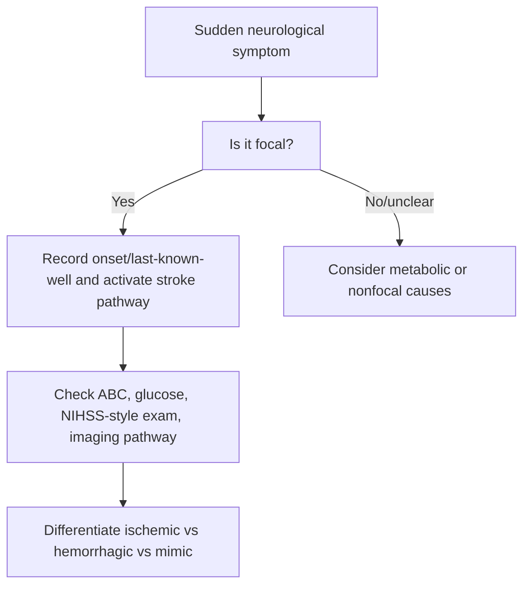
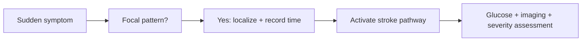

# Sudden focal neurological deficit recognition

Related: [[../Stroke Medicine MOC|Stroke Medicine MOC]] · [[../Stroke Recognition and Clinical Assessment|Stroke Recognition and Clinical Assessment]] · [[Stroke recognition and first approach|Stroke recognition and first approach]] · [[Stroke mimics and common pitfalls]] · [[Anterior vs posterior circulation stroke clues]]

> [!important]
> **Sudden focal neurological deficit is stroke until proved otherwise.** The exam pearl is that the combination of **sudden onset + focal pattern + vascular territory logic** should trigger an emergency stroke pathway immediately.

## Learning Objectives
- Define sudden focal neurological deficit in stroke practice.
- Recognize common focal patterns suggesting acute stroke.
- Localize deficits broadly to cortical, subcortical, brainstem, or cerebellar systems.
- Identify red flags requiring immediate hyperacute stroke action.
- Distinguish focal neurological syndrome from generalized/metabolic states.

## Definition
A **sudden focal neurological deficit** is an abrupt loss or distortion of a specific neurological function attributable to dysfunction of a localized part of the brain, retina, or brainstem, commonly due to acute ischemia or hemorrhage.

Examples include sudden:
- unilateral weakness
- hemisensory loss
- aphasia
- facial asymmetry
- visual field loss
- ataxia
- diplopia with focal signs

## Core Anatomy
Focal deficits arise when vascular injury affects specific neuroanatomical systems:
- **motor cortex/internal capsule/corticospinal tract** → contralateral weakness
- **sensory cortex/thalamic pathways** → hemisensory loss
- **dominant hemisphere language network** → aphasia
- **non-dominant parietal areas** → neglect
- **occipital cortex/optic radiations** → homonymous field defects
- **brainstem/cerebellum** → cranial nerve findings, ataxia, vertigo, crossed signs

## Core Physiology
Normal focal neurological function depends on uninterrupted blood flow to highly specialized neural networks. Acute arterial occlusion or hemorrhage abruptly disrupts signal transmission, causing symptoms that usually conform to a vascular territory or tract pattern. The faster the deficit is recognized, the greater the chance of time-critical therapy.

## Normal Values / Important Cut-offs
- **Sudden onset** strongly supports vascular pathology.
- Focal deficit with time of onset or last-known-well should trigger immediate stroke triage.
- Even transient focal symptoms may represent **TIA** and need urgent evaluation.
- Deficits suggesting large-vessel occlusion or brainstem disease are high-stakes emergencies.

## Classification
### By major symptom domain
- motor focal deficit
- sensory focal deficit
- language deficit
- visual deficit
- coordination/brainstem deficit

### By vascular syndrome pattern
- anterior circulation pattern
- posterior circulation pattern
- lacunar/subcortical pattern
- cortical pattern

## Etiology / Causes
### Stroke-related causes
- acute ischemic stroke
- intracerebral hemorrhage
- TIA

### Important alternative causes
- seizure/postictal state
- hypoglycemia
- migraine aura/hemiplegic migraine
- functional neurological disorder
- brain tumor or subdural process in some cases

## Risk Factors
| Risk factor | Why it matters |
|---|---|
| Hypertension | Ischemic and hemorrhagic stroke risk |
| Atrial fibrillation | Cardioembolic stroke |
| Diabetes | Accelerates vascular disease |
| Smoking | Major modifiable vascular risk |
| Prior TIA/stroke | High recurrence risk |
| Carotid disease | Anterior circulation ischemia |

## Pathophysiology
Focal neurological deficit results from rapid failure of a localized brain network. Ischemia leads to energy failure, ionic disruption, loss of synaptic signaling, and neuronal dysfunction. Hemorrhage causes tissue destruction, mass effect, and local toxicity. Because function is region-specific, symptoms are anatomically patterned rather than generalized.

## Clinical Features
### High-yield focal presentations
- unilateral face-arm-leg weakness
- isolated arm/face weakness
- aphasia or dysphasia
- hemisensory loss
- sudden monocular or binocular visual deficit
- ataxia with brainstem signs
- neglect/inattention
- gaze deviation

### Pattern clues
- **cortical stroke**: aphasia, neglect, field cut, gaze preference
- **lacunar syndrome**: pure motor, pure sensory, sensorimotor patterns
- **posterior circulation**: diplopia, dysarthria, dysphagia, ataxia, crossed signs

## Approach / Algorithm

## Investigations
### Immediate priorities
- time of onset/last-known-well
- focused neurological exam
- capillary glucose
- urgent brain imaging
- BP, oxygenation, ECG, key labs

### Helpful clinical characterization
- level of consciousness
- cranial nerves
- power distribution
- sensory deficit pattern
- visual fields/gaze
- language and neglect assessment

## Interpretation Frameworks
### Focal vs nonfocal frame
| Feature | Focal deficit | Nonfocal state |
|---|---|---|
| Pattern | localizable | generalized/vague |
| Onset | often abrupt | variable |
| Examples | hemiparesis, aphasia | confusion, syncope, global weakness |
| Stroke probability | higher | lower unless combined with focality |

### Localization frame
1. Is there weakness? Which side?
2. Is language affected?
3. Are visual fields or gaze involved?
4. Are there brainstem signs?
5. Does the syndrome look cortical, subcortical, or posterior circulation?

## Diagnosis
Diagnosis is syndromic at first: an acute focal neurological syndrome highly suspicious for stroke/TIA until imaging clarifies the underlying pathology.

## Differential Diagnosis
- hypoglycemia
- seizure with Todd’s paresis
- migraine aura
- functional neurological disorder
- delirium without focality
- peripheral vestibular disorder if isolated dizziness without focal signs

## Tables / Comparison Charts
### Focal clues strongly favoring stroke
| Clue | Why important |
|---|---|
| Sudden hemiparesis | classic vascular syndrome |
| Aphasia | dominant hemisphere cortical involvement |
| Neglect | non-dominant cortical involvement |
| Homonymous hemianopia | retrochiasmal lesion |
| Crossed brainstem signs | posterior circulation localization |

## Management
### Immediate principles
- activate stroke pathway
- document onset or last-known-well
- do not delay imaging for prolonged history-taking
- check glucose early
- keep broad differential but treat stroke as default emergency

### Early bedside priorities
- airway, breathing, circulation
- glucose
- temperature
- oxygen only when indicated
- swallowing safety precautions

## Drug Interactions / Contraindications / Comorbidity Cautions
- Sedatives may obscure examination.
- Hypoglycemia from diabetes therapy can mimic stroke.
- Anticoagulant history is crucial because it changes hemorrhage/reperfusion decisions.
- Seizure history can confuse the picture but must not delay stroke assessment.

## Procedures / Indications / Contraindications
- **Urgent neuroimaging**
  - indication: all suspected acute focal stroke syndromes
- **NIHSS-style assessment**
  - indication: quantify severity and support reperfusion decisions
- **Swallow screen**
  - indication: before oral intake if stroke confirmed/suspected and patient stable enough

## Procedure Mini-Sections
### Last-known-well documentation
- **Indication:** every suspected acute stroke.
- **Purpose:** defines reperfusion eligibility.
- **Pearl:** do not substitute discovery time for last-known-well if the patient was found later.

### Focused localization exam
- **Indication:** any sudden focal deficit.
- **Purpose:** characterize severity and vascular territory.
- **Pearl:** a 1-minute good focal exam can change the whole pathway.

## Complications
- delayed reperfusion because stroke was not recognized
- aspiration if deficit/severity missed
- disability from missed posterior circulation stroke
- inappropriate discharge if transient deficit ignored

## Red Flags / Emergencies
- sudden hemiplegia
- new aphasia
- gaze deviation with reduced awareness
- posterior circulation signs with ataxia/dysphagia/diplopia
- fluctuating focal signs suggesting unstable perfusion

## Prognosis
- Recognition speed is a major determinant of outcome.
- Severe focal syndromes may still improve substantially if identified early and treated rapidly.
- Transient symptoms do not imply benign disease; recurrence risk may be high.

## Topic Correlation
- [[Stroke mimics and common pitfalls]] helps avoid false assumptions.
- [[NIHSS overview and practical use]] quantifies severity.
- [[Anterior vs posterior circulation stroke clues]] supports localization.
- [[Non-contrast CT in hyperacute stroke]] is central once recognition occurs.

## Special Situations
### Wake-up stroke
- symptoms may be focal but exact onset uncertain
- still requires urgent pathway activation

### Aphasic or confused patient
- collateral history is crucial to establish sudden onset and baseline

### Posterior circulation stroke
- may be underrecognized because deficits can be less obviously “FAST-positive”

## FCPS/MRCP High-Yield Points
- Sudden focal deficit = stroke until proved otherwise.
- Stroke is more likely when symptoms are abrupt and localizable.
- Differentiate focal syndromes from generalized confusion/syncope.
- Always record last-known-well.
- Posterior circulation stroke may present with dangerous but less obvious focal signs.

## Common Viva Questions
- What is meant by a focal neurological deficit?
- Which deficits strongly suggest cortical stroke?
- How do you distinguish focal deficit from metabolic encephalopathy?
- Why is last-known-well important?
- Which posterior circulation features are easily missed?

## Common Confusions / Exam Traps
- Mistaking generalized weakness for focal hemiparesis.
- Missing aphasia as a focal deficit.
- Ignoring transient focal symptoms.
- Failing to think posterior circulation when FAST is negative.
- Delaying imaging while overworking the mimic differential.

## Mnemonics
**FOCAL**
- **F**ace/field/language change
- **O**nset sudden
- **C**ontralateral pattern/localizable
- **A**ctivate stroke pathway
- **L**ast-known-well document

## Mind Map
- Sudden focal neurological deficit
  - motor
  - sensory
  - language
  - vision
  - brainstem/cerebellar
  - onset time
  - imaging pathway

## Flowchart

## Suggested Visuals / Image Notes
- Simple cortical vs lacunar vs posterior circulation comparison chart
- Stroke recognition bedside checklist
- Diagram linking common focal deficits to lesion sites

## Suggested Video References
- Hyperacute stroke recognition teaching clips
- NIHSS/localization bedside demonstrations
- Posterior circulation stroke red flag review

## One-Page Revision Summary
- Sudden focal deficit is a localized neurological syndrome of abrupt onset.
- Typical stroke deficits: hemiparesis, aphasia, hemisensory loss, field cut, neglect, ataxia with brainstem signs.
- Stroke is more likely when symptoms are sudden, focal, and localizable.
- Check glucose, document last-known-well, activate stroke pathway, image urgently.
- Posterior circulation stroke is easily missed.

## 24-Hour Recall Prompts
- Define focal neurological deficit.
- Name 5 sudden focal deficits suggestive of stroke.
- Which findings suggest cortical involvement?
- How does a focal syndrome differ from delirium?
- Why must you record last-known-well?

## 7-Day / 15-Day / 30-Day Revision Tracker
- **7 days:** list focal stroke clues from memory.
- **15 days:** compare cortical, lacunar, and posterior circulation patterns.
- **30 days:** give a viva answer on acute stroke recognition.

## Must Know / Should Know / Nice to Know
### Must Know
- sudden focal deficit = stroke emergency
- localizable pattern matters
- record onset/last-known-well
- check glucose early

### Should Know
- cortical vs subcortical vs posterior clues
- transient deficits can be TIA
- mimic differential

### Nice to Know
- advanced lesion-network nuance
- complex wake-up stroke imaging selection

## My Weak Points
- Do I miss aphasia or neglect as focal signs?
- Do I think posterior circulation early enough?
- Do I document last-known-well immediately?

## Self-Test Scorecard
- Recognition of focal signs /10
- Localization logic /10
- Hyperacute pathway recall /10
- Mimic differentiation /10
- Viva confidence /10

## Exam Answer Modes
### Short note angle
Define sudden focal neurological deficit, list common examples, explain localization clues, and outline urgent stroke-pathway action.

### Viva angle
“Sudden focal neurological deficit means abrupt loss of a localizable neurological function such as hemiparesis, aphasia, hemisensory loss, or visual field defect. I would assume stroke, record last-known-well, check glucose, perform focused examination, and arrange urgent imaging.”

## Summary
Sudden focal neurological deficit recognition is the gateway to hyperacute stroke care. The key clinical skill is identifying a localizable, abrupt neurological syndrome and treating it as a stroke emergency while rapidly excluding major mimics.

## MCQs (10)
1. Which feature most strongly favors stroke?
   - A. Gradual diffuse tiredness
   - B. Sudden hemiparesis
   - C. Chronic back pain
   - D. Longstanding tremor
   - E. Isolated insomnia
2. Aphasia suggests dysfunction of:
   - A. Dominant hemisphere language network
   - B. Peripheral nerve only
   - C. Kidney
   - D. Thyroid
   - E. Muscle endplate
3. A key first bedside exclusion in suspected stroke is:
   - A. Hypoglycemia
   - B. Hyperuricemia
   - C. Vitamin D deficiency
   - D. Otitis externa
   - E. Cataract only
4. Which presentation is most focal?
   - A. Global sleepiness only
   - B. Sudden unilateral arm and face weakness
   - C. Chronic fatigue
   - D. Generalized body ache
   - E. Isolated fever
5. Last-known-well matters because it:
   - A. predicts cholesterol
   - B. defines time-critical treatment eligibility
   - C. replaces imaging
   - D. proves hemorrhage
   - E. rules out mimics entirely
6. Which finding suggests cortical stroke?
   - A. Aphasia
   - B. Isolated hypoglycemia
   - C. Diffuse myalgia
   - D. Peripheral edema
   - E. Pruritus
7. Which stroke pattern may be underrecognized by simple FAST-only thinking?
   - A. Posterior circulation stroke
   - B. Old stable neuropathy
   - C. Osteoarthritis
   - D. GERD
   - E. Psoriasis
8. A transient focal deficit may represent:
   - A. Benign sleepiness only
   - B. TIA
   - C. Kidney stone
   - D. Chronic anxiety only
   - E. Asthma
9. Which is a classic focal visual deficit from stroke?
   - A. Homonymous field loss
   - B. Cataract only
   - C. Dry eye
   - D. Presbyopia
   - E. Conjunctivitis
10. Best immediate principle?
   - A. Delay imaging until full history complete
   - B. Treat sudden focal deficit as stroke until proved otherwise
   - C. Reassure and discharge first
   - D. Ignore transient symptoms
   - E. Give oral intake immediately

## SBA Questions (10)
1. A 67-year-old man suddenly develops right arm and face weakness with slurred speech 40 minutes ago. Best first interpretation?
   - A. Chronic neuropathy
   - B. Acute focal neurological syndrome suspicious for stroke
   - C. Stable fatigue syndrome
   - D. Depression only
   - E. Peripheral vertigo
2. A patient is found with new aphasia but no witnessed onset. Best time point to document?
   - A. Time of hospital arrival only
   - B. Last-known-well
   - C. Time CT is done
   - D. Time family becomes worried
   - E. Time weakness improves
3. A diabetic patient presents with sudden unilateral weakness. Which immediate test must not be forgotten?
   - A. Blood glucose
   - B. Uric acid
   - C. ESR only
   - D. Stool occult blood
   - E. Skin biopsy
4. Which finding should make you think posterior circulation stroke?
   - A. Diplopia with ataxia and dysarthria
   - B. Isolated chronic knee pain
   - C. Gradual weight gain
   - D. Chronic tinnitus only
   - E. Constipation only
5. Which syndrome is most likely cortical?
   - A. Aphasia with gaze preference
   - B. Isolated generalized weakness
   - C. Chronic sleep deprivation
   - D. Hypothyroidism
   - E. Fibromyalgia
6. Why must transient focal symptoms be taken seriously?
   - A. They are never vascular
   - B. They may be TIA with high early recurrence risk
   - C. They always mean migraine
   - D. They do not need evaluation
   - E. They exclude stroke
7. A patient has confusion without focal signs or abrupt localizable deficit. Which principle is best?
   - A. Stroke still impossible
   - B. Purely generalized symptoms require a broader nonfocal differential
   - C. Ignore glucose
   - D. Do not examine cranial nerves
   - E. Discharge immediately
8. Which action best follows recognition of sudden focal deficit?
   - A. Delay all action until family arrives
   - B. Activate stroke pathway and urgent imaging
   - C. Start oral feeding
   - D. Send home with vitamins
   - E. Only prescribe analgesics
9. Which deficit is especially easy to miss but highly localizing?
   - A. Neglect
   - B. Chronic cough
   - C. Pruritus
   - D. Weight gain
   - E. Back stiffness
10. Best summary?
   - A. Sudden focal deficits are usually non-urgent
   - B. Sudden focal localizable symptoms should trigger stroke-first thinking
   - C. Only hemorrhage causes focal symptoms
   - D. Imaging is optional
   - E. Generalized weakness always equals stroke

## Flashcards
- Q: What is the core definition of a focal neurological deficit?
  A: Abrupt loss of a localizable neurological function.
- Q: Name three classic focal stroke symptoms.
  A: Hemiparesis, aphasia, visual field loss.
- Q: What bedside test must be checked early in suspected stroke?
  A: Blood glucose.
- Q: Why is last-known-well important?
  A: It defines time-sensitive treatment eligibility.
- Q: Which pattern suggests cortical stroke?
  A: Aphasia, neglect, or gaze deviation.
- Q: Which circulation is often underrecognized?
  A: Posterior circulation.
- Q: Can transient focal symptoms still be dangerous?
  A: Yes, they may be TIA.
- Q: What should sudden focal deficit trigger?
  A: Stroke pathway activation.
- Q: Give one posterior circulation red flag.
  A: Diplopia with ataxia.
- Q: Focal vs nonfocal: which is more likely vascular stroke?
  A: Focal localizable pattern.

## Answer Key with Explanations
### MCQs
1. **B** — Sudden hemiparesis is classic for stroke.
2. **A** — Aphasia localizes to dominant language cortex/network.
3. **A** — Hypoglycemia is a key mimic.
4. **B** — Sudden unilateral weakness is focal.
5. **B** — Time window decisions depend on last-known-well.
6. **A** — Aphasia strongly suggests cortical involvement.
7. **A** — Posterior circulation stroke may be missed by FAST-only thinking.
8. **B** — Transient focal symptoms may be TIA.
9. **A** — Homonymous field loss is a classic stroke visual deficit.
10. **B** — Stroke-first emergency thinking is the correct approach.

### SBAs
1. **B** — This is an acute focal syndrome suspicious for stroke.
2. **B** — Last-known-well is the key time anchor.
3. **A** — Glucose must be checked immediately.
4. **A** — Diplopia + ataxia + dysarthria suggests posterior circulation stroke.
5. **A** — Aphasia with gaze preference is a cortical syndrome.
6. **B** — TIA can carry high early recurrence risk.
7. **B** — Nonfocal symptoms broaden the differential.
8. **B** — Urgent pathway activation and imaging are indicated.
9. **A** — Neglect is focal, important, and sometimes overlooked.
10. **B** — Sudden focal localizable symptoms demand stroke-first reasoning.
