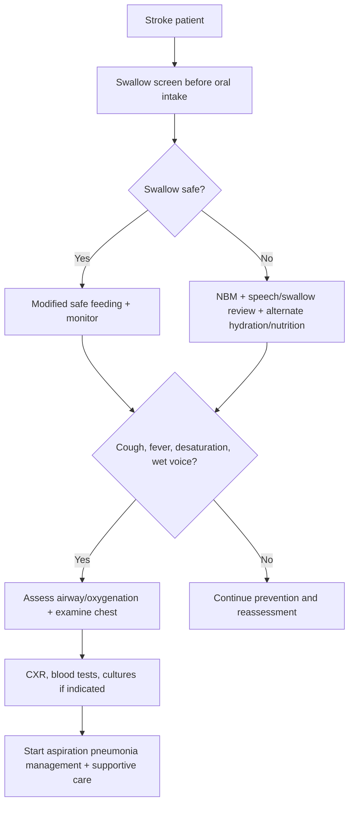
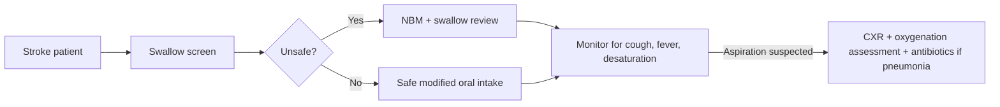

# Aspiration pneumonia after stroke

Related: [[../Stroke Medicine MOC|Stroke Medicine MOC]] · [[../Stroke Unit Care and Complications|Stroke Unit Care and Complications]] · [[Common early complications|Common early complications]] · [[../Stroke Recognition and Clinical Assessment/Dysphagia screening and aspiration risk|Dysphagia screening and aspiration risk]] · [[Glucose, oxygen, and temperature control in stroke]] · [[../Recovery, Rehabilitation, and Prognosis/Persistent dysphagia and nutrition planning|Persistent dysphagia and nutrition planning]]

> [!important]
> **Aspiration pneumonia** is one of the commonest preventable causes of post-stroke deterioration. The high-yield principle is simple: **screen swallowing early, keep unsafe patients nil by mouth, recognize aspiration quickly, and treat respiratory compromise promptly.**

## Learning Objectives
- Explain why stroke patients aspirate and why this worsens outcome.
- Recognize risk factors, early clinical clues, and differential diagnoses.
- Outline prevention, diagnosis, and management.
- Link dysphagia assessment to pneumonia prevention and nutrition planning.

## Definition
**Aspiration pneumonia after stroke** is lower respiratory infection caused by inhalation of oropharyngeal or gastric contents in a patient whose swallowing, consciousness, cough, or airway protection has been impaired by stroke.

## Core Anatomy
- Brain regions involved in swallowing include cortical and brainstem networks coordinating oral, pharyngeal, and laryngeal phases.
- Cranial nerve dysfunction, reduced pharyngeal sensation, and poor glottic closure predispose to aspiration.
- Stroke may also impair posture, cough, and secretion clearance.

## Core Physiology
- Safe swallowing requires coordinated bolus transfer and airway closure.
- Stroke can disrupt timing, sensation, laryngeal elevation, and cough reflex.
- Aspirated material leads to inflammation, bacterial infection, hypoxia, and systemic deterioration.
- Repeated microaspiration may be clinically silent before overt pneumonia appears.

## Normal Values / Important Cut-offs
- Every acute stroke patient should undergo **swallow screening before oral intake**, unless an alternative pathway already applies.
- “Unsafe swallow” is more clinically important here than a numeric cut-off.
- Fever, cough, desaturation, wet voice, and new chest findings after feeding are warning signs.
- Low oxygen saturation or increasing oxygen requirement suggests clinically significant respiratory involvement.

## Classification
### By aspiration pattern
1. Overt aspiration
2. Silent aspiration
3. Aspiration pneumonitis evolving into bacterial pneumonia

### By severity
- Mild infection without respiratory failure
- Pneumonia with oxygen requirement
- Severe aspiration with sepsis or respiratory failure

## Etiology / Causes
- Dysphagia due to cortical/brainstem stroke
- Reduced consciousness
- Poor oral hygiene and colonization
- Inadequate positioning during feeding
- Vomiting/regurgitation
- Enteral feeding issues
- Sedatives and poor cough reflex

## Risk Factors
- Brainstem stroke
- Severe hemispheric stroke with reduced consciousness
- Documented dysphagia or failed swallow screen
- Wet voice/cough during sips
- Advanced age, frailty, poor dentition
- Dependence for feeding
- Immobility and recurrent reflux

## Pathophysiology
Stroke disrupts the integrated neuromuscular control of swallowing and airway protection. Material enters the airway either overtly or silently. Bacterial inoculation, chemical irritation, and impaired clearance then produce alveolar inflammation, consolidation, hypoxia, and systemic infection. Aspiration pneumonia worsens stroke recovery by causing fever, hypoxia, delirium, deconditioning, and increased mortality.

## Clinical Features
### Early clues
- Cough after swallowing
- Choking episode
- Wet/gurgly voice
- Drooling
- Repeated throat clearing
- Desaturation during or after oral intake

### Pneumonia features
- Fever
- Productive cough or increased secretions
- Tachypnea
- Hypoxia
- Crackles or bronchial breathing
- Delirium or reduced alertness in older patients

### Severe disease clues
- Sepsis
- Respiratory distress
- Need for increasing oxygen
- Failure to maintain airway

## Approach / Algorithm

## Investigations
- Clinical swallow screen and speech-language/swallow assessment
- Pulse oximetry
- Chest examination
- CXR
- CBC, CRP
- Sputum culture if appropriate and obtainable
- Blood cultures in severe sepsis
- ABG if respiratory failure suspected
- Consider FEES/VFSS where available for persistent dysphagia evaluation

## Interpretation Frameworks
### Aspiration clues after stroke
| Clue | Interpretation |
|---|---|
| Cough during drinking | Overt aspiration risk |
| Wet voice after swallowing | Incomplete airway clearance |
| Desaturation after feeding | Aspiration/airway compromise suspicion |
| Fever after oral intake | Consider aspiration pneumonia |
| Silent recurrent chest infection | Silent aspiration possible |

### Aspiration pneumonia vs aspiration pneumonitis
| Feature | Aspiration pneumonitis | Aspiration pneumonia |
|---|---|---|
| Trigger | Chemical irritation, often large aspiration | Bacterial infection after aspiration |
| Fever | May be absent initially | Common |
| Antibiotics | Not always needed initially | Often indicated |
| Time course | Can be abrupt | Often evolves over hours to days |

## Diagnosis
Diagnosis is clinical, supported by investigations. It rests on:
- recent stroke with swallowing/airway impairment risk
- respiratory symptoms/signs or fever
- chest findings/imaging compatible with aspiration-related infection
- exclusion of other causes when needed

## Differential Diagnosis
- Aspiration pneumonitis without infection
- Hospital-acquired pneumonia
- Pulmonary edema
- Pulmonary embolism
- Atelectasis
- Heart failure with basal crackles

## Tables / Comparison Charts
### Prevention strategies
| Measure | Why important |
|---|---|
| Swallow screen before oral intake | Detects unsafe swallow early |
| NBM when unsafe | Prevents ongoing aspiration |
| Upright feeding position | Improves airway safety |
| Oral hygiene | Reduces bacterial inoculum |
| Supervised feeding / texture modification | Reduces choking/aspiration risk |

### Common management components
| Domain | Action |
|---|---|
| Airway | Positioning, suction if needed, escalation if unprotected |
| Breathing | Oxygen if hypoxic, monitor for respiratory failure |
| Infection | Antibiotics when bacterial pneumonia likely |
| Nutrition | NBM if unsafe, alternative route planning |
| Rehab | Swallow therapy and reassessment |

## Management
### Prevention first
- Screen swallowing early.
- Keep patient **nil by mouth** if screen fails.
- Ensure upright positioning for feeding.
- Use texture modification and supervised feeding where advised.
- Maintain oral hygiene.

### If aspiration pneumonia is suspected
- Assess airway, breathing, and circulation.
- Give oxygen if hypoxic.
- Stop unsafe oral intake.
- Arrange chest imaging and infection workup.
- Start antibiotics when bacterial aspiration pneumonia is likely according to local policy.
- Hydrate carefully and monitor sepsis markers.

### Respiratory support
- Supplemental oxygen if needed.
- Suction secretions when appropriate.
- Escalate to NIV/intubation only when clinically indicated and compatible with airway/aspiration situation.

### Nutrition and swallowing follow-up
- Speech/swallow team review.
- Reassess safest oral route.
- Consider NG feeding if prolonged unsafe swallow and appropriate.
- Plan longer-term nutrition if dysphagia persists.

## Drug Interactions / Contraindications / Comorbidity Cautions
- Sedatives and opiates may worsen swallow, cough, and consciousness.
- Unnecessary oral medication in an unsafe swallow can precipitate aspiration.
- Oxygen should be titrated in chronic CO2 retainers.
- Antibiotic choice may need renal dosing adjustment or aspiration-spectrum coverage per local policy.

## Procedures / Indications / Contraindications
### Swallow evaluation procedures
- Bedside swallow screen initially
- FEES/VFSS in persistent or unclear dysphagia where available

### Enteral feeding support
- NG feeding when short-term non-oral nutrition is required and airway strategy is appropriate.
- Long-term routes considered only after reassessment and broader goals discussion.

## Procedure Mini-Sections
### Swallow screen concept
- **Indication:** every acute stroke patient before oral intake.
- **Preparation:** upright position, alertness check.
- **Principle:** identify immediate aspiration risk.
- **Complication of omission:** preventable aspiration pneumonia.
- **Viva pearl:** passing the screen is what permits oral intake safely.

### NG feeding concept
- **Indication:** unsafe swallow with short-term nutrition/hydration need.
- **Preparation:** aspiration risk review, placement confirmation.
- **Complications:** misplacement, reflux, aspiration if poorly managed.
- **Viva pearl:** NG tube does not remove aspiration risk completely.

## Complications
- Hypoxic respiratory failure
- Sepsis
- Delirium
- Prolonged admission and poor rehab participation
- Malnutrition and dehydration if nutrition planning is delayed
- Increased mortality

## Red Flags / Emergencies
> [!warning]
> Urgently escalate if there is:
> - desaturation with respiratory distress
> - inability to protect airway
> - sepsis physiology
> - repeated aspiration events
> - worsening consciousness with copious secretions

## Prognosis
Aspiration pneumonia increases mortality, prolongs hospitalization, and worsens functional recovery. Early swallow screening, prevention, and rapid treatment improve outcomes significantly.

## Topic Correlation
- [[../Stroke Recognition and Clinical Assessment/Dysphagia screening and aspiration risk|Dysphagia screening and aspiration risk]]
- [[Glucose, oxygen, and temperature control in stroke]]
- [[../Recovery, Rehabilitation, and Prognosis/Persistent dysphagia and nutrition planning|Persistent dysphagia and nutrition planning]]
- [[Deep-vein thrombosis prevention after stroke]]

## Special Situations
### Brainstem stroke
- Particularly high dysphagia and silent aspiration risk.

### Frail elderly patient
- May present mainly with delirium, low intake, or desaturation rather than overt cough.

### Reduced consciousness
- Airway management may dominate over routine pneumonia treatment steps.

## FCPS/MRCP High-Yield Points
- Swallow screen **before oral intake** is a core stroke-unit rule.
- Wet voice, cough after swallowing, and desaturation are aspiration clues.
- Aspiration pneumonia is a common preventable complication after stroke.
- NBM + swallow assessment + safe nutrition planning are crucial.
- Fever after stroke should always trigger consideration of aspiration pneumonia.

## Common Viva Questions
- Why are stroke patients prone to aspiration?
- What bedside signs suggest an unsafe swallow?
- How do you prevent aspiration pneumonia after stroke?
- What is the difference between aspiration pneumonitis and aspiration pneumonia?
- Why is oral hygiene relevant?

## Common Confusions / Exam Traps
- Starting oral medication/feeds before swallow screening.
- Assuming absence of cough excludes aspiration; silent aspiration occurs.
- Giving oxygen without stopping unsafe feeding.
- Forgetting that NG feeding can still be associated with aspiration risk.
- Not linking fever after stroke to chest complications early enough.

## Mnemonics
### Aspiration prevention mnemonic: **SWALLOW**
- **S**creen first
- **W**et voice matters
- **A**void oral intake if unsafe
- **L**ook for cough/desaturation
- **L**anguage/swallow team review
- **O**ral hygiene
- **W**ork out nutrition plan

## Mind Map
- Stroke
  - dysphagia
    - overt aspiration
    - silent aspiration
  - clues
    - cough
    - wet voice
    - fever
    - desaturation
  - management
    - NBM
    - oxygen if needed
    - antibiotics if pneumonia
    - swallow review
    - nutrition plan

## Flowchart

## Suggested Visuals / Image Notes
- Swallow pathway diagram.
- Aspiration prevention bedside checklist.
- Comparison table: aspiration pneumonitis vs aspiration pneumonia.

## Suggested Video References
- Dysphagia screening after stroke
- Aspiration pneumonia recognition and management
- Safe feeding in neurological patients

## One-Page Revision Summary
### Aspiration pneumonia after stroke
- Stroke impairs swallow, sensation, cough, posture, and airway protection.
- Risk factors: brainstem stroke, severe stroke, failed swallow screen, reduced consciousness, advanced age.
- Signs of unsafe swallow: cough on swallowing, wet voice, drooling, desaturation.
- Prevention:
  - swallow screen before oral intake
  - NBM if unsafe
  - upright feeding and supervision
  - oral hygiene
  - texture modification and swallow-team review
- Suspect aspiration pneumonia when fever, cough, hypoxia, chest findings, or new respiratory decline occur after stroke.
- Treat with ABC support, oxygen if hypoxic, stop unsafe oral intake, investigate, and start antibiotics when bacterial pneumonia is likely.

## 24-Hour Recall Prompts
- Why can stroke cause aspiration?
- Name 4 bedside clues of unsafe swallowing.
- What is the first prevention rule before oral intake?
- Differentiate aspiration pneumonitis from aspiration pneumonia.
- Why does oral hygiene matter?

## 7-Day / 15-Day / 30-Day Revision Tracker
- **Day 7:** recall SWALLOW mnemonic.
- **Day 15:** write the prevention pathway from memory.
- **Day 30:** explain aspiration management in a viva-style 2-minute answer.

## Must Know / Should Know / Nice to Know
### Must Know
- Swallow screen before oral intake
- NBM if unsafe
- Wet voice/cough/desaturation suggest aspiration
- Aspiration pneumonia is common and preventable

### Should Know
- Aspiration pneumonitis vs pneumonia
- Role of oral hygiene and feeding position
- NG feeding limitations

### Nice to Know
- FEES/VFSS nuanced use
- Longer-term enteral route decisions

## My Weak Points
- Do I remember that silent aspiration exists?
- Do I forget to stop unsafe oral medications/feeds?
- Can I distinguish prevention from treatment clearly?

## Self-Test Scorecard
- Swallow-risk recall: /10
- Prevention strategy recall: /10
- Management confidence: /10
- Viva confidence: /10
- Integration with rehab/nutrition: /10

## Exam Answer Modes
### Short note frame
- Definition
- Why stroke causes aspiration
- Risk factors
- Clinical features
- Prevention
- Management

### Viva frame
- “Aspiration pneumonia after stroke is usually due to dysphagia and impaired airway protection. I prevent it by swallow screening before oral intake, keeping unsafe patients NBM, using upright supervised feeding, and maintaining oral hygiene. If pneumonia develops, I assess airway and oxygenation, stop unsafe intake, investigate, and treat infection.”

## Summary
Aspiration pneumonia is a common, serious, and largely preventable stroke complication. Early swallow screening, airway-safe feeding practice, and prompt treatment of respiratory decline are major stroke-unit quality measures and high-yield exam points.

## MCQs (10)
1. The best single preventive step before giving food or drink to a stroke patient is:
   A. CXR
   B. Swallow screening
   C. Statin prescription
   D. Echocardiography

2. A classic clue to aspiration risk after stroke is:
   A. Wet voice after swallowing
   B. Leg edema only
   C. Hair loss
   D. Bradykinesia only

3. Silent aspiration means:
   A. Aspiration without obvious cough/choking
   B. Normal swallowing
   C. Only gastric reflux
   D. Pneumonia without infection

4. Which stroke location is especially associated with dysphagia?
   A. Brainstem stroke
   B. Tension headache
   C. Migraine aura
   D. Peripheral neuropathy

5. Aspiration pneumonia commonly causes:
   A. Hypoxia
   B. Hyperopia
   C. Hemarthrosis
   D. Splenomegaly

6. Which measure helps reduce bacterial inoculum into the airway?
   A. Oral hygiene
   B. Bed rest alone
   C. Delayed feeding only
   D. Removing temperature charting

7. Which statement is true?
   A. All coughing after drinking is normal in stroke
   B. A failed swallow screen should prompt NBM and further assessment
   C. NG feeding eliminates all aspiration risk
   D. Fever after stroke is never respiratory

8. Which investigation supports pneumonia diagnosis when symptoms arise?
   A. Chest X-ray
   B. Wrist MRI
   C. Colonoscopy
   D. Skin biopsy

9. A major severe complication of aspiration pneumonia is:
   A. Respiratory failure
   B. Cataract
   C. Psoriasis
   D. Tendinopathy

10. Which is the best overall summary?
   A. Aspiration pneumonia is unavoidable after stroke
   B. Early swallow screening and safe feeding reduce aspiration pneumonia
   C. Pneumonia after stroke is usually unrelated to swallowing
   D. Stroke-unit feeding practice does not affect outcome

## SBA Questions (10)
1. A 72-year-old woman with acute stroke coughs during her first sip of water and develops a wet voice. Best immediate action?
   A. Encourage more sips to assess further
   B. Stop oral intake and arrange formal swallow assessment
   C. Give antibiotics immediately without review
   D. Ignore because cough is reassuring

2. A patient with severe brainstem stroke becomes febrile and hypoxic 2 days after admission. Most likely diagnosis?
   A. Aspiration pneumonia
   B. Migraine
   C. Nephrotic syndrome
   D. Cellulitis only

3. Which patient is most at risk of aspiration after stroke?
   A. Alert patient with normal swallow screen
   B. Drowsy patient with dysphagia and poor cough
   C. Patient with isolated rash
   D. Patient with chronic back pain

4. A patient fails swallow screening. Best feeding principle?
   A. Start full oral diet with supervision only
   B. Keep NBM until safe plan is established
   C. Avoid all fluids forever
   D. Start routine steroids

5. What is the best bedside clue to possible silent aspiration over time?
   A. Recurrent chest infections without obvious choking
   B. Improved appetite
   C. Normal oxygenation always
   D. Clear skin

6. Which step is part of aspiration pneumonia prevention?
   A. Upright feeding position
   B. Flat feeding in bed
   C. Skipping oral care
   D. Ignoring speech and swallow advice

7. A patient with suspected aspiration pneumonia becomes increasingly breathless with low saturation. Most urgent priority?
   A. Hair and nail care
   B. Airway/breathing support and oxygenation assessment
   C. Outpatient speech therapy booking only
   D. Delay all treatment for culture results

8. Why can NG feeding still be associated with aspiration risk?
   A. Tubes always prevent reflux
   B. Secretions and reflux can still be aspirated
   C. Feeding tubes cure dysphagia
   D. They eliminate pneumonia risk

9. What does oral hygiene mainly contribute to?
   A. Less bacterial colonization available for aspiration
   B. Higher blood pressure
   C. Better ECG tracing
   D. Lower platelet count

10. Best summary statement?
   A. Aspiration pneumonia is a preventable stroke complication linked to dysphagia and unsafe feeding
   B. Aspiration risk ends once CT is done
   C. Cough after swallowing proves safety
   D. Fever never matters after stroke

## Flashcards
- Q: What must be done before oral intake in acute stroke?
  A: Swallow screening.
- Q: Name 3 bedside signs of aspiration risk.
  A: Cough on swallowing, wet voice, drooling, desaturation.
- Q: Which stroke location often causes major dysphagia?
  A: Brainstem stroke.
- Q: What does NBM mean in stroke dysphagia care?
  A: Nil by mouth until safe swallowing is established.
- Q: What is silent aspiration?
  A: Aspiration without obvious cough or choking.
- Q: Name 2 common consequences of aspiration pneumonia.
  A: Hypoxia and sepsis/respiratory failure.
- Q: Does NG feeding remove all aspiration risk?
  A: No.
- Q: Why is oral hygiene important after stroke?
  A: It reduces bacterial load that can be aspirated.
- Q: What common complication should fever after stroke make you consider?
  A: Aspiration pneumonia.
- Q: Who should review persistent post-stroke dysphagia?
  A: The speech/swallow team.

## Answer Key with Explanations
### MCQs
1. **B** — Swallow screening before oral intake is the key prevention rule.
2. **A** — Wet voice strongly suggests impaired airway clearance during swallowing.
3. **A** — Silent aspiration lacks obvious protective cough.
4. **A** — Brainstem stroke classically causes major bulbar dysfunction.
5. **A** — Aspiration pneumonia commonly causes hypoxia.
6. **A** — Better oral hygiene reduces pathogenic oral inoculum.
7. **B** — A failed screen means oral intake is unsafe until reassessed.
8. **A** — CXR supports diagnosis of pneumonia in the right context.
9. **A** — Severe aspiration pneumonia can cause respiratory failure.
10. **B** — Prevention by swallow-safe care is a major quality intervention.

### SBAs
1. **B** — This is unsafe swallowing until proven otherwise.
2. **A** — Brainstem stroke plus fever/hypoxia strongly suggests aspiration pneumonia.
3. **B** — Dysphagia, drowsiness, and poor cough are classic risk factors.
4. **B** — NBM is the safe default after a failed screen.
5. **A** — Silent aspiration often presents via recurrent chest problems rather than overt choking.
6. **A** — Upright supervised feeding is a basic preventive measure.
7. **B** — ABC support comes first in respiratory deterioration.
8. **B** — Reflux, secretions, and poor airway protection still permit aspiration.
9. **A** — This is the main rationale for oral care.
10. **A** — That statement best captures cause, prevention, and significance.

## PasTest Scenario SBAs (Clinical Vignettes)

> **Auto-generated PasTest/Mediscope-style scenario SBAs** grounded in the authored source. Each scenario tests a real clinical fact (triad, specific sign, contraindication, trial, first-line Rx) extracted from the topic. *Source: Ch 27: Neurology & Stroke — Aspiration pneumonia after stroke*

**Q1.** What is the most appropriate first-line therapy for Aspiration pneumonia after stroke?

  - **A.** Use texture modification and supervised feeding where advised
  - **B.** An advanced/surgical therapy reserved for refractory disease
  - **C.** Symptomatic treatment only, no disease-modifying therapy
  - **D.** Empiric broad-spectrum therapy without specific indication

  > **Answer: A** — Use texture modification and supervised feeding where advised
  >
  > *Source:* Use texture modification and supervised feeding where advised.

