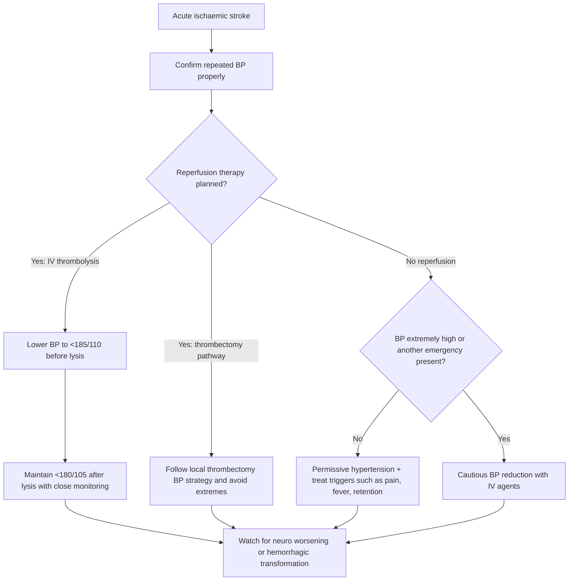
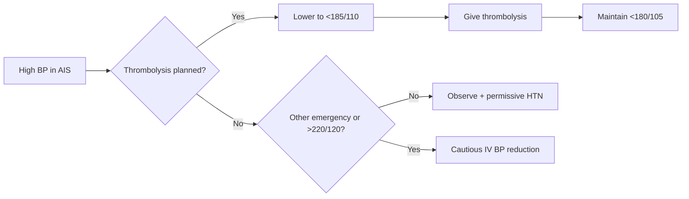

# Blood pressure management in acute ischaemic stroke

Related: [[../Stroke Medicine MOC|Stroke Medicine MOC]] · [[../Stroke Unit Care and Complications|Stroke Unit Care and Complications]] · [[Physiological optimization|Physiological optimization]] · [[../Acute Ischaemic Stroke/Acute ischaemic stroke|Acute ischaemic stroke]] · [[../Reperfusion Therapy/Intravenous alteplase eligibility|Intravenous alteplase eligibility]] · [[../Reperfusion Therapy/Mechanical thrombectomy eligibility|Mechanical thrombectomy eligibility]]

> [!important]
> In **acute ischaemic stroke (AIS)**, blood pressure is usually **not lowered aggressively by default**. The key exam principle is: **protect cerebral perfusion**, but lower BP when it is dangerously high, when reperfusion therapy is planned, or when another hypertensive emergency coexists.

## Learning Objectives
- Explain why BP often rises in AIS and why reflex lowering may be harmful.
- State practical BP thresholds in patients with and without thrombolysis/thrombectomy.
- Recognize when urgent BP lowering is indicated.
- Outline preferred agents, monitoring, red flags, and common exam traps.

## Definition
**Blood pressure management in acute ischaemic stroke** is the structured approach to assessing and modifying BP in the hyperacute and early stroke-unit period so that cerebral perfusion is maintained while minimizing hemorrhagic transformation, cerebral edema, recurrent stroke, cardiac complications, and reperfusion-related bleeding.

## Core Anatomy
- Cerebral perfusion to the **ischaemic penumbra** depends on collateral circulation.
- The infarct core is irreversibly injured, but surrounding tissue may remain viable if perfusion is preserved.
- Large-vessel occlusion, carotid disease, watershed territories, and poor collateral status make the brain more vulnerable to BP reduction.

## Core Physiology
- Autoregulation is impaired in the ischemic region.
- High BP in AIS is often a physiological stress response and may temporarily support collateral perfusion.
- Excessive BP can worsen cerebral edema, cardiac strain, and risk of hemorrhagic transformation.
- Excessive BP reduction can convert salvageable penumbra into infarct.

## Normal Values / Important Cut-offs
- **Do not lower BP routinely** in most AIS patients unless there is a clear indication.
- **If IV thrombolysis is planned**, BP must be reduced to a protocol-safe level **before lysis** and maintained within the safe range afterward.
- **If no reperfusion therapy is planned**, permissive hypertension is often accepted unless BP is extreme or another emergency exists.
- Practical high-yield thresholds commonly used in stroke care:
  - **Eligible for thrombolysis**: target **<185/110 mmHg before treatment**, then generally **<180/105 mmHg** afterward.
  - **Not receiving thrombolysis**: urgent lowering usually considered only when BP is around **>220/120 mmHg** or if another indication exists.
- Avoid a **rapid large fall** in BP; a cautious reduction is safer.

## Classification
### Clinical situations
1. AIS with **planned IV thrombolysis**
2. AIS with **planned mechanical thrombectomy**
3. AIS with **no reperfusion therapy**
4. AIS with **concurrent hypertensive emergency**
5. AIS with **post-reperfusion BP management needs**

### Treatment goals
- Preserve penumbra perfusion
- Enable reperfusion eligibility
- Prevent hemorrhagic transformation
- Limit cardiac, renal, or aortic complications when present

## Etiology / Causes of Hypertension in AIS
- Stress response with catecholamine surge
- Pre-existing hypertension
- Pain, anxiety, urinary retention
- Raised intracranial pressure or large infarct
- Hypoxia or hypercapnia
- Full bladder, fever, agitation
- Associated acute coronary syndrome or heart failure
- Medication non-adherence

## Risk Factors for Poor BP-Related Outcome
- Large-vessel occlusion
- Severe carotid stenosis or poor collateral status
- Large infarct core
- Planned or completed thrombolysis
- Elderly patient with labile BP
- Hyperglycaemia, fever, dehydration
- Cardiac failure, arrhythmia, renal impairment

## Pathophysiology
Following arterial occlusion, cerebral blood flow falls. The ischemic penumbra survives through collateral channels and pressure-dependent flow. Systemic BP may rise to maintain this flow. Lowering BP too much reduces perfusion pressure across stenosed or occluded vessels, enlarging infarct size. On the other hand, very high BP increases the chance of edema, hemorrhagic transformation, and cardiac complications. Therefore AIS BP management is an exercise in balance, not a reflex antihypertensive protocol.

## Clinical Features
### Features suggesting problematic severe hypertension
- Persistent very high BP on repeated readings
- Severe headache or agitation
- Pulmonary edema, chest pain, acute heart failure
- Hypertensive encephalopathy features
- Acute kidney injury
- Suspected aortic dissection

### Features suggesting BP is helping perfusion and should not be over-lowered
- Fluctuating deficits that worsen with BP reduction
- Critical carotid stenosis or large-vessel occlusion
- Border-zone/watershed pattern
- Poor collateral circulation

## Approach / Algorithm

## Investigations
- Repeated manual/automated BP measurement
- Neurological examination and serial NIHSS when feasible
- Non-contrast CT head ± CTA/CTP/MRI according to pathway
- ECG and rhythm monitoring
- Blood glucose
- CBC, creatinine, electrolytes
- Oxygen saturation and ABG if respiratory compromise suspected
- Troponin if cardiac ischemia suspected

## Interpretation Frameworks
### First interpret the context, not just the number
| Question | Why it matters |
|---|---|
| Is reperfusion therapy planned? | Thresholds are stricter |
| Is there another hypertensive emergency? | May require treatment despite AIS |
| Is the patient volume depleted or hypotensive after treatment? | Low BP may worsen penumbra loss |
| Is there large-vessel occlusion/critical carotid disease? | Perfusion may be pressure-dependent |
| Did BP rise because of pain, urinary retention, fever, or agitation? | Treating the trigger may be enough |

### Common BP contexts in AIS
| Scenario | Typical principle |
|---|---|
| AIS, no thrombolysis, not extreme | Usually observe; permissive hypertension |
| AIS before alteplase/tenecteplase | Lower to protocol-safe target |
| AIS after thrombolysis | Maintain within safe post-lysis range |
| AIS + aortic dissection | Treat aggressively because dissection dominates |
| AIS + pulmonary edema/ACS | Treat carefully because end-organ damage exists |

## Diagnosis
This is a **management diagnosis** rather than a separate disease entity. The clinician identifies:
1. AIS is present.
2. BP is elevated, normal, or low.
3. Reperfusion candidacy and comorbidity context define the treatment threshold.

## Differential Diagnosis
- Hypertensive intracerebral haemorrhage
- Hypertensive encephalopathy/PRES
- Aortic dissection causing neuro deficit
- Seizure/post-ictal state with transient hypertension
- Severe anxiety/pain-related BP surge without true stroke

## Tables / Comparison Charts
### AIS BP management by scenario
| Scenario | Main goal | Practical action |
|---|---|---|
| No thrombolysis and no emergency | Preserve perfusion | Usually do not lower unless extreme |
| Before IV thrombolysis | Achieve safe eligibility | Lower to <185/110 mmHg |
| After IV thrombolysis | Reduce bleed risk | Maintain <180/105 mmHg |
| Mechanical thrombectomy pathway | Support reperfusion while avoiding extremes | Use protocol-guided controlled BP |
| Hypertensive emergency with AIS | Protect brain and other organs | Cautious IV lowering with close monitoring |

### Drugs commonly used
| Drug | Why used | Cautions |
|---|---|---|
| Labetalol | Rapid IV control, familiar in stroke pathways | Avoid/exercise caution in bradycardia, severe asthma, decompensated HF |
| Nicardipine | Titrable infusion, smooth control | Watch for reflex tachycardia, local protocol availability |
| Clevidipine | Very rapid titration where available | Lipid emulsion; availability issues |
| GTN | Not usually first-line for hyperacute AIS BP optimization | May worsen cerebral perfusion if overused |
| Nitroprusside | Rarely needed | ICP concerns, toxicity with prolonged use |

## Management
### General principles
- Confirm repeated BP before acting.
- Correct reversible triggers: pain, urinary retention, agitation, fever, hypoxia.
- Avoid sudden large reductions.
- Use **IV titratable agents** when rapid control is necessary.
- Monitor neurological status continuously when BP is being lowered.

### If IV thrombolysis is planned
- Lower BP to **<185/110 mmHg** before treatment.
- Use pathway-approved IV agents.
- Recheck frequently.
- After thrombolysis, maintain **<180/105 mmHg** and avoid antithrombotics until safe by protocol.

### If mechanical thrombectomy is planned
- Avoid extreme hypertension and hypotension.
- During transfer, imaging, anaesthesia, and post-procedure care, the main principle is preservation of cerebral perfusion without provoking reperfusion injury.
- BP targets vary by protocol and reperfusion status, but **hypotension is especially dangerous**.

### If no reperfusion therapy is planned
- Allow **permissive hypertension** unless:
  - BP is markedly extreme
  - aortic dissection exists
  - acute heart failure/pulmonary edema exists
  - myocardial ischemia exists
  - hypertensive encephalopathy exists
  - severe renal injury exists
- If treatment is needed, lower cautiously and reassess neuro deficits.

### Low BP in AIS
- Hypotension is uncommon and ominous.
- Search for sepsis, dehydration, arrhythmia, myocardial infarction, bleeding, over-treatment, or aortic catastrophe.
- Correct the cause urgently because low BP worsens cerebral perfusion.

## Drug Interactions / Contraindications / Comorbidity Cautions
- **Labetalol**: caution in asthma/COPD with bronchospasm, bradycardia, high-grade heart block, acute decompensated HF.
- **Calcium-channel infusions**: may worsen hypotension if over-titrated.
- Avoid oral long-acting agents in the unstable hyperacute phase if rapid titration is needed.
- Sedatives may lower BP and mask neuro worsening.
- Overdiuresis in pulmonary edema may worsen brain perfusion if intravascular depletion occurs.

## Procedures / Indications / Contraindications
### When arterial line / ICU-style monitoring may be considered
- Severe BP lability
- Thrombolysis/thrombectomy with unstable hemodynamics
- Major comorbid cardiac or respiratory instability

### Contraindication principle
- Do not perform invasive procedures casually after thrombolysis unless necessary because of bleeding risk.

## Procedure Mini-Sections
### IV labetalol bolus concept
- **Indication:** severe BP needing prompt reduction, especially before thrombolysis.
- **Preparation:** confirm indication, repeat BP, ensure monitoring.
- **Principle:** small titrated bolus rather than a huge fall.
- **Complications:** bradycardia, hypotension, bronchospasm.
- **Viva pearl:** in AIS, the danger is usually **over-lowering**, not under-lowering.

## Complications
- Infarct extension from overaggressive BP lowering
- Hemorrhagic transformation with poorly controlled severe hypertension
- Cardiac ischemia or failure if extreme hypertension persists
- Kidney injury in severe hypertensive states
- Post-thrombolysis intracranial haemorrhage

## Red Flags / Emergencies
> [!warning]
> Act urgently if any of the following coexist with AIS:
> - BP severe enough to block reperfusion therapy
> - suspected **aortic dissection**
> - acute pulmonary edema
> - hypertensive encephalopathy
> - myocardial ischemia
> - sudden neuro worsening after BP manipulation

## Prognosis
- Better when BP strategy is individualized and reperfusion is not delayed unnecessarily.
- Worse with major BP lability, large infarct, poor collaterals, or iatrogenic hypotension.

## Topic Correlation
- [[../Acute Ischaemic Stroke/Acute ischaemic stroke|Acute ischaemic stroke]]
- [[../Reperfusion Therapy/Intravenous alteplase eligibility|Intravenous alteplase eligibility]]
- [[../Reperfusion Therapy/Post-thrombolysis monitoring and BP targets|Post-thrombolysis monitoring and BP targets]]
- [[Blood pressure management in intracerebral haemorrhage]]
- [[Glucose, oxygen, and temperature control in stroke]]

## Special Situations
### Elderly patient
- More vulnerable to both hypotension and drug side effects.

### Critical carotid stenosis / watershed infarction
- Over-lowering may worsen deficits.

### Concurrent ACS / pulmonary edema
- Needs more active control but still with neuro monitoring.

### Suspected dissection
- This is not routine AIS BP logic; aggressive BP/impulse control is required and thrombolysis is contraindicated.

## FCPS/MRCP High-Yield Points
- In AIS, **hypertension is often permissive** and should not be reflexly treated.
- Before IV thrombolysis: **<185/110 mmHg**.
- After IV thrombolysis: generally **<180/105 mmHg**.
- Without thrombolysis, treat only if markedly high or another emergency exists.
- **Hypotension is dangerous** because it reduces penumbral perfusion.

## Common Viva Questions
- Why is BP usually left alone in acute ischaemic stroke?
- What BP is acceptable before alteplase?
- Why is hypotension harmful in AIS?
- Which IV drugs are commonly used for rapid BP control in stroke pathways?
- How does BP strategy differ between AIS and ICH?

## Common Confusions / Exam Traps
- Confusing AIS BP targets with ICH BP targets.
- Treating anxiety-related or transient BP elevation too aggressively.
- Forgetting to repeat BP and correct pain/full bladder first.
- Missing that **thrombolysis eligibility** changes the threshold immediately.
- Ignoring hypotension because attention is focused only on severe hypertension.

## Mnemonics
### AIS BP mnemonic: **PERFUSE**
- **P**reserve penumbra
- **E**ligibility for thrombolysis changes thresholds
- **R**epeat BP correctly
- **F**ix triggers first
- **U**se IV titratable drugs when needed
- **S**udden large falls are dangerous
- **E**xclude other hypertensive emergencies

## Mind Map
- Acute ischaemic stroke
  - BP high
    - stress response
    - chronic HTN
    - pain/agitation/retention
  - Reperfusion planned
    - lower to eligibility threshold
    - maintain post-lysis target
  - No reperfusion
    - permissive hypertension
    - treat only if extreme/emergency
  - BP low
    - search for shock/MI/sepsis/dehydration

## Flowchart

## Suggested Visuals / Image Notes
- Diagram of infarct core vs penumbra and collateral circulation.
- Table comparing BP approach in AIS vs ICH.
- Hyperacute stroke-unit bedside pathway chart.

## Suggested Video References
- Hyperacute stroke management overview
- Stroke thrombolysis eligibility and BP targets
- Cerebral autoregulation and penumbra physiology

## One-Page Revision Summary
### Blood pressure management in acute ischaemic stroke
- BP commonly rises after AIS and may be **compensatory**.
- Do **not** lower routinely unless:
  - thrombolysis planned
  - BP is extremely high
  - another hypertensive emergency exists
- **Before IV thrombolysis:** lower to **<185/110 mmHg**.
- **After IV thrombolysis:** maintain **<180/105 mmHg**.
- In non-thrombolysis AIS, permissive hypertension is usually accepted unless BP is around **>220/120 mmHg** or another indication exists.
- Avoid large rapid BP drops because penumbra may be pressure dependent.
- Treat pain, fever, agitation, urinary retention, hypoxia.
- Preferred drugs: titratable IV agents such as labetalol or nicardipine according to local pathway.
- Hypotension in AIS is a red flag: search for sepsis, MI, dehydration, arrhythmia, or bleeding.

## 24-Hour Recall Prompts
- Why is permissive hypertension often accepted in AIS?
- What are the key BP cut-offs for thrombolysis?
- Name 3 conditions that force treatment of BP even without thrombolysis.
- Why can hypotension enlarge an infarct?
- Compare AIS BP management with ICH BP management.

## 7-Day / 15-Day / 30-Day Revision Tracker
- **Day 7:** recall thrombolysis thresholds from memory.
- **Day 15:** write the AIS BP algorithm without notes.
- **Day 30:** compare BP management in AIS, post-thrombolysis care, and ICH.

## Must Know / Should Know / Nice to Know
### Must Know
- Permissive hypertension principle
- <185/110 before lysis
- <180/105 after lysis
- Over-lowering can worsen penumbra perfusion

### Should Know
- Preferred IV agents and cautions
- Hypertensive emergency co-indications
- Causes of hypotension in AIS

### Nice to Know
- Detailed peri-thrombectomy BP variation by reperfusion status
- Collateral physiology nuance

## My Weak Points
- Can I recall the two thrombolysis-related BP cut-offs exactly?
- Do I confuse AIS management with ICH management?
- Do I remember that treating the trigger may remove the BP problem?

## Self-Test Scorecard
- Understanding of physiology: /10
- Recall of thresholds: /10
- Emergency recognition: /10
- Management sequencing: /10
- Viva confidence: /10

## Exam Answer Modes
### Short note frame
- Definition
- Why BP rises in AIS
- When not to treat
- When to treat
- Thrombolysis thresholds
- Drugs and cautions
- Red flags

### Viva frame
- “BP is often left high in AIS because penumbra perfusion may depend on it. We lower it if thrombolysis is planned, if it is extremely elevated, or if another hypertensive emergency exists.”

## Summary
Acute ischaemic stroke BP management is based on **perfusion preservation with selective intervention**. Severe hypertension can block reperfusion eligibility or trigger complications, but indiscriminate lowering can enlarge the infarct. The key exam thresholds are **<185/110 mmHg before thrombolysis** and **<180/105 mmHg after thrombolysis**.

## MCQs (10)
1. In most patients with acute ischaemic stroke who are not receiving thrombolysis, the main reason not to lower BP aggressively is:
   A. It increases seizure risk
   B. It may reduce perfusion to the ischemic penumbra
   C. It causes hyperglycaemia
   D. It prevents MRI interpretation

2. Before IV thrombolysis, BP should generally be reduced to:
   A. <220/120 mmHg
   B. <200/100 mmHg
   C. <185/110 mmHg
   D. <160/90 mmHg

3. After IV thrombolysis, the usual BP target is:
   A. <180/105 mmHg
   B. <140/90 mmHg
   C. <220/120 mmHg
   D. SBP exactly 120 mmHg

4. Which factor most supports permissive hypertension in AIS?
   A. Hypovolaemia
   B. Penumbra dependent on collateral flow
   C. Presence of hemorrhage
   D. Need for immediate neurosurgery

5. Which is a common IV drug used to lower BP rapidly in stroke pathways?
   A. Amoxicillin
   B. Labetalol
   C. Warfarin
   D. Digoxin

6. Which is the most dangerous consequence of excessive BP lowering in AIS?
   A. Cataract formation
   B. Infarct extension from reduced cerebral perfusion
   C. Hyperthyroidism
   D. Polycythaemia

7. Which scenario most clearly requires BP treatment in AIS despite no thrombolysis?
   A. Mild anxiety-related BP rise
   B. BP 170/95 mmHg with stable exam
   C. Suspected aortic dissection
   D. Normal oxygen saturation

8. Hypotension in AIS should prompt urgent search for:
   A. Only migraine
   B. Sepsis, MI, dehydration, or arrhythmia
   C. Psoriasis
   D. Osteoporosis

9. Which statement is true?
   A. All AIS patients need immediate oral antihypertensives
   B. BP thresholds are identical in AIS and ICH
   C. Stroke context matters more than the number alone
   D. BP should always be normalized within 30 minutes

10. Post-thrombolysis BP control mainly aims to reduce risk of:
   A. Cataract
   B. Symptomatic intracranial haemorrhage
   C. Pancreatitis
   D. Nephrotic syndrome

## SBA Questions (10)
1. A 69-year-old man presents 90 minutes after onset of right hemiplegia and aphasia. CT excludes haemorrhage. He is being prepared for alteplase. BP is 198/112 mmHg on repeated readings. Best next step?
   A. Avoid treatment because BP is expected in stroke
   B. Give aspirin immediately
   C. Lower BP with a titratable IV agent to make him eligible for thrombolysis
   D. Delay all intervention for 24 hours

2. A 74-year-old woman with AIS is not eligible for thrombolysis and has BP 196/104 mmHg. She is stable, comfortable, and has no chest pain, pulmonary edema, or renal failure. Best approach?
   A. Immediate aggressive BP lowering to normal range
   B. Permissive hypertension with monitoring
   C. Emergency craniotomy
   D. Start long-term triple therapy immediately in the ED

3. A patient with AIS becomes hypotensive after transfer from ED to the stroke unit. Why is this concerning?
   A. Hypotension improves collaterals
   B. It can worsen penumbral perfusion and enlarge infarct
   C. It proves the patient does not have stroke
   D. It prevents fever

4. A patient with AIS has BP 230/126 mmHg and acute pulmonary edema. Best principle?
   A. Ignore BP because all stroke hypertension is protective
   B. Cautious BP reduction is required because there is concurrent end-organ damage
   C. Give thrombolysis immediately without BP control
   D. Treat only with oral vitamins

5. During IV BP lowering before thrombolysis, what must be monitored closely?
   A. Hair loss
   B. Neurological status and repeated BP
   C. Toenail color only
   D. Bone density

6. A patient with critical carotid stenosis shows worsening weakness after BP falls sharply. Most likely explanation?
   A. Improved collateral flow
   B. Reduced perfusion to pressure-dependent ischemic tissue
   C. Drug allergy to aspirin
   D. New meningitis

7. Which patient should most strongly trigger suspicion that another emergency is driving the BP strategy?
   A. AIS with BP 172/94 and no symptoms
   B. AIS with tearing chest pain radiating to back
   C. AIS with mild fever only
   D. AIS with normal ECG

8. After alteplase, a patient’s BP repeatedly exceeds target. Main danger?
   A. Symptomatic intracranial haemorrhage
   B. Appendicitis
   C. Iron deficiency
   D. Glaucoma

9. Which measure can reduce unnecessary antihypertensive use in AIS?
   A. Treat every reading instantly
   B. Check for pain, urinary retention, agitation, and fever first
   C. Avoid repeat BP measurements
   D. Ignore the clinical context

10. Which is the best summary statement?
   A. BP treatment in AIS is number-based only
   B. BP treatment in AIS balances perfusion preservation against hemorrhagic risk
   C. BP is irrelevant in stroke
   D. All AIS patients require the same target

## Flashcards
- Q: Why is BP often left elevated in acute ischaemic stroke?
  A: Because elevated BP may help maintain perfusion of the ischemic penumbra through collateral flow.
- Q: Target BP before IV thrombolysis?
  A: Generally <185/110 mmHg.
- Q: Target BP after IV thrombolysis?
  A: Generally <180/105 mmHg.
- Q: What is permissive hypertension?
  A: Accepting moderately elevated BP in AIS to preserve cerebral perfusion when no urgent reason to lower exists.
- Q: Name 2 IV agents commonly used for rapid BP control in stroke.
  A: Labetalol and nicardipine.
- Q: What is the major danger of overaggressive BP lowering in AIS?
  A: Infarct extension due to reduced penumbral perfusion.
- Q: Give 3 non-stroke triggers of transient BP elevation in AIS.
  A: Pain, urinary retention, agitation/anxiety, fever, hypoxia.
- Q: When should BP be lowered in AIS without thrombolysis?
  A: When markedly extreme or when another hypertensive emergency/co-indication exists.
- Q: Why is hypotension dangerous in AIS?
  A: It reduces cerebral perfusion and may worsen ischemic injury.
- Q: What post-thrombolysis complication is BP control trying to prevent?
  A: Symptomatic intracranial haemorrhage.

## Answer Key with Explanations
### MCQs
1. **B** — Penumbral tissue may be pressure dependent, so indiscriminate BP lowering can worsen ischemia.
2. **C** — This is the standard high-yield thrombolysis eligibility threshold.
3. **A** — The post-lysis target is generally <180/105 mmHg.
4. **B** — Collateral-dependent penumbra is the physiological reason for permissive hypertension.
5. **B** — Labetalol is a standard IV option.
6. **B** — Cerebral hypoperfusion is the feared iatrogenic harm.
7. **C** — Aortic dissection changes the entire management priority.
8. **B** — These are classic causes of hypotension in AIS and demand urgent correction.
9. **C** — Clinical context determines whether and how BP should be treated.
10. **B** — Poor BP control after lysis raises the hemorrhagic risk.

### SBAs
1. **C** — He is otherwise eligible but not yet BP-eligible for thrombolysis.
2. **B** — In stable non-thrombolysis AIS, permissive hypertension is usually appropriate.
3. **B** — Low BP reduces perfusion to the penumbra.
4. **B** — Pulmonary edema is a concurrent end-organ emergency requiring treatment.
5. **B** — The main monitoring targets are neuro status and BP.
6. **B** — Pressure-dependent tissue may worsen after a sudden BP drop.
7. **B** — Tearing back pain suggests aortic dissection, which overrides routine AIS BP logic.
8. **A** — High BP after alteplase raises risk of symptomatic intracranial haemorrhage.
9. **B** — Treating reversible triggers may remove the need for antihypertensives.
10. **B** — AIS BP management is individualized balancing perfusion versus bleeding/end-organ risk.
