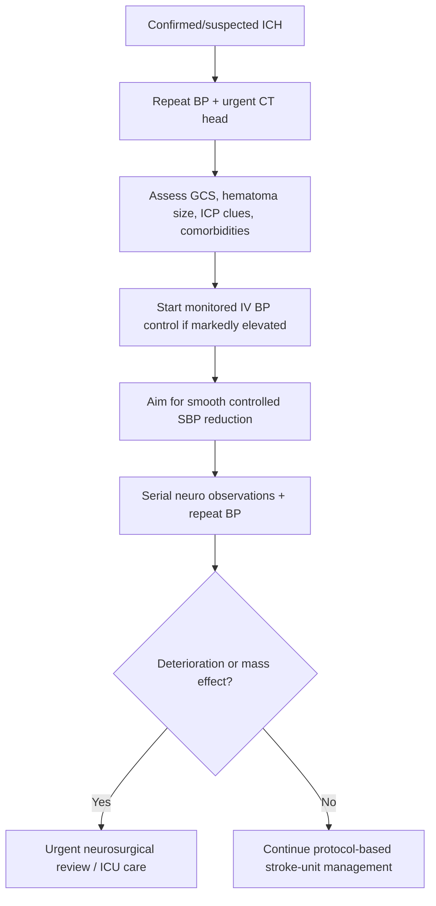
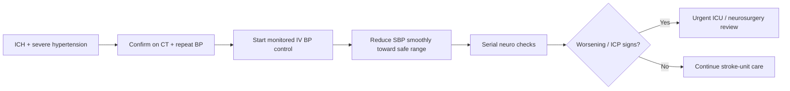

# Blood pressure management in intracerebral haemorrhage

Related: [[../Stroke Medicine MOC|Stroke Medicine MOC]] · [[../Stroke Unit Care and Complications|Stroke Unit Care and Complications]] · [[Physiological optimization|Physiological optimization]] · [[../Intracerebral Haemorrhage/Intracerebral haemorrhage|Intracerebral haemorrhage]] · [[Blood pressure management in acute ischaemic stroke]]

> [!important]
> In **intracerebral haemorrhage (ICH)**, high BP can drive **hematoma expansion**. Unlike acute ischaemic stroke, the exam emphasis is usually on **earlier and more active BP control**, while avoiding hypotension that compromises overall cerebral perfusion.

## Learning Objectives
- Explain why BP control is central in acute ICH.
- Recognize practical systolic BP goals and the principle of smooth reduction.
- Identify preferred IV agents, contraindications, and monitoring priorities.
- Differentiate ICH BP management from AIS BP management.

## Definition
**Blood pressure management in intracerebral haemorrhage** is the targeted control of elevated BP after spontaneous ICH to reduce hematoma expansion and secondary brain injury while maintaining adequate systemic and cerebral perfusion.

## Core Anatomy
- ICH usually occurs in brain parenchyma, commonly in deep structures (basal ganglia, thalamus), lobar regions, brainstem, or cerebellum.
- Ongoing bleeding into a closed cranial compartment raises mass effect and can increase intracranial pressure.
- Deep perforator vessel rupture from chronic hypertension is a classic mechanism.

## Core Physiology
- Elevated BP may worsen active bleeding and hematoma growth.
- Hematoma expansion is strongly linked to neurological deterioration and poor outcome.
- Excessive BP lowering can reduce cerebral perfusion pressure, especially if ICP is high.
- Therefore the goal is **prompt but controlled** BP reduction, not a crash to normal values.

## Normal Values / Important Cut-offs
- Persistently elevated **systolic BP** in ICH often prompts active IV treatment.
- A common exam principle is to lower markedly elevated SBP to a safer range, often around **140 mmHg** when appropriate and without contraindication, while avoiding hypotension.
- Very severe hypertension may need urgent infusion-based treatment in HDU/ICU or stroke-unit monitored care.
- Repeat neuro assessment and BP checks are essential because both hematoma expansion and over-treatment can worsen the patient.

## Classification
### Contexts of ICH BP management
1. Hyperacute ICH with ongoing expansion risk
2. ICH with raised ICP or mass effect
3. ICH with secondary causes (coagulopathy, AVM, anticoagulant use)
4. ICH with need for neurosurgical decision-making

### Goals
- Reduce hematoma expansion
- Prevent rebleeding
- Avoid secondary ischemia/hypotension
- Stabilize patient for imaging and further treatment

## Etiology / Causes of High BP in ICH
- Chronic hypertension as the underlying disease
- Catecholamine surge and stress response
- Pain, vomiting, agitation
- Raised ICP and Cushing response
- Medication non-adherence
- Renal disease or pre-existing vascular disease

## Risk Factors for Poor Outcome
- Large hematoma volume
- Intraventricular extension
- Cerebellar or brainstem hemorrhage
- Depressed consciousness
- Markedly elevated SBP on arrival
- Anticoagulant-associated bleed
- Ongoing hematoma expansion
- Advanced age and major comorbidity

## Pathophysiology
Spontaneous ICH commonly begins with rupture of a small vessel, followed by parenchymal bleeding. Early after onset, hematoma expansion may continue. High arterial pressure increases mechanical stress on the injured vascular bed, promoting further bleeding. The hematoma causes local tissue destruction, perihematomal edema, raised ICP, and midline shift in severe cases. BP reduction reduces expansion risk, but if performed too aggressively it can compromise cerebral perfusion pressure, especially where ICP is elevated.

## Clinical Features
### Features that increase urgency of BP control
- Very high SBP on repeated readings
- Ongoing neuro deterioration
- Vomiting, headache, falling GCS
- Large ICH on imaging
- Intraventricular extension
- Severe agitation or autonomic surge

### Clues to complications during treatment
- New drowsiness or focal worsening
- Signs of increased ICP
- Hypotension after over-treatment
- Bradycardia with poor perfusion
- Cardiac ischemia or arrhythmia

## Approach / Algorithm

## Investigations
- Non-contrast CT head urgently
- Serial BP measurements
- GCS and neurological examination
- CBC, platelets, coagulation profile
- Renal function, electrolytes
- ECG and cardiac monitoring
- CTA/MRA if secondary cause suspected and patient suitable
- Repeat CT if clinical deterioration or to assess expansion

## Interpretation Frameworks
### What determines intensity of BP management?
| Factor | Why it matters |
|---|---|
| Initial SBP level | Higher SBP may increase hematoma expansion risk |
| Time since onset | Early hours are expansion-prone |
| Hematoma volume/location | Large/cerebellar/brainstem bleeds are high risk |
| Raised ICP/mass effect | Limits tolerance of hypotension |
| Anticoagulant use | Greater rebleeding risk |
| Need for surgery | Stable pre-op control important |

### AIS vs ICH blood pressure logic
| Feature | AIS | ICH |
|---|---|---|
| Main concern | Preserve penumbra perfusion | Prevent hematoma expansion |
| Routine lowering? | Often no | Often yes if markedly elevated |
| Thrombolysis threshold issue | Critical | Not relevant because thrombolysis contraindicated |
| Danger of over-treatment | Infarct extension | Low CPP / systemic hypoperfusion |

## Diagnosis
The working diagnosis is **acute ICH with hypertension requiring risk-adjusted BP control**. Diagnosis depends on:
- confirmation of ICH by CT/MRI
- repeated BP readings
- clinical severity and expansion risk profile

## Differential Diagnosis
- Hemorrhagic transformation of infarct
- Subarachnoid haemorrhage
- Hypertensive encephalopathy/PRES
- Brain tumor bleed or structural lesion bleed
- Cerebral venous sinus thrombosis with hemorrhagic lesion

## Tables / Comparison Charts
### Common IV agents for ICH BP control
| Agent | Advantages | Cautions |
|---|---|---|
| Labetalol | Familiar, quick onset, easy bolus use | Bradycardia, bronchospasm, heart block, acute HF |
| Nicardipine | Smooth infusion-based control | Reflex tachycardia, availability |
| Clevidipine | Rapid titration where available | Lipid emulsion, cost/availability |
| GTN | Sometimes used when needed | May be less ideal in neurocritical care if marked vasodilation worsens ICP concerns |

### Practical treatment principles
| Principle | Why important |
|---|---|
| Treat early if BP markedly high | Limits expansion risk |
| Lower smoothly, not abruptly | Avoids perfusion compromise |
| Monitor neurological status continuously | Detects expansion or over-treatment |
| Consider ICP and surgery context | BP target cannot be interpreted in isolation |

## Management
### Immediate priorities
- ABC stabilization
- Urgent CT confirmation
- Stroke-unit/HDU monitoring
- Repeated BP measurement
- Treat pain, vomiting, agitation
- Reverse anticoagulation if present where relevant

### Blood pressure strategy
- If SBP is persistently high, use IV titratable therapy.
- Aim for **rapid but controlled reduction** rather than normalization.
- Many exam frameworks cite a target near **SBP 140 mmHg** when feasible and safe.
- Avoid causing hypotension, particularly with reduced consciousness or raised ICP.

### Choice of drug
- **Labetalol** bolus or infusion is common.
- **Nicardipine** infusion is widely used where available.
- Choose based on pulse, airway status, cardiac history, bronchospasm risk, and local protocol.

### Monitoring
- Frequent BP checks
- Serial GCS/NIHSS or neuro observations
- Watch for vomiting, worsening headache, anisocoria, bradycardia, falling consciousness
- Repeat CT if deterioration occurs

### If raised ICP or mass effect is present
- Coordinate BP management with neurocritical care/neurosurgery.
- Avoid precipitous reduction that could worsen cerebral perfusion pressure.
- Manage head position, airway, ventilation, osmotherapy, and surgical indications as needed.

## Drug Interactions / Contraindications / Comorbidity Cautions
- **Beta-blockers**: caution in severe asthma, bradycardia, AV block, decompensated HF.
- **Calcium-channel infusions**: monitor for hypotension and reflex tachycardia.
- Sedatives and antihypertensives together can produce occult neurological decline.
- In severe carotid disease or poor baseline perfusion, over-lowering is especially dangerous.
- Renal failure and frailty increase risk of treatment-related hypotension.

## Procedures / Indications / Contraindications
### Indications for higher-level monitoring
- Large ICH
- Intraventricular extension
- Need for infusion-based BP control
- Reduced GCS
- Brainstem or cerebellar hemorrhage
- Possible surgery/EVD decision

### Relative contraindication principle
- Avoid uncontrolled BP swings around procedures such as intubation or transfer.

## Procedure Mini-Sections
### Nicardipine infusion concept
- **Indication:** persistently severe hypertension in ICH requiring smooth titration.
- **Preparation:** monitored bed, IV access, repeat baseline BP.
- **Principle:** gradual down-titration to safe SBP rather than sudden collapse.
- **Complications:** hypotension, tachycardia.
- **Viva pearl:** smooth control is often preferable to repeated wide swings from intermittent therapy.

## Complications
- Hematoma expansion
- Perihematomal edema
- Raised ICP and herniation
- Intraventricular extension and hydrocephalus
- Hypotension from over-treatment
- Cardiac complications from uncontrolled severe hypertension

## Red Flags / Emergencies
> [!warning]
> In ICH, urgently escalate if there is:
> - falling GCS
> - unequal pupils
> - recurrent vomiting with bradycardia
> - cerebellar bleed with brainstem compression risk
> - uncontrolled SBP despite treatment
> - anticoagulant-associated bleed or active expansion on repeat imaging

## Prognosis
- Better with early hematoma stabilization and careful physiological control.
- Worse with large volume, intraventricular extension, brainstem location, uncontrolled hypertension, or secondary deterioration.

## Topic Correlation
- [[../Intracerebral Haemorrhage/Intracerebral haemorrhage|Intracerebral haemorrhage]]
- [[Blood pressure management in acute ischaemic stroke]]
- [[Cerebral oedema and raised intracranial pressure in stroke]]
- [[Hemorrhagic transformation warning signs]]

## Special Situations
### Anticoagulant-associated ICH
- BP control must be paired with urgent reversal strategy.

### Cerebellar haemorrhage
- Deterioration may be rapid; monitor closely for hydrocephalus and compression.

### Frail elderly patient
- Use controlled titration; overshoot hypotension is common and harmful.

### Suspected structural lesion bleed
- Further vascular or tumor evaluation may be required after stabilization.

## FCPS/MRCP High-Yield Points
- In ICH, hypertension matters because it can promote **hematoma expansion**.
- BP is usually treated more actively than in AIS.
- The goal is **smooth reduction**, not instant normalization.
- Commonly quoted practical goal: bring markedly elevated SBP toward **~140 mmHg** when appropriate.
- Over-lowering can reduce cerebral perfusion pressure, especially with raised ICP.

## Common Viva Questions
- Why is BP lowered more actively in ICH than in AIS?
- What complication are you trying to prevent?
- Which IV agents are commonly used?
- Why should BP not be dropped too fast?
- What features suggest raised ICP during treatment?

## Common Confusions / Exam Traps
- Using permissive hypertension logic from AIS in ICH.
- Chasing a “normal” BP immediately.
- Forgetting to monitor for raised ICP and surgical indications.
- Ignoring vomiting/agitation as contributors to BP elevation.
- Treating the monitor instead of the overall neurocritical context.

## Mnemonics
### ICH BP mnemonic: **STOP BLEED**
- **S**ystolic pressure matters
- **T**itrate IV therapy
- **O**ngoing expansion risk early
- **P**rotect perfusion; avoid hypotension
- **B**rain observation continuously
- **L**arge hematoma = higher urgency
- **E**scalate if ICP signs
- **E**valuate for anticoagulants/secondary causes
- **D**on’t use AIS logic blindly

## Mind Map
- ICH
  - high BP
    - chronic HTN
    - stress/pain/vomiting
    - raised ICP
  - main risk
    - hematoma expansion
  - treatment
    - IV labetalol/nicardipine
    - smooth SBP reduction
  - monitor
    - GCS
    - repeat CT if worse
    - ICP signs

## Flowchart

## Suggested Visuals / Image Notes
- Diagram of hematoma expansion causing mass effect.
- Table comparing BP approach in AIS vs ICH.
- Deep hypertensive ICH anatomical map.

## Suggested Video References
- Spontaneous ICH acute management
- Neurocritical care BP control principles
- Hematoma expansion and ICH prognosis

## One-Page Revision Summary
### Blood pressure management in intracerebral haemorrhage
- ICH BP management aims to reduce **hematoma expansion**.
- BP is treated more actively than in AIS.
- Use **smooth IV titration**; do not induce hypotension.
- Many protocols target markedly elevated SBP down toward **~140 mmHg** when appropriate.
- Use repeated BP, frequent neuro observations, and repeat CT if worsening.
- Think of mass effect, edema, intraventricular extension, and surgery context.
- Preferred agents: labetalol, nicardipine, clevidipine where available.
- Main danger of overtreatment: low cerebral perfusion pressure.

## 24-Hour Recall Prompts
- Why is BP control more urgent in ICH than AIS?
- What is the main complication prevented by BP lowering?
- Why should BP not be reduced abruptly?
- Name 2 IV agents used in ICH.
- How does raised ICP affect your BP thinking?

## 7-Day / 15-Day / 30-Day Revision Tracker
- **Day 7:** compare BP targets/principles in AIS vs ICH.
- **Day 15:** list indications for urgent escalation in ICH.
- **Day 30:** write a 2-minute viva answer on ICH BP management.

## Must Know / Should Know / Nice to Know
### Must Know
- Prevent hematoma expansion
- Smooth IV lowering
- Avoid hypotension
- More active treatment than AIS

### Should Know
- Approximate SBP goal around 140 mmHg when appropriate
- Preferred IV drugs and contraindications
- Raised ICP interaction with BP targets

### Nice to Know
- Detailed trial nuances and protocol variation
- Post-surgical BP nuances

## My Weak Points
- Do I accidentally apply AIS permissive hypertension logic to ICH?
- Can I explain why hypotension is still dangerous in ICH?
- Do I remember the role of repeat CT if deterioration occurs?

## Self-Test Scorecard
- Pathophysiology recall: /10
- Drug choice recall: /10
- Red-flag recognition: /10
- AIS vs ICH comparison: /10
- Viva confidence: /10

## Exam Answer Modes
### Short note frame
- Definition
- Why BP matters in ICH
- Target principle
- IV drugs
- Monitoring
- Complications/red flags

### Viva frame
- “In ICH we lower markedly elevated BP more actively because high pressure may drive hematoma expansion. We use smooth IV titration, often toward an SBP around 140 mmHg when appropriate, while avoiding hypotension and monitoring for raised ICP.”

## Summary
Blood pressure management in ICH focuses on **preventing hematoma expansion without compromising perfusion**. It is usually more proactive than in AIS, uses titratable IV therapy, and requires close neurological and hemodynamic monitoring.

## MCQs (10)
1. The main reason to lower BP in acute intracerebral haemorrhage is to reduce:
   A. Fever
   B. Hematoma expansion
   C. Dysphagia
   D. Hyperlipidaemia

2. Compared with AIS, BP in ICH is generally:
   A. Ignored completely
   B. Treated more actively
   C. Always increased deliberately
   D. Managed only with oral therapy

3. A practical commonly cited SBP goal in suitable ICH patients is around:
   A. 220 mmHg
   B. 180 mmHg
   C. 140 mmHg
   D. 90 mmHg

4. Which IV drug is commonly used for BP control in ICH?
   A. Labetalol
   B. Metformin
   C. Rifampicin
   D. Furosemide only

5. The major risk of overaggressive BP lowering in ICH is:
   A. Hair loss
   B. Reduced cerebral perfusion pressure
   C. Hypercalcaemia
   D. Otitis media

6. Which imaging is essential urgently in suspected ICH?
   A. Chest X-ray only
   B. Non-contrast CT head
   C. Barium swallow
   D. MRI knee

7. Which feature suggests raised ICP during ICH care?
   A. Improved alertness
   B. Vomiting with falling GCS
   C. Stable examination
   D. Isolated ankle pain

8. Which statement is true?
   A. BP strategy in ICH is identical to AIS
   B. In ICH, hematoma expansion risk makes BP control important
   C. Hypotension is always desirable in ICH
   D. BP does not affect outcome

9. Which patient most clearly needs high-level monitored BP control?
   A. Small stable old lacune
   B. Large ICH with intraventricular extension and severe hypertension
   C. Tension headache only
   D. Migraine aura

10. Which is the best summary of BP reduction in ICH?
   A. Abrupt normalization
   B. Smooth controlled lowering with monitoring
   C. No treatment ever
   D. Immediate chronic oral regimen only

## SBA Questions (10)
1. A 62-year-old man presents with sudden hemiplegia and reduced consciousness. CT shows a basal ganglia haemorrhage. SBP is 212 mmHg. Best principle?
   A. Ignore BP because stroke needs perfusion
   B. Start controlled IV BP lowering with close monitoring
   C. Give thrombolysis
   D. Send home with oral medication

2. A woman with lobar ICH has SBP 198 mmHg. She receives infusion therapy and becomes drowsier after a large rapid BP fall. Most likely concern?
   A. Improved perfusion
   B. Over-treatment causing perfusion compromise or worsening brain injury
   C. New asthma only
   D. Isolated hypocalcaemia

3. In ICH, the feared early radiological-clinical event linked to uncontrolled BP is:
   A. Meningitis
   B. Hematoma expansion
   C. Cataract progression
   D. Gallstones

4. Which patient best fits need for urgent repeat CT during BP management?
   A. Stable patient with no symptoms
   B. Patient with worsening headache, vomiting, and lower GCS
   C. Patient requesting food
   D. Patient with chronic knee pain

5. Which IV agent is often preferred because it allows smooth titration?
   A. Nicardipine
   B. Iron sucrose
   C. Warfarin
   D. Lactulose

6. A stroke trainee says, “Treat ICH BP like AIS and allow permissive hypertension.” Best correction?
   A. Correct
   B. Incorrect, because high BP in ICH may worsen hematoma expansion
   C. Correct only in all large bleeds
   D. BP never matters in ICH

7. A patient with ICH is also anticoagulated. What additional principle matters besides BP control?
   A. Start thrombolysis
   B. Reverse anticoagulation urgently where indicated
   C. Avoid imaging
   D. Ignore coagulation status

8. Which combination is most concerning for herniation/ICP problems?
   A. Stable mild headache only
   B. Bradycardia, vomiting, and falling consciousness
   C. Normal exam and appetite
   D. Mild eczema

9. Why is BP not dropped abruptly to normal in ICH?
   A. Because numbers do not matter
   B. Because hypotension can reduce cerebral perfusion pressure
   C. Because CT becomes unreadable
   D. Because fever will rise

10. Best overall summary?
   A. ICH BP control is expansion prevention with smooth titrated lowering
   B. ICH BP control is unnecessary once CT is done
   C. ICH BP control means forcing SBP to 90 mmHg immediately
   D. ICH BP control is identical to TIA care

## Flashcards
- Q: Why is BP treated more actively in ICH than AIS?
  A: Because uncontrolled hypertension can promote hematoma expansion.
- Q: Main danger of over-lowering BP in ICH?
  A: Reduced cerebral perfusion pressure and systemic hypoperfusion.
- Q: Common practical SBP target principle in suitable ICH patients?
  A: Smoothly lower markedly elevated SBP toward about 140 mmHg when appropriate.
- Q: Name 2 IV agents used in ICH BP control.
  A: Labetalol and nicardipine.
- Q: What urgent imaging is required in suspected ICH?
  A: Non-contrast CT head.
- Q: What complication links high BP to worse ICH outcome?
  A: Hematoma expansion.
- Q: Which stroke type commonly uses permissive hypertension?
  A: Acute ischaemic stroke, not ICH.
- Q: What clinical signs suggest raised ICP in ICH?
  A: Falling GCS, vomiting, bradycardia, pupillary changes.
- Q: What extra issue matters in anticoagulant-associated ICH?
  A: Reversal of anticoagulation.
- Q: Why is smooth titration better than abrupt reduction?
  A: It reduces expansion risk without causing major perfusion collapse.

## Answer Key with Explanations
### MCQs
1. **B** — High BP in ICH is important mainly because it may increase ongoing bleeding and expansion.
2. **B** — ICH generally requires more active BP control than AIS.
3. **C** — Around 140 mmHg is a commonly cited practical target in suitable patients.
4. **A** — Labetalol is a standard IV option.
5. **B** — The key harm of overtreatment is loss of cerebral perfusion pressure.
6. **B** — CT head is essential to confirm hemorrhage and guide care.
7. **B** — Vomiting plus falling GCS are classic danger signs.
8. **B** — Hematoma expansion risk is why BP matters.
9. **B** — Large ICH with IVH and severe hypertension needs close monitored care.
10. **B** — Smooth, monitored lowering is the core principle.

### SBAs
1. **B** — This is classic acute ICH with severe hypertension needing controlled IV treatment.
2. **B** — Large rapid BP falls can worsen cerebral perfusion and clinical status.
3. **B** — Hematoma expansion is the feared early worsening event.
4. **B** — New deterioration should trigger urgent repeat imaging.
5. **A** — Nicardipine is valued for smooth titration.
6. **B** — Permissive hypertension is AIS logic, not standard ICH logic.
7. **B** — Anticoagulant-associated ICH requires urgent reversal strategy plus BP control.
8. **B** — This pattern suggests raised ICP and impending herniation.
9. **B** — Over-lowering can compromise perfusion pressure.
10. **A** — This best captures the aim and method of ICH BP management.

## PasTest Scenario SBAs (Clinical Vignettes)

> **Auto-generated PasTest/Mediscope-style scenario SBAs** grounded in the authored source. Each scenario tests a real clinical fact (triad, specific sign, contraindication, trial, first-line Rx) extracted from the topic. *Source: Ch 27: Neurology & Stroke — Blood pressure management in intracerebral haemorrhage*

**Q1.** What is the most appropriate first-line therapy for Blood pressure management in intracerebral haemorrhage?

  - **A.** If SBP is persistently high, use IV titratable therapy
  - **B.** An advanced/surgical therapy reserved for refractory disease
  - **C.** Symptomatic treatment only, no disease-modifying therapy
  - **D.** Empiric broad-spectrum therapy without specific indication

  > **Answer: A** — If SBP is persistently high, use IV titratable therapy
  >
  > *Source:* If SBP is persistently high, use IV titratable therapy.

