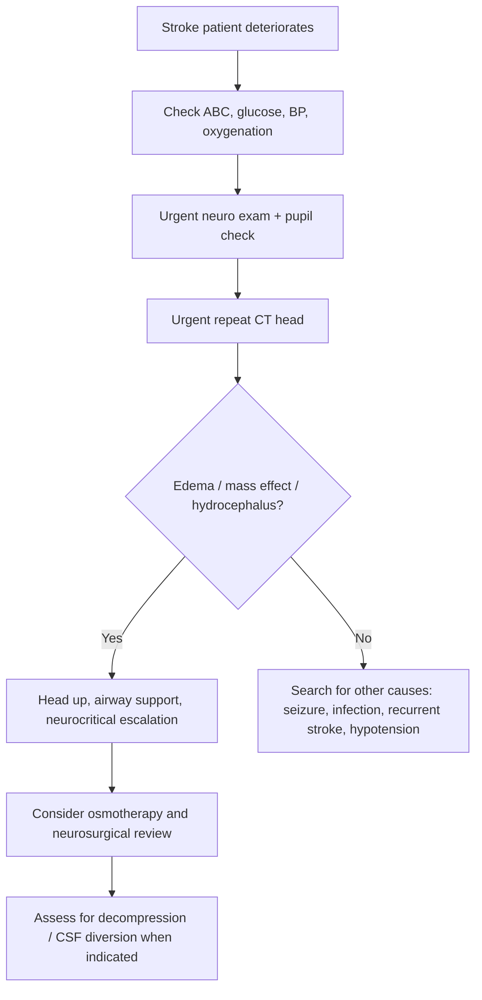

# Cerebral oedema and raised intracranial pressure in stroke

Related: [[../Stroke Medicine MOC|Stroke Medicine MOC]] · [[../Stroke Unit Care and Complications|Stroke Unit Care and Complications]] · [[Common early complications|Common early complications]] · [[Malignant middle cerebral artery infarction]] · [[Hemorrhagic transformation warning signs]] · [[../Intracerebral Haemorrhage/Intracerebral haemorrhage|Intracerebral haemorrhage]]

> [!important]
> **Cerebral oedema and raised intracranial pressure (ICP)** are among the most dangerous early stroke complications. The exam focus is recognizing **deterioration early**, preventing secondary injury, and knowing when to escalate to neurocritical care or decompressive surgery.

## Learning Objectives
- Explain why edema develops after stroke and how it raises ICP.
- Recognize clinical and radiological warning signs.
- Outline emergency management including positioning, airway care, osmotherapy, and surgical escalation.
- Distinguish edema-related decline from other causes of neurological worsening.

## Definition
**Cerebral oedema and raised intracranial pressure in stroke** refers to swelling of injured brain tissue after ischaemic or haemorrhagic stroke, producing mass effect, reduced cerebral perfusion pressure, herniation risk, and potentially death.

## Core Anatomy
- The skull is a fixed closed box containing brain, blood, and CSF.
- Large hemispheric infarcts, cerebellar infarcts, and ICH can create substantial mass effect.
- Midline shift, ventricular compression, and brainstem compression are key anatomical consequences.

## Core Physiology
- According to the Monro-Kellie principle, intracranial volume is limited.
- Tissue swelling raises ICP when compensatory displacement of CSF/venous blood is exhausted.
- Rising ICP lowers cerebral perfusion pressure and worsens ischemia.
- Herniation syndromes arise when pressure gradients shift brain tissue across rigid structures.

## Normal Values / Important Cut-offs
- Exact ICP numbers are less important in routine FCPS/MRCP than recognizing clinical deterioration.
- Dangerous clues include reduced consciousness, pupillary asymmetry, bradycardia with hypertension, vomiting, and radiological mass effect.
- Large MCA infarction often swells in the first days; posterior fossa lesions may deteriorate rapidly because of tight compartment anatomy.

## Classification
### By mechanism
1. **Cytotoxic edema** — early cellular swelling from energy failure, especially in ischemia.
2. **Vasogenic edema** — blood-brain barrier disruption and extracellular fluid accumulation.
3. **Hydrocephalus-related pressure rise** — especially with intraventricular blood or posterior fossa compression.

### By stroke type
- Large hemispheric ischaemic stroke
- Cerebellar infarction
- Intracerebral haemorrhage
- Hemorrhagic transformation of infarct

## Etiology / Causes
- Large territorial infarction
- Malignant MCA infarction
- Cerebellar infarction with posterior fossa crowding
- Large ICH with perihematomal edema
- Intraventricular extension causing hydrocephalus
- Reperfusion injury or hemorrhagic transformation

## Risk Factors
- Young patient with large MCA infarction
- Large infarct volume
- Delayed presentation or failed reperfusion
- Hyperglycaemia, fever, severe hypertension
- Cerebellar or brainstem location
- Large hemorrhage or anticoagulant-associated bleed

## Pathophysiology
In ischemic stroke, ATP depletion causes failure of ion pumps and intracellular sodium-water accumulation (cytotoxic edema). Subsequent blood-brain barrier disruption produces vasogenic edema. In hemorrhage, direct mass effect plus perihematomal edema worsen pressure burden. As ICP rises, cerebral perfusion pressure falls, further intensifying ischemia. In fixed cranial space, worsening edema may lead to herniation, coma, and cardiorespiratory compromise.

## Clinical Features
### Symptoms and signs
- New or worsening headache
- Vomiting
- Reduced level of consciousness
- Progressive focal deficit
- Pupil asymmetry or sluggish pupils
- Cushing response: hypertension with bradycardia
- Irregular respirations in advanced deterioration

### Pattern clues
- Large MCA infarct: progressive drowsiness over 24–72 hours
- Cerebellar lesion: vomiting, ataxia, rapid brainstem compromise
- ICH: abrupt decline with mass effect signs

## Approach / Algorithm

## Investigations
- Urgent repeat non-contrast CT head
- MRI in selected cases if diagnostic uncertainty remains and patient stable
- Serial GCS and neurological observations
- Glucose, electrolytes, ABG if deteriorating
- ECG, pulse oximetry, BP monitoring
- Consider invasive ICP-directed care only in specialist neurocritical settings

## Interpretation Frameworks
### How to interpret deterioration after stroke
| Possible cause | Key clues |
|---|---|
| Cerebral edema / raised ICP | Reduced consciousness, headache, vomiting, mass effect on CT |
| Hemorrhagic transformation | Sudden worsening, new blood on CT |
| Seizure/post-ictal state | Witnessed event, jerking, recovery phase |
| Aspiration/hypoxia | Desaturation, chest findings |
| Metabolic cause | Glucose/electrolyte abnormality |

### CT clues suggesting dangerous edema
| CT feature | Significance |
|---|---|
| Midline shift | Significant mass effect |
| Sulcal effacement | Cerebral swelling |
| Ventricular compression | Raised mass effect |
| Basal cistern effacement | Herniation risk |
| Hydrocephalus | Obstructed CSF flow, urgent escalation |

## Diagnosis
Diagnosis is made by combining:
- worsening neurological state
- examination suggesting raised ICP
- imaging showing edema, mass effect, shift, hydrocephalus, or compression

## Differential Diagnosis
- Recurrent ischemic event
- Hemorrhagic transformation
- Post-ictal deficit
- Sepsis or delirium
- Hypoglycaemia or other metabolic abnormality
- Drug/sedative effect

## Tables / Comparison Charts
### Ischaemic vs haemorrhagic edema patterns
| Feature | Large ischaemic stroke | ICH |
|---|---|---|
| Main mechanism | Cytotoxic then vasogenic edema | Hematoma + perihematomal edema |
| Timing | Often evolves over 1–3 days | Can be early and rapid |
| Surgical issue | Decompressive hemicraniectomy | Hematoma evacuation / posterior fossa decompression / EVD in selected cases |

### Immediate bedside measures
| Measure | Rationale |
|---|---|
| Head up ~30° | Improves venous drainage |
| Neutral neck position | Avoids jugular obstruction |
| Treat hypoxia/fever | Reduces secondary injury |
| Avoid hypotension | Maintains CPP |
| Urgent imaging | Confirms cause and guides intervention |

## Management
### Initial emergency measures
- Call senior stroke/neurocritical/neurosurgical help early.
- ABC stabilization.
- Elevate head of bed.
- Keep neck midline.
- Correct hypoxia, hypercapnia, fever, severe hypertension/hypotension as appropriate.
- Avoid hypotonic fluids.
- Reassess glucose.

### Osmotherapy
- Consider **mannitol** or **hypertonic saline** in specialist-guided care when significant edema/ICP crisis is suspected.
- Use as a temporizing measure, not a substitute for definitive escalation.
- Monitor sodium, renal function, and hemodynamics.

### Ventilation / airway support
- Intubation may be required for low GCS, loss of airway reflexes, or impending herniation.
- Avoid prolonged hypoxia/hypercapnia.

### Surgical escalation
- **Decompressive hemicraniectomy** may be life-saving in malignant MCA infarction.
- **Posterior fossa decompression** may be required for cerebellar stroke with compression.
- **External ventricular drainage** may be needed in hydrocephalus, especially with intraventricular blood.

### Ongoing care
- Frequent neuro observations
- Repeat imaging if further deterioration
- Prevent aspiration, DVT, fever, and glucose derangement

## Drug Interactions / Contraindications / Comorbidity Cautions
- Osmotherapy can worsen dehydration, renal dysfunction, or electrolyte disturbance if misused.
- Excess sedation may mask neurological deterioration.
- Hypotension from over-treatment reduces CPP.
- Hyperventilation is only a temporary rescue measure in selected critical situations, not routine long-term therapy.

## Procedures / Indications / Contraindications
### Indications for urgent neurosurgical discussion
- Significant midline shift
- Malignant MCA infarction
- Cerebellar lesion with brainstem compression or hydrocephalus
- Obstructive hydrocephalus
- Clinical herniation signs

### Contraindication principle
- Do not delay escalation while repeatedly trying small ward-level measures in a clearly deteriorating patient.

## Procedure Mini-Sections
### Mannitol concept
- **Indication:** suspected raised ICP/herniation while definitive care is arranged.
- **Preparation:** IV access, renal function review, hemodynamic monitoring.
- **Principle:** osmotic movement of water out of brain tissue.
- **Complications:** dehydration, renal strain, electrolyte disturbance.
- **Viva pearl:** mannitol buys time; it does not cure malignant edema.

### Decompressive hemicraniectomy concept
- **Indication:** malignant hemispheric swelling in selected patients.
- **Principle:** relieves pressure by removing part of skull.
- **Benefit:** improves survival and may improve functional outcome in selected patients.
- **Pitfall:** decision is time-sensitive; late referral loses benefit.

## Complications
- Herniation
- Coma
- Brainstem compression
- Hydrocephalus
- Secondary ischemia from low CPP
- Death

## Red Flags / Emergencies
> [!warning]
> Urgent escalation is required for:
> - falling GCS
> - pupillary asymmetry
> - recurrent vomiting with headache and drowsiness
> - Cushing response
> - CT showing midline shift, cisternal effacement, or hydrocephalus
> - cerebellar stroke with rapid decline

## Prognosis
- Mild edema may be manageable with stroke-unit care.
- Prognosis worsens sharply with herniation, large mass effect, delayed recognition, or inability to offer decompression when indicated.
- Selected patients with malignant MCA infarction benefit substantially from timely surgery.

## Topic Correlation
- [[Malignant middle cerebral artery infarction]]
- [[Hemorrhagic transformation warning signs]]
- [[Early neurological deterioration after stroke]]
- [[../Intracerebral Haemorrhage/Intracerebral haemorrhage|Intracerebral haemorrhage]]
- [[../Acute Ischaemic Stroke/Cerebellar infarction|Cerebellar infarction]]

## Special Situations
### Cerebellar infarction or haemorrhage
- Small posterior fossa volume means decompensation can be sudden and catastrophic.

### Young patient with malignant MCA infarction
- Greater edema burden due to less atrophy; may benefit from timely decompressive surgery.

### Anticoagulant-associated ICH
- Combine pressure management with reversal and neurosurgical planning.

## FCPS/MRCP High-Yield Points
- Think of edema/raised ICP when a stroke patient **worsens after admission**.
- Large MCA infarcts and cerebellar strokes are classic high-risk settings.
- Head elevation, airway protection, urgent CT, and senior escalation are first-line actions.
- Osmotherapy is temporary support.
- Malignant MCA infarction may require decompressive hemicraniectomy.

## Common Viva Questions
- Why does edema occur after large ischemic stroke?
- What are the signs of raised ICP?
- What CT findings suggest dangerous mass effect?
- When do you involve neurosurgery?
- Why is posterior fossa stroke especially dangerous?

## Common Confusions / Exam Traps
- Attributing reduced consciousness only to “big stroke” without re-imaging.
- Missing posterior fossa deterioration because focal signs seem small.
- Forgetting hydrocephalus in intraventricular extension.
- Using osmotherapy without arranging definitive escalation.
- Ignoring fever, hypoxia, or hypotension that worsen cerebral injury simultaneously.

## Mnemonics
### Raised ICP warning mnemonic: **DROWSY**
- **D**eclining consciousness
- **R**epeat vomiting
- **O**cular/pupil change
- **W**orsening weakness
- **S**hift/hydrocephalus on scan
- **Y**ell for neurosurgical help early

## Mind Map
- Stroke deterioration
  - edema
    - cytotoxic
    - vasogenic
  - signs
    - headache
    - vomiting
    - drowsiness
    - pupils unequal
  - CT
    - midline shift
    - cistern effacement
    - hydrocephalus
  - management
    - head up
    - airway
    - osmotherapy
    - surgery

## Flowchart

## Suggested Visuals / Image Notes
- Monro-Kellie concept diagram.
- CT examples of midline shift and effaced sulci.
- Malignant MCA edema progression chart.

## Suggested Video References
- Raised ICP and herniation basics
- Malignant MCA infarction and hemicraniectomy
- Cerebellar stroke deterioration recognition

## One-Page Revision Summary
### Cerebral oedema and raised ICP in stroke
- Occurs in large ischemic strokes, ICH, and posterior fossa lesions.
- Mechanisms: cytotoxic edema, vasogenic edema, hydrocephalus.
- Red flags: worsening consciousness, vomiting, headache, unequal pupils, Cushing response.
- CT clues: sulcal effacement, midline shift, ventricular compression, basal cistern effacement, hydrocephalus.
- Immediate actions:
  - ABC
  - head up 30°
  - neck neutral
  - oxygenate and correct glucose/fever
  - urgent repeat CT
  - senior/neurosurgical escalation
- Temporizing therapy: mannitol or hypertonic saline in the right setting.
- Definitive options: hemicraniectomy, posterior fossa decompression, EVD in selected patients.

## 24-Hour Recall Prompts
- Name 5 signs of raised ICP in stroke.
- Which stroke locations are especially dangerous for edema-related collapse?
- What CT findings suggest mass effect?
- Why is decompressive surgery time-sensitive?
- Why is osmotherapy not definitive treatment?

## 7-Day / 15-Day / 30-Day Revision Tracker
- **Day 7:** recall DROWSY mnemonic.
- **Day 15:** sketch the edema/raised ICP algorithm from memory.
- **Day 30:** compare malignant MCA infarction vs cerebellar compression.

## Must Know / Should Know / Nice to Know
### Must Know
- Deterioration after stroke requires urgent reassessment
- Head up, airway, repeat CT, escalate
- Malignant MCA infarction and cerebellar lesions are high risk
- Consider decompression/EVD where indicated

### Should Know
- Cytotoxic vs vasogenic edema
- Osmotherapy principles and cautions
- Hydrocephalus from intraventricular blood

### Nice to Know
- Detailed neurocritical ICP monitoring strategies
- Nuances of surgery timing by age and infarct side

## My Weak Points
- Do I recognize posterior fossa danger early enough?
- Can I state the CT signs of raised ICP without notes?
- Do I remember that osmotherapy is only temporizing?

## Self-Test Scorecard
- Pathophysiology recall: /10
- CT interpretation confidence: /10
- Emergency response sequencing: /10
- Surgical indication awareness: /10
- Viva confidence: /10

## Exam Answer Modes
### Short note frame
- Definition
- Causes
- Clinical signs
- Imaging signs
- Emergency management
- Surgical options

### Viva frame
- “A stroke patient who becomes drowsy, vomits, or develops pupillary change may have cerebral edema and raised ICP. I would stabilize ABC, elevate the head, repeat CT urgently, correct secondary insults, and escalate early for osmotherapy and neurosurgical options such as decompression or CSF diversion.”

## Summary
Cerebral oedema and raised ICP in stroke are time-critical complications. The essential exam message is early recognition of deterioration, confirmation with urgent imaging, immediate supportive measures, and rapid escalation for neurocritical or surgical intervention.

## MCQs (10)
1. Raised ICP after stroke is most fundamentally explained by:
   A. Unlimited cranial volume
   B. The fixed intracranial compartment
   C. Isolated renal sodium retention
   D. Hyperlipidaemia only

2. Which is a classic sign of raised ICP?
   A. Improved alertness
   B. Vomiting with falling consciousness
   C. Isolated rash
   D. Chronic knee pain

3. Which stroke syndrome is especially associated with massive edema needing decompression?
   A. Malignant MCA infarction
   B. TIA
   C. Migraine
   D. Bell palsy

4. Which CT feature suggests mass effect?
   A. Clear basal cisterns only
   B. Midline shift
   C. Normal ventricles
   D. Empty chest cavity

5. A temporary measure for suspected raised ICP is:
   A. Mannitol
   B. Vitamin C
   C. Statin only
   D. Metformin

6. Posterior fossa strokes are dangerous because:
   A. The compartment is roomy
   B. Small lesions can compress the brainstem or obstruct CSF flow
   C. They never affect consciousness
   D. They do not swell

7. Which is the best initial step in a stroke patient who acutely becomes drowsy?
   A. Wait until morning rounds
   B. Urgent reassessment and repeat CT head
   C. Start outpatient rehab
   D. Give unrestricted oral fluids

8. The Monro-Kellie principle refers to:
   A. Coronary anatomy
   B. Fixed total volume of brain, CSF, and intracranial blood within the skull
   C. Glucose transport only
   D. Renal filtration

9. Which sign most suggests impending herniation?
   A. Stable examination
   B. Pupillary asymmetry with falling GCS
   C. Mild constipation
   D. Normal CT

10. Which statement is true?
   A. Osmotherapy cures malignant edema definitively
   B. Decompressive surgery may be life-saving in selected stroke patients
   C. Repeat imaging is never needed after initial CT
   D. Edema occurs only in hemorrhagic stroke

## SBA Questions (10)
1. A 55-year-old man with a large MCA infarct becomes drowsy and vomits 36 hours after admission. Best next step?
   A. Reassure and observe until tomorrow
   B. Urgent CT head and senior escalation for possible malignant edema
   C. Start oral feeding
   D. Discharge because stroke is already diagnosed

2. A cerebellar stroke patient becomes increasingly somnolent with bradycardia. Main concern?
   A. Simple anxiety
   B. Posterior fossa compression and raised ICP
   C. Isolated peripheral vertigo
   D. Tension headache

3. Which bedside measure should be done early while arranging definitive care?
   A. Lie patient flat with flexed neck
   B. Elevate head of bed and keep neck neutral
   C. Give excessive hypotonic fluid
   D. Stop all monitoring

4. CT shows intraventricular blood and hydrocephalus in a deteriorating patient. Which escalation may be required?
   A. Cosmetic surgery
   B. External ventricular drainage
   C. Cataract extraction
   D. Dialysis only

5. Which statement about mannitol is best?
   A. It is definitive treatment for all edema
   B. It may temporize raised ICP while definitive management is arranged
   C. It is used only in outpatient care
   D. It never affects renal function

6. A patient with stroke worsens but CT shows no new edema or hemorrhage. Next principle?
   A. Assume the scan is wrong and stop thinking
   B. Search for other causes like seizure, hypoxia, or metabolic disturbance
   C. Ignore the patient
   D. Feed immediately

7. Which feature most strongly suggests Cushing response?
   A. Bradycardia with hypertension and declining consciousness
   B. Fever and rash
   C. Polyuria and thirst
   D. Tremor only

8. Why must hypotension be avoided in raised ICP states?
   A. It increases cerebral perfusion pressure
   B. It can further reduce cerebral perfusion pressure
   C. It prevents CT imaging
   D. It treats hydrocephalus

9. Which patient is most likely to benefit from decompressive hemicraniectomy consideration?
   A. Malignant hemispheric infarction with edema and deterioration
   B. Resolved TIA
   C. Stable chronic infarct 2 years ago
   D. Small asymptomatic lacune

10. Best overall summary?
   A. Stroke edema management is observation only
   B. Edema-related deterioration requires urgent imaging, supportive measures, and early escalation
   C. Edema is never relevant in ischemic stroke
   D. Raised ICP can be diagnosed without clinical context

## Flashcards
- Q: What principle explains raised ICP in a fixed skull?
  A: The Monro-Kellie doctrine.
- Q: Name 3 warning signs of raised ICP after stroke.
  A: Falling consciousness, vomiting, pupillary asymmetry, Cushing response, worsening focal deficit.
- Q: Which ischemic stroke syndrome is classically associated with malignant edema?
  A: Malignant middle cerebral artery infarction.
- Q: What posterior fossa complication may occur with cerebellar stroke?
  A: Brainstem compression and obstructive hydrocephalus.
- Q: What CT finding indicates major mass effect?
  A: Midline shift.
- Q: Name 2 temporizing osmotherapy options.
  A: Mannitol and hypertonic saline.
- Q: What bedside position helps venous drainage?
  A: Head elevation about 30 degrees with neutral neck.
- Q: What definitive intervention may be life-saving in malignant MCA infarction?
  A: Decompressive hemicraniectomy.
- Q: What may be required for hydrocephalus with intraventricular blood?
  A: External ventricular drainage.
- Q: What is the key first imaging step in new deterioration?
  A: Urgent repeat CT head.

## Answer Key with Explanations
### MCQs
1. **B** — Raised pressure occurs because the skull is a fixed-volume compartment.
2. **B** — Vomiting and reduced consciousness are classic danger signs.
3. **A** — Malignant MCA infarction is the classic ischemic edema emergency.
4. **B** — Midline shift is a key marker of mass effect.
5. **A** — Mannitol is a standard temporizing osmotic therapy.
6. **B** — Posterior fossa space is tight, so small volume increases can be catastrophic.
7. **B** — Acute deterioration after stroke needs urgent reassessment and imaging.
8. **B** — This is the core content of the Monro-Kellie principle.
9. **B** — This combination strongly suggests dangerous pressure rise/herniation risk.
10. **B** — Surgery can be life-saving in selected severe cases.

### SBAs
1. **B** — This is classic timing and presentation for malignant edema after a large infarct.
2. **B** — Posterior fossa compression is the major threat.
3. **B** — This simple measure improves venous drainage and is standard early care.
4. **B** — EVD may be required for obstructive hydrocephalus.
5. **B** — Osmotherapy may buy time but is not definitive management.
6. **B** — Worsening after stroke has multiple causes; keep a broad emergency differential.
7. **A** — This is the classic Cushing pattern.
8. **B** — Low systemic pressure worsens CPP.
9. **A** — This is the classic surgical consideration scenario.
10. **B** — Urgent imaging plus escalation is the central principle.
