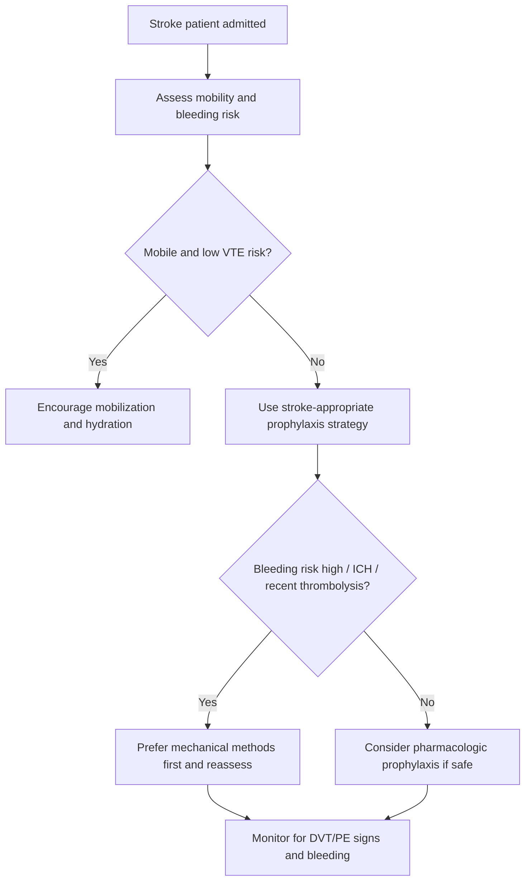
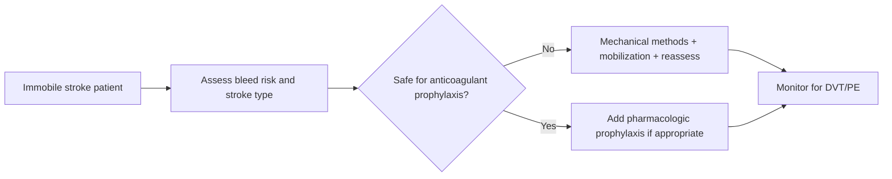

# Deep-vein thrombosis prevention after stroke

Related: [[../Stroke Medicine MOC|Stroke Medicine MOC]] · [[../Stroke Unit Care and Complications|Stroke Unit Care and Complications]] · [[Common early complications|Common early complications]] · [[Aspiration pneumonia after stroke]] · [[../Recovery, Rehabilitation, and Prognosis/Early mobilization and multidisciplinary recovery planning|Early mobilization and multidisciplinary recovery planning]]

> [!important]
> Immobile stroke patients are at risk of **deep-vein thrombosis (DVT)** and **pulmonary embolism (PE)**. The exam focus is balancing **VTE prevention** against **intracranial bleeding risk**, especially after haemorrhagic stroke or recent thrombolysis.

## Learning Objectives
- Explain why stroke predisposes to venous thromboembolism.
- Identify high-risk patients and practical prevention strategies.
- Distinguish mechanical and pharmacological prophylaxis.
- Recognize DVT/PE red flags and bleeding cautions.

## Definition
**Deep-vein thrombosis prevention after stroke** is the set of stroke-unit strategies used to reduce venous thromboembolism in immobilized or high-risk stroke patients while minimizing hemorrhagic complications.

## Core Anatomy
- DVT most often forms in the deep veins of the calf, popliteal system, or proximal femoral/iliac veins.
- Clots may embolize to the pulmonary circulation causing PE.
- Stroke-related hemiplegia and bed rest promote lower-limb venous stasis.

## Core Physiology
- Virchow triad applies:
  - **stasis** from immobility/paralysis
  - **endothelial injury** and inflammation
  - **hypercoagulability** from acute illness and systemic response
- Prevention aims to restore venous flow, reduce stasis, and use anticoagulant prophylaxis when safe.

## Normal Values / Important Cut-offs
- No single numeric threshold is the main exam issue here; the key decision is **who is immobile and how high the bleeding risk is**.
- DVT prophylaxis after stroke must always consider:
  - haemorrhagic vs ischaemic stroke
  - recent thrombolysis or procedures
  - current imaging stability
  - ability to mobilize early

## Classification
### Prevention methods
1. Early mobilization and hydration optimization
2. Mechanical prophylaxis
3. Pharmacological prophylaxis

### Stroke-context groups
- Immobile ischaemic stroke
- Recent thrombolysis/reperfusion patient
- Intracerebral haemorrhage patient
- Mobile/low-risk stroke patient

## Etiology / Causes of VTE Risk After Stroke
- Limb paralysis and immobility
- Dehydration
- Infection and systemic inflammation
- Cancer or thrombophilia in selected patients
- Previous DVT/PE
- Obesity, heart failure, advanced age

## Risk Factors
- Severe hemiplegia or reduced mobility
- Prolonged bed rest
- Previous VTE
- Active malignancy
- Dehydration
- Obesity
- Increasing age
- Concurrent infection

## Pathophysiology
Stroke reduces mobility, especially in patients with hemiparesis, drowsiness, or severe disability. Venous blood pools in dependent lower limbs and calf-muscle pumping is reduced. Acute systemic inflammation and dehydration further favor thrombosis. DVT may remain asymptomatic or present with swelling and pain; the major feared consequence is PE, which can cause sudden hypoxia, circulatory collapse, and death.

## Clinical Features
### DVT clues
- Unilateral leg swelling
- Calf pain/tenderness
- Increased limb warmth
- Pitting edema, especially asymmetrical

### PE clues
- Sudden dyspnea
- Pleuritic chest pain
- Tachycardia
- Desaturation
- Syncope or shock in severe PE

### Stroke-specific difficulty
- Aphasia, neglect, reduced consciousness, and sensory loss may hide symptoms.

## Approach / Algorithm

## Investigations
### For prevention planning
- Mobility assessment
- Stroke type and imaging review
- Review of recent thrombolysis/procedures
- CBC, renal function, coagulation status when relevant

### If DVT suspected
- Compression venous Doppler ultrasound

### If PE suspected
- Pulse oximetry/ABG
- ECG
- CTPA if appropriate and feasible
- D-dimer is less useful in acute hospitalized stroke settings because illness raises baseline probability and false positives

## Interpretation Frameworks
### Who is high risk?
| Feature | Why it matters |
|---|---|
| Severe limb weakness | Major immobility/stasis |
| Bed-bound status | Ongoing venous pooling |
| Previous VTE | Strong recurrence risk |
| Cancer/infection | Additional thrombosis risk |
| Dehydration | Thickened flow and low mobility |

### How to think about prophylaxis choice
| Situation | Preferred principle |
|---|---|
| Mobile stroke patient | Early mobilization often enough |
| Immobile ischemic stroke, low bleed risk | Consider pharmacologic prophylaxis if appropriate |
| Recent thrombolysis | Delay/coordinate antithrombotic prophylaxis per protocol and imaging |
| ICH or unstable bleeding risk | Mechanical methods first; reassess later |

## Diagnosis
This topic concerns **prevention**, but diagnosis becomes relevant when DVT/PE is suspected based on clinical signs and confirmatory imaging.

## Differential Diagnosis
### For swollen leg
- Cellulitis
- Dependent edema
- Heart failure edema
- Muscle injury
- Baker cyst rupture

### For breathlessness/PE concern
- Aspiration pneumonia
- Pulmonary edema
- Atelectasis
- Acute coronary syndrome
- COPD exacerbation

## Tables / Comparison Charts
### Mechanical vs pharmacological prophylaxis
| Method | Advantages | Limitations |
|---|---|---|
| Early mobilization | Physiological, low bleeding risk | Not possible in severe deficits |
| Intermittent pneumatic compression (IPC) | Useful in immobile patients, no systemic anticoagulation | Requires application and adherence |
| Pharmacological prophylaxis | Effective VTE prevention when safe | Bleeding risk, especially after ICH or lysis |

### Stroke-unit prevention checklist
| Item | Why important |
|---|---|
| Assess mobility daily | Risk changes over time |
| Encourage early mobilization | Reduces stasis and supports rehab |
| Maintain hydration | Reduces hemoconcentration |
| Review stroke type before anticoagulant prophylaxis | Bleeding balance |
| Watch for limb/chest symptoms | Early detection of VTE |

## Management
### Universal preventive measures
- Assess mobility on admission and daily.
- Encourage early mobilization when safe.
- Maintain hydration and avoid unnecessary prolonged bed rest.
- Use nursing and physiotherapy support for leg movement and repositioning.

### Mechanical prophylaxis
- **Intermittent pneumatic compression** is important in immobile stroke patients when appropriate.
- Useful especially when pharmacological prophylaxis is delayed or unsafe.
- Stockings are less emphasized than IPC in modern stroke prevention discussions.

### Pharmacological prophylaxis
- Consider low-dose anticoagulant prophylaxis in selected immobile patients when bleeding risk is acceptable and imaging/protocol context allows.
- In **recent thrombolysis**, antithrombotic timing follows protocol and follow-up imaging safety checks.
- In **ICH**, bleeding risk may initially outweigh benefit; reassess over time and use specialist guidance.

### If DVT or PE occurs
- Confirm diagnosis where possible.
- Reassess bleeding risk urgently before therapeutic anticoagulation.
- Coordinate with stroke/hematology/critical care if PE is severe or if hemorrhagic stroke complicates decisions.

## Drug Interactions / Contraindications / Comorbidity Cautions
- Pharmacologic prophylaxis increases bleeding risk, particularly in:
  - recent thrombolysis
  - intracerebral haemorrhage
  - thrombocytopenia/coagulopathy
  - recent invasive procedures
- Renal dysfunction may affect LMWH handling.
- Severe immobility plus active cancer may increase thrombosis risk enough to influence earlier planning once safe.

## Procedures / Indications / Contraindications
### IPC use
- **Indication:** immobile stroke patient at VTE risk, especially if anticoagulants are not yet safe.
- **Contraindications/cautions:** severe peripheral arterial disease, major limb injury, or device-specific local issues depending on protocol.

### Compression ultrasound
- **Indication:** clinical suspicion of DVT.
- **Principle:** confirms clot burden and guides treatment.

## Procedure Mini-Sections
### Intermittent pneumatic compression concept
- **Indication:** bed-bound or markedly immobile stroke patient.
- **Preparation:** fit device properly, check skin and limb condition.
- **Principle:** cyclic compression reduces venous stasis.
- **Complications:** skin breakdown, poor adherence, discomfort.
- **Viva pearl:** IPC is especially valuable when anticoagulation is temporarily unsafe.

### Pharmacologic prophylaxis concept
- **Indication:** immobile patient when intracranial bleeding risk is judged acceptable.
- **Preparation:** review imaging, stroke type, platelet count, renal function, recent lysis/procedures.
- **Complication:** intracranial or systemic bleeding.
- **Viva pearl:** in stroke, “Can I give prophylaxis?” is always a bleed-risk question first.

## Complications
- DVT
- Pulmonary embolism
- Post-thrombotic syndrome
- Bleeding from inappropriate prophylactic anticoagulation
- Delayed rehabilitation from prolonged immobility

## Red Flags / Emergencies
> [!warning]
> Escalate urgently for:
> - sudden unexplained hypoxia or chest pain
> - tachycardia/syncope suggesting PE
> - new unilateral leg swelling in an immobile stroke patient
> - hemoptysis or circulatory collapse
> - worsening bleed risk while on prophylaxis

## Prognosis
Effective VTE prevention reduces morbidity and mortality. Outcome worsens when immobility is prolonged, PE is missed, or prophylaxis is either omitted in high-risk patients or given unsafely in bleeding-prone patients.

## Topic Correlation
- [[Aspiration pneumonia after stroke]]
- [[Glucose, oxygen, and temperature control in stroke]]
- [[../Recovery, Rehabilitation, and Prognosis/Early mobilization and multidisciplinary recovery planning|Early mobilization and multidisciplinary recovery planning]]
- [[../Reperfusion Therapy/Post-thrombolysis monitoring and BP targets|Post-thrombolysis monitoring and BP targets]]

## Special Situations
### Intracerebral haemorrhage
- Often starts with mechanical prophylaxis and delayed/individualized pharmacologic decisions.

### Recent thrombolysis
- Delay antithrombotic prophylaxis according to protocol and repeat imaging.

### Cancer-associated stroke / thrombophilia suspicion
- VTE risk may be particularly high; longer-term strategy may differ.

## FCPS/MRCP High-Yield Points
- Immobile stroke patients are at risk of DVT and PE.
- Early mobilization and IPC are important preventive tools.
- Pharmacologic prophylaxis must be balanced against intracranial bleeding risk.
- ICH and post-thrombolysis patients require especially careful timing decisions.
- PE may present suddenly with hypoxia and collapse.

## Common Viva Questions
- Why are stroke patients prone to DVT?
- What is the role of IPC in stroke care?
- Why must anticoagulant prophylaxis be individualized after stroke?
- How would you suspect PE in a stroke patient?
- How does ICH alter DVT prevention strategy?

## Common Confusions / Exam Traps
- Assuming all stroke patients should receive immediate anticoagulant prophylaxis.
- Forgetting mechanical prophylaxis when bleeding risk is high.
- Missing PE because respiratory symptoms are attributed only to pneumonia.
- Ignoring daily mobility reassessment.
- Overlooking dehydration as a modifiable VTE factor.

## Mnemonics
### DVT prevention mnemonic: **MOVE LEGS**
- **M**obilize early
- **O**bserve bleed risk
- **V**TE signs monitoring
- **E**nsure hydration
- **L**eg compression when indicated
- **E**valuate stroke type
- **G**ive drugs only when safe
- **S**uspect PE if sudden hypoxia

## Mind Map
- Stroke immobility
  - risks
    - DVT
    - PE
  - prevention
    - mobilize
    - hydrate
    - IPC
    - pharmacologic prophylaxis if safe
  - cautions
    - ICH
    - recent thrombolysis
    - coagulopathy

## Flowchart

## Suggested Visuals / Image Notes
- IPC device illustration.
- Virchow triad applied to stroke immobility.
- Table contrasting prophylaxis in ischemic stroke vs ICH.

## Suggested Video References
- VTE prevention in acute stroke unit care
- DVT vs PE recognition in hospitalized patients
- Mechanical thromboprophylaxis basics

## One-Page Revision Summary
### Deep-vein thrombosis prevention after stroke
- Stroke causes immobility, venous stasis, dehydration, and inflammation → DVT/PE risk.
- High-risk patients: severe hemiplegia, bed-bound, older, prior VTE, cancer, infection.
- Prevention pillars:
  - early mobilization
  - hydration
  - IPC when appropriate
  - pharmacologic prophylaxis only when bleeding risk is acceptable
- Be especially cautious after:
  - intracerebral haemorrhage
  - thrombolysis/recent invasive procedures
- Suspect DVT with unilateral leg swelling/pain.
- Suspect PE with sudden dyspnea, hypoxia, tachycardia, pleuritic pain, or collapse.

## 24-Hour Recall Prompts
- Why is DVT common after severe stroke?
- When is IPC especially useful?
- Why can prophylactic anticoagulation be hazardous in stroke?
- Name 4 PE warning signs.
- How does ICH alter prevention strategy?

## 7-Day / 15-Day / 30-Day Revision Tracker
- **Day 7:** recall MOVE LEGS mnemonic.
- **Day 15:** compare mechanical vs pharmacologic prophylaxis.
- **Day 30:** give a viva answer on VTE prevention after stroke.

## Must Know / Should Know / Nice to Know
### Must Know
- Immobility drives VTE risk
- Early mobilization and IPC are important
- Anticoagulant prophylaxis depends on bleed risk
- PE can present with sudden hypoxia/collapse

### Should Know
- DVT/PE symptom patterns
- Renal and platelet issues with prophylaxis
- ICH/post-thrombolysis timing cautions

### Nice to Know
- Detailed institutional prophylaxis timing protocols
- Advanced thrombophilia/cancer-associated stroke nuances

## My Weak Points
- Do I remember to think PE, not only pneumonia, in sudden post-stroke hypoxia?
- Can I explain why IPC matters when anticoagulation is unsafe?
- Do I reassess mobility daily rather than once?

## Self-Test Scorecard
- VTE physiology recall: /10
- Prevention strategy recall: /10
- Bleed-risk judgment confidence: /10
- PE recognition confidence: /10
- Viva confidence: /10

## Exam Answer Modes
### Short note frame
- Definition
- Why stroke causes DVT
- Risk factors
- Prevention methods
- Bleeding cautions
- DVT/PE red flags

### Viva frame
- “Immobile stroke patients are at risk of DVT and PE because of venous stasis and acute illness. Prevention includes early mobilization, hydration, IPC, and pharmacological prophylaxis when safe. In ICH or after thrombolysis, bleeding risk may delay anticoagulant prophylaxis.”

## Summary
DVT prevention after stroke is a balance between thrombosis prevention and intracranial bleeding safety. Early mobilization, IPC, and careful individualized use of pharmacologic prophylaxis are central stroke-unit practices.

## MCQs (10)
1. The main reason stroke patients develop DVT is:
   A. Excess bone growth
   B. Immobility and venous stasis
   C. Increased gastric acid
   D. Hyperopia

2. The most feared consequence of DVT is:
   A. Cataract
   B. Pulmonary embolism
   C. Gingivitis
   D. Eczema

3. A key non-pharmacological method of DVT prevention in stroke is:
   A. IPC
   B. Routine antibiotics
   C. Steroids for all
   D. Bed rest

4. Pharmacological prophylaxis after stroke must always consider:
   A. Hair color
   B. Bleeding risk
   C. Handedness only
   D. Visual acuity only

5. Which patient is at highest VTE risk?
   A. Mobile TIA patient
   B. Bed-bound patient with severe hemiplegia
   C. Patient with mild tension headache
   D. Ambulatory patient with no weakness

6. Sudden hypoxia and tachycardia after stroke should raise suspicion of:
   A. PE
   B. Psoriasis
   C. Osteoarthritis
   D. Cataract

7. Which statement is true?
   A. All stroke patients should immediately receive anticoagulant prophylaxis
   B. Mechanical prophylaxis is useful when bleeding risk is high
   C. DVT does not occur after hemorrhagic stroke
   D. Hydration is irrelevant

8. Which investigation is most useful for suspected lower-limb DVT?
   A. Venous Doppler ultrasound
   B. EEG
   C. Mammography
   D. Fundoscopy

9. Which feature is typical of DVT?
   A. Unilateral leg swelling
   B. Bilateral cataracts
   C. Sudden aphasia only
   D. Jaundice

10. Which is the best summary?
    A. DVT prevention is unimportant after stroke
    B. DVT prevention balances thrombosis risk against bleeding risk
    C. Only PE matters, not DVT
    D. IPC is contraindicated in all stroke patients

## SBA Questions (10)
1. A 78-year-old man with dense hemiplegia is bed-bound after stroke. He is not yet suitable for anticoagulant prophylaxis because of bleeding concerns. Best preventive step?
   A. Prolonged bed rest alone
   B. Intermittent pneumatic compression and mobilization planning
   C. Ignore VTE risk for 2 weeks
   D. Give full-dose warfarin immediately

2. A stroke patient becomes suddenly breathless and hypoxic on day 4 of admission. Best immediate concern?
   A. PE
   B. Chronic cataract
   C. Constipation
   D. Psoriasis flare

3. Which patient most warrants pharmacologic prophylaxis consideration when safe?
   A. Mobile patient with normal gait
   B. Immobile ischemic stroke patient with low bleeding risk
   C. TIA patient going home same day
   D. Patient with no weakness and no risk factors

4. Why is prophylactic anticoagulation complex in ICH?
   A. DVT never occurs in ICH
   B. Intracranial bleeding risk may outweigh immediate benefit
   C. Ultrasound cannot be done
   D. IPC is impossible

5. A new swollen calf develops in a hemiplegic stroke patient. Best investigation?
   A. Venous Doppler ultrasound
   B. EEG
   C. Colonoscopy
   D. Hand X-ray

6. Which daily stroke-unit habit reduces VTE risk and improves recovery?
   A. Early mobilization
   B. Repeated prolonged restraint
   C. Keeping the patient flat for days
   D. Avoiding physiotherapy

7. Which factor adds to thrombosis risk after stroke?
   A. Dehydration
   B. Good hydration
   C. Early mobilization
   D. Normal ambulation

8. A patient had recent thrombolysis. What principle applies to DVT prophylaxis?
   A. Start all antithrombotics immediately
   B. Timing must follow protocol and imaging safety review
   C. Bleeding risk no longer matters
   D. IPC is banned

9. Why is PE sometimes missed after stroke?
   A. It never causes hypoxia
   B. Breathlessness may be misattributed to pneumonia or poor effort
   C. It only occurs in ambulant patients
   D. It causes only limb pain

10. Best overall summary?
   A. Stroke-unit VTE prevention uses mobility assessment, mechanical methods, and selective drugs based on bleeding risk
   B. All stroke patients need full anticoagulation
   C. VTE prevention ends once CT is normal
   D. Only hemorrhagic stroke patients get DVT

## Flashcards
- Q: Why does stroke predispose to DVT?
  A: Immobility, venous stasis, dehydration, and acute illness/inflammation.
- Q: What is the feared consequence of DVT?
  A: Pulmonary embolism.
- Q: Name a key mechanical prophylaxis method.
  A: Intermittent pneumatic compression.
- Q: What is the key decision before pharmacologic prophylaxis?
  A: Whether bleeding risk is acceptable.
- Q: Name 3 PE warning signs after stroke.
  A: Sudden dyspnea, hypoxia, tachycardia, pleuritic chest pain, syncope.
- Q: Name 2 DVT signs.
  A: Unilateral leg swelling and calf pain/tenderness.
- Q: Which stroke patients are highest risk for DVT?
  A: Immobile patients with severe weakness.
- Q: Does ICH remove DVT risk?
  A: No, but it changes how prophylaxis is chosen.
- Q: What bedside recovery step also reduces VTE risk?
  A: Early mobilization.
- Q: Why is IPC useful in stroke patients with bleeding risk?
  A: It reduces venous stasis without systemic anticoagulation.

## Answer Key with Explanations
### MCQs
1. **B** — Reduced mobility and venous stasis are the main drivers.
2. **B** — PE is the most dangerous complication.
3. **A** — IPC is a key non-pharmacological strategy.
4. **B** — Bleeding risk, especially intracranial, is central.
5. **B** — Bed-bound hemiplegic patients are highest risk.
6. **A** — Sudden unexplained hypoxia after stroke should raise concern for PE.
7. **B** — Mechanical methods become especially important when drugs are unsafe.
8. **A** — Compression ultrasound is the standard first-line test for suspected lower-limb DVT.
9. **A** — Unilateral swelling is classic.
10. **B** — This captures the key balance in stroke-unit prophylaxis.

### SBAs
1. **B** — IPC is especially useful when anticoagulation is temporarily unsafe.
2. **A** — Sudden breathlessness and hypoxia should prompt PE consideration.
3. **B** — This is the classic group for considering drug prophylaxis when safe.
4. **B** — Hemorrhagic stroke creates major bleeding concerns.
5. **A** — Ultrasound is the best first-line investigation.
6. **A** — Early mobilization reduces VTE risk and aids rehabilitation.
7. **A** — Dehydration contributes to VTE risk.
8. **B** — Recent lysis changes the timing of prophylactic antithrombotics.
9. **B** — PE can be overshadowed by more obvious respiratory diagnoses.
10. **A** — This summarizes the stroke-unit approach accurately.
