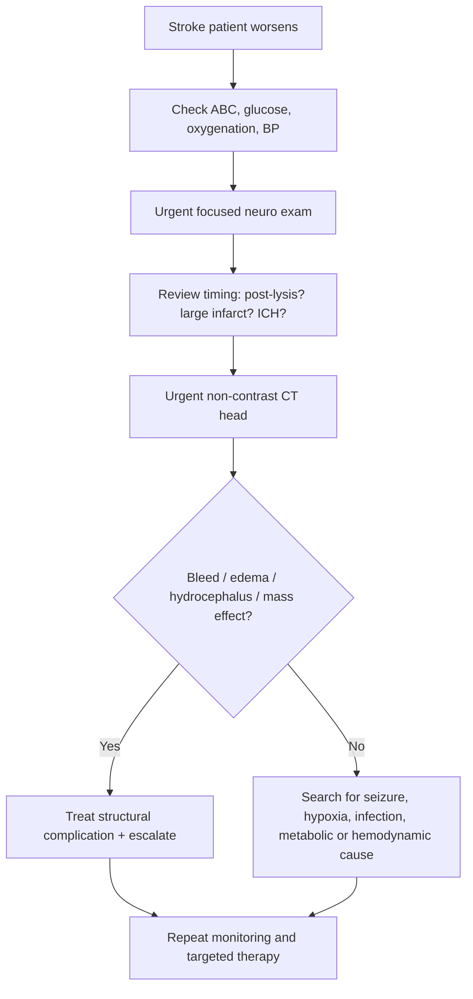
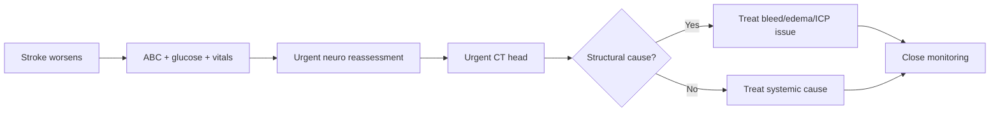

# Early neurological deterioration after stroke

Related: [[../Stroke Medicine MOC|Stroke Medicine MOC]] · [[../Stroke Unit Care and Complications|Stroke Unit Care and Complications]] · [[Malignant stroke and deterioration|Malignant stroke and deterioration]] · [[Cerebral oedema and raised intracranial pressure in stroke]] · [[Hemorrhagic transformation warning signs]] · [[Malignant middle cerebral artery infarction]] · [[../Reperfusion Therapy/Post-thrombolysis monitoring and BP targets|Post-thrombolysis monitoring and BP targets]]

> [!important]
> **Early neurological deterioration (END)** after stroke is a stroke-unit emergency. The exam rule is: **any worsening deficit, reduced consciousness, or new physiological instability demands urgent reassessment, repeat brain imaging, and targeted treatment of the cause.**

## Learning Objectives
- Define early neurological deterioration after stroke.
- Recognize the common structural and non-structural causes.
- Apply an emergency bedside algorithm for worsening after stroke.
- Distinguish END from expected fluctuation or slow recovery.

## Definition
**Early neurological deterioration (END)** refers to clinically significant worsening of neurological status in the hours to days after acute stroke onset or admission, usually recognized by worsening focal deficit, falling level of consciousness, rising NIHSS, or new systemic instability caused by stroke progression or a treatable complication.

## Core Anatomy
- Deterioration may arise from extension of the infarct core, edema with mass effect, hemorrhagic transformation, recurrent occlusion, or new bleeding.
- Large hemispheric strokes, posterior fossa strokes, and hemorrhagic lesions are anatomically high risk.
- Brainstem involvement is especially dangerous because small changes may rapidly impair consciousness, respiration, and airway protection.

## Core Physiology
- Injured brain tissue is vulnerable to secondary insults.
- END may result from:
  - reduced cerebral perfusion
  - edema and raised ICP
  - hemorrhage into infarcted tissue
  - hypoxia, fever, glucose disturbance, or seizures
- The key physiological concept is that **stroke damage is dynamic**, not fixed at first presentation.

## Normal Values / Important Cut-offs
- There is no single universal number that defines END better than the clinical trend.
- Practical bedside triggers include:
  - worsening NIHSS
  - fall in GCS/alertness
  - new headache/vomiting
  - new weakness, aphasia, gaze deviation, or pupillary change
- Any post-thrombolysis deterioration should be treated as a potential intracranial bleed until excluded.

## Classification
### By cause
1. **Stroke progression / infarct extension**
2. **Cerebral edema / raised ICP**
3. **Hemorrhagic transformation / new hemorrhage**
4. **Re-occlusion or failed reperfusion**
5. **Seizure / post-ictal change**
6. **Systemic/metabolic deterioration**

### By timing
- Hyperacute deterioration
- Early ward/stroke-unit deterioration within 24–72 hours
- Delayed early deterioration from complications such as infection, PE, or edema evolution

## Etiology / Causes
### Structural stroke-related causes
- Malignant edema after large infarct
- Hemorrhagic transformation
- Expansion of intracerebral hemorrhage
- Hydrocephalus
- Recurrent ischemia or re-occlusion
- Seizure with Todd paresis confusion

### Systemic / non-structural causes
- Hypoxia or aspiration pneumonia
- Hypoglycaemia or severe hyperglycaemia
- Hypotension or marked BP swings
- Fever or sepsis
- Electrolyte disturbance
- Pulmonary embolism
- Drug/sedative effect

## Risk Factors
- Large territorial infarct
- High initial NIHSS
- Reperfusion therapy
- Unstable BP after stroke
- Hyperglycaemia and fever
- Older frailty with multiple comorbidities
- Brainstem/cerebellar stroke
- ICH or anticoagulant-associated bleeding risk

## Pathophysiology
END represents the failure of initial stabilization due to evolving intracranial pathology or systemic complications. Ischemic brain tissue may progress because of ongoing vessel occlusion, edema, or impaired perfusion. Damaged microvasculature may bleed. Large lesions may cause mass effect and raised ICP. Even when the brain lesion is structurally unchanged, hypoxia, infection, glucose failure, hypotension, seizures, and arrhythmias can reduce neuronal function and produce new or worsening deficits.

## Clinical Features
### Neurological warning signs
- New or worsening hemiparesis
- Worsening aphasia or dysarthria
- Reduced consciousness
- New gaze deviation
- Pupillary asymmetry
- New ataxia or cranial nerve deficit

### General warning signs
- Headache and vomiting
- Desaturation
- Fever
- BP spike or profound hypotension
- Tachycardia, arrhythmia, chest symptoms
- Seizure activity or post-ictal unresponsiveness

## Approach / Algorithm

## Investigations
### Immediate investigations
- Bedside glucose
- Pulse oximetry
- Repeated BP and vital signs
- Focused neurological reassessment
- Urgent non-contrast CT head

### Additional investigations depending on cause
- CBC, electrolytes, creatinine
- Coagulation profile
- ABG if respiratory deterioration suspected
- ECG and rhythm monitoring
- Chest X-ray if aspiration/pneumonia suspected
- CTA/vascular imaging if re-occlusion or progression is suspected and it would change management

## Interpretation Frameworks
### First think: structural or systemic?
| Pattern | Likely direction |
|---|---|
| Headache, vomiting, falling GCS | Edema / hemorrhage / raised ICP |
| Deterioration after thrombolysis | Hemorrhagic complication until proven otherwise |
| Sudden desaturation and tachycardia | PE / aspiration / respiratory cause |
| Sweating, confusion, neuro worsening | Hypoglycaemia possibility |
| Witnessed jerking or transient unresponsiveness | Seizure / post-ictal state |

### Causes of END after stroke
| Cause | Bedside clue | Key action |
|---|---|---|
| Cerebral edema | Drowsiness, vomiting | Urgent CT + ICP-focused care |
| Hemorrhagic transformation | New worsening after ischemic stroke | Urgent CT + hold bleed-promoting drugs |
| ICH expansion | Worsening consciousness in hemorrhagic stroke | Urgent CT + BP/neurocritical escalation |
| Re-occlusion / progression | New focal worsening without clear bleed | Reassess vascular status if relevant |
| Hypoxia / aspiration | Desaturation, chest findings | Oxygen + airway/respiratory management |
| Glucose disturbance | Abnormal bedside glucose | Correct immediately |

## Diagnosis
END is a **clinical syndrome of worsening** rather than a single pathology. Diagnosis means:
1. confirming that neurological status has worsened, and
2. rapidly identifying the underlying cause.

## Differential Diagnosis
- Cerebral edema and raised ICP
- Hemorrhagic transformation
- Recurrent stroke or re-occlusion
- Seizure / post-ictal deficit
- Hypoglycaemia
- Aspiration pneumonia / hypoxia
- Pulmonary embolism
- Sedative or metabolic encephalopathy

## Tables / Comparison Charts
### Structural vs systemic causes
| Feature | Structural cause more likely | Systemic cause more likely |
|---|---|---|
| New headache/vomiting | Yes | Less typical |
| Pupillary change | Yes | Rare |
| Focal worsening alone | Often | Sometimes |
| Fever / respiratory symptoms | Less typical | Yes |
| Abnormal glucose | Possible but non-specific | Strong clue |
| Chest signs / hypoxia | No | Yes |

### Immediate END bundle
| Step | Why |
|---|---|
| ABC check | Deterioration may threaten airway and perfusion |
| Bedside glucose | Reversible mimic / contributor |
| Repeat vitals and BP | Hemodynamic instability may cause worsening |
| Urgent CT head | Excludes bleed/edema/hydrocephalus |
| Targeted labs and cardiorespiratory review | Finds systemic causes |

## Management
### First-line emergency response
- Recognize the worsening immediately.
- Call senior stroke help early.
- Perform ABC assessment.
- Check glucose at bedside.
- Correct hypoxia and hemodynamic instability.
- Arrange urgent CT head.

### Cause-specific treatment
- **Edema / raised ICP:** head up, airway support, neurocritical escalation, consider osmotherapy.
- **Hemorrhagic transformation / bleed:** hold antithrombotics, control BP, follow hemorrhage pathway.
- **Re-occlusion / progression:** reassess vascular and reperfusion options where appropriate.
- **Seizure:** treat seizure and reassess baseline afterward.
- **Hypoglycaemia / metabolic issue:** correct immediately.
- **Aspiration / infection / PE:** treat respiratory and systemic complication urgently.

### Ongoing stroke-unit care
- Frequent neuro observations
- Repeat imaging if further deterioration occurs
- Avoid delays caused by assuming deterioration is “expected”
- Document trends clearly for continuity

## Drug Interactions / Contraindications / Comorbidity Cautions
- Sedatives may mask END.
- Overaggressive antihypertensives can worsen perfusion in ischemic stroke.
- Antithrombotics may worsen bleeding if END is hemorrhagic.
- Insulin overcorrection can cause hypoglycaemia and mimic deterioration.
- Oxygen should be titrated when chronic CO2 retention is relevant.

## Procedures / Indications / Contraindications
### Urgent CT head
- **Indication:** any significant neurological worsening after stroke.
- **Principle:** do not delay structural reassessment.

### Higher-level monitoring / ICU referral
- Reduced consciousness
- Airway compromise
- Refractory physiological instability
- Raised ICP / herniation concern

## Procedure Mini-Sections
### Emergency reassessment bundle
- **Indication:** stroke patient worsens.
- **Preparation:** urgent bedside review and monitoring.
- **Principle:** stabilize first, then identify structural vs systemic cause.
- **Complication of delay:** missed treatable deterioration.
- **Viva pearl:** END is never a diagnosis to “observe overnight” without active reassessment.

## Complications
- Permanent infarct expansion
- Herniation or coma
- Symptomatic intracranial hemorrhage
- Missed treatable systemic cause
- Higher disability and mortality

## Red Flags / Emergencies
> [!warning]
> Urgently escalate if there is:
> - falling GCS or increasing drowsiness
> - new headache/vomiting after stroke
> - new anisocoria or brainstem signs
> - deterioration after thrombolysis
> - sudden hypoxia, chest pain, or circulatory instability

## Prognosis
END worsens functional outcome and mortality. Prognosis depends heavily on how quickly the cause is identified and reversed. Missed END is often more harmful than the original stable stroke deficit.

## Topic Correlation
- [[Cerebral oedema and raised intracranial pressure in stroke]]
- [[Hemorrhagic transformation warning signs]]
- [[Malignant middle cerebral artery infarction]]
- [[Aspiration pneumonia after stroke]]
- [[Glucose, oxygen, and temperature control in stroke]]
- [[../Reperfusion Therapy/Symptomatic intracranial haemorrhage after reperfusion|Symptomatic intracranial haemorrhage after reperfusion]]

## Special Situations
### Post-thrombolysis patient
- Any worsening should be treated as a possible symptomatic intracranial hemorrhage until excluded.

### Posterior circulation stroke
- Small changes may represent dangerous brainstem progression.

### Frail elderly patient
- END may present subtly through drowsiness, delirium, or reduced participation rather than dramatic new weakness.

## FCPS/MRCP High-Yield Points
- END is a **stroke-unit emergency**.
- The first question is: **structural complication or systemic complication?**
- **Urgent CT head** is central in significant worsening.
- Always check **glucose, oxygenation, and BP** immediately.
- Post-lysis deterioration = bleed until proven otherwise.

## Common Viva Questions
- What is early neurological deterioration after stroke?
- What are its common causes?
- What bedside steps come first?
- Why is CT head urgent?
- How do you distinguish structural from systemic causes?

## Common Confusions / Exam Traps
- Assuming deterioration is just “stroke progression” without evaluation.
- Forgetting hypoglycaemia, infection, aspiration, or PE.
- Missing hemorrhagic transformation after reperfusion therapy.
- Delaying CT while only repeating neuro exams.

## Mnemonics
### END mnemonic: **WORSEN**
- **W**orsening deficit noticed
- **O**xygen, ABC, vitals
- **R**echeck glucose
- **S**can brain urgently
- **E**valuate edema/bleed/seizure/systemic causes
- **N**otify seniors and treat cause

## Mind Map
- Early neurological deterioration
  - structural
    - edema
    - hemorrhagic transformation
    - ICH expansion
    - re-occlusion
  - systemic
    - hypoxia
    - hypoglycaemia
    - infection
    - PE
    - hypotension
  - response
    - ABC
    - glucose
    - vitals
    - urgent CT
    - targeted treatment

## Flowchart

## Suggested Visuals / Image Notes
- Stroke-unit END checklist.
- Table of structural vs systemic causes of deterioration.
- CT examples of edema vs hemorrhagic transformation.

## Suggested Video References
- Neurological deterioration after stroke: emergency approach
- Post-thrombolysis complication recognition
- Stroke-unit monitoring and red flags

## One-Page Revision Summary
### Early neurological deterioration after stroke
- END = significant worsening in the hours to days after stroke.
- Causes:
  - edema / raised ICP
  - hemorrhagic transformation or ICH expansion
  - re-occlusion or stroke progression
  - seizure
  - hypoxia / aspiration / PE
  - glucose or metabolic problems
- Immediate steps:
  - ABC
  - bedside glucose
  - oxygenation/BP review
  - urgent focused neuro exam
  - urgent CT head
- Post-thrombolysis deterioration should be treated as possible intracranial bleed until excluded.
- Never assume worsening is expected without investigation.

## 24-Hour Recall Prompts
- Define END.
- Name 5 causes of END.
- What bedside tests come first?
- When is CT head urgent?
- Why must hypoglycaemia always be checked?

## 7-Day / 15-Day / 30-Day Revision Tracker
- **Day 7:** recall WORSEN mnemonic.
- **Day 15:** write the END bedside algorithm from memory.
- **Day 30:** compare END due to edema, bleed, and systemic hypoxia.

## Must Know / Should Know / Nice to Know
### Must Know
- END is an emergency
- Check ABC, glucose, vitals immediately
- Get urgent CT head
- Consider both structural and systemic causes

### Should Know
- Common post-lysis deterioration logic
- High-risk stroke patterns such as large MCA and posterior fossa strokes
- Seizure and PE as mimic/alternative causes

### Nice to Know
- Detailed NIHSS-based research definitions
- Advanced perfusion-based re-occlusion assessment pathways

## My Weak Points
- Do I remember to think beyond brain imaging and check glucose/oxygenation?
- Do I over-assume worsening equals edema only?
- Can I list structural and systemic causes separately?

## Self-Test Scorecard
- Cause recall: /10
- Emergency response sequencing: /10
- CT decision confidence: /10
- Red-flag recognition: /10
- Viva confidence: /10

## Exam Answer Modes
### Short note frame
- Definition
- Causes
- Clinical features
- Investigations
- Management
- Red flags

### Viva frame
- “Any worsening after stroke is early neurological deterioration until proven otherwise. I would immediately reassess ABC, check glucose and vitals, perform a focused neuro exam, obtain urgent CT head, and then treat the specific structural or systemic cause.”

## Summary
Early neurological deterioration after stroke is a practical stroke-unit emergency syndrome. The key to exam success is a disciplined response: stabilize, scan, search for the cause, and treat rapidly before reversible worsening becomes permanent disability.

## MCQs (10)
1. Early neurological deterioration after stroke most importantly means:
   A. Any slow long-term disability only
   B. Significant worsening in the hours to days after stroke
   C. Only improvement after lysis
   D. A psychiatric diagnosis

2. Which is the best immediate bedside check in any worsening stroke patient?
   A. Hair color
   B. Blood glucose
   C. Shoe size
   D. Skin biopsy

3. A patient worsens after thrombolysis. What must be excluded urgently?
   A. Cataract
   B. Intracranial bleeding complication
   C. Osteoarthritis
   D. Otitis media

4. Which is a structural cause of END?
   A. Hemorrhagic transformation
   B. Dry skin
   C. Myopia
   D. Gingivitis

5. Which is a systemic cause of END?
   A. Hypoxia
   B. Knee osteoarthritis
   C. Alopecia
   D. Dental caries

6. The key imaging test in significant END is:
   A. CT head
   B. Abdominal ultrasound
   C. Knee X-ray
   D. Thyroid scan

7. Which red flag most strongly suggests raised ICP as a cause of END?
   A. New vomiting and drowsiness
   B. Stable appetite
   C. Improved speech
   D. Mild rash

8. Which statement is true?
   A. All END is due to edema only
   B. END may be due to structural or systemic causes
   C. CT is never required if weakness was already present
   D. Glucose is irrelevant after stroke diagnosis

9. A sudden desaturation with tachycardia after stroke should raise concern for:
   A. PE or aspiration-related complication
   B. Migraine only
   C. Tendinitis
   D. Psoriasis flare

10. Best summary?
   A. END should trigger urgent reassessment and cause-directed treatment
   B. END is expected and usually ignored
   C. CT head is optional in severe worsening
   D. Only neurologic signs matter, not physiology

## SBA Questions (10)
1. A 68-year-old man with ischemic stroke becomes newly drowsy and vomits 24 hours after admission. Best next step?
   A. Observe until the next routine review
   B. ABC reassessment, glucose check, and urgent CT head
   C. Start oral feeding
   D. Discharge if BP is normal

2. A patient receives alteplase and 3 hours later develops worse weakness and headache. Most important immediate concern?
   A. Depression
   B. Symptomatic intracranial hemorrhage
   C. Vitamin deficiency
   D. Chronic neuropathy

3. Which patient most fits END from a systemic cause?
   A. Stroke patient with worsening deficit and glucose 2.1 mmol/L
   B. Stroke patient with clear CT and stable vitals only
   C. Stroke patient with healed fracture
   D. Stroke patient with mild dandruff

4. A patient with large MCA infarct becomes progressively drowsy over 48 hours. One likely cause is:
   A. Malignant edema
   B. Simple constipation only
   C. Cataract progression
   D. Chronic eczema

5. Why is glucose checked immediately in END?
   A. It is a reversible contributor and mimic of neurological worsening
   B. It confirms stroke subtype directly
   C. It replaces brain imaging
   D. It prevents pneumonia

6. A stroke patient worsens and CT shows no new bleed or edema. Best next principle?
   A. Stop looking for causes
   B. Assess for hypoxia, seizure, infection, PE, metabolic and hemodynamic problems
   C. Diagnose malingering
   D. Restart every drug immediately

7. Which feature most strongly suggests structural intracranial worsening rather than purely systemic illness?
   A. Pupillary asymmetry
   B. Stable oxygen saturation
   C. Normal glucose
   D. No headache

8. What is the value of urgent CT in END?
   A. It helps identify bleed, edema, hydrocephalus, or mass effect
   B. It treats the stroke directly
   C. It replaces neurological examination
   D. It is only for discharge planning

9. Which combination is most consistent with END from respiratory/systemic causes?
   A. Desaturation, fever, chest findings
   B. Dry mouth only
   C. Hair thinning only
   D. Isolated long-standing backache

10. Best overall summary?
   A. END is an emergency syndrome requiring stabilization, urgent reassessment, imaging, and targeted treatment
   B. END always means recurrent stroke only
   C. END never has reversible causes
   D. END should wait for morning rounds

## Flashcards
- Q: What does END stand for in stroke care?
  A: Early neurological deterioration.
- Q: Name 3 structural causes of END.
  A: Cerebral edema, hemorrhagic transformation, ICH expansion, hydrocephalus, re-occlusion.
- Q: Name 3 systemic causes of END.
  A: Hypoxia, hypoglycaemia, infection/sepsis, PE, hypotension, seizure-related change.
- Q: What bedside test must be checked immediately?
  A: Blood glucose.
- Q: What imaging is central in significant END?
  A: Urgent non-contrast CT head.
- Q: What should post-thrombolysis deterioration be treated as until excluded?
  A: Possible intracranial hemorrhagic complication.
- Q: Why is END dangerous?
  A: It often reflects reversible but time-critical complications that worsen disability and mortality.
- Q: What does new vomiting and drowsiness after stroke suggest?
  A: Possible edema, raised ICP, or hemorrhagic complication.
- Q: What is the first management priority in END?
  A: ABC stabilization and urgent reassessment.
- Q: What major conceptual split helps organize causes of END?
  A: Structural intracranial causes vs systemic/non-structural causes.

## Answer Key with Explanations
### MCQs
1. **B** — END is clinically significant worsening in the early stroke period.
2. **B** — Glucose is a key rapid reversible cause/contributor.
3. **B** — Post-lysis deterioration must trigger urgent bleeding evaluation.
4. **A** — Hemorrhagic transformation is a classic structural cause.
5. **A** — Hypoxia is a major systemic cause of worsening.
6. **A** — CT head is the key structural reassessment tool.
7. **A** — Vomiting with drowsiness suggests edema/raised ICP or bleed.
8. **B** — END has both intracranial and systemic differentials.
9. **A** — These are classic PE/aspiration-type warning features.
10. **A** — This is the core stroke-unit principle.

### SBAs
1. **B** — This is the correct emergency sequence for worsening after stroke.
2. **B** — Symptomatic intracranial bleeding must be excluded urgently.
3. **A** — Severe hypoglycaemia can directly worsen or mimic stroke deficits.
4. **A** — Progressive drowsiness after a large MCA infarct is classic malignant edema concern.
5. **A** — Glucose correction may rapidly reverse part of the deterioration.
6. **B** — A normal CT does not exclude important systemic or seizure-related causes.
7. **A** — Pupillary change strongly suggests structural intracranial deterioration.
8. **A** — CT is essential for detecting the major structural complications.
9. **A** — This cluster suggests respiratory/systemic deterioration.
10. **A** — END requires urgent, organized, cause-directed action.

## PasTest Scenario SBAs (Clinical Vignettes)

> **Auto-generated PasTest/Mediscope-style scenario SBAs** grounded in the authored source. Each scenario tests a real clinical fact (triad, specific sign, contraindication, trial, first-line Rx) extracted from the topic. *Source: Ch 27: Neurology & Stroke — Early neurological deterioration after stroke*

**Q1.** What is the most appropriate first-line therapy for Early neurological deterioration after stroke?

  - **A.** Seizure:
  - **B.** An advanced/surgical therapy reserved for refractory disease
  - **C.** Symptomatic treatment only, no disease-modifying therapy
  - **D.** Empiric broad-spectrum therapy without specific indication

  > **Answer: A** — Seizure:
  >
  > *Source:* **Seizure:** treat seizure and reassess baseline afterward.

