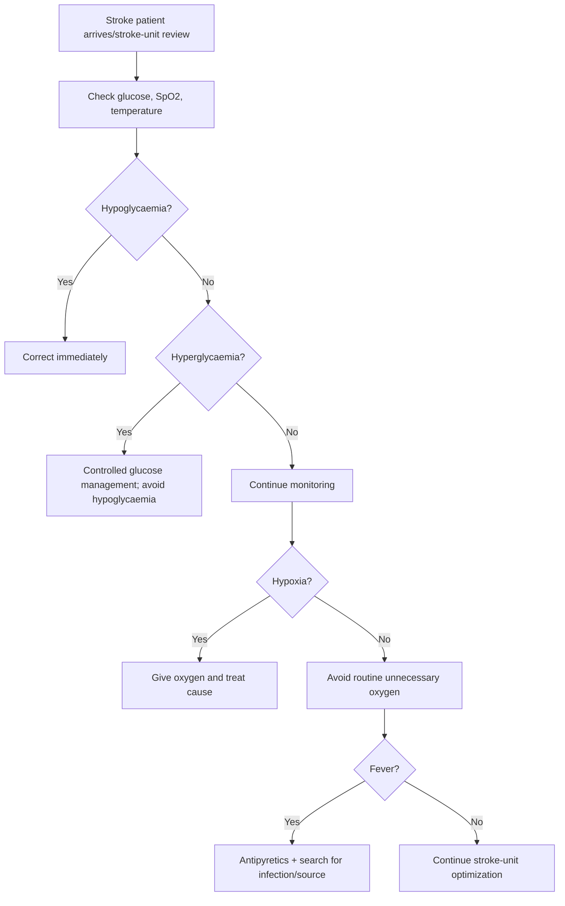
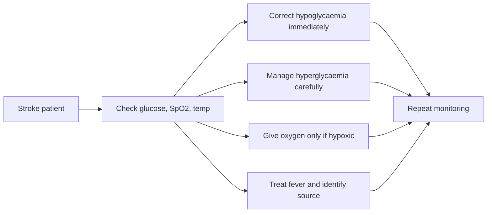

# Glucose, oxygen, and temperature control in stroke

Related: [[../Stroke Medicine MOC|Stroke Medicine MOC]] · [[../Stroke Unit Care and Complications|Stroke Unit Care and Complications]] · [[Physiological optimization|Physiological optimization]] · [[Blood pressure management in acute ischaemic stroke]] · [[Blood pressure management in intracerebral haemorrhage]]

> [!important]
> Stroke-unit care is not only imaging and reperfusion. **Hyperglycaemia, hypoglycaemia, hypoxia, and fever all worsen brain injury**. These are highly testable supportive-care domains because correcting them improves outcomes and prevents avoidable deterioration.

## Learning Objectives
- Explain why glucose, oxygenation, and temperature strongly influence stroke outcome.
- Recognize practical correction thresholds and bedside priorities.
- Distinguish harmful extremes from routine over-treatment.
- Outline complications, red flags, and exam traps.

## Definition
**Glucose, oxygen, and temperature control in stroke** refers to stroke-unit optimization of metabolic and physiological variables that influence secondary brain injury in both ischaemic and haemorrhagic stroke.

## Core Anatomy
- Infarct core and penumbra are metabolically fragile.
- Injured brain tissue has impaired energy reserve and is vulnerable to additional stressors.
- Brain edema, hemorrhage, aspiration, and immobility can worsen oxygenation and systemic instability.

## Core Physiology
- **Hypoxia** worsens neuronal injury by reducing oxygen delivery.
- **Hyperglycaemia** increases lactate production, oxidative stress, blood-brain barrier injury, and worse ischemic outcome.
- **Hypoglycaemia** can mimic stroke and also directly injure the brain.
- **Fever** increases metabolic demand, excitotoxicity, and infarct size.
- Therefore the aim is **normoxia, euglycaemia, and normothermia**, not routine excess oxygen or extreme glucose lowering.

## Normal Values / Important Cut-offs
- Check capillary/serum glucose early in all suspected stroke patients.
- **Hypoglycaemia** must be corrected immediately because it can mimic stroke and worsen injury.
- Persistent **hyperglycaemia** should be treated carefully; avoid both severe highs and iatrogenic lows.
- Give oxygen **if hypoxic**; routine oxygen in non-hypoxic stroke patients is usually unnecessary.
- Treat fever and search for its cause; even modest temperature elevation can worsen outcome.

## Classification
### Physiological optimization targets
1. Glucose control
2. Oxygenation and ventilation control
3. Temperature control

### Common disturbances
- Hypoglycaemia
- Hyperglycaemia
- Hypoxia from aspiration/pneumonia/heart failure
- Hypercapnia from respiratory failure
- Fever from aspiration pneumonia, UTI, sepsis, central fever

## Etiology / Causes
### Glucose disturbances
- Diabetes mellitus
- Stress hyperglycaemia
- Sepsis
- Steroid exposure
- Excess insulin/oral hypoglycaemic drugs
- Poor intake or prolonged fasting

### Oxygen disturbances
- Aspiration
- Pneumonia
- COPD/asthma or chronic lung disease
- Pulmonary edema/heart failure
- Reduced consciousness and airway compromise
- Pulmonary embolism

### Temperature elevation
- Aspiration pneumonia
- UTI
- Line-related infection
- Central fever
- Sepsis from any source

## Risk Factors for Physiological Deterioration
- Severe stroke with reduced consciousness
- Dysphagia and aspiration risk
- Diabetes mellitus
- Elderly/frail patients
- Stroke-unit delay
- Large infarct or ICH with edema
- Infection, immobility, or poor oral intake

## Pathophysiology
Brain tissue threatened by stroke is exceptionally vulnerable to systemic derangements. Hyperglycaemia worsens anaerobic metabolism and cellular injury. Hypoglycaemia deprives neurons of substrate and can produce focal deficits. Hypoxia lowers oxygen delivery to already ischemic tissue. Fever increases metabolic demand and may exacerbate edema and excitotoxic injury. These variables therefore act as **secondary hits** after the primary cerebrovascular insult.

## Clinical Features
### Glucose-related clues
- Altered mental status
- Sweating, tremor, tachycardia in hypoglycaemia
- Dehydration, osmotic symptoms, confusion in severe hyperglycaemia
- Worsening deficits unexplained by imaging progress

### Oxygen-related clues
- Low SpO2
- Tachypnea, cyanosis, respiratory distress
- Aspiration event or wet voice
- Reduced consciousness with poor airway protection
- Pulmonary crackles, wheeze, or pneumonia signs

### Temperature-related clues
- Fever
- Cough, sputum, dysuria, rigors
- New drowsiness or delirium
- Raised inflammatory markers or obvious infective source

## Approach / Algorithm

## Investigations
- Bedside capillary glucose / serum glucose
- HbA1c when relevant
- Pulse oximetry
- ABG if respiratory failure suspected
- CXR if aspiration/pneumonia suspected
- CBC, CRP, cultures when infection likely
- Urinalysis/urine culture if UTI suspected
- Serial temperature charting

## Interpretation Frameworks
### Glucose interpretation in stroke
| Pattern | Clinical significance |
|---|---|
| Low glucose | Stroke mimic + direct neuronal harm; fix immediately |
| Mild stress hyperglycaemia | Common, monitor and optimize |
| Marked persistent hyperglycaemia | Worse outcome, treat cautiously |
| Wide glucose fluctuations | Harmful; avoid overcorrection |

### Oxygen interpretation
| Scenario | Principle |
|---|---|
| SpO2 low | Give oxygen and identify cause |
| SpO2 normal, no distress | Routine oxygen not needed |
| Reduced consciousness | Think airway protection and aspiration risk |
| CO2 retention risk | Oxygen must be tailored; assess ventilation too |

### Fever interpretation
| Cause category | Examples |
|---|---|
| Infective | Aspiration pneumonia, UTI, sepsis |
| Non-infective | Central fever, inflammatory response |
| Treatment issue | Delayed swallow screen leading to aspiration |

## Diagnosis
This is a **supportive-care and complication-prevention domain** in stroke. Diagnosis depends on identifying whether the patient has:
- hypoglycaemia or hyperglycaemia
- hypoxia or respiratory compromise
- fever and an underlying source

## Differential Diagnosis
- Hypoglycaemia mimicking stroke
- Post-ictal state with metabolic derangement
- Sepsis-associated delirium with focal deficits
- Pulmonary embolism causing hypoxia and collapse
- Drug-induced reduced consciousness

## Tables / Comparison Charts
### Physiological targets and actions
| Variable | Problem | Immediate action |
|---|---|---|
| Glucose | Hypoglycaemia | Correct immediately |
| Glucose | Persistent hyperglycaemia | Controlled insulin strategy if needed; avoid hypoglycaemia |
| Oxygen | Hypoxia | Give oxygen + treat cause |
| Oxygen | Normal saturation | Do not give routine unnecessary oxygen |
| Temperature | Fever | Antipyretic + source search |

### Why each matters
| Variable | Why harmful in stroke |
|---|---|
| Hyperglycaemia | Increases infarct injury and poor outcomes |
| Hypoglycaemia | Mimics stroke and directly injures brain |
| Hypoxia | Worsens ischemia and secondary injury |
| Fever | Increases metabolic demand and tissue injury |

## Management
### Glucose control
- Check glucose immediately in all suspected stroke patients.
- Correct hypoglycaemia at once.
- Manage persistent significant hyperglycaemia with protocol-based insulin strategies if required.
- Avoid tight overcorrection causing hypoglycaemia.
- Consider HbA1c and diabetic review for longer-term planning.

### Oxygen control
- Give supplemental oxygen only if hypoxic or clinically indicated.
- Search for aspiration, pneumonia, pulmonary edema, PE, COPD exacerbation, or airway compromise.
- Position patient safely and manage secretions.
- Escalate respiratory support if needed.

### Temperature control
- Give paracetamol/acetaminophen and supportive measures for fever.
- Search for source, especially aspiration pneumonia and UTI.
- Prevent aspiration by early dysphagia screening.
- Treat infection promptly if present.

### General stroke-unit supportive measures
- Swallow screen before oral intake
- Early mobilization when appropriate
- DVT prevention
- Hydration and nutrition planning
- Regular observations and early escalation when trends worsen

## Drug Interactions / Contraindications / Comorbidity Cautions
- Insulin can cause dangerous hypoglycaemia if overused.
- Oxygen should be titrated in CO2 retainers/chronic respiratory disease.
- Sedatives can worsen airway protection and aspiration risk.
- Fever may be a marker of sepsis; do not treat temperature numerically while missing the source.
- Dextrose correction in severe hyperglycaemia must be balanced against overall metabolic context.

## Procedures / Indications / Contraindications
### When airway intervention may be needed
- Reduced consciousness
- Inability to protect airway
- Repeated aspiration
- Worsening respiratory failure

### Swallow screening
- Essential before oral intake unless already intubated/NBM pathway applies.

## Procedure Mini-Sections
### Bedside glucose correction concept
- **Indication:** documented hypoglycaemia.
- **Preparation:** confirm reading, check symptoms and IV access.
- **Principle:** restore glucose quickly and recheck.
- **Complication:** rebound hyperglycaemia if overtreated.
- **Viva pearl:** hypoglycaemia is one of the most important reversible stroke mimics.

### Oxygen escalation concept
- **Indication:** hypoxia or respiratory distress.
- **Preparation:** pulse oximetry ± ABG, airway assessment.
- **Principle:** restore oxygenation and treat the cause.
- **Complication:** failure to recognize ventilation problems in CO2 retainers.
- **Viva pearl:** normal saturations do not justify routine oxygen.

## Complications
- Larger infarct and worse outcome with untreated hyperglycaemia/hypoxia/fever
- Seizures or coma with severe glucose disturbance
- Aspiration pneumonia
- Delirium and prolonged admission
- Need for ICU/ventilatory support if respiratory failure evolves

## Red Flags / Emergencies
> [!warning]
> Escalate urgently if there is:
> - severe hypoglycaemia
> - persistent severe hyperglycaemia with dehydration or ketosis concerns
> - hypoxia with airway compromise
> - fever with reduced consciousness or sepsis features
> - sudden respiratory deterioration after oral intake

## Prognosis
Good supportive physiological control improves neurological recovery and reduces preventable complications. Poor control is associated with worse functional outcome, prolonged hospitalization, and higher mortality.

## Topic Correlation
- [[Blood pressure management in acute ischaemic stroke]]
- [[Blood pressure management in intracerebral haemorrhage]]
- [[Aspiration pneumonia after stroke]]
- [[../Stroke Recognition and Clinical Assessment/Dysphagia screening and aspiration risk|Dysphagia screening and aspiration risk]]
- [[../Recovery, Rehabilitation, and Prognosis/Persistent dysphagia and nutrition planning|Persistent dysphagia and nutrition planning]]

## Special Situations
### Diabetes mellitus
- Higher risk of stress hyperglycaemia and treatment-related hypoglycaemia.

### COPD / chronic hypercapnic respiratory failure
- Oxygen should be titrated carefully and ventilation assessed.

### Severe stroke with reduced consciousness
- Airway and aspiration risk may dominate.

### Infection-prone older patient
- Fever may be due to aspiration or UTI and can quickly worsen outcome.

## FCPS/MRCP High-Yield Points
- Check glucose in every suspected stroke because hypoglycaemia is a reversible mimic.
- Treat **hypoxia**, but avoid routine oxygen in non-hypoxic patients.
- Treat fever and search for the source.
- Hyperglycaemia worsens stroke outcome; control it without causing hypoglycaemia.
- Stroke-unit supportive care is highly examinable because it prevents deterioration.

## Common Viva Questions
- Why is glucose checked urgently in stroke?
- Should all stroke patients receive oxygen?
- Why does fever worsen stroke outcome?
- What are the common causes of hypoxia after stroke?
- How do you avoid insulin-related harm?

## Common Confusions / Exam Traps
- Giving oxygen routinely even when saturation is normal.
- Chasing very tight glucose control and causing hypoglycaemia.
- Treating fever without looking for aspiration pneumonia.
- Forgetting that glucose disturbance can mimic stroke.
- Missing airway risk in drowsy or dysphagic patients.

## Mnemonics
### Supportive stroke physiology mnemonic: **GOT IT**
- **G**lucose
- **O**xygen
- **T**emperature
- **I**nfection source search
- **T**rend monitoring

## Mind Map
- Stroke supportive care
  - glucose
    - hypo: correct now
    - hyper: control safely
  - oxygen
    - hypoxic: give oxygen
    - normoxic: no routine oxygen
  - temperature
    - fever: antipyretic + source search
  - causes
    - aspiration
    - pneumonia
    - UTI
    - diabetes

## Flowchart

## Suggested Visuals / Image Notes
- Stroke-unit supportive care checklist.
- Table: hypoglycaemia vs hyperglycaemia effects in stroke.
- Bedside algorithm for fever and hypoxia in stroke.

## Suggested Video References
- Stroke-unit supportive care essentials
- Hypoglycaemia as a stroke mimic
- Aspiration pneumonia prevention after stroke

## One-Page Revision Summary
### Glucose, oxygen, and temperature control in stroke
- Physiological optimization reduces secondary brain injury.
- **Glucose:**
  - check immediately
  - correct hypoglycaemia at once
  - manage hyperglycaemia carefully; avoid hypoglycaemia
- **Oxygen:**
  - give oxygen if hypoxic
  - routine oxygen is not needed in normoxic patients
  - search for aspiration, pneumonia, pulmonary edema, COPD flare
- **Temperature:**
  - fever worsens brain injury
  - give antipyretic and look for cause
  - aspiration pneumonia and UTI are common sources
- Supportive stroke-unit care is an outcome-changing intervention.

## 24-Hour Recall Prompts
- Why is hypoglycaemia a stroke mimic?
- Why is routine oxygen not always indicated?
- How does fever worsen stroke injury?
- Name 3 causes of hypoxia after stroke.
- What is the main insulin-related danger in stroke care?

## 7-Day / 15-Day / 30-Day Revision Tracker
- **Day 7:** recall GOT IT mnemonic and actions.
- **Day 15:** write the stroke-unit supportive care approach from memory.
- **Day 30:** compare hyperglycaemia, hypoxia, and fever as secondary brain insults.

## Must Know / Should Know / Nice to Know
### Must Know
- Correct hypoglycaemia immediately
- Treat hypoxia, not normal saturation
- Treat fever and search for source
- Hyperglycaemia worsens outcome

### Should Know
- Common causes of aspiration-related hypoxia
- Insulin overcorrection risks
- CO2 retainer oxygen cautions

### Nice to Know
- Detailed protocol thresholds for insulin infusion by institution
- Central fever differentiation nuances

## My Weak Points
- Do I remember that oxygen is not routine in normoxic stroke?
- Can I explain why fever matters biologically?
- Do I immediately think of aspiration pneumonia when fever/hypoxia occurs after stroke?

## Self-Test Scorecard
- Physiology understanding: /10
- Supportive-care recall: /10
- Complication recognition: /10
- Viva confidence: /10
- Bedside application: /10

## Exam Answer Modes
### Short note frame
- Definition
- Why each variable matters
- How to manage glucose
- Oxygen indications
- Fever treatment and source search
- Red flags

### Viva frame
- “In stroke we aim for euglycaemia, normoxia, and normothermia. Correct hypoglycaemia immediately, treat persistent significant hyperglycaemia carefully, give oxygen only if hypoxic, and treat fever while searching for aspiration or infection.”

## Summary
Glucose, oxygen, and temperature control are central stroke-unit interventions. They prevent secondary brain injury, reduce deterioration, and are highly relevant to FCPS/MRCP because they test the ability to combine pathophysiology with practical bedside care.

## MCQs (10)
1. Which glucose abnormality can mimic stroke and must be corrected immediately?
   A. Mild hypercholesterolaemia
   B. Hypoglycaemia
   C. Hyperuricaemia
   D. Hyperkalaemia

2. Hyperglycaemia in acute stroke is associated with:
   A. Better outcomes
   B. Worsened brain injury and poorer outcomes
   C. Guaranteed hemorrhage only
   D. No clinical effect

3. Routine oxygen is indicated in stroke when:
   A. All stroke patients arrive
   B. The patient is hypoxic or clinically requires it
   C. CT shows no bleed
   D. The patient has diabetes

4. Fever in stroke is harmful mainly because it:
   A. Decreases metabolism
   B. Increases metabolic demand and secondary injury
   C. Prevents aspiration
   D. Causes immediate carotid stenosis

5. A common cause of hypoxia after stroke is:
   A. Aspiration pneumonia
   B. Eczema
   C. Cataract
   D. Osteoarthritis

6. The major danger of aggressive insulin use in stroke is:
   A. Hypoglycaemia
   B. Hyperpigmentation
   C. Myopia
   D. Tendinitis

7. Which statement is true?
   A. All febrile stroke patients have meningitis
   B. Oxygen should be given to all stroke patients regardless of saturation
   C. Physiological optimization affects neurological outcome
   D. Glucose is unimportant in stroke

8. Which is a common source of fever after stroke?
   A. UTI
   B. Vitiligo
   C. Psoriasis
   D. Gout only

9. In a normoxic stroke patient, routine oxygen is usually:
   A. Essential
   B. Unnecessary
   C. Contraindicated because it always causes CO2 retention
   D. A substitute for swallow screening

10. Which triad is central to supportive physiological control in stroke?
   A. Glucose, oxygen, temperature
   B. Calcium, phosphate, magnesium
   C. Vision, hearing, smell
   D. Weight, height, BMI

## SBA Questions (10)
1. A 67-year-old man with acute stroke arrives confused and diaphoretic. Before imaging, bedside glucose is 2.1 mmol/L. Best next step?
   A. Ignore glucose and proceed directly to thrombolysis
   B. Correct hypoglycaemia immediately
   C. Start statin therapy
   D. Give routine oxygen only

2. A patient with acute ischaemic stroke has SpO2 97% on room air and no respiratory distress. Best oxygen approach?
   A. High-flow oxygen for all stroke patients
   B. No routine oxygen needed; continue monitoring
   C. Intubate immediately
   D. Oxygen only after MRI

3. A woman develops fever and a wet cough 24 hours after stroke. Most likely concern?
   A. Aspiration pneumonia
   B. Migraine aura
   C. Glaucoma
   D. Nephrolithiasis

4. A diabetic stroke patient has persistent marked hyperglycaemia. Best principle?
   A. Leave it untreated because only BP matters
   B. Manage glucose carefully while avoiding hypoglycaemia
   C. Stop all monitoring
   D. Give sugary drinks regardless of swallow risk

5. Why is fever treated in stroke?
   A. It improves speech directly
   B. It increases secondary brain injury and often signals infection
   C. It proves haemorrhage
   D. It prevents aspiration

6. A drowsy stroke patient with low saturation and gurgling secretions most needs:
   A. Reassurance only
   B. Airway/oxygen support and aspiration assessment
   C. Outpatient follow-up
   D. Cosmetic review

7. Which measure helps prevent aspiration-related hypoxia and fever?
   A. Immediate unrestricted oral feeding
   B. Early dysphagia screening before oral intake
   C. Avoiding all temperature checks
   D. Delaying nursing assessment

8. A trainee starts tight insulin control and the patient becomes sweaty and agitated. Main complication?
   A. Hypoglycaemia
   B. Hypernatraemia
   C. Otitis externa
   D. Appendicitis

9. Which statement best summarizes oxygen use in stroke?
   A. Oxygen is universal treatment regardless of saturation
   B. Oxygen is indicated when the patient is hypoxic or clinically needs it
   C. Oxygen is never used in stroke
   D. Oxygen replaces chest assessment

10. Best overall summary?
   A. Glucose, oxygen, and temperature are secondary details only
   B. Physiological optimization prevents secondary brain injury in stroke
   C. Temperature does not influence stroke outcome
   D. Hyperglycaemia is beneficial because it provides substrate

## Flashcards
- Q: Which glucose abnormality is a key reversible stroke mimic?
  A: Hypoglycaemia.
- Q: What is the main principle for oxygen in stroke?
  A: Give oxygen if hypoxic, not routinely to all normoxic patients.
- Q: Why is hyperglycaemia harmful in stroke?
  A: It worsens ischemic brain injury and poor outcomes.
- Q: Why is fever harmful in stroke?
  A: It increases metabolic demand and secondary neuronal injury.
- Q: Name 2 common causes of fever after stroke.
  A: Aspiration pneumonia and urinary tract infection.
- Q: What is the major risk of insulin overtreatment?
  A: Hypoglycaemia.
- Q: Which bedside test must be done early in suspected stroke?
  A: Glucose measurement.
- Q: What respiratory complication is common after dysphagic stroke?
  A: Aspiration pneumonia.
- Q: What physiological state is the goal regarding oxygen?
  A: Normoxia.
- Q: What physiological state is the goal regarding temperature?
  A: Normothermia.

## Answer Key with Explanations
### MCQs
1. **B** — Hypoglycaemia is both a stroke mimic and a brain injury emergency.
2. **B** — Hyperglycaemia worsens ischemic injury and correlates with poor outcomes.
3. **B** — Oxygen is indicated when hypoxia or another respiratory indication exists.
4. **B** — Fever raises metabolic demand and worsens secondary injury.
5. **A** — Aspiration pneumonia is a classic post-stroke cause of hypoxia.
6. **A** — Insulin overcorrection can cause dangerous hypoglycaemia.
7. **C** — Physiological optimization directly affects stroke outcome.
8. **A** — UTI is a common post-stroke source of fever.
9. **B** — Routine oxygen is not usually required in normoxic patients.
10. **A** — These three variables are central supportive-care targets.

### SBAs
1. **B** — Correcting glucose comes first because severe hypoglycaemia is an emergency and stroke mimic.
2. **B** — Normoxic stroke patients do not need routine oxygen.
3. **A** — Wet cough and fever after stroke strongly suggest aspiration pneumonia.
4. **B** — Hyperglycaemia should be managed, but hypoglycaemia must be avoided.
5. **B** — Fever worsens brain injury and often signals infection.
6. **B** — This patient likely has airway compromise/aspiration and needs urgent support.
7. **B** — Early swallow screening is key prevention.
8. **A** — Tight insulin control can easily cause hypoglycaemia.
9. **B** — Oxygen use in stroke is indication-based, not automatic.
10. **B** — This is the core principle of supportive physiological care.
