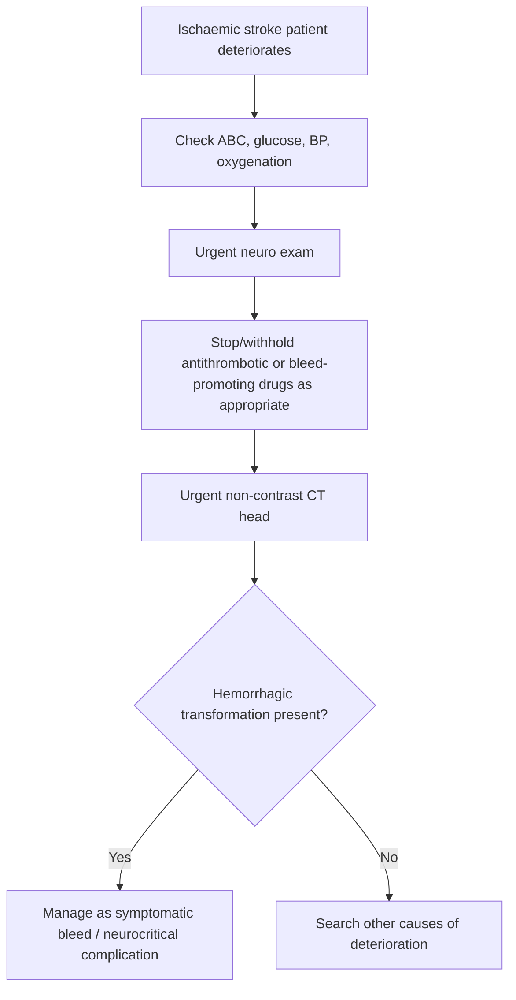
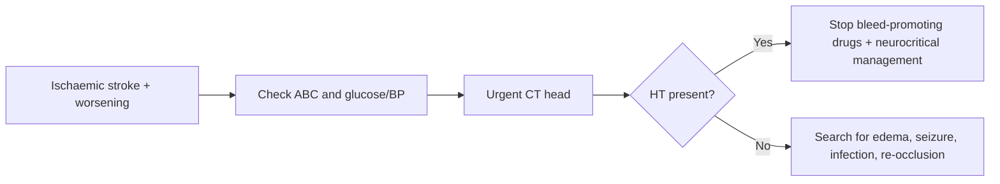

# Hemorrhagic transformation warning signs

Related: [[../Stroke Medicine MOC|Stroke Medicine MOC]] · [[../Stroke Unit Care and Complications|Stroke Unit Care and Complications]] · [[Malignant stroke and deterioration|Malignant stroke and deterioration]] · [[../Reperfusion Therapy/Symptomatic intracranial haemorrhage after reperfusion|Symptomatic intracranial haemorrhage after reperfusion]] · [[../Reperfusion Therapy/Post-thrombolysis monitoring and BP targets|Post-thrombolysis monitoring and BP targets]] · [[Cerebral oedema and raised intracranial pressure in stroke]]

> [!important]
> **Hemorrhagic transformation (HT)** is bleeding into an ischemic infarcted area. It may be petechial and clinically silent, or it may become **symptomatic intracranial hemorrhage** with rapid neurological decline. The exam focus is recognizing the warning pattern and getting urgent imaging.

## Learning Objectives
- Define hemorrhagic transformation and distinguish it from primary ICH.
- Recognize risk factors and warning signs after ischemic stroke.
- Outline urgent evaluation and management priorities.
- Explain how reperfusion therapy changes the risk and urgency.

## Definition
**Hemorrhagic transformation** is secondary bleeding within or around an area of cerebral infarction after acute ischemic stroke. It ranges from small petechial changes without major mass effect to confluent parenchymal hematoma associated with clinical deterioration.

## Core Anatomy
- The bleeding occurs within previously ischemic brain tissue.
- Large cortical infarcts, reperfused territories, and damaged microvasculature are especially vulnerable.
- The lesion may remain petechial or expand into a space-occupying hematoma.

## Core Physiology
- Ischemia damages the blood-brain barrier and microvascular integrity.
- Recanalization or reperfusion into injured tissue may permit blood extravasation.
- Large infarct core, severe edema, and high BP increase the risk of symptomatic bleeding.
- The clinically important distinction is whether HT is **radiological only** or **symptomatic**.

## Normal Values / Important Cut-offs
- There is no single bedside laboratory cut-off that diagnoses HT.
- The essential warning is **new neurological worsening**, especially with headache, vomiting, or reduced consciousness after ischemic stroke or reperfusion therapy.
- Follow-up imaging is crucial after thrombolysis before restarting antithrombotics.
- Large infarcts and very early anticoagulation/antithrombotic exposure increase caution.

## Classification
### Common conceptual classification
1. **Hemorrhagic infarction (HI)** — petechial bleeding without major mass effect
2. **Parenchymal hematoma (PH)** — denser confluent bleed with mass effect and worse prognosis

### Clinical classification
- Asymptomatic radiological HT
- Symptomatic hemorrhagic transformation

## Etiology / Causes
- Large ischemic infarct with blood-brain barrier injury
- Reperfusion after thrombolysis or thrombectomy
- Spontaneous recanalization into infarcted tissue
- Uncontrolled hypertension
- Early anticoagulation or coagulopathy
- Severe hyperglycaemia or extensive infarct core

## Risk Factors
- Large MCA or other territorial infarct
- High NIHSS/severe stroke
- Thrombolysis or reperfusion treatment
- Unstable post-treatment BP
- Cardioembolic stroke with large infarct burden
- Hyperglycaemia
- Advanced age and frailty
- Hemorrhagic propensity/coagulopathy

## Pathophysiology
Acute ischemia injures endothelial cells and disrupts the blood-brain barrier. Necrotic tissue and inflammatory activation make the infarct bed fragile. When reperfusion occurs—spontaneously or after therapy—blood leaks into damaged parenchyma. This may appear as minor petechial hemorrhage or expand into parenchymal hematoma, producing mass effect, rising ICP, and worsening outcome.

## Clinical Features
### Warning signs
- Sudden neurological worsening
- New severe headache
- Vomiting
- Falling GCS or increasing drowsiness
- New focal deficit after initial stabilization
- Acute BP spike after reperfusion

### Contextual clues
- Deterioration after alteplase/tenecteplase
- Large infarct on baseline imaging
- Delayed worsening in a patient with extensive edema

## Approach / Algorithm

## Investigations
- Urgent non-contrast CT head
- CBC and platelet count
- Coagulation profile
- Renal function if reversal or contrast decisions are relevant
- Repeat imaging depending on progression
- Review prior imaging to compare infarct size and reperfusion context

## Interpretation Frameworks
### How to suspect hemorrhagic transformation clinically
| Feature | Why suspicious |
|---|---|
| New neuro decline after ischemic stroke | Structural complication possible |
| Deterioration after thrombolysis | Symptomatic bleed must be excluded urgently |
| Large infarct + drowsiness + headache | HT or edema likely |
| BP spike after lysis | Increases bleed concern |

### HT vs primary ICH
| Feature | Hemorrhagic transformation | Primary ICH |
|---|---|---|
| Background | Follows ischemic infarct | Primary bleed event |
| Imaging context | Blood within infarcted territory | Hemorrhage as primary lesion |
| Triggers | Reperfusion, large infarct, coagulopathy | Hypertension, amyloid, structural lesions, etc. |
| Management overlap | Stop bleed-promoting drugs, neurocritical care | Similar hemodynamic/neurocritical principles |

## Diagnosis
Diagnosis requires:
- known or suspected ischemic infarct
- clinical worsening or follow-up imaging trigger
- CT/MRI evidence of hemorrhage within/around infarcted tissue

## Differential Diagnosis
- Cerebral edema with mass effect but no bleed
- Recurrent ischemic stroke/re-occlusion
- Post-ictal worsening
- Metabolic cause such as hypoglycaemia
- Aspiration/hypoxia-related deterioration

## Tables / Comparison Charts
### High-risk situations for HT
| Scenario | Why risky |
|---|---|
| Large territorial infarct | More tissue injury and BBB disruption |
| Thrombolysis | Reperfusion into fragile tissue |
| High BP after reperfusion | Promotes bleeding |
| Early anticoagulation | Increases hemorrhage risk |
| Hyperglycaemia | Worse endothelial and tissue injury |

### Immediate management priorities
| Priority | Reason |
|---|---|
| Urgent CT head | Confirms bleed |
| Stop/withhold antithrombotics | Avoids worsening hemorrhage |
| Control physiology (BP, oxygen, glucose) | Limits secondary injury |
| Neurocritical escalation | Needed if symptomatic or space-occupying |
| Consider reversal strategies when appropriate | Especially if anticoagulants involved |

## Management
### Immediate response
- ABC stabilization.
- Urgent neurological reassessment.
- Urgent non-contrast CT head.
- Stop or withhold antiplatelet/anticoagulant/bleed-promoting drugs until clarified.
- Control BP according to hemorrhagic-complication context.

### If symptomatic HT is confirmed
- Treat as an intracranial bleeding complication.
- Involve stroke senior/neurocritical care urgently.
- Consider reversal strategies if anticoagulants or fibrinolytic-related bleeding protocols apply.
- Monitor for mass effect, edema, and raised ICP.

### Supportive care
- Frequent neuro observations.
- Airway protection if consciousness falls.
- Repeat imaging if deterioration progresses.
- Avoid unnecessary invasive procedures.

## Drug Interactions / Contraindications / Comorbidity Cautions
- Recent thrombolysis or anticoagulation significantly changes bleed risk and management urgency.
- Antiplatelets/anticoagulants are usually withheld until the situation is reassessed.
- Uncontrolled BP worsens hemorrhagic risk.
- Sedation can mask clinical worsening.

## Procedures / Indications / Contraindications
### Indication for urgent imaging
- Any unexplained neurological worsening after ischemic stroke, especially after reperfusion.

### Reversal principle
- If the patient is anticoagulated or has therapy-related bleeding, follow the relevant reversal pathway promptly.

## Procedure Mini-Sections
### Emergency CT head concept
- **Indication:** new headache, vomiting, drowsiness, or neuro decline after ischemic stroke.
- **Preparation:** stabilize ABC and transport safely.
- **Principle:** confirm whether bleed, edema, or another complication is present.
- **Viva pearl:** do not try to diagnose HT clinically alone—image urgently.

### Reversal strategy concept
- **Indication:** clinically important HT in the setting of anticoagulants or thrombolytic-related bleeding protocols.
- **Preparation:** determine the agent, timing, and coagulation profile.
- **Complication of delay:** hematoma expansion and worse outcome.
- **Viva pearl:** reversal decisions are time-sensitive and drug-specific.

## Complications
- Symptomatic intracranial hemorrhage
- Mass effect and raised ICP
- Neurological worsening and disability
- Death in severe parenchymal hematoma
- Delay in restarting antithrombotic secondary prevention

## Red Flags / Emergencies
> [!warning]
> Treat urgently if there is:
> - deterioration after thrombolysis
> - new severe headache or vomiting after ischemic stroke
> - sudden drop in consciousness
> - large infarct with acute worsening
> - new blood seen within infarct territory on CT

## Prognosis
- Petechial asymptomatic transformation may have limited immediate impact.
- Symptomatic parenchymal hematoma has a much worse prognosis.
- Outcome depends on infarct size, hematoma burden, mass effect, and how rapidly the complication is recognized and treated.

## Topic Correlation
- [[../Reperfusion Therapy/Symptomatic intracranial haemorrhage after reperfusion|Symptomatic intracranial haemorrhage after reperfusion]]
- [[../Reperfusion Therapy/Post-thrombolysis monitoring and BP targets|Post-thrombolysis monitoring and BP targets]]
- [[Cerebral oedema and raised intracranial pressure in stroke]]
- [[Malignant middle cerebral artery infarction]]
- [[../Intracerebral Haemorrhage/Haemorrhagic transformation of infarct|Haemorrhagic transformation of infarct]]

## Special Situations
### Large cardioembolic infarct
- Often has high transformation risk because of large infarct burden and reperfusion dynamics.

### After thrombolysis/thrombectomy
- Even subtle worsening should prompt rapid evaluation.

### Need for anticoagulation later
- Timing of restart becomes complex and depends on the severity of transformation.

## FCPS/MRCP High-Yield Points
- Hemorrhagic transformation = bleeding into an infarct, not primary ICH.
- Think of it when an ischemic stroke patient **suddenly worsens**, especially after reperfusion therapy.
- **Urgent CT head** is the key next step.
- Stop/withhold bleed-promoting drugs and escalate if symptomatic.
- Large infarct, high BP, hyperglycaemia, and reperfusion therapy are classic risks.

## Common Viva Questions
- What is hemorrhagic transformation?
- How is it different from primary ICH?
- Which patients are high risk?
- What clinical change makes you suspect it?
- What is the first investigation?

## Common Confusions / Exam Traps
- Assuming all deterioration after infarct is edema only.
- Forgetting that petechial HT may be radiological, but symptomatic HT is an emergency.
- Continuing antithrombotics during unexplained deterioration.
- Delaying CT while “watching” the patient worsen.

## Mnemonics
### HT warning mnemonic: **BLEED**
- **B**ig infarct
- **L**ysis/reperfusion history
- **E**xam worsening
- **E**levated BP
- **D**o CT now

## Mind Map
- Hemorrhagic transformation
  - after ischemic stroke
  - risks
    - large infarct
    - reperfusion
    - BP high
    - anticoagulation
  - clues
    - headache
    - vomiting
    - drowsiness
    - neuro decline
  - action
    - urgent CT
    - stop antithrombotics
    - escalate

## Flowchart

## Suggested Visuals / Image Notes
- CT comparison: petechial HT vs parenchymal hematoma.
- Diagram showing reperfusion into injured infarct bed.
- Table: HT vs primary ICH.

## Suggested Video References
- Hemorrhagic transformation after ischemic stroke
- Post-thrombolysis complications
- CT interpretation of post-stroke deterioration

## One-Page Revision Summary
### Hemorrhagic transformation warning signs
- HT = bleeding into ischemic infarcted brain.
- Risk factors:
  - large infarct
  - thrombolysis/thrombectomy or reperfusion
  - high BP
  - hyperglycaemia
  - early anticoagulation/coagulopathy
- Warning signs:
  - sudden neuro worsening
  - headache
  - vomiting
  - drowsiness
  - deterioration after reperfusion therapy
- Action:
  - ABC
  - urgent CT head
  - stop/withhold antithrombotics
  - control physiology
  - escalate if symptomatic or space-occupying

## 24-Hour Recall Prompts
- Define hemorrhagic transformation.
- How is it different from primary ICH?
- Name 5 risk factors.
- What clinical change should trigger urgent CT?
- What immediate medication principle applies before clarification?

## 7-Day / 15-Day / 30-Day Revision Tracker
- **Day 7:** recall BLEED mnemonic.
- **Day 15:** compare HT vs edema-related deterioration.
- **Day 30:** give a viva answer on post-thrombolysis neurological worsening.

## Must Know / Should Know / Nice to Know
### Must Know
- New worsening after ischemic stroke may be HT
- Urgent CT is the key step
- Stop/withhold antithrombotics initially
- Large infarct and reperfusion are major risks

### Should Know
- HI vs PH concept
- Mass effect and raised ICP consequences
- Reversal-pathway importance

### Nice to Know
- Detailed radiological subclassification nuances
- Antithrombotic restart timing controversies

## My Weak Points
- Do I confuse HT with primary ICH?
- Do I remember to get CT urgently rather than wait?
- Do I remember the antithrombotic-hold principle?

## Self-Test Scorecard
- Risk-factor recall: /10
- Clinical recognition: /10
- Emergency management sequencing: /10
- CT interpretation confidence: /10
- Viva confidence: /10

## Exam Answer Modes
### Short note frame
- Definition
- Risk factors
- Warning signs
- Investigation
- Management

### Viva frame
- “Hemorrhagic transformation is secondary bleeding into an ischemic infarct, often after a large infarct or reperfusion therapy. I suspect it when the patient worsens with headache, vomiting, or reduced consciousness, and I would obtain an urgent CT head, stop antithrombotic therapy temporarily, and manage it as an intracranial bleeding complication if confirmed.”

## Summary
Hemorrhagic transformation is a major cause of post-stroke deterioration. The critical bedside rule is: if an ischemic stroke patient worsens, especially after reperfusion, think bleed, scan urgently, and stop anything that may worsen hemorrhage until clarified.

## MCQs (10)
1. Hemorrhagic transformation refers to:
   A. Primary spontaneous ICH
   B. Bleeding into an area of ischemic infarction
   C. SAH after trauma only
   D. Epidural hematoma

2. Which is a major risk factor for HT?
   A. Small stable lacune only
   B. Large territorial infarct
   C. Chronic sinusitis
   D. Cataract

3. Which clinical change most strongly suggests symptomatic HT?
   A. Improved alertness
   B. Sudden neurological worsening with headache/vomiting
   C. Stable mild weakness
   D. Dry skin only

4. The first investigation is usually:
   A. Urgent non-contrast CT head
   B. Colonoscopy
   C. Bone scan
   D. Audiometry

5. After thrombolysis, deterioration should make you think of:
   A. Only anxiety
   B. Symptomatic intracranial bleeding including HT
   C. Osteoporosis
   D. Chronic neuropathy

6. Which immediate medication principle is correct when significant HT is suspected?
   A. Start more anticoagulation
   B. Stop/withhold bleed-promoting drugs pending clarification
   C. Give oral contraceptives
   D. Increase antiplatelet dose

7. Which is the more dangerous form?
   A. Petechial HI without symptoms
   B. Parenchymal hematoma with clinical worsening
   C. Silent lacune
   D. Chronic infarct scar

8. Which factor increases HT risk after reperfusion?
   A. Controlled BP
   B. Unstable high BP
   C. Normal glucose
   D. Early mobility

9. Which statement is true?
   A. HT and primary ICH are identical concepts
   B. HT occurs within/around an infarcted area
   C. HT never occurs after thrombectomy
   D. CT is unnecessary if headache is mild

10. Best summary?
   A. Worsening after ischemic stroke should trigger urgent evaluation for HT
   B. HT is never symptomatic
   C. Large infarcts protect against bleed
   D. Antithrombotics should always be continued

## SBA Questions (10)
1. A 71-year-old man received alteplase for MCA stroke. Four hours later he develops headache, vomiting, and increasing drowsiness. Best next step?
   A. Reassure and observe
   B. Urgent CT head and treat as possible symptomatic hemorrhagic complication
   C. Start clopidogrel immediately
   D. Discharge if BP is normal

2. A patient with large cardioembolic infarct deteriorates on day 2 with new dense weakness and lower consciousness. One key differential is:
   A. Hemorrhagic transformation
   B. Psoriasis flare
   C. Carpal tunnel syndrome
   D. Cataract progression

3. Which radiological pattern is more likely to cause mass effect and poor outcome?
   A. Small petechial hemorrhagic infarction
   B. Parenchymal hematoma
   C. Old microbleed only
   D. Normal scan

4. Why does reperfusion increase HT risk?
   A. It strengthens the blood-brain barrier
   B. Blood enters fragile ischemic microvasculature
   C. It prevents edema completely
   D. It eliminates all hemorrhage risk

5. What should happen to antithrombotic medication when significant HT is suspected?
   A. Continue unchanged regardless
   B. Hold/withhold until reassessment and imaging clarification
   C. Double the dose
   D. Replace with antibiotics only

6. Which patient is highest risk for HT?
   A. Mild TIA patient with normal scan
   B. Large MCA infarct with thrombolysis and high BP
   C. Stable peripheral neuropathy patient
   D. Young healthy patient with tension headache

7. What is the most useful bedside trigger for urgent CT after ischemic stroke?
   A. Sudden neurological worsening
   B. Hair thinning
   C. Nail discoloration
   D. Constipation only

8. Which is the best conceptual distinction?
   A. HT is primary hypertensive bleed
   B. HT is secondary bleeding into infarcted tissue
   C. HT only occurs in venous stroke
   D. HT is always asymptomatic

9. A stroke patient worsens, but CT shows no new blood. What is the next principle?
   A. Stop thinking
   B. Consider edema, re-occlusion, seizure, infection, and metabolic causes
   C. Diagnose HT anyway
   D. Restart all drugs immediately

10. Best overall summary?
   A. New worsening after ischemic stroke, especially post-lysis, means CT now and antithrombotic caution
   B. HT is a minor radiology issue only
   C. Reperfusion never causes bleeding complications
   D. BP is irrelevant in HT risk

## Flashcards
- Q: What is hemorrhagic transformation?
  A: Secondary bleeding into or around an area of ischemic infarction.
- Q: Name 3 warning symptoms of symptomatic HT.
  A: Headache, vomiting, drowsiness, new neurological worsening.
- Q: What is the key first test?
  A: Urgent non-contrast CT head.
- Q: Name 4 major risk factors for HT.
  A: Large infarct, reperfusion therapy, high BP, hyperglycaemia, early anticoagulation/coagulopathy.
- Q: What is the immediate medication principle if significant HT is suspected?
  A: Stop or withhold bleed-promoting antithrombotic drugs pending reassessment.
- Q: Which form is worse: HI or PH?
  A: Parenchymal hematoma (PH).
- Q: Is HT the same as primary ICH?
  A: No.
- Q: Why does reperfusion promote HT?
  A: Fragile ischemic vessels leak when blood returns.
- Q: What major reperfusion-era complication overlaps with symptomatic HT?
  A: Symptomatic intracranial hemorrhage after reperfusion.
- Q: What should be considered if CT shows no hemorrhage despite worsening?
  A: Edema, re-occlusion, seizure, metabolic or respiratory causes.

## Answer Key with Explanations
### MCQs
1. **B** — HT is secondary bleeding into infarcted tissue.
2. **B** — Large territorial infarcts are classic high-risk lesions.
3. **B** — This pattern strongly suggests clinically important HT.
4. **A** — Urgent non-contrast CT is the first-line investigation.
5. **B** — Post-lysis deterioration must prompt urgent bleed exclusion.
6. **B** — Antithrombotics are usually held while urgent reassessment occurs.
7. **B** — Parenchymal hematoma is the more severe form.
8. **B** — High BP after reperfusion raises bleeding risk.
9. **B** — HT occurs within infarcted tissue, unlike primary ICH.
10. **A** — This is the key practical takeaway.

### SBAs
1. **B** — This is classic post-thrombolysis deterioration until proven otherwise.
2. **A** — HT is a major cause of worsening in large infarcts.
3. **B** — Confluent hematoma is the more dangerous subtype.
4. **B** — Reperfused fragile microvessels can leak blood.
5. **B** — Continuing antithrombotics blindly may worsen bleeding.
6. **B** — This is a classic high-risk combination.
7. **A** — Acute worsening is the main bedside trigger for CT.
8. **B** — That is the correct definition.
9. **B** — Worsening after stroke has multiple structural and non-structural causes.
10. **A** — This best summarizes the safe emergency approach.
