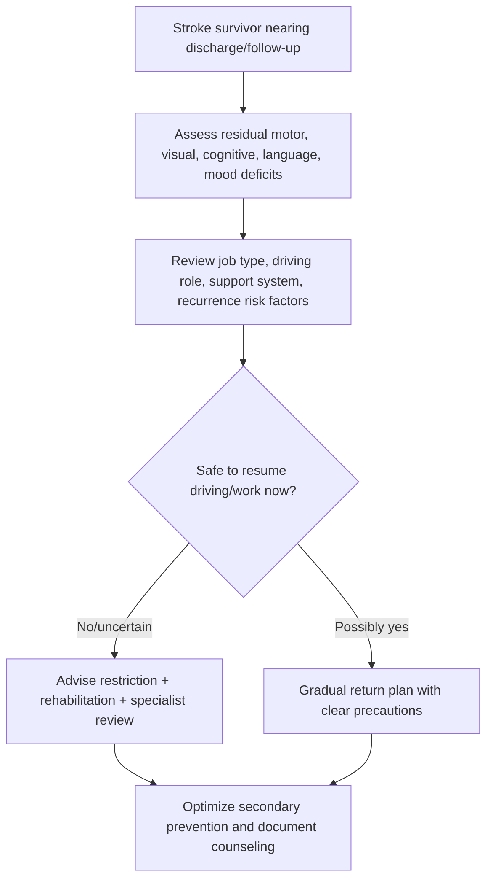

# Driving, work, and recurrence counseling after stroke

Related: [[../Stroke Medicine MOC|Stroke Medicine MOC]] · [[../Recovery, Rehabilitation, and Prognosis|Recovery, Rehabilitation, and Prognosis]] · [[Long-term outcomes|Long-term outcomes]] · [[Functional outcome prediction after stroke]] · [[Post-stroke depression and emotional change]] · [[Atrial fibrillation-related stroke prevention]]

> [!important]
> **Do not give generic reassurance after stroke about driving or work.** Fitness depends on neurological deficit, cognition, vision, seizure risk, recurrence risk, and local legal/occupational rules. The exam pearl is to combine **safety + function + secondary prevention + documentation**.

## Learning Objectives
- Explain why post-stroke counseling about driving, work, and recurrence matters.
- Identify clinical factors that affect fitness to drive and return to work.
- Outline a practical framework for counseling on recurrence prevention.
- Recognize high-risk situations needing specialist review.
- Deliver a structured discharge-oriented counseling plan.

## Definition
This topic covers the long-term counseling given after stroke regarding:
- **driving safety and legal fitness**
- **return to work and role resumption**
- **risk of recurrent stroke and prevention adherence**

It is a functional and safety-oriented counseling topic rather than an acute treatment topic.

## Core Anatomy
Fitness for driving and work after stroke depends on the integrity of systems commonly affected by cerebrovascular disease:
- **motor pathways** → steering, braking, transfers, balance
- **visual pathways** → visual fields, scanning, neglect
- **frontal-executive networks** → judgment, planning, attention
- **language networks** → communication and workplace function
- **cerebellar/brainstem systems** → coordination, eye movement, gait, swallowing, alertness

## Core Physiology
Safe driving and sustainable work require integrated:
- attention and reaction time
- visuospatial processing
- motor coordination
- decision-making
- endurance and emotional stability

After stroke, even mild residual deficits may significantly impair real-world performance. Recurrence counseling matters because ongoing vascular risk modifies both prognosis and safety.

## Normal Values / Important Cut-offs
- No patient should resume driving **automatically** after stroke without considering residual deficit and local rules.
- Persistent deficits that should trigger extra caution include:
  - visual field loss
  - neglect
  - cognitive impairment
  - uncontrolled seizures
  - marked weakness or poor coordination
- Return to work should consider:
  - physical demand
  - cognitive demand
  - communication requirement
  - safety-critical responsibility
- Recurrence counseling must cover:
  - BP control
  - antiplatelet/anticoagulant adherence where indicated
  - lipid lowering
  - diabetes control
  - smoking cessation
  - exercise, weight, diet

## Classification
### By counseling domain
- driving counseling
- vocational/work counseling
- recurrence prevention counseling

### By work demand
- sedentary low-risk work
- physically demanding work
- cognitively high-demand work
- safety-critical work (driver, pilot, machine operator, heights, heavy equipment)

### By recurrence risk context
- low residual disability, lower short-term practical limitation
- ongoing vascular risk / unstable control
- high-risk cardioembolic or severe carotid disease setting

## Etiology / Causes
The need for this counseling arises from residual effects of stroke such as:
- motor weakness
- incoordination
- visual field defects
- neglect
- aphasia
- executive dysfunction
- fatigue
- depression/anxiety
- seizure risk in selected cases

## Risk Factors
| Factor | Why it matters |
|---|---|
| Visual field loss / neglect | Major driving hazard |
| Executive dysfunction | Poor hazard judgment and attention |
| Residual hemiparesis | Affects control of vehicle and work safety |
| Post-stroke fatigue | Limits endurance and reliability |
| Depression/anxiety | Affects confidence, performance, adherence |
| Prior safety-critical occupation | Higher threshold for return |
| Poor BP / AF / diabetes control | Higher recurrence risk |
| Medication nonadherence | Avoidable recurrent events |

## Pathophysiology
Stroke leaves varying combinations of neurological, cognitive, emotional, and vascular risk burdens. These can impair practical functioning directly and also increase recurrence risk. Counseling therefore aims to reduce preventable harm, guide gradual reintegration, and align daily activities with residual ability.

## Clinical Features
### Issues relevant to driving
- visual neglect or field defect
- slowed reaction time
- limb weakness affecting steering/braking
- poor balance or transfers
- poor insight into deficits
- seizures in selected cases

### Issues relevant to work
- communication problems
- reduced attention or multitasking
- post-stroke fatigue
- emotional lability or depression
- impaired fine motor skill
- difficulty with previous workload or safety requirements

### Issues relevant to recurrence counseling
- smoking
- poorly controlled hypertension
- missed antithrombotics
- uncontrolled AF
- dyslipidemia
- obesity/inactivity
- recurrent TIA symptoms ignored by patient

## Approach / Algorithm

## Investigations
### Functional assessment
- neurological examination
- visual field assessment where relevant
- cognition / executive function screening
- occupational therapy assessment
- physiotherapy / gait and coordination review
- speech/language review if communication-heavy work

### Vascular follow-up
- BP monitoring
- lipid profile
- glucose/HbA1c where relevant
- rhythm assessment if AF issues remain relevant

## Interpretation Frameworks
### Driving fitness frame
1. Can the patient **see** safely?  
2. Can the patient **think and judge** safely?  
3. Can the patient **control the vehicle** safely?  
4. Is there seizure or sudden-incapacitation risk?  
5. Are legal/regulatory restrictions satisfied?

### Return-to-work frame
| Domain | Questions |
|---|---|
| Physical | Can the patient walk, transfer, use hands, tolerate hours? |
| Cognitive | Can they concentrate, plan, multitask, make safe decisions? |
| Communication | Can they speak, understand, write, interact as required? |
| Emotional | Is mood, stress tolerance, confidence acceptable? |
| Workplace risk | Are others endangered if deficits persist? |

## Diagnosis
This is a counseling and functional-capacity assessment. A chart statement may be:

> Stroke survivor with residual mild right-sided weakness and post-stroke fatigue; currently unfit for unrestricted driving and safety-critical work pending rehabilitation review and recurrent-risk optimization.

## Differential Diagnosis
- overconfidence despite unsafe residual deficits
- non-neurological fatigue causing apparent poor work tolerance
- anxiety-related refusal to resume activity despite adequate physical recovery
- depression reducing performance more than motor deficit itself

## Tables / Comparison Charts
### Driving red flags after stroke
| Red flag | Why important |
|---|---|
| Visual field defect | Missed hazards |
| Neglect | Failure to attend to one side |
| Poor insight | Unsafe self-judgment |
| Significant limb weakness | Reduced vehicle control |
| Cognitive slowing | Delayed reaction |
| Seizure history | Sudden loss of control risk |

### Return-to-work considerations
| Work type | Main concern |
|---|---|
| Desk work | concentration, fatigue, communication |
| Manual labor | strength, balance, endurance |
| Driver/operator | safety-critical reaction and judgment |
| Healthcare/teaching | communication, cognition, stamina |
| Heights/heavy machinery | catastrophic risk if deficit persists |

## Management
### Driving counseling
- advise no automatic return to driving
- assess residual neurological deficit and local regulations
- use OT/driving assessment where available
- document advice clearly

### Work counseling
- encourage graded return where appropriate
- consider occupational health input
- adjust hours, duties, commuting, and supervision
- prioritize safety over speed of return

### Recurrence counseling
- explain warning symptoms of recurrent TIA/stroke
- reinforce emergency response if symptoms recur
- optimize secondary prevention:
  - antiplatelet/anticoagulant adherence
  - BP control
  - statin adherence
  - diabetes control
  - smoking cessation
  - exercise and diet
  - sleep and weight management where relevant

## Drug Interactions / Contraindications / Comorbidity Cautions
- Sedatives and some psychotropics may worsen driving safety.
- Hypoglycemia risk in diabetics may affect driving/work safety.
- Anticoagulation improves recurrence prevention in AF but requires adherence and bleeding counseling.
- Post-stroke fatigue, depression, and sleep disorders may impair safe performance even when power improves.

## Procedures / Indications / Contraindications
- **Occupational therapy functional review**
  - indication: uncertain practical fitness for activities/work
- **Driving assessment service**
  - indication: residual deficits with desire to resume driving
- **Occupational health review**
  - indication: safety-critical or complex return-to-work cases

## Procedure Mini-Sections
### Graded return-to-work planning
- **Indication:** patient medically stable but not yet ready for full workload.
- **Principle:** phased hours and modified duties.
- **Pearl:** successful reintegration often depends more on pacing and job redesign than raw neurological recovery.

### Recurrence warning education
- **Indication:** all stroke survivors.
- **Principle:** teach FAST/BE-FAST and urgent re-presentation.
- **Pearl:** recurrence prevention counseling is incomplete if the patient does not know how to respond to new symptoms.

## Complications
- recurrent stroke from poor adherence
- road traffic accident if driving resumed unsafely
- workplace injury
- job loss from unrealistic return expectations
- depression/anxiety from poor counseling or abrupt role restriction

## Red Flags / Emergencies
- new TIA/stroke symptoms
- ongoing seizures or transient loss of consciousness
- severe visual neglect or unsafe judgment with intent to drive
- very high-risk occupation with unresolved deficits
- profound caregiver concern about patient safety insight

## Prognosis
- Many patients can return to selected driving or work roles after appropriate assessment and recovery.
- Safety-critical work often requires a higher standard of recovery than ordinary daily function.
- Good recurrence counseling improves long-term independence and reduces repeat events.

## Topic Correlation
- [[Functional outcome prediction after stroke]] informs long-term role reintegration.
- [[Post-stroke depression and emotional change]] affects confidence and return-to-work success.
- [[Atrial fibrillation-related stroke prevention]] relates directly to recurrence counseling.
- [[Hypertension management for secondary stroke prevention]] is central to avoiding another event.

## Special Situations
### Commercial/professional driver
- stricter safety threshold
- specialist/legal fitness guidance needed

### Safety-critical workplace
- machine operators, heights, public safety roles need careful formal review

### Aphasia or executive dysfunction
- communication or judgment deficits may dominate despite good motor recovery

### Young working-age survivor
- vocational identity and financial stress may be major counseling issues

## FCPS/MRCP High-Yield Points
- Driving advice after stroke must be individualized.
- Visual field loss, neglect, cognitive impairment, and seizures are major driving red flags.
- Return to work should be graded and role-specific.
- Recurrence counseling is part of stroke care, not an optional extra.
- Document restrictions and advice clearly.

## Common Viva Questions
- Which deficits make driving unsafe after stroke?
- How would you assess fitness to return to work?
- What secondary prevention points must be covered at discharge?
- Why is occupational health important in selected patients?
- How do you counsel a patient about recurrent warning symptoms?

## Common Confusions / Exam Traps
- Assuming independent walking means safe driving.
- Forgetting visual neglect and executive dysfunction.
- Giving vague work advice without considering job type.
- Ignoring medication side effects that impair alertness.
- Omitting recurrence warning education.

## Mnemonics
**DRIVE-WORK**
- **D**eficits residual?
- **R**egulations/local rules
- **I**nsight intact?
- **V**ision safe?
- **E**xecutive function adequate?
- **W**orkload type
- **O**ccupational risk
- **R**ecurrence prevention
- **K**now emergency symptoms

## Mind Map
- Driving, work, and recurrence counseling
  - driving
    - vision
    - cognition
    - motor control
    - legal fitness
  - work
    - physical demand
    - cognitive demand
    - communication
    - graded return
  - recurrence
    - BP
    - AF/antithrombotics
    - statin
    - diabetes
    - smoking

## Flowchart

## Suggested Visuals / Image Notes
- Table card: driving red flags after stroke
- Return-to-work framework chart
- Stroke recurrence prevention checklist for discharge

## Suggested Video References
- Stroke discharge counseling overview
- Occupational therapy return-to-driving assessment examples
- Secondary stroke prevention counseling teaching

## One-Page Revision Summary
- Driving and work advice after stroke must be individualized.
- Key driving risks: visual field loss, neglect, cognition, weakness, seizures, poor insight.
- Work return depends on physical, cognitive, communication, and safety demands.
- Use graded return and occupational health when needed.
- Recurrence counseling must cover medications, BP, diabetes, lipid, smoking, exercise, and emergency symptom recognition.

## 24-Hour Recall Prompts
- Name 5 driving red flags after stroke.
- What factors determine return-to-work readiness?
- Which secondary prevention points must you counsel on?
- Why can mild executive dysfunction make driving unsafe?
- How would you document a temporary driving restriction?

## 7-Day / 15-Day / 30-Day Revision Tracker
- **7 days:** reproduce the driving fitness frame from memory.
- **15 days:** compare return-to-work factors by job type.
- **30 days:** give a 2-minute discharge counseling viva on recurrence prevention.

## Must Know / Should Know / Nice to Know
### Must Know
- driving is not automatically safe after stroke
- assess vision, cognition, motor control, insight
- graded return to work
- recurrence prevention counseling

### Should Know
- occupational health / driving assessment role
- seizure and sedative cautions
- safety-critical occupation issues

### Nice to Know
- local legal licensing specifics
- advanced vocational rehab models

## My Weak Points
- Do I remember visual neglect as a driving risk?
- Do I tailor work advice to the job?
- Do I always include recurrence warning symptoms?

## Self-Test Scorecard
- Driving-risk recall /10
- Return-to-work framework /10
- Recurrence counseling recall /10
- Viva confidence /10
- Documentation confidence /10

## Exam Answer Modes
### Short note angle
Outline counseling after stroke on driving, work resumption, and recurrence prevention with emphasis on safety, residual deficits, and secondary prevention adherence.

### Viva angle
“I would assess residual motor, visual, cognitive, and language deficits; consider job and driving risk; restrict unsafe activity; plan graded return when appropriate; and reinforce recurrence prevention and urgent response to new symptoms.”

## Summary
Driving, work, and recurrence counseling after stroke is a core part of rehabilitation and secondary prevention. It requires a practical safety-based assessment of residual deficits, attention to occupational demands and legal fitness, and consistent education about preventing and recognizing recurrent stroke.

## MCQs (10)
1. Which deficit is a major red flag for driving after stroke?
   - A. Well-controlled BP
   - B. Visual neglect
   - C. Family support
   - D. Normal lipid profile
   - E. Mild sadness only
2. Return to work after stroke should primarily depend on:
   - A. Patient age alone
   - B. Physical, cognitive, communication, and job safety demands
   - C. CT scan age only
   - D. Family income only
   - E. Handedness only
3. Which is central to recurrence counseling?
   - A. Ignoring BP
   - B. Medication nonadherence
   - C. Secondary prevention adherence
   - D. Avoiding follow-up
   - E. Stopping all activity permanently
4. Which condition may make a professional driver unfit despite walking independently?
   - A. Visual field defect
   - B. Mild controlled hypertension
   - C. Good family support
   - D. Normal appetite
   - E. Normal speech
5. The best work return strategy after stroke is often:
   - A. Immediate full workload for all
   - B. Permanent unemployment for all
   - C. Graded return with role-specific modification
   - D. No documentation
   - E. Sedation for anxiety
6. Which symptom should prompt urgent re-presentation advice?
   - A. Old stable weakness
   - B. New focal neurological symptoms
   - C. Controlled cholesterol
   - D. Stable mood
   - E. Mild chronic fatigue only
7. Which factor may impair safe driving even with preserved power?
   - A. Executive dysfunction
   - B. Normal vision
   - C. Good insight
   - D. Good sleep
   - E. Low LDL
8. A key error is:
   - A. Documenting restrictions
   - B. Assessing occupation type
   - C. Assuming mobility alone proves driving fitness
   - D. Counseling on FAST/BE-FAST
   - E. Reviewing antithrombotic adherence
9. Which specialty input may help with complex return-to-work cases?
   - A. Occupational health
   - B. Dermatology only
   - C. Ophthalmology only in every case
   - D. Dentistry
   - E. ENT only
10. Which statement is most accurate?
   - A. Recurrence counseling is optional
   - B. Driving advice should be individualized after stroke
   - C. All desk workers return immediately
   - D. All stroke survivors must never work again
   - E. Vision does not matter for driving

## SBA Questions (10)
1. A 58-year-old bus driver recovers well physically after stroke but has a residual left visual field defect. Best advice?
   - A. Resume commercial driving immediately
   - B. Driving fitness is unsafe/uncertain and requires formal review with restriction meanwhile
   - C. Ignore visual defect if strength is normal
   - D. Return only at night
   - E. Stop all medication
2. A schoolteacher has mild aphasia and post-stroke fatigue. What is the best return-to-work principle?
   - A. Immediate full timetable
   - B. Graded return with communication and fatigue accommodations
   - C. Permanent work ban
   - D. No need to discuss work
   - E. Only physical strength matters
3. Which counseling element is essential before discharge after stroke?
   - A. Stop statin if asymptomatic
   - B. Recurrent symptom recognition and urgent response plan
   - C. Avoid exercise forever
   - D. Skip BP review
   - E. Ignore smoking
4. A patient insists he can drive because he walks independently, but family reports poor judgment and near-miss behavior. Best interpretation?
   - A. Walking proves driving safety
   - B. Cognitive/insight problems may still make driving unsafe
   - C. Family concern is irrelevant
   - D. Let him self-test on the road
   - E. Only seizures matter
5. Which patient is most likely to need occupational health involvement?
   - A. Retired person with no role demands
   - B. Machine operator returning to safety-critical work
   - C. Patient with normal function returning to casual home activity
   - D. Patient with no employment concerns
   - E. Visitor to clinic only
6. Why is recurrence counseling important even in a mildly disabled stroke survivor?
   - A. Mild stroke never recurs
   - B. Functional recovery does not remove vascular risk
   - C. Counseling has no effect on adherence
   - D. It only matters in hemorrhage
   - E. It replaces medication
7. A patient on sedating medication wants to resume driving. Best point?
   - A. Sedation is irrelevant
   - B. Sedating medication may impair driving fitness
   - C. Only BP matters
   - D. Only MRI matters
   - E. Driving at slow speed solves the problem
8. Which factor most strongly supports gradual rather than immediate return to work?
   - A. Post-stroke fatigue and reduced concentration
   - B. Perfect function
   - C. No residual symptoms
   - D. Job with no demands
   - E. Controlled lipids
9. A patient asks what to do if symptoms recur. Best answer?
   - A. Wait until next clinic visit
   - B. Seek urgent emergency assessment immediately
   - C. Stop all medication first
   - D. Sleep and reassess next week
   - E. Drive self to work to test function
10. Best overall summary?
   - A. Driving/work advice is generic and identical for all
   - B. Driving/work/recurrence counseling should be individualized, documented, and safety-based
   - C. Work matters more than recurrence prevention
   - D. Recurrence counseling is not part of stroke rehab
   - E. Depression never affects work return

## Flashcards
- Q: Name one major driving red flag after stroke.
  A: Visual neglect, visual field defect, or executive dysfunction.
- Q: What 4 domains determine work return?
  A: Physical, cognitive, communication, and workplace safety demands.
- Q: Why is recurrence counseling essential?
  A: Recovery does not remove vascular risk.
- Q: Which service may help assess driving fitness?
  A: Occupational therapy/driving assessment service.
- Q: What kind of work requires the highest threshold for return?
  A: Safety-critical work.
- Q: Which symptoms require urgent re-presentation?
  A: New focal neurological symptoms.
- Q: Does independent walking guarantee safe driving?
  A: No.
- Q: Name two recurrence-prevention pillars.
  A: BP control and antithrombotic/statin adherence.
- Q: How should many stroke survivors return to work?
  A: Gradually with adjustments.
- Q: What must be documented clearly?
  A: Restrictions, counseling, and follow-up plan.

## Answer Key with Explanations
### MCQs
1. **B** — Neglect is a major safety red flag.
2. **B** — Job return depends on multiple functional domains.
3. **C** — Secondary prevention adherence is essential.
4. **A** — Visual field defects can make driving unsafe despite good mobility.
5. **C** — Graded, role-specific return is often best.
6. **B** — New focal symptoms need urgent reassessment.
7. **A** — Executive dysfunction impairs hazard judgment.
8. **C** — Mobility alone does not prove fitness.
9. **A** — Occupational health is highly relevant for complex work return.
10. **B** — Advice must be individualized.

### SBAs
1. **B** — Commercial driving with visual field loss needs restriction and formal review.
2. **B** — Graded return with communication/fatigue adjustments is best.
3. **B** — Patients must know to seek urgent care for recurrence.
4. **B** — Insight/judgment issues can make driving unsafe.
5. **B** — Safety-critical jobs need occupational health review.
6. **B** — Vascular risk persists after functional recovery.
7. **B** — Sedation may impair safe driving.
8. **A** — Fatigue and concentration problems support phased return.
9. **B** — New symptoms require urgent assessment.
10. **B** — This counseling must be individualized and documented.

## PasTest Scenario SBAs (Clinical Vignettes)

> **Auto-generated PasTest/Mediscope-style scenario SBAs** grounded in the authored source. Each scenario tests a real clinical fact (triad, specific sign, contraindication, trial, first-line Rx) extracted from the topic. *Source: Ch 27: Neurology & Stroke — Driving, work, and recurrence counseling after stroke*

**Q1.** What is the most appropriate first-line therapy for Driving, work, and recurrence counseling after stroke?

  - **A.** use OT/driving assessment where available
  - **B.** An advanced/surgical therapy reserved for refractory disease
  - **C.** Symptomatic treatment only, no disease-modifying therapy
  - **D.** Empiric broad-spectrum therapy without specific indication

  > **Answer: A** — use OT/driving assessment where available
  >
  > *Source:* use OT/driving assessment where available

