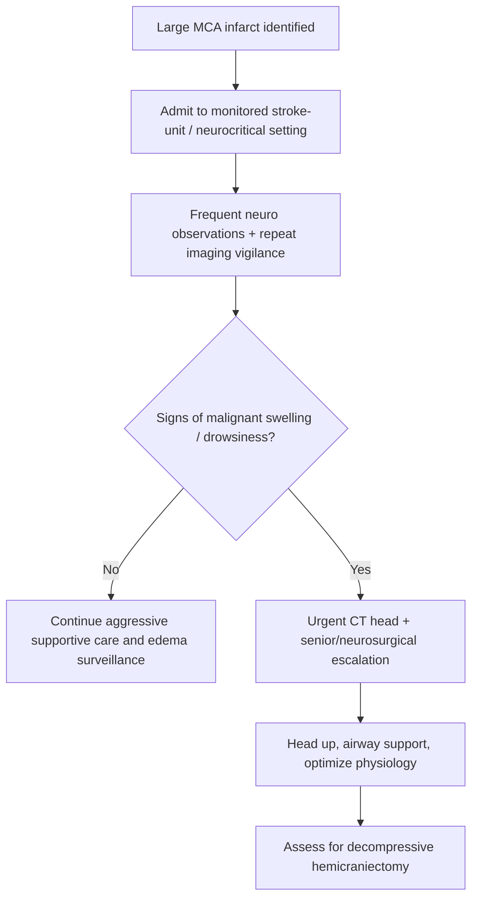
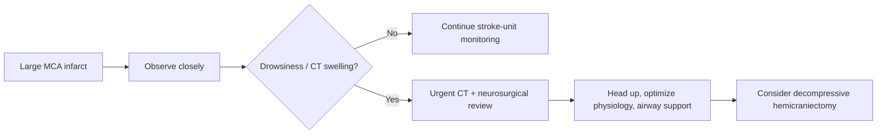

# Malignant middle cerebral artery infarction

Related: [[../Stroke Medicine MOC|Stroke Medicine MOC]] · [[../Stroke Unit Care and Complications|Stroke Unit Care and Complications]] · [[Malignant stroke and deterioration|Malignant stroke and deterioration]] · [[Cerebral oedema and raised intracranial pressure in stroke]] · [[Early neurological deterioration after stroke]] · [[../Acute Ischaemic Stroke/Middle cerebral artery stroke|Middle cerebral artery stroke]]

> [!important]
> **Malignant MCA infarction** is a large hemispheric infarction that causes massive cerebral oedema, rising ICP, midline shift, and herniation risk. The exam-defining point is early recognition and timely **decompressive hemicraniectomy consideration**.

## Learning Objectives
- Define malignant MCA infarction and explain why it is life-threatening.
- Recognize the clinical and CT features of malignant swelling.
- Outline emergency stroke-unit and neurocritical management.
- State the role and time-sensitive value of decompressive hemicraniectomy.

## Definition
**Malignant middle cerebral artery infarction** is a large territorial MCA infarct, often involving most or all of the MCA territory with or without adjacent ACA/PCA extension, that develops severe space-occupying edema leading to neurological deterioration, raised ICP, midline shift, and high mortality without aggressive management.

## Core Anatomy
- The MCA supplies a large proportion of the lateral cerebral hemisphere.
- Large infarcts affect frontal, parietal, temporal, insular, and deep white-matter structures.
- Mass effect may compress the lateral ventricle, shift the midline, and drive uncal/subfalcine herniation.

## Core Physiology
- Cytotoxic edema develops after major ischemia, followed by vasogenic edema.
- The large infarct volume produces mass effect in the fixed cranial cavity.
- Rising ICP lowers cerebral perfusion pressure and worsens secondary injury.
- Younger patients are at high risk because less cerebral atrophy leaves less compensatory intracranial space.

## Normal Values / Important Cut-offs
- The important issue is not a lab threshold but **territorial size plus deterioration**.
- Peak edema often occurs in the first **2–5 days**, commonly within 24–72 hours.
- CT features such as large MCA territory involvement, sulcal effacement, and midline shift are highly important.
- Clinical decline in consciousness is a major trigger for urgent escalation.

## Classification
### By extent
1. Near-complete MCA territory infarction
2. Complete MCA territory infarction
3. MCA infarction with additional ACA/PCA extension

### By phase
- Hyperacute large infarct at risk of malignant swelling
- Evolving malignant edema with deterioration
- Post-decompression or post-peak edema phase

## Etiology / Causes
- Proximal MCA occlusion
- Internal carotid artery terminus occlusion
- Failed reperfusion or late presentation
- Large cardioembolic occlusion
- Large-artery atherothrombotic occlusion with poor collaterals

## Risk Factors
- Young age
- Large infarct core
- High NIHSS/severe deficit
- Proximal large-vessel occlusion
- Delayed reperfusion or no reperfusion
- Hyperglycaemia and fever
- Poor collateral circulation

## Pathophysiology
Massive ischemic injury across the MCA territory causes widespread neuronal and glial pump failure, leading to intracellular water accumulation. Blood-brain barrier disruption follows, increasing vasogenic edema. As swelling expands, the ipsilateral hemisphere compresses ventricles and shifts midline structures. ICP rises, CPP falls, and the patient deteriorates with drowsiness, worsening motor signs, pupillary changes, and herniation risk. Without decompression or effective supportive care, mortality is very high.

## Clinical Features
### Early clinical pattern
- Severe hemiplegia
- Gaze deviation
- Aphasia if dominant hemisphere involved
- Neglect if non-dominant hemisphere involved
- High NIHSS at presentation

### Deterioration pattern
- Increasing drowsiness over 1–3 days
- Progressive headache and vomiting
- Worsening focal deficit
- Pupillary change
- Cushing response in late stages

## Approach / Algorithm

## Investigations
- Non-contrast CT head initially and repeated if deterioration occurs
- CTA/vascular imaging if part of acute stroke pathway
- MRI in selected stable patients for infarct extent
- Serial GCS and neurological observations
- Glucose, electrolytes, renal function, ABG if critical illness suspected

## Interpretation Frameworks
### Clinical clues that this is malignant rather than routine large stroke
| Clue | Significance |
|---|---|
| Severe deficit from onset | Suggests large territory injury |
| Declining consciousness | Mass effect / edema warning |
| Worsening headache/vomiting | Raised ICP concern |
| New pupil asymmetry | Herniation concern |

### CT interpretation clues
| CT finding | Meaning |
|---|---|
| >50% MCA territory infarction | High risk of malignant edema |
| Sulcal effacement | Swelling |
| Ventricular compression | Mass effect |
| Midline shift | Dangerous space-occupying edema |
| Basal cistern compression | Herniation risk |

## Diagnosis
Diagnosis is based on:
- a very large MCA territory infarct clinically and radiologically
- evolving reduced consciousness or swelling signs
- imaging evidence of mass effect and/or shift

## Differential Diagnosis
- Hemorrhagic transformation of infarct
- Post-ictal deterioration
- Recurrent stroke
- Metabolic encephalopathy
- Sepsis/hypoxia in a severe stroke patient

## Tables / Comparison Charts
### Large MCA stroke vs malignant MCA infarction
| Feature | Large MCA stroke | Malignant MCA infarction |
|---|---|---|
| Deficit severity | Severe | Severe |
| Consciousness | May be preserved early | Often deteriorates progressively |
| CT swelling | May be limited | Major edema with shift/compression |
| Urgency of neurosurgical review | Variable | High |

### Key management domains
| Domain | Action |
|---|---|
| Monitoring | Frequent neuro observations |
| Imaging | Repeat CT if any deterioration |
| Physiology | Oxygenation, glucose, temperature, BP optimization |
| ICP response | Head up, airway support, neurocritical care |
| Definitive escalation | Decompressive hemicraniectomy consideration |

## Management
### Immediate stroke-unit priorities
- Admit to high-observation setting.
- Frequent neurological checks.
- Head up 30° and neck neutral.
- Correct hypoxia, hyperglycaemia, and fever.
- Avoid hypotension and unnecessary delays in imaging.

### Neurocritical escalation
- Urgent repeat CT if drowsiness or worsening deficit develops.
- Consider osmotherapy as a temporizing measure in specialist care.
- Intubate if airway reflexes are lost or herniation is impending.

### Decompressive hemicraniectomy
- Core life-saving intervention in selected patients with malignant swelling.
- Most useful when considered **early**, before irreversible herniation.
- Reduces mortality and can improve meaningful functional survival in selected patients.
- Decision depends on age, premorbid state, dominance, timing, infarct extent, and family goals discussion.

### Reperfusion linkage
- Early thrombectomy/recanalization can reduce malignant evolution in some cases, but once major edema is established, surgical decompression becomes the key escalation issue.

## Drug Interactions / Contraindications / Comorbidity Cautions
- Sedatives can mask neurological decline.
- Overaggressive BP lowering may reduce residual perfusion.
- Osmotherapy requires caution in renal dysfunction or hemodynamic instability.
- Anticoagulation/antiplatelet timing must consider infarct size and hemorrhagic transformation risk.

## Procedures / Indications / Contraindications
### Indications for urgent neurosurgical discussion
- Large MCA infarct with declining consciousness
- Increasing midline shift or ventricular compression
- Clinical herniation concern

### Decompressive hemicraniectomy principle
- Best considered before terminal deterioration.
- Not a casual late rescue after fixed brainstem failure.

## Procedure Mini-Sections
### Decompressive hemicraniectomy
- **Indication:** malignant hemispheric swelling with mass effect.
- **Preparation:** urgent imaging review, ICU/neurosurgical coordination, goals discussion.
- **Principle:** remove skull segment to relieve pressure.
- **Complications:** infection, bleeding, swelling, later cranioplasty needs, survival with disability.
- **Viva pearl:** surgery saves lives, but patient selection and timing are everything.

## Complications
- Herniation
- Coma
- Hemorrhagic transformation
- Pneumonia, DVT, and systemic complications of severe stroke
- Death without timely escalation

## Red Flags / Emergencies
> [!warning]
> Urgently escalate for:
> - falling GCS in a large MCA infarct
> - new anisocoria
> - recurrent vomiting with drowsiness
> - CT showing marked shift or cisternal compression
> - brainstem signs or respiratory pattern change

## Prognosis
- Untreated malignant MCA infarction carries high mortality.
- Timely hemicraniectomy improves survival substantially in selected patients.
- Functional outcome varies, but early recognition is the main determinant of having any meaningful rescue option.

## Topic Correlation
- [[Cerebral oedema and raised intracranial pressure in stroke]]
- [[Hemorrhagic transformation warning signs]]
- [[Early neurological deterioration after stroke]]
- [[../Acute Ischaemic Stroke/Middle cerebral artery stroke|Middle cerebral artery stroke]]
- [[../Reperfusion Therapy/Mechanical thrombectomy eligibility|Mechanical thrombectomy eligibility]]

## Special Situations
### Younger patient
- Often more dramatic edema because there is less intracranial reserve.

### Dominant hemisphere infarct
- Family discussions may be complex because survival benefit may coexist with major disability/aphasia.

### Delayed referral
- Late recognition may miss the operative window.

## FCPS/MRCP High-Yield Points
- Think of malignant MCA infarction in a patient with a **very large MCA stroke who becomes drowsy**.
- Peak swelling is usually in the first few days.
- Repeat CT and neurosurgical escalation are central.
- **Decompressive hemicraniectomy** is the classic life-saving intervention.

## Common Viva Questions
- What is malignant MCA infarction?
- Why are younger patients at high risk?
- What CT signs indicate malignant swelling?
- When do you call neurosurgery?
- What is the role of hemicraniectomy?

## Common Confusions / Exam Traps
- Calling every large MCA stroke “malignant” before edema/deterioration develops.
- Missing evolving drowsiness because motor deficit was already severe.
- Waiting for fixed pupils before escalating.
- Forgetting that surgery is time-sensitive.

## Mnemonics
### Malignant MCA warning mnemonic: **SWELL**
- **S**evere stroke
- **W**orsening consciousness
- **E**dema on CT
- **L**ateral ventricle compressed
- **L**ook for hemicraniectomy window

## Mind Map
- Malignant MCA infarction
  - large territory infarct
  - edema
  - raised ICP
  - midline shift
  - drowsiness
  - management
    - monitored care
    - repeat CT
    - neurocritical support
    - hemicraniectomy

## Flowchart

## Suggested Visuals / Image Notes
- Diagram of MCA territory with hemispheric swelling.
- CT examples of malignant edema and midline shift.
- Hemicraniectomy concept illustration.

## Suggested Video References
- Malignant MCA infarction recognition
- Decompressive hemicraniectomy in stroke
- Raised ICP in large hemispheric infarction

## One-Page Revision Summary
### Malignant middle cerebral artery infarction
- Very large MCA infarct causes massive edema and raised ICP.
- Clinical clue: severe stroke followed by **progressive drowsiness** over 24–72 hours.
- CT clues: large MCA territory infarction, sulcal effacement, ventricular compression, midline shift.
- Immediate priorities:
  - high-observation care
  - repeat CT if worsening
  - head up, airway/oxygenation support
  - correct glucose, fever, BP issues
- Definitive key escalation: **decompressive hemicraniectomy** in selected patients.

## 24-Hour Recall Prompts
- Define malignant MCA infarction.
- What is the classic deterioration pattern?
- Name 4 CT warning signs.
- Why is surgery time-sensitive?
- Why are younger patients often worse?

## 7-Day / 15-Day / 30-Day Revision Tracker
- **Day 7:** recall SWELL mnemonic.
- **Day 15:** write the malignant MCA escalation algorithm.
- **Day 30:** compare malignant MCA infarction with generic raised ICP after stroke.

## Must Know / Should Know / Nice to Know
### Must Know
- Large MCA infarct + drowsiness = malignant swelling concern
- Repeat CT urgently
- Early neurosurgical escalation
- Hemicraniectomy saves lives in selected patients

### Should Know
- Younger age risk
- CT shift/ventricle compression patterns
- Temporizing role of osmotherapy

### Nice to Know
- Detailed trial evidence and age-based nuance
- Post-op rehabilitation outcomes

## My Weak Points
- Can I separate “large MCA stroke” from “malignant MCA infarction” clearly?
- Do I remember that declining consciousness is the major clue?
- Do I escalate before fixed herniation signs appear?

## Self-Test Scorecard
- Pathophysiology recall: /10
- CT interpretation: /10
- Emergency management sequencing: /10
- Surgical indication awareness: /10
- Viva confidence: /10

## Exam Answer Modes
### Short note frame
- Definition
- Pathophysiology
- Clinical features
- Imaging features
- Management
- Hemicraniectomy

### Viva frame
- “Malignant MCA infarction is a large MCA territory stroke that causes severe edema and mass effect. The patient often becomes progressively drowsy over the first few days. I would repeat CT urgently, provide neurocritical supportive care, and involve neurosurgery early for decompressive hemicraniectomy.”

## Summary
Malignant MCA infarction is a severe space-occupying hemispheric infarct with high mortality if missed. The high-yield exam message is simple: identify the patient who is getting drowsier, confirm swelling on CT, and escalate early for decompressive surgery.

## MCQs (10)
1. Malignant MCA infarction is primarily dangerous because it causes:
   A. Chronic neuropathy
   B. Massive cerebral edema and herniation risk
   C. Cataract
   D. Hyperthyroidism

2. The classic clinical warning sign is:
   A. Progressive drowsiness after a large MCA stroke
   B. Isolated ankle pain
   C. Chronic tremor only
   D. Mild sore throat

3. Which CT feature supports malignant swelling?
   A. Clear sulci and no shift
   B. Midline shift
   C. Normal ventricles
   D. Normal brain volume

4. Younger patients are often at higher risk because:
   A. They always have more hemorrhage
   B. They have less intracranial reserve from age-related atrophy
   C. They cannot form edema
   D. They all have dissection

5. The key life-saving surgical option is:
   A. Carotid endarterectomy
   B. Decompressive hemicraniectomy
   C. Lumbar puncture
   D. Endoscopy

6. Peak swelling usually develops over:
   A. Minutes only
   B. The first few days
   C. Several years
   D. Only after rehabilitation starts

7. Which bedside action is appropriate while escalating?
   A. Lie flat with flexed neck
   B. Head elevation and close neuro monitoring
   C. Stop all observations
   D. Start unrestricted oral feeding

8. Which vessel problem commonly underlies malignant MCA infarction?
   A. Proximal large-vessel occlusion
   B. Superficial skin vessel rupture
   C. Varicose vein thrombosis only
   D. Retinal artery embolus only

9. Which statement is true?
   A. Hemicraniectomy is only useful after fixed pupils develop
   B. Early neurosurgical review is important
   C. Drowsiness is unimportant if weakness is already severe
   D. Repeat CT is never needed

10. Best summary?
   A. Malignant MCA infarction is a monitored-care emergency with potential decompressive surgery
   B. It is identical to TIA
   C. It never causes mass effect
   D. It is managed only with aspirin

## SBA Questions (10)
1. A 48-year-old man with a dense right hemiplegia and global aphasia from a left MCA infarct becomes progressively drowsy over 36 hours. Best next step?
   A. Routine outpatient follow-up
   B. Urgent CT head and neurosurgical escalation for malignant edema
   C. Ignore because worsening is expected
   D. Start oral feeding immediately

2. CT shows a very large MCA infarct with sulcal effacement and 7 mm midline shift. Most important implication?
   A. No action needed if BP is normal
   B. Malignant swelling with risk of herniation
   C. Guaranteed seizure disorder only
   D. Chronic stable infarct

3. Why can young patients deteriorate dramatically in malignant MCA infarction?
   A. They have smaller lungs
   B. Less compensatory intracranial reserve
   C. They never have collaterals
   D. They always have ICH instead

4. Which intervention most directly reduces mortality in selected patients?
   A. Decompressive hemicraniectomy
   B. Delayed statin therapy alone
   C. Long-term vitamin therapy
   D. Cataract surgery

5. A patient with large MCA infarction begins vomiting and develops anisocoria. Main concern?
   A. Simple gastritis
   B. Herniation from malignant edema
   C. Mild viral illness
   D. Peripheral vertigo only

6. What is the role of osmotherapy here?
   A. Definitive cure
   B. Temporizing measure while arranging definitive neurocritical/surgical care
   C. Outpatient prophylaxis
   D. Rehabilitation substitute

7. Which monitoring feature is most important in a large MCA stroke at risk of malignant transformation?
   A. Hair growth rate
   B. Level of consciousness trend
   C. Nail color only
   D. Vision chart only

8. Why is repeat CT important in deterioration?
   A. To confirm edema and mass effect progression
   B. To diagnose diabetes
   C. To assess fracture healing
   D. To check urine output

9. When should neurosurgery be contacted?
   A. Only after cardiac arrest
   B. Early when malignant swelling is suspected
   C. Never in ischemic stroke
   D. Only after discharge

10. Best overall summary?
   A. Large MCA infarct plus drowsiness should trigger malignant edema thinking and decompression assessment
   B. Large MCA infarcts cannot swell
   C. Deterioration after stroke is always metabolic
   D. Surgery has no role

## Flashcards
- Q: What defines malignant MCA infarction?
  A: A large MCA territory infarct that causes massive edema, mass effect, and herniation risk.
- Q: Classic clinical warning sign?
  A: Progressive drowsiness after a severe MCA stroke.
- Q: Name 3 CT clues of malignant edema.
  A: Sulcal effacement, ventricular compression, midline shift, cisternal compression.
- Q: Which operation may save life?
  A: Decompressive hemicraniectomy.
- Q: Why are younger patients often high risk?
  A: They have less intracranial reserve due to less atrophy.
- Q: What bedside position helps initial management?
  A: Head elevated with neck neutral.
- Q: Is osmotherapy definitive treatment?
  A: No, it is a temporizing measure.
- Q: Which artery territory is involved?
  A: The middle cerebral artery territory.
- Q: What should worsening consciousness trigger?
  A: Urgent repeat CT and senior/neurosurgical escalation.
- Q: What is the main lethal mechanism?
  A: Raised ICP with herniation.

## Answer Key with Explanations
### MCQs
1. **B** — Space-occupying edema and herniation risk define the condition.
2. **A** — Progressive drowsiness is the classic deterioration clue.
3. **B** — Midline shift indicates dangerous mass effect.
4. **B** — Less atrophy means less room to accommodate swelling.
5. **B** — Hemicraniectomy is the classic life-saving surgical option.
6. **B** — Swelling commonly evolves over the first few days.
7. **B** — Head up and close monitoring are standard immediate supportive measures.
8. **A** — Large-vessel occlusion commonly underlies malignant infarction.
9. **B** — Early review matters before irreversible herniation occurs.
10. **A** — This is the core management summary.

### SBAs
1. **B** — This is classic malignant edema evolution after a large MCA infarct.
2. **B** — Shift plus large infarct implies dangerous malignant swelling.
3. **B** — Less reserve makes swelling clinically more catastrophic.
4. **A** — Decompressive hemicraniectomy is the high-yield intervention.
5. **B** — Vomiting plus anisocoria in this context suggests herniation risk.
6. **B** — Osmotherapy buys time; it does not replace definitive escalation.
7. **B** — Consciousness trend is the key bedside marker.
8. **A** — Repeat CT confirms the structural reason for deterioration.
9. **B** — Malignant swelling suspicion should trigger early contact.
10. **A** — That is the core take-home message.

## PasTest Scenario SBAs (Clinical Vignettes)

> **Auto-generated PasTest/Mediscope-style scenario SBAs** grounded in the authored source. Each scenario tests a real clinical fact (triad, specific sign, contraindication, trial, first-line Rx) extracted from the topic. *Source: Ch 27: Neurology & Stroke — Malignant middle cerebral artery infarction*

**Q1.** In the management of Malignant middle cerebral artery infarction, which of the following should be avoided or is contraindicated?

  - **A.** hypotension and unnecessary delays (avoid in imaging)
  - **B.** Standard guideline-directed first-line therapy
  - **C.** Routine supportive care (fluids, oxygen, monitoring)
  - **D.** Symptom-directed treatment as needed

  > **Answer: A** — hypotension and unnecessary delays (avoid in imaging)
  >
  > *Source:* - Avoid hypotension and unnecessary delays in imaging.

### Neurocritical escalation
- Urgent repeat CT if drowsiness or worsening deficit develops

