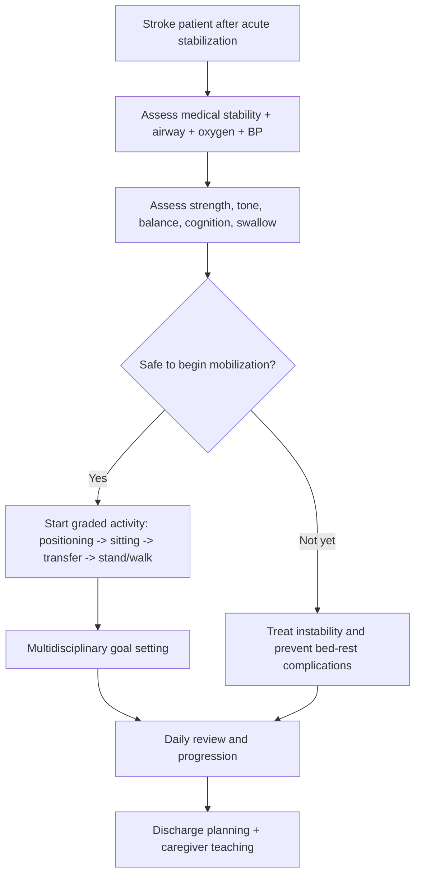

# Early mobilization and multidisciplinary recovery planning

Related: [[../Stroke Medicine MOC|Stroke Medicine MOC]] · [[../Recovery, Rehabilitation, and Prognosis|Recovery, Rehabilitation, and Prognosis]] · [[Rehabilitation fundamentals|Rehabilitation fundamentals]] · [[Stroke unit rehabilitation principles]] · [[Spasticity, contracture, and shoulder pain prevention]]

> [!important]
> **Early mobilization after stroke means safe, structured, medically-appropriate activation — not reckless forcing out of bed.** The exam logic is to mobilize early enough to reduce immobility complications, but only after checking neurological stability, blood pressure, oxygenation, swallowing/airway issues, and overall medical safety.

## Learning Objectives
- Define early mobilization in stroke recovery.
- Explain why multidisciplinary planning is necessary from the first days.
- Recognize when mobilization is helpful, when it should be cautious, and when it should be delayed.
- Outline the roles of the rehabilitation team.
- Summarize common complications prevented by organized recovery planning.

## Definition
**Early mobilization** refers to timely initiation of physical activity, positioning, sitting, transfers, standing, and progressive movement after stroke once the patient is medically appropriate for it. **Multidisciplinary recovery planning** means coordinated goal-setting by stroke physicians, nurses, physiotherapists, occupational therapists, speech and language therapists, dietitians, psychologists, and family/caregivers to improve function and reduce complications.

## Core Anatomy
- Mobility outcomes depend on the site and severity of brain injury.
- Lesions affecting:
  - motor cortex/corticospinal tracts → weakness and impaired voluntary movement
  - cerebellum/vestibular pathways → imbalance and coordination failure
  - brainstem → posture, swallowing, respiratory, and consciousness problems
  - parietal/frontal networks → neglect, apraxia, poor motor planning
- Mobilization planning must therefore consider **strength, balance, coordination, perception, and cognition**, not just leg power.

## Core Physiology
- Immobility leads to rapid deconditioning, venous stasis, pressure injury, pneumonia risk, constipation, insulin resistance, and muscle loss.
- Controlled activity improves:
  - pulmonary ventilation
  - circulation and venous return
  - posture and trunk control
  - motor relearning and neuroplastic adaptation
- Overly aggressive mobilization in an unstable patient may worsen perfusion or increase falls risk; therefore physiology supports **graded, monitored progression**.

## Normal Values / Important Cut-offs
- Mobilize **when medically and neurologically stable**, not by arbitrary clock time alone.
- Record baseline:
  - BP and orthostatic tolerance
  - oxygenation
  - heart rate/rhythm
  - level of consciousness
  - motor deficit severity
- Severe drowsiness, uncontrolled hypoxia, active cardiac instability, or worsening neurology are warning signs to pause/escalate.
- Swallow/airway issues and aspiration risk must be integrated into positioning and feeding plans.

## Classification
### By phase
- Bed-level mobilization
- Sitting balance and edge-of-bed work
- Transfer training
- Standing and gait initiation
- Progressive functional/community mobilization

### By rehabilitation setting
- Acute stroke unit mobilization
- Inpatient rehabilitation
- Home/community rehabilitation

### By goal
- Complication prevention
- Functional independence
- Safe discharge planning
- Caregiver training

## Etiology / Why mobilization is needed
Mobilization is required because stroke patients commonly develop:
- weakness and immobility
- balance disorder
- neglect and fear of movement
- prolonged bed rest after severe stroke
- dependence for transfers and ADLs
- high risk of DVT, chest infection, and pressure sores

## Risk Factors for difficult mobilization
| Risk factor | Why it matters |
|---|---|
| Severe hemiplegia | Limits transfers and standing |
| Orthostatic hypotension / autonomic instability | Causes collapse or poor tolerance |
| Neglect/cognitive impairment | Unsafe participation |
| Cerebellar/brainstem stroke | Severe balance and coordination problems |
| Dysphagia/aspiration risk | Positioning and airway precautions needed |
| Frailty/comorbidity | Slower progression |
| Depression/apathy | Lower engagement |

## Pathophysiology
After stroke, loss of motor control and prolonged bed rest amplify each other. Immobility causes muscle wasting, reduced endurance, venous thrombosis risk, atelectasis, and pressure injury, which then further reduce rehabilitation potential. Early mobilization interrupts this cycle by maintaining posture, circulation, muscle activation, and functional practice. Multidisciplinary planning is essential because motor recovery alone does not restore independence unless swallowing, cognition, communication, mood, continence, and home support are addressed simultaneously.

## Clinical Features / Functional Assessment Needs
### Domains to assess before mobilization
- Level of consciousness
- Hemodynamic stability
- Motor weakness and tone
- Sitting balance and trunk control
- Neglect/apraxia
- Ability to follow commands
- Pain and shoulder protection
- Swallowing and secretion handling

### Signs the patient needs structured planning
- Unable to transfer independently
- Poor sitting or standing balance
- Recurrent desaturation with movement
- Cognitive/communication barrier to therapy
- High caregiver dependence

## Approach / Algorithm

## Investigations / Assessment Frameworks
### Clinical assessment rather than laboratory diagnosis
- BP/HR/O2 monitoring before and during activity
- Focused neurological status
- Physiotherapy mobility assessment
- OT assessment for transfers and ADLs
- Speech/swallow review if feeding/positioning is an issue
- Nursing review of continence, skin care, and pressure areas

### Useful practical assessment questions
- Can the patient roll, sit, and maintain posture?
- Are one or two assistants needed for transfer?
- Is there neglect or impulsivity increasing falls risk?
- Is gait training realistic now or later?
- What equipment will be needed?

## Interpretation Frameworks
### Early mobilization decision frame
1. **Is the patient stable enough?**
2. **What level of movement is currently safe?**
3. **What barriers exist?** weakness, neglect, orthostasis, pain, fear, dysphagia.
4. **What complications are we trying to prevent today?** DVT, chest infection, pressure sores, deconditioning.
5. **What is the next realistic step?** bed mobility, sitting, transfer, standing, walking.

### Role split in multidisciplinary planning
| Team member | Main function |
|---|---|
| Stroke physician | medical stability and overall plan |
| Nurse | positioning, monitoring, daily functional support |
| Physiotherapist | mobility progression, transfers, gait, balance |
| Occupational therapist | ADLs, equipment, upper-limb function, home planning |
| Speech therapist | communication/swallow integration |
| Dietitian | nutrition support for recovery |
| Family/caregiver | reinforcement and safe continuation |

## Diagnosis
This topic concerns a **rehabilitation management framework**, not a separate disease entity. The practical diagnosis is identifying a stroke patient who requires structured graded mobilization and coordinated recovery planning to reduce disability and complications.

## Differential Diagnosis / reasons to delay or limit mobilization
- Neurological deterioration
- Uncontrolled arrhythmia or ischemia
- Severe orthostatic hypotension
- Uncontrolled hypoxia or respiratory distress
- Unstable fracture/trauma in complex patients
- Severe agitation or unsafe confusion
- Uncontrolled pain

## Tables / Comparison Charts
### Safe early mobilization vs unsafe pushing
| Feature | Safe mobilization | Unsafe approach |
|---|---|---|
| Timing | Based on stability | Based on rigid clock only |
| Intensity | Graded | Excessive from start |
| Monitoring | BP/O2/neuro review | Minimal monitoring |
| Team planning | Coordinated | Fragmented |
| Goal | Prevention + function | “Get patient up somehow” |

### Benefits of organized early mobilization
| Benefit | Mechanism |
|---|---|
| Less DVT | improved venous flow |
| Less deconditioning | muscle use and posture |
| Fewer pressure sores | less prolonged immobility |
| Better transfer independence | task-specific practice |
| Safer discharge | earlier function assessment |

## Management
### Core principles
- Start early but safely.
- Use graded progression.
- Integrate therapy with nursing care and medical monitoring.
- Reassess daily.
- Align mobilization with discharge goals.

### Practical steps
#### 1. Positioning and bed mobility
- Pressure-area care
- Assisted rolling and limb positioning
- Shoulder protection

#### 2. Sitting and trunk control
- Edge-of-bed tolerance
- BP/orthostatic assessment
- Trunk balance training

#### 3. Transfers and standing
- Sit-to-stand practice
- Bed-to-chair transfer training
- Appropriate aids and supervision

#### 4. Gait and functional activity
- Short supervised walking where appropriate
- Repetition of meaningful tasks
- Falls-risk precautions

#### 5. Recovery planning
- Set short-term goals: sit independently, transfer safely, stand with support, self-feed, toilet with help
- Set longer-term goals: walking, home return, caregiver training, equipment needs

## Drug Interactions / Contraindications / Comorbidity Cautions
- Sedatives and overuse of opioids reduce participation and increase falls risk.
- Antihypertensives/diuretics may worsen orthostatic intolerance in frail patients.
- Severe heart failure, acute MI, active arrhythmia, or significant hypoxia may temporarily limit mobilization intensity.
- Spasticity drugs can reduce tone but may also worsen weakness or alertness.

## Procedures / Indications / Contraindications
- **Physiotherapy-led mobility progression:** indicated in nearly all stroke patients once stable.
- **Transfer training:** indicated when the patient is dependent or unsafe.
- **Seating/wheelchair assessment:** indicated for ongoing mobility limitation.
- **Standing/walking training:** indicated when the patient can tolerate progressive load safely.

## Procedure Mini-Sections
### Orthostatic tolerance check
- **Indication:** before significant sitting/standing progression.
- **Goal:** avoid syncope/collapse and detect poor tolerance early.
- **Pearl:** many failures are due to hemodynamic issues, not lack of motivation.

### Transfer rehearsal
- **Indication:** dependent patient needing bed-to-chair or toilet transfer.
- **Goal:** safe repetitive functional independence.
- **Pearl:** good transfer ability often predicts safer discharge more than isolated limb strength.

## Complications
- Falls during unsafe mobilization
- Orthostatic collapse
- Shoulder injury in weak upper limb
- Fatigue and reduced therapy participation
- Persistent deconditioning if mobilization is delayed
- DVT, PE, pressure sores, constipation, pneumonia if mobilization is neglected

## Red Flags / Emergencies
- New neurological worsening during mobilization
- Sudden desaturation, chest pain, or arrhythmia
- Marked orthostatic hypotension/syncope
- Severe uncontrolled headache or collapse
- Recurrent aspiration or airway compromise with repositioning/feeding

## Prognosis
- Patients who receive organized early mobilization within a stroke-unit model usually achieve better functional progress and fewer immobility-related complications.
- Outcome still depends on stroke severity, cognition, motivation, family support, and comorbid disease.
- Even severely affected patients benefit from early planning because it improves safety and prevents avoidable secondary harm.

## Topic Correlation
- [[Stroke unit rehabilitation principles]]
- [[Spasticity, contracture, and shoulder pain prevention]]
- [[Persistent dysphagia and nutrition planning]]
- [[../Stroke Unit Care and Complications/Deep-vein thrombosis prevention after stroke|Deep-vein thrombosis prevention after stroke]]

## Special Situations
- **Brainstem/cerebellar stroke:** balance and airway issues make mobilization more complex.
- **Neglect/impulsivity:** falls risk is high despite preserved strength.
- **Very severe stroke:** mobilization may initially focus on posture, turning, sitting, and prevention rather than walking.
- **Frailty/elderly patient:** smaller but consistent gains matter greatly for discharge destination.

## FCPS/MRCP High-Yield Points
- Early mobilization is beneficial when **safe and individualized**.
- It should be integrated with a **multidisciplinary stroke-unit plan**.
- Preventing DVT, pressure sores, pneumonia, and deconditioning is a major objective.
- Orthostatic tolerance, cognition, neglect, and swallowing issues affect mobilization decisions.
- Recovery planning starts early and includes caregiver and discharge planning.

## Common Viva Questions
- What is meant by early mobilization after stroke?
- Why can early mobilization be beneficial?
- When should mobilization be cautious or delayed?
- Which team members are essential for multidisciplinary planning?
- What complications of immobility are prevented by early rehabilitation?

## Common Confusions / Exam Traps
- Equating early mobilization with forcing all patients to walk immediately.
- Ignoring orthostatic hypotension or unstable vitals.
- Forgetting neglect/cognition as barriers to safe mobilization.
- Treating mobilization as physiotherapy only rather than a whole-team process.
- Delaying discharge planning until late in the admission.

## Mnemonics
- **MOVE EARLY, MOVE SAFE**
  - **M**onitor vitals
  - **O**rthostatic tolerance
  - **V**iew cognition/neglect
  - **E**scalate gradually
  - **S**eat/stand/step progressively
  - **A**void complications
  - **F**unctional goals
  - **E**veryone in team involved

## Mind Map
- Early mobilization
  - why
    - prevent DVT
    - prevent pressure sores
    - reduce deconditioning
    - improve function
  - check first
    - BP/O2
    - neuro stability
    - cognition
    - balance
    - swallow/airway
  - progression
    - position
    - sit
    - transfer
    - stand
    - walk
  - team
    - nurse
    - physio
    - OT
    - speech
    - doctor
    - caregiver

## Flowchart

## Suggested Visuals / Image Notes
- Progressive mobilization ladder from bed to walking.
- Table of barriers to safe mobilization.
- Ward poster for team-based rehabilitation planning.
- Diagram of orthostatic monitoring during first transfer.

## Suggested Video References
- Stroke early mobilization teaching session.
- Safe transfer and gait progression after stroke.
- Multidisciplinary discharge planning case review.

## One-Page Revision Summary
### Early mobilization and multidisciplinary recovery planning in one page
- **Definition:** safe graded activity started early after medical stabilization.
- **Why:** reduces DVT, pressure sores, deconditioning, pneumonia, and dependence.
- **Check first:** BP, oxygenation, neuro stability, balance, cognition, neglect, airway/swallow.
- **Progression:** position → sit → transfer → stand → walk.
- **Team:** stroke doctor, nurses, physio, OT, speech therapist, dietitian, family.
- **Pearl:** mobilize early, but never blindly.

## 24-Hour Recall Prompts
- Name 4 benefits of early mobilization after stroke.
- What factors must be checked before standing a stroke patient?
- Why is multidisciplinary planning better than isolated therapy?
- Give 3 reasons mobilization may need to be cautious.
- What are the main stages of graded mobilization?

## 7-Day / 15-Day / 30-Day Revision Tracker
- **Day 7:** recall the mobilization progression ladder from memory.
- **Day 15:** compare safe mobilization with unsafe over-rapid mobilization.
- **Day 30:** give a 2-minute viva answer on early mobilization after stroke.

## Must Know / Should Know / Nice to Know
### Must Know
- early mobilization is useful when medically safe
- prevents DVT, pressure sores, pneumonia, deconditioning
- progression should be graded
- multidisciplinary planning is essential
- orthostatic tolerance and cognition matter

### Should Know
- neglect/apraxia and posterior-circulation deficits complicate recovery
- discharge planning begins early
- transfer ability is a major functional milestone

### Nice to Know
- advanced rehab technologies and detailed outcome scales

## My Weak Points
- Do I confuse early mobilization with immediate walking?
- Do I remember orthostatic and cognitive barriers?
- Can I explain why team planning matters as much as exercise itself?

## Self-Test Scorecard
- Principle recall /10
- Safety assessment /10
- Team-role recall /10
- Complication prevention /10
- Viva confidence /10

## Exam Answer Modes
### Short note skeleton
- Definition
- Benefits
- Safety checks
- Stages of progression
- Team roles and complications prevented

### Viva answer skeleton
- Early mobilization means safe graded recovery activity after stabilization.
- It reduces DVT, deconditioning, pressure sores, and chest complications.
- Check BP, oxygenation, cognition, balance, and neurological stability first.
- Progress from positioning to sitting, transfer, standing, and walking.
- Multidisciplinary planning improves outcomes and discharge readiness.

## Summary
Early mobilization and multidisciplinary recovery planning are central to modern stroke rehabilitation. The key is to start functional recovery early enough to prevent secondary complications, while tailoring intensity to medical stability and neurological deficits. In both exams and practice, the best answer is neither prolonged bed rest nor reckless activity, but **graded, monitored, team-based mobilization**.

## MCQs (10)
1. Early mobilization after stroke is best defined as:
   - A. Forcing all patients to walk on day 1
   - B. Safe graded activity started after appropriate stability assessment
   - C. Complete bed rest for the first week
   - D. A nursing-only intervention with no therapy role
   - E. A treatment relevant only to minor stroke

2. Which is a major benefit of early mobilization?
   - A. Elimination of all recurrent strokes
   - B. Reduction in deconditioning and venous thrombosis risk
   - C. Cure of aphasia in all patients
   - D. Removal of need for discharge planning
   - E. Prevention of every fall

3. Which factor should be checked before standing a stroke patient?
   - A. Orthostatic tolerance
   - B. Hair color
   - C. Shoe brand
   - D. Handedness only
   - E. Visual acuity chart only

4. Which is NOT part of multidisciplinary recovery planning?
   - A. Physiotherapy
   - B. Occupational therapy
   - C. Swallow/communication review
   - D. Caregiver planning
   - E. Ignoring cognition because it is not functional

5. A key complication of delayed mobilization is:
   - A. Pressure sore formation
   - B. Cataract
   - C. Otitis externa
   - D. Gallstone dissolution
   - E. Vitiligo

6. Which statement is most correct?
   - A. Mobilization should be based only on the clock, not the patient
   - B. Severe stroke never benefits from early planning
   - C. Graded progression is safer than sudden full activity
   - D. Neglect has no impact on falls risk
   - E. Oxygenation is irrelevant to mobilization safety

7. Which stage usually comes before gait training?
   - A. Sitting/transfer work
   - B. Driving assessment
   - C. Vocational counseling only
   - D. Botulinum injection always
   - E. Long-term nursing-home placement only

8. Why does multidisciplinary planning matter?
   - A. Because mobility is the only deficit after stroke
   - B. Because swallowing, cognition, mood, and discharge issues affect recovery too
   - C. Because the physician should never be involved
   - D. Because rehabilitation replaces acute medical care
   - E. Because all patients recover equally

9. Which patient characteristic especially increases unsafe mobilization risk?
   - A. Neglect/impulsivity
   - B. Stable sitting balance
   - C. Good command following
   - D. Normal oxygen saturation
   - E. Strong caregiver support

10. The best summary principle is:
   - A. Mobilize late and minimize monitoring
   - B. Mobilize early but safely within a stroke-unit plan
   - C. Avoid transfer training until discharge day
   - D. Ignore orthostatic symptoms
   - E. Use identical rehabilitation goals for every patient

## SBA Questions (10)
1. A 74-year-old man with right hemiparesis is medically stable 24 hours after stroke. He is alert, oxygenating well, and can sit with support. What is the best next rehabilitation step?
   - A. Keep strict bed rest for 1 week
   - B. Begin graded mobilization with supervised sitting/transfer progression
   - C. Discharge immediately without assessment
   - D. Start walking alone unassisted
   - E. Avoid physiotherapy until the CT is repeated next month

2. A stroke patient becomes dizzy and pale when first sat upright. What is the most likely immediate issue?
   - A. Orthostatic intolerance
   - B. Aphasia
   - C. Shoulder subluxation
   - D. Otitis media
   - E. Migraine aura only

3. Which team member is most directly focused on transfer progression, balance, and gait?
   - A. Physiotherapist
   - B. Dermatologist
   - C. Ophthalmologist
   - D. Rheumatologist
   - E. Dentist

4. A patient has mild motor weakness but severe neglect and impulsivity. Why is this important?
   - A. It lowers falls risk
   - B. It makes mobilization safer without supervision
   - C. It is a major barrier to safe functional recovery
   - D. It means rehabilitation is unnecessary
   - E. It proves the diagnosis is not stroke

5. A ward team delays mobilization unnecessarily for several days in a stable stroke patient. Which preventable complication becomes more likely?
   - A. DVT and deconditioning
   - B. Appendicitis
   - C. Cataract
   - D. Psoriasis
   - E. Middle-ear effusion

6. What is the best broad goal of multidisciplinary recovery planning?
   - A. Focus only on leg power
   - B. Coordinate medical, functional, communication, nutrition, and discharge needs
   - C. Exclude family from rehabilitation
   - D. Replace nursing input entirely
   - E. Delay goal setting until after discharge

7. A stroke patient is hypoxic and drowsy with fluctuating BP. What is the best mobilization principle?
   - A. Force walking to build strength
   - B. Delay progression and treat instability first
   - C. Ignore the oxygenation issue
   - D. Mobilize without monitoring
   - E. Stop all rehabilitation permanently

8. Which sequence best reflects safe progressive mobilization?
   - A. Walk -> sit -> transfer -> stand
   - B. Position -> sit -> transfer -> stand/walk
   - C. Transfer -> discharge -> stand -> walk
   - D. Wheelchair -> home -> balance -> swallow
   - E. None of the above

9. Which statement best explains why multidisciplinary work improves outcome?
   - A. Stroke recovery is purely muscular
   - B. Recovery depends on more than mobility alone
   - C. Swallowing and cognition do not influence function
   - D. Discharge planning is unrelated to recovery
   - E. Family training is unnecessary

10. What is the key exam phrase for this topic?
   - A. Early mobilization means rapid unsupervised ambulation
   - B. Early mobilization should be graded, monitored, and individualized
   - C. Rehabilitation should start only in the community
   - D. Bed rest prevents all complications
   - E. Orthostatic symptoms should be ignored

## Flashcards
- Q: Define early mobilization after stroke.
  A: Safe graded activity started after assessing medical and neurological stability.
- Q: Name 4 complications reduced by early mobilization.
  A: DVT, pressure sores, deconditioning, pneumonia/atelectasis.
- Q: What must be checked before standing a stroke patient?
  A: BP/orthostatic tolerance, oxygenation, alertness, balance, neuro stability.
- Q: Which team member leads gait and transfer progression?
  A: Physiotherapist.
- Q: Why does neglect matter in mobilization?
  A: It raises falls risk and reduces safe participation.
- Q: What sequence describes graded mobilization?
  A: Positioning -> sitting -> transfer -> standing -> walking.
- Q: Why is multidisciplinary planning needed?
  A: Because recovery depends on mobility, swallowing, cognition, mood, ADLs, and discharge needs.
- Q: What is one major milestone for safe discharge?
  A: Safe transfer ability.
- Q: When should mobilization be delayed or cautious?
  A: With unstable vitals, hypoxia, worsening neurology, or unsafe orthostatic intolerance.
- Q: What is the core phrase to remember?
  A: Mobilize early, but mobilize safe.

## Answer Key with Explanations
### MCQs
1. **B. Safe graded activity started after appropriate stability assessment** — this is the correct principle.
2. **B. Reduction in deconditioning and venous thrombosis risk** — major benefit.
3. **A. Orthostatic tolerance** — essential safety check.
4. **E. Ignoring cognition because it is not functional** — incorrect and not part of good planning.
5. **A. Pressure sore formation** — classic immobility complication.
6. **C. Graded progression is safer than sudden full activity** — best principle.
7. **A. Sitting/transfer work** — usually precedes gait training.
8. **B. Because swallowing, cognition, mood, and discharge issues affect recovery too** — correct.
9. **A. Neglect/impulsivity** — important falls-risk factor.
10. **B. Mobilize early but safely within a stroke-unit plan** — best summary.

### SBAs
1. **B. Begin graded mobilization with supervised sitting/transfer progression** — correct next step in a stable patient.
2. **A. Orthostatic intolerance** — common early barrier.
3. **A. Physiotherapist** — key mobility professional.
4. **C. It is a major barrier to safe functional recovery** — neglect changes planning substantially.
5. **A. DVT and deconditioning** — classic consequences of delay.
6. **B. Coordinate medical, functional, communication, nutrition, and discharge needs** — best broad goal.
7. **B. Delay progression and treat instability first** — safety first.
8. **B. Position -> sit -> transfer -> stand/walk** — correct graded sequence.
9. **B. Recovery depends on more than mobility alone** — this is why multidisciplinary care helps.
10. **B. Early mobilization should be graded, monitored, and individualized** — key exam phrase.
