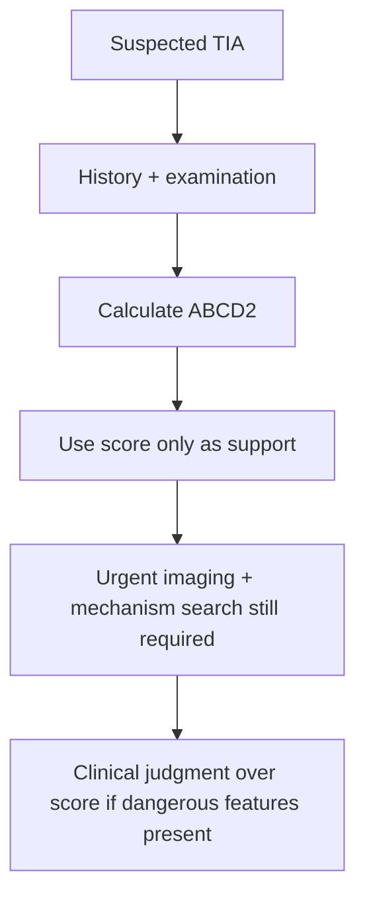

# ABCD2 score and its limitations

Related: [[../Stroke Medicine MOC|Stroke Medicine MOC]] · [[../Transient Ischaemic Attack|Transient Ischaemic Attack]] · [[TIA workup and immediate prevention|TIA workup and immediate prevention]] · [[High-risk TIA features and early recurrence risk]] · [[Urgent imaging and vascular assessment in TIA]]

> [!important]
> The **ABCD2 score** is an **aid to early risk estimation**, not a substitute for clinical judgment, urgent imaging, or mechanism-based decision-making. A “low” score does **not** safely exclude dangerous carotid disease, AF, posterior circulation events, or recurrent TIA.

## Learning Objectives
- Recall the components of the ABCD2 score.
- Explain what the score tries to predict.
- Use the score appropriately in clinical reasoning.
- Describe its major limitations in FCPS/MRCP answers.

## Definition
The **ABCD2 score** is a bedside clinical risk score used after TIA to estimate the **short-term risk of subsequent stroke** based on age, blood pressure, clinical features, duration, and diabetes.

## Score Components
| Component | Points |
|---|---:|
| **A**ge ≥60 years | 1 |
| **B**lood pressure ≥140/90 mmHg at first assessment | 1 |
| **C**linical features: unilateral weakness | 2 |
| Clinical features: speech disturbance without weakness | 1 |
| **D**uration ≥60 min | 2 |
| Duration 10-59 min | 1 |
| **D**iabetes mellitus | 1 |

### Total
- Minimum: **0**
- Maximum: **7**

## What the Score Means
Higher score generally suggests higher short-term stroke risk, especially when the event is a true TIA. It may help triage urgency, but it should never override obvious dangerous clinical features.

## Why the Score Works
The score captures features associated with vascular risk and event severity:
- older age
- hypertension
- motor or speech deficit
- longer event duration
- diabetes

These characteristics correlate with a greater probability that the event is truly vascular and clinically important.

## Approach / Algorithm

## Practical Use
### Helpful roles
- Provides a simple structured way to discuss short-term risk.
- Helps junior clinicians remember major adverse prognostic features.
- May support urgency prioritization where systems are imperfect.

### What it must NOT replace
- Urgent vascular imaging
- AF search
- Carotid assessment
- Posterior circulation clinical judgment
- Management of crescendo/recurrent TIAs

## Major Limitations
### 1. It does not identify mechanism
A patient with severe symptomatic carotid stenosis or AF may still be dangerous regardless of score.

### 2. It may under-recognize posterior circulation TIA
Symptoms like transient diplopia/ataxia may not score highly but can still be high risk.

### 3. It performs poorly if the event is actually a mimic
A score only helps if the clinician first correctly identifies probable TIA.

### 4. It does not capture crescendo/recurrent TIAs well
Multiple episodes over a short period may be very dangerous even if the formal score is modest.

### 5. It cannot replace imaging
Tissue-positive MRI lesions, carotid stenosis, or dissection are not directly included.

## Clinical Interpretation Table
| Situation | ABCD2 usefulness |
|---|---|
| Classic anterior-circulation TIA in resource-limited triage | Supportive |
| Recurrent crescendo TIAs | Insufficient alone |
| Suspected posterior circulation TIA | Limited |
| Severe carotid bruit / retinal TIA | Must not delay vascular imaging |
| Known AF | Mechanism more important than score |

## Diagnosis / Risk Stratification Principle
ABCD2 should be interpreted **after** deciding the event is probably TIA and **alongside**:
- focality and vascular pattern
- recurrence pattern
- vessel imaging findings
- cardiac rhythm findings
- presence of tissue injury on MRI

## Management Implications
- A higher score supports urgent assessment.
- A lower score does **not** justify complacency if the clinical picture is concerning.
- High-risk mechanism beats a “reassuring” score.

## Red Flags Where Score Must Not Reassure You
- Crescendo TIAs
- Motor deficit or aphasia with recurrent episodes
- Symptomatic carotid stenosis clues
- AF or embolic source clues
- Posterior circulation warning symptoms
- DWI-positive lesion on MRI

## Topic Correlation
- [[High-risk TIA features and early recurrence risk]]
- [[Urgent imaging and vascular assessment in TIA]]
- [[Immediate antiplatelet strategy after TIA]]
- [[../Secondary Prevention/Carotid stenosis and carotid endarterectomy indications|Carotid stenosis and carotid endarterectomy indications]]
- [[../Secondary Prevention/Atrial fibrillation-related stroke prevention|Atrial fibrillation-related stroke prevention]]

## FCPS/MRCP High-Yield Points
- Know all score components.
- Say clearly that **ABCD2 is supportive, not definitive**.
- Mention that carotid disease, AF, posterior circulation events, and crescendo TIAs may be missed or underweighted.
- Imaging and mechanism search remain essential.

## Common Viva Questions
- What does ABCD2 stand for?
- Which clinical feature scores 2 points?
- Why is the score useful?
- What are its major limitations?
- Can a low ABCD2 score rule out urgent disease?

## Common Exam Traps
- Quoting the score without stating its limitations.
- Using ABCD2 to avoid imaging.
- Assuming low score = safe discharge.
- Ignoring posterior circulation or recurrent-event patterns.

## Mnemonic
**A-B-C-D-D**
- **A**ge
- **B**lood pressure
- **C**linical features
- **D**uration
- **D**iabetes

## One-Page Revision Summary
- ABCD2 = short-term post-TIA stroke-risk support tool.
- Components: age, BP, clinical features, duration, diabetes.
- Weakness scores more than speech alone; longer duration scores more.
- Useful for structure, **not enough** for final triage.
- Limitations: ignores mechanism, underweights posterior circulation, misses crescendo TIAs, cannot replace imaging.

## 24-Hour Recall Prompts
- Write the ABCD2 score from memory.
- Which clinical feature gives 2 points?
- Name 4 important limitations.
- Why can a low score still be dangerous?

## Must Know / Should Know / Nice to Know
### Must Know
- full score components
- supportive role only
- key limitations
### Should Know
- examples where urgent action is needed despite low score
### Nice to Know
- later score refinements and research history

## MCQs (10)
1. ABCD2 is primarily used to estimate:  
   A. GI bleed risk  
   B. Short-term stroke risk after TIA  
   C. Epilepsy recurrence  
   D. Renal failure progression  
   **Answer: B**

2. In ABCD2, unilateral weakness scores:  
   A. 0  
   B. 1  
   C. 2  
   D. 3  
   **Answer: C**

3. Speech disturbance without weakness scores:  
   A. 1  
   B. 2  
   C. 3  
   D. 0  
   **Answer: A**

4. Duration ≥60 minutes scores:  
   A. 0  
   B. 1  
   C. 2  
   D. 4  
   **Answer: C**

5. Which is not an ABCD2 component?  
   A. Diabetes  
   B. Age  
   C. Carotid stenosis  
   D. Blood pressure  
   **Answer: C**

6. A major limitation of ABCD2 is that it:  
   A. Directly images the carotids  
   B. Identifies AF with certainty  
   C. Does not define mechanism  
   D. Diagnoses haemorrhage  
   **Answer: C**

7. A low ABCD2 score means:  
   A. Urgent evaluation is never needed  
   B. Dangerous disease is excluded  
   C. Clinical judgment is still required  
   D. AF is absent  
   **Answer: C**

8. ABCD2 may under-recognize risk in:  
   A. Posterior circulation TIA  
   B. Chronic kidney disease  
   C. COPD exacerbation  
   D. Osteoarthritis  
   **Answer: A**

9. Crescendo TIAs are important because they:  
   A. Are fully captured by ABCD2  
   B. May be dangerous despite modest score  
   C. Rule out carotid disease  
   D. Exclude AF  
   **Answer: B**

10. The best use of ABCD2 is:  
   A. As sole discharge decision tool  
   B. As adjunct to full TIA assessment  
   C. To replace vascular imaging  
   D. To diagnose migraine  
   **Answer: B**

## SBA Questions (10)
1. A 67-year-old with transient unilateral weakness for 70 minutes and diabetes has probable TIA. The most accurate statement about ABCD2 is:  
   A. It replaces urgent imaging  
   B. It can support risk estimation but full urgent evaluation is still needed  
   C. It excludes carotid disease  
   D. It is only for seizures  
   **Answer: B**

2. A patient with recurrent brief posterior circulation symptoms has a modest ABCD2 score. Best interpretation?  
   A. Safe discharge based on score alone  
   B. Posterior circulation warning events may still be high risk  
   C. The score proves migraine  
   D. No vascular imaging required  
   **Answer: B**

3. Which patient may be dangerous despite a relatively low ABCD2 score?  
   A. One with severe symptomatic carotid stenosis  
   B. One with normal vascular exam and nonfocal fatigue  
   C. One with tension headache  
   D. One with anxiety alone  
   **Answer: A**

4. Why can ABCD2 be misleading in mimics?  
   A. Because the score assumes the event is actually TIA  
   B. Because it diagnoses seizures perfectly  
   C. Because it images the brain  
   D. Because it includes MRI findings  
   **Answer: A**

5. A clinician calculates ABCD2 but skips carotid imaging. Best critique?  
   A. Correct, score replaces imaging  
   B. Wrong; score is not a substitute for mechanism search  
   C. Correct if BP was high  
   D. Correct in all retinal TIAs  
   **Answer: B**

6. Which pair are ABCD2 “C” features?  
   A. Fever and confusion  
   B. Weakness and speech disturbance  
   C. Vertigo and tremor  
   D. Ataxia and diplopia only  
   **Answer: B**

7. The common FCPS/MRCP viva pearl is that ABCD2:  
   A. Is helpful but limited  
   B. Is obsolete and never mentioned  
   C. Treats TIA  
   D. Detects haemorrhage directly  
   **Answer: A**

8. In ABCD2, diabetes adds:  
   A. 0 points  
   B. 1 point  
   C. 2 points  
   D. 3 points  
   **Answer: B**

9. Which is the best reason not to rely on score alone?  
   A. Severe mechanisms may be missed  
   B. It always overestimates risk  
   C. It is only for paediatrics  
   D. It includes retinal imaging  
   **Answer: A**

10. A patient with probable TIA and known AF should be triaged mainly by:  
   A. Score alone  
   B. Mechanism-based risk plus urgent evaluation  
   C. No workup if score is low  
   D. Headache severity only  
   **Answer: B**

## Flashcards
- Q: What does ABCD2 estimate?  
  A: Short-term stroke risk after TIA.
- Q: What does the second D stand for?  
  A: Diabetes.
- Q: How many points does unilateral weakness score?  
  A: 2.
- Q: Can ABCD2 replace carotid imaging?  
  A: No.
- Q: Does ABCD2 identify AF directly?  
  A: No.
- Q: Which territory may be underweighted by ABCD2?  
  A: Posterior circulation.
- Q: Can low score exclude urgent disease?  
  A: No.
- Q: What event pattern may be dangerous despite modest score?  
  A: Crescendo TIAs.
- Q: What must accompany ABCD2 use?  
  A: Clinical judgment and urgent mechanism-based assessment.
- Q: Why is ABCD2 limited?  
  A: It summarizes clinical features but not imaging/mechanism.

## Answer Key with Explanations
- ABCD2 helps structure bedside risk thinking but is not definitive.
- Weakness and longer duration carry higher points because they correlate with greater short-term risk.
- The main exam pearl is its **limitations**: carotid disease, AF, posterior circulation events, and recurrence pattern can outweigh the numerical score.
