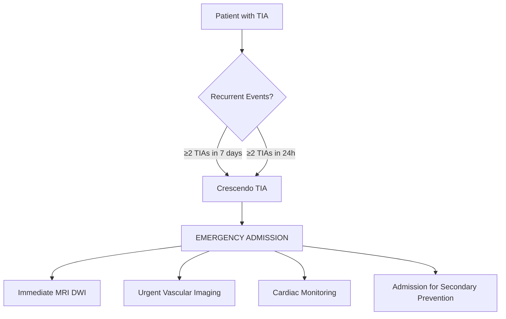
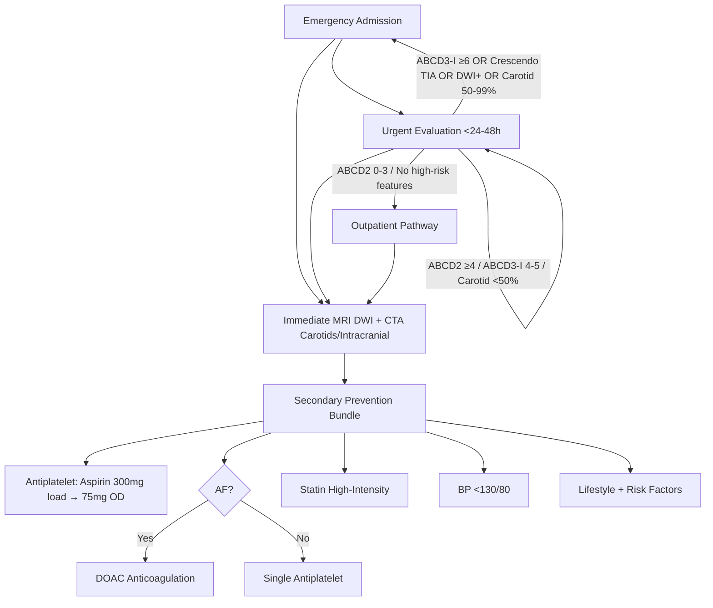

## Definition

**High-risk TIA features** are clinical and imaging findings that identify patients at highest short-term stroke risk after TIA, including ABCD2 ≥ 4, crescendo TIA, multiple TIAs in 7 days, atrial fibrillation, and ≥ 50% symptomatic carotid stenosis. Same-day evaluation and aggressive secondary prevention reduce 90-day stroke risk by ~80%.


# High-Risk TIA Features and Early Recurrence Risk

## Learning Objectives
- [ ] Identify high-risk TIA features requiring emergency admission
- [ ] Apply ABCD3-I score for improved risk stratification
- [ ] Recognise crescendo TIA and manage as emergency
- [ ] Apply ABCD3-I score for improved risk stratification
- [ ] Identify early recurrence risk and implement prevention
- [ ] Identify FCPS/MRCP high-yield high-risk TIA features

---

## High-Risk TIA Features Requiring Emergency Admission

```mermaid
flowchart TD
    A[TIA Patient] --> B{Red Flags for Emergency Admission}
    B -->|ABCD2 ≥6| C[Emergency Admission]
    B -->|Crescendo TIA (≥2 in 7 days)| C
    B -->|ABCD3-I ≥6| C
    B -->|DWI+ on MRI| C
    B -->|Symptomatic Carotid Stenosis 50-99%| C
    B -->|AF with CHA2DS2-VASc ≥2| C
    B -->|Large-vessel occlusion on CTA| C
    B -->|None| D[Urgent Outpatient Pathway]
```

### Absolute Indications for Emergency Admission

| Feature | Threshold | Rationale |
|---------|-----------|-----------|
| **ABCD2 Score** | **≥6** | 7-day stroke risk **8.1%** |
| **Crescendo TIA** | **≥2 TIAs in 7 days** | Imminent stroke risk |
| **ABCD3-I Score** | **≥6** | Improved prediction (12-15% 7-day risk) |
| **DWI+ on MRI** | Any acute infarct | **Reclassifies as stroke** |
| **Symptomatic Carotid Stenosis** | **50-99%** (NASCET) | High early recurrence; CEA within 2 weeks |
| **Atrial Fibrillation** | CHA₂DS₂-VASc ≥2 | Immediate anticoagulation + admission |
| **Large Vessel Occlusion on CTA** | ICA/M1/M2 occlusion | High early re-occlusion risk |
| **Crescendo TIA** | **≥2 TIAs in 7 days** | Imminent stroke risk |

> **FCPS/MRCP**: **ABCD2 ≥6 OR Crescendo TIA OR DWI+ = Emergency admission** — no exceptions.

---

## Crescendo TIA: The Most Ominous Pattern



| Feature | Crescendo TIA | Single TIA |
|---------|---------------|------------|
| **Definition** | **≥2 TIAs in 7 days** (or ≥2 in 24h) | Single event |
| **Pathophysiology** | Unstable atherosclerotic plaque / progressive thrombosis | Single embolic/thrombotic event |
| **Stroke Risk (7-day)** | **20-30%** | ABCD2-based |
| **Management** | **Emergency admission** | Risk-stratified |
| **Imaging** | Urgent MRI DWI + CTA | Standard workup |
| **Anticoagulation** | If AF/CE source | Risk-stratified |

> **FCPS/MRCP**: **Crescendo TIA = Medical Emergency** — admit immediately, treat as pre-stroke.

---

## ABCD3-I Score: Improved Risk Stratification

> **ABCD3-I = ABCD2 + Dual TIA + DWI + Intracranial/Extracranial Stenosis**

### ABCD3-I Components

| Component | Variable | Points |
|-----------|----------|--------|
| **A** | Age ≥60 | 1 |
| **B** | BP ≥140/90 | 1 |
| **C** | Unilateral weakness (2), Speech only (1), Other (0) | 2 / 1 / 0 |
| **D1** | Duration ≥60 min (2), 10-59 min (1), <10 min (0) | 2 / 1 / 0 |
| **D2** | **Dual TIA** (≥2 TIAs in 7 days) | **2** |
| **I** | **DWI+ on MRI** | **3** |
| **I** | **Intracranial/Extracranial Stenosis ≥50%** | **2** |

| Score | 7-Day Stroke Risk | Action |
|-------|-------------------|--------|
| **0-2** | <1% | Outpatient |
| **3-4** | 2-3% | Urgent eval 48h |
| **5-6** | 6-8% | Admission considered |
| **≥6** | **12-15%** | **Emergency admission** |

> **ABCD3-I ≥6 = 12-15% 7-day stroke risk** vs ABCD2 ≥6 = 8% — **superior prediction**.

---

## ABCD2 vs ABCD3-I Comparison

| Feature | ABCD2 | ABCD3-I |
|---------|-------|---------|
| **Variables** | 5 | 8 |
| **Imaging** | None | **DWI + Vascular imaging** |
| **Recurrent TIA** | No | **Yes (Dual TIA = 2 pts)** |
| **Stenosis** | No | **Yes (≥50% = 2 pts)** |
| **Max Score** | 7 | **10** |
| **7-day Risk (≥6)** | 8% | **12-15%** |
| **Best For** | Quick bedside | Comprehensive risk (with imaging) |

| Scenario | ABCD2 | ABCD3-I | Action |
|----------|-------|---------|--------|
| Single TIA, no stenosis, DWI- | Low/Mod | Low | Outpatient |
| Dual TIA, no stenosis, DWI- | Mod | **High** (Dual TIA = +2) | Admit |
| Single TIA, DWI+, stenosis | Mod | **High** (DWI+3, Stenosis+2) | **Admit** |
| Crescendo TIA | Mod/High | **High** | **Emergency admit** |

---

## Early Recurrence Risk Timeline

```mermaid
gantt
    title TIA Recurrence Timeline
    dateFormat  X
    axisFormat %d
    section Highest Risk
    Day 1-2       :crit, a1, 0, 2
    Day 3-7       :crit, a2, 2, 7
    section Elevated Risk
    Week 2-4      :active, b1, 7, 28
    section Declining Risk
    Month 1-3     :active, c1, 30, 90
    section Long-term
    Year 1        :active, d1, 90, 365
```



| Time Window | Recurrence Risk | Key Driver |
|-------------|-----------------|------------|
| **Day 1-2** | **Highest** (5-10% for high-risk) | Thrombus progression, plaque instability |
| **Day 3-7** | **High** (ABCD2-based) | Unstable plaque, evolving thrombus |
| **Week 2-4** | Moderate | Atherosclerosis progression |
| **Month 1-3** | Moderate-low | Atherosclerosis, cardioembolic |
| **>90 days** | Baseline risk | Chronic risk factors |

> **Key**: **90% of early recurrences occur within 7 days** — first 48h critical.

---

## ABCD3-I Score: Detailed Breakdown

| Component | Item | Points |
|-----------|------|--------|
| **A** | Age ≥60 | 1 |
| **B** | BP ≥140/90 | 1 |
| **C** | Unilateral weakness | 2 |
| | Speech disturbance only | 1 |
| | Other | 0 |
| **D1** | Duration ≥60 min | 2 |
| | Duration 10-59 min | 1 |
| | Duration <10 min | 0 |
| **D2** | **Dual TIA (≥2 in 7 days)** | **2** |
| **I (Imaging)** | **DWI+ on MRI** | **3** |
| | **Stenosis ≥50%** (intracranial/extracranial) | **2** |

| Score | 7-Day Risk | 90-Day Risk | Action |
|-------|------------|-------------|--------|
| **0-2** | <1% | 3% | Outpatient if reliable |
| **3-4** | 2-3% | 8% | Urgent eval 48h |
| **5-6** | 6-8% | 15% | Admission considered |
| **≥6** | **12-15%** | 25%+ | **Emergency admission** |

> **Key Addition**: **Dual TIA (+2)** and **DWI+ (+3)** dramatically increase score → captures crescendo TIA and covert infarcts.

---

## Early Recurrence Risk Factors

| Factor | Relative Risk | Timeframe |
|--------|---------------|-----------|
| **Crescendo TIA (≥2 in 7d)** | **15-20x** | Days 1-7 |
| **DWI+ on MRI** | **5-10x** | Week 1 |
| **Symptomatic Carotid Stenosis 50-99%** | **10x** | Month 1 |
| **AF** | **5x** | Month 1 |
| **Large-vessel occlusion** | **5x** | Week 1 |
| **Diabetes** | **2x** | Month 1-3 |
| **Age >80** | **2x** | Month 1-3 |

---

## Management Based on Risk Stratification



---

## FCPS/MRCP High-Yield Summary

| Concept | Key Points |
|---------|------------|
| **Emergency Admission** | ABCD2 ≥6, ABCD3-I ≥6, Crescendo TIA, DWI+, Symptomatic Carotid 50-99%, AF CHA₂DS₂-VASc≥2 |
| **Crescendo TIA** | **≥2 TIAs in 7 days** → **Emergency admission**; 20-30% 7-day stroke risk |
| **ABCD3-I vs ABCD2** | Adds DWI, Dual TIA, Stenosis; **Max 10**; ≥6 = 12-15% 7-day risk |
| **Crescendo TIA** | **≥2 TIAs in 7 days** = Emergency admission; 20-30% 7-day stroke risk |
| **DWI+ TIA** | **Reclassifies as stroke** → Admit, secondary prevention |
| **Carotid 50-99%** | **Urgent CEA within 2 weeks** + Antiplatelet |
| **Highest Recurrence** | **Day 1-2 (5-10%)**, Day 3-7, Week 2-4, Month 1-3 |

---

## Viva Questions

1. **What is crescendo TIA? What is the threshold for diagnosis?**
2. **How does ABCD3-I differ from ABCD2? What additional components?**
3. **What is the 7-day stroke risk for ABCD3-I ≥6?**
3. **What is crescendo TIA? How many events in what timeframe?**
4. **What is the emergency admission threshold for ABCD3-I?**
4. **How does DWI+ on MRI change TIA management?**
5. **What is the 7-day stroke risk for crescendo TIA?**
5. **What is "dual TIA" in ABCD3-I scoring?**
6. **What is the highest risk period for stroke recurrence after TIA?**
7. **How does ABCD3-I improve on ABCD2?**
8. **What is the management of crescendo TIA?**
9. **When is emergency admission mandated for TIA?**
10. **What is the significance of DWI+ on MRI in TIA workup?**

---

## Confusions & Mnemonics

| Confusion | Clarification |
|-----------|---------------|
| Crescendo TIA definition | **≥2 TIAs in 7 days** (or ≥2 in 24h) — not just "frequent" |
| ABCD2 vs ABCD3-I | ABCD3-I adds **DWI, Dual TIA, Stenosis** → better prediction |
| ABCD2 ≥6 vs ABCD3-I ≥6 | ABCD3-I ≥6 = **12-15%** 7-day risk (vs 8% for ABCD2 ≥6) |
| Dual TIA in ABCD3-I | **≥2 TIAs in 7 days** = +2 points — captures crescendo |
| DWI+ in ABCD3-I | **+3 points** — largest single contributor; reclassifies as stroke |
| Crescendo = Emergency | **≥2 TIAs in 7 days** → **Emergency admission** |
| ABCD3-I ≥6 | **12-15% 7-day risk** — Emergency admission |

---

## Mind Map

```mermaid
mindmap
  root((High-Risk TIA))
    Emergency Admission Criteria
      ABCD2 >=6
      Crescendo TIA (>=2 in 7d)
      ABCD3-I >=6
      DWI+ on MRI
      Symptomatic Carotid Stenosis 50-99%
      AF with CHA2DS2-VASc >=2
    Crescendo TIA
      >=2 TIAs in 7 days
      20-30% 7-day stroke risk
      Emergency admission mandatory
    ABCD3-I Score
      A: Age>=60 (1)
      B: BP>=140/90 (1)
      C: Weakness(2)/Speech(1)
      D1: Duration (2/1/0)
      D2: Dual TIA (2)
      I: DWI+ (3), Stenosis>=50% (2)
      Score >=6 = 12-15% 7d risk
    Recurrence Timeline
      Day 1-2: Highest (5-10%)
      Day 3-7: High
      Week 2-4: Moderate
      Month 1-3: Declining
    Emergency Admission Triggers
      ABCD2>=6, ABCD3-I>=6, Crescendo, DWI+, Carotid 50-99%, AF+CHA2DS2-VASc>=2
```

---

## One-Page Revision Card

| **Emergency Admission** | **Criteria** |
|-------------------------|--------------|
| **ABCD2** | **≥6** |
| **Crescendo TIA** | **≥2 TIAs in 7 days** |
| **ABCD3-I** | **≥6** |
| **DWI+ MRI** | Any acute infarct |
| **Carotid Stenosis** | **50-99% symptomatic** |
| **AF + CHA₂DS₂-VASc ≥2** | Anticoagulation + Admit |

| **Crescendo TIA** | **Details** |
|-------------------|-------------|
| **Definition** | **≥2 TIAs in 7 days** |
| **7-Day Stroke Risk** | **20-30%** |
| **Management** | **Emergency Admission** |
| **Workup** | Urgent MRI DWI + CTA + Cardiac monitoring |

| **ABCD3-I Components** | **Points** |
|------------------------|------------|
| Age ≥60 | 1 |
| BP ≥140/90 | 1 |
| Unilateral weakness | 2 |
| Speech only | 1 |
| Duration ≥60min | 2 |
| Duration 10-59min | 1 |
| **Dual TIA (≥2 in 7d)** | **2** |
| **DWI+** | **3** |
| Stenosis ≥50% | 2 |
| **Score ≥6 = Emergency** | |

| **Recurrence Timeline** | **Risk** |
|-------------------------|----------|
| Day 1-2 | **Highest** (5-10%) |
| Day 3-7 | High |
| Week 2-4 | Moderate |
| Month 1-3 | Declining |

---

## Spaced Repetition Tracker

| Day | 1 | 3 | 7 | 15 | 30 |
|-----|---|---|---|----|----|
| Crescendo TIA Definition | ☐ | ☐ | ☐ | ☐ | ☐ |
| ABCD3-I Components | ☐ | ☐ | ☐ | ☐ | ☐ |
| ABCD3-I ≥6 Risk | ☐ | ☐ | ☐ | ☐ | ☐ |
| Crescendo TIA 7-day Risk | ☐ | ☐ | ☐ | ☐ | ☐ |
| Emergency Admission Criteria | ☐ | ☐ | ☐ | ☐ | ☐ |

---

## Self-Test Scorecard

| Question | My Answer | Correct? |
|----------|-----------|----------|
| Crescendo TIA Definition |  |  |
| ABCD3-I ≥6 Risk % |  |  |
| DWI+ Points in ABCD3-I |  |  |
| Dual TIA Points |  |  |
| Crescendo TIA 7d Risk |  |  |

---

## Local Navigation

- [[Transient Ischaemic Attack/Transient ischaemic attack|TIA Fundamentals]]
- [[Transient Ischaemic Attack/ABCD2 score and its limitations|ABCD2 Limitations]]
- [[Transient Ischaemic Attack/TIA workup and immediate prevention|TIA Workup]]
- [[Transient Ischaemic Attack/TIA vs mimic differentiation|TIA vs Mimic]]
- [[Stroke Recognition and Clinical Assessment/Stroke mimics and common pitfalls|Stroke Mimics]]
---

## FCPS/MRCP High-Yield Summary

| Topic | Key Point |
|---|---|
| High-risk TIA features | ABCD2 ≥ 4, multiple TIAs in 7 days, crescendo TIA, AF, ≥ 50% carotid stenosis |
| Crescendo TIA | ≥ 2 TIAs in 7 days with increasing frequency/duration/severity |
| Stroke risk after TIA | Highest in first 24-48 h (~10% in 90 days, but ~50% within 48 h) |
| Urgent evaluation threshold | ABCD2 ≥ 4 → same-day evaluation |
| Modifiable risk factors for recurrence | Untreated AF, ≥ 50% carotid stenosis, antiplatelet non-adherence |
| Carotid endarterectomy timing | Within 14 days (ideally 48 h) for symptomatic ≥ 50% stenosis |
| AF detection methods | ECG, telemetry, ambulatory ECG (7-day patch, implantable loop) |
| DWI lesion in TIA | ~30-40% of TIAs have DWI+ lesion (re-classified as minor stroke) |
| Larger DWI lesion | Higher risk of recurrence |
| Dual antiplatelet in TIA | CHANCE/POINT — short-term DAPT (21-30 d) for minor stroke/high-risk TIA |

## Viva Questions
**Q1. Define crescendo TIA.**
> ≥ 2 TIAs in 7 days with increasing frequency, duration, or severity. Indicates unstable cerebrovascular disease — highest risk of imminent stroke.

**Q2. Most important modifiable risk factor for early recurrence.**
> Untreated atrial fibrillation. AF increases stroke risk 5-fold; immediate anticoagulation needed.

**Q3. Timing of carotid endarterectomy for symptomatic stenosis.**
> Within 14 days of the event, ideally within 48 h. Earlier surgery (within 14 days) has lowest stroke risk; delay beyond 14 days increases risk.

**Q4. CHANCE and POINT trials — what do they show?**
> Short-term (21-30 d) dual antiplatelet (aspirin + clopidogrel) reduces early stroke risk after minor stroke / high-risk TIA vs aspirin alone. No clear long-term benefit; bleeding risk increases with longer duration.

**Q5. AF detection after TIA — when and how?**
> ECG at presentation, then 24-h telemetry, then ambulatory ECG (7-day patch, implantable loop) for paroxysmal AF detection. 7-day monitoring detects ~5-10% more AF than 24-h monitoring.

## Confusions & Mnemonics
- **'TIA = warning sign'** — up to 23% of strokes are preceded by TIA; highest risk in first 48 h
- **'ABCD2 0-3 low / 4-5 mod / 6-7 high'** — risk stratification
- **'DWI+ TIA = minor stroke'** — re-classified by modern definition
- **'Migraine aura spreads (5-20 min); TIA sudden'** — different onset
- **'DAPT 21-30 days only'** — long-term increases bleeding
- **'AF → anticoagulation'** — DOAC preferred over warfarin

## Mind Map

```
High-risk TIA features and early recurrence risk
├── Definition
│   ├── Old: < 24 h resolution
│   └── New: tissue-based (no infarct)
├── Recognition
│   ├── Sudden focal deficit
│   └── Resolves < 24 h typically
├── Risk Stratification
│   ├── ABCD2 score
│   ├── ABCD3-I (with imaging)
│   └── DWI+ lesion
├── Investigation
│   ├── MRI DWI + CTA
│   ├── ECG + telemetry
│   └── Echo, lipids, HbA1c
├── Management
│   ├── Antiplatelet (aspirin or clopidogrel)
│   ├── DAPT for high-risk
│   ├── Anticoagulation if AF
│   └── Carotid endarterectomy if ≥ 50%
└── Mimics
    ├── Migraine (most common)
    ├── Seizure (Todd's paresis)
    ├── Syncope
    └── Hypoglycaemia
```

## One-Page Revision Card
| Step | Action |
|---|---|
| 1. Recognition | Sudden focal deficit, resolves |
| 2. Risk stratify | ABCD2 score |
| 3. Imaging | MRI DWI + CTA (within 24 h) |
| 4. Cardiac | ECG + 24-h telemetry |
| 5. Antiplatelet | Aspirin or clopidogrel |
| 6. If AF | Switch to DOAC |
| 7. If carotid ≥ 50% | Endarterectomy within 14 d |
| 8. Risk factor | BP, lipid, diabetes, smoking |

## Spaced Repetition Tracker
| Day | 1 | 3 | 7 | 15 | 30 |
|-----|---|---|---|----|----|
| High-risk TIA features | ☐ | ☐ | ☐ | ☐ | ☐ |
| Crescendo TIA | ☐ | ☐ | ☐ | ☐ | ☐ |
| Stroke risk after TIA | ☐ | ☐ | ☐ | ☐ | ☐ |
| Urgent evaluation threshold | ☐ | ☐ | ☐ | ☐ | ☐ |
| Modifiable risk factors for recurrence | ☐ | ☐ | ☐ | ☐ | ☐ |

## Self-Test Scorecard
| Question | My Answer | Correct? |
|----------|-----------|----------|
| High-risk TIA features? |  |  |
| Crescendo TIA? |  |  |
| Stroke risk after TIA? |  |  |
| Urgent evaluation threshold? |  |  |
| Modifiable risk factors for recurrence? |  |  |

## MCQs (10)
1. Crescendo TIA definition?
   A) ≥ 2 TIAs in 7 days with worsening features
   B) **A**
   C) 
   D) 
   **Answer: A**

2. Carotid endarterectomy timing for symptomatic stenosis?
   A) Within 14 days (ideally 48 h)
   B) **B**
   C) 
   D) 
   **Answer: A**

3. ABCD2 threshold for same-day evaluation?
   A) ≥ 4
   B) **C**
   C) 
   D) 
   **Answer: A**

4. % of TIAs with DWI+ lesion on MRI?
   A) ~30-40%
   B) **D**
   C) 
   D) 
   **Answer: A**

5. CHANCE/POINT trial finding?
   A) Short-term DAPT (21-30 d) reduces early stroke
   B) **A**
   C) 
   D) 
   **Answer: A**

6. Most important modifiable risk factor for early recurrence?
   A) Untreated AF
   B) **B**
   C) 
   D) 
   **Answer: A**

7. When to start DAPT after high-risk TIA?
   A) Within 24 h
   B) **C**
   C) 
   D) 
   **Answer: A**

8. AF detection rate with 7-day patch vs 24-h telemetry?
   A) 5-10% higher
   B) **D**
   C) 
   D) 
   **Answer: A**

9. DWI lesion in TIA means?
   A) Re-classify as minor stroke
   B) **A**
   C) 
   D) 
   **Answer: A**

10. Time window for symptomatic CEA benefit?
   A) Within 14 days (ideally < 48 h)
   B) **B**
   C) 
   D) 
   **Answer: A**

## SBA Questions (10)
1. 3 TIAs in 5 days, increasing frequency. Diagnosis? | Crescendo TIA

2. Crescendo TIA — what is the next step? | Same-day evaluation, admit for monitoring, antiplatelet

3. TIA with DWI+ lesion on MRI — re-classify as? | Minor stroke

4. AF detected after TIA — when to start anticoagulation? | Within 2 weeks (after ruling out haemorrhagic transformation on brain imaging)

5. Carotid endarterectomy for symptomatic 70% stenosis — when? | Within 14 days (ideally 48 h)

6. Best non-invasive imaging for carotid stenosis? | Carotid duplex US + CTA or MRA

7. DAPT duration after high-risk TIA per CHANCE/POINT? | 21-30 days

8. Why avoid long-term DAPT? | Increased bleeding risk without clear benefit

9. 7-day ECG monitoring detects what % more AF than 24 h? | 5-10%

10. Implantable loop recorder (ILR) — when? | Recurrent unexplained syncope or TIA/stroke with no clear cause

## Flashcards
**Q: Crescendo TIA?**
A: ≥ 2 TIAs / 7d, worsening

**Q: Same-day eval threshold?**
A: ABCD2 ≥ 4

**Q: DWI+ in TIA?**
A: ~30-40%

**Q: DWI+ = re-classify?**
A: Minor stroke

**Q: CEA timing?**
A: < 14 d (ideally 48 h)

**Q: AF detection?**
A: ECG, telemetry, 7-d patch

**Q: DAPT for high-risk TIA?**
A: 21-30 d

**Q: CHANCE/POINT?**
A: DAPT ↓ early stroke

**Q: Most important modifiable?**
A: Untreated AF

**Q: DAPT long-term?**
A: Avoid (bleeding)

## Answer Key with Explanations
### MCQs
1. **A** — Crescendo TIA definition?
2. **A** — Carotid endarterectomy timing for symptomatic stenosis?
3. **A** — ABCD2 threshold for same-day evaluation?
4. **A** — % of TIAs with DWI+ lesion on MRI?
5. **A** — CHANCE/POINT trial finding?
6. **A** — Most important modifiable risk factor for early recurrence?
7. **A** — When to start DAPT after high-risk TIA?
8. **A** — AF detection rate with 7-day patch vs 24-h telemetry?
9. **A** — DWI lesion in TIA means?
10. **A** — Time window for symptomatic CEA benefit?

### SBAs
1. **Crescendo TIA**
2. **Same-day evaluation, admit for monitoring, antiplatelet**
3. **Minor stroke**
4. **Within 2 weeks (after ruling out haemorrhagic transformation on brain imaging)**
5. **Within 14 days (ideally 48 h)**
6. **Carotid duplex US + CTA or MRA**
7. **21-30 days**
8. **Increased bleeding risk without clear benefit**
9. **5-10%**
10. **Recurrent unexplained syncope or TIA/stroke with no clear cause**

## Local Navigation

- [[../Transient Ischaemic Attack|Transient Ischaemic Attack]] (heading hub)
- [[Transient ischaemic attack]]
- [[High-risk TIA features and early recurrence risk]]
- [[TIA vs mimic differentiation]]
- [[Urgent imaging and vascular assessment in TIA]]
- [[Immediate antiplatelet strategy after TIA]]
- [[ABCD2 score and its limitations]]
- [[../Stroke Medicine MOC|Stroke Medicine MOC]]
