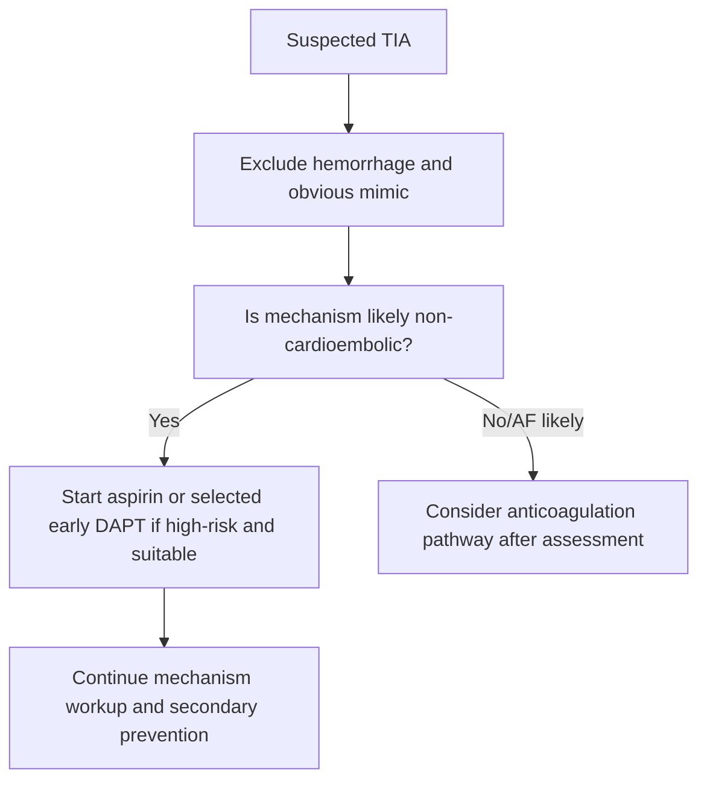

# Immediate antiplatelet strategy after TIA

Related: [[../Stroke Medicine MOC|Stroke Medicine MOC]] · [[../Transient Ischaemic Attack|Transient Ischaemic Attack]] · [[TIA workup and immediate prevention|TIA workup and immediate prevention]] · [[Transient ischaemic attack]] · [[High-risk TIA features and early recurrence risk]] · [[../Secondary Prevention/Antiplatelet therapy after ischaemic stroke|Antiplatelet therapy after ischaemic stroke]] · [[../Secondary Prevention/Dual antiplatelet therapy after minor stroke or TIA|Dual antiplatelet therapy after minor stroke or TIA]]

> [!important]
> In suspected **non-cardioembolic TIA**, antiplatelet therapy should be started **promptly after haemorrhage has been excluded**, because the benefit is front-loaded in the first hours to days.

## Learning Objectives
- Outline first-line immediate antiplatelet treatment after TIA.
- Distinguish single vs dual antiplatelet strategies.
- Recognize when antiplatelets are not the primary long-term strategy.
- Apply bleeding-risk and comorbidity cautions.

## Definition
**Immediate antiplatelet strategy after TIA** means early platelet-inhibition treatment used to reduce short-term recurrent ischaemic stroke risk after presumed **non-cardioembolic** TIA.

## Core Physiology
- Many TIAs arise from **platelet-rich thromboembolism** from atherosclerotic plaque or small-vessel disease.
- Platelet inhibition reduces recurrent microembolization and early thrombus propagation.
- The biggest absolute benefit is early, especially in the first days.

## When to Start
- After **brain haemorrhage has been excluded**.
- Once the event is thought likely to be **ischaemic TIA/minor stroke** rather than mimic.
- As soon as swallowing route and bleeding context allow.

## Main Strategies
### 1. Single antiplatelet therapy
Typical options:
- **Aspirin** as the common immediate first drug
- **Clopidogrel** when aspirin is unsuitable, not tolerated, or alternative strategy chosen

### 2. Short-course dual antiplatelet therapy (DAPT)
In selected **high-risk TIA or minor non-cardioembolic stroke**:
- aspirin + clopidogrel for a **short early period** may reduce recurrence more than aspirin alone
- this must be balanced against bleeding risk
- prolonged DAPT is usually **not** the default long-term strategy

## Who Likely Benefits From Early DAPT?
- High-risk TIA
- Minor non-cardioembolic stroke
- Early presentation within the high-risk recurrent window
- No major bleeding contraindication

## When Antiplatelets Are Not Enough or Not Primary
- **Atrial fibrillation / cardioembolic TIA** → anticoagulation planning is usually more important for long-term prevention
- **Major active bleeding risk** → reconsider strategy urgently
- **True mimic** → antiplatelet may be inappropriate

## Approach / Algorithm


## Drug Summary Table
| Strategy | Typical use | Main caution |
|---|---|---|
| Aspirin | Immediate first-line in many TIAs | GI bleeding, aspirin intolerance |
| Clopidogrel | Alternative or part of DAPT | Bleeding, drug interactions |
| Aspirin + clopidogrel (short course) | Selected high-risk TIA/minor stroke | Higher bleeding risk than single therapy |

## Contraindications / Cautions
- Intracranial haemorrhage not excluded
- Active major bleeding
- Severe thrombocytopenia
- Recent major GI bleeding or high-risk ulcer disease
- Allergy/intolerance to selected drug
- Need for anticoagulation may change regimen

## Comorbidity Issues
- **Peptic ulcer disease**: gastroprotection may be needed.
- **Renal dysfunction**: indirect bleeding-risk awareness.
- **Elderly/frail**: balance recurrence benefit against bleeding harm.
- **Concurrent NSAIDs**: increase GI bleeding risk.

## Investigations Before / Alongside Strategy
- Brain imaging to exclude haemorrhage
- CBC / platelet count
- Renal function
- ECG and AF search
- Vascular imaging for carotid/intracranial disease

## Interpretation Framework
### Choose the early antithrombotic lane
1. **Is it likely TIA or mimic?**
2. **Is haemorrhage excluded?**
3. **Is mechanism non-cardioembolic or cardioembolic?**
4. **Is this high-risk enough for short-course DAPT?**
5. **What is the bleeding risk?**

## Management Pearls
- The generic exam answer is: **give antiplatelet early after haemorrhage is excluded**.
- In **high-risk TIA**, short-course DAPT may be considered if non-cardioembolic and bleeding risk acceptable.
- Do not continue indefinite DAPT by habit without indication.
- If AF is found, long-term prevention usually shifts toward anticoagulation.

## Red Flags / Emergencies
- Recurrent TIA despite therapy
- GI bleeding or haemorrhagic complication
- Discovery of AF after initially starting antiplatelet-only plan
- Severe carotid disease requiring urgent intervention

## Topic Correlation
- [[High-risk TIA features and early recurrence risk]]
- [[Urgent imaging and vascular assessment in TIA]]
- [[ABCD2 score and its limitations]]
- [[../Secondary Prevention/Antiplatelet therapy after ischaemic stroke|Antiplatelet therapy after ischaemic stroke]]
- [[../Secondary Prevention/Dual antiplatelet therapy after minor stroke or TIA|Dual antiplatelet therapy after minor stroke or TIA]]
- [[../Secondary Prevention/Atrial fibrillation-related stroke prevention|Atrial fibrillation-related stroke prevention]]

## FCPS/MRCP High-Yield Points
- Start antiplatelet after haemorrhage is excluded.
- High-risk TIA may justify short-course DAPT if non-cardioembolic.
- Do not confuse antiplatelet strategy with anticoagulation strategy for AF.
- Bleeding-risk assessment is part of the answer.

## Common Viva Questions
- When do you start aspirin after TIA?
- Which patients may need early DAPT?
- Why is DAPT usually short course rather than indefinite?
- What changes if AF is discovered?

## One-Page Revision Summary
- TIA is an emergency because early recurrence risk is high.
- If event is likely ischaemic and haemorrhage is excluded, start antiplatelet promptly.
- **Aspirin** is common first-line.
- **Short-course aspirin + clopidogrel** may be used in selected high-risk non-cardioembolic TIA/minor stroke.
- AF redirects long-term prevention toward anticoagulation.
- Always think about bleeding risk and GI protection.

## 24-Hour Recall Prompts
- When can aspirin be started after TIA?
- Who may benefit from short-course DAPT?
- Why is prolonged routine DAPT not standard?
- When is antiplatelet-only therapy the wrong long-term lane?

## Must Know / Should Know / Nice to Know
### Must Know
- exclude haemorrhage first
- aspirin early in likely non-cardioembolic TIA
- selected high-risk TIA → consider short-course DAPT
### Should Know
- GI bleeding precautions, AF pivot to anticoagulation
### Nice to Know
- detailed guideline differences between regions

## MCQs (10)
1. Antiplatelet therapy after TIA should usually begin:  
   A. Only after 3 months  
   B. After haemorrhage is excluded  
   C. Before any assessment  
   D. Never  
   **Answer: B**

2. The common immediate first-line antiplatelet after non-cardioembolic TIA is:  
   A. Aspirin  
   B. Warfarin  
   C. Heparin infusion for all  
   D. No treatment  
   **Answer: A**

3. Short-course DAPT is most relevant in:  
   A. Selected high-risk non-cardioembolic TIA  
   B. All syncopal attacks  
   C. Intracranial haemorrhage  
   D. Peripheral neuropathy  
   **Answer: A**

4. A major caution with DAPT is:  
   A. Hyperthyroidism  
   B. Bleeding risk  
   C. Cataract progression  
   D. Hypocalcaemia  
   **Answer: B**

5. If AF is found after TIA, long-term prevention often shifts toward:  
   A. Anticoagulation  
   B. Bronchodilator therapy  
   C. Loop diuretics only  
   D. Thrombolysis every month  
   **Answer: A**

6. Which is a contraindication to immediate antiplatelet use?  
   A. Confirmed intracranial haemorrhage  
   B. Hypertension history  
   C. Dyslipidaemia  
   D. Smoking  
   **Answer: A**

7. Which statement is true?  
   A. Symptom resolution removes need for treatment  
   B. Early recurrent risk after TIA is front-loaded  
   C. DAPT must always be lifelong  
   D. Glucose testing is irrelevant  
   **Answer: B**

8. Clopidogrel may be used:  
   A. As alternative or part of DAPT  
   B. Only in haemorrhage  
   C. Only in seizures  
   D. Never with aspirin  
   **Answer: A**

9. GI ulcer history mainly matters because of:  
   A. Antiplatelet bleeding risk  
   B. Direct carotid stenosis  
   C. Migraine transformation  
   D. Vestibular suppression  
   **Answer: A**

10. The best summary is:  
   A. Antiplatelet therapy is delayed until all tests are completed weeks later  
   B. Prompt antiplatelet strategy reduces early recurrent ischaemic risk  
   C. All TIAs require anticoagulation  
   D. Brain imaging is unnecessary before therapy  
   **Answer: B**

## SBA Questions (10)
1. A 67-year-old has high-risk TIA with normal CT and no AF. Best immediate principle?  
   A. Delay all treatment  
   B. Start antiplatelet promptly  
   C. Start antibiotics  
   D. Observe at home only  
   **Answer: B**

2. A patient with non-cardioembolic high-risk TIA presents early and has low bleeding risk. Which strategy may be appropriate?  
   A. Short-course DAPT  
   B. Long-term triple therapy  
   C. No antithrombotic  
   D. Steroids alone  
   **Answer: A**

3. A patient with TIA is found to have AF. Best long-term prevention concept?  
   A. Anticoagulation pathway  
   B. Lifelong aspirin-only by default  
   C. No therapy  
   D. Antiepileptic drug  
   **Answer: A**

4. A patient has transient focal deficit but CT reveals haemorrhage. Immediate antiplatelet strategy?  
   A. Start immediately  
   B. Avoid; haemorrhage changes management  
   C. Double the aspirin dose  
   D. Add clopidogrel automatically  
   **Answer: B**

5. Which patient needs extra caution before antiplatelet use?  
   A. Recent major GI bleed  
   B. Controlled hypertension  
   C. Mild hyperlipidaemia  
   D. Cataract  
   **Answer: A**

6. Why is DAPT usually short course after high-risk TIA?  
   A. Early benefit is greatest, but bleeding risk rises with longer use  
   B. It cures AF  
   C. It improves EEG  
   D. It treats migraine aura  
   **Answer: A**

7. A patient on aspirin has another TIA. Best next principle?  
   A. Assume nothing more can be done  
   B. Reassess mechanism and treatment strategy  
   C. Stop all medication permanently  
   D. Diagnose syncope  
   **Answer: B**

8. Which bedside issue must be checked before giving oral antiplatelet in many stroke/TIA patients?  
   A. Swallowing safety  
   B. Hair color  
   C. Foot size  
   D. Handedness  
   **Answer: A**

9. A patient is taking ibuprofen regularly and now needs aspirin after TIA. Major concern?  
   A. Added GI bleeding risk  
   B. Loss of hearing only  
   C. Asthma cure  
   D. Reduced carotid stenosis  
   **Answer: A**

10. The best FCPS/MRCP answer about immediate TIA treatment should include:  
   A. Prompt post-imaging antiplatelet therapy and bleeding-risk assessment  
   B. Delay until outpatient review  
   C. No need to define mechanism  
   D. Treat every case as seizure  
   **Answer: A**

## Flashcards
- Q: When can antiplatelet therapy usually start after TIA?  
  A: After haemorrhage is excluded.
- Q: What is the common immediate first antiplatelet?  
  A: Aspirin.
- Q: In whom may short-course DAPT be used?  
  A: Selected high-risk non-cardioembolic TIA/minor stroke.
- Q: What is the main complication of DAPT?  
  A: Bleeding.
- Q: What long-term strategy is preferred in AF-related TIA?  
  A: Anticoagulation.
- Q: What GI co-therapy may be needed in ulcer-risk patients?  
  A: Gastroprotection.
- Q: Does symptom resolution remove need for early antiplatelet therapy?  
  A: No.
- Q: Why is treatment early?  
  A: Recurrent stroke risk is highest early.
- Q: Why is prolonged routine DAPT not standard?  
  A: Bleeding risk outweighs continuing benefit in many cases.
- Q: What must be assessed besides treatment choice?  
  A: Mechanism and bleeding risk.

## Answer Key with Explanations
- Early antiplatelet therapy targets the front-loaded recurrent ischaemic risk after TIA.
- DAPT is a selected strategy, not a universal or indefinite one.
- AF changes the antithrombotic lane from antiplatelet-led to anticoagulation-led prevention.
- Haemorrhage and major bleeding risk must be excluded or addressed first.

---


---

## Clinical Features of TIA Prompting Antiplatelet Initiation

TIA is characterised by sudden focal neurological deficit that resolves (typically < 24 h). The clinical features that trigger immediate antiplatelet include:

- **Sudden focal neurological deficit** resolving — any of: weakness, numbness, aphasia, dysarthria, vertigo, ataxia, hemianopia, diplopia
- **High-risk TIA features** (ABCD2 ≥ 4, crescendo TIA, multiple TIAs in 7 days, AF, ≥ 50% carotid stenosis)
- **DWI+ TIA** (re-classified as minor stroke) → same antiplatelet strategy
- **No active bleeding** or aspirin allergy

The clinical context for immediate antiplatelet:
- ABCD2 score → risk stratification
- ECG and rhythm monitoring → exclude AF (if AF → anticoagulation, not antiplatelet)
- Imaging (CT/MRI, CTA) → exclude haemorrhage, identify stenosis

See: [[Transient ischaemic attack]], [[High-risk TIA features and early recurrence risk]], [[Urgent imaging and vascular assessment in TIA]].


## FCPS/MRCP High-Yield Summary

| Topic | Key Point |
|---|---|
| First-line antiplatelet | Aspirin 300 mg loading then 75 mg daily |
| Alternative first-line | Clopidogrel 300 mg loading then 75 mg daily |
| DAPT (CHANCE/POINT) | Aspirin + clopidogrel for 21-30 days in minor stroke/high-risk TIA |
| DAPT start | Within 24 h of event |
| Aspirin + dipyridamole MR | Alternative (ESPS-2, ESPRIT) |
| Aspirin dose long-term | 75-100 mg daily (higher doses = more bleeding) |
| Aspirin contraindications | Active bleeding, aspirin allergy, severe asthma |
| Clopidogrel benefits | Once daily, fewer GI side effects than aspirin |
| When to use anticoagulation instead | AF detected (DOAC preferred over warfarin) |
| DAPT bleeding risk | Increases with duration — avoid long-term |

## Viva Questions
**Q1. First-line antiplatelet after TIA?**
> Aspirin 300 mg loading then 75 mg daily. Or clopidogrel 300 mg loading then 75 mg daily. Start within 24 h.

**Q2. When to use DAPT (aspirin + clopidogrel) after TIA?**
> For minor stroke (NIHSS ≤ 3) or high-risk TIA (ABCD2 ≥ 4). CHANCE/POINT: DAPT for 21-30 days reduces early stroke risk by ~30% vs aspirin alone.

**Q3. Why not long-term DAPT?**
> Long-term DAPT (beyond 90 days) increases major bleeding risk without proportional benefit in stroke reduction. Match duration to clinical scenario.

**Q4. Aspirin vs clopidogrel — which to choose?**
> Either acceptable. CAPRIE trial showed clopidogrel slightly better than aspirin for secondary prevention. Clopidogrel has fewer GI side effects. Aspirin cheaper and more accessible.

**Q5. When to use anticoagulation instead of antiplatelet?**
> If AF is detected (paroxysmal or persistent) — DOAC preferred over warfarin. Anticoagulation reduces stroke risk by ~64% in AF vs no treatment.

## Confusions & Mnemonics
- **'TIA = warning sign'** — up to 23% of strokes are preceded by TIA; highest risk in first 48 h
- **'ABCD2 0-3 low / 4-5 mod / 6-7 high'** — risk stratification
- **'DWI+ TIA = minor stroke'** — re-classified by modern definition
- **'Migraine aura spreads (5-20 min); TIA sudden'** — different onset
- **'DAPT 21-30 days only'** — long-term increases bleeding
- **'AF → anticoagulation'** — DOAC preferred over warfarin

## Mind Map

```
Immediate antiplatelet strategy after TIA
├── Definition
│   ├── Old: < 24 h resolution
│   └── New: tissue-based (no infarct)
├── Recognition
│   ├── Sudden focal deficit
│   └── Resolves < 24 h typically
├── Risk Stratification
│   ├── ABCD2 score
│   ├── ABCD3-I (with imaging)
│   └── DWI+ lesion
├── Investigation
│   ├── MRI DWI + CTA
│   ├── ECG + telemetry
│   └── Echo, lipids, HbA1c
├── Management
│   ├── Antiplatelet (aspirin or clopidogrel)
│   ├── DAPT for high-risk
│   ├── Anticoagulation if AF
│   └── Carotid endarterectomy if ≥ 50%
└── Mimics
    ├── Migraine (most common)
    ├── Seizure (Todd's paresis)
    ├── Syncope
    └── Hypoglycaemia
```

## One-Page Revision Card
| Step | Action |
|---|---|
| 1. Recognition | Sudden focal deficit, resolves |
| 2. Risk stratify | ABCD2 score |
| 3. Imaging | MRI DWI + CTA (within 24 h) |
| 4. Cardiac | ECG + 24-h telemetry |
| 5. Antiplatelet | Aspirin or clopidogrel |
| 6. If AF | Switch to DOAC |
| 7. If carotid ≥ 50% | Endarterectomy within 14 d |
| 8. Risk factor | BP, lipid, diabetes, smoking |

## Spaced Repetition Tracker
| Day | 1 | 3 | 7 | 15 | 30 |
|-----|---|---|---|----|----|
| First-line antiplatelet | ☐ | ☐ | ☐ | ☐ | ☐ |
| Alternative first-line | ☐ | ☐ | ☐ | ☐ | ☐ |
| DAPT (CHANCE/POINT) | ☐ | ☐ | ☐ | ☐ | ☐ |
| DAPT start | ☐ | ☐ | ☐ | ☐ | ☐ |
| Aspirin + dipyridamole MR | ☐ | ☐ | ☐ | ☐ | ☐ |

## Self-Test Scorecard
| Question | My Answer | Correct? |
|----------|-----------|----------|
| First-line antiplatelet? |  |  |
| Alternative first-line? |  |  |
| DAPT (CHANCE/POINT)? |  |  |
| DAPT start? |  |  |
| Aspirin + dipyridamole MR? |  |  |

## MCQs (10)
1. First-line antiplatelet after TIA?
   A) Aspirin 300 mg loading then 75 mg daily
   B) **A**
   C) 
   D) 
   **Answer: A**

2. DAPT duration for minor stroke/high-risk TIA?
   A) 21-30 days
   B) **B**
   C) 
   D) 
   **Answer: A**

3. DAPT start after TIA?
   A) Within 24 h
   B) **C**
   C) 
   D) 
   **Answer: A**

4. Aspirin long-term dose?
   A) 75-100 mg daily
   B) **D**
   C) 
   D) 
   **Answer: A**

5. Alternative to aspirin?
   A) Clopidogrel 75 mg daily
   B) **A**
   C) 
   D) 
   **Answer: A**

6. CHANCE/POINT finding?
   A) DAPT 21-30 d reduces early stroke
   B) **B**
   C) 
   D) 
   **Answer: A**

7. Aspirin + dipyridamole MR — alternative?
   A) Yes (ESPS-2, ESPRIT)
   B) **C**
   C) 
   D) 
   **Answer: A**

8. If AF detected, switch to?
   A) Anticoagulation (DOAC)
   B) **D**
   C) 
   D) 
   **Answer: A**

9. DAPT long-term risk?
   A) Major bleeding
   B) **A**
   C) 
   D) 
   **Answer: A**

10. CAPRIE trial finding?
   A) Clopidogrel slightly better than aspirin
   B) **B**
   C) 
   D) 
   **Answer: A**

## SBA Questions (10)
1. First-line antiplatelet after TIA? | Aspirin 300 mg loading then 75 mg daily

2. Alternative if aspirin contraindicated? | Clopidogrel 300 mg then 75 mg daily

3. Minor stroke (NIHSS 2) on day 1 — antiplatelet strategy? | DAPT (aspirin + clopidogrel) for 21-30 days

4. DAPT long-term (> 90 d) — what is the issue? | Increased bleeding without proportional benefit

5. TIA with newly diagnosed AF — switch to? | DOAC (anticoagulation)

6. Aspirin dose for long-term secondary prevention? | 75-100 mg daily

7. Why not higher aspirin doses? | Increased bleeding without additional benefit

8. Clopidogrel advantage over aspirin? | Fewer GI side effects; once daily

9. Aspirin contraindication? | Active bleeding, aspirin allergy, severe asthma

10. ESPS-2/ESPRIT trial — combination? | Aspirin + dipyridamole MR

## Flashcards
**Q: First-line?**
A: Aspirin 300 mg → 75 mg/d

**Q: Alternative?**
A: Clopidogrel 300 mg → 75 mg/d

**Q: DAPT (CHANCE/POINT)?**
A: Aspirin + clopidogrel × 21-30 d

**Q: DAPT start?**
A: Within 24 h

**Q: Aspirin long-term?**
A: 75-100 mg/d

**Q: DAPT long-term?**
A: Avoid (bleeding)

**Q: If AF?**
A: Switch to DOAC

**Q: CAPRIE?**
A: Clopidogrel > aspirin (slight)

**Q: Aspirin+dipyridamole?**
A: ESPS-2/ESPRIT option

**Q: Aspirin CI?**
A: Bleeding, allergy, severe asthma

## Answer Key with Explanations
### MCQs
1. **A** — First-line antiplatelet after TIA?
2. **A** — DAPT duration for minor stroke/high-risk TIA?
3. **A** — DAPT start after TIA?
4. **A** — Aspirin long-term dose?
5. **A** — Alternative to aspirin?
6. **A** — CHANCE/POINT finding?
7. **A** — Aspirin + dipyridamole MR — alternative?
8. **A** — If AF detected, switch to?
9. **A** — DAPT long-term risk?
10. **A** — CAPRIE trial finding?

### SBAs
1. **Aspirin 300 mg loading then 75 mg daily**
2. **Clopidogrel 300 mg then 75 mg daily**
3. **DAPT (aspirin + clopidogrel) for 21-30 days**
4. **Increased bleeding without proportional benefit**
5. **DOAC (anticoagulation)**
6. **75-100 mg daily**
7. **Increased bleeding without additional benefit**
8. **Fewer GI side effects; once daily**
9. **Active bleeding, aspirin allergy, severe asthma**
10. **Aspirin + dipyridamole MR**

## Local Navigation

- [[../Transient Ischaemic Attack|Transient Ischaemic Attack]] (heading hub)
- [[Transient ischaemic attack]]
- [[High-risk TIA features and early recurrence risk]]
- [[TIA vs mimic differentiation]]
- [[Urgent imaging and vascular assessment in TIA]]
- [[Immediate antiplatelet strategy after TIA]]
- [[ABCD2 score and its limitations]]
- [[../Stroke Medicine MOC|Stroke Medicine MOC]]

## PasTest Scenario SBAs (Clinical Vignettes)

> **Auto-generated PasTest/Mediscope-style scenario SBAs** grounded in the authored source. Each scenario tests a real clinical fact (triad, specific sign, contraindication, trial, first-line Rx) extracted from the topic. *Source: Ch 27: Neurology & Stroke — Immediate antiplatelet strategy after TIA*

**Q1.** Which landmark clinical trial provided evidence relevant to the management of Immediate antiplatelet strategy after TIA (specifically: clopidogrel slightly better than aspirin for secondary prevention)?

  - **A.** CAPRIE trial
  - **B.** A different but related trial in the same area
  - **C.** A guideline (not a trial) addressing the same question
  - **D.** An observational/cohort study addressing similar outcomes

  > **Answer: A** — CAPRIE trial
  >
  > *Source:* CAPRIE trial showed clopidogrel slightly better than aspirin for secondary prevention

**Q2.** What is the most appropriate first-line therapy for Immediate antiplatelet strategy after TIA?

  - **A.** The generic exam answer is: give antiplatelet early after haemorrhage is excluded
  - **B.** An advanced/surgical therapy reserved for refractory disease
  - **C.** Symptomatic treatment only, no disease-modifying therapy
  - **D.** Empiric broad-spectrum therapy without specific indication

  > **Answer: A** — The generic exam answer is: give antiplatelet early after haemorrhage is excluded
  >
  > *Source:* The generic exam answer is: **give antiplatelet early after haemorrhage is excluded**.

