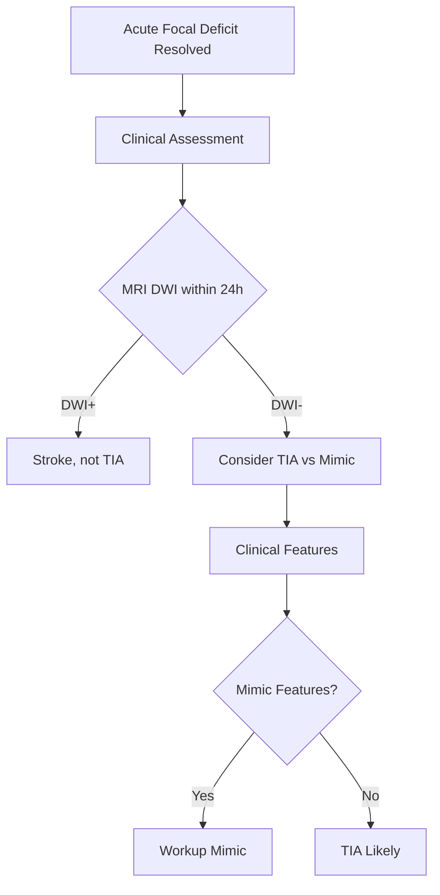
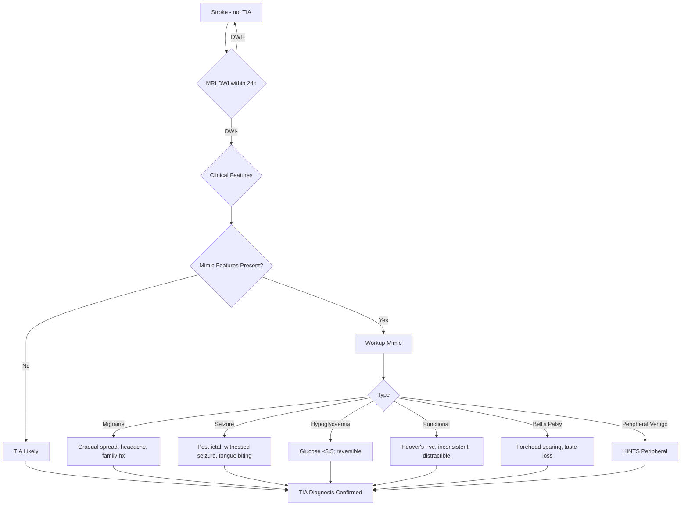
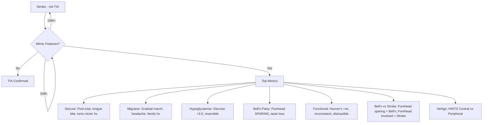
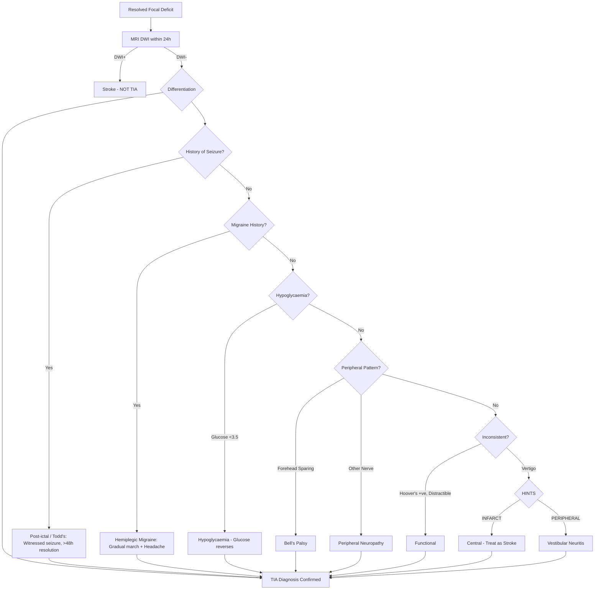
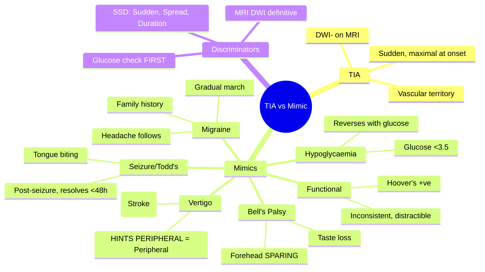

## Definition

**TIA vs mimic differentiation** is the clinical distinction between true transient ischaemic attacks and common mimics (migraine, seizure with Todd's paresis, syncope, hypoglycaemia, functional). Key differentiators: sudden vs gradual onset, negative vs positive features, presence of tongue biting/incontinence, blood glucose, and post-event course.


# TIA vs Mimic Differentiation

## Learning Objectives
- [ ] Apply structured approach to differentiate TIA from common mimics
- [ ] Apply clinical features, imaging, and risk factors for accurate diagnosis
- [ ] Recognize TIA "chameleons" — strokes presenting as mimics
- [ ] Apply MRI DWI as definitive arbiter
- [ ] Identify FCPS/MRCP high-yield differentiation points

---

## Core Principle: TIA is a Diagnosis of Exclusion + Imaging



> **Golden Rule**: **TIA is a diagnosis of exclusion + negative MRI DWI** — no infarct = TIA.

---

## TIA vs Common Mimics: Side-by-Side Comparison

| Feature | **TIA** | **Migraine with Aura** | **Seizure/Todd's Paralysis** | **Hypoglycaemia** | **Functional** |
|-----------|---------|------------------------|------------------------------|-------------------|----------------|
| **Onset** | Sudden, maximal at onset | **Gradual spread (march)** over minutes | **Post-seizure** (witnessed) | Gradual with autonomic symptoms | Abrupt, often stressor |
| **Duration** | Minutes to hours (usually <1h) | 20-60 min aura; headache follows | **<48h** (Todd's) | Until glucose corrected | Variable; often prolonged |
| **Progression** | Monophasic | **March** (spreads over minutes) | Post-seizure; improves | Resolves with glucose | Fluctuating, inconsistent |
| **Headache** | None/mild | **Severe throbbing** (follows) | Post-ictal headache | No | Variable |
| **Imaging (DWI)** | **Negative** | Negative | **Negative** | Negative | Negative |
| **Key Differentiator** | Sudden, monophasic, vascular territory | **March spread**, headache, family hx | **Post-ictal**, witnessed seizure, tongue biting | **Glucose <3.5 mmol/L**; reverses with glucose | **Hoover's +ve**, inconsistent, Hoover's sign |

---

## TIA vs Mimic Decision Algorithm



---

## TIA vs Key Mimics: Quick Comparison

| Feature | **TIA** | **Migraine with Aura** | **Seizure/Todd's** | **Hypoglycaemia** | **Bell's Palsy** | **Functional** |
|-----------|---------|------------------------|-------------------|-------------------|------------------|----------------|
| **Onset** | Sudden, maximal | **Gradual spread (march)** | Post-seizure | Gradual | Acute | Abrupt, stress-related |
| **Duration** | Minutes-hours (<1h typical) | 20-60 min + headache | **<48h** (Todd's) | Until glucose corrected | Hours-days | Variable |
| **Progression** | Monophasic | **March** (spreads) | Post-ictal → improves | Improves with glucose | Static | Fluctuating |
| **Precipitants** | Vascular risk factors | Stress, sleep, diet, hormonal | **Post-seizure** | Fasting, insulin | Stress, illness | Stress, psychological |
| **Associated Symptoms** | None specific | **Headache, photophobia, nausea** | Post-ictal confusion, tongue biting | Sweating, tremor, hunger, tachycardia | Taste loss, hyperacusis | Inconsistent, distractible |
| **Family History** | Vascular risk | **Often positive** | Epilepsy history | No | Rare | Psychiatric hx |
| **Triggers** | None specific | Stress, sleep, diet, hormonal | Seizure activity | Fasting, insulin | Stress | Psychological stress |
| **Imaging (DWI)** | **Negative** | Negative | Negative | Negative | Negative | Negative |
| **Key Differentiator** | Sudden, complete, vascular territory | **March spread + headache** | **Post-seizure**, tongue biting | **Glucose <3.5**; reverses with glucose | **Forehead SPARING** (LMN) | **Hoover's +ve**, inconsistent, distractible |

---

## Structured Differentiation Approach



---

## Key Differentiating Features: Quick Reference

| Scenario | TIA | Mimic | Key Discriminator |
|----------|-----|-------|-------------------|
| **Sudden hemiparesis, resolves in 30min, DWI-** | TIA | — | Sudden onset, vascular territory |
| **Gradual arm weakness over 20min, then headache, family migraine hx** | — | **Migraine with aura** | **March spread + headache + family hx** |
| **Weakness after witnessed seizure, tongue biting, resolves in 6h** | — | **Todd's Paralysis** | **Post-seizure, tongue biting** |
| **Weakness + confusion, glucose 2.8 mmol/L, reverses with dextrose** | — | **Hypoglycaemia** | **Glucose <3.5; reverses with glucose** |
| **Facid weakness + taste loss, forehead spared** | — | **Bell's Palsy** | **Forehead SPARING = LMN** |
| **Weakness + inconsistency + Hoover's +ve + distractible** | — | **Functional** | **Hoover's +ve, inconsistent, distractible** |
| **Acute vertigo, nystagmus, HINTS "INFARCT"** | **Cerebellar stroke** | — | **HINTS "INFARCT" = Central** |
| **Acute vertigo, nystagmus, HINTS "PERIPHERAL"** | — | **Vestibular neuritis** | **HINTS "PERIPHERAL"** |

---

## Decision Algorithm: TIA vs Mimic



---

## FCPS/MRCP High-Yield Differentiation Table

| Clinical Scenario | TIA | Mimic | Key Discriminator |
|-------------------|-----|-------|-------------------|
| **Sudden hemiparesis, 20min, DWI-** | TIA | — | Sudden, vascular territory, DWI- |
| **Gradual arm weakness 20min, then headache, family migraine** | — | **Migraine** | **March spread + headache** |
| **Weakness after seizure, tongue biting, resolves 4h** | — | **Todd's Paralysis** | **Post-seizure, tongue biting** |
| **Weakness + glucose 2.2, reverses with dextrose** | — | **Hypoglycaemia** | **Glucose <3.5 → reverses** |
| **Facial weakness + forehead SPARING** | — | **Bell's Palsy** | **Forehead SPARING = LMN** |
| **Weakness + Hoover's +ve + distractible** | — | **Functional** | **Hoover's +ve, inconsistent** |
| **Vertigo + HINTS "INFARCT"** | **Cerebellar Stroke** | — | **HINTS INFARCT = Central** |
| **Vertigo + HINTS "PERIPHERAL"** | — | **Vestibular Neuritis** | **HINTS PERIPHERAL** |

---

## FCPS/MRCP High-Yield Differentiation Points

| Mimic | Key Differentiator from TIA | FCPS/MRCP Pearl |
|-------|----------------------------|-------------------|
| **Todd's Paralysis** | **Post-seizure**; resolves <48h; tongue biting | Witnessed seizure = key history |
| **Hemiplegic Migraine** | **Gradual spread (march)**; headache; family hx | **Gradual spread = Migraine** |
| **Bell's Palsy** | **Forehead sparing = LMN**; taste loss | **Forehead sparing = LMN = Bell's** |
| **Functional** | **Hoover's +ve; inconsistent; distractible** | **Hoover's +ve = Functional** |
| **Hypoglycaemia** | **Glucose <3.5**; reverses with glucose | **Check glucose FIRST** |
| **Hemiplegic Migraine vs Stroke** | **Gradual spread (march) + Headache** | **Gradual spread = Migraine** |
| **Bell's vs Pontine Stroke** | **Forehead sparing** (Bell's) vs **Forehead involved** (Stroke) | **Forehead = key** |
| **Vertigo: HINTS "INFARCT"** | **Central = Stroke** | **HINTS INFARCT = Stroke** |
| **Vertigo: HINTS "PERIPHERAL"** | **Vestibular Neuritis** | **HINTS PERIPHERAL = Peripheral** |
| **Todd's Paralysis** | Post-seizure; resolves <48h | **Post-seizure = Todd's** |

---

## Viva Questions

1. **How do you differentiate Todd's paralysis from acute stroke?**
2. **What is the key feature distinguishing Bell's palsy from pontine stroke?**
3. **How do you differentiate hemiplegic migraine from stroke?**
3. **What is the glucose threshold for hypoglycaemia mimicking stroke?**
4. **What is Hoover's sign and what does it indicate?**
4. **How do you differentiate central from peripheral vertigo using HINTS?**
5. **What is the "march" in migraine aura?**
5. **What is the key differentiating feature of Bell's palsy vs pontine stroke?**
6. **How do you identify functional weakness?**
6. **What is the key difference between hemiplegic migraine and stroke?**
7. **What is the glucose threshold for hypoglycaemia as a stroke mimic?**
8. **How do you differentiate functional weakness from stroke?**
9. **What is the "march" in migraine aura?**
10. **How does HINTS exam distinguish central vs peripheral vertigo?**

---

## Confusions & Mnemonics

| Confusion | Clarification |
|-----------|---------------|
| TIA vs Todd's | **Todd's = post-seizure, resolves <48h**; Stroke = persistent |
| TIA vs Migraine | **Migraine = gradual spread (march) + headache**; Stroke = sudden, maximal |
| TIA vs Bell's | **Bell's = forehead sparing (LMN)**; Stroke = forehead involved |
| TIA vs Hypoglycaemia | **Glucose <3.5**; reverses with glucose | **Check glucose FIRST** |
| TIA vs Functional | **Hoover's +ve, inconsistent, distractible** | **Hoover's +ve = Functional** |
| Central vs Peripheral Vertigo | **HINTS INFARCT = Central**; **HINTS PERIPHERAL = Peripheral** |
| Todd's vs Stroke | **Todd's = post-seizure, resolves** | |
| Bell's vs Stroke | **Forehead sparing = Bell's** | |
| Migraine vs Stroke | **Gradual march + Headache** | **Sudden maximal onset = Stroke** |

---

## Mind Map



---

## One-Page Revision Card

| **Scenario** | **Mimic** | **Key Discriminator** |
|--------------|-----------|-----------------------|
| Post-seizure weakness, resolves <48h | **Todd's Paralysis** | Witnessed seizure; resolves |
| Gradual arm weakness over 20min, then headache, family hx migraine | **Migraine with aura** | Gradual spread (march) + headache |
| Weakness + glucose 2.8, reverses with dextrose | **Hypoglycaemia** | Glucose <3.5 mmol/L |
| Facial weakness, forehead spared, taste loss | **Bell's Palsy** | **Forehead SPARING** |
| Inconsistent weakness, Hoover's +ve, distractible | **Functional** | **Hoover's +ve** |
| Vertigo + HINTS "INFARCT" | **Cerebellar Stroke** | **HINTS INFARCT = Central** |
| Vertigo + HINTS "PERIPHERAL" | Vestibular Neuritis | HINTS PERIPHERAL = Peripheral |

| **Key Rule** | **Action** |
|--------------|------------|
| **Check Glucose FIRST** | In ALL acute focal deficits |
| **MRI DWI within 24h** | **Gold standard** for TIA vs Stroke |
| **Forehead Sparing = Bell's** | Forehead involved = Stroke |
| **Hoover's +ve = Functional** | Inconsistent, distractible |
| **HINTS INFARCT = Stroke** | Central vertigo = Stroke |

---

## Spaced Repetition Tracker

| Day | 1 | 3 | 7 | 15 | 30 |
|-----|---|---|---|----|----|
| Todd's vs Stroke | ☐ | ☐ | ☐ | ☐ | ☐ |
| Bell's vs Stroke | ☐ | ☐ | ☐ | ☐ | ☐ |
| Migraine vs Stroke | ☐ | ☐ | ☐ | ☐ | ☐ |
| Functional vs Stroke | ☐ | ☐ | ☐ | ☐ | ☐ |
| HINTS Central vs Peripheral | ☐ | ☐ | ☐ | ☐ | ☐ |

---

## Self-Test Scorecard

| Question | My Answer | Correct? |
|----------|-----------|----------|
| Todd's Paralysis vs Stroke |  |  |
| Bell's Palsy Forehead Sparing |  |  |
| Migraine vs Stroke Gradual Spread |  |  |
| Functional Weakness Hoover's |  |  |
| HINTS INFARCT vs PERIPHERAL |  |  |

---

## Local Navigation

- [[Transient Ischaemic Attack/Transient ischaemic attack|TIA Fundamentals]]
- [[Transient Ischaemic Attack/High-risk TIA features and early recurrence risk|High-risk TIA]]
- [[Transient Ischaemic Attack/TIA workup and immediate prevention|TIA Workup]]
- [[Stroke Recognition and Clinical Assessment/Stroke mimics and common pitfalls|Stroke Mimics]]
- [[Stroke Recognition and Clinical Assessment/Stroke recognition and first approach|Stroke Recognition]]
---

## FCPS/MRCP High-Yield Summary

| Topic | Key Point |
|---|---|
| TIA definition (tissue) | Brief neurological symptoms without infarction |
| Stroke (tissue) | Symptoms with infarction on imaging |
| Most common TIA mimic | Migraine (with aura) |
| Other TIA mimics | Seizure (post-ictal Todd's paresis), syncope, hypoglycaemia, peripheral vertigo, functional |
| Speech disturbance in TIA | Aphasia (cortical — usually MCA territory) |
| Speech disturbance in migraine | Dysarthria (subcortical, brainstem) more common than aphasia |
| Gradual onset (migraine) | Aura spreads over minutes (5-20 min) |
| Sudden onset (TIA/stroke) | Maximum deficit at onset (or within seconds) |
| Positive features (migraine) | Visual scotomata, flashing lights, sensory march |
| Negative features (TIA) | Sudden loss of function (weakness, numbness, aphasia) |

## Viva Questions
**Q1. Most common TIA mimic.**
> Migraine with aura — up to 20-30% of suspected TIAs are migraines. Aura spreads over minutes (vs sudden onset in TIA).

**Q2. How to differentiate TIA from seizure (post-ictal Todd's paresis)?**
> Todd's paresis follows a witnessed seizure (tongue biting, incontinence, post-event confusion). EEG may show epileptiform activity. MRI may show peri-ictal changes (transient cortical oedema).

**Q3. How to differentiate TIA from syncope?**
> Syncope has prodromal lightheadedness, pallor, sweating, brief LOC < 1 min with rapid recovery. TIA has focal neurological deficit without LOC.

**Q4. How to differentiate TIA from migraine with aura?**
> Migraine aura: gradual spread over 5-20 min, positive features (scintillating scotomata, sensory march), often followed by headache. TIA: sudden onset, negative features, no headache progression.

**Q5. What is 'crescendo TIA'?**
> ≥ 2 TIAs in 7 days with increasing frequency, duration, or severity. Indicates unstable cerebrovascular disease — same-day evaluation and admission often warranted.

## Confusions & Mnemonics
- **'TIA = warning sign'** — up to 23% of strokes are preceded by TIA; highest risk in first 48 h
- **'ABCD2 0-3 low / 4-5 mod / 6-7 high'** — risk stratification
- **'DWI+ TIA = minor stroke'** — re-classified by modern definition
- **'Migraine aura spreads (5-20 min); TIA sudden'** — different onset
- **'DAPT 21-30 days only'** — long-term increases bleeding
- **'AF → anticoagulation'** — DOAC preferred over warfarin

## Mind Map

```
TIA vs mimic differentiation
├── Definition
│   ├── Old: < 24 h resolution
│   └── New: tissue-based (no infarct)
├── Recognition
│   ├── Sudden focal deficit
│   └── Resolves < 24 h typically
├── Risk Stratification
│   ├── ABCD2 score
│   ├── ABCD3-I (with imaging)
│   └── DWI+ lesion
├── Investigation
│   ├── MRI DWI + CTA
│   ├── ECG + telemetry
│   └── Echo, lipids, HbA1c
├── Management
│   ├── Antiplatelet (aspirin or clopidogrel)
│   ├── DAPT for high-risk
│   ├── Anticoagulation if AF
│   └── Carotid endarterectomy if ≥ 50%
└── Mimics
    ├── Migraine (most common)
    ├── Seizure (Todd's paresis)
    ├── Syncope
    └── Hypoglycaemia
```

## One-Page Revision Card
| Step | Action |
|---|---|
| 1. Recognition | Sudden focal deficit, resolves |
| 2. Risk stratify | ABCD2 score |
| 3. Imaging | MRI DWI + CTA (within 24 h) |
| 4. Cardiac | ECG + 24-h telemetry |
| 5. Antiplatelet | Aspirin or clopidogrel |
| 6. If AF | Switch to DOAC |
| 7. If carotid ≥ 50% | Endarterectomy within 14 d |
| 8. Risk factor | BP, lipid, diabetes, smoking |

## Spaced Repetition Tracker
| Day | 1 | 3 | 7 | 15 | 30 |
|-----|---|---|---|----|----|
| TIA definition (tissue) | ☐ | ☐ | ☐ | ☐ | ☐ |
| Stroke (tissue) | ☐ | ☐ | ☐ | ☐ | ☐ |
| Most common TIA mimic | ☐ | ☐ | ☐ | ☐ | ☐ |
| Other TIA mimics | ☐ | ☐ | ☐ | ☐ | ☐ |
| Speech disturbance in TIA | ☐ | ☐ | ☐ | ☐ | ☐ |

## Self-Test Scorecard
| Question | My Answer | Correct? |
|----------|-----------|----------|
| TIA definition (tissue)? |  |  |
| Stroke (tissue)? |  |  |
| Most common TIA mimic? |  |  |
| Other TIA mimics? |  |  |
| Speech disturbance in TIA? |  |  |

## MCQs (10)
1. Most common TIA mimic?
   A) Migraine with aura
   B) **A**
   C) 
   D) 
   **Answer: A**

2. Migraine aura spreads over?
   A) 5-20 minutes
   B) **B**
   C) 
   D) 
   **Answer: A**

3. TIA deficit onset is?
   A) Sudden, maximum at onset
   B) **C**
   C) 
   D) 
   **Answer: A**

4. Todd's paresis is?
   A) Post-ictal weakness after seizure
   B) **D**
   C) 
   D) 
   **Answer: A**

5. Speech in TIA is usually?
   A) Aphasia (cortical)
   B) **A**
   C) 
   D) 
   **Answer: A**

6. Speech in migraine is usually?
   A) Dysarthria (subcortical)
   B) **B**
   C) 
   D) 
   **Answer: A**

7. Positive features in?
   A) Migraine (scotomata, sensory march)
   B) **C**
   C) 
   D) 
   **Answer: A**

8. Negative features in?
   A) TIA/stroke (loss of function)
   B) **D**
   C) 
   D) 
   **Answer: A**

9. Syncope distinguishing feature?
   A) Brief LOC, prodromal symptoms, rapid recovery
   B) **A**
   C) 
   D) 
   **Answer: A**

10. Crescendo TIA definition?
   A) ≥ 2 TIAs in 7 days with worsening features
   B) **B**
   C) 
   D) 
   **Answer: A**

## SBA Questions (10)
1. Gradual visual scotomata spreading over 15 min then headache — diagnosis? | Migraine with aura

2. Sudden aphasia and right hemiparesis, 30 min, fully resolved — diagnosis? | TIA

3. Post-ictal weakness after witnessed seizure — diagnosis? | Todd's paresis (not TIA)

4. Brief LOC with prodromal lightheadedness, recovered in 30 sec — diagnosis? | Syncope (not TIA)

5. Focal neurological symptoms, blood glucose 2.5 mmol/L — diagnosis? | Hypoglycaemic mimic (not TIA)

6. Recurrent vertigo with hearing loss, no focal deficit — diagnosis? | Peripheral vertigo / Ménière's (not TIA)

7. Sudden right hemiparesis with aphasia in known migraineur — how to differentiate from TIA? | Sudden onset and negative features suggest TIA; need urgent MRI/CTA to confirm

8. Sudden isolated vertigo with dysarthria and ataxia — likely diagnosis? | Posterior circulation TIA/stroke (not peripheral)

9. Crescendo TIA — what is the immediate next step? | Same-day evaluation, admit for monitoring

10. Sudden bilateral leg weakness with saddle anaesthesia, no facial involvement — likely diagnosis? | Spinal cord compression (not TIA)

## Flashcards
**Q: Most common mimic?**
A: Migraine

**Q: Aura spread?**
A: 5-20 min

**Q: TIA onset?**
A: Sudden, max at onset

**Q: Todd's paresis?**
A: Post-ictal

**Q: TIA speech?**
A: Aphasia

**Q: Migraine speech?**
A: Dysarthria

**Q: Positive features?**
A: Migraine

**Q: Negative features?**
A: TIA

**Q: Syncope?**
A: Brief LOC, prodrome

**Q: Crescendo TIA?**
A: ≥ 2 / 7d, worsening

## Answer Key with Explanations
### MCQs
1. **A** — Most common TIA mimic?
2. **A** — Migraine aura spreads over?
3. **A** — TIA deficit onset is?
4. **A** — Todd's paresis is?
5. **A** — Speech in TIA is usually?
6. **A** — Speech in migraine is usually?
7. **A** — Positive features in?
8. **A** — Negative features in?
9. **A** — Syncope distinguishing feature?
10. **A** — Crescendo TIA definition?

### SBAs
1. **Migraine with aura**
2. **TIA**
3. **Todd's paresis (not TIA)**
4. **Syncope (not TIA)**
5. **Hypoglycaemic mimic (not TIA)**
6. **Peripheral vertigo / Ménière's (not TIA)**
7. **Sudden onset and negative features suggest TIA; need urgent MRI/CTA to confirm**
8. **Posterior circulation TIA/stroke (not peripheral)**
9. **Same-day evaluation, admit for monitoring**
10. **Spinal cord compression (not TIA)**

## Local Navigation

- [[../Transient Ischaemic Attack|Transient Ischaemic Attack]] (heading hub)
- [[Transient ischaemic attack]]
- [[High-risk TIA features and early recurrence risk]]
- [[TIA vs mimic differentiation]]
- [[Urgent imaging and vascular assessment in TIA]]
- [[Immediate antiplatelet strategy after TIA]]
- [[ABCD2 score and its limitations]]
- [[../Stroke Medicine MOC|Stroke Medicine MOC]]
