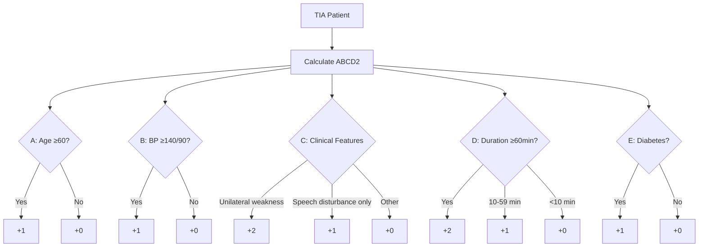
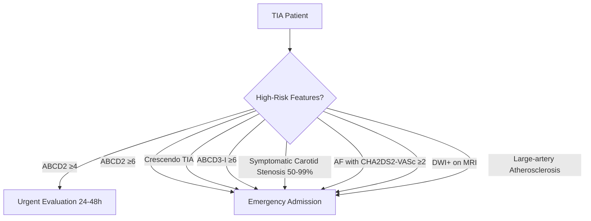
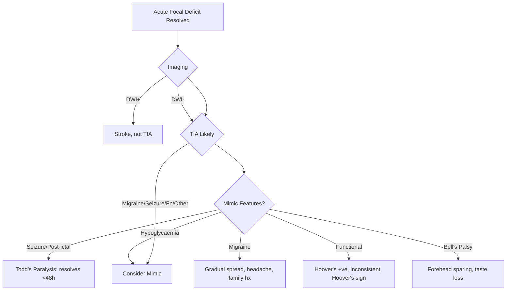
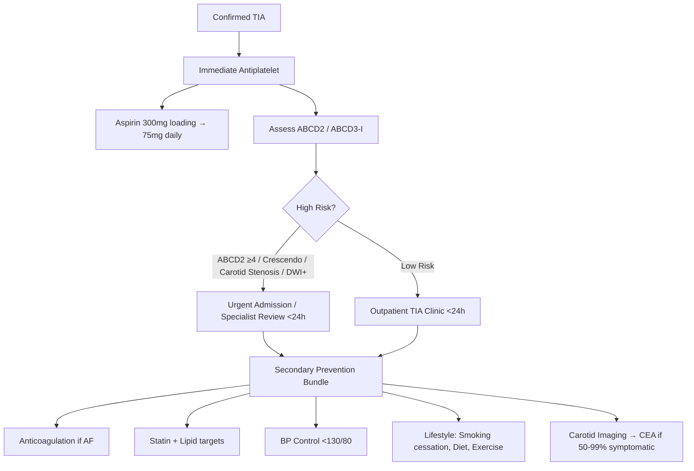

# Transient Ischaemic Attack (TIA) Fundamentals

## Learning Objectives
- [ ] Apply current TIA definition (tissue-based vs time-based)
- [ ] Calculate and interpret ABCD2 score for risk stratification
- [ ] Identify high-risk TIA features requiring urgent intervention
- [ ] Apply immediate management and secondary prevention
- [ ] Know ABCD2 score limitations and modern risk tools
- [ ] Identify FCPS/MRCP high-yield TIA management points

---

## Definition: TIA

> **Tissue-based Definition (Current):**
> **Transient episode of neurological dysfunction caused by focal brain, spinal cord, or retinal ischaemia, WITHOUT acute infarction on imaging.**

> **Historical Time-based Definition (Legacy):**
> **Neurological deficit resolving completely within 24 hours.**

> **FCPS/MRCP**: **Current standard = TISSUE-BASED** — no infarction on MRI DWI. Up to **30-50% of "classic TIAs" have DWI+ infarcts**.

---

## TIA vs Stroke vs Mimic

```mermaid
flowchart TD
    A[Acute Focal Deficit] --> B{Imaging (MRI DWI)}
    B -->|Positive| C[Acute Ischaemic Stroke]
    B -->|Negative| D[Symptoms Resolved?]
    D -->|Yes| E[TIA (by definition)]
    D -->|No| F[Stroke Mimic / Slowly Resolving Stroke]
    F --> G[Consider Mimics / Progressive Stroke]
```

> **Key**: **TIA = Clinical syndrome + NO acute infarct on MRI DWI** — not time-based.

---

## ABCD2 Score: Risk Stratification



---

## ABCD2 Score Components

| Letter | Variable | Points |
|--------|----------|--------|
| **A** | **Age ≥60 years** | **1** |
| **B** | **BP ≥140/90 mmHg** at presentation | **1** |
| **C** | **Clinical Features** | **Unilateral weakness: 2** / **Speech disturbance only: 1** / Other: 0 |
| **D** | **Duration** | **≥60 min: 2** / 10-59 min: 1 / <10 min: 0 |
| **D** | **Diabetes** | **1** |

| Score | Risk Category | 7-Day Stroke Risk | 90-Day Stroke Risk | Action |
|-------|---------------|-------------------|--------------------|--------|
| **0-3** | **Low** | **1.0%** | 3.1% | Outpatient workup if reliable follow-up |
| **4-5** | **Moderate** | **4.1%** | 10.7% | **Urgent evaluation (24-48h)** |
| **6-7** | **High** | **8.1%** | 17.8% | **Emergency admission / Same-day specialist** |

> **FCPS/MRCP**: **ABCD2 ≥4 = Urgent evaluation**; **ABCD2 ≥6 = Emergency admission**.

---

## ABCD2 Score Limitations

| Limitation | Impact |
|------------|--------|
| **No imaging component** | Misses DWI+ infarcts (30-50% of TIAs) |
| **No vascular imaging** | Misses high-risk carotid stenosis / LVO |
| **No atrial fibrillation** | Major cardioembolic risk not captured |
| **Duration imprecise** | Patient recall unreliable; <10 min hard to verify |
| **Derived from pre-MRI era** | Pre-DWI era; underestimates modern risk |

> **FCPS/MRCP**: **ABCD2 is a screening tool ONLY** — **does not replace urgent imaging & vascular assessment**.

---

## Modern Risk Tools: ABCD3-I & ABCD3

| Score | Components | Advantage |
|-------|------------|-----------|
| **ABCD2** | Age, BP, Clinical, Duration, Diabetes | Original, simple |
| **ABCD3** | ABCD2 + **Dual TIA** + **Imaging (DWI+)** | Adds imaging + recurrent TIA |
| **ABCD3-I** | **ABCD3 + Intracranial/Extracranial Stenosis** | Best prediction (+ imaging + vascular) |

| Score | 7-Day Stroke Risk (High ≥6) |
|-------|----------------------------|
| **ABCD3-I ≥6** | **~12-15%** (vs 8% for ABCD2 ≥6) |

---

## High-Risk TIA Features Requiring Urgent Action



### Red Flags for Emergency Admission
| Feature | Threshold | Action |
|---------|-----------|--------|
| **ABCD2 ≥6** | ≥6 | **Emergency admission** |
| **Crescendo TIA** | **≥2 TIAs in 7 days** | Emergency admission |
| **ABCD3-I ≥6** | ≥6 | Emergency admission |
| **Symptomatic Carotid Stenosis 50-99%** | Confirmed on imaging | **Urgent CEA referral + Anticoagulation** |
| **DWI+ on MRI** | Any acute infarct | **Treat as Stroke** (admit, secondary prevention) |
| **AF + CHA₂DS₂-VASc ≥2** | Any | **Anticoagulation + Admission** |

---

## TIA Workup: Immediate (Within 24 Hours)

```mermaid
flowchart TD
    A[Suspected TIA] --> B[History: Sudden focal deficit, complete resolution]
    B --> C{Immediate Actions}
    C --> D[ABCD2 Score]
    C --> E[Urgent Brain MRI (DWI preferred) within 24h]
    C --> F[Vascular Imaging: CTA/MRA Carotids + Circle of Willis]
    C --> G[Cardiac: ECG, Echo (TTE → TOE if needed), Prolonged Rhythm Monitoring]
    C --> H[Labs: CBC, Glucose, Lipids, HbA1c, Renal, Coagulation, TSH]
    C --> I[ECG + Prolonged Rhythm Monitoring (24-72h Holter)]
    E & F & G & H & I --> J[MDT Decision: Admit vs Outpatient]
```

---

## TIA Investigations Checklist

| Investigation | Timing | Purpose |
|---------------|--------|---------|
| **Brain MRI (DWI)** | **Within 24h** (ideally <4h) | **Gold standard** for infarct detection |
| **CT Head** | If MRI unavailable | Rule out haemorrhage, large infarct |
| **CTA/MRA Carotids + Circle of Willis** | **Within 24h** | Detect carotid stenosis, LVO, intracranial stenosis |
| **Carotid Duplex** | If CTA/MRA not available | Carotid stenosis screening |
| **ECG** | Immediate | Detect AF |
| **Prolonged Rhythm Monitoring** | 24-72h Holter (or 7-30d if cryptogenic) | Paroxysmal AF detection |
| **Echocardiogram (TTE → TOE if needed)** | Within 48h | Cardioembolic source (LAA thrombus, PFO, shunt) |
| **Bloods** | CBC, Glucose, Lipids, HbA1c, Renal, Coagulation, TSH | Risk factors, exclude mimics |

> **FCPS/MRCP**: **MRI DWI within 24h is mandatory** — **30-50% of TIAs have DWI+ infarcts** → reclassifies as stroke.

---

## TIA vs Mimic Differentiation



| Feature | TIA | Mimic |
|---------|-----|-------|
| **Onset** | Sudden, maximal | Often gradual (migraine) or post-ictal |
| **Duration** | Minutes-hours (typically <1h) | Variable (migraine: 20-60min; hypoglycaemia: until glucose corrected) |
| **Imaging (DWI)** | **Negative** | Variable (stroke = positive) |
| **Progression** | Monophasic | Migraine: spread; Seizure: post-ictal |
| **Risk Factors** | Vascular (HTN, DM, AF, smoking) | Specific triggers (hypoglycaemia, stress, hormonal) |

---

## Immediate Management After TIA



---

## Dual Antiplatelet Therapy (DAPT) for Minor Stroke / High-Risk TIA

| Trial | Population | Regimen | Duration | Key Finding |
|-------|------------|---------|----------|-------------|
| **CHANCE** | Minor stroke / High-risk TIA (ABCD2 ≥4) | Aspirin 75mg + Clopidogrel 75mg | **21 days** | ↓ Recurrent stroke at 90d (8.2% vs 11.7%) |
| **POINT** | Minor stroke / High-risk TIA | Aspirin 50-325mg + Clopidogrel 75mg | **21 days** (then clopidogrel alone) | ↓ Ischaemic events (5.0% vs 6.5%) |
| **THALES** | Minor stroke / High-risk TIA | Aspirin + Ticagrelor 90mg BD | **30 days** | ↓ Stroke/Death (5.0% vs 6.6%) |

| Current Guideline (AHA/ESO 2021) | Recommendation |
|----------------------------------|----------------|
| **Minor stroke / High-risk TIA (ABCD2 ≥4, NIHSS ≤3)** | **DAPT (Aspirin + Clopidogrel) ×21 days** → then single antiplatelet |
| **Timing** | **Start within 24h** of symptom onset |

> **FCPS/MRCP**: **DAPT ×21 days for minor stroke/high-risk TIA** — **NOT for all TIAs**, only high-risk (ABCD2 ≥4, NIHSS ≤3).

---

## FCPS/MRCP High-Yield Summary

| Concept | Key Points |
|---------|------------|
| **TIA Definition** | **Tissue-based**: No DWI+ infarct on MRI; NOT time-based |
| **ABCD2** | Age≥60, BP≥140/90, Clinical (weakness=2), Duration≥60min=2, Diabetes=1; **Max 7** |
| **Risk Stratification** | 0-3 Low (1% 7d), 4-5 Mod (4%), 6-7 High (8%) |
| **Action Thresholds** | **≥4 = Urgent eval 24-48h**; **≥6 = Emergency admission** |
| **Limitations** | No imaging, no vascular imaging, no AF, duration unreliable |
| **Better Tools** | **ABCD3-I** (adds DWI, dual TIA, stenosis) |
| **Imaging** | **MRI DWI within 24h** mandatory — 30-50% DWI+ = stroke |
| **DAPT** | **Aspirin + Clopidogrel ×21d** for minor stroke/high-risk TIA (ABCD2≥4, NIHSS≤3) |
| **Carotid Stenosis** | 50-99% symptomatic → **CEA within 2 weeks** |
| **AF** | Anticoagulate (CHA₂DS₂-VASc ≥2) — DOAC preferred |
| **Crescendo TIA** | ≥2 TIAs in 7 days → **Emergency admission** |

---

## Viva Questions

1. **What is the current definition of TIA? How does it differ from the old definition?**
2. **What are the components of ABCD2 score? Maximum score?**
3. **What is the 7-day stroke risk for ABCD2 score 0-3, 4-5, 6-7?**
4. **What are the limitations of ABCD2 score?**
5. **What is ABCD3-I score? How does it improve on ABCD2?**
5. **What is the 7-day stroke risk for ABCD3-I ≥6?**
6. **When is DAPT indicated after TIA? Duration?**
6. **What is the CHANCE/POINT trial regimen for DAPT?**
6. **What is "crescendo TIA"? Management?**
7. **What imaging is mandatory within 24h of TIA?**
8. **When is carotid endarterectomy indicated post-TIA?**
9. **What is the ABCD2 score for a 65yo diabetic with BP 150/95, unilateral weakness, 45min duration?**
10. **When is anticoagulation started after cardioembolic TIA?**

---

## Confusions & Mnemonics

| Confusion | Clarification |
|-----------|---------------|
| TIA old vs new definition | **Old: <24h resolution**; **New: No DWI infarct** (tissue-based) |
| ABCD2 vs ABCD3-I | ABCD3-I adds **DWI + Dual TIA + Stenosis** — better prediction |
| ABCD2 ≥4 vs ≥6 | **≥4 = Urgent (24-48h)**; **≥6 = Emergency (admit)** |
| DAPT Indication | **Minor stroke / High-risk TIA (ABCD2≥4, NIHSS≤3)** ONLY — Not all TIAs |
| DAPT Duration | **21 days** (CHANCE/POINT/THALES) — then single antiplatelet |
| TIA vs Stroke on MRI | **TIA = DWI negative**; Stroke = DWI positive |
| Crescendo TIA | **≥2 TIAs in 7 days** = Emergency admission |
| ABCD2 limitations | No imaging, no vascular imaging, no AF, duration unreliable |

---

## Mind Map

```mermaid
mindmap
  root((TIA Fundamentals))
    Definition
      Tissue-based: No DWI infarct
      Not time-based (<24h)
    ABCD2
      A: Age>=60 (1)
      B: BP>=140/90 (1)
      C: Clinical (Weakness=2, Speech=1)
      D: Duration >=60min (2), 10-59min (1)
      D: Diabetes (1)
      Score: 0-7
    Risk Stratification
      0-3: Low (1% 7d)
      4-5: Mod (4%)
      6-7: High (8%)
    ABCD2 Limitations
      No imaging, No vascular imaging, No AF
    ABCD3-I
      Adds: DWI, Dual TIA, Stenosis
      Better prediction
    Management
      ABCD2>=4: Urgent eval <48h
      ABCD2>=6: Emergency admission
      DWI+: Treat as Stroke
      DAPT: Aspirin+Clopidogrel x21d (High-risk TIA/Minor stroke)
      Carotid stenosis 50-99%: CEA within 2 weeks
      AF: Anticoagulation (DOAC preferred)
      Crescendo TIA: >=2 in 7d = Emergency admission
    Imaging
      MRI DWI within 24h (Gold standard)
      CTA/MRA carotids + circle of willis
      Cardiac: ECG, Holter, Echo
```

---

## One-Page Revision Card

| **TIA Definition** | **Tissue-based: No DWI infarct on MRI** |
|----------------------|------------------------------------------|

| **ABCD2 Score** | **Points** |
|-----------------|------------|
| Age ≥60 | 1 |
| BP ≥140/90 | 1 |
| Unilateral weakness | 2 |
| Speech disturbance only | 1 |
| Duration ≥60 min | 2 |
| Duration 10-59 min | 1 |
| Diabetes | 1 |

| **Score** | **Risk** | **7-Day Stroke** | **Action** |
|-----------|----------|-----------------|------------|
| 0-3 | Low | 1% | Outpatient if follow-up |
| 4-5 | Moderate | 4% | Urgent eval <48h |
| 6-7 | High | 8% | **Emergency admit** |

| **ABCD2 Limitations** | |
|------------------------|--|
| No imaging | No DWI |
| No vascular imaging | No carotid/intracranial imaging |
| No AF | No atrial fibrillation |
| Duration unreliable | Patient recall |

| **Management** | |
|----------------|--|
| **Immediate** | Aspirin 300mg loading → 75mg daily |
| **Imaging** | MRI DWI within 24h (Gold standard) |
| **Vascular** | CTA/MRA Carotids + Circle of Willis |
| **Cardiac** | ECG, Holter 24-72h, Echo (TTE→TOE) |
| **DAPT** | Aspirin + Clopidogrel 75mg ×21d (if ABCD2≥4, NIHSS≤3) |
| **Carotid** | 50-99% stenosis → CEA within 2 weeks |

---

## Spaced Repetition Tracker

| Day | 1 | 3 | 7 | 15 | 30 |
|-----|---|---|---|----|----|
| ABCD2 Components | ☐ | ☐ | ☐ | ☐ | ☐ |
| Score → Risk + Action | ☐ | ☐ | ☐ | ☐ | ☐ |
| ABCD2 Limitations | ☐ | ☐ | ☐ | ☐ | ☐ |
| ABCD3-I Added Value | ☐ | ☐ | ☐ | ☐ | ☐ |
| DAPT Indication/Duration | ☐ | ☐ | ☐ | ☐ | ☐ |

---

## Self-Test Scorecard

| Question | My Answer | Correct? |
|----------|-----------|----------|
| ABCD2 Components |  |  |
| ABCD2 ≥4 Action |  |  |
| ABCD2 ≥6 Action |  |  |
| ABCD3-I Advantages |  |  |
| DAPT Indication |  |  |
| DAPT Duration |  |  |

---

## Local Navigation

- [[Transient Ischaemic Attack/High-risk TIA features and early recurrence risk|High-risk TIA features]]
- [[Transient Ischaemic Attack/TIA vs mimic differentiation|TIA vs Mimic]]
- [[Transient Ischaemic Attack/TIA workup and immediate prevention|TIA Workup]]
- [[Transient Ischaemic Attack/Urgent imaging and vascular assessment in TIA|TIA Imaging]]
- [[Transient Ischaemic Attack/Immediate antiplatelet strategy after TIA|Antiplatelet Strategy]]
- [[Transient Ischaemic Attack/ABCD2 score and its limitations|ABCD2 Limitations]]
- [[Stroke Recognition and Clinical Assessment/Prehospital stroke pathway and FAST/BE-FAST use|Prehospital Triage]]
- [[Acute Ischaemic Stroke/Acute ischaemic stroke|Acute Stroke]]
- [[Secondary Prevention/Antiplatelet therapy after ischaemic stroke|Antiplatelet Therapy]]
- [[Secondary Prevention/Dual antiplatelet therapy after minor stroke or TIA|DAPT]]
---

## FCPS/MRCP High-Yield Summary

| Topic | Key Point |
|---|---|
| TIA definition | Transient neurological dysfunction from focal ischaemia WITHOUT infarction (resolved < 24 h) |
| New WHO definition | Transient neurological symptoms without evidence of acute infarction on imaging |
| % of stroke preceded by TIA | Up to 23% — TIA is a major warning sign |
| Highest risk window | First 48 h after TIA (esp. 24 h) |
| ABCD2 score purpose | Stratifies short-term stroke risk after TIA |
| ABCD2 0-3 | Low risk (~1% 2-day stroke) |
| ABCD2 4-5 | Moderate risk (~4% 2-day stroke) |
| ABCD2 6-7 | High risk (~8% 2-day stroke) |
| Imaging modality | MRI DWI > CT (MRI detects small infarcts) |
| Treatment | Antiplatelet + statin + BP control + lifestyle |

## Viva Questions
**Q1. Why has the TIA definition changed?**
> Old definition was time-based (< 24 h resolution). New definition is tissue-based: symptoms without acute infarction. TIA with DWI-positive lesion = 'minor stroke'.

**Q2. Why is TIA a warning sign?**
> Up to 23% of strokes are preceded by TIA. Highest risk of stroke is in the first 48 h (esp. 24 h) after TIA. Urgent evaluation and treatment is essential.

**Q3. ABCD2 score — what does it do?**
> Risk-stratifies short-term stroke risk after TIA. Age, BP, Clinical features, Duration, Diabetes. 0-3 low risk, 4-5 moderate, 6-7 high risk.

**Q4. Limitations of ABCD2 score?**
> Does not include imaging findings (vulnerable plaque, DWI+ lesion, atrial fibrillation). Modern scores (ABCD3-I) incorporate imaging. ABCD2 may underestimate risk in some groups.

**Q5. Imaging in suspected TIA?**
> MRI brain with DWI (most sensitive for acute infarct) + CTA or MRA of head and neck + carotid Doppler. CT alone is less sensitive but faster. ECG and rhythm monitoring for AF.

## Confusions & Mnemonics
- **'TIA = warning sign'** — up to 23% of strokes are preceded by TIA; highest risk in first 48 h
- **'ABCD2 0-3 low / 4-5 mod / 6-7 high'** — risk stratification
- **'DWI+ TIA = minor stroke'** — re-classified by modern definition
- **'Migraine aura spreads (5-20 min); TIA sudden'** — different onset
- **'DAPT 21-30 days only'** — long-term increases bleeding
- **'AF → anticoagulation'** — DOAC preferred over warfarin

## Mind Map

```
Transient ischaemic attack
├── Definition
│   ├── Old: < 24 h resolution
│   └── New: tissue-based (no infarct)
├── Recognition
│   ├── Sudden focal deficit
│   └── Resolves < 24 h typically
├── Risk Stratification
│   ├── ABCD2 score
│   ├── ABCD3-I (with imaging)
│   └── DWI+ lesion
├── Investigation
│   ├── MRI DWI + CTA
│   ├── ECG + telemetry
│   └── Echo, lipids, HbA1c
├── Management
│   ├── Antiplatelet (aspirin or clopidogrel)
│   ├── DAPT for high-risk
│   ├── Anticoagulation if AF
│   └── Carotid endarterectomy if ≥ 50%
└── Mimics
    ├── Migraine (most common)
    ├── Seizure (Todd's paresis)
    ├── Syncope
    └── Hypoglycaemia
```

## One-Page Revision Card
| Step | Action |
|---|---|
| 1. Recognition | Sudden focal deficit, resolves |
| 2. Risk stratify | ABCD2 score |
| 3. Imaging | MRI DWI + CTA (within 24 h) |
| 4. Cardiac | ECG + 24-h telemetry |
| 5. Antiplatelet | Aspirin or clopidogrel |
| 6. If AF | Switch to DOAC |
| 7. If carotid ≥ 50% | Endarterectomy within 14 d |
| 8. Risk factor | BP, lipid, diabetes, smoking |

## Spaced Repetition Tracker
| Day | 1 | 3 | 7 | 15 | 30 |
|-----|---|---|---|----|----|
| TIA definition | ☐ | ☐ | ☐ | ☐ | ☐ |
| New WHO definition | ☐ | ☐ | ☐ | ☐ | ☐ |
| % of stroke preceded by TIA | ☐ | ☐ | ☐ | ☐ | ☐ |
| Highest risk window | ☐ | ☐ | ☐ | ☐ | ☐ |
| ABCD2 score purpose | ☐ | ☐ | ☐ | ☐ | ☐ |

## Self-Test Scorecard
| Question | My Answer | Correct? |
|----------|-----------|----------|
| TIA definition? |  |  |
| New WHO definition? |  |  |
| % of stroke preceded by TIA? |  |  |
| Highest risk window? |  |  |
| ABCD2 score purpose? |  |  |

## MCQs (10)
1. TIA definition (modern)?
   A) Transient symptoms without acute infarction
   B) **A**
   C) 
   D) 
   **Answer: A**

2. % of strokes preceded by TIA?
   A) Up to 23%
   B) **B**
   C) 
   D) 
   **Answer: A**

3. Highest stroke risk after TIA?
   A) First 48 h (esp. 24 h)
   B) **C**
   C) 
   D) 
   **Answer: A**

4. ABCD2 score 6-7 risk?
   A) High risk (~8% 2-day stroke)
   B) **D**
   C) 
   D) 
   **Answer: A**

5. Most sensitive imaging for TIA?
   A) MRI with DWI
   B) **A**
   C) 
   D) 
   **Answer: A**

6. Treatment of TIA?
   A) Antiplatelet + statin + BP + lifestyle
   B) **B**
   C) 
   D) 
   **Answer: A**

7. ABCD2 0-3 risk?
   A) Low risk (~1% 2-day stroke)
   B) **C**
   C) 
   D) 
   **Answer: A**

8. ABCD2 4-5 risk?
   A) Moderate risk (~4% 2-day stroke)
   B) **D**
   C) 
   D) 
   **Answer: A**

9. Why time-based TIA definition changed?
   A) New definition is tissue-based (no infarct)
   B) **A**
   C) 
   D) 
   **Answer: A**

10. ABCD2 stands for?
   A) Age, BP, Clinical, Duration, Diabetes
   B) **B**
   C) 
   D) 
   **Answer: A**

## SBA Questions (10)
1. Sudden right arm weakness, 20 min, fully resolved. Best initial diagnosis? | TIA

2. Same patient — first investigation? | MRI brain with DWI

3. % of strokes preceded by TIA? | Up to 23%

4. ABCD2 6-7 (high-risk TIA) — management? | Same-day evaluation, antiplatelet, statin, address risk factors

5. Best imaging for acute TIA evaluation? | MRI brain DWI + CTA head and neck + carotid Doppler

6. Why is TIA time-sensitive? | Highest stroke risk in first 48 h

7. TIA with DWI-positive lesion on MRI — current classification? | Minor stroke (not TIA)

8. First-line antiplatelet after TIA? | Aspirin 300 mg loading then 75 mg daily; or clopidogrel 300 mg then 75 mg

9. What does ABCD2 NOT include? | Imaging findings (DWI lesion, vessel stenosis) and AF

10. If AF detected after TIA — next step? | Anticoagulation (DOAC or warfarin) — not antiplatelet

## Flashcards
**Q: Modern TIA definition?**
A: Transient symptoms WITHOUT infarction

**Q: Stroke preceded by TIA?**
A: Up to 23%

**Q: Highest risk window?**
A: First 48 h

**Q: ABCD2 0-3?**
A: Low (~1% 2d)

**Q: ABCD2 4-5?**
A: Moderate (~4% 2d)

**Q: ABCD2 6-7?**
A: High (~8% 2d)

**Q: Most sensitive imaging?**
A: MRI DWI

**Q: Treatment?**
A: Antiplatelet + statin + BP

**Q: If AF found?**
A: Anticoagulation (not antiplatelet)

**Q: ABCD3-I?**
A: Modern score with imaging

## Answer Key with Explanations
### MCQs
1. **A** — TIA definition (modern)?
2. **A** — % of strokes preceded by TIA?
3. **A** — Highest stroke risk after TIA?
4. **A** — ABCD2 score 6-7 risk?
5. **A** — Most sensitive imaging for TIA?
6. **A** — Treatment of TIA?
7. **A** — ABCD2 0-3 risk?
8. **A** — ABCD2 4-5 risk?
9. **A** — Why time-based TIA definition changed?
10. **A** — ABCD2 stands for?

### SBAs
1. **TIA**
2. **MRI brain with DWI**
3. **Up to 23%**
4. **Same-day evaluation, antiplatelet, statin, address risk factors**
5. **MRI brain DWI + CTA head and neck + carotid Doppler**
6. **Highest stroke risk in first 48 h**
7. **Minor stroke (not TIA)**
8. **Aspirin 300 mg loading then 75 mg daily; or clopidogrel 300 mg then 75 mg**
9. **Imaging findings (DWI lesion, vessel stenosis) and AF**
10. **Anticoagulation (DOAC or warfarin) — not antiplatelet**

## Local Navigation

- [[../Transient Ischaemic Attack|Transient Ischaemic Attack]] (heading hub)
- [[Transient ischaemic attack]]
- [[High-risk TIA features and early recurrence risk]]
- [[TIA vs mimic differentiation]]
- [[Urgent imaging and vascular assessment in TIA]]
- [[Immediate antiplatelet strategy after TIA]]
- [[ABCD2 score and its limitations]]
- [[../Stroke Medicine MOC|Stroke Medicine MOC]]

## PasTest Scenario SBAs (Clinical Vignettes)

> **Auto-generated PasTest/Mediscope-style scenario SBAs** grounded in the authored source. Each scenario tests a real clinical fact (triad, specific sign, contraindication, trial, first-line Rx) extracted from the topic. *Source: Ch 27: Neurology & Stroke — Transient Ischaemic Attack (TIA)*

**Q1.** What is the most appropriate first-line therapy for Transient Ischaemic Attack (TIA)?

  - **A.** Treat underlying
  - **B.** An advanced/surgical therapy reserved for refractory disease
  - **C.** Symptomatic treatment only, no disease-modifying therapy
  - **D.** Empiric broad-spectrum therapy without specific indication

  > **Answer: A** — Treat underlying
  >
  > *Source:* **Treat underlying**: AF (rate/rhythm control, anticoagulation), PFO (closure in selected, young, cryptogenic stroke), dissection (anticoagulation/antiplatelet), vasculitis (immunosuppression)

