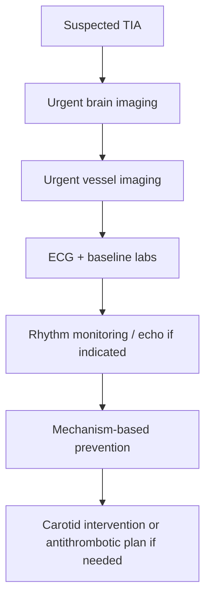

# Urgent imaging and vascular assessment in TIA

Related: [[../Stroke Medicine MOC|Stroke Medicine MOC]] · [[../Transient Ischaemic Attack|Transient Ischaemic Attack]] · [[TIA workup and immediate prevention|TIA workup and immediate prevention]] · [[Transient ischaemic attack]] · [[High-risk TIA features and early recurrence risk]] · [[../Secondary Prevention/Carotid stenosis and carotid endarterectomy indications|Carotid stenosis and carotid endarterectomy indications]]

> [!important]
> TIA workup is not “routine later imaging.” The key principle is **urgent brain imaging plus urgent vascular assessment**, because the patient may harbor a **severe symptomatic carotid lesion, intracranial stenosis, dissection, or cardioembolic source** that can cause stroke very soon.

## Learning Objectives
- State why imaging is urgent after suspected TIA.
- Choose the main brain and vascular imaging modalities.
- Interpret what each modality is trying to prove or exclude.
- Link imaging findings to immediate prevention decisions.

## Definition
**Urgent imaging and vascular assessment in TIA** means rapid investigation of the brain, extracranial and intracranial vessels, and relevant cardiovascular mechanism after a transient focal event suggestive of TIA.

## Why It Matters
- Symptoms may have resolved, but the vascular lesion may remain active.
- Imaging helps distinguish TIA from completed infarct, haemorrhage, mimic, and unstable arterial disease.
- Carotid intervention decisions depend on fast identification of symptomatic stenosis.

## Core Anatomy
### What to image
- **Brain parenchyma** → infarction, haemorrhage, alternative lesions
- **Extracranial carotid arteries** → plaque, stenosis, occlusion, dissection
- **Vertebral arteries** → posterior circulation disease, dissection
- **Intracranial vessels** → stenosis/occlusion
- **Heart** → cardioembolic source when relevant

## Core Physiology
Imaging and vascular assessment ask two linked physiological questions:
1. **Was there tissue injury?**
2. **What vascular or cardiac mechanism caused transient ischaemia?**

Finding the mechanism early permits targeted prevention.

## Main Modalities
### Brain imaging
- **Non-contrast CT brain**
  - fast, widely available
  - excludes haemorrhage and major alternative pathology
  - may be normal in TIA
- **MRI brain with diffusion-weighted imaging (DWI)**
  - more sensitive for small acute infarcts
  - identifies tissue-positive events that clinically looked like TIA

### Vascular imaging
- **Carotid duplex ultrasound**
  - good first test for extracranial carotid stenosis
- **CTA head and neck**
  - fast, good for extracranial + intracranial anatomy
- **MRA head and neck**
  - useful where available, especially if MRI is already planned

### Cardiac assessment
- **ECG** for AF or recent MI clues
- **Telemetry / rhythm monitoring** for paroxysmal AF
- **Echocardiography** when cardioembolism is suspected

## Important Findings to Look For
| Modality | Important yield |
|---|---|
| CT brain | haemorrhage, old infarct, mass lesion, mimic clues |
| MRI DWI | acute infarction despite transient symptoms |
| Carotid duplex/CTA/MRA | symptomatic carotid stenosis or occlusion |
| Vessel imaging | dissection, intracranial stenosis, vertebrobasilar disease |
| ECG/monitoring | AF or other arrhythmia |
| Echo | thrombus, valvular disease, major embolic source |

## Approach / Algorithm


## Investigation Package
### Immediate
- CT or MRI brain
- ECG
- CBC, glucose, creatinine, electrolytes
- Lipid profile, HbA1c

### Same-day / urgent mechanism workup
- Carotid duplex or CTA/MRA head-neck
- Rhythm monitoring if AF not already known
- Echocardiography when cardioembolic source suspected

## Interpretation Framework
### Brain imaging interpretation
- **Normal CT** does not exclude TIA.
- **Acute infarct on DWI** suggests a tissue-positive event, often practically managed more like minor stroke.
- **Haemorrhage** changes management completely.
- **Mass, subdural, or other lesion** redirects diagnosis.

### Vascular imaging interpretation
- Symptomatic high-grade carotid stenosis → urgent vascular referral.
- Dissection → mechanism changes age profile and treatment strategy.
- Posterior circulation abnormality → higher suspicion in transient brainstem events.
- Intracranial stenosis → intensive medical prevention usually emphasized.

## Diagnosis and Decision Points
Imaging answers the urgent TIA bedside questions:
- Is this definitely vascular?
- Is there already infarction?
- Is there severe carotid disease?
- Is there intracranial stenosis or dissection?
- Is cardioembolism likely?

## Management Implications
### If brain imaging is normal but story is convincing
- Still treat as TIA.
- Continue vascular/cardiac assessment.

### If DWI-positive lesion is found
- The event may be reclassified functionally as minor ischaemic stroke.
- Secondary prevention remains urgent.

### If severe symptomatic carotid stenosis is found
- Urgent carotid specialist referral.
- Antiplatelet/statin/BP strategy while planning intervention.

### If AF is detected
- Shift pathway toward anticoagulation planning rather than antiplatelet-only strategy.

## Drug / Comorbidity Cautions
- CTA contrast requires renal-function awareness.
- MRI may be limited by pacemaker/metal/clautrophobia depending on setup.
- Do not delay all imaging waiting for “perfect” modality; the practical exam answer is **rapid available brain + vessel imaging**.

## Red Flags / Emergencies
- Crescendo TIAs
- Retinal TIA with ipsilateral bruit
- Motor/speech deficit with carotid symptoms
- Posterior circulation symptoms with basilar concern
- Young patient with neck pain/headache suggesting dissection

## Topic Correlation
- [[High-risk TIA features and early recurrence risk]]
- [[Immediate antiplatelet strategy after TIA]]
- [[ABCD2 score and its limitations]]
- [[../Secondary Prevention/Carotid stenosis and carotid endarterectomy indications|Carotid stenosis and carotid endarterectomy indications]]
- [[../Secondary Prevention/Atrial fibrillation-related stroke prevention|Atrial fibrillation-related stroke prevention]]

## FCPS/MRCP High-Yield Points
- CT may be normal in TIA.
- MRI DWI can reveal tissue-positive lesions after transient symptoms.
- Carotid imaging is essential in anterior-circulation or retinal TIA.
- Cardioembolic search is crucial in AF-risk patients.
- Mechanism-based imaging changes prevention choice.

## One-Page Revision Summary
- Urgent TIA workup = **brain imaging + vessel imaging + ECG/rhythm assessment**.
- CT excludes haemorrhage quickly; MRI DWI detects small infarcts.
- Carotid duplex/CTA/MRA looks for symptomatic carotid disease.
- CTA/MRA/vertebral imaging matters in posterior circulation and dissection suspicion.
- Imaging is urgent because severe carotid stenosis or AF can lead to early completed stroke.

## 24-Hour Recall Prompts
- Why is CT alone not enough to exclude TIA?
- Name 3 key aims of vascular imaging after TIA.
- When is carotid imaging especially urgent?
- What does DWI positivity mean after a transient event?

## Must Know / Should Know / Nice to Know
### Must Know
- CT vs MRI roles
- carotid imaging importance
- AF detection and rhythm monitoring
### Should Know
- CTA/MRA choice logic
- dissection clues in young patients
### Nice to Know
- intracranial stenosis nuances and advanced imaging selection

## MCQs (10)
1. The main reason vascular imaging is urgent after TIA is to detect:  
   A. Chronic osteoarthritis  
   B. Dangerous treatable vascular pathology  
   C. Cataract  
   D. Epilepsy only  
   **Answer: B**

2. A normal CT brain after transient focal symptoms means:  
   A. TIA is excluded  
   B. Stroke risk is zero  
   C. TIA may still be present  
   D. Carotid imaging is unnecessary  
   **Answer: C**

3. The imaging modality most sensitive for small acute infarction after transient symptoms is:  
   A. Skull X-ray  
   B. MRI with DWI  
   C. EEG  
   D. Echocardiogram  
   **Answer: B**

4. In retinal TIA, a high-yield urgent test is:  
   A. Carotid imaging  
   B. Colonoscopy  
   C. Spirometry  
   D. Bone scan  
   **Answer: A**

5. ECG in TIA mainly screens for:  
   A. Atrial fibrillation  
   B. Pulmonary fibrosis  
   C. Renal artery stenosis  
   D. Hypothyroidism  
   **Answer: A**

6. CTA head and neck can help identify:  
   A. Carotid stenosis and dissection  
   B. Glaucoma  
   C. Nephrotic syndrome  
   D. Myasthenia gravis  
   **Answer: A**

7. DWI positivity after a transient event suggests:  
   A. Non-organic illness  
   B. Tissue injury despite transient symptoms  
   C. Peripheral nerve disease  
   D. Guaranteed haemorrhage  
   **Answer: B**

8. The best practical sequence in suspected TIA is:  
   A. Wait 3 months then image  
   B. Urgent brain and vascular imaging  
   C. Image only if symptoms recur  
   D. Start rehabilitation first  
   **Answer: B**

9. Severe symptomatic carotid stenosis on imaging mainly affects:  
   A. Need for urgent vascular referral  
   B. Asthma treatment  
   C. Diabetes diagnosis  
   D. Seizure classification  
   **Answer: A**

10. Which is false?  
   A. TIA imaging helps define mechanism  
   B. CT can be normal in TIA  
   C. Vessel imaging is irrelevant after symptom resolution  
   D. AF search is part of assessment  
   **Answer: C**

## SBA Questions (10)
1. A 71-year-old has transient right-sided weakness and speech difficulty, now resolved. Most appropriate initial workup?  
   A. Wait for recurrence  
   B. Urgent brain imaging plus carotid/vascular assessment  
   C. EEG only  
   D. Neck X-ray only  
   **Answer: B**

2. A patient with transient monocular blindness has a normal CT head. Best next step?  
   A. Discharge because CT is normal  
   B. Carotid imaging urgently  
   C. Diagnose migraine automatically  
   D. No further evaluation  
   **Answer: B**

3. A transient focal episode is DWI-positive on MRI. Best interpretation?  
   A. This excludes vascular disease  
   B. This supports acute ischaemic tissue injury  
   C. This proves seizure  
   D. This proves haemorrhage  
   **Answer: B**

4. A 62-year-old with TIA has irregularly irregular pulse. Which extra assessment is especially important?  
   A. Rhythm monitoring  
   B. Tympanometry  
   C. Skin biopsy  
   D. Pulmonary function test  
   **Answer: A**

5. A 35-year-old with TIA after neck pain needs urgent assessment for:  
   A. Carotid/vertebral dissection  
   B. Osteomalacia  
   C. Pancreatitis  
   D. Gout  
   **Answer: A**

6. The most suitable statement is:  
   A. MRI is always mandatory before any treatment  
   B. Practical care uses the fastest available brain + vessel imaging pathway  
   C. CT is useless in TIA  
   D. Imaging can wait if symptoms resolve  
   **Answer: B**

7. Which finding would most strongly change management toward urgent vascular intervention?  
   A. Severe symptomatic carotid stenosis  
   B. Mild sinus tachycardia  
   C. Chronic white-matter change  
   D. Borderline potassium  
   **Answer: A**

8. Why is echocardiography sometimes added after TIA?  
   A. To find cardioembolic source  
   B. To diagnose glaucoma  
   C. To grade COPD  
   D. To estimate bone age  
   **Answer: A**

9. If CT is normal but the history is strongly suggestive of TIA, the safest conclusion is:  
   A. TIA excluded  
   B. Continue urgent TIA evaluation  
   C. Diagnose syncope  
   D. Stop all further tests  
   **Answer: B**

10. The purpose of imaging in TIA is best summarized as:  
   A. Documentation only  
   B. Identify tissue injury and mechanism to guide immediate prevention  
   C. Replace clinical history entirely  
   D. Avoid specialist referral  
   **Answer: B**

## Flashcards
- Q: Can CT be normal in TIA?  
  A: Yes.
- Q: Which MRI sequence is most useful for small acute infarcts?  
  A: Diffusion-weighted imaging.
- Q: Which vessels are especially important in retinal/anterior circulation TIA?  
  A: Carotid arteries.
- Q: What arrhythmia must be sought in TIA?  
  A: Atrial fibrillation.
- Q: What young-patient clue suggests dissection?  
  A: Neck pain or headache with focal symptoms.
- Q: What does DWI positivity imply after transient symptoms?  
  A: Acute ischaemic tissue injury.
- Q: Name two vascular imaging options in TIA.  
  A: Carotid duplex and CTA/MRA.
- Q: Why is vascular imaging urgent?  
  A: To identify dangerous treatable stenosis/occlusion/dissection early.
- Q: Is symptom resolution enough reason to defer imaging?  
  A: No.
- Q: What is the purpose of echo in selected TIA patients?  
  A: To search for cardioembolic source.

## Answer Key with Explanations
- Brain imaging rules out haemorrhage and major mimics but may not prove TIA.
- MRI DWI increases sensitivity for tissue injury.
- Vessel imaging is central because mechanism-directed prevention depends on it.
- AF and other cardioembolic sources require rhythm/cardiac assessment.

---

## FCPS/MRCP High-Yield Summary

| Topic | Key Point |
|---|---|
| Best imaging modality | MRI brain with DWI + CTA head and neck |
| MRI DWI sensitivity for acute infarct | ~90% within 24 h |
| CT sensitivity for acute ischaemia | Low (< 50% in first 24 h) |
| Vascular imaging | CTA head and neck (or MRA) to identify stenosis/dissection |
| Carotid duplex | Best for extracranial carotid stenosis quantification |
| Time window for imaging | Within 24 h of TIA (ideally within 6 h) |
| ECG and rhythm monitoring | ECG at presentation + 24-h telemetry (or 7-day patch) |
| Echocardiography | TTE to look for LV thrombus, PFO, valve disease; TOE for LA appendage thrombus |
| Lab workup | Lipid panel, HbA1c, FBC, U&E, coagulation |
| CT vs MRI for TIA | MRI > CT (more sensitive for small infarcts) |

## Viva Questions
**Q1. Best imaging pathway for suspected TIA.**
> MRI brain with DWI (most sensitive for acute infarct) + CTA head and neck (or MRA) to identify stenosis/dissection. Carotid duplex for extracranial carotid stenosis. ECG and rhythm monitoring for AF.

**Q2. Why is MRI DWI preferred over CT for TIA?**
> MRI DWI is far more sensitive for small acute infarcts (~90% within 24 h vs < 50% for CT). DWI-positive TIA = re-classified as minor stroke; higher risk of recurrence.

**Q3. How urgent should imaging be?**
> Within 24 h of TIA. Many guidelines recommend within 6 h for high-risk TIA (ABCD2 ≥ 4). The EXPRESS and SOS-TIA studies showed that urgent evaluation and treatment reduces 90-day stroke risk by ~80%.

**Q4. What vascular imaging is needed?**
> CTA or MRA of head and neck (intracranial + extracranial vessels) to identify stenosis, dissection, or other causes. Carotid duplex is best for extracranial ICA stenosis quantification (NASCET/ECST criteria).

**Q5. Cardiac workup after TIA.**
> ECG at presentation + 24-h telemetry minimum. 7-day patch or implantable loop for paroxysmal AF. TTE to look for LV thrombus, PFO, valve disease. TOE if suspect aortic arch atheroma or LA thrombus.

## Confusions & Mnemonics
- **'TIA = warning sign'** — up to 23% of strokes are preceded by TIA; highest risk in first 48 h
- **'ABCD2 0-3 low / 4-5 mod / 6-7 high'** — risk stratification
- **'DWI+ TIA = minor stroke'** — re-classified by modern definition
- **'Migraine aura spreads (5-20 min); TIA sudden'** — different onset
- **'DAPT 21-30 days only'** — long-term increases bleeding
- **'AF → anticoagulation'** — DOAC preferred over warfarin

## Mind Map

```
Urgent imaging and vascular assessment in TIA
├── Definition
│   ├── Old: < 24 h resolution
│   └── New: tissue-based (no infarct)
├── Recognition
│   ├── Sudden focal deficit
│   └── Resolves < 24 h typically
├── Risk Stratification
│   ├── ABCD2 score
│   ├── ABCD3-I (with imaging)
│   └── DWI+ lesion
├── Investigation
│   ├── MRI DWI + CTA
│   ├── ECG + telemetry
│   └── Echo, lipids, HbA1c
├── Management
│   ├── Antiplatelet (aspirin or clopidogrel)
│   ├── DAPT for high-risk
│   ├── Anticoagulation if AF
│   └── Carotid endarterectomy if ≥ 50%
└── Mimics
    ├── Migraine (most common)
    ├── Seizure (Todd's paresis)
    ├── Syncope
    └── Hypoglycaemia
```

## One-Page Revision Card
| Step | Action |
|---|---|
| 1. Recognition | Sudden focal deficit, resolves |
| 2. Risk stratify | ABCD2 score |
| 3. Imaging | MRI DWI + CTA (within 24 h) |
| 4. Cardiac | ECG + 24-h telemetry |
| 5. Antiplatelet | Aspirin or clopidogrel |
| 6. If AF | Switch to DOAC |
| 7. If carotid ≥ 50% | Endarterectomy within 14 d |
| 8. Risk factor | BP, lipid, diabetes, smoking |

## Spaced Repetition Tracker
| Day | 1 | 3 | 7 | 15 | 30 |
|-----|---|---|---|----|----|
| Best imaging modality | ☐ | ☐ | ☐ | ☐ | ☐ |
| MRI DWI sensitivity for acute infarct | ☐ | ☐ | ☐ | ☐ | ☐ |
| CT sensitivity for acute ischaemia | ☐ | ☐ | ☐ | ☐ | ☐ |
| Vascular imaging | ☐ | ☐ | ☐ | ☐ | ☐ |
| Carotid duplex | ☐ | ☐ | ☐ | ☐ | ☐ |

## Self-Test Scorecard
| Question | My Answer | Correct? |
|----------|-----------|----------|
| Best imaging modality? |  |  |
| MRI DWI sensitivity for acute infarct? |  |  |
| CT sensitivity for acute ischaemia? |  |  |
| Vascular imaging? |  |  |
| Carotid duplex? |  |  |

## MCQs (10)
1. Best imaging for TIA?
   A) MRI brain with DWI + CTA
   B) **A**
   C) 
   D) 
   **Answer: A**

2. MRI DWI sensitivity for acute infarct?
   A) ~90% within 24 h
   B) **B**
   C) 
   D) 
   **Answer: A**

3. CT sensitivity for acute ischaemia in first 24 h?
   A) < 50%
   B) **C**
   C) 
   D) 
   **Answer: A**

4. Best for extracranial carotid stenosis?
   A) Carotid duplex
   B) **D**
   C) 
   D) 
   **Answer: A**

5. Time window for imaging after TIA?
   A) Within 24 h (ideally 6 h for high-risk)
   B) **A**
   C) 
   D) 
   **Answer: A**

6. ECG and rhythm monitoring?
   A) ECG + 24-h telemetry (or 7-d patch)
   B) **B**
   C) 
   D) 
   **Answer: A**

7. EXPRESS/SOS-TIA finding?
   A) Urgent evaluation ↓ 90-d stroke by ~80%
   B) **C**
   C) 
   D) 
   **Answer: A**

8. When to consider TOE?
   A) Suspect aortic arch atheroma or LA thrombus
   B) **D**
   C) 
   D) 
   **Answer: A**

9. DWI+ TIA re-classified as?
   A) Minor stroke
   B) **A**
   C) 
   D) 
   **Answer: A**

10. Carotid stenosis measurement method?
   A) NASCET / ECST criteria on CTA/MRA/duplex
   B) **B**
   C) 
   D) 
   **Answer: A**

## SBA Questions (10)
1. Best single imaging for suspected TIA? | MRI brain with DWI

2. Why prefer MRI over CT? | More sensitive for small acute infarcts

3. Time window for imaging? | Within 24 h (ideally 6 h for high-risk)

4. EXPRESS trial finding? | Urgent evaluation ↓ 90-d stroke

5. Best for extracranial ICA stenosis? | Carotid duplex

6. Why CTA or MRA? | Identify stenosis, dissection, occlusion

7. ECG at presentation and how long telemetry? | 24 h minimum; 7-d patch if high suspicion

8. When to do TOE? | Suspect aortic arch atheroma, LA thrombus, PFO

9. DWI+ TIA re-classified as? | Minor stroke

10. Symptomatic carotid stenosis — threshold for surgery? | ≥ 50% (NASCET)

## Flashcards
**Q: Best imaging?**
A: MRI DWI + CTA

**Q: DWI sensitivity (24h)?**
A: ~90%

**Q: CT sensitivity (24h)?**
A: < 50%

**Q: Carotid duplex?**
A: Extracranial ICA

**Q: Imaging window?**
A: 24 h (ideally 6 h)

**Q: ECG + telemetry?**
A: 24 h (or 7-d patch)

**Q: EXPRESS finding?**
A: Urgent eval ↓ 90-d stroke ~80%

**Q: TOE when?**
A: Aortic atheroma, LA thrombus

**Q: DWI+ TIA?**
A: Re-classify as minor stroke

**Q: Surgery threshold?**
A: ≥ 50% NASCET

## Answer Key with Explanations
### MCQs
1. **A** — Best imaging for TIA?
2. **A** — MRI DWI sensitivity for acute infarct?
3. **A** — CT sensitivity for acute ischaemia in first 24 h?
4. **A** — Best for extracranial carotid stenosis?
5. **A** — Time window for imaging after TIA?
6. **A** — ECG and rhythm monitoring?
7. **A** — EXPRESS/SOS-TIA finding?
8. **A** — When to consider TOE?
9. **A** — DWI+ TIA re-classified as?
10. **A** — Carotid stenosis measurement method?

### SBAs
1. **MRI brain with DWI**
2. **More sensitive for small acute infarcts**
3. **Within 24 h (ideally 6 h for high-risk)**
4. **Urgent evaluation ↓ 90-d stroke**
5. **Carotid duplex**
6. **Identify stenosis, dissection, occlusion**
7. **24 h minimum; 7-d patch if high suspicion**
8. **Suspect aortic arch atheroma, LA thrombus, PFO**
9. **Minor stroke**
10. **≥ 50% (NASCET)**

## Local Navigation

- [[../Transient Ischaemic Attack|Transient Ischaemic Attack]] (heading hub)
- [[Transient ischaemic attack]]
- [[High-risk TIA features and early recurrence risk]]
- [[TIA vs mimic differentiation]]
- [[Urgent imaging and vascular assessment in TIA]]
- [[Immediate antiplatelet strategy after TIA]]
- [[ABCD2 score and its limitations]]
- [[../Stroke Medicine MOC|Stroke Medicine MOC]]
