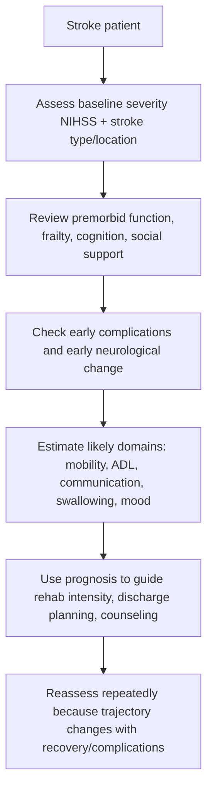

# Functional outcome prediction after stroke

Related: [[../Stroke Medicine MOC|Stroke Medicine MOC]] · [[../Recovery, Rehabilitation, and Prognosis|Recovery, Rehabilitation, and Prognosis]] · [[Long-term outcomes|Long-term outcomes]] · [[Stroke unit rehabilitation principles]] · [[Early mobilization and multidisciplinary recovery planning]]

> [!important]
> **Outcome prediction after stroke is probabilistic, not prophetic.** The exam pearl is to combine **baseline severity, age/frailty, stroke subtype/location, complications, and early functional recovery** rather than relying on one score alone.

## Learning Objectives
- Define functional outcome prediction after stroke.
- Identify the main determinants of recovery, dependence, and mortality.
- Use common bedside scales and practical prognostic markers appropriately.
- Explain how prognostic thinking guides counseling, rehabilitation intensity, and discharge planning.
- Recognize the ethical and clinical limits of early overconfident prediction.

## Definition
**Functional outcome prediction after stroke** is the structured estimation of likely survival, disability, independence, communication ability, swallowing safety, and long-term participation after stroke, using clinical severity, imaging, premorbid status, complications, and early recovery trajectory.

## Core Anatomy
Functional outcome depends on which networks are injured:
- **corticospinal pathways** → motor recovery and mobility
- **language networks** → communication independence
- **parietal-attentional networks** → neglect and safety awareness
- **brainstem pathways** → swallowing, alertness, cranial-nerve function
- **frontal-subcortical circuits** → planning, executive function, behavior
- **cerebellar systems** → coordination and balance

Small lesions in strategic sites can produce large disability, while larger lesions in non-eloquent regions may allow better independence than initially expected.

## Core Physiology
Recovery after stroke reflects:
- reperfusion and salvage of penumbra
- resolution of edema and diaschisis
- neuroplasticity and network reorganization
- intensity and timing of rehabilitation
- prevention of complications such as infection, immobility, and depression
- premorbid reserve: cognitive, physical, nutritional, and social

Therefore prognosis changes over time; it is not fixed at the moment of admission.

## Normal Values / Important Cut-offs
### Common severity and outcome anchors
- **NIHSS** practical severity frame:
  - 0–4: mild
  - 5–15: moderate
  - 16–20: moderate-severe
  - >20: severe
- **Modified Rankin Scale (mRS)**:
  - 0: no symptoms
  - 1: no significant disability
  - 2: slight disability
  - 3: moderate disability needing some help
  - 4: moderately severe disability
  - 5: severe disability, bedridden/incontinent/constant care
  - 6: death
- **Barthel Index** is often used to monitor ADL function over time.

### Practical prognostic cut-offs
- Higher NIHSS at baseline usually predicts worse functional independence.
- Early improvement over the first days strongly favors better outcome.
- Persistent dysphagia, dense hemiplegia, global aphasia, severe neglect, or reduced consciousness often predict slower and less complete recovery.

## Classification
### By outcome domain predicted
- mortality prediction
- physical dependency prediction
- cognitive/communication outcome prediction
- swallowing and feeding recovery prediction
- participation/return-to-work prediction

### By time horizon
- hyperacute prediction
- early inpatient rehabilitation prediction
- medium-term prediction (weeks to months)
- long-term community outcome prediction

## Etiology / Causes
This topic is not about stroke causation but about determinants of prognosis after ischemic stroke, intracerebral hemorrhage, or mixed stroke syndromes. Prognosis varies according to:
- stroke type
- lesion size and location
- success of reperfusion or hematoma stabilization
- complications
- premorbid reserve

## Risk Factors for Poor Functional Outcome
| Predictor | Why it matters |
|---|---|
| Advanced age/frailty | Lower physiological reserve, slower recovery |
| High NIHSS | Indicates greater initial neurological burden |
| Large infarct or large hemorrhage | More tissue damage and edema |
| Brainstem stroke / dominant hemisphere injury | Swallowing, consciousness, language impairment |
| Persistent dysphagia | Nutrition and aspiration problems delay rehabilitation |
| Severe neglect/cognitive impairment | Limits engagement and safety |
| Early complications | Infection, DVT, seizures, delirium worsen trajectory |
| Premorbid dependency | Less functional reserve to regain independence |
| Depression or low social support | Reduces rehabilitation participation |

## Pathophysiology
Poor functional outcome after stroke results from a combination of irreversible tissue loss, secondary injury, systemic complications, and reduced ability to engage in recovery. Initial stroke severity reflects the burden of network disruption. If edema, hemorrhagic transformation, infection, malnutrition, or immobility supervene, the deficit burden increases further. Conversely, reperfusion, resolution of diaschisis, intensive rehabilitation, and caregiver support improve functional reintegration.

## Clinical Features
### Features that suggest better prognosis
- mild initial deficit
- rapid early neurological improvement
- preserved cognition and motivation
- independent premorbid baseline
- early safe mobilization and swallowing recovery

### Features that suggest worse prognosis
- severe weakness or dense hemiplegia
- global aphasia
- persistent neglect
- severe dysphagia
- recurrent fever, pneumonia, or delirium
- prolonged immobility
- incontinence and poor trunk control early in course

## Approach / Algorithm

## Investigations
### Core prognostic inputs
- neurological examination and serial reassessment
- NIHSS at baseline and follow-up
- brain imaging defining stroke type, territory, edema, hemorrhage, mass effect
- swallow assessment
- cognition/communication assessment
- mobility and ADL assessment by rehabilitation team

### Additional supportive investigations
- labs identifying infection, dehydration, metabolic derangement
- ECG/echo where cardioembolic burden affects recurrence risk more than immediate function
- depression screening and functional assessment scales

## Interpretation Frameworks
### Practical bedside prognosis frame
1. **How severe was the initial stroke?**
2. **What functional systems are affected?** motor, language, cognition, swallowing, continence
3. **Is the patient improving in the first 24–72 hours?**
4. **Are complications blocking recovery?**
5. **What was the premorbid baseline?**
6. **What support exists for rehabilitation after discharge?**

### Domain-based prediction frame
| Domain | Key predictors |
|---|---|
| Mobility | motor power, trunk control, neglect, balance |
| ADL independence | motor deficit + cognition + social support |
| Communication | aphasia severity, comprehension, lesion site |
| Feeding | dysphagia severity, brainstem involvement |
| Return to work | age, cognition, residual deficit, job demands |

## Diagnosis
This is a prognostic assessment rather than a disease diagnosis. A useful chart statement is:
> Stroke survivor with moderate-severe early disability and high care needs, but some early motor recovery; prognosis is guarded short term but there is realistic rehabilitation potential.

## Differential Diagnosis
When “poor prognosis” appears obvious, reconsider reversible confounders:
- delirium
- sedation
- infection
- postictal state
- metabolic disturbance
- depression/apathy reducing participation
- untreated pain or urinary retention limiting mobilization

## Tables / Comparison Charts
### Good vs poor prognostic signals
| Feature | Better outcome signal | Poorer outcome signal |
|---|---|---|
| Initial severity | low NIHSS | high NIHSS |
| Early course | rapid improvement | deterioration or no improvement |
| Swallowing | early oral safety | persistent dysphagia |
| Cognition | preserved attention | severe neglect/confusion |
| Mobility | early sitting/standing potential | persistent dense weakness |
| Complications | absent/minimal | pneumonia, DVT, delirium |

### Premorbid and social modifiers
| Modifier | Effect on prognosis |
|---|---|
| Independent baseline | improves chance of return home |
| Frailty/dependency | lowers recovery ceiling |
| Strong caregiver support | improves rehab implementation |
| Social isolation | worsens discharge complexity |
| Pre-existing dementia | lowers cognitive recovery potential |

## Management
### What to do with prognostic information
- set realistic but non-defeatist goals
- choose appropriate rehabilitation intensity
- identify barriers that are modifiable
- guide discharge planning and caregiver preparation
- revisit prediction regularly

### Modifiable factors that improve outcome
- early stroke-unit care
- complication prevention
- dysphagia and nutrition management
- mobilization and multidisciplinary rehabilitation
- mood recognition and treatment
- secondary prevention adherence

### Communication principles
- avoid absolute statements too early
- distinguish **probability** from certainty
- discuss best-case, expected, and worst-case scenarios when appropriate
- align prognosis discussions with patient values and premorbid function

## Drug Interactions / Contraindications / Comorbidity Cautions
- Sedation may falsely worsen apparent prognosis.
- Infection, hypoglycemia, electrolyte disorders, and hypotension can mimic irreversible deterioration.
- Severe depression after stroke may make functional progress appear less than true neurological capacity.
- Frailty, heart failure, COPD, and renal disease reduce rehabilitation tolerance even with similar neurological deficits.

## Procedures / Indications / Contraindications
- **Serial functional scoring**
  - indication: track trajectory rather than single-point judgment
- **Multidisciplinary rehabilitation review**
  - indication: all patients with meaningful post-stroke disability
- **Family prognostic conference**
  - indication: complex discharge planning, severe disability, uncertain expectations

## Procedure Mini-Sections
### NIHSS trend review
- **Indication:** quantify neurological severity over time.
- **Value:** better for trend than isolated labeling.
- **Viva pearl:** a falling NIHSS is often more informative than one static number.

### mRS framing
- **Indication:** describe overall disability burden.
- **Value:** useful for long-term functional outcome language.
- **Viva pearl:** mRS describes dependence, not lesion anatomy.

## Complications
- inappropriate nihilism causing under-rehabilitation
- unrealistic optimism causing unsafe discharge planning
- caregiver burnout
- prolonged institutionalization
- missed depression or cognitive decline
- preventable decline from pneumonia, DVT, malnutrition, falls

## Red Flags / Emergencies
- worsening neurological status after initial stabilization
- malignant edema or hemorrhagic transformation
- aspiration pneumonia or sepsis
- recurrent stroke/TIA
- severe depression or suicidality
- major immobility complications such as DVT/PE or pressure injury

## Prognosis
- Mild strokes with early improvement often have good functional recovery.
- Severe strokes, large hemorrhages, major language/cognitive deficits, and persistent dysphagia worsen independence prospects.
- Nevertheless, even initially severe patients may gain meaningful function with rehabilitation, especially when complications are prevented and social support is strong.
- Prognosis should be updated repeatedly across the first days, weeks, and months.

## Topic Correlation
- [[Stroke unit rehabilitation principles]] explains how organized rehabilitation improves outcome.
- [[Early mobilization and multidisciplinary recovery planning]] affects discharge destination and independence.
- [[Persistent dysphagia and nutrition planning]] is a key prognostic modifier.
- [[Post-stroke depression and emotional change]] strongly affects functional participation and quality of life.

## Special Situations
### Young patient with severe stroke
- mortality may be lower than in older frail patients
- but return-to-work and cognitive expectations are high, so subtle deficits matter more

### Elderly frail patient
- even moderate deficits may prevent return to baseline independence
- goals may focus on safe transfers, feeding, comfort, and caregiver sustainability

### Dominant-hemisphere stroke
- communication disability may dominate the long-term burden even when walking improves

### Brainstem stroke
- mobility may be relatively preserved in some, but swallowing, cranial nerve deficits, and respiratory issues can dominate prognosis

## FCPS/MRCP High-Yield Points
- Prognosis is driven strongly by **initial severity + early trajectory + complications + premorbid reserve**.
- Use **NIHSS** for severity and **mRS** for disability framing.
- Severe dysphagia, aphasia, neglect, and immobility worsen outcome.
- Avoid premature “poor prognosis” labels before reversible confounders are corrected.
- Outcome prediction guides rehabilitation planning, not just family counseling.

## Common Viva Questions
- Which factors most strongly predict poor functional outcome after stroke?
- Why is early improvement important prognostically?
- How do NIHSS and mRS differ?
- Why can early prognosis be misleading?
- How does social support change practical outcome?

## Common Confusions / Exam Traps
- Using one score as the entire prognosis.
- Confusing mortality prediction with independence prediction.
- Ignoring premorbid frailty and caregiver context.
- Declaring permanent disability too early in a patient with treatable complications.
- Forgetting that dysphagia and depression meaningfully alter long-term function.

## Mnemonics
**OUTCOME** prognostic frame:
- **O**riginal severity
- **U**pward or downward early trend
- **T**ype and territory of stroke
- **C**omplications
- **O**ld baseline function
- **M**ood and cognition
- **E**nvironment/support

## Mind Map
- Functional outcome prediction after stroke
  - baseline
    - NIHSS
    - stroke type/site
    - age/frailty
  - modifiers
    - dysphagia
    - aphasia
    - neglect
    - complications
  - supports
    - rehab
    - caregiver support
    - secondary prevention
  - outputs
    - ADL independence
    - mobility
    - communication
    - return home/work

## Flowchart

## Suggested Visuals / Image Notes
- Simple diagram comparing NIHSS severity bands with likely dependency burden
- mRS ladder from 0 to 6
- domain-based prognostic framework graphic: motor, speech, cognition, swallow, support

## Suggested Video References
- NIHSS bedside scoring overview
- mRS and Barthel functional outcome teaching videos
- stroke rehabilitation prognosis and goal-setting discussions

## One-Page Revision Summary
- Outcome prediction after stroke is multidimensional and dynamic.
- Strong poor-outcome predictors: high NIHSS, large lesion, brainstem/dominant hemisphere involvement, persistent dysphagia, severe neglect, pneumonia, frailty, premorbid dependency.
- Good signs: mild deficit, early improvement, preserved cognition, early mobilization, safe swallow, strong support.
- NIHSS describes neurological severity; mRS describes disability burden.
- Reassess prognosis repeatedly; do not make irreversible assumptions too early.
- Prognosis should guide rehab goals, discharge planning, and counseling.

## 24-Hour Recall Prompts
- Name 6 major predictors of poor functional outcome after stroke.
- What is the difference between NIHSS and mRS?
- Why can early prognosis be falsely pessimistic?
- How do dysphagia and depression modify functional outcome?
- How would you explain prognosis to a family without overpromising?

## 7-Day / 15-Day / 30-Day Revision Tracker
- **7 days:** write the OUTCOME mnemonic from memory.
- **15 days:** compare good vs poor prognostic signs without notes.
- **30 days:** explain a full bedside prognostic framework in 2 minutes.

## Must Know / Should Know / Nice to Know
### Must Know
- baseline severity matters
- early improvement matters
- NIHSS vs mRS
- complications and premorbid function modify outcome

### Should Know
- role of Barthel and domain-specific functional review
- effect of social support and mood
- need for serial rather than static prediction

### Nice to Know
- detailed predictive models and research nomograms
- advanced neuroplasticity theories

## My Weak Points
- Am I relying too much on one score?
- Do I remember to assess premorbid function and caregiver support?
- Do I actively look for reversible confounders before labeling prognosis poor?

## Self-Test Scorecard
- Prognostic factor recall /10
- Scale interpretation /10
- Counseling confidence /10
- Rehab-planning confidence /10
- Viva readiness /10

## Exam Answer Modes
### Short note angle
Define functional outcome prediction after stroke, list major prognostic factors, explain key scales, and mention how prognosis guides counseling and rehabilitation.

### Viva angle
“I predict outcome after stroke by combining initial severity, lesion characteristics, premorbid function, early improvement, complications, and support systems. I use scores like NIHSS and mRS, but I reassess serially because prognosis evolves.”

## Summary
Functional outcome prediction after stroke is a practical, serial clinical judgment rather than a fixed declaration. Initial stroke severity, lesion characteristics, premorbid reserve, swallowing and cognitive status, systemic complications, and rehabilitation engagement all shape long-term independence. Good prognosis work avoids both nihilism and false reassurance, and it directly improves rehabilitation planning, discharge decisions, and family counseling.

## MCQs (10)
1. The single most consistently useful early predictor of functional outcome after stroke is:
   - A. Hair color
   - B. Initial stroke severity
   - C. Occupation alone
   - D. Season of admission
   - E. Serum bilirubin alone

2. Which scale is most associated with describing global disability after stroke?
   - A. GCS
   - B. CURB-65
   - C. Modified Rankin Scale
   - D. Wells score
   - E. CHA2DS2-VASc

3. A favorable prognostic sign is:
   - A. Persistent severe dysphagia
   - B. Recurrent pneumonia
   - C. Early neurological improvement
   - D. Premorbid dependency
   - E. Severe neglect

4. Which factor commonly worsens functional recovery because it reduces rehabilitation participation?
   - A. Post-stroke depression
   - B. Preserved cognition
   - C. Early mobilization
   - D. Family support
   - E. Mild NIHSS

5. NIHSS is most useful for:
   - A. Describing long-term social reintegration only
   - B. Quantifying neurological severity
   - C. Measuring kidney function
   - D. Diagnosing pneumonia
   - E. Predicting blood glucose

6. Which statement is most correct?
   - A. Prognosis should be fixed on admission and never revised
   - B. One score alone defines the whole outcome
   - C. Prognosis should be reassessed as recovery and complications evolve
   - D. Social support does not matter
   - E. Mild strokes always return to work immediately

7. Which combination suggests poorer outcome?
   - A. Mild deficit + rapid improvement
   - B. High NIHSS + persistent dysphagia + frailty
   - C. Strong caregiver support + preserved cognition
   - D. Early mobilization + stable swallow
   - E. Small non-eloquent infarct + no complications

8. Modified Rankin Scale 5 means:
   - A. No symptoms
   - B. Slight disability only
   - C. Moderate disability needing some help
   - D. Severe disability requiring constant care
   - E. Death

9. A reversible confounder that can falsely worsen apparent prognosis is:
   - A. Sedation
   - B. Early rehabilitation
   - C. Family involvement
   - D. Speech therapy
   - E. Reperfusion

10. Prognostic discussion is most useful for:
   - A. Avoiding all rehabilitation
   - B. Guiding goals, discharge planning, and counseling
   - C. Replacing neurological examination
   - D. Determining only medicolegal blame
   - E. Deciding skull fracture severity

## SBA Questions (10)
1. A 68-year-old woman with moderate stroke improves noticeably over 48 hours and begins mobilizing with assistance. Which statement is most accurate?
   - A. Early improvement favors better functional outcome
   - B. Prognosis must still be considered hopeless
   - C. Functional prediction cannot change after admission
   - D. mRS is irrelevant
   - E. Rehabilitation intensity should be reduced

2. A 79-year-old frail man with severe stroke, persistent dysphagia, and pneumonia is being assessed for discharge planning. Which feature most strongly worsens functional prognosis?
   - A. Strong social support
   - B. Mild NIHSS
   - C. Persistent dysphagia with medical complications
   - D. Rapid early improvement
   - E. Independent premorbid baseline

3. Which scale best communicates overall disability level to a rehabilitation team?
   - A. mRS
   - B. APGAR
   - C. Child-Pugh
   - D. Wells score
   - E. Rockall score

4. A patient appears profoundly disabled on day 2, but is septic, dehydrated, and heavily sedated. What is the key prognostic principle?
   - A. Declare irreversible poor outcome immediately
   - B. Correct reversible confounders before finalizing prediction
   - C. Ignore the examination
   - D. Stop rehabilitation permanently
   - E. Use only age to predict outcome

5. Why does premorbid function matter?
   - A. It predicts lesion side
   - B. It influences how much independence can realistically be regained
   - C. It replaces imaging
   - D. It only matters in young patients
   - E. It has no role once NIHSS is known

6. A patient with preserved motor power but severe aphasia may still have poor functional independence because:
   - A. Language does not affect function
   - B. Communication deficits can greatly limit daily independence and participation
   - C. Aphasia only matters acutely
   - D. Aphasia guarantees death
   - E. Speech therapy is never useful

7. Which bedside finding would make you more optimistic about outcome?
   - A. Dense neglect with no improvement
   - B. Recurrent aspiration pneumonia
   - C. Progressive early motor recovery
   - D. Severe premorbid dependency
   - E. Large hemorrhage with mass effect

8. Which statement about social support is best?
   - A. It is irrelevant if imaging is available
   - B. It changes practical discharge destination and rehab implementation
   - C. It only matters in psychiatric disease
   - D. It always guarantees full recovery
   - E. It replaces formal assessment scales

9. A family asks for prognosis on day 1 after severe stroke. Best response?
   - A. Give absolute certainty immediately
   - B. Explain likely risks and uncertainty, then promise serial reassessment
   - C. Refuse all discussion
   - D. Use one score only and ignore clinical context
   - E. State that rehabilitation is pointless

10. Which of the following best summarizes functional outcome prediction after stroke?
   - A. A static diagnosis
   - B. A serial multidomain clinical judgment
   - C. An imaging-only exercise
   - D. A psychiatry-only issue
   - E. A laboratory-only calculation

## Flashcards
- Q: Most consistent early predictor of stroke functional outcome?
  A: Initial stroke severity.
- Q: Which scale describes global disability after stroke?
  A: Modified Rankin Scale.
- Q: Which scale quantifies neurological severity?
  A: NIHSS.
- Q: Name two poor prognostic modifiers after stroke.
  A: Persistent dysphagia and recurrent pneumonia.
- Q: Why is early improvement important?
  A: It strongly suggests better recovery potential.
- Q: Why must prognosis be reassessed serially?
  A: Recovery and complications change the trajectory.
- Q: Does premorbid frailty matter?
  A: Yes, it lowers functional reserve and recovery ceiling.
- Q: Can aphasia worsen long-term independence even if walking improves?
  A: Yes.
- Q: Give one reversible confounder that may falsely worsen prognosis.
  A: Sedation.
- Q: Why does caregiver support matter?
  A: It affects rehabilitation implementation and discharge destination.

## Answer Key with Explanations
### MCQs
1. **B** — Initial neurological severity is one of the strongest overall predictors.
2. **C** — mRS is the standard broad disability scale.
3. **C** — Early neurological improvement is a favorable sign.
4. **A** — Depression reduces participation and worsens functional recovery.
5. **B** — NIHSS quantifies stroke severity.
6. **C** — Prognosis evolves and must be updated.
7. **B** — Severe stroke, dysphagia, and frailty together imply poorer outcome.
8. **D** — mRS 5 indicates severe disability needing constant care.
9. **A** — Sedation can make a patient look worse than their true neurological baseline.
10. **B** — Prognostic work guides goals, counseling, and discharge planning.

### SBAs
1. **A** — Early improvement is a favorable prognostic sign.
2. **C** — Dysphagia plus complications meaningfully worsens function.
3. **A** — mRS summarizes disability burden.
4. **B** — Reversible confounders must be corrected before strong conclusions.
5. **B** — Premorbid function influences realistic recovery ceiling.
6. **B** — Language deficits can heavily impair independence.
7. **C** — Early motor recovery is an encouraging sign.
8. **B** — Social support shapes practical outcome and discharge.
9. **B** — Honest uncertainty with serial reassessment is best.
10. **B** — Functional outcome prediction is a serial multidomain judgment.
