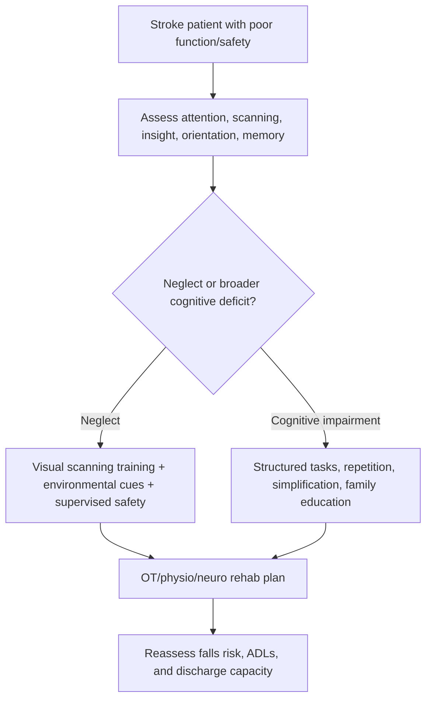
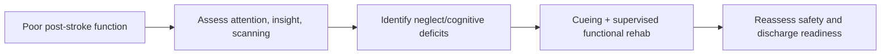

# Neglect and cognitive impairment after stroke

Related: [[../Stroke Medicine MOC|Stroke Medicine MOC]] · [[../Recovery, Rehabilitation, and Prognosis|Recovery, Rehabilitation, and Prognosis]] · [[Communication and swallowing sequelae|Communication and swallowing sequelae]] · [[Aphasia after stroke]] · [[Persistent dysphagia and nutrition planning]]

> [!important]
> **Neglect is not just weakness and not just visual loss.** The exam pearl is that a patient may have preserved strength yet still ignore one side of the body or space, making rehabilitation, feeding, dressing, transfer safety, and discharge planning much harder.

## Learning Objectives
- Define neglect and post-stroke cognitive impairment.
- Distinguish neglect from hemianopia, aphasia, and simple weakness.
- Recognize common cognitive deficits after stroke.
- Outline bedside assessment and rehabilitation implications.
- Summarize safety issues and prognosis.

## Definition
- **Neglect (hemispatial neglect)** is failure to attend to one side of the body or external space, most often after nondominant-hemisphere stroke.
- **Post-stroke cognitive impairment** includes deficits in attention, executive function, memory, visuospatial function, processing speed, or insight that arise after stroke and impair independence.

## Core Anatomy
- Neglect is classically linked to **right parietal or right frontoparietal** lesions causing left-sided neglect.
- Cognitive deficits may follow lesions in:
  - frontal networks → executive dysfunction
  - parietal networks → visuospatial inattention
  - subcortical white-matter circuits → slowed processing
  - large bilateral or strategic strokes → broader cognitive decline
- Right-hemisphere strokes tend to produce more severe spatial neglect than left-sided lesions.

## Core Physiology
- Attention and spatial awareness depend on distributed cortical networks integrating sensory input, body schema, visual exploration, and executive monitoring.
- Stroke disrupts these attention networks, so the patient may not orient, scan, or respond to one side of space.
- Cognitive impairment after stroke may reflect direct tissue loss, disconnection of functional networks, fatigue, depression, and impaired processing speed.

## Normal Values / Important Cut-offs
- A patient who repeatedly collides with objects on one side, ignores food on one half of the plate, or leaves one sleeve unworn may have neglect.
- Inattention can be more disabling for function than mild weakness.
- Poor insight into deficit is common and raises falls risk.
- Cognitive screening should cover attention, orientation, executive function, memory, and visuospatial ability.

## Classification
### Neglect subtypes
- personal neglect
- peripersonal neglect
- extrapersonal neglect
- sensory/visual-spatial neglect
- motor/intentional neglect

### Cognitive impairment domains
- attention deficit
- executive dysfunction
- memory impairment
- visuospatial impairment
- slowed processing speed
- reduced insight/judgment

## Etiology / Causes
- Right MCA territory stroke
- Right parietal cortical infarction
- Large right hemispheric hemorrhage/infarction
- Strategic frontal-subcortical strokes
- Multi-infarct or recurrent cerebrovascular disease

## Risk Factors
| Risk factor | Why it matters |
|---|---|
| Right hemisphere stroke | Classic neglect setting |
| Large cortical infarct | Greater network disruption |
| Advanced age | Higher vulnerability to cognitive decline |
| Prior cerebrovascular disease | Less reserve |
| Depression/fatigue | Worsens cognitive performance |
| Sensory loss or visual field deficit | Can compound disability |

## Pathophysiology
Neglect arises from disruption of attentional networks that orient the patient toward space and body representation. The patient may fail to search, recognize, or act toward one side despite preserved primary sensation or motor ability. Post-stroke cognitive impairment reflects broader network injury affecting attention, executive function, memory, and processing speed. Poor awareness of deficit worsens safety because the patient may attempt transfers or walking beyond actual ability.

## Clinical Features
### Neglect clues
- ignores one side of room, tray, or body
- eats from only one half of plate
- shaves/dresses only one side
- collides with objects on one side
- fails to use one limb despite some preserved power
- poor visual scanning to neglected side

### Cognitive impairment clues
- distractibility
- slowed thinking
- poor planning or sequencing
- impaired judgment/insight
- memory complaints
- difficulty following multi-step tasks

### Practical bedside examples
- wheelchair veers to one side
- patient denies weakness despite obvious deficit
- leaves one arm hanging dangerously during transfers

## Approach / Algorithm

## Investigations
### Core assessment
- bedside attention and orientation assessment
- extinction/inattention testing
- line bisection / cancellation / clock drawing where feasible
- cognitive screening (attention, memory, executive function)
- brain imaging for stroke localization

### Functional assessment
- dressing and feeding observation
- transfer and wheelchair safety
- ability to follow commands and complete multistep tasks
- insight/capacity review when relevant

## Interpretation Frameworks
### Neglect bedside frame
1. Does the patient **attend to both sides** of space/body?
2. Is the problem due to **visual field loss** or true inattention?
3. Is there **poor insight**?
4. How does this affect feeding, dressing, transfers, walking, and discharge?

### Neglect vs common look-alikes
| Problem | Key clue |
|---|---|
| Neglect | inattention to one side despite available sensory input |
| Hemianopia | field cut; patient may compensate if prompted |
| Weakness alone | awareness preserved though movement reduced |
| Aphasia | language problem rather than spatial inattention |
| Delirium | fluctuating global attention disturbance |

## Diagnosis
Diagnosis is mainly clinical, based on demonstrable inattention and/or cognitive dysfunction after stroke, supported by lesion localization. Practical diagnoses include:
- left hemispatial neglect after right MCA stroke
- post-stroke executive dysfunction
- mixed visuospatial and attentional cognitive impairment after cortical stroke

## Differential Diagnosis
- hemianopia
- delirium
- severe aphasia limiting task performance
- depression/apathy
- pre-existing dementia
- medication or metabolic encephalopathy

## Tables / Comparison Charts
### Neglect vs hemianopia
| Feature | Neglect | Hemianopia |
|---|---|---|
| Primary problem | inattention | visual field loss |
| Awareness | often poor insight | may know field is missing |
| Cueing | may improve but often inconsistent | compensation often possible |
| Functional impact | feeding/dressing/transfer errors | visual scanning difficulty |

### Functional consequences of cognitive impairment after stroke
| Domain affected | Practical problem |
|---|---|
| attention | easily distracted, unsafe mobility |
| executive function | poor planning/judgment |
| memory | forgets instructions/medication |
| visuospatial | transfer and navigation difficulty |
| insight | underestimates risk |

## Management
### Core principles
- detect neglect and cognition problems early
- involve OT, physiotherapy, speech/cognitive rehab as needed
- simplify the environment and instructions
- use supervision and cueing for safety
- educate family/caregivers

### Neglect-specific strategies
- visual scanning training
- placing cues/targets on neglected side
- encouraging head and eye turning toward neglected side
- structured practice during feeding, grooming, and dressing

### Cognitive-support strategies
- one-step instructions
- repetition and routine
- written/pictorial cues when possible
- supervised medication and discharge planning
- mood and fatigue management

## Drug Interactions / Contraindications / Comorbidity Cautions
- Sedatives and anticholinergic burden may worsen cognition.
- Depression, sleep disturbance, and fatigue can magnify cognitive deficits.
- Poor insight increases risk of unsupervised unsafe mobilization.
- Capacity for consent and complex decisions may be impaired and should be assessed carefully.

## Procedures / Indications / Contraindications
- **OT cognitive/functional assessment:** indicated in neglect or executive dysfunction.
- **Scanning and cue-based therapy:** indicated in neglect.
- **Caregiver training:** indicated when safety awareness is poor.
- **Formal neuropsychologic assessment:** useful in selected persistent or complex cases.

## Procedure Mini-Sections
### Plate and grooming cueing strategy
- **Indication:** neglect affecting feeding or self-care.
- **Goal:** force attention toward neglected space.
- **Pearl:** functional bedside cueing may reveal the deficit more clearly than abstract testing.

### Transfer-safety supervision
- **Indication:** poor insight, neglect, or executive dysfunction.
- **Goal:** prevent falls and equipment accidents.
- **Pearl:** cognition often limits safe discharge more than motor power alone.

## Complications
- falls and transfer injury
- poor feeding/nutrition
- dressing and hygiene failure
- prolonged rehabilitation
- unsafe discharge attempts
- depression and caregiver stress
- reduced return to work/independence

## Red Flags / Emergencies
- severe neglect causing repeated falls or transfer accidents
- profound poor insight with unsafe wandering/mobilization
- rapidly worsening confusion suggesting delirium or new stroke rather than static deficit
- inability to take nutrition/medication safely because of neglect/cognition failure

## Prognosis
- Mild attentional deficits may improve substantially with recovery and training.
- Severe neglect, poor insight, and large right hemispheric strokes often predict slower rehabilitation.
- Cognitive impairment can persist even when motor recovery improves, so functional outcome may remain limited.

## Topic Correlation
- [[Aphasia after stroke]]
- [[Persistent dysphagia and nutrition planning]]
- [[../Stroke Recognition and Clinical Assessment/Anterior vs posterior circulation stroke clues|Anterior vs posterior circulation stroke clues]]
- [[../Acute Ischaemic Stroke/Middle cerebral artery stroke|Middle cerebral artery stroke]]

## Special Situations
- **Neglect plus hemianopia:** especially disabling.
- **Poor insight with preserved strength:** very high falls risk.
- **Elderly patient with prior small-vessel disease:** cognitive reserve may already be reduced.
- **Depression or apathy:** may mimic or worsen cognitive impairment.

## FCPS/MRCP High-Yield Points
- Neglect is an **attention/spatial-awareness disorder**, not just weakness.
- Right hemisphere strokes classically cause **left neglect**.
- Neglect can impair feeding, dressing, transfers, wheelchair use, and discharge safety.
- Cognitive impairment after stroke commonly affects attention and executive function.
- OT-led functional strategies and supervision are central to care.

## Common Viva Questions
- What is hemispatial neglect?
- How do you distinguish neglect from hemianopia?
- Why is neglect particularly disabling in rehabilitation?
- What cognitive domains are commonly affected after stroke?
- How does poor insight change management?

## Common Confusions / Exam Traps
- Assuming the patient is “lazy” or “not trying.”
- Confusing neglect with pure visual field loss.
- Judging discharge readiness by motor power alone.
- Missing executive dysfunction in a patient who seems conversationally normal.
- Forgetting caregiver education and supervision needs.

## Mnemonics
- **NEGLECT = Not Exploring Given Left/External Cues Totally**
- **SCAN** for rehab:
  - **S**upervise
  - **C**ue the neglected side
  - **A**ssess insight
  - **N**ormalize routines

## Mind Map
- Neglect/cognition after stroke
  - neglect
    - left side usually after right stroke
    - feeding/dressing errors
    - poor scanning
  - cognition
    - attention
    - executive function
    - memory
    - visuospatial ability
  - assess
    - bedside tasks
    - cancellation/clock
    - functional observation
  - manage
    - OT
    - cueing
    - supervision
    - caregiver training

## Flowchart

## Suggested Visuals / Image Notes
- Plate/room neglect illustration.
- Neglect vs hemianopia comparison table.
- Functional OT checklist for post-stroke cognition.

## Suggested Video References
- Bedside neglect examination tutorial.
- OT strategies for spatial neglect after stroke.
- Post-stroke cognitive assessment teaching session.

## One-Page Revision Summary
### Neglect and cognitive impairment after stroke in one page
- **Neglect:** inattention to one side, usually left after right hemispheric stroke.
- **Cognition:** attention, executive function, memory, visuospatial processing may all be impaired.
- **Clues:** misses food on one side, collides with objects, poor insight, unsafe transfers.
- **Differentiate from:** hemianopia, weakness, aphasia, delirium.
- **Management:** OT assessment, scanning training, cueing, supervision, caregiver education.
- **Pearl:** cognition may determine discharge safety more than power alone.

## 24-Hour Recall Prompts
- Define neglect.
- How do you distinguish neglect from hemianopia?
- Name 4 functional consequences of neglect.
- Which cognitive domains commonly fail after stroke?
- Why is poor insight dangerous?

## 7-Day / 15-Day / 30-Day Revision Tracker
- **Day 7:** recall neglect vs hemianopia table.
- **Day 15:** practice a bedside neglect assessment script.
- **Day 30:** explain why cognition affects discharge destination.

## Must Know / Should Know / Nice to Know
### Must Know
- neglect = spatial inattention
- right hemisphere -> left neglect
- affects feeding/dressing/transfers
- poor insight is dangerous
- OT/cueing/supervision are central

### Should Know
- personal vs peripersonal vs extrapersonal neglect
- executive dysfunction as common post-stroke deficit
- capacity/discharge implications

### Nice to Know
- detailed neuropsychology batteries and advanced visuospatial rehab methods

## My Weak Points
- Do I confuse neglect with visual loss?
- Do I assess cognition even when motor recovery looks good?
- Do I account for poor insight in discharge planning?

## Self-Test Scorecard
- Localization recall /10
- Bedside differentiation /10
- Functional implication recall /10
- Management recall /10
- Viva confidence /10

## Exam Answer Modes
### Short note skeleton
- Definition
- Causes/localization
- Clinical features
- Neglect vs hemianopia
- Management and prognosis

### Viva answer skeleton
- Neglect is failure to attend to one side, classically left after right stroke.
- It differs from hemianopia because the issue is inattention, not just a field cut.
- Post-stroke cognition commonly affects attention and executive function.
- Functional observation is as important as formal testing.
- OT strategies, cueing, and supervision improve safety.

## Summary
Neglect and cognitive impairment after stroke are major determinants of rehabilitation difficulty, falls risk, and discharge safety. The key clinical task is to recognize that poor function may reflect inattention, executive dysfunction, or poor insight rather than weakness alone, then build a cue-based supervised rehabilitation plan around those deficits.

## MCQs (10)
1. Hemispatial neglect is best defined as:
   - A. Pure visual field loss only
   - B. Failure to attend to one side of body or space
   - C. Slurred speech only
   - D. Memory loss only
   - E. Peripheral neuropathy
2. Neglect is classically associated with:
   - A. Right hemisphere stroke causing left neglect
   - B. Left cerebellar infarct only
   - C. Peripheral vestibular disease
   - D. Lumbar radiculopathy
   - E. Bell palsy
3. A patient eats only food from the right half of the plate after stroke. This most strongly suggests:
   - A. Neglect
   - B. Gastritis
   - C. Hepatic failure
   - D. Pure dysarthria
   - E. Otitis media
4. Which is a key distinction between neglect and hemianopia?
   - A. Neglect is inattention; hemianopia is field loss
   - B. They are always identical
   - C. Hemianopia affects only memory
   - D. Neglect affects only articulation
   - E. Neither affects rehabilitation
5. Which cognitive domain is commonly impaired after stroke?
   - A. Executive function
   - B. Hair pigmentation
   - C. Foot size estimation only
   - D. Tooth enamel
   - E. Earwax production
6. Poor insight after stroke matters because it:
   - A. Reduces falls risk
   - B. Makes unsafe transfers and discharge more likely
   - C. Guarantees full recovery
   - D. Prevents aphasia completely
   - E. Is irrelevant to rehab
7. Which specialist input is especially important for neglect/cognitive functional assessment?
   - A. Occupational therapy
   - B. Dentistry
   - C. Dermatology
   - D. Urology
   - E. Ophthalmology only
8. Which statement is most correct?
   - A. Motor power alone determines discharge safety
   - B. Neglect may be more disabling than mild weakness
   - C. Cognitive deficits never affect feeding
   - D. Right hemisphere stroke never causes neglect
   - E. Cueing has no value
9. Which bedside task can help reveal neglect?
   - A. Clock drawing or cancellation testing
   - B. Spirometry
   - C. Audiogram only
   - D. Peak flow
   - E. ECG alone
10. The best summary principle is:
   - A. Ignore cognition if CT confirms stroke
   - B. Assess attention, insight, and function early after stroke
   - C. Treat neglect as laziness
   - D. Neglect never improves
   - E. Supervision is unnecessary

## SBA Questions (10)
1. A 72-year-old woman repeatedly leaves food untouched on the left side of the tray and bumps her wheelchair into doorframes on the left. What is the most likely diagnosis?
   - A. Left hemispatial neglect
   - B. Pure dysarthria
   - C. Bell palsy
   - D. Ménière disease
   - E. Tension headache
2. A stroke patient can see moving fingers in the left field when specifically cued but otherwise ignores the left side of space. What does this favor?
   - A. Neglect rather than pure hemianopia
   - B. Complete blindness
   - C. Migraine aura
   - D. Myasthenia gravis
   - E. Peripheral neuropathy
3. A patient insists he can transfer independently despite repeated unsafe attempts and poor scanning. What contributing feature is most important?
   - A. Poor insight/executive dysfunction
   - B. Perfect judgment
   - C. Hyperacusis
   - D. Otitis externa
   - E. Varicose veins
4. Which team member is most likely to lead practical dressing, feeding, and environmental cue strategies?
   - A. Occupational therapist
   - B. Orthopedic surgeon
   - C. Dermatologist
   - D. Rheumatologist
   - E. Nephrologist
5. Which lesion location most classically produces severe left neglect?
   - A. Right parietal/frontoparietal stroke
   - B. Left median nerve lesion
   - C. Lumbar root compression
   - D. Right ulnar neuropathy
   - E. Cochlear lesion
6. A patient has normal limb power but still fails to use the left side during grooming. What does this illustrate?
   - A. Neglect can impair function beyond weakness alone
   - B. Power fully predicts independence
   - C. Stroke has resolved completely
   - D. It must be malingering
   - E. It proves cerebellar disease only
7. Which broad management principle is best?
   - A. Use cueing, supervision, and structured functional rehab
   - B. Allow unsupervised wandering to encourage confidence
   - C. Avoid caregiver teaching
   - D. Ignore plate-positioning strategies
   - E. Base discharge only on muscle strength
8. Which cognitive consequence of stroke most affects multistep planning and judgment?
   - A. Executive dysfunction
   - B. Pure hearing loss
   - C. Otalgia
   - D. Alopecia
   - E. Astigmatism
9. A patient with neglect repeatedly forgets medication instructions and safety advice. What is the best next practical step?
   - A. Simplify instructions and involve supervision/caregivers
   - B. Give longer verbal lectures rapidly
   - C. Assume full independent capacity automatically
   - D. Remove all rehabilitation input
   - E. Ignore the issue if walking improves
10. What is the key exam phrase for this topic?
   - A. Neglect is just weakness
   - B. Cognition and insight may determine function more than motor power alone
   - C. Hemianopia and neglect are always identical
   - D. OT has no role in stroke rehab
   - E. Discharge planning does not depend on cognition

## Flashcards
- Q: What is neglect?
  A: Failure to attend to one side of body or space after stroke.
- Q: Which hemisphere classically causes left neglect?
  A: Right hemisphere.
- Q: Name one bedside clue to neglect.
  A: Ignores half the plate, collides with one side, dresses one side only.
- Q: Neglect vs hemianopia?
  A: Neglect is inattention; hemianopia is field loss.
- Q: Name 3 cognitive domains commonly affected after stroke.
  A: Attention, executive function, memory, visuospatial processing.
- Q: Why is poor insight dangerous?
  A: It causes unsafe transfers, falls, and poor discharge judgment.
- Q: Which specialist is central for functional cueing strategies?
  A: Occupational therapist.
- Q: Can a patient have neglect with reasonable power?
  A: Yes.
- Q: One key management principle?
  A: Cueing plus supervision.
- Q: What often determines discharge safety more than power alone?
  A: Cognition and insight.

## Answer Key with Explanations
### MCQs
1. **B** — neglect is spatial/body inattention.
2. **A** — classic pattern is right hemisphere stroke causing left neglect.
3. **A** — plate neglect is high-yield.
4. **A** — this is the key distinction.
5. **A** — executive function is commonly affected.
6. **B** — poor insight increases unsafe behavior.
7. **A** — OT is central for functional assessment and cueing strategies.
8. **B** — neglect can be highly disabling even with mild weakness.
9. **A** — clock/cancellation tasks are classic bedside tools.
10. **B** — attention, insight, and function should be assessed early.

### SBAs
1. **A** — classic left neglect after right hemispheric stroke.
2. **A** — cueable field awareness suggests neglect rather than pure field cut.
3. **A** — poor insight/executive dysfunction drives unsafe behavior.
4. **A** — OT commonly leads these practical strategies.
5. **A** — right parietal/frontoparietal lesions are classic.
6. **A** — neglect can impair use despite preserved strength.
7. **A** — supervised cue-based rehab is correct.
8. **A** — executive dysfunction affects planning and judgment.
9. **A** — simplify and supervise rather than overestimate independence.
10. **B** — cognition and insight often determine real-world outcome.