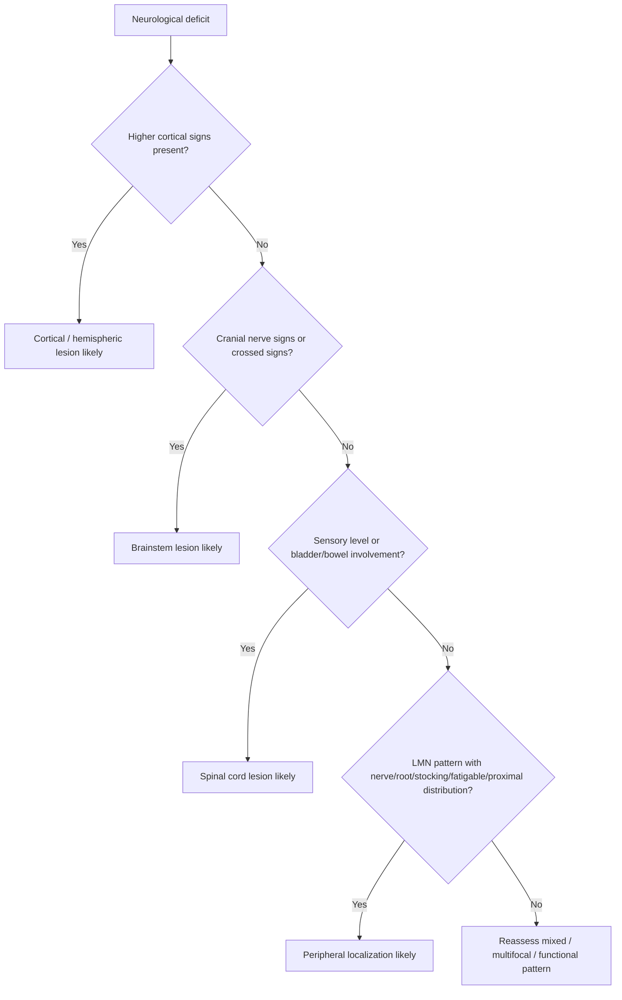

# Cortical vs brainstem vs spinal vs peripheral pattern

Related: [[../Neurology MOC|Neurology MOC]] · [[../Clinical Examination of the Nervous System|Clinical Examination of the Nervous System]] · [[Pattern recognition]] · [[UMN vs LMN pattern]] · [[Cranial nerve examination]] · [[Sensory system examination]] · [[Coordination, cerebellar signs, gait, and stance]]

> [!important]
> High-level neurological localization often begins by deciding whether the syndrome is **cortical, brainstem, spinal cord, or peripheral**. This single step narrows the differential dramatically and guides the correct urgent investigation.

> [!tip]
> In FCPS/MRCP answers, do not just name signs. Build a localization sentence: **“This is an UMN-pattern deficit with aphasia and homonymous hemianopia, therefore a cortical hemisphere lesion is most likely.”**

## Learning Objectives
- Distinguish **cortical**, **brainstem**, **spinal cord**, and **peripheral** neurological patterns.
- Link symptom clusters to relevant neuroanatomy.
- Use motor, sensory, cranial nerve, gait, bowel/bladder, and higher-function findings to localize lesions.
- Recognize emergency red flags such as raised ICP, cord compression, and posterior fossa/brainstem compromise.
- Avoid common localization traps in exam cases.

## Definition
This topic is a **pattern-recognition framework** used to localize a neurological lesion by combining:
- higher cortical features
- cranial nerve findings
- long-tract motor signs
- sensory level or sensory distribution
- cerebellar/brainstem clues
- reflex pattern
- sphincter/autonomic features
- distribution of weakness and wasting

## Relevant Neuroanatomy
### Cortical localization
The cerebral cortex is responsible for:
- language dominance, usually left hemisphere
- praxis, cortical sensory integration, executive function
- voluntary motor planning and cortical visual processing
- cortical seizure generation

Important cortical regions:
- **frontal lobe**: motor cortex, expressive language, behavior, gaze centers
- **parietal lobe**: sensory integration, neglect, cortical sensory loss
- **temporal lobe**: memory, language comprehension, focal seizures
- **occipital lobe**: visual processing and visual field defects

### Brainstem localization
The brainstem contains:
- cranial nerve nuclei III-XII
- ascending sensory tracts
- descending corticospinal tracts
- cerebellar connections
- autonomic and consciousness-related networks

Therefore brainstem lesions often produce **crossed signs**: ipsilateral cranial nerve deficits with contralateral limb deficits.

### Spinal cord localization
The cord contains:
- corticospinal tracts
- spinothalamic tracts
- dorsal columns
- segmental LMN/anterior horn cells
- autonomic pathways for bladder, bowel, sexual function

Cord lesions typically spare higher cortical function and usually spare cranial nerves.

### Peripheral localization
Peripheral lesions may involve:
- anterior horn cell
- root
- plexus
- peripheral nerve
- neuromuscular junction
- muscle

These cause LMN-pattern weakness with distribution clues such as dermatomal, myotomal, nerve-specific, glove-and-stocking, proximal myopathic, or fatigable NMJ patterns.

## Relevant Neurophysiology
### Why localization works
Neurological signs arise because specific pathways are organized anatomically:
- cortex integrates complex conscious functions
- brainstem links cranial nerve function with long tracts
- spinal cord produces sensory levels and long-tract syndromes
- peripheral structures determine focal or diffuse LMN patterns

### Long-tract logic
- corticospinal tract lesion → weakness, pyramidal signs
- dorsal column lesion → loss of vibration/proprioception
- spinothalamic lesion → pain/temperature loss
- cranial nerve nucleus/fascicle lesion → localized brainstem clue

## Normal Values / Important Cut-offs
Localization is pattern-based rather than threshold-based, but key bedside practical points include:
- **Aphasia** implies dominant cortical dysfunction, not spinal or peripheral disease.
- **Sensory level** strongly suggests spinal cord pathology.
- **Crossed cranial nerve and limb signs** suggest brainstem lesion until proven otherwise.
- **Peripheral glove-and-stocking sensory loss** suggests polyneuropathy rather than cortical or cord disease.
- New **urinary retention with bilateral leg weakness** is a spinal emergency until excluded.

## Classification
### Four major localization patterns
1. **Cortical / hemispheric pattern**
2. **Brainstem pattern**
3. **Spinal cord pattern**
4. **Peripheral pattern**

### Peripheral pattern subtypes
1. anterior horn cell
2. root/radiculopathy
3. plexopathy
4. mononeuropathy or polyneuropathy
5. neuromuscular junction disorder
6. myopathy

## Etiology / Causes
### Cortical causes
- tumour
- abscess
- encephalitis
- focal epilepsy with post-ictal deficit
- subdural collection
- traumatic contusion
- inflammatory or demyelinating disease affecting cerebrum

### Brainstem causes
- demyelination
- posterior fossa tumour
- encephalitis
- compressive lesion
- inflammatory disorders
- cranial neuropathy syndromes with central extension

### Spinal cord causes
- compressive myelopathy
- transverse myelitis
- demyelination
- spondylotic cord compression
- epidural abscess or haematoma
- tumour/metastatic compression

### Peripheral causes
- peripheral neuropathy
- entrapment neuropathy
- radiculopathy
- plexopathy
- motor neuron disease
- Guillain-Barré syndrome and CIDP
- myasthenia gravis
- inflammatory/toxic/metabolic myopathy

## Risk Factors
- malignancy history
- recent infection or autoimmune disease
- diabetes and alcohol excess
- immunosuppression
- trauma
- anticoagulation if epidural or intracranial bleed possible
- cervical/thoracic pain with cord symptoms
- toxin/drug exposure
- family history for inherited neuropathy or myopathy

## Pathophysiology
### Cortical lesions
Cause loss of complex integrated function: language, cortical sensation, praxis, visual interpretation, focal seizures.

### Brainstem lesions
Disrupt cranial nerve nuclei/fascicles plus ascending/descending tracts, producing mixed cranial + limb findings.

### Spinal lesions
Interrupt longitudinal tracts below a defined level; often create bilateral motor/sensory symptoms and autonomic dysfunction.

### Peripheral lesions
Damage final motor/sensory pathways leading to flaccid weakness, reflex loss, muscle wasting, or nerve-distribution sensory loss.

## Clinical Features

## Cortical Pattern
### Core clues
- aphasia or dysphasia
- neglect, apraxia, agnosia
- cortical sensory loss: astereognosis, graphesthesia impairment
- homonymous hemianopia or cortical visual symptoms
- focal seizures
- gaze deviation
- personality or executive dysfunction
- contralateral face/arm/leg weakness often in a hemispheric pattern

### Localization pearls
- **Face and arm > leg** suggests lateral cortical region.
- **Leg > face and arm** suggests parasagittal frontal region.
- **Aphasia** suggests dominant hemisphere.
- **Neglect** suggests non-dominant parietal dysfunction.

## Brainstem Pattern
### Core clues
- diplopia, dysarthria, dysphagia
- vertigo, nystagmus
- facial weakness or numbness
- crossed findings: ipsilateral cranial nerve signs with contralateral weakness/sensory loss
- ataxia with cranial nerve signs
- reduced consciousness or abnormal respiratory pattern in severe cases

### Localization pearls
- Multiple cranial nerves involved together strongly suggest skull base or brainstem disease.
- Long-tract signs plus cranial nerve palsy are classic for brainstem lesions.
- Brainstem disorders may mimic peripheral vestibular disease unless central clues are looked for.

## Spinal Cord Pattern
### Core clues
- bilateral weakness below a level
- sensory level on trunk
- UMN signs below lesion with possible LMN signs at lesion level
- bladder, bowel, or sexual dysfunction
- band-like trunk sensation or back pain
- Lhermitte-type symptoms in some conditions

### Localization pearls
- arm and leg involvement with no cortical signs and no cranial nerve deficit suggests cervical cord.
- isolated leg involvement with sensory level and bladder symptoms suggests thoracic cord.
- acute back pain + progressive deficit = consider compression.

## Peripheral Pattern
### Core clues
- LMN weakness
- reduced or absent reflexes
- muscle wasting/fasciculations in neurogenic disease
- sensory loss in nerve/root/stocking distribution
- cranial function usually normal unless specific cranial neuropathy/NMJ disease
- no cortical signs
- bowel/bladder usually spared until very advanced autonomic neuropathy or cauda equina-related pathology

### Peripheral sub-patterns
#### Root
- radicular pain
- dermatomal sensory loss
- myotomal weakness
- reduced corresponding reflex

#### Plexus
- multiple nerves in one limb distribution
- pain may be prominent

#### Peripheral nerve
- focal nerve territory deficit, e.g. wrist drop, foot drop, median neuropathy

#### Polyneuropathy
- symmetric distal sensory > motor symptoms
- ankle jerks often lost early

#### Neuromuscular junction
- fatigable weakness
- ocular/bulbar prominence
- sensation normal

#### Muscle
- proximal weakness
- sensation preserved
- reflexes preserved until late/severe weakness

## Approach / Algorithm

### Bedside localization sequence
1. Confirm the deficit is neurological.
2. Decide **UMN vs LMN vs mixed**.
3. Look for **higher cortical signs**.
4. Examine **cranial nerves** for brainstem clues.
5. Search for **sensory level** and **sphincter dysfunction**.
6. Define the sensory and motor distribution.
7. Consider whether more than one site is involved.

## Investigations
### If cortical lesion suspected
- MRI brain preferred when stable
- CT head in emergency settings
- EEG if seizure-related presentation
- blood tests and inflammatory/infective workup as guided

### If brainstem lesion suspected
- urgent MRI brain with posterior fossa assessment if available
- CT initially if acute deterioration or raised ICP concern
- focused cranial nerve and cerebellar examination
- CSF if inflammatory/infective cause suspected and safe

### If spinal lesion suspected
- urgent **MRI spine**
- inflammatory, infectious, autoimmune, malignant workup as indicated
- bladder assessment and post-void residual if retention suspected

### If peripheral lesion suspected
- nerve conduction studies / EMG when appropriate
- CK, thyroid, B12, glucose, renal/liver profile depending on pattern
- MRI root/plexus if compressive or infiltrative suspicion
- antibody tests for NMJ disease where relevant

## Interpretation Frameworks

## Interpretation Framework 1: Higher function
| Feature | Meaning | Localization implication |
|---|---|---|
| Aphasia | Dominant hemisphere dysfunction | Cortical |
| Neglect | Non-dominant parietal dysfunction | Cortical |
| Apraxia | Motor planning deficit | Cortical |
| Seizure aura/focal seizure | Cortical irritative lesion | Cortical |

## Interpretation Framework 2: Cranial nerve plus long tract
| Finding cluster | Likely site |
|---|---|
| Diplopia + facial weakness + contralateral limb weakness | Brainstem |
| Dysphagia/dysarthria + limb ataxia | Brainstem/posterior fossa |
| Vertigo + nystagmus + limb UMN signs | Brainstem/cerebellar central process |

## Interpretation Framework 3: Sensory pattern
| Sensory pattern | Likely site |
|---|---|
| Hemisensory loss with cortical signs | Cortex/thalamocortical pathway |
| Sensory level on trunk | Spinal cord |
| Dermatomal | Root |
| Peripheral nerve territory | Mononeuropathy |
| Stocking-glove | Polyneuropathy |

## Interpretation Framework 4: Motor pattern
| Motor pattern | Likely site |
|---|---|
| Contralateral UMN weakness with aphasia | Cortex |
| Crossed weakness and CN signs | Brainstem |
| Bilateral leg spasticity with sensory level | Spinal cord |
| Distal wasting/areflexia | Peripheral neuropathy/anterior horn/root |
| Fatigable ptosis and diplopia | NMJ |
| Proximal limb-girdle weakness | Muscle |

## Diagnosis
This is not a single disease diagnosis but a **localization diagnosis** built from clinical syndrome recognition.

Good diagnostic phrasing:
- “The pattern is cortical because there is aphasia, contralateral face-arm weakness, and homonymous visual field loss.”
- “The pattern is brainstem because there are crossed signs with diplopia and contralateral hemiparesis.”
- “The pattern is spinal because there is bilateral leg weakness, a sensory level, and urinary retention.”
- “The pattern is peripheral because there is distal symmetrical sensory loss with areflexia and no cranial or cortical signs.”

## Differential Diagnosis
### Cortical mimics
- functional neurological disorder
- post-ictal Todd paresis
- migraine aura
- metabolic encephalopathy with focal exaggeration

### Brainstem mimics
- severe peripheral vestibular disease
- neuromuscular junction disease causing bulbar symptoms
- skull base cranial neuropathies

### Spinal mimics
- bilateral peripheral neuropathy
- cauda equina syndrome (peripheral, not cord)
- functional gait disorder

### Peripheral mimics
- central lesions with acute flaccidity early on
- disuse weakness
- metabolic myopathy
- functional weakness

## Tables / Comparison Charts

## Quick Comparison Table
| Feature | Cortical | Brainstem | Spinal cord | Peripheral |
|---|---|---|---|---|
| Higher cortical signs | Present | Absent | Absent | Absent |
| Cranial nerve findings | May occur (supranuclear) | Common | Usually absent | Usually absent except cranial neuropathy/NMJ |
| Crossed signs | No | Classic | No | No |
| Sensory level | No | No | Yes | No |
| Bladder/bowel early involvement | Uncommon except major lesions | Possible if severe | Common | Usually no |
| Reflexes | Often brisk | Often brisk | Brisk below lesion | Reduced/absent |
| Wasting/fasciculations | Late/disuse | Usually no | Segmental at lesion | Common in LMN disorders |
| Seizures | May occur | Rare primary clue | No | No |

## Red-Flag Comparison Table
| Pattern | Emergency diagnosis not to miss |
|---|---|
| Cortical | mass lesion, encephalitis, raised ICP |
| Brainstem | posterior fossa lesion, central vertigo syndrome, impending airway compromise |
| Spinal | acute cord compression, epidural abscess/haematoma, transverse myelitis |
| Peripheral | Guillain-Barré syndrome, cauda equina syndrome, myasthenic crisis |

## Management
### Immediate principle
Management depends on the suspected localization because localization directs imaging and escalation.

### Cortical pattern management priorities
- urgent brain imaging if acute/new deficit
- seizure management if relevant
- assess consciousness and raised ICP
- consider infection/inflammation workup when appropriate

### Brainstem pattern management priorities
- admit and monitor airway/swallowing
- urgent MRI/CT depending acuity and access
- neuro-observation for respiratory deterioration
- look for cerebellar/posterior fossa mass effect

### Spinal pattern management priorities
- urgent spinal imaging
- immobilization/precautions if trauma possible
- urinary retention assessment
- urgent neurology/neurosurgical input for compression

### Peripheral pattern management priorities
- identify level: root, plexus, nerve, NMJ, muscle
- arrange neurophysiology when needed
- treat reversible metabolic/toxic causes
- monitor respiratory function if generalized weakness or bulbar symptoms

## Drug Interactions / Contraindications / Comorbidity Cautions
- Sedatives may cloud localization by suppressing examination findings.
- Steroids should not be given reflexly without considering infection, lymphoma, or diagnostic effects, although they may be urgently indicated in some compressive/inflammatory states.
- In suspected myasthenia, avoid drugs that worsen NMJ transmission when possible.
- Renal/hepatic failure may mimic peripheral or encephalopathic states and also change drug choice.

## Procedures / Indications / Contraindications
### Lumbar puncture
Indicated only if infective/inflammatory CNS pathology suspected and imaging/clinical state allow.

Contraindications/cautions:
- suspected raised ICP with mass effect
- focal signs suggesting space-occupying lesion until imaging reviewed
- cardiorespiratory instability

### MRI spine
Urgent when spinal localization with compression is possible.

## Procedure Mini-Sections
### Swallow screening
- **Indication:** brainstem/bulbar symptoms
- **Reason:** aspiration prevention
- **Complication if missed:** aspiration pneumonia, respiratory compromise

### Bladder scan
- **Indication:** leg weakness with possible cord involvement
- **Reason:** detects retention and severity
- **Pearl:** retention strongly supports spinal/cauda equina localization and urgency

## Complications
- missed cord compression → permanent paralysis/incontinence
- missed posterior fossa lesion → rapid deterioration and airway compromise
- missed encephalitis/space-occupying lesion → seizures, coma, herniation
- missed GBS/NMJ crisis → respiratory failure

## Red Flags / Emergencies
- reduced consciousness with focal signs
- cranial nerve deficits with dysphagia or respiratory compromise
- acute bilateral leg weakness with urinary retention
- severe back pain with progressive neurological deficit
- papilloedema, vomiting, Cushing response, or herniation concern
- rapidly ascending weakness or bulbar weakness

## Prognosis
Prognosis depends on the underlying disease rather than the localization label. However, **rapid accurate localization improves prognosis** by shortening time to correct imaging, specialty referral, and urgent treatment.

## Topic Correlation
- [[UMN vs LMN pattern]]
- [[Root vs plexus vs peripheral nerve]]
- [[Neuromuscular junction vs muscle]]
- [[Cranial nerve palsy patterns]]
- [[Myelopathy pattern]]
- [[Linking imaging to localization]]

## Special Situations
### Elderly patient
May have mixed pathology: cortical neurodegeneration plus peripheral neuropathy or cervical myelopathy.

### Diabetic patient
Peripheral neuropathy may obscure a new spinal or cortical syndrome; do not attribute all symptoms to diabetes.

### ICU/sedated patient
Examination may be limited; use reflexes, pupils, motor asymmetry, and imaging strategically.

### Functional overlap
Some presentations are inconsistent and may suggest FND, but organic emergencies must be excluded first.

## FCPS/MRCP High-Yield Points
- Aphasia = cortex.
- Crossed signs = brainstem.
- Sensory level + bladder symptoms = spinal cord until proven otherwise.
- Distal areflexic symmetrical pattern = peripheral neuropathy.
- Fatigable ocular/bulbar weakness with normal sensation = NMJ.
- Proximal weakness with preserved sensation = myopathy.

## Common Viva Questions
- Which signs suggest a cortical lesion rather than a spinal lesion?
- What are crossed signs?
- Why do brainstem lesions produce cranial nerve findings?
- How do you recognize a sensory level?
- How do root, nerve, NMJ, and muscle weakness differ clinically?

## Common Confusions / Exam Traps
- Confusing **brainstem vertigo** with benign peripheral vestibular disease.
- Missing a **sensory level** because the trunk was not examined.
- Labeling bilateral leg weakness as peripheral without checking sphincters and tone.
- Calling every speech problem “aphasia”; dysarthria and aphasia localize differently.
- Forgetting that **acute UMN lesions can initially appear flaccid**.

## Mnemonics
### Cortex–Brainstem–Cord–Peripheral quick cue
**“Think: Mind, Face, Level, Nerve.”**
- **Mind** signs → cortex
- **Face** plus crossed signs → brainstem
- **Level** and bladder → cord
- **Nerve** distribution/areflexia → peripheral

## Mind Map
- Neurological localization
  - Cortical
    - aphasia
    - neglect
    - seizures
    - visual field loss
  - Brainstem
    - cranial nerves
    - crossed signs
    - dysphagia/diplopia
    - ataxia
  - Spinal
    - sensory level
    - bilateral weakness
    - bladder/bowel
    - UMN below level
  - Peripheral
    - LMN signs
    - areflexia
    - nerve/root pattern
    - distal or proximal distribution

## Suggested Visuals / Image Notes
- Simple neuroaxis diagram showing cortex → brainstem → spinal cord → root/nerve/NMJ/muscle
- Table showing characteristic symptom clusters by site
- Tract diagram for corticospinal, dorsal column, and spinothalamic localization

## Suggested Video References
- Bedside neurological localization tutorials
- Cranial nerve examination videos
- Myelopathy vs neuropathy clinical differentiation videos

## One-Page Revision Summary
### Localization anchors
- **Cortical:** aphasia, neglect, seizures, visual field defect, cortical sensory loss
- **Brainstem:** cranial nerve deficits + crossed limb signs, diplopia, dysphagia, ataxia
- **Spinal:** sensory level, bilateral long-tract signs, bladder/bowel involvement, back pain
- **Peripheral:** LMN weakness, reflex loss, distal sensory loss, nerve/root/NMJ/muscle patterns

### Most useful exam questions
1. Are higher cortical functions affected?
2. Are cranial nerves involved?
3. Is there a sensory level?
4. Are reflexes brisk or absent?
5. Is the pattern hemibody, crossed, bilateral below level, or nerve distribution?

### Emergencies
- brainstem airway/swallow compromise
- posterior fossa compression
- acute cord compression
- GBS/myasthenic respiratory failure
- mass lesion with raised ICP

## Recall Prompts
### 24-hour recall prompts
- List four signs that suggest a cortical lesion.
- What combination strongly suggests a brainstem lesion?
- What bedside clue most strongly suggests spinal cord disease?
- How do polyneuropathy and myopathy differ clinically?
- Explain crossed signs in one sentence.

### 7-day / 15-day / 30-day revision tracker
- **7 days:** localize 5 sample cases from memory.
- **15 days:** redraw the quick comparison table without notes.
- **30 days:** explain cortical vs brainstem vs spinal vs peripheral localization in 3 minutes.

## Must Know / Should Know / Nice to Know
### Must Know
- aphasia/neglect/seizure = cortical
- crossed signs = brainstem
- sensory level + sphincters = spinal
- distal areflexia/LMN = peripheral

### Should Know
- root vs plexus vs nerve vs NMJ vs muscle distinctions
- why acute UMN lesions may start flaccid
- posterior fossa danger signs

### Nice to Know
- finer syndromic sublocalization by exact lobe or tract pattern

## My Weak Points
- Which localization mistakes do I make repeatedly?
- Do I remember to examine trunk sensation and sphincters?
- Do I separate aphasia from dysarthria correctly?

## Self-Test Scorecard
- Localization logic /10
- Cranial nerve integration /10
- Sensory pattern recognition /10
- Emergency recognition /10
- Viva confidence /10

Interpretation:
- **<35/50** = weak
- **35-44/50** = acceptable
- **45+/50** = strong exam readiness

## Exam Answer Modes
### Short note
Define the four patterns, list distinguishing clinical clues, and mention one emergency diagnosis for each.

### Viva mode
Start with the localization hierarchy: higher cortical signs, cranial nerves, sensory level, reflex pattern, distribution.

### Ward-case mode
Use a single-sentence localization summary before giving differentials.

## Summary
Neurological localization becomes faster and safer when you classify syndromes into **cortical, brainstem, spinal, or peripheral** patterns. Higher cortical signs point to cortex, crossed cranial and long-tract signs to brainstem, sensory level and sphincter dysfunction to cord, and LMN distribution clues to the peripheral nervous system.

## MCQs (10)
1. A patient with aphasia and right face-arm weakness most likely has a lesion in the:
   - A. Cervical spinal cord
   - B. Left cerebral hemisphere
   - C. Peripheral nerve
   - D. Neuromuscular junction
   - E. Muscle

2. Crossed neurological signs are most characteristic of a lesion in the:
   - A. Cortex
   - B. Brainstem
   - C. Thoracic cord
   - D. Peripheral nerve
   - E. Muscle

3. Bilateral leg weakness with a sensory level and urinary retention most strongly suggests:
   - A. Myopathy
   - B. Polyneuropathy
   - C. Spinal cord lesion
   - D. Frontal lobe lesion
   - E. Functional disorder only

4. Which feature most favors cortical rather than peripheral localization?
   - A. Areflexia
   - B. Distal wasting
   - C. Aphasia
   - D. Glove-and-stocking sensory loss
   - E. Fasciculations

5. Which finding most favors peripheral neuropathy?
   - A. Homonymous hemianopia
   - B. Sensory level
   - C. Crossed facial and limb signs
   - D. Distal symmetrical sensory loss with absent ankle jerks
   - E. Neglect

6. Diplopia with ipsilateral facial weakness and contralateral hemiparesis suggests:
   - A. Brainstem lesion
   - B. Cortical lesion
   - C. Peripheral nerve lesion only
   - D. Thoracic myelopathy
   - E. Myopathy

7. Which statement about spinal cord lesions is most accurate?
   - A. They commonly cause aphasia
   - B. They usually produce cranial nerve deficits
   - C. They may cause a sensory level and bladder dysfunction
   - D. They always cause LMN signs only
   - E. They never cause pain

8. Fatigable ptosis with normal sensation localizes best to:
   - A. Cortex
   - B. Spinal cord
   - C. Neuromuscular junction
   - D. Peripheral sensory nerve
   - E. Parietal lobe

9. Which is a common exam trap?
   - A. Recognizing a sensory level
   - B. Separating aphasia from dysarthria
   - C. Checking plantar responses
   - D. Considering bladder involvement in leg weakness
   - E. Using localization before diagnosis

10. Acute back pain with progressive bilateral leg weakness should prompt urgent exclusion of:
   - A. Tension headache
   - B. Cord compression
   - C. Migraine aura
   - D. BPPV
   - E. Bell palsy

## SBA Questions (10)
1. A 63-year-old man presents with sudden speech difficulty, right facial droop, and right arm weakness. He has no sensory level or bladder symptoms. The best localization is:
   - A. Left cerebral hemisphere
   - B. Cervical cord
   - C. Right brachial plexus
   - D. Neuromuscular junction
   - E. Lumbar root

2. A 40-year-old woman has diplopia, dysarthria, left facial numbness, and right-sided limb weakness. The most likely lesion site is:
   - A. Left frontal lobe
   - B. Brainstem
   - C. Thoracic cord
   - D. Peripheral nerve
   - E. Muscle

3. A 52-year-old patient reports progressive leg stiffness, a tight band around the trunk, and urinary urgency. Examination shows brisk knee jerks and extensor plantars. Most likely localization:
   - A. Cortex
   - B. Brainstem
   - C. Spinal cord
   - D. Polyneuropathy
   - E. Myopathy

4. A 58-year-old diabetic has numb feet, burning pain, absent ankle jerks, and distal sensory loss bilaterally. Which localization is best?
   - A. Dominant hemisphere
   - B. Brainstem
   - C. Spinal cord
   - D. Peripheral polyneuropathy
   - E. Cerebellum

5. A patient has ptosis worsening through the day, nasal speech, and preserved reflexes and sensation. Most likely localization:
   - A. Cortex
   - B. NMJ
   - C. Thoracic cord
   - D. Polyneuropathy
   - E. Muscle spindle

6. A patient with severe vertigo also has diplopia and limb ataxia. Which localization is most appropriate?
   - A. Benign peripheral positional vertigo
   - B. Brainstem/posterior fossa central lesion
   - C. Median nerve lesion
   - D. Lumbar radiculopathy
   - E. Functional disorder by default

7. A patient has bilateral leg weakness and urinary retention after several days of thoracic back pain. The most urgent next localization-based concern is:
   - A. Cortical seizure focus
   - B. Spinal cord compression
   - C. Myopathy
   - D. Tension headache
   - E. Isolated peripheral entrapment neuropathy

8. A right-handed patient has neglect of the left side, extinction, and left hemisensory loss. Most likely localization:
   - A. Right parietal cortex
   - B. Cervical cord
   - C. Peripheral nerve
   - D. NMJ
   - E. Muscle

9. Which single bedside finding most strongly points away from peripheral localization?
   - A. Distal wasting
   - B. Absent ankle jerks
   - C. Fasciculations
   - D. Aphasia
   - E. Dermatomal pain

10. A patient is thought to have “weak legs.” On examination there is a clear sensory level at the umbilicus and brisk lower-limb reflexes. Best localization:
   - A. Muscle
   - B. Peripheral nerve
   - C. Thoracic spinal cord
   - D. Frontal cortex
   - E. Neuromuscular junction

## Flashcards
- Q: What bedside feature most strongly suggests cortical localization?
  A: Higher cortical dysfunction such as aphasia, neglect, apraxia, cortical sensory loss, or focal seizures.

- Q: What are crossed signs?
  A: Ipsilateral cranial nerve deficits with contralateral limb motor or sensory deficits, suggesting a brainstem lesion.

- Q: What finding strongly suggests spinal cord disease?
  A: A sensory level, especially with bilateral weakness or bladder dysfunction.

- Q: What pattern is typical of peripheral polyneuropathy?
  A: Distal symmetrical sensory loss with depressed or absent ankle jerks.

- Q: Which localization is suggested by fatigable ptosis with normal sensation?
  A: Neuromuscular junction.

- Q: Does aphasia localize to spinal cord?
  A: No, aphasia implies cortical dominant hemisphere dysfunction.

- Q: Which localization should be assumed in acute bilateral leg weakness plus retention until excluded?
  A: Spinal cord or cauda equina emergency.

- Q: Why can brainstem lesions be misdiagnosed as peripheral vertigo?
  A: Because both can present with dizziness, but brainstem lesions usually add cranial, long-tract, or cerebellar signs.

- Q: What does proximal weakness with preserved sensation suggest?
  A: Myopathy.

- Q: What is the exam-friendly order of localization questions?
  A: Higher cortical signs → cranial nerves/crossed signs → sensory level/sphincters → peripheral pattern.

## Answer Key with Explanations
### MCQs
1. **B. Left cerebral hemisphere** — aphasia localizes to dominant cortex.
2. **B. Brainstem** — crossed signs are classic.
3. **C. Spinal cord lesion** — sensory level and retention are key.
4. **C. Aphasia** — higher cortical sign.
5. **D. Distal symmetrical sensory loss with absent ankle jerks** — classic peripheral neuropathy.
6. **A. Brainstem lesion** — cranial nerve plus contralateral weakness.
7. **C. They may cause a sensory level and bladder dysfunction** — hallmark cord clues.
8. **C. Neuromuscular junction** — fatigable ocular/bulbar weakness with preserved sensation.
9. **B. Separating aphasia from dysarthria** — common trap when candidates conflate the two.
10. **B. Cord compression** — must not be missed.

### SBAs
1. **A. Left cerebral hemisphere** — language plus contralateral weakness.
2. **B. Brainstem** — cranial signs with crossed limb findings.
3. **C. Spinal cord** — UMN legs + trunk band + bladder symptoms.
4. **D. Peripheral polyneuropathy** — distal symmetrical sensory loss and areflexia.
5. **B. NMJ** — fatigability, ocular and bulbar involvement, normal sensation.
6. **B. Brainstem/posterior fossa central lesion** — diplopia and ataxia are central warnings.
7. **B. Spinal cord compression** — urgent imaging and decompression pathway may be needed.
8. **A. Right parietal cortex** — neglect suggests non-dominant parietal lesion.
9. **D. Aphasia** — cannot be explained by peripheral disease.
10. **C. Thoracic spinal cord** — umbilical sensory level suggests thoracic cord involvement.
