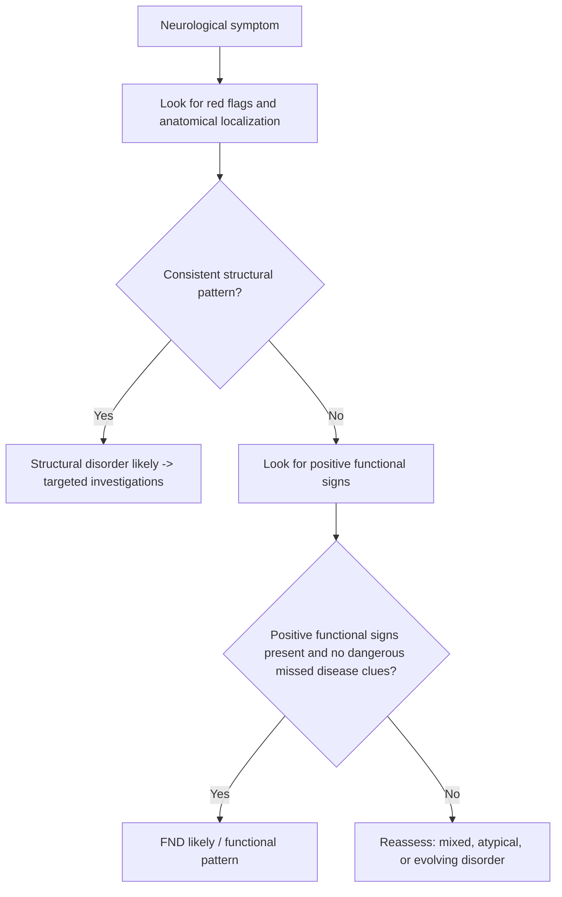

# Functional vs structural clue pattern

Related: [[../Neurology MOC|Neurology MOC]] · [[../Clinical Examination of the Nervous System|Clinical Examination of the Nervous System]] · [[Pattern recognition]] · [[UMN vs LMN pattern]] · [[Cortical vs brainstem vs spinal vs peripheral pattern]] · [[../Functional Neurological Disorder/Positive clinical signs supporting FND|Positive clinical signs supporting FND]]

> [!important]
> A major neurology exam skill is deciding whether a presentation is more consistent with a **structural/organic neurological disorder** or a **functional neurological disorder (FND)**. The safe rule is: diagnose FND by **positive clinical signs of inconsistency/incongruence**, not by dismissal, while still excluding dangerous organic disease.

> [!tip]
> In FCPS/MRCP, avoid saying “it is functional because investigations are normal.” A stronger answer is: **“The pattern is functional because weakness varies with distraction, Hoover’s sign is positive, and the distribution is incongruent with recognized neuroanatomy.”**

## Learning Objectives
- Define functional vs structural neurological patterns.
- Recognize positive bedside clues that support FND.
- Identify features more typical of structural disease.
- Understand common mimics and overlap situations.
- Know the red flags that require urgent reassessment despite a possible functional overlay.

## Definition
### Structural neurological pattern
A **structural** pattern arises from identifiable pathology affecting the nervous system, such as:
- cortex
- brainstem
- spinal cord
- root/plexus/nerve
- neuromuscular junction
- muscle

The findings are typically **anatomically congruent** and reproducible.

### Functional neurological pattern
A **functional** pattern arises from abnormal nervous system functioning rather than a lesion in a recognized anatomical pathway. Symptoms are genuine and disabling, but the examination often shows:
- inconsistency over time
- incongruence with known neuroanatomy
- preservation of function in some contexts
- positive functional signs

## Relevant Neuroanatomy
### Structural logic
Structural disorders follow pathways:
- cortical lesions → aphasia, neglect, seizures, visual field defects
- brainstem lesions → cranial nerve signs with long-tract findings
- spinal lesions → sensory level, pyramidal signs, sphincter disturbance
- peripheral lesions → LMN pattern, nerve/root distribution

### Why functional symptoms may look “non-anatomical”
In FND, symptoms can mimic weakness, sensory loss, gait disorder, tremor, or attacks, but the pattern may not fit:
- a tract
- a root/nerve distribution
- a consistent hemisensory syndrome
- a stable motor pathway lesion

## Relevant Neurophysiology
- Structural disease causes dysfunction because neural tissue or conduction pathways are damaged.
- Functional disorders likely reflect altered networks of attention, expectation, motor control, and salience processing, rather than destructive lesions.
- This explains why movement or function may improve with distraction or change under testing conditions.

## Normal Values / Important Cut-offs
This topic is primarily pattern-based. Key practical thresholds are conceptual:
- **Positive FND signs** are more valuable than “normal scans” alone.
- **Anatomical incongruence** increases suspicion for functional pattern.
- **Objective pyramidal signs, sensory level, or cranial nerve-localizing findings** increase suspicion for structural disease.
- Coexisting FND and organic disease are possible; one does not exclude the other.

## Classification
### Functional presentations commonly encountered
1. functional weakness
2. functional sensory symptoms
3. dissociative/non-epileptic attacks
4. functional gait disorder
5. functional tremor or movement symptoms
6. speech/visual functional symptoms

### Structural pattern groups
1. cortical/hemispheric
2. brainstem
3. spinal cord
4. peripheral nerve/root/plexus
5. neuromuscular junction
6. muscle

## Etiology / Causes
### Structural causes
- stroke-like structural syndromes outside this chapter’s scope if applicable elsewhere
- tumour
- demyelination
- encephalitis/meningitis
- spinal cord compression
- neuropathy/radiculopathy
- myopathy/NMJ disease

### Functional causes/associations
- psychological stress may be present but is not required
- prior trauma/adversity in some patients
- coexisting anxiety, depression, chronic pain, fatigue disorders
- symptoms may begin after a real illness, injury, seizure, migraine, or vestibular event

## Risk Factors
### For structural disease
- vascular risk
- malignancy
- infection/immunosuppression
- autoimmune disease
- trauma
- toxic/metabolic disease

### For functional disorders
- prior functional symptoms
- chronic pain/fatigue syndromes
- mood disorder or trauma history in some patients
- recent acute illness or distressing medical event

## Pathophysiology
### Structural
Symptoms reflect damage or dysfunction in a definable pathway.

### Functional
Symptoms reflect altered brain network functioning and abnormal motor/sensory prediction or attention processes. The symptom is real, but the pattern is often internally inconsistent or not explainable by a single lesion.

## Clinical Features

## Clues Favoring Structural Pattern
- fixed anatomical distribution
- reproducible deficits across repeated testing
- objective UMN/LMN signs
- cranial nerve localization
- sensory level
- bladder/bowel dysfunction in cord patterns
- aphasia, neglect, seizures, visual field defects
- abnormal reflex asymmetry that fits localization
- consistent gait or coordination deficit with corresponding signs

## Clues Favoring Functional Pattern
- variability during the same examination
- marked improvement with distraction
- give-way/collapsing weakness
- Hoover’s sign positivity
- inconsistency between formal testing and spontaneous function
- non-anatomical sensory loss or sharply split midline sensory findings
- bizarre gait with preserved balance rescue
- prolonged attack-like episodes with functional semiology
- apparent severe weakness but preserved automatic movement

> [!warning]
> None of these should be used lazily. FND is a **positive diagnosis**, but dangerous structural disease must still be excluded when red flags exist.

## Positive Functional Signs
### Motor
- **Hoover’s sign**: weak hip extension improves when the contralateral hip flexes against resistance
- collapsing/give-way weakness
- tremor entrainment or variability
- inconsistency between bed examination and walking/transfers

### Sensory
- non-dermatomal or sharply demarcated sensory loss
- exact midline split of vibration or light touch that is physiologically implausible in some contexts
- changing sensory boundaries on repeat testing

### Gait
- astasia-abasia style swaying with preserved fall avoidance
- excessive slowness or knee buckling without injury
- disproportionate effortful gait but preserved automatic posture correction

### Attack symptoms
- prolonged fluctuating episodes
- closed eyes with resistance to opening in some cases
- asynchronous movements
- preserved awareness during dramatic bilateral shaking in some patients

## Approach / Algorithm

### Bedside reasoning sequence
1. Decide if there is a clear cortical, brainstem, spinal, or peripheral localization.
2. Check whether the deficit is internally consistent.
3. Search for positive functional signs.
4. Review whether the pattern changes with distraction or repetition.
5. Exclude important emergency structural disorders when red flags are present.
6. Consider coexistence of functional overlay and genuine neurological disease.

## Investigations
### When structural disease is suspected
- neuroimaging according to localization
- EEG if attacks or epilepsy differential
- CSF where inflammatory/infective disease is suspected and safe
- neurophysiology for peripheral/NMJ/myopathy assessment
- metabolic and systemic blood work as indicated

### In suspected functional pattern
Investigations are used to:
- exclude dangerous or plausible structural disease
- support positive diagnosis where needed
- avoid unnecessary repeated testing once a confident positive diagnosis is made

## Interpretation Frameworks

## Structural vs Functional Comparison Table
| Feature | Structural pattern | Functional pattern |
|---|---|---|
| Anatomy | Fits known pathways | Often incongruent or mixed |
| Reproducibility | Usually consistent | Often variable |
| Distraction effect | Minimal | May improve/change |
| Reflex/pathological signs | May be objectively abnormal | Often absent or inconsistent |
| Higher cortical/localizing signs | May be present | Usually absent unless coexisting disease |
| Sensory pattern | Dermatomal/tract-based | Non-anatomical/fluctuating |

## Positive FND Sign Table
| Sign | Meaning |
|---|---|
| Hoover’s sign | Inconsistency in voluntary leg weakness |
| Give-way weakness | Variable effort pattern |
| Tremor entrainment | Functional tremor clue |
| Midline-split sensory loss | Functional sensory clue in context |
| Marked inconsistency between observed and tested function | Supports functional mechanism |

## Red-Flag Structural Features Table
| Feature | Why important |
|---|---|
| Cranial nerve palsy | brainstem or peripheral cranial pathology |
| Sensory level | spinal cord disease |
| New bladder retention | cord/cauda equina emergency |
| Extensor plantar response | structural UMN pathology concern |
| Seizure with prolonged post-ictal phase/focal deficit | structural/epileptic cause concern |

## Diagnosis
### Structural diagnosis wording
- “Pattern suggests a structural spinal cord syndrome because there is a sensory level, bilateral pyramidal signs, and urinary urgency.”

### Functional diagnosis wording
- “Pattern is consistent with functional weakness because the deficit is variable, incongruent with neuroanatomy, and accompanied by a positive Hoover’s sign.”

## Differential Diagnosis
### Functional mimics to avoid missing
- myasthenia gravis
- multiple sclerosis/demyelination
- small cortical or spinal lesions
- episodic ataxia or vestibular disease
- metabolic causes of fluctuating weakness
- dissociative attacks vs epilepsy

### Structural disorders with apparent inconsistency
- fatigue-related weakness
- pain-limited power testing
- early demyelinating disease
- intermittent movement disorders
- severe anxiety around genuine neurological illness

## Tables / Comparison Charts

## Common Scenario Comparison
| Scenario | More likely functional | More likely structural |
|---|---|---|
| Weak leg but normal automatic use at times | Yes | No |
| Aphasia with hemiparesis | No | Yes |
| Sensory level on trunk | No | Yes |
| Hoover’s sign positive | Yes | No |
| Diplopia with long-tract signs | No | Yes |

## Management
### Structural pattern
- localize and investigate appropriately
- treat underlying cause urgently if needed
- escalate emergencies promptly

### Functional pattern
- explain diagnosis positively and clearly
- validate symptoms as real
- avoid blaming language
- avoid endless repeated investigations once the diagnosis is secure
- consider physiotherapy, psychology, multidisciplinary rehabilitation
- manage comorbid pain, fatigue, anxiety, depression if present

## Drug Interactions / Contraindications / Comorbidity Cautions
- Do not expose patients with functional attacks to unnecessary anticonvulsants or sedatives unless epilepsy/status is genuinely suspected.
- Sedation may obscure the examination and reinforce illness behavior if overused.
- Patients may have both FND and real neurological disease; do not withhold needed treatment for proven organic disease.

## Procedures / Indications / Contraindications
### Imaging/LP/neurophysiology
Use when the clinical picture justifies structural evaluation. The presence of possible FND does **not** remove the need to investigate red flags.

### Video-EEG
Useful when dissociative attacks and epilepsy are difficult to separate.

## Procedure Mini-Sections
### Hoover’s sign examination
- **Indication:** unilateral leg weakness of uncertain origin
- **Principle:** involuntary hip extension during contralateral hip flexion suggests preserved motor pathway
- **Pearl:** this is a positive sign supporting FND, not a trick

### Diagnostic explanation
- **Indication:** once confident FND diagnosis is made
- **Principle:** explain that the nervous system is malfunctioning, not damaged structurally
- **Benefit:** improves engagement and outcomes

## Complications
- misdiagnosing structural disease as functional
- misdiagnosing FND as malingering or “nothing”
- iatrogenic harm from repeated investigations, admissions, or inappropriate drugs
- persistent disability if diagnosis and rehabilitation are delayed

## Red Flags / Emergencies
- reduced consciousness
- objective cranial nerve signs
- sensory level
- new sphincter dysfunction
- evolving focal deficit
- fever/meningism/immunocompromise
- severe headache/raised ICP clues
- status epilepticus or repeated convulsions without recovery

## Prognosis
- Structural prognosis depends on disease cause and treatment timing.
- FND can improve substantially with good explanation and multidisciplinary care, but chronicity may develop if diagnosis is delayed or adversarial.

## Topic Correlation
- [[UMN vs LMN pattern]]
- [[Cortical vs brainstem vs spinal vs peripheral pattern]]
- [[../Functional Neurological Disorder/Positive clinical signs supporting FND|Positive clinical signs supporting FND]]
- [[../Functional Neurological Disorder/Dissociative and non-epileptic attacks|Dissociative and non-epileptic attacks]]
- [[Important differentials - syncope, FND, and metabolic causes]]

## Special Situations
### Coexisting disease
A patient may have Parkinson disease, MS, epilepsy, or neuropathy **and** functional overlay. Do not force a false either/or choice.

### Pain-limited examination
Pain can mimic inconsistent weakness. Interpret cautiously.

### Acute emergency setting
A dramatic presentation may still be structural. Stabilize first, then refine diagnosis.

## FCPS/MRCP High-Yield Points
- Diagnose FND by **positive signs**, not normal tests alone.
- Structural disease usually respects neuroanatomy.
- Sensory level, cranial nerve findings, extensor plantar response, and persistent objective asymmetry strongly support structural disease.
- Functional and structural conditions can coexist.

## Common Viva Questions
- How do you differentiate functional weakness from pyramidal weakness?
- What is Hoover’s sign?
- Why is FND not a diagnosis of exclusion only?
- Can a patient have FND and real neurological disease together?
- What red flags should stop you from prematurely labeling a case functional?

## Common Confusions / Exam Traps
- equating FND with malingering
- diagnosing functional disorder only because MRI is normal
- forgetting to look for positive signs
- overlooking spinal sensory level or brainstem clues
- missing mixed organic + functional presentations

## Mnemonics
### Functional clues
**“VARY”**
- **V**ariable
- **A**natomically incongruent
- **R**esponds to distraction
- **Y**ields positive functional signs

### Structural clues
**“LOCALISE”**
- **L**ocalizing signs
- **O**bjective reflex/pyramidal changes
- **C**onsistent findings
- **A**natomically congruent
- **L**evel or cranial nerve involvement
- **I**maging/EEG/neurophysiology may support
- **S**phincter issues/red flags
- **E**volving organic pattern

## Mind Map
- Functional vs structural
  - Structural
    - anatomical consistency
    - objective signs
    - localizing features
  - Functional
    - variability
    - incongruence
    - distraction improvement
    - positive signs
  - Shared safety step
    - exclude emergencies
    - consider coexistence

## Suggested Visuals / Image Notes
- Table of structural vs functional bedside features
- Hoover’s sign illustration
- Flowchart for functional vs structural reasoning

## Suggested Video References
- FND bedside diagnosis teaching videos
- Hoover’s sign demonstration videos
- Neurological localization examination tutorials

## One-Page Revision Summary
### Structural clues
- fixed neuroanatomical distribution
- objective reflex/pathological signs
- cranial nerve or sensory level findings
- aphasia/neglect/field defects

### Functional clues
- variability
- inconsistency
- positive Hoover’s/give-way signs
- non-anatomical sensory loss
- preserved automatic function despite claimed severe deficit

### Safety rule
**Never diagnose “functional” just because tests are normal. Diagnose it because positive bedside signs support it.**

## Recall Prompts
### 24-hour recall prompts
- What is Hoover’s sign?
- List 4 features favoring structural disease.
- List 4 features favoring functional pattern.
- Can FND coexist with organic disease?
- Which red flags mandate structural reassessment?

### 7-day / 15-day / 30-day revision tracker
- **7 days:** explain functional vs structural pattern in 2 minutes.
- **15 days:** redraw the comparison table from memory.
- **30 days:** answer a viva on FND positive signs and safety traps.

## Must Know / Should Know / Nice to Know
### Must Know
- positive diagnosis principle for FND
- structural localization red flags
- Hoover’s sign and inconsistency clues

### Should Know
- common functional gait and sensory patterns
- coexistence with organic disease

### Nice to Know
- advanced network-based explanatory models of FND

## My Weak Points
- Do I rely too much on investigations instead of the bedside exam?
- Do I remember to search for positive functional signs?
- Do I overcall FND in fluctuating organic disease?

## Self-Test Scorecard
- Bedside reasoning /10
- Positive FND signs /10
- Structural red-flag recognition /10
- Differential diagnosis /10
- Viva confidence /10

Interpretation:
- **<35/50** = weak
- **35-44/50** = acceptable
- **45+/50** = strong

## Exam Answer Modes
### Short note
Compare structural and functional neurological patterns with positive signs and red flags.

### Viva mode
Start with “FND is a positive diagnosis” and then list specific bedside clues.

### Ward-case mode
State whether the deficit is anatomically congruent or incongruent and whether positive functional signs are present.

## Summary
The distinction between functional and structural neurological patterns is a high-yield clinical skill. Structural disorders produce consistent anatomically localizable signs. Functional disorders are diagnosed using positive bedside evidence of inconsistency and incongruence, while carefully excluding dangerous organic disease and recognizing that both can coexist.

## MCQs (10)
1. A diagnosis of functional neurological disorder is best made by:
   - A. Normal MRI alone
   - B. Positive clinical signs of inconsistency/incongruence
   - C. Psychiatric history alone
   - D. Absence of patient distress
   - E. Normal CBC only

2. Which feature most favors structural disease?
   - A. Hoover’s sign positive
   - B. Give-way weakness
   - C. Sensory level on the trunk
   - D. Marked variability with distraction
   - E. Asynchronous non-rhythmic movements only

3. Which statement is correct?
   - A. FND symptoms are not real
   - B. FND and organic disease cannot coexist
   - C. FND should be diagnosed only after every possible test is normal
   - D. FND is supported by positive bedside signs
   - E. Structural disease is always painful

4. Which is a positive sign supporting functional leg weakness?
   - A. Extensor plantar response
   - B. Hoover’s sign
   - C. Sensory level
   - D. Cranial nerve palsy
   - E. Homonymous hemianopia

5. Which finding most strongly suggests a structural spinal lesion rather than FND?
   - A. Variable weakness with distraction improvement
   - B. A clear sensory level with urinary retention
   - C. Inconsistent midline sensory split
   - D. Give-way weakness
   - E. Tremor entrainment

6. Which is a common exam trap?
   - A. Searching for positive signs
   - B. Considering mixed disease
   - C. Calling the case functional because MRI is normal
   - D. Looking for neuroanatomical congruence
   - E. Checking plantar responses

7. A patient with dramatic gait instability but preserved fall protection and variable performance may have:
   - A. Functional gait disorder
   - B. Definite cerebellar stroke only
   - C. Myasthenic crisis only
   - D. Bell palsy
   - E. Temporal arteritis

8. Which feature is more typical of structural cortical disease?
   - A. Aphasia
   - B. Hoover’s sign
   - C. Entrainable tremor
   - D. Give-way weakness
   - E. Fluctuating sharply demarcated midline sensory loss

9. Which statement about FND is best?
   - A. It is malingering by definition
   - B. Symptoms are genuine and can be disabling
   - C. It excludes the need for any examination
   - D. It cannot present with attacks
   - E. It never improves

10. Which red flag should stop premature labeling of a case as functional?
   - A. New cranial nerve palsy
   - B. Variable symptom description
   - C. Anxiety
   - D. Prior stress
   - E. Tearfulness

## SBA Questions (10)
1. A 27-year-old woman reports inability to move her left leg. On examination, power appears poor on direct testing, but hip extension improves when the opposite leg flexes against resistance. Best interpretation:
   - A. Definite spinal cord transection
   - B. Positive Hoover’s sign supporting functional weakness
   - C. Myopathy only
   - D. Stroke with neglect
   - E. Neuromuscular junction failure

2. A 52-year-old man has bilateral leg weakness, brisk reflexes, extensor plantars, a thoracic sensory level, and urinary retention. Best interpretation:
   - A. Functional weakness is most likely
   - B. Structural spinal cord syndrome is most likely
   - C. Pure vestibular disorder
   - D. Ménière disease
   - E. Functional tremor

3. A patient has recurrent attacks of collapse with prolonged fluctuating shaking, eye closure, and preserved awareness during part of the event. Best explanation:
   - A. Typical generalized tonic-clonic seizure only
   - B. Positive semiology supporting dissociative non-epileptic attacks
   - C. Pure syncope
   - D. BPPV
   - E. Cauda equina syndrome

4. Which statement is most appropriate when explaining FND?
   - A. “Nothing is wrong.”
   - B. “You are pretending.”
   - C. “Your symptoms are real, and your nervous system is not functioning normally even though we are not seeing structural damage.”
   - D. “This can never improve.”
   - E. “We should stop all follow-up.”

5. A patient shows exact midline sensory splitting and changing sensory boundaries on repeated testing, without localizing objective signs. This pattern is:
   - A. More supportive of functional sensory symptoms
   - B. Diagnostic of cord compression
   - C. Typical of brainstem stroke
   - D. Typical of ALS
   - E. Typical of bacterial meningitis

6. Which is the safest clinical principle?
   - A. Normal imaging proves functional disorder
   - B. Functional and structural disorders cannot coexist
   - C. Positive signs support FND, but red flags still require structural evaluation
   - D. Functional presentations never need follow-up
   - E. Psychological stress must always be identified first

7. A patient has aphasia and right hemiparesis. Best classification:
   - A. Functional pattern more likely
   - B. Structural cortical pattern more likely
   - C. Peripheral neuropathy
   - D. Pure vestibular syndrome
   - E. Myopathy

8. A patient’s tremor changes frequency to match rhythmic tapping with the other hand. Best interpretation:
   - A. Structural cerebellar tremor only
   - B. Entrainment supporting functional tremor
   - C. Sensory level sign
   - D. Cranial nerve localization
   - E. Extrapyramidal rigidity only

9. Which feature best supports a structural rather than functional diagnosis?
   - A. Variable give-way weakness
   - B. Incongruent sensory loss
   - C. Persistent objective extensor plantar response
   - D. Improvement with distraction
   - E. Fluctuating gait pattern

10. Why should clinicians avoid over-investigation once confident FND diagnosis is made?
   - A. It may cause iatrogenic harm and reinforce illness behavior
   - B. Because all tests are useless
   - C. Because FND patients never have comorbidity
   - D. Because neurological examination is irrelevant
   - E. Because follow-up is unnecessary

## Flashcards
- Q: What is the best principle for diagnosing FND?
  A: Use positive bedside signs of inconsistency/incongruence, not normal tests alone.

- Q: What sign supports functional leg weakness?
  A: Hoover’s sign.

- Q: What finding strongly supports structural spinal disease?
  A: A sensory level with bladder dysfunction.

- Q: Can FND coexist with organic neurological disease?
  A: Yes.

- Q: What does give-way weakness suggest?
  A: A possible functional pattern, especially if inconsistent.

- Q: What structural clue makes “functional” labeling dangerous?
  A: Objective cranial nerve palsy or extensor plantar response.

- Q: What does tremor entrainment suggest?
  A: Functional tremor.

- Q: Are FND symptoms real?
  A: Yes, they are genuine and can be disabling.

- Q: What is a common trap in FND diagnosis?
  A: Calling it functional just because MRI is normal.

- Q: What is the safest overall rule?
  A: Positive FND signs plus ongoing respect for structural red flags.

## Answer Key with Explanations
### MCQs
1. **B. Positive clinical signs of inconsistency/incongruence** — correct diagnostic approach.
2. **C. Sensory level on the trunk** — structural cord clue.
3. **D. FND is supported by positive bedside signs** — best statement.
4. **B. Hoover’s sign** — classic positive sign.
5. **B. A clear sensory level with urinary retention** — strongly structural.
6. **C. Calling the case functional because MRI is normal** — a major trap.
7. **A. Functional gait disorder** — preserved rescue with dramatic variability suggests functional gait pattern.
8. **A. Aphasia** — cortical structural sign.
9. **B. Symptoms are genuine and can be disabling** — important correction.
10. **A. New cranial nerve palsy** — major structural red flag.

### SBAs
1. **B. Positive Hoover’s sign supporting functional weakness** — classic bedside finding.
2. **B. Structural spinal cord syndrome is most likely** — objective localizing pattern.
3. **B. Positive semiology supporting dissociative non-epileptic attacks** — functional attack pattern.
4. **C. “Your symptoms are real, and your nervous system is not functioning normally even though we are not seeing structural damage.”** — clear and therapeutic explanation.
5. **A. More supportive of functional sensory symptoms** — in context this supports FND.
6. **C. Positive signs support FND, but red flags still require structural evaluation** — safest approach.
7. **B. Structural cortical pattern more likely** — aphasia plus hemiparesis is structural until proven otherwise.
8. **B. Entrainment supporting functional tremor** — positive FND movement sign.
9. **C. Persistent objective extensor plantar response** — strong structural clue.
10. **A. It may cause iatrogenic harm and reinforce illness behavior** — important management principle.
