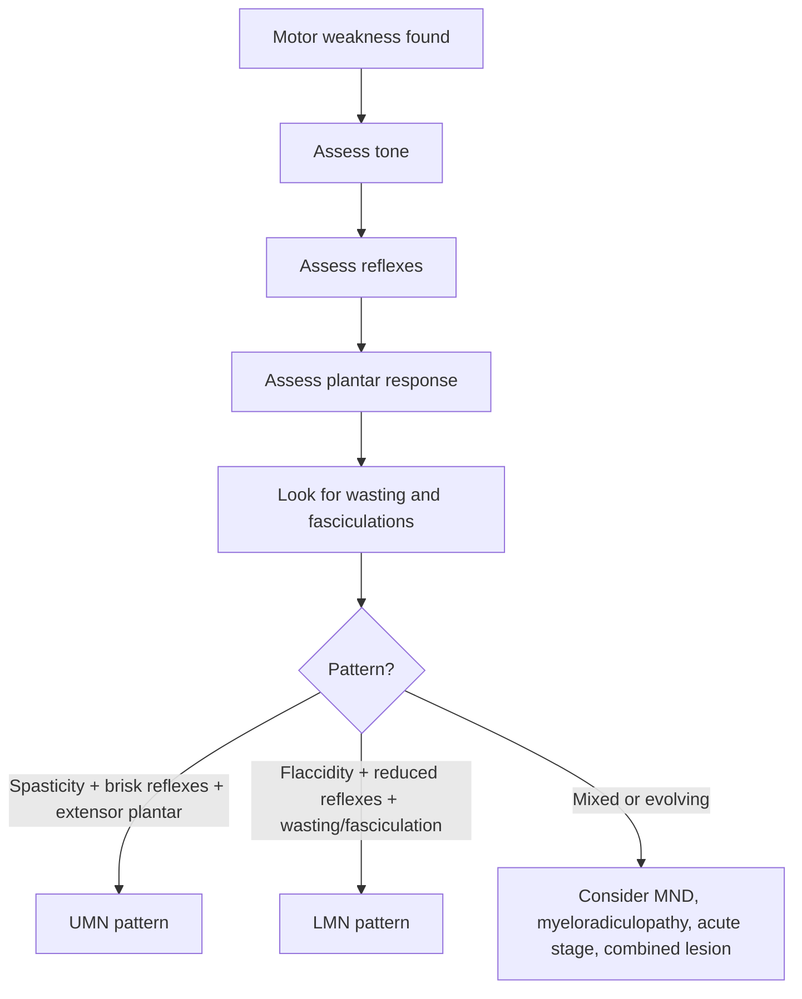
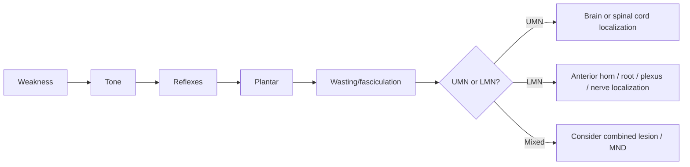

# UMN vs LMN pattern

Related: [[../Neurology MOC|Neurology MOC]] · [[../Clinical Examination of the Nervous System|Clinical Examination of the Nervous System]] · [[Pattern recognition]] · [[Cortical vs brainstem vs spinal vs peripheral pattern]] · [[Motor system examination]] · [[Reflexes and plantar responses]]

> [!important]
> Distinguishing **upper motor neuron (UMN)** from **lower motor neuron (LMN)** involvement is one of the most important bedside localization skills in neurology. Many FCPS/MRCP cases are solved first by deciding **UMN, LMN, or mixed pattern**.

> [!tip]
> In exams, never just list signs. Explain **why** the signs occur and then localize the lesion: cortex/internal capsule/brainstem/spinal cord for UMN, and anterior horn cell/root/plexus/peripheral nerve/neuromuscular unit for LMN-pattern disorders.

## Learning Objectives
- Define UMN and LMN.
- Review corticospinal anatomy and the final common motor pathway.
- Differentiate UMN and LMN signs at the bedside.
- Apply the distinction to localization and differential diagnosis.
- Recognize mixed patterns and red flags requiring urgent action.

## Definition
### Upper motor neuron
UMNs are descending neurons that originate in the motor cortex and brainstem and project to spinal or cranial nerve motor nuclei, modulating voluntary movement.

### Lower motor neuron
LMNs are the **final common pathway** from the anterior horn cell or cranial motor nucleus to peripheral nerve, neuromuscular junction, and muscle.

### Core distinction
- **UMN lesions** interrupt descending control over movement.
- **LMN lesions** interrupt direct activation of muscle.

## Relevant Neuroanatomy
### Corticospinal tract pathway
- primary motor cortex
- corona radiata
- internal capsule
- cerebral peduncle
- pons
- medullary pyramids
- decussation in lower medulla (mostly)
- lateral corticospinal tract in spinal cord
- synapse on anterior horn cells/interneurons

### LMN pathway
- anterior horn cell or cranial motor nucleus
- ventral root / cranial nerve root
- plexus if relevant
- peripheral nerve
- neuromuscular junction
- muscle

### Localization logic
- lesion above the anterior horn = usually **UMN pattern**
- lesion at anterior horn/root/nerve = **LMN pattern**

## Relevant Neurophysiology
### Normal motor control
Descending pathways:
- activate intended movement
- suppress excess reflex activity
- modulate tone and posture
- maintain fractionated fine motor control

### Why UMN signs occur
Loss of descending inhibitory modulation causes:
- increased stretch reflexes
- spasticity
- extensor plantar response
- loss of fine fractionated movement

### Why LMN signs occur
Destruction of the final common motor pathway causes:
- weakness from denervation
- reduced/absent reflexes in involved segments
- muscle wasting
- fasciculations in many neurogenic disorders
- reduced tone (flaccidity)

## Normal Values / Important Cut-offs
This is largely pattern-based rather than cut-off based, but key practical points are:
- reflexes should be interpreted symmetrically and in context
- **extensor plantar response** is pathological in adults
- visible **fasciculations** support LMN involvement, especially if weakness and wasting coexist
- acute UMN lesions may be initially **flaccid** before spasticity appears later

## Classification
### UMN-pattern lesion sites
1. cerebral cortex
2. subcortical white matter/internal capsule
3. brainstem
4. spinal cord

### LMN-pattern lesion sites
1. anterior horn cell
2. nerve root
3. plexus
4. peripheral nerve
5. motor cranial nerve nucleus/nerve

### Mixed pattern
Seen in some disorders such as:
- motor neuron disease
- cervical spondylotic myelopathy with root involvement
- combined cord and peripheral disease

## Etiology / Causes
### Common UMN lesion causes
- stroke
- brain tumour
- multiple sclerosis
- spinal cord compression
- cervical myelopathy
- traumatic spinal cord injury
- cerebral palsy / old brain injury

### Common LMN lesion causes
- radiculopathy
- peripheral neuropathy
- plexopathy
- poliomyelitis/anterior horn cell disease
- motor neuron disease (LMN component)
- cauda equina syndrome
- focal peripheral nerve injury

## Risk Factors
- vascular risk factors → stroke-related UMN lesions
- malignancy / weight loss → spinal metastasis or brain tumour
- degenerative spine disease → cervical myelopathy or radiculopathy
- diabetes → neuropathy
- TB, malignancy, trauma → cord compression risk

## Pathophysiology
### UMN lesion consequences
1. interrupted voluntary descending command
2. reduced inhibitory control over segmental reflex arc
3. increased muscle tone velocity-dependent spasticity
4. brisk reflexes and pyramidal signs
5. poor fine skilled movement

### LMN lesion consequences
1. denervation of muscle fibers
2. failure of impulse transmission to muscle
3. weakness and wasting
4. reflex loss in involved segment
5. fasciculation/fibrillation tendencies in neurogenic disease

## Clinical Features
### UMN pattern
- weakness in pyramidal distribution
- increased tone: **spasticity**
- hyperreflexia
- clonus may occur
- extensor plantar response
- little wasting initially (disuse wasting later)
- no fasciculation as a classic isolated feature
- loss of fine finger movements and rapid tapping

### LMN pattern
- weakness in segmental/root/nerve distribution
- reduced tone: **flaccidity**
- hyporeflexia or areflexia
- prominent wasting
- fasciculations may be present
- plantar response usually flexor or absent if severe weakness prevents assessment

### Important examination nuance
Acute severe UMN lesions, especially immediately after stroke or spinal shock, may initially look **flaccid** with reduced reflexes before classical UMN signs emerge later.

## Approach / Algorithm

## Investigations
Investigations follow localization.

### If UMN pattern suspected
- MRI brain if cortical/subcortical/brainstem lesion suspected
- MRI spine if myelopathy or cord compression suspected
- CT head in acute stroke/emergency settings
- inflammatory/infective tests depending on syndrome

### If LMN pattern suspected
- nerve conduction studies / EMG
- MRI spine for root compression
- relevant blood tests: glucose, B12, CK, autoimmune/infective work-up depending on context

### If mixed pattern suspected
- EMG/NCS
- MRI spine/brain as indicated
- targeted work-up for motor neuron disease, myelopathy, combined system disease

## Interpretation Frameworks
### Core comparison table
| Feature | UMN lesion | LMN lesion |
|---|---|---|
| Weakness | Yes | Yes |
| Tone | Increased, spastic | Decreased, flaccid |
| Reflexes | Brisk/hyperreflexic | Reduced/absent |
| Plantar response | Extensor | Usually flexor/absent |
| Muscle bulk | Mild late disuse wasting | Marked neurogenic wasting |
| Fasciculations | Not typical isolated sign | Common in neurogenic LMN disease |
| Distribution | Pyramidal / long tract | Segmental, root, nerve pattern |

### Localization refinement after pattern recognition
#### If UMN pattern
Ask:
- face involved or not?
- cortical signs present?
- cranial nerve crossed signs?
- sensory level or sphincter involvement?

#### If LMN pattern
Ask:
- root pattern or nerve pattern?
- distal symmetrical neuropathy?
- cranial motor nuclei?
- bulbar involvement?
- neuromuscular junction or muscle actually more likely?

## Diagnosis
UMN vs LMN is not itself a disease diagnosis; it is a **localizing syndromic diagnosis**.
Examples:
- hemiparesis + extensor plantar → UMN lesion likely above cervical cord
- foot drop + absent ankle jerk + wasting of tibialis anterior → LMN/peripheral pattern

## Differential Diagnosis
- acute UMN lesion during spinal shock may mimic LMN pattern temporarily
- severe myopathy may cause flaccid weakness without fasciculation but reflexes may be reduced due to weakness
- functional weakness may simulate pyramidal weakness but inconsistency/positive FND signs help
- NMJ disease causes weakness with normal bulk and usually normal reflexes early

## Tables / Comparison Charts
| Lesion site | Typical pattern | Common examples |
|---|---|---|
| Cortex/internal capsule | UMN | stroke, tumour |
| Brainstem | UMN plus cranial signs | brainstem stroke |
| Spinal cord | UMN below level, LMN at level | cervical myelopathy, cord compression |
| Anterior horn cell | LMN | spinal muscular atrophy, MND LMN component |
| Nerve root | LMN | radiculopathy |
| Peripheral nerve | LMN | peroneal palsy, ulnar neuropathy |

## Management
Management depends on cause, but bedside priorities are:
- identify whether the pattern suggests **stroke**, **spinal cord compression**, or other emergency
- document motor power, tone, reflexes, plantar responses, sensory findings, sphincter symptoms
- refer urgently for imaging if acute UMN syndrome or suspected cord lesion
- protect weak limbs, prevent falls and pressure injury

## Drug Interactions / Contraindications / Comorbidity Cautions
- Do not label spasticity and treat symptomatically before identifying the cause.
- In suspected cord compression, do not delay urgent imaging while focusing only on analgesics or antispastic agents.
- Polyneuropathy and spine disease can coexist and confuse interpretation.

## Procedures / Indications / Contraindications
- **MRI brain/spine** based on localization and urgency.
- **EMG/NCS** for LMN/peripheral localization.
- **LP** only if inflammatory/infective CNS disease is suspected and imaging/safety permit.

## Procedure Mini-Sections
### Plantar response testing
- **Indication:** every motor examination with suspected corticospinal lesion
- **Pearl:** an extensor plantar response in adults supports UMN involvement

### Reflex testing
- compare side to side and upper vs lower limb
- interpret with tone and power, not in isolation

## Complications
Complications relate to the underlying lesion:
- missed stroke
- missed spinal cord compression
- progressive denervation and disability in LMN disorders
- contractures/spasticity in UMN disease
- falls and aspiration in bulbar involvement

## Red Flags / Emergencies
- acute hemiparesis or hemisyndrome → stroke emergency
- paraparesis/quadriparesis with sensory level or bladder symptoms → cord compression until proven otherwise
- rapidly progressive LMN weakness with sphincter involvement → cauda equina or compressive lesion needs urgent evaluation
- mixed UMN/LMN signs with bulbar symptoms → consider motor neuron disease but exclude structural myelopathy

## Prognosis
Depends entirely on cause:
- stroke may stabilize or partially recover
- compressive myelopathy may worsen if not decompressed
- peripheral nerve lesions may recover variably
- degenerative UMN/LMN disorders may be progressive

## Topic Correlation
- [[Cortical vs brainstem vs spinal vs peripheral pattern]]
- [[Motor system examination]]
- [[Reflexes and plantar responses]]
- [[Movement Disorders/Idiopathic Parkinson disease|Idiopathic Parkinson disease]]
- [[Neurodegenerative Diseases/Amyotrophic lateral sclerosis and motor neuron disease pattern recognition|Amyotrophic lateral sclerosis and motor neuron disease pattern recognition]]

## Special Situations
- **Acute stroke:** may be hypotonic initially.
- **Spinal shock:** acute cord lesions can transiently suppress reflexes.
- **Motor neuron disease:** mixed UMN and LMN signs are classic.
- **Elderly with cervical spondylosis:** may have brisk legs and wasted hands from combined cord/root disease.

## FCPS/MRCP High-Yield Points
- UMN signs = spasticity, brisk reflexes, extensor plantar.
- LMN signs = wasting, fasciculation, reduced tone, reduced reflexes.
- A lesion in the spinal cord may produce **LMN signs at the level** and **UMN signs below the level**.
- Pattern recognition comes before naming the disease.

## Common Viva Questions
- What is the difference between UMN and LMN lesion?
- Why are reflexes brisk in UMN lesions?
- Why is wasting prominent in LMN disease?
- Give examples of lesions producing mixed UMN and LMN signs.
- How can acute UMN lesions mislead the examiner?

## Common Confusions / Exam Traps
- Forgetting that acute UMN lesions may start flaccid.
- Mistaking severe disuse wasting for primary LMN disease.
- Missing spinal cord lesions where UMN and LMN signs coexist.
- Interpreting reflexes without considering symmetry, tone, and strength.

## Mnemonics
- **UMN = UP**
  - **U**pgoing plantar
  - increased muscle **P**ower loss with spasticity and brisk reflexes
- **LMN = LOW**
  - **L**ow tone
  - **O**utput nerve problem
  - **W**asting and weak reflexes

## Mind Map
- UMN vs LMN
  - UMN
    - spasticity
    - brisk reflexes
    - extensor plantar
    - brain/spinal cord localization
  - LMN
    - wasting
    - fasciculation
    - flaccidity
    - root/nerve/anterior horn localization
  - mixed
    - MND
    - cervical myeloradiculopathy

## Flowchart

## Suggested Visuals / Image Notes
- Corticospinal tract diagram
- UMN vs LMN comparison table
- Segmental cord lesion showing LMN at level and UMN below

## Suggested Video References
- Look for: “UMN vs LMN examination bedside neurology”
- Look for: “corticospinal tract and pyramidal signs explanation”
- Look for: “FCPS MRCP motor system localization”

## One-Page Revision Summary
- **UMN** = lesion above anterior horn/corticobulbar motor nucleus pathway.
- Signs: weakness, spasticity, brisk reflexes, extensor plantar, little early wasting.
- **LMN** = lesion of anterior horn/root/nerve/final common pathway.
- Signs: weakness, wasting, fasciculations, flaccidity, reduced reflexes.
- Mixed patterns occur in **MND** and **spinal lesions**.
- Acute UMN lesions may initially be flaccid.

## 24-Hour Recall Prompts
- List 5 UMN signs.
- List 5 LMN signs.
- Why are reflexes brisk in UMN lesions?
- Name 3 causes of mixed UMN and LMN signs.
- What pattern suggests spinal cord disease rather than peripheral neuropathy?

## 7-Day / 15-Day / 30-Day Revision Tracker
- **Day 1:** Reproduce UMN vs LMN table from memory.
- **Day 7:** Localize 5 weakness cases using pattern only.
- **Day 15:** Explain acute UMN flaccidity and spinal shock.
- **Day 30:** Solve 10 motor-system viva questions without notes.

## Must Know / Should Know / Nice to Know
### Must Know
- core sign differences
- corticospinal localization
- mixed sign patterns in cord disease/MND
- acute stroke and cord compression red flags

### Should Know
- anterior horn vs root vs nerve refinement
- acute UMN flaccid stage

### Nice to Know
- detailed tract neurophysiology and interneuron circuitry

## My Weak Points
- Do I remember plantar response interpretation?
- Do I overcall LMN when wasting is only disuse?
- Can I explain mixed patterns confidently?

## Self-Test Scorecard
- Bedside differentiation: __/10
- Neuroanatomy recall: __/10
- Localization confidence: __/10
- Differential diagnosis: __/10
- Viva confidence: __/10

## Exam Answer Modes
- **Long answer:** compare UMN and LMN lesions with causes and localization.
- **Short note:** UMN vs LMN signs.
- **Viva:** “You examine a weak limb. How will you decide whether the lesion is UMN or LMN?”

## Summary
UMN vs LMN pattern recognition is foundational to clinical neurology. UMN lesions produce **spasticity, hyperreflexia, and extensor plantar responses** because descending inhibition is lost. LMN lesions produce **flaccidity, wasting, fasciculations, and reduced reflexes** because the final common motor pathway is interrupted.

## MCQs (10)
1. Which is most typical of an UMN lesion?
   - A. Fasciculation
   - B. Extensor plantar response
   - C. Marked early wasting
   - D. Areflexia only
   - E. Flaccidity with absent reflexes chronically

2. Which feature most strongly supports an LMN lesion?
   - A. Spasticity
   - B. Brisk jaw jerk
   - C. Fasciculation with wasting
   - D. Clonus
   - E. Extensor plantar response

3. The final common pathway to muscle is the:
   - A. Cerebral cortex
   - B. Internal capsule
   - C. Lower motor neuron
   - D. Cerebellum
   - E. Basal ganglia only

4. A spinal cord lesion may produce:
   - A. Only LMN signs below the lesion
   - B. LMN signs at the level and UMN signs below
   - C. Only normal reflexes
   - D. No weakness
   - E. Only tremor

5. Hyperreflexia occurs in UMN lesions mainly because of:
   - A. Loss of descending inhibitory modulation
   - B. Increased muscle bulk
   - C. Vitamin deficiency only
   - D. Direct neuromuscular junction block
   - E. Peripheral nerve regeneration

6. Which is most typical of chronic LMN weakness?
   - A. Spastic catch
   - B. Extensor plantar
   - C. Marked wasting
   - D. Clonus
   - E. Hypertonia

7. Acute severe UMN lesions may initially appear:
   - A. Spastic immediately in all cases
   - B. Flaccid
   - C. Hyperkinetic only
   - D. Pain-free only
   - E. Sensory normal always

8. Which disease classically gives mixed UMN and LMN signs?
   - A. Motor neuron disease
   - B. BPPV
   - C. Migraine
   - D. Myopia
   - E. Ménière disease

9. Plantar response in a classic LMN lesion is usually:
   - A. Extensor
   - B. Flexor or absent due to weakness
   - C. Always clonic
   - D. Always equivocal
   - E. Painful only

10. Which lesion most likely gives an LMN pattern?
   - A. Internal capsule stroke
   - B. Cervical cord lesion above anterior horn only
   - C. Peroneal nerve palsy
   - D. Parasagittal meningioma
   - E. Frontal lobe infarct

## SBA Questions (10)
1. A 68-year-old man has right-sided weakness, increased tone, brisk reflexes, and an upgoing plantar response. What is the best localization pattern?
   - A. UMN lesion
   - B. LMN lesion
   - C. Neuromuscular junction disorder only
   - D. Primary muscle disease only
   - E. Inner ear disorder

2. A 45-year-old woman has foot drop, wasting of the anterior compartment of the leg, and reduced ankle reflex with normal plantar response. What is the best pattern?
   - A. UMN lesion
   - B. LMN lesion
   - C. Cerebellar lesion
   - D. Migraine aura
   - E. Raised ICP

3. A patient with cervical spondylotic myelopathy has brisk knee reflexes but wasting and weakness of hand muscles. What is the best explanation?
   - A. Functional disease only
   - B. Mixed UMN and LMN pattern from cord/root involvement
   - C. Vestibular lesion
   - D. Isolated peripheral neuropathy only
   - E. Pure cerebellar syndrome

4. Which sign would most strongly support an LMN lesion in a weak limb?
   - A. Extensor plantar response
   - B. Fasciculation
   - C. Clonus
   - D. Spastic catch
   - E. Brisk reflexes

5. A patient presents immediately after acute spinal cord injury and has flaccid paraparesis with absent reflexes. What is the best interpretation?
   - A. This excludes UMN disease
   - B. Acute spinal shock can temporarily mask UMN signs
   - C. This proves myasthenia gravis
   - D. This is always peripheral neuropathy
   - E. This is BPPV

6. A patient with left hemispheric stroke is expected to have what type of leg tone after the acute phase?
   - A. Spastic increased tone
   - B. Flaccid reduced tone chronically as the only pattern
   - C. No weakness
   - D. Isolated fasciculations only
   - E. Normal plantar response always

7. Which pathway is interrupted in an UMN lesion causing pyramidal weakness?
   - A. Corticospinal tract
   - B. Vestibulocochlear apparatus only
   - C. Retinal pathway only
   - D. Enteric nervous system only
   - E. Olfactory pathway only

8. A patient has generalized fasciculations, wasting, and brisk reflexes. Which diagnosis pattern is most concerning?
   - A. Mixed UMN/LMN syndrome such as motor neuron disease
   - B. Pure vestibular disease
   - C. Simple migraine
   - D. Isolated aphasia only
   - E. Tension headache

9. The most important immediate red flag when UMN-pattern paraparesis is accompanied by urinary retention is:
   - A. Spinal cord compression
   - B. BPPV
   - C. Ménière disease
   - D. Tension headache
   - E. Essential tremor

10. Which answer best summarizes the bedside distinction?
   - A. UMN lesions give spasticity and brisk reflexes; LMN lesions give wasting and reduced reflexes
   - B. UMN and LMN lesions are clinically identical
   - C. LMN lesions always give extensor plantar responses
   - D. UMN lesions never cause weakness
   - E. Reflexes are irrelevant in motor examination

## Flashcards
- Q: What are the classic three hallmark signs of an UMN lesion?
  A: Spasticity, hyperreflexia, and extensor plantar response.
- Q: What are the hallmark signs of an LMN lesion?
  A: Wasting, fasciculations, flaccidity, and reduced reflexes.
- Q: What is the final common pathway to muscle?
  A: The lower motor neuron.
- Q: A spinal cord lesion causes what pattern?
  A: LMN signs at the level and UMN signs below the lesion.
- Q: Why are reflexes brisk in UMN lesions?
  A: Loss of descending inhibitory control.
- Q: Can acute UMN lesions initially appear flaccid?
  A: Yes.
- Q: Name a disease with mixed UMN and LMN signs.
  A: Motor neuron disease.
- Q: Which tract is classically involved in UMN weakness?
  A: Corticospinal tract.
- Q: What plantar response is typical of UMN disease in adults?
  A: Extensor/upgoing plantar.
- Q: What pattern does a peripheral nerve lesion usually produce?
  A: LMN pattern.

## Answer Key with Explanations
### MCQs
1. **B** — extensor plantar is a classic UMN sign.
2. **C** — fasciculation with wasting strongly supports LMN disease.
3. **C** — the LMN is the final common motor pathway.
4. **B** — cord lesions can give LMN at the level and UMN below.
5. **A** — hyperreflexia reflects loss of inhibitory descending influence.
6. **C** — prominent wasting is typical of LMN denervation.
7. **B** — acute UMN lesions may initially be flaccid.
8. **A** — MND classically causes mixed signs.
9. **B** — plantar is usually flexor or absent in LMN lesions.
10. **C** — peroneal nerve palsy is a peripheral LMN lesion.

### SBAs
1. **A** — the sign cluster is classic UMN localization.
2. **B** — wasting and reduced reflexes indicate LMN involvement.
3. **B** — combined cord/root disease explains mixed signs.
4. **B** — fasciculation is a key LMN clue.
5. **B** — spinal shock can temporarily mask later UMN signs.
6. **A** — spasticity usually develops after the acute phase.
7. **A** — the corticospinal tract is the classic pathway.
8. **A** — mixed fasciculation plus brisk reflexes is concerning for MND.
9. **A** — this is a cord-compression emergency until proven otherwise.
10. **A** — that is the best concise summary.