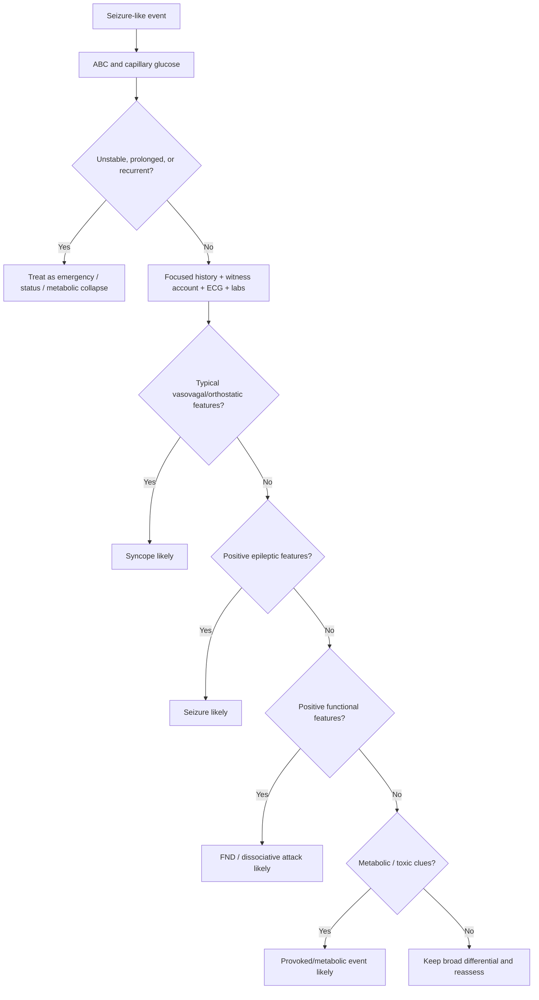

# Important differentials - syncope, FND, and metabolic causes

---
tags: [medicine, neurology, davidson, epilepsy, seizure, differential-diagnosis, syncope, functional-neurological-disorder, metabolic, fcps, mrcp]
chapter: Neurology
davidson_part: Part 3: Clinical Medicine
davidson_chapter: Chapter 28: Neurology
heading: Epilepsy
topic_group: Evaluation of a first seizure
topic: "Important differentials: syncope, FND, and metabolic causes"
exam: [FCPS, MRCP]
status: full-fcps-mrcp-note
references:
  anatomy: ["Gray's Anatomy", Davidson]
  physiology: ["Guyton & Hall", Ganong, Davidson]
  clinical: [Davidson, PasTest]
related:
  - "[[../Neurology MOC|Neurology MOC]]"
  - "[[../Epilepsy|Epilepsy]]"
  - "[[Evaluation of a first seizure]]"
  - "[[Provoked vs unprovoked seizure]]"
  - "[[History, witness account, labs, ECG, neuroimaging, and EEG]]"
  - "[[Dissociative and non-epileptic attacks]]"
---

# Important differentials: syncope, FND, and metabolic causes

Related: [[../Neurology MOC|Neurology MOC]] · [[../Epilepsy|Epilepsy]] · [[Evaluation of a first seizure]] · [[Provoked vs unprovoked seizure]] · [[History, witness account, labs, ECG, neuroimaging, and EEG]] · [[Dissociative and non-epileptic attacks]]

> [!important]
> Not every blackout or convulsive episode is epilepsy. In FCPS/MRCP, candidates lose marks by diagnosing seizure too quickly and missing **syncope**, **functional/dissociative non-epileptic attacks**, or **metabolic causes** such as hypoglycaemia and electrolyte disturbance.

> [!tip]
> A high-scoring differential answer compares **before, during, and after** the episode: trigger, prodrome, color change, movement pattern, tongue bite, duration, recovery time, injury, and witness description.

## Learning Objectives
- Distinguish epileptic seizures from **syncope**, **functional non-epileptic attacks**, and **metabolic causes**.
- Use history and witness features to improve diagnostic accuracy.
- Understand why brief convulsive movements can occur in syncope.
- Know which laboratory and ECG findings are mandatory after a first apparent seizure.
- Recognize red flags that mandate urgent cardiac or metabolic evaluation.

## Definition
This note covers the major **non-epileptic differentials of a first seizure-like event**:
1. **Syncope** with or without brief convulsive movements
2. **Functional neurological disorder (FND) / dissociative non-epileptic attacks (DNEA/PNES)**
3. **Metabolic or toxic disturbances** causing transient altered consciousness, seizure, or seizure-like activity

## Relevant Neuroanatomy
- Epileptic seizures arise from **cortical neuronal hypersynchrony**.
- Syncope is primarily due to **global cerebral hypoperfusion**, not focal cortical discharge.
- Functional attacks reflect disturbed nervous system functioning/brain network control rather than structural epileptic discharge.
- Metabolic disturbances affect neuronal membrane stability diffusely, making cortex more irritable or impairing consciousness.

## Relevant Neurophysiology
### Seizure physiology
- abnormal synchronous cortical firing
- excitatory/inhibitory imbalance
- may produce tonic-clonic motor output, focal phenomena, or impaired awareness

### Syncope physiology
- transient fall in cerebral perfusion
- common mechanisms: vasovagal reflex, orthostatic hypotension, arrhythmia
- brief myoclonic jerks may occur due to cerebral hypoxia, creating **convulsive syncope**

### Functional attack physiology
- not consciously feigned in most patients
- event generation is not due to epileptic electrical discharge
- examination and semiology often show internal inconsistency or positive functional signs

### Metabolic physiology
Common provokers include:
- hypoglycaemia
- hyponatraemia
- hypocalcaemia
- uraemia
- hepatic failure
- drug or alcohol withdrawal/intoxication

These may produce true seizures or altered responsiveness that mimics seizure.

## Normal Values / Important Cut-offs
- **Capillary glucose** should be checked immediately in all acute seizure-like presentations.
- **Hyponatraemia**, especially if acute/severe, can provoke seizures.
- **Hypocalcaemia** can cause tetany and seizures.
- QT prolongation or major arrhythmia on **ECG** can explain collapse and may be life-threatening.
- Prolonged post-event confusion favors epileptic generalized tonic-clonic seizure more than simple vasovagal syncope.

## Classification
### Main differential groups
1. epileptic seizure
2. syncope
   - vasovagal
   - orthostatic
   - cardiac arrhythmic/structural
3. functional non-epileptic attack
4. metabolic/toxic cause
5. other less-common mimics
   - migraine aura
   - transient ischemic event mimic
   - sleep disorders
   - panic attack

## Etiology / Causes
### Syncope causes
- vasovagal reflex
- prolonged standing, heat, pain, distress
- orthostatic hypotension
- dehydration
- arrhythmia
- valvular obstruction or structural heart disease

### Functional attack causes/associations
- psychological stressors may be present but are not required
- previous trauma or adverse experiences in some patients
- comorbid anxiety/depression/chronic pain may coexist
- may coexist with true epilepsy in a minority

### Metabolic/toxic causes
- hypoglycaemia
- hyponatraemia
- hypocalcaemia/hypomagnesaemia
- uraemia
- hepatic encephalopathy
- alcohol withdrawal
- sedative withdrawal
- recreational drugs/toxins
- medication toxicity

## Risk Factors
- prior faints or orthostatic episodes
- known cardiac disease or family history of sudden death
- diabetes on insulin or sulfonylurea
- CKD, liver disease, alcoholism
- diuretic use or fluid depletion
- psychiatric comorbidity or previous functional symptoms
- poor oral intake, vomiting, diarrhea

## Pathophysiology
### Convulsive syncope
1. blood pressure or cardiac output falls
2. cerebral perfusion decreases
3. consciousness is lost
4. brief extensor posturing or myoclonic jerks may occur
5. consciousness usually returns rapidly once perfusion is restored

### Functional attacks
- altered attention, motor control, and body-state processing
- no epileptic EEG correlate during typical event
- semiology may be prolonged, fluctuating, and asynchronous

### Metabolic events
- diffuse neuronal dysfunction from glucose/electrolyte/toxin disturbance
- may produce seizure, delirium, coma, or mixed semiology

## Clinical Features

## History Framework: Before, During, After
### Before the event
Ask about:
- posture: standing, sitting, supine
- trigger: pain, fear, heat, exertion, micturition, cough, prolonged standing
- aura: déjà vu, epigastric rising, focal sensory symptoms suggest seizure
- presyncope: light-headedness, dimming vision, sweating, nausea suggest syncope
- missed meals, insulin use, alcohol, vomiting, diuretics suggest metabolic cause

### During the event
Ask witnesses about:
- sudden floppy collapse vs tonic fall
- color: pallor suggests syncope, cyanosis may follow seizure
- duration
- eye position: tightly closed eyes may suggest functional attacks; open eyes often in seizures/syncope though not absolute
- movement pattern: rhythmic tonic-clonic vs asynchronous thrashing
- tongue bite: lateral bite supports seizure more than tip-of-tongue bite
- incontinence: can occur in seizure and syncope, so not decisive alone

### After the event
- rapid orientation in seconds to under 1-2 minutes favors syncope
- prolonged confusion, headache, myalgia, deep sleep favor generalized seizure
- prolonged unresponsiveness with preserved protective behavior or fluctuating resistance may suggest functional attack
- persistent neuroglycopenic symptoms or autonomic symptoms suggest hypoglycaemia

## Distinguishing Syncope from Seizure
### Features favoring syncope
- provoked by standing, heat, emotion, pain
- presyncope with nausea, sweating, tunnel vision
- brief loss of consciousness
- pallor
- recovery is rapid
- brief irregular jerks may occur but are short-lived

### Features favoring seizure
- no typical vasovagal trigger
- aura such as smell, déjà vu, rising epigastric sensation
- prolonged tonic-clonic movements
- lateral tongue biting
- prolonged post-ictal confusion
- focal neurological deficit or Todd paresis

> [!warning]
> Convulsive movements do **not** automatically mean epilepsy. Syncope can produce a few brief jerks.

## Distinguishing Functional Attacks from Seizure
### Features supporting functional non-epileptic attack
- long duration with waxing and waning intensity
- asynchronous limb movements
- side-to-side head movement
- eye closure with resistance to opening
- pelvic thrusting in some cases
- preserved awareness during apparently generalized shaking in some patients
- crying during or after event
- triggered by emotional context more often
- normal color and less severe post-event confusion than generalized seizure

### Caveats
- No single sign is diagnostic.
- Functional attacks can coexist with epilepsy.
- The diagnosis should be made using **positive semiological evidence**, not by dismissing the patient.

## Distinguishing Metabolic/Toxic Causes
### Clues favoring metabolic provocation
- diabetes treatment or missed meal
- renal failure, liver failure
- vomiting/diarrhea or diuretic use
- alcohol withdrawal
- drug overdose or medication interaction
- fluctuating encephalopathy rather than isolated stereotyped seizure history

### Bedside clues
- diaphoresis, tremor, hunger → hypoglycaemia
- tetany/paraesthesiae/carpopedal spasm → hypocalcaemia
- diffuse confusion/asterixis → hepatic/uremic encephalopathy
- autonomic overdrive, tremor, agitation → withdrawal states

## Approach / Algorithm

## Investigations
### Essential after a first seizure-like event
- **ECG** in all patients
- capillary/random blood glucose
- sodium, potassium, calcium, magnesium as indicated
- renal function, liver function
- pregnancy test if relevant
- toxicology or alcohol/drug history where indicated
- CBC/infection workup if clinically suggested
- EEG and neuroimaging when seizure remains likely or structural cause suspected

### When cardiac evaluation is especially important
- collapse during exertion
- palpitations before event
- family history of sudden death
- structural heart disease
- abnormal ECG
- no post-ictal confusion and very brief loss of consciousness

## Interpretation Frameworks

## Table 1: Seizure vs syncope vs functional attack vs metabolic event
| Feature | Epileptic seizure | Syncope | Functional attack | Metabolic/toxic event |
|---|---|---|---|---|
| Trigger | Often none, sleep deprivation, missed ASM | Standing, heat, pain, emotion | Often situational/emotional | Missed meal, CKD, withdrawal, toxins |
| Prodrome | Aura | Light-headedness, sweating, tunnel vision | Variable | Autonomic/metabolic symptoms |
| Movement | Rhythmic tonic-clonic or focal pattern | Brief irregular jerks possible | Asynchronous, fluctuating | Variable |
| Duration | Usually 1-2 min generalized seizure | Usually brief | Often prolonged | Variable |
| Color | Cyanosis may occur | Pallor common | Often normal | Variable |
| Tongue bite | Lateral supports seizure | Uncommon | Uncommon | Not typical |
| Recovery | Post-ictal confusion common | Rapid recovery | Variable, often prolonged but inconsistent | Depends on correction |
| ECG/labs | May be normal | May reveal cause | Usually normal for event mechanism | Often abnormal |

## Table 2: Witness clues with high practical value
| Witness clue | Suggests |
|---|---|
| Pallor and collapse after standing | Syncope |
| Lateral tongue bite | Seizure |
| Side-to-side head movement, prolonged asynchronous shaking | Functional attack |
| Sweating + confusion in insulin-treated patient | Hypoglycaemia |
| Few myoclonic jerks after brief collapse and rapid recovery | Convulsive syncope |

## Diagnosis
Diagnosis should be phrased probabilistically and evidence-based:
- “History strongly favors vasovagal syncope with brief convulsive movements.”
- “Semiology suggests generalized tonic-clonic seizure.”
- “Positive features support dissociative non-epileptic attacks.”
- “This appears to be a metabolically provoked seizure due to severe glucose/electrolyte disturbance.”

## Differential Diagnosis
Besides the main three groups, consider:
- migraine aura
- parasomnias/nocturnal events
- panic/hyperventilation episodes
- transient global amnesia
- cataplexy in the right context
- intoxication

## Management
### Immediate management
- ensure airway and safety
- check glucose immediately
- treat ongoing seizure if present
- correct reversible metabolic disturbance promptly
- obtain ECG early

### Syncope management
- identify vasovagal vs orthostatic vs cardiac cause
- hydration and trigger avoidance for benign vasovagal syncope
- urgent cardiac workup if red flags present

### Functional attack management
- do not label as malingering
- explain diagnosis positively and respectfully
- avoid unnecessary repeated antiepileptic escalation if epilepsy is not supported
- refer for appropriate neurology and psychological/rehabilitation support

### Metabolic/toxic management
- correct glucose/electrolyte abnormalities
- treat renal/hepatic/withdrawal cause
- review medications and toxins
- antiseizure medication may not be needed long term if the event is clearly provoked and reversible

## Drug Interactions / Contraindications / Comorbidity Cautions
- Avoid starting lifelong antiseizure medication solely on uncertain semiology without adequate evaluation.
- Insulin, sulfonylureas, diuretics, antidepressants, antipsychotics, and alcohol-related issues may create metabolic or arrhythmic mimics.
- QT-prolonging or pro-arrhythmic drugs can contribute to syncope.
- Functional attacks are worsened by repeated unnecessary emergency sedatives/intubations if misdiagnosed as status.

## Procedures / Indications / Contraindications
### ECG
- **Indication:** every first seizure-like episode
- **Reason:** detect arrhythmia, conduction disease, long QT, Brugada-type concerns

### Video-EEG
- **Indication:** recurrent uncertain events, suspected functional attacks vs epilepsy
- **Pearl:** best diagnostic tool when semiology remains unclear

## Procedure Mini-Sections
### Capillary glucose check
- **Indication:** immediately in all acute events
- **Reason:** hypoglycaemia is reversible and dangerous
- **Pitfall:** never delay this while waiting for formal labs

### Witness history collection
- **Indication:** all patients with transient loss of consciousness if witness available
- **Reason:** patient recollection is often incomplete
- **Pearl:** ask witnesses to describe color, posture, duration, movements, recovery

## Complications
- misdiagnosing cardiac syncope as epilepsy → risk of sudden death
- missing severe hypoglycaemia/electrolyte disorder → recurrent events, coma
- mislabeling FND as epilepsy → inappropriate long-term antiseizure therapy
- missing true epilepsy → recurrent unprotected seizures and injury

## Red Flags / Emergencies
- collapse during exertion
- chest pain or palpitations before event
- family history of sudden unexplained death
- severe hypoglycaemia or major electrolyte abnormality
- persistent reduced consciousness
- recurrent convulsive events without recovery
- new focal neurological deficit or prolonged post-ictal state

## Prognosis
- vasovagal syncope usually has good prognosis if benign triggers identified
- arrhythmic syncope may carry serious mortality risk
- metabolically provoked events improve when the cause is corrected
- functional attacks can improve substantially with accurate explanation and multidisciplinary treatment

## Topic Correlation
- [[Provoked vs unprovoked seizure]]
- [[History, witness account, labs, ECG, neuroimaging, and EEG]]
- [[Dissociative and non-epileptic attacks]]
- [[Recognition and emergency sequence]]
- [[Functional vs structural clue pattern]]

## Special Situations
### Elderly patients
Syncope and arrhythmia are common mimics. Polypharmacy and orthostatic hypotension are frequent.

### Pregnancy
Check glucose and consider eclampsia depending on context; maintain broad obstetric differential.

### Diabetes
Hypoglycaemia must be excluded immediately. Recurrent “seizures” around meals or insulin dosing are suspicious.

### CKD/Liver disease
Metabolic encephalopathy and electrolyte shifts may mimic or provoke seizures.

## FCPS/MRCP High-Yield Points
- ECG is essential in first seizure assessment.
- Lateral tongue bite is more specific for seizure than urinary incontinence.
- Rapid full recovery favors syncope.
- Positive semiological signs are needed for FND diagnosis.
- Hypoglycaemia and hyponatraemia are classic reversible provoked causes.

## Common Viva Questions
- How do you differentiate seizure from syncope?
- Can syncope cause jerking movements?
- Which metabolic abnormalities commonly provoke seizures?
- How do you approach dissociative non-epileptic attacks?
- Why is ECG mandatory after a first seizure-like event?

## Common Confusions / Exam Traps
- assuming incontinence proves seizure
- forgetting that syncope can have myoclonic jerks
- giving FND diagnosis without positive features
- missing hypoglycaemia before ordering advanced tests
- ignoring cardiac red flags in transient loss of consciousness

## Mnemonics
### Syncope clues
**“PALE FAST”**
- **P**allor
- **A**fter standing/emotion
- **L**ight-headed prodrome
- **E**arly recovery
- **F**ew jerks only
- **A**rrhythmia check by ECG
- **S**weating/nausea
- **T**unnel vision

### Seizure clues
**“BITE SLOW”**
- **B**ite tongue laterally
- **I**ctal rhythmic movements
- **T**odd paresis
- **E**yes open often
- **S**tereotyped aura
- **L**onger post-ictal phase
- **O**ut of context/no vasovagal trigger
- **W**itnessed cyanosis

## Mind Map
- First seizure differential
  - Seizure
    - aura
    - lateral tongue bite
    - post-ictal confusion
  - Syncope
    - pallor
    - standing trigger
    - rapid recovery
    - brief jerks possible
  - Functional attack
    - prolonged fluctuating event
    - asynchronous movements
    - positive semiological clues
  - Metabolic
    - glucose
    - sodium/calcium
    - renal/liver failure
    - withdrawal/toxins

## Suggested Visuals / Image Notes
- Side-by-side comparison table of seizure vs syncope vs functional attacks
- Flowchart for transient loss of consciousness assessment
- Diagram showing convulsive syncope mechanism from cerebral hypoperfusion

## Suggested Video References
- Clinical videos comparing epileptic and psychogenic non-epileptic attacks
- Teaching videos on transient loss of consciousness history taking
- Bedside ECG red-flag interpretation videos

## One-Page Revision Summary
### Key comparison
- **Seizure:** aura, stereotyped tonic-clonic/focal activity, lateral tongue bite, longer confusion
- **Syncope:** standing/emotion trigger, pallor, sweating, brief LOC, quick recovery, maybe few jerks
- **Functional attack:** prolonged, fluctuating, asynchronous, positive functional signs
- **Metabolic:** glucose/electrolyte/uraemia/withdrawal clues, diffuse encephalopathy features

### Always do
- ABC if unstable
- capillary glucose
- ECG
- electrolytes/renal function ± calcium/magnesium
- witness history

### Must not miss
- arrhythmia
- hypoglycaemia
- severe hyponatraemia
- status epilepticus

## Recall Prompts
### 24-hour recall prompts
- Name 5 features favoring syncope over seizure.
- What is the significance of lateral tongue biting?
- Can incontinence occur in syncope?
- List positive clues for a functional non-epileptic attack.
- Which metabolic tests are mandatory in apparent first seizure?

### 7-day / 15-day / 30-day revision tracker
- **7 days:** explain seizure vs syncope in 2 minutes.
- **15 days:** redraw the comparison table from memory.
- **30 days:** solve 5 blackout scenarios and localize/diagnose each.

## Must Know / Should Know / Nice to Know
### Must Know
- ECG and glucose for every first seizure-like event
- syncope can be convulsive
- positive features needed for FND
- metabolic causes may provoke true seizure or mimic one

### Should Know
- differences in color, duration, and recovery patterns
- cardiac red flags
- lateral tongue bite value

### Nice to Know
- detailed semiology of complex functional attack variants

## My Weak Points
- Do I overcall epilepsy in transient LOC?
- Do I remember ECG in all first seizure assessments?
- Can I compare syncope and seizure without notes?

## Self-Test Scorecard
- Differential diagnosis /10
- Witness history skills /10
- Emergency recognition /10
- ECG/lab interpretation awareness /10
- Viva confidence /10

Interpretation:
- **<35/50** = weak
- **35-44/50** = acceptable
- **45+/50** = strong

## Exam Answer Modes
### Short note
Compare seizure with syncope and functional attacks using trigger, movements, tongue bite, and recovery.

### Viva mode
Begin with “all first seizures are not epilepsy” and then list the major mimics with distinguishing features.

### Ward-case mode
State whether the episode is more likely epileptic, syncopal, functional, or metabolic and justify with witness facts.

## Summary
The best first-seizure assessment is fundamentally a **differential diagnosis exercise**. Syncope causes global hypoperfusion, FND causes non-epileptic but genuine attack presentations, and metabolic disturbances provoke or mimic seizures. Glucose and ECG are mandatory early steps, and diagnosis must rest on positive clinical evidence rather than assumption.

## MCQs (10)
1. Which feature most strongly favors epileptic seizure over syncope?
   - A. Pallor before collapse
   - B. Triggered by prolonged standing
   - C. Lateral tongue bite
   - D. Rapid full orientation within seconds
   - E. Sweating and nausea before event

2. Convulsive syncope occurs because of:
   - A. Focal cortical tumor
   - B. Global cerebral hypoperfusion
   - C. Basal ganglia discharge
   - D. Neuromuscular junction failure
   - E. Cerebellar infarction only

3. Which investigation should be done in all first seizure-like events?
   - A. CSF analysis
   - B. Nerve conduction study
   - C. ECG
   - D. Temporal artery biopsy
   - E. Carotid Doppler only

4. A prolonged fluctuating event with asynchronous limb movements and eye closure most suggests:
   - A. Syncope
   - B. FND / dissociative non-epileptic attack
   - C. Typical generalized tonic-clonic seizure
   - D. Migraine aura only
   - E. TIA

5. Which metabolic abnormality is a classic reversible seizure provoker?
   - A. Mild isolated hypercholesterolemia
   - B. Hyponatraemia
   - C. Iron deficiency without anemia
   - D. Hyperuricaemia
   - E. Mild isolated bilirubin rise

6. Which feature favors syncope rather than seizure?
   - A. Post-ictal confusion for 30 minutes
   - B. Lateral tongue bite
   - C. Pallor and rapid recovery
   - D. Todd paresis
   - E. Stereotyped aura

7. The diagnosis of functional non-epileptic attacks should be based on:
   - A. Normal MRI alone
   - B. Psychiatric history alone
   - C. Positive semiological features and appropriate evaluation
   - D. One negative EEG only
   - E. Absence of tongue bite only

8. Incontinence in transient loss of consciousness:
   - A. Proves epilepsy
   - B. Excludes syncope
   - C. Can occur in both seizure and syncope
   - D. Occurs only in FND
   - E. Has no value at all

9. A diabetic patient with collapse, sweating, and confusion should first have:
   - A. Brain biopsy
   - B. Capillary glucose checked
   - C. Lumbar puncture
   - D. EMG
   - E. Vestibular testing

10. Which event most urgently suggests cardiac syncope?
   - A. Collapse after prolonged standing in a hot room
   - B. Collapse during exertion with palpitations
   - C. Morning myoclonic jerks
   - D. Déjà vu before blackout
   - E. Recurrent positional vertigo

## SBA Questions (10)
1. A 21-year-old student faints while standing in a crowded hot bus. Witnesses describe pallor, a brief collapse, two or three jerks, and quick recovery. Most likely diagnosis:
   - A. Generalized epileptic seizure
   - B. Vasovagal syncope with brief convulsive movements
   - C. Dissociative attack
   - D. Temporal lobe seizure
   - E. Cataplexy

2. A 28-year-old woman has prolonged shaking episodes lasting 8 minutes with waxing and waning intensity, eye closure, and side-to-side head movement. She recovers without post-ictal confusion. Most likely diagnosis:
   - A. Status epilepticus
   - B. Dissociative non-epileptic attack
   - C. Typical absence seizure
   - D. Syncope
   - E. Brainstem event

3. A 60-year-old man with ischemic heart disease collapses during exertion and reports preceding palpitations. Best next concern:
   - A. Migraine aura
   - B. Cardiac syncope due to arrhythmia
   - C. BPPV
   - D. Functional disorder
   - E. Tension headache

4. A 45-year-old insulin-treated diabetic is found confused and sweaty after missing lunch. Which first action is most important?
   - A. EEG
   - B. Capillary glucose
   - C. MRI brain
   - D. Lumbar puncture
   - E. Nerve conduction study

5. A patient with generalized stiffening, lateral tongue bite, and 20 minutes of confusion after the event most likely had:
   - A. Vasovagal syncope
   - B. Generalized tonic-clonic seizure
   - C. Functional attack
   - D. Panic attack
   - E. Ménière disease

6. A patient has repeated collapse episodes but all investigations are normal. Which statement is best?
   - A. This proves malingering
   - B. A diagnosis of FND can never be made
   - C. Positive attack semiology is required before diagnosing functional attacks
   - D. Start lifelong ASM regardless
   - E. ECG is unnecessary

7. Which feature most strongly supports syncope rather than epilepsy?
   - A. Déjà vu aura
   - B. Pallor, nausea, and tunnel vision before collapse
   - C. Lateral tongue bite
   - D. Todd paresis
   - E. Long post-event confusion

8. A CKD patient develops confusion and a convulsion. Which broad cause should be actively considered?
   - A. Only primary epilepsy
   - B. Metabolic provocation
   - C. Peripheral vertigo
   - D. Functional weakness
   - E. Tension headache

9. Which test should not be omitted when assessing apparent first seizure because it may identify a dangerous mimic?
   - A. ESR
   - B. ECG
   - C. Spirometry
   - D. Audiogram
   - E. Endoscopy

10. A witness says the patient became pale, slumped, twitched briefly, and opened eyes rapidly after being laid flat. The event is most consistent with:
   - A. Convulsive syncope
   - B. Status epilepticus
   - C. Focal to bilateral tonic-clonic epilepsy
   - D. Myasthenic crisis
   - E. Cerebellar syndrome

## Flashcards
- Q: What feature is more specific for seizure than incontinence?
  A: Lateral tongue biting.

- Q: Can syncope cause jerking movements?
  A: Yes, brief convulsive movements can occur in syncope due to cerebral hypoperfusion.

- Q: What two tests are mandatory early in first seizure-like episodes?
  A: Capillary glucose and ECG.

- Q: What recovery pattern favors syncope?
  A: Rapid return to orientation with minimal post-event confusion.

- Q: How should functional non-epileptic attacks be diagnosed?
  A: By positive semiological features and appropriate evaluation, not by dismissal.

- Q: Name two metabolic causes of seizure-like events.
  A: Hypoglycaemia and hyponatraemia.

- Q: What symptom cluster before collapse suggests vasovagal syncope?
  A: Light-headedness, sweating, nausea, and tunnel vision.

- Q: What post-event feature favors generalized seizure?
  A: Prolonged post-ictal confusion.

- Q: Why is exertional collapse a red flag?
  A: It may indicate cardiac syncope due to arrhythmia or structural heart disease.

- Q: Can FND and epilepsy coexist?
  A: Yes.

## Answer Key with Explanations
### MCQs
1. **C. Lateral tongue bite** — a helpful clue toward epileptic seizure.
2. **B. Global cerebral hypoperfusion** — mechanism of syncope.
3. **C. ECG** — essential in all first seizure-like events.
4. **B. FND / dissociative non-epileptic attack** — prolonged fluctuating asynchronous movements and eye closure support this.
5. **B. Hyponatraemia** — classic provoker.
6. **C. Pallor and rapid recovery** — favors syncope.
7. **C. Positive semiological features and appropriate evaluation** — best practice.
8. **C. Can occur in both seizure and syncope** — not decisive alone.
9. **B. Capillary glucose checked** — first bedside step.
10. **B. Collapse during exertion with palpitations** — cardiac red flag.

### SBAs
1. **B. Vasovagal syncope with brief convulsive movements** — classic trigger and recovery.
2. **B. Dissociative non-epileptic attack** — positive functional semiology.
3. **B. Cardiac syncope due to arrhythmia** — urgent possibility.
4. **B. Capillary glucose** — immediate reversible cause check.
5. **B. Generalized tonic-clonic seizure** — tongue bite and prolonged confusion strongly support this.
6. **C. Positive attack semiology is required before diagnosing functional attacks** — diagnostic principle.
7. **B. Pallor, nausea, and tunnel vision before collapse** — typical vasovagal prodrome.
8. **B. Metabolic provocation** — CKD can create biochemical triggers.
9. **B. ECG** — dangerous mimic detection.
10. **A. Convulsive syncope** — pallor, brief twitching, rapid recovery after lying flat.

## PasTest Scenario SBAs (Clinical Vignettes)

> **Auto-generated PasTest/Mediscope-style scenario SBAs** grounded in the authored source. Each scenario tests a real clinical fact (triad, specific sign, contraindication, trial, first-line Rx) extracted from the topic. *Source: Ch 27: Neurology & Stroke — Important differentials - syncope, FND, and metabolic causes*

**Q1.** Which of the following features is most specific or characteristic of Important differentials - syncope, FND, and metabolic causes?

  - **A.** B. Pallor, nausea, and tunnel vision before collapse
  - **B.** A feature common to many acute inflammatory conditions
  - **C.** A non-specific sign that does not localise the diagnosis
  - **D.** An investigation finding rather than a clinical feature

  > **Answer: A** — B. Pallor, nausea, and tunnel vision before collapse
  >
  > *Source:* **B. Pallor, nausea, and tunnel vision before collapse** — typical vasovagal prodrome

