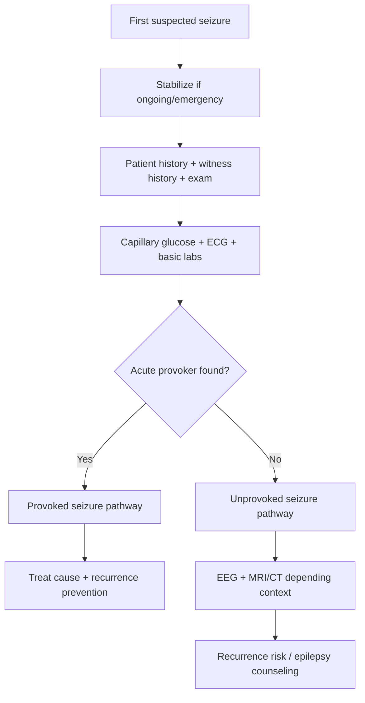
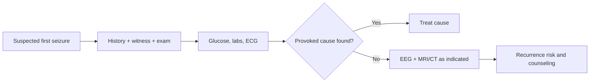

# History, witness account, labs, ECG, neuroimaging, and EEG

---
tags: [medicine, neurology, davidson, epilepsy, first-seizure, eeg, ecg, neuroimaging, fcps, mrcp]
chapter: Neurology
davidson_part: Part 3: Clinical Medicine
davidson_chapter: Chapter 28: Neurology
heading: Epilepsy
topic_group: Evaluation of a first seizure
topic: History, witness account, labs, ECG, neuroimaging, and EEG
exam: [FCPS, MRCP]
status: full-fcps-mrcp-note
references:
  anatomy: ["Gray's Anatomy", Davidson]
  physiology: ["Guyton & Hall", Ganong, Davidson]
  clinical: [Davidson, PasTest]
related:
  - "[[../Neurology MOC|Neurology MOC]]"
  - "[[../Epilepsy|Epilepsy]]"
  - "[[Evaluation of a first seizure]]"
  - "[[Provoked vs unprovoked seizure]]"
  - "[[Important differentials - syncope, FND, and metabolic causes|Important differentials: syncope, FND, and metabolic causes]]"
---

# History, witness account, labs, ECG, neuroimaging, and EEG

Related: [[../Neurology MOC|Neurology MOC]] · [[../Epilepsy|Epilepsy]] · [[Evaluation of a first seizure]] · [[Provoked vs unprovoked seizure]] · [[Important differentials - syncope, FND, and metabolic causes|Important differentials: syncope, FND, and metabolic causes]]

> [!important]
> The best first-seizure evaluation is **history-led**. Many cases are solved by the **witness description**, while tests such as **ECG, glucose, electrolytes, imaging, and EEG** refine cause, recurrence risk, and safety decisions.

> [!tip]
> In FCPS/MRCP answers, do not over-focus on EEG alone. A strong answer systematically covers: **Was it a true seizure? Was it provoked? Is there structural disease? Is there cardiac syncope? Is long-term recurrence risk high?**

## Learning Objectives
- Take a focused first-seizure history.
- Use witness details to classify seizure type and distinguish common mimics.
- Order and interpret essential bedside/lab tests.
- Know when ECG, CT/MRI, and EEG are indicated.
- Integrate findings into provoked vs unprovoked and recurrence-risk assessment.

## Definition
This topic covers the **core evaluation package after a first suspected seizure**, centered on:
- history from patient and witness
- bedside safety assessment
- relevant laboratory tests
- ECG
- neuroimaging
- EEG

## Relevant Neuroanatomy
- Focal semiology can reflect cortical origin:
  - temporal lobe → aura, automatisms, memory/deja vu
  - frontal lobe → motor posturing, brief hypermotor events
  - parietal lobe → sensory symptoms
  - occipital lobe → visual symptoms
- Structural lesions in these areas may explain unprovoked seizures.

## Relevant Neurophysiology
- Epileptic seizures arise from abnormal synchronized cortical discharges.
- EEG detects electrical abnormalities supporting epileptic tendency.
- Metabolic derangements, toxic states, and syncope mechanisms may mimic or provoke events without implying chronic epilepsy.

## Normal Values / Important Cut-offs
- Immediate bedside priorities: **glucose** and vital stability.
- Severe abnormalities of sodium, glucose, calcium, or toxic withdrawal can indicate a **provoked seizure**.
- Normal EEG does **not** exclude epilepsy.
- Early CT can be normal in several non-hemorrhagic structural conditions; MRI is more sensitive for many chronic epileptogenic lesions.

## Classification
### Main evaluative questions
1. Was the event a **true epileptic seizure**?
2. Was it **provoked** or **unprovoked**?
3. Was it **focal** or **generalized**?
4. Is there **structural brain disease**?
5. Is there a **cardiac** or **metabolic** mimic?

## Etiology / Causes to uncover
- structural brain lesion
- stroke/bleed
- CNS infection
- metabolic disturbance
- alcohol or drug withdrawal
- primary epilepsy syndrome
- syncope/arrhythmia mimic
- functional nonepileptic attack

## Risk Factors
- prior brain insult
- remote meningitis/encephalitis
- family history of epilepsy
- nocturnal event
- focal neurological deficits
- known malignancy or immunocompromised state
- alcohol or sedative withdrawal risk

## Pathophysiology
The investigation pathway matters because a first event may represent:
- a **provoked transient threshold-lowering event**,
- an **enduring epileptogenic structural lesion**, or
- a **non-epileptic mimic** such as arrhythmic syncope.

## Clinical Features
### Key history questions from the patient
- What was happening before the event?
- Was there sleep deprivation, fever, alcohol withdrawal, medication omission, fasting, or infection?
- Any aura: smell, epigastric rising sensation, fear, visual symptoms, tingling?
- Was recovery rapid or prolonged?
- Any previous brief unexplained episodes?

### Critical witness questions
Witness history is often the most valuable component.
Ask about:
- sudden loss of awareness or gradual collapse?
- eye opening or forced deviation?
- stiffening, rhythmic jerking, asymmetry?
- cyanosis?
- duration?
- tongue biting, especially lateral?
- urinary incontinence?
- confusion after the event?

### Features favoring seizure
- lateral tongue bite
- post-ictal confusion
- witnessed tonic-clonic activity
- head/eye version or focal onset clues
- deep sleep or prolonged drowsiness afterward

### Features favoring syncope or mimic
- prodromal sweating, nausea, tunnel vision
- brief loss of consciousness with rapid recovery
- clear trigger such as prolonged standing
- arrhythmic/cardiac warning history
- inconsistent or prolonged asynchronous events suggesting FND/PNES

## Approach / Algorithm

## Investigations
### Bedside essentials
- capillary glucose
- BP, pulse, oxygen saturation, temperature
- focused neurological examination

### Routine bloods often useful
- CBC
- electrolytes including sodium
- calcium and magnesium when indicated
- renal function
- liver function when relevant
- pregnancy test where relevant
- toxicology / alcohol history-based tests
- antiseizure drug level only if already on therapy

### ECG
**ECG is mandatory in many first-seizure assessments** because convulsive syncope from arrhythmia can mimic seizure.
Look for:
- long QT
- Brugada pattern
- heart block
- significant arrhythmia
- ischemic changes in context

### Neuroimaging
#### CT head
Useful when:
- acute focal deficit
- trauma
- persistent altered consciousness
- suspected hemorrhage
- anticoagulation
- emergency setting

#### MRI brain
Preferred for many structural epilepsy evaluations when stable, especially if:
- focal onset suspected
- CT normal but concern persists
- recurrent unprovoked events
- tumor, malformation, mesial temporal sclerosis, demyelination suspected

### EEG
Useful for:
- classification of seizure type
- support for epileptic tendency
- recurrence risk stratification after unprovoked seizure
- suspected non-convulsive status or unusual episodes

Limitations:
- normal EEG does **not** exclude epilepsy
- abnormal EEG does not always mean the clinical event was epileptic without proper context

## Interpretation Frameworks
### History framework
1. Before the event
2. During the event
3. After the event
4. Previous similar episodes
5. Provoking factors
6. Family and comorbidity context

### Witness framework
| Witness clue | Suggests |
|---|---|
| Sudden stiffening then rhythmic jerking | Generalized tonic-clonic seizure |
| One-sided onset or head version | Focal onset seizure |
| Pallor, collapse, brief twitching, rapid recovery | Syncope more likely |
| Prolonged asynchronous thrashing with closed eyes | PNES/FND may be considered |

### Test interpretation framework
| Test | Why it matters |
|---|---|
| Glucose | Detects reversible provoked cause |
| Sodium/calcium | Metabolic seizure triggers |
| ECG | Detects arrhythmic syncope mimic |
| CT/MRI | Finds acute or chronic structural lesion |
| EEG | Supports seizure classification and recurrence risk |

## Diagnosis
Diagnosis is based on synthesis:
- clinical event pattern
- witness description
- provoking factors
- examination findings
- supportive investigations

A first seizure diagnosis is rarely made from EEG alone.

## Differential Diagnosis
- vasovagal syncope
- arrhythmic syncope
- psychogenic non-epileptic attack / FND
- hypoglycaemic event
- TIA/migraine aura
- parasomnia
- movement disorder

## Tables / Comparison Charts
| Feature | Seizure | Syncope |
|---|---|---|
| Onset | Often sudden, may have aura | Often presyncopal prodrome |
| Movements | Tonic-clonic or focal | Brief myoclonic jerks possible |
| Tongue bite | Lateral more suggestive | Less typical |
| Recovery | Post-ictal confusion | Usually rapid |
| ECG value | May reveal mimic | Critical |

## Management
### Immediate priorities
- treat ongoing seizure if present
- correct reversible causes
- identify red flags requiring admission or urgent imaging

### After event
- seizure precautions and safety advice
- avoid swimming alone, heights, dangerous machinery
- driving advice according to local rules
- arrange EEG/MRI where indicated
- treat the underlying cause if provoked

## Drug Interactions / Contraindications / Comorbidity Cautions
- Do not start lifelong antiseizure treatment automatically after every first event.
- Valproate requires caution in women of childbearing potential.
- Cardiac syncope can be fatal if missed; never skip ECG.
- In renal or liver disease, both causes and treatment choices may differ.

## Procedures / Indications / Contraindications
- **EEG** when unprovoked seizure is suspected or classification is needed.
- **CT head** in acute/emergency structural concern.
- **MRI brain** for higher-resolution structural assessment.
- **LP** if CNS infection is suspected and safe.

## Procedure Mini-Sections
### Witness interview
- **Indication:** every first seizure if a witness exists
- **Pearl:** witness detail often outperforms patient memory because consciousness is impaired during events

### EEG
- **Pearl:** normal EEG does not exclude epilepsy, especially if recorded between events

## Complications
- missed CNS infection or bleed
- missed arrhythmia causing convulsive syncope
- inappropriate epilepsy labeling
- unsafe discharge without counseling

## Red Flags / Emergencies
- prolonged or repeated seizures
- focal neurological deficit
- fever or meningism
- persistent low GCS
- anticoagulation or trauma
- pregnancy-associated seizure
- suspected arrhythmia or exertional collapse

## Prognosis
Prognosis depends on cause:
- provoked events may not recur if the trigger is corrected
- unprovoked seizures carry higher recurrence risk
- structural lesions and epileptiform EEG increase future seizure risk

## Topic Correlation
- [[Provoked vs unprovoked seizure]]
- [[Recognition and emergency sequence]]
- [[Important differentials - syncope, FND, and metabolic causes|Important differentials: syncope, FND, and metabolic causes]]
- [[Neuroimaging/Non-contrast CT head basics|Non-contrast CT head basics]]
- [[Neurophysiological Testing/When to request EEG|When to request EEG]]

## Special Situations
- **Older adults:** higher structural and cardiac risk; ECG and imaging are especially important.
- **Pregnancy:** think eclampsia, ASM teratogenicity, obstetric input.
- **Immunocompromised patients:** think opportunistic infection or mass lesion.
- **Known malignancy:** brain metastasis or carcinomatous disease becomes important.

## FCPS/MRCP High-Yield Points
- Witness history is crucial.
- ECG is part of first-seizure work-up.
- EEG helps, but a normal EEG does not exclude epilepsy.
- MRI is often better than CT for chronic epileptogenic lesions.
- Always classify as provoked vs unprovoked.

## Common Viva Questions
- What points will you ask the witness?
- Why do you request an ECG in first seizure?
- When do you image the brain?
- What is the role of EEG after a first seizure?
- What laboratory tests are essential initially?

## Common Confusions / Exam Traps
- overreliance on EEG
- forgetting ECG
- failing to ask about post-event recovery
- ignoring alcohol/benzodiazepine withdrawal
- calling syncope a seizure without witness details

## Mnemonics
- **SEIZURE WORKUP = H-W-L-E-I-E**
  - **H**istory
  - **W**itness
  - **L**abs
  - **E**CG
  - **I**maging
  - **E**EG

## Mind Map
- First seizure evaluation
  - History
  - Witness
  - Labs
    - glucose
    - sodium
    - calcium
  - ECG
  - Imaging
    - CT
    - MRI
  - EEG
  - Outcome
    - provoked
    - unprovoked
    - mimic

## Flowchart

## Suggested Visuals / Image Notes
- First seizure work-up flowchart
- Witness-history checklist
- Provoked vs unprovoked diagnostic tree

## Suggested Video References
- Look for: “first seizure approach MRCP FCPS”
- Look for: “how to distinguish seizure from syncope”
- Look for: “role of EEG and MRI after first seizure”

## One-Page Revision Summary
- First seizure work-up begins with **history + witness account**.
- Always assess **provoked vs unprovoked**.
- Essential bedside/labs: **glucose, electrolytes, ECG**.
- CT for emergency structural concerns; MRI for detailed epilepsy work-up.
- EEG supports classification and recurrence risk but cannot rule epilepsy out if normal.
- Never forget cardiac syncope as a dangerous mimic.

## 24-Hour Recall Prompts
- What are the 5 most important witness questions?
- Why is ECG essential?
- When do you prefer MRI over CT?
- What does a normal EEG not exclude?
- How do you separate provoked from unprovoked events?

## 7-Day / 15-Day / 30-Day Revision Tracker
- **Day 1:** Reproduce first-seizure work-up from memory.
- **Day 7:** Compare seizure vs syncope clues.
- **Day 15:** Write indications for CT, MRI, and EEG.
- **Day 30:** Solve 10 first-seizure SBAs without notes.

## Must Know / Should Know / Nice to Know
### Must Know
- witness history
- ECG
- glucose/electrolytes
- EEG role and limitation
- CT vs MRI indication

### Should Know
- focal semiology clues
- provoking factor details
- special population considerations

### Nice to Know
- advanced epilepsy protocol MRI nuances

## My Weak Points
- Do I remember ECG every time?
- Do I rely too much on EEG?
- Can I list the key witness questions quickly?

## Self-Test Scorecard
- History taking: __/10
- Differential accuracy: __/10
- Investigation selection: __/10
- Recurrence-risk understanding: __/10
- Viva confidence: __/10

## Exam Answer Modes
- **Long answer:** approach to first seizure.
- **Short note:** role of EEG and imaging in first seizure.
- **Viva:** “What history and investigations will you do after a first seizure?”

## Summary
Evaluation of a first seizure is a structured process: take a careful **history**, obtain a **witness account**, check **glucose/labs and ECG**, and use **imaging and EEG** appropriately. The key clinical aim is to decide whether the event was epileptic, provoked or unprovoked, and whether there is a structural or cardiac explanation.

## MCQs (10)
1. The most useful single source of information in many first-seizure cases is:
   - A. Serum urate
   - B. Witness account
   - C. Visual acuity
   - D. Spirometry
   - E. ESR alone

2. Which investigation is essential because arrhythmic syncope can mimic seizure?
   - A. ECG
   - B. Audiogram
   - C. Stool culture
   - D. Bone scan
   - E. Skin biopsy

3. Which bedside test should be checked urgently in all first seizures?
   - A. Capillary glucose
   - B. Peak flow
   - C. Color vision
   - D. Serum folate only
   - E. ANA only

4. Which statement about EEG is correct?
   - A. Normal EEG excludes epilepsy
   - B. EEG is never useful
   - C. EEG can support classification and recurrence risk but may be normal in epilepsy
   - D. EEG replaces history
   - E. EEG detects only syncope

5. MRI is often preferred over CT in stable first-seizure work-up because it:
   - A. Is always faster in emergencies
   - B. Better detects many structural epileptogenic lesions
   - C. Replaces ECG
   - D. Measures glucose
   - E. Is unnecessary in focal seizures

6. Which finding most favors seizure over syncope?
   - A. Rapid full recovery without confusion
   - B. Lateral tongue bite and post-ictal confusion
   - C. Sweating before collapse only
   - D. Brief pallor with quick awakening
   - E. Isolated presyncope on standing

7. Which is a common provoking factor to ask about?
   - A. Alcohol withdrawal
   - B. Hair loss
   - C. Presbyopia
   - D. Vitiligo
   - E. Tinnitus alone

8. CT head is especially useful first when there is concern about:
   - A. Acute hemorrhage or emergency structural lesion
   - B. Subtle demyelination only
   - C. Chronic neuropathy only
   - D. Essential tremor
   - E. Peripheral vertigo

9. Which one best summarizes the first-seizure work-up?
   - A. EEG only
   - B. History, witness, labs, ECG, imaging, EEG as indicated
   - C. MRI only
   - D. Ophthalmology review only
   - E. No tests if the patient is young

10. Which result most strongly suggests a provoked seizure?
   - A. Severe hyponatraemia at presentation
   - B. Normal blood tests with focal MRI lesion only
   - C. Normal EEG only
   - D. Family history only
   - E. No trigger and nocturnal event

## SBA Questions (10)
1. A 23-year-old man collapses with generalized jerking. The patient remembers nothing, but a friend reports tonic stiffening, rhythmic jerks, lateral tongue bite, and confusion afterward. What is the most valuable conclusion?
   - A. The witness description strongly supports epileptic seizure
   - B. This is definitely BPPV
   - C. This excludes all need for tests
   - D. This proves psychogenic attack
   - E. This proves migraine aura

2. A 40-year-old woman has an apparent first seizure. Which investigation is most important to exclude a dangerous mimic from arrhythmia?
   - A. ECG
   - B. Spirometry
   - C. Colonoscopy
   - D. X-ray knee
   - E. Audiometry

3. A patient with suspected first seizure has normal CT but focal semiology and no acute trigger. What is the next best imaging principle?
   - A. No more imaging is ever needed
   - B. MRI brain is often more informative for structural epileptogenic lesions
   - C. CT proves the brain is normal forever
   - D. Only LP is relevant
   - E. Imaging has no role

4. Which bedside test should be done urgently in the emergency assessment?
   - A. Capillary glucose
   - B. Vitamin D
   - C. Bone density scan
   - D. ANA profile
   - E. Ferritin only

5. A patient faints while standing in a hot crowd, becomes pale, has a few brief jerks, and recovers quickly. What important alternative diagnosis should be considered?
   - A. Convulsive syncope
   - B. Parkinson disease
   - C. Ménière disease
   - D. BPPV
   - E. Bell palsy

6. A first-seizure patient has fever, headache, neck stiffness, and confusion. What is the best principle?
   - A. Ignore infection because the event is neurological
   - B. Evaluate urgently for CNS infection and provoked seizure
   - C. Diagnose chronic epilepsy immediately
   - D. Only request EEG
   - E. Send home if the jerking stops

7. Which statement about witness history is best?
   - A. It is optional and usually unhelpful
   - B. It may be more reliable than the patient’s account of the ictal event
   - C. It replaces examination completely
   - D. It is only useful in children
   - E. It is irrelevant if EEG is normal

8. A patient has a normal EEG after a convincing seizure history. What is the best interpretation?
   - A. Epilepsy is excluded
   - B. Normal EEG does not exclude epilepsy
   - C. The event must have been syncope
   - D. MRI is impossible now
   - E. No follow-up is needed

9. Which factor most strongly pushes imaging toward urgent CT rather than outpatient MRI first?
   - A. Persistent altered consciousness after the event
   - B. Stable long-term mild headache history only
   - C. Known seasonal allergy
   - D. Presbyopia
   - E. Mild anemia alone

10. Which answer best captures the purpose of the first-seizure work-up?
   - A. To determine whether the event was epileptic, provoked, structurally caused, or mimicked by another disorder
   - B. To order every possible investigation
   - C. To confirm epilepsy using EEG alone
   - D. To avoid witness history
   - E. To skip examination

## Flashcards
- Q: What is often the most valuable part of first-seizure evaluation?
  A: The witness account.
- Q: Why is ECG important after a first seizure?
  A: To exclude arrhythmic convulsive syncope.
- Q: What bedside test must be done urgently?
  A: Capillary glucose.
- Q: Does a normal EEG exclude epilepsy?
  A: No.
- Q: Which imaging is often best for chronic structural epileptogenic lesions?
  A: MRI brain.
- Q: What does lateral tongue bite suggest?
  A: An epileptic seizure is more likely.
- Q: Name one key provoking factor to ask about.
  A: Alcohol or benzodiazepine withdrawal.
- Q: When is CT especially useful first?
  A: Acute emergency structural or hemorrhagic concern.
- Q: What are the two major classification questions after a first seizure?
  A: Was it a true seizure, and was it provoked or unprovoked?
- Q: What does rapid recovery with pallor and presyncope suggest?
  A: Syncope rather than seizure.

## Answer Key with Explanations
### MCQs
1. **B** — witness history is often the key diagnostic clue.
2. **A** — ECG is essential because arrhythmias can mimic seizure.
3. **A** — glucose is the bedside emergency test not to miss.
4. **C** — EEG helps but may be normal in epilepsy.
5. **B** — MRI is better for many chronic epileptogenic lesions.
6. **B** — lateral tongue bite and post-ictal confusion strongly favor seizure.
7. **A** — alcohol withdrawal is a classic provoking factor.
8. **A** — CT is strong for acute emergency structural/hemorrhagic pathology.
9. **B** — this is the correct broad work-up approach.
10. **A** — severe hyponatraemia strongly suggests a provoked event.

### SBAs
1. **A** — those witness features strongly support epileptic seizure.
2. **A** — ECG helps exclude dangerous arrhythmic syncope.
3. **B** — MRI is the next structural step when CT is unrevealing but suspicion persists.
4. **A** — glucose must be checked urgently.
5. **A** — convulsive syncope is an important mimic.
6. **B** — this may be a provoked seizure from CNS infection and needs urgent evaluation.
7. **B** — the patient often cannot accurately describe the ictal phase.
8. **B** — epilepsy can still be present despite a normal interictal EEG.
9. **A** — persistent altered consciousness suggests urgent structural evaluation.
10. **A** — the whole work-up is about identifying the nature and cause of the event.