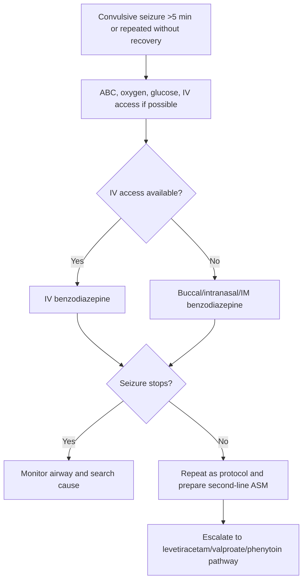
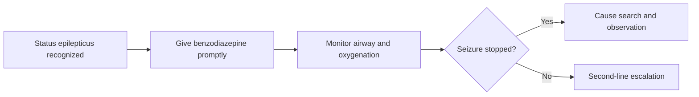

# Benzodiazepine first-line treatment

Related: [[../Neurology MOC|Neurology MOC]] · [[../Epilepsy|Epilepsy]] · [[Status epilepticus]] · [[Recognition and emergency sequence]] · [[Second-line escalation and precipitant search]]

> [!important]
> Benzodiazepines are the **first-line drugs in convulsive status epilepticus** because they act rapidly by enhancing **GABA-A–mediated inhibition**. Delay in benzodiazepine use worsens seizure persistence, systemic complications, and brain injury risk.

> [!tip]
> In FCPS/MRCP answers, do not just name lorazepam or diazepam. Explain **when to give them, by which route, what to do if IV access is absent, what to monitor, and when to escalate to second-line therapy**.

## Learning Objectives
- Explain why benzodiazepines are first-line in status epilepticus.
- Compare common benzodiazepines and routes used in acute seizure care.
- Apply safe dosing principles and monitoring.
- Recognize limitations, adverse effects, and escalation points.
- Integrate benzodiazepine use into the broader status epilepticus algorithm.

## Definition
This topic refers to the **initial emergency pharmacologic treatment of ongoing convulsive seizure/status epilepticus using benzodiazepines**, typically:
- IV lorazepam
- IV diazepam
- buccal/intranasal/IM midazolam depending access and setting

## Relevant Neuroanatomy
- Generalized convulsive seizures involve bilateral cortical-subcortical motor network recruitment.
- Limbic and cortical excitatory circuits sustain seizure activity.
- Brainstem respiratory function and airway protection may be compromised during both the seizure and sedative treatment.

## Relevant Neurophysiology
### Why benzodiazepines work
Benzodiazepines bind the **GABA-A receptor complex** and increase inhibitory neurotransmission.
This leads to:
- reduced neuronal firing
- seizure termination or reduction
- suppression of propagation of ictal activity

### Why early treatment matters
With prolonged status epilepticus:
- GABAergic responsiveness may decline
- excitatory mechanisms dominate more strongly
- seizure becomes harder to stop
Thus, early benzodiazepine administration is more effective than delayed administration.

## Normal Values / Important Cut-offs
- Treat generalized convulsive status at **>=5 minutes**.
- If one adequate first-line benzodiazepine dose fails and the seizure continues, a protocol-based repeat may be given, but do **not** delay second-line escalation excessively.
- Watch for respiratory depression, oxygen desaturation, and hypotension after treatment.

## Classification
### Common benzodiazepine options in acute seizure care
1. **Lorazepam** — preferred IV option in many protocols
2. **Diazepam** — IV/rectal option, rapid effect but shorter CNS residence
3. **Midazolam** — buccal/intranasal/IM/IV option, very useful when IV access is not available

### By route
- IV
- buccal
- intranasal
- IM
- rectal in some settings

## Etiology / Context of Use
Benzodiazepines are first-line regardless of cause while the cause is being sought:
- missed antiseizure medication
- hypoglycaemia
- alcohol withdrawal
- infection
- acute brain lesion
- metabolic disturbance

## Risk Factors for Complications During Use
- respiratory compromise
- obesity/OSA
- older age/frailty
- co-ingested sedatives or alcohol
- hemodynamic instability
- severe underlying metabolic or infective disease

## Pathophysiology
1. Status epilepticus reflects persistent uncontrolled cortical firing.
2. Benzodiazepines rapidly enhance inhibition and may terminate seizure.
3. If seizure persists, the process is moving toward established/refractory status and second-line agents are needed.

## Clinical Features
Benzodiazepines are indicated when there is:
- ongoing convulsive seizure beyond 5 minutes
- repeated seizures without return to baseline consciousness
- prehospital or emergency department status epilepticus
- some prolonged focal impaired-awareness seizures according to clinical context/protocol

## Approach / Algorithm

## Investigations
Investigations run alongside benzodiazepine treatment, not before it:
- capillary glucose
- electrolytes
- calcium/magnesium
- renal/liver function
- ECG
- blood gas/lactate
- imaging/LP/EEG later as indicated by cause

## Interpretation Frameworks
### Drug-selection framework
1. Is IV access available?
2. Is the patient prehospital, ward-based, or in ED/ICU?
3. Is there severe respiratory compromise requiring airway support readiness?
4. Has one adequate benzodiazepine already been given?
5. Has the seizure stopped, partially stopped, or persisted?

### Practical comparison table
| Drug | Route(s) | Major strength | Important caution |
|---|---|---|---|
| Lorazepam | IV | Strong first-line hospital option | Respiratory depression, sedation |
| Diazepam | IV/rectal | Rapid onset, common access | Shorter duration, repeated dosing may be needed |
| Midazolam | Buccal/intranasal/IM/IV | Excellent when IV access absent | Respiratory depression, oversedation |

## Diagnosis
This note does not diagnose seizure cause; it concerns the **first-line treatment step** once clinical status epilepticus is recognized.

## Differential Diagnosis
Before or during treatment, consider:
- epileptic status
- convulsive syncope
- psychogenic nonepileptic attack
- rigors/tetany

But if genuine convulsive status is likely, **treat immediately** and refine later.

## Tables / Comparison Charts
| Scenario | Best benzodiazepine principle |
|---|---|
| Hospital with IV access | IV lorazepam or IV diazepam depending protocol |
| No IV access | Buccal/intranasal/IM midazolam commonly useful |
| Community/prehospital | Non-IV routes often essential |
| Persistent seizure after first-line | Move quickly to second-line ASM pathway |

## Management
### Core management principles
- Give benzodiazepine promptly.
- Monitor airway, breathing, circulation continuously.
- If seizure continues, do not repeat endlessly—move to second-line antiseizure therapy.
- Search and treat underlying precipitant.

### Monitoring after administration
- respiratory rate
- oxygen saturation
- blood pressure
- mental status
- persistence or recurrence of seizure activity

## Drug Interactions / Contraindications / Comorbidity Cautions
- Combined sedative effects with alcohol/opioids increase respiratory risk.
- Severe respiratory compromise requires readiness for assisted ventilation.
- Repeated doses can oversedate the patient and cloud ongoing neurological assessment.
- In alcohol withdrawal seizures, benzodiazepines are especially appropriate, but the patient still requires broader withdrawal management.

## Procedures / Indications / Contraindications
### Airway support
- **Indication:** desaturation, apnea, poor airway protection, refractory status, repeated benzodiazepine dosing

### IV access vs non-IV route choice
- use the fastest feasible route without delaying treatment

## Procedure Mini-Sections
### Buccal midazolam
- **Use:** when IV access is absent or delayed
- **Advantage:** fast, practical in prehospital/community settings
- **Pitfall:** still monitor breathing carefully

### IV benzodiazepine administration
- give under cardiorespiratory monitoring when possible
- be prepared for airway support, especially after repeat dosing

## Complications
- respiratory depression
- hypoventilation/apnea
- hypotension
- recurrent seizure due to short duration of action of some agents
- oversedation masking ongoing non-convulsive seizure activity

## Red Flags / Emergencies
- failure of benzodiazepine to stop seizure
- recurrent seizure soon after initial cessation
- persistent low oxygen saturation
- aspiration risk
- no IV access with ongoing prolonged convulsion

## Prognosis
Early appropriately administered benzodiazepine improves the chance of early seizure termination and reduces progression to refractory status. Outcome still depends on the underlying cause and speed of escalation if first-line therapy fails.

## Topic Correlation
- [[Recognition and emergency sequence]]
- [[Second-line escalation and precipitant search]]
- [[Provoked vs unprovoked seizure]]
- [[Meningitis/Bacterial meningitis|Bacterial meningitis]]
- [[Parenchymal Viral Infections/Herpes simplex encephalitis|Herpes simplex encephalitis]]

## Special Situations
- **No IV access:** midazolam non-IV routes are valuable.
- **Alcohol withdrawal:** benzodiazepines are particularly relevant.
- **Elderly/frail patients:** monitor sedation and BP closely.
- **Pregnancy:** treat status promptly; uncontrolled seizure is dangerous to mother and fetus.

## FCPS/MRCP High-Yield Points
- Benzodiazepines are **first-line**, not second-line.
- Give them **early** in convulsive status.
- Route depends on access and setting.
- Reassess rapidly and escalate if not terminated.
- Always monitor airway and oxygenation.

## Common Viva Questions
- Why are benzodiazepines first-line in status epilepticus?
- Which routes can be used if IV access is unavailable?
- What are the major complications after benzodiazepine administration?
- When do you escalate to second-line therapy?
- Why does delayed treatment work less well?

## Common Confusions / Exam Traps
- waiting too long for IV access instead of using a non-IV route
- giving endless repeated benzodiazepines without second-line escalation
- forgetting airway monitoring
- assuming seizure termination equals complete safety despite persistent coma

## Mnemonics
- **BZD first-line memory: FAST**
  - **F**irst-line
  - **A**irway monitoring
  - **S**top seizure early
  - **T**ransition to second-line if needed

## Mind Map
- Benzodiazepine first-line treatment
  - drugs
    - lorazepam
    - diazepam
    - midazolam
  - route
    - IV
    - buccal/intranasal/IM
  - goals
    - rapid seizure termination
  - risks
    - respiratory depression
    - hypotension
  - next step
    - second-line ASM if persistent

## Flowchart

## Suggested Visuals / Image Notes
- status epilepticus drug timeline
- GABA-A receptor mechanism sketch
- route selection diagram when IV access absent

## Suggested Video References
- Look for: “status epilepticus benzodiazepine first line treatment”
- Look for: “lorazepam diazepam midazolam seizure emergency comparison”
- Look for: “prehospital seizure management MRCP”

## One-Page Revision Summary
- **Benzodiazepines are first-line for convulsive SE.**
- Use the fastest practical route.
- IV lorazepam/diazepam are common hospital choices.
- Buccal/intranasal/IM midazolam is useful when IV access is absent.
- Monitor airway, oxygenation, BP, and response.
- If seizure persists, escalate quickly to second-line therapy.

## 24-Hour Recall Prompts
- Why are benzodiazepines first-line in SE?
- What do you do if IV access is unavailable?
- What are the main adverse effects to monitor?
- When do you move to second-line therapy?
- Why is delayed treatment less effective?

## 7-Day / 15-Day / 30-Day Revision Tracker
- **Day 1:** Reproduce the route-choice algorithm.
- **Day 7:** Compare lorazepam, diazepam, and midazolam.
- **Day 15:** Practice airway-monitoring points.
- **Day 30:** Answer a status epilepticus viva without notes.

## Must Know / Should Know / Nice to Know
### Must Know
- first-line role
- common routes
- airway monitoring
- prompt escalation if failure

### Should Know
- practical drug comparisons
- recurrent seizure after short-acting effect
- prehospital vs hospital route logic

### Nice to Know
- receptor trafficking explanation for declining response in prolonged status

## My Weak Points
- Do I remember non-IV options?
- Do I delay escalation too long?
- Do I always mention airway monitoring?

## Self-Test Scorecard
- Mechanism understanding: __/10
- Route selection: __/10
- Emergency sequence integration: __/10
- Adverse-effect recall: __/10
- Viva confidence: __/10

## Exam Answer Modes
- **Long answer:** first-line drug management in status epilepticus.
- **Short note:** role of benzodiazepines in acute seizure treatment.
- **Viva:** “How will you use benzodiazepines in a patient still convulsing after 6 minutes?”

## Summary
Benzodiazepines are the **rapid first-line antiseizure drugs** in convulsive status epilepticus. They enhance **GABA-mediated inhibition**, work best when given early, and must be combined with **airway monitoring**, **cause assessment**, and **timely escalation** to second-line therapy if the seizure persists.

## MCQs (10)
1. First-line pharmacologic treatment for convulsive status epilepticus is:
   - A. Benzodiazepine
   - B. Aspirin
   - C. Dopamine agonist
   - D. Antipsychotic
   - E. Vitamin C

2. Benzodiazepines act mainly by enhancing:
   - A. GABA-A–mediated inhibition
   - B. Dopamine synthesis
   - C. Thyroxine release
   - D. Insulin secretion
   - E. Acetylcholine breakdown

3. If IV access is unavailable in ongoing convulsive seizure, a useful alternative is:
   - A. Buccal/intranasal midazolam
   - B. Oral iron tablet
   - C. Topical cream
   - D. Rectal contrast agent
   - E. Antihistamine syrup only

4. A major complication after benzodiazepine administration is:
   - A. Respiratory depression
   - B. Cataract
   - C. Hyperthyroidism
   - D. Otitis externa
   - E. Alopecia

5. Best timing for benzodiazepine treatment in convulsive status epilepticus is:
   - A. Early, once status is recognized
   - B. Only after 30 minutes
   - C. After MRI only
   - D. After EEG only
   - E. After lumbar puncture only

6. Which statement is correct?
   - A. Repeated benzodiazepines should continue indefinitely without escalation
   - B. Failure of first-line treatment should trigger second-line escalation
   - C. Airway monitoring is unnecessary
   - D. Midazolam has no non-IV role
   - E. Diazepam can never be used in status

7. Which is a common hospital IV benzodiazepine option for SE?
   - A. Lorazepam
   - B. Levodopa
   - C. Furosemide
   - D. Amoxicillin
   - E. Digoxin

8. Delayed benzodiazepine treatment is less effective because:
   - A. Prolonged status becomes harder to terminate
   - B. Seizures always stop spontaneously
   - C. Glucose rises too much
   - D. Brainstem always protects itself
   - E. There is no time dependence

9. Which monitoring parameter is essential after benzodiazepine administration?
   - A. Oxygen saturation
   - B. Hair color
   - C. Shoe size
   - D. Visual acuity only
   - E. Skin fold thickness

10. In alcohol withdrawal seizures, benzodiazepines are:
   - A. Inappropriate
   - B. Especially relevant first-line agents
   - C. Only cosmetic
   - D. Contraindicated in all cases
   - E. Never used

## SBA Questions (10)
1. A 30-year-old man has generalized convulsions for 8 minutes. IV access is not immediately available. What is the best next pharmacologic principle?
   - A. Wait for IV access before giving any treatment
   - B. Give a non-IV benzodiazepine such as buccal/intranasal midazolam
   - C. Start oral carbamazepine
   - D. Give aspirin
   - E. Do nothing until CT is done

2. A patient receives an IV benzodiazepine and the seizure stops, but oxygen saturation falls. What is the next priority?
   - A. Ignore it because the seizure has stopped
   - B. Airway and breathing support/monitoring
   - C. Discharge immediately
   - D. Remove all monitoring
   - E. Send for outpatient review only

3. A patient remains convulsing despite an appropriate first-line benzodiazepine. What is the best next principle?
   - A. Continue benzodiazepine forever with no escalation
   - B. Move toward second-line antiseizure therapy
   - C. Diagnose migraine
   - D. Diagnose Ménière disease
   - E. Give no further treatment

4. Why are benzodiazepines used early in status epilepticus?
   - A. They are vitamin supplements
   - B. They rapidly enhance inhibitory neurotransmission and are more effective earlier
   - C. They only lower fever
   - D. They treat neuropathy
   - E. They reverse hydrocephalus

5. Which patient especially needs careful respiratory monitoring after benzodiazepines?
   - A. A patient with severe respiratory compromise
   - B. A patient with normal fingernails
   - C. A patient with myopia only
   - D. A patient with eczema only
   - E. A patient with dental caries

6. A convulsing patient in the prehospital setting is most likely to benefit from which route if no IV is present?
   - A. Buccal/intranasal route
   - B. Oral route only
   - C. Topical route
   - D. Inhaled saline only
   - E. No medication route is possible

7. Which statement best describes the role of benzodiazepines in SE?
   - A. They are second-line only
   - B. They are first-line drugs to stop ongoing seizures rapidly
   - C. They are only for outpatient maintenance
   - D. They have no adverse effects
   - E. They replace all other treatment

8. A patient with alcohol withdrawal develops status epilepticus. What is the best statement?
   - A. Benzodiazepines are an appropriate first-line choice
   - B. Benzodiazepines should be avoided entirely
   - C. Only antibiotics are useful
   - D. No monitoring is needed
   - E. The event is definitely non-epileptic

9. Which adverse effect can falsely reassure the team that seizure activity has ended completely?
   - A. Oversedation with persistent non-convulsive seizure risk being overlooked
   - B. Hair loss
   - C. Improved appetite
   - D. Dry skin
   - E. Increased height

10. The best summary of post-benzodiazepine management is:
   - A. Stop thinking once the drug is given
   - B. Reassess response, monitor airway, and escalate if seizure persists
   - C. Avoid all cause evaluation
   - D. Cancel monitoring
   - E. No further treatment is ever required

## Flashcards
- Q: What is the first-line drug class in convulsive status epilepticus?
  A: Benzodiazepines.
- Q: What receptor system do benzodiazepines primarily enhance?
  A: GABA-A receptor–mediated inhibition.
- Q: Name a useful non-IV benzodiazepine option when IV access is absent.
  A: Buccal or intranasal midazolam.
- Q: What is the major immediate complication to monitor after benzodiazepines?
  A: Respiratory depression.
- Q: When should benzodiazepines be given in SE?
  A: Early, as soon as status is recognized.
- Q: What should happen if first-line benzodiazepine treatment fails?
  A: Rapid escalation to second-line antiseizure therapy.
- Q: Why does delayed treatment work less well?
  A: Prolonged status becomes harder to terminate.
- Q: Name a common IV benzodiazepine used in hospital status pathways.
  A: Lorazepam or diazepam.
- Q: Does stopping convulsive movement always mean seizure activity is fully over?
  A: No, persistent non-convulsive seizure may remain.
- Q: What must be monitored continuously after giving benzodiazepines?
  A: Airway, breathing, oxygen saturation, blood pressure, and clinical response.

## Answer Key with Explanations
### MCQs
1. **A** — benzodiazepines are the first-line agents.
2. **A** — they enhance GABA-A inhibition.
3. **A** — midazolam non-IV routes are very useful when IV is unavailable.
4. **A** — respiratory depression is the major acute concern.
5. **A** — treatment should start early once SE is recognized.
6. **B** — failure requires prompt second-line escalation.
7. **A** — lorazepam is a common first-line IV option.
8. **A** — prolonged status becomes less benzodiazepine-responsive.
9. **A** — oxygen saturation is crucial after sedative treatment.
10. **B** — alcohol withdrawal is a classic indication context.

### SBAs
1. **B** — do not delay; a non-IV benzodiazepine route is appropriate.
2. **B** — airway and breathing monitoring/support are immediate priorities.
3. **B** — persistent seizure requires second-line therapy.
4. **B** — this is the core mechanistic and timing rationale.
5. **A** — respiratory compromise magnifies benzodiazepine risk.
6. **A** — buccal/intranasal routes are practical prehospital choices.
7. **B** — they are the rapid first-line status drugs.
8. **A** — benzodiazepines are central in alcohol withdrawal-related seizures.
9. **A** — oversedation can obscure persistent non-convulsive ictal activity.
10. **B** — always reassess, monitor, and escalate when needed.