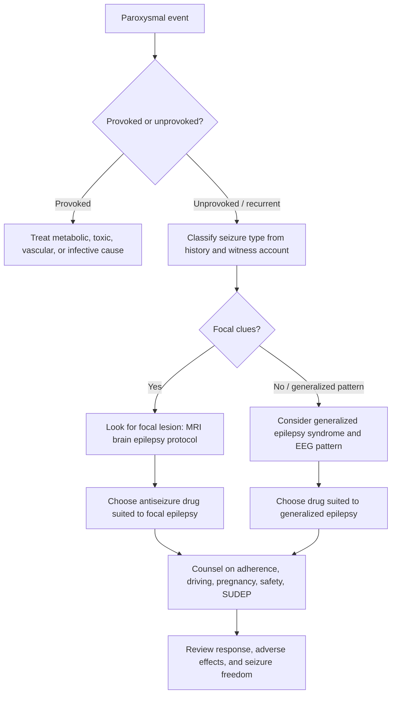
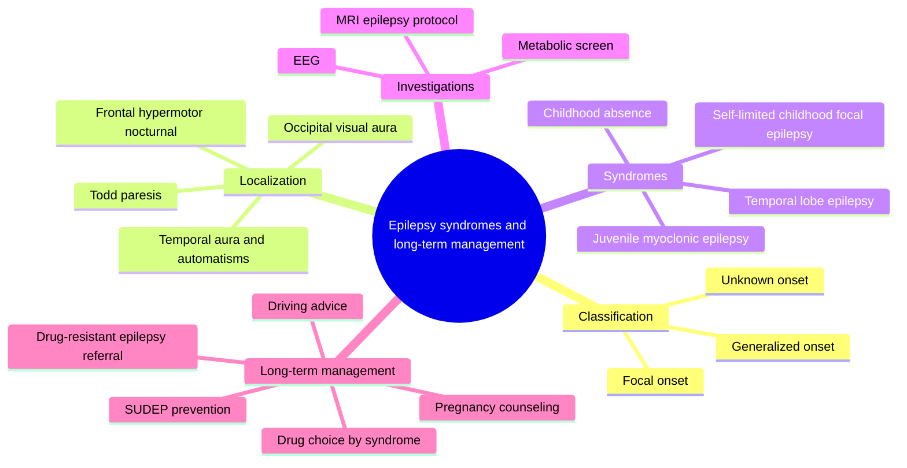

# Epilepsy syndromes and long-term management

Related: [[../Neurology MOC|Neurology MOC]] · [[../Epilepsy|Epilepsy]] · [[Status epilepticus]]

> [!important]
> Epilepsy is a **tendency to recurrent unprovoked seizures**. In FCPS/MRCP answers, score highly by stating **what part of the brain the seizure starts from**, whether the patient has a **self-limited syndrome** or **structural epilepsy**, and how long-term treatment must be individualized around **syndrome, precipitant, pregnancy potential, driving, adverse effects, and SUDEP counseling**.

> [!tip]
> A strong exam answer separates: **acute symptomatic seizure**, **single unprovoked seizure**, **epilepsy syndrome**, and **psychogenic non-epileptic events/syncope**. Long-term management is not just “start levetiracetam”; it is **diagnosis + classification + risk reduction + counseling + drug choice + review of response**.

## Learning Objectives
- Define epilepsy and distinguish it from isolated provoked seizures.
- Classify seizures by **focal vs generalized onset** and recognize common clinically relevant epilepsy syndromes.
- Localize seizures using aura, motor pattern, awareness, and post-ictal findings.
- Plan investigations including **EEG** and **MRI brain** and interpret their role correctly.
- Select appropriate long-term antiseizure therapy and counsel regarding pregnancy, driving, adherence, and SUDEP.

## Definition
Epilepsy is a disorder of the brain characterized by an enduring predisposition to generate epileptic seizures.

Practical clinical use:
- **Epileptic seizure**: transient occurrence of signs/symptoms due to abnormal excessive synchronous neuronal activity.
- **Acute symptomatic seizure**: occurs in close relation to a metabolic, toxic, infective, traumatic, or vascular insult.
- **Epilepsy** is usually diagnosed after:
  - **>=2 unprovoked seizures** more than 24 hours apart, or
  - **1 unprovoked seizure** with high recurrence risk, or
  - identification of a recognized **epilepsy syndrome**.

## Relevant Neuroanatomy and Lesion Localization
### Why localization matters
Seizure semiology often indicates the cortical region of onset.

### Focal onset clues
- **Frontal lobe**:
  - brief seizures
  - hypermotor activity, fencing posture, tonic posturing
  - often nocturnal
  - minimal post-ictal confusion
- **Temporal lobe**:
  - epigastric rising sensation
  - fear, déjà vu, jamais vu
  - behavioral arrest, oral/manual automatisms
  - post-ictal confusion common
- **Parietal lobe**:
  - sensory aura, tingling, body distortion
- **Occipital lobe**:
  - flashing lights, visual distortion, colored phenomena
- **Supplementary motor area**:
  - asymmetric tonic posturing, speech arrest

### Lateralizing clues
- head turning to one side may suggest contralateral hemisphere activation if forced and early
- unilateral clonic activity suggests contralateral motor cortex involvement
- post-ictal **Todd paralysis** suggests contralateral focal motor cortex seizure
- unilateral dystonic posturing often indicates ipsilateral temporal lobe seizure spread pattern nuances but must be interpreted with caution

### Generalized networks
Generalized epilepsies involve bilateral distributed networks from onset rather than one discrete cortical lesion.

## Classification
### Seizure classification
1. **Focal onset**
   - aware
   - impaired awareness
   - motor or non-motor onset
   - may progress to **bilateral tonic-clonic seizure**
2. **Generalized onset**
   - absence
   - myoclonic
   - tonic-clonic
   - tonic
   - clonic
   - atonic
3. **Unknown onset** if onset not witnessed or unclear

### Etiologic groups
- genetic
- structural
- infectious
- metabolic
- immune
- unknown

## Common Epilepsy Syndromes Relevant to FCPS/MRCP
### 1. Self-limited epilepsy with centrotemporal spikes
- childhood onset
- nocturnal focal seizures involving face/oropharynx
- speech arrest, drooling, facial twitching
- normal development
- usually remits with age

### 2. Childhood absence epilepsy
- school-age child
- frequent brief staring spells
- abrupt onset and offset
- eyelid flutter may occur
- provoked by hyperventilation
- EEG classically shows **3-Hz generalized spike-wave**
- ethosuximide or valproate commonly effective

### 3. Juvenile absence epilepsy
- later onset than childhood absence epilepsy
- absences less frequent, often with generalized tonic-clonic seizures
- may need long-term treatment

### 4. Juvenile myoclonic epilepsy (JME)
- adolescence onset
- early morning **myoclonic jerks**
- generalized tonic-clonic seizures common
- absence seizures may coexist
- sleep deprivation and alcohol commonly precipitate seizures
- usually lifelong tendency; valproate highly effective but problematic in women of childbearing potential

### 5. Generalized tonic-clonic seizures alone
- generalized seizures without prominent absences/myoclonus
- often precipitated by sleep loss or alcohol

### 6. Temporal lobe epilepsy
- common focal epilepsy in adults
- aura: epigastric rising, déjà vu, fear
- impaired awareness with automatisms
- post-ictal confusion
- MRI may show hippocampal sclerosis

### 7. Frontal lobe epilepsy
- brief frequent attacks, often nocturnal
- bizarre motor/hypermotor phenomena may mimic non-epileptic events

### 8. Structural focal epilepsies
Causes include:
- stroke
- brain tumor
- cortical dysplasia
- traumatic brain injury
- mesial temporal sclerosis
- CNS infection sequelae
- neurocysticercosis where epidemiologically relevant

## Causes and Risk Factors
### Acute symptomatic seizure causes to distinguish from epilepsy
- hypoglycemia
- hyponatremia
- uremia
- alcohol withdrawal
- CNS infection
- acute stroke
- head injury
- drug intoxication

### Risk factors for epilepsy
- prior CNS infection
- stroke
- traumatic brain injury
- developmental brain malformation
- perinatal injury
- family history in generalized epilepsies
- brain tumor
- dementia in older adults

## Pathophysiology
Seizures reflect an imbalance between excitation and inhibition.

Mechanisms:
- increased glutamatergic excitation
- reduced GABAergic inhibition
- membrane channel dysfunction
- abnormal neuronal networks and synchrony
- structural scar or gliosis acting as epileptogenic focus

Generalized epilepsies often reflect inherited channel/network dysfunction, whereas focal epilepsies frequently arise from a structural cortical abnormality.

## Clinical Features
### History points that matter most
- description from witness
- warning/aura
- awareness during event
- motor pattern
- duration
- cyanosis, injury, lateral tongue bite
- urinary incontinence
- post-ictal confusion or sleep
- precipitating factors: sleep loss, missed medication, alcohol, fever

### Features favoring epileptic seizure
- stereotyped recurrent events
- lateral tongue bite
- cyanosis
- witnessed tonic then clonic movements
- post-ictal confusion
- aura with focal progression
- injury from sudden loss of posture

### Features favoring syncope or non-epileptic event
- prolonged presyncope with sweating and visual dimming
- trigger such as prolonged standing or pain
- rapid recovery without confusion
- variable semiology with eye closure and retained awareness in PNES context

## Approach / Algorithm

## Investigations
### Core tests
- **Glucose, electrolytes, calcium, renal function, liver function** if first seizure or precipitant suspected
- **EEG**: supports classification but a normal EEG does **not** exclude epilepsy
- **MRI brain with epilepsy protocol** for most new focal epilepsies or adult-onset seizures
- **CT head** in acute emergency when hemorrhage, trauma, or mass effect is suspected

### EEG interpretation logic
- generalized spike-wave suggests generalized epilepsy
- focal epileptiform discharges support focal onset
- centrotemporal spikes suggest self-limited childhood focal epilepsy
- photoparoxysmal response may occur in generalized epilepsies
- normal interictal EEG does not rule out epilepsy

### Imaging interpretation logic
MRI is particularly important when:
- focal onset suspected
- adult onset epilepsy
- abnormal neurological examination
- refractory seizures
- concern for tumor, stroke, malformation, mesial temporal sclerosis

Look for:
- hippocampal sclerosis
- cortical dysplasia
- post-stroke gliosis
- tumor
- cavernoma
- infective granuloma/scar

## Diagnosis and Differential Diagnosis
### Diagnose the seizure type first
A common exam mistake is to diagnose “epilepsy” before describing the seizure type.

### Differential diagnosis
- syncope
- psychogenic non-epileptic seizures
- transient ischemic attack
- migraine aura
- sleep disorders including parasomnias
- movement disorders
- hypoglycemia

## Long-Term Management
### General principles
- confirm diagnosis carefully before lifelong treatment
- classify syndrome accurately
- treat reversible causes if present
- start medication when recurrence risk justifies it
- choose a drug based on seizure type, sex, age, comorbidity, and adverse-effect profile
- aim for **seizure freedom with minimal side effects**

### When to start long-term antiseizure therapy
Usually favored if:
- recurrent unprovoked seizures
- one seizure with high recurrence risk because of structural lesion or epileptiform EEG
- clear epilepsy syndrome such as JME

### Drug choice by seizure pattern
#### Focal epilepsy
Common options:
- **lamotrigine**
- **levetiracetam**
- **carbamazepine**
- **oxcarbazepine**

Cautions:
- carbamazepine and oxcarbazepine may worsen some generalized epilepsies
- levetiracetam may cause irritability or mood change
- lamotrigine needs slow titration because of rash risk

#### Generalized epilepsy
Common options:
- **valproate**
- **levetiracetam**
- **lamotrigine** for selected cases
- **ethosuximide** for pure absence epilepsy

Cautions:
- valproate is highly effective but has major **teratogenic** and neurodevelopmental fetal risks
- lamotrigine may be less effective for myoclonus than valproate
- carbamazepine may worsen absence or myoclonic seizures

### Management by syndrome
- **Childhood absence epilepsy**: ethosuximide if pure absence; valproate if generalized tonic-clonic seizures coexist
- **JME**: avoid sleep deprivation, often lifelong medication; valproate most effective but alternative planning required in many women
- **Temporal lobe epilepsy**: consider epilepsy surgery referral if drug resistant
- **Self-limited childhood focal epilepsy**: sometimes no treatment if infrequent and mild; many remit spontaneously

### Drug-resistant epilepsy
Suspect when seizures persist despite trials of **two appropriately chosen and tolerated antiseizure drugs**.

Next steps:
- confirm events are epileptic
- check adherence and dose adequacy
- re-check classification and MRI/EEG
- consider epilepsy surgery, vagus nerve stimulation, or specialist referral

### Safety and lifestyle counseling
- medication adherence is critical
- avoid sleep deprivation and binge alcohol
- supervised bathing/swimming
- avoid heights, open fires, and driving until legally permitted
- discuss occupational risks

### Driving
Driving advice depends on local law, but exam-safe principles:
- after an unprovoked seizure, driving is usually restricted for a defined seizure-free interval
- recurrent seizures require longer restriction
- nocturnal-only seizures may have separate legal rules in some systems

### Pregnancy and women of childbearing potential
Key FCPS/MRCP counseling points:
- discuss contraception interactions with enzyme-inducing drugs
- **avoid valproate if possible** in women who could become pregnant
- use **folic acid supplementation** when pregnancy is possible/planned
- seizure control still matters because convulsive seizures endanger mother and fetus
- lamotrigine levels may fall during pregnancy; dose review may be needed
- many antiseizure drugs are compatible with breastfeeding, but infant sedation should be watched clinically

### SUDEP counseling
SUDEP = sudden unexpected death in epilepsy.

Risk increases with:
- uncontrolled generalized tonic-clonic seizures
- nocturnal seizures
- poor adherence
- prone sleeping and lack of supervision in some cases

Risk reduction:
- optimize seizure control
- improve adherence
- reduce sleep deprivation and alcohol excess
- address nocturnal supervision and safety where relevant

## Management Cautions / Common Exam Pitfalls
- do not label a provoked metabolic seizure as chronic epilepsy without review
- do not use carbamazepine blindly in possible generalized epilepsy with myoclonus/absence
- do not forget pregnancy counseling before prescribing valproate
- do not overinterpret a normal EEG as excluding epilepsy
- do not ignore focal neurological deficits or adult new-onset seizures without MRI search for structural lesions

## One-Page Exam Summary
- **First task**: decide whether event was epileptic, and whether seizure was provoked or unprovoked.
- **Second task**: classify onset as **focal** or **generalized**.
- **Third task**: localize with aura, automatisms, motor pattern, and post-ictal deficits.
- **Fourth task**: investigate with **EEG** and especially **MRI** when focal or adult onset.
- **Fifth task**: choose drug according to syndrome; some drugs worsen generalized epilepsies.
- **Long-term care** always includes **adherence, driving, pregnancy, safety, and SUDEP counseling**.

## Mermaid Mind Map

## MCQs (10)
1. A 17-year-old has early morning myoclonic jerks and occasional generalized tonic-clonic seizures after sleep deprivation. The most likely syndrome is:
   - A. Temporal lobe epilepsy
   - B. Juvenile myoclonic epilepsy
   - C. Childhood absence epilepsy
   - D. Syncope
2. A rising epigastric sensation followed by behavioral arrest and lip smacking best suggests seizure onset from the:
   - A. Occipital lobe
   - B. Temporal lobe
   - C. Cerebellum
   - D. Medulla
3. Which investigation is most useful to identify a structural cause in adult focal epilepsy?
   - A. Chest X-ray
   - B. MRI brain with epilepsy protocol
   - C. Echocardiography
   - D. ESR only
4. Which EEG pattern is classically associated with childhood absence epilepsy?
   - A. 3-Hz generalized spike-wave
   - B. Alpha coma
   - C. Triphasic waves
   - D. Delta brush
5. Which drug may worsen absence or myoclonic seizures if generalized epilepsy is misclassified as focal epilepsy?
   - A. Ethosuximide
   - B. Carbamazepine
   - C. Diazepam
   - D. Magnesium sulfate
6. The most important modifiable risk factor for SUDEP is:
   - A. Controlled focal aware seizures only
   - B. Uncontrolled generalized tonic-clonic seizures
   - C. Migraine aura
   - D. Benign tremor
7. A normal interictal EEG in a patient with a convincing seizure history means:
   - A. Epilepsy is excluded
   - B. The patient definitely has PNES
   - C. Epilepsy is still possible
   - D. MRI is unnecessary
8. Which is the best statement about valproate in women of childbearing potential?
   - A. It is first choice in all women because it is safest in pregnancy
   - B. It should be avoided if possible because of teratogenic risk
   - C. It treats only focal epilepsy
   - D. It is contraindicated in men
9. Todd paralysis implies:
   - A. Functional weakness only
   - B. Post-ictal focal deficit suggesting focal seizure origin
   - C. Hypocalcemia
   - D. Multiple sclerosis relapse
10. Failure of two appropriate and tolerated antiseizure drugs should prompt consideration of:
   - A. Drug-resistant epilepsy and specialist referral
   - B. Stopping all treatment permanently
   - C. Labeling every event as psychogenic
   - D. Ignoring MRI findings

## SBA Questions (10)
1. A 19-year-old student has repeated brief bilateral arm jerks after waking and dropped a toothbrush several times. He recently had a generalized tonic-clonic seizure after exam stress and sleep deprivation. What is the most likely diagnosis?
   - A. Juvenile myoclonic epilepsy
   - B. Temporal lobe epilepsy
   - C. Convulsive syncope
   - D. Narcolepsy
   - E. Frontal meningioma
2. A 28-year-old woman reports recurrent episodes of déjà vu, rising epigastric sensation, unresponsiveness, and lip smacking lasting 90 seconds, followed by confusion. What is the best classification?
   - A. Generalized absence seizure
   - B. Focal impaired awareness seizure likely temporal lobe onset
   - C. Non-epileptic attack is certain
   - D. Brainstem TIA
   - E. Myoclonic seizure
3. A 62-year-old man presents with first unprovoked focal seizure and right arm clonic jerking. Which investigation is most important after emergency stabilization?
   - A. MRI brain
   - B. Colonoscopy
   - C. Barium swallow
   - D. Schilling test
   - E. Sweat chloride
4. A 7-year-old has many daily brief staring episodes, abruptly stops speaking, then immediately resumes. Hyperventilation reproduces the attacks. Best first-line therapy if pure absence epilepsy is:
   - A. Ethosuximide
   - B. Carbamazepine
   - C. Phenytoin
   - D. Haloperidol
   - E. Aspirin
5. A woman with generalized epilepsy is planning pregnancy. Which counseling point is most appropriate?
   - A. Stop all antiseizure medication immediately
   - B. Continue seizure risk assessment and review drug choice, avoiding valproate if possible
   - C. Pregnancy is absolutely contraindicated
   - D. Folic acid is unnecessary
   - E. EEG normalization guarantees fetal safety
6. A man with epilepsy continues to have monthly seizures despite trials of levetiracetam and lamotrigine at tolerated therapeutic doses. Best next step is:
   - A. Reassure only
   - B. Consider drug-resistant epilepsy and specialist assessment
   - C. Declare treatment failure impossible
   - D. Start long-term antibiotics
   - E. Ignore adherence and diagnosis review
7. A patient with newly diagnosed generalized epilepsy asks about lifestyle risk reduction. Which advice is most important?
   - A. Sleep deprivation is harmless
   - B. Adherence and avoidance of sleep loss and binge alcohol reduce seizure risk
   - C. Medication can be taken only when aura occurs
   - D. Swimming alone is ideal
   - E. SUDEP discussion is never appropriate
8. A 24-year-old woman has frequent myoclonic jerks and absences. Which medication should be avoided because it may aggravate her seizure type?
   - A. Carbamazepine
   - B. Levetiracetam
   - C. Valproate
   - D. Lamotrigine
   - E. Clonazepam
9. A man loses consciousness while standing in a hot crowded room. He felt dizzy and sweaty beforehand and recovered quickly without confusion. The most likely diagnosis is:
   - A. Temporal lobe epilepsy
   - B. Vasovagal syncope
   - C. Occipital epilepsy
   - D. Status epilepticus
   - E. Absence seizure
10. A patient with epilepsy and recurrent generalized tonic-clonic seizures asks why MRI is needed despite a positive EEG. The best reason is:
   - A. EEG gives bone detail
   - B. MRI identifies structural epileptogenic lesions that affect prognosis and management
   - C. MRI replaces history
   - D. MRI proves every event is epileptic
   - E. MRI is needed only for migraine

## Flashcards
- Q: What syndrome causes early morning myoclonic jerks in adolescents?
  A: Juvenile myoclonic epilepsy.
- Q: What aura strongly suggests temporal lobe epilepsy?
  A: Rising epigastric sensation, déjà vu, fear, or automatisms.
- Q: What is the classic EEG pattern in childhood absence epilepsy?
  A: 3-Hz generalized spike-wave.
- Q: What imaging is preferred in adult-onset focal epilepsy?
  A: MRI brain with epilepsy protocol.
- Q: Can a normal EEG exclude epilepsy?
  A: No.
- Q: Which seizure medication is especially problematic in women who may become pregnant?
  A: Valproate.
- Q: What post-ictal deficit suggests focal motor cortex involvement?
  A: Todd paralysis.
- Q: What is the major practical trigger in juvenile myoclonic epilepsy?
  A: Sleep deprivation, often with alcohol.
- Q: When is epilepsy considered drug resistant?
  A: After failure of two appropriate tolerated antiseizure medications.
- Q: What is the key preventable SUDEP risk target?
  A: Better control of generalized tonic-clonic seizures and adherence.

## Answer Key with Explanations
### MCQs
1. **B. Juvenile myoclonic epilepsy** — classic morning myoclonus with generalized convulsions after sleep loss.
2. **B. Temporal lobe** — epigastric aura and automatisms are highly typical.
3. **B. MRI brain with epilepsy protocol** — best test for structural focal causes.
4. **A. 3-Hz generalized spike-wave** — hallmark of absence epilepsy.
5. **B. Carbamazepine** — may aggravate generalized absence/myoclonic syndromes.
6. **B. Uncontrolled generalized tonic-clonic seizures** — strongest practical SUDEP risk factor.
7. **C. Epilepsy is still possible** — interictal EEG sensitivity is limited.
8. **B. It should be avoided if possible because of teratogenic risk** — major counseling issue.
9. **B. Post-ictal focal deficit suggesting focal seizure origin** — Todd paralysis helps localization.
10. **A. Drug-resistant epilepsy and specialist referral** — especially for surgery evaluation and reclassification.

### SBAs
1. **A. Juvenile myoclonic epilepsy** — typical age, jerks after waking, and seizure precipitated by sleep deprivation.
2. **B. Focal impaired awareness seizure likely temporal lobe onset** — aura, arrest, automatisms, and post-ictal confusion fit well.
3. **A. MRI brain** — first focal seizure in older adult demands structural lesion search.
4. **A. Ethosuximide** — first-line for pure absence epilepsy.
5. **B. Continue seizure risk assessment and review drug choice, avoiding valproate if possible** — abrupt cessation is dangerous.
6. **B. Consider drug-resistant epilepsy and specialist assessment** — after failure of two appropriate agents.
7. **B. Adherence and avoidance of sleep loss and binge alcohol reduce seizure risk** — high-yield risk reduction advice.
8. **A. Carbamazepine** — may worsen generalized myoclonic/absence seizures.
9. **B. Vasovagal syncope** — presyncope and rapid full recovery are key clues.
10. **B. MRI identifies structural epileptogenic lesions that affect prognosis and management** — EEG and MRI answer different questions.
