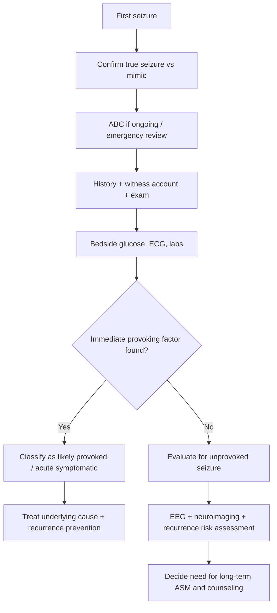
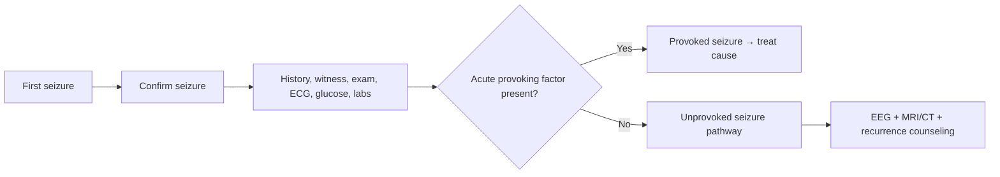

# Provoked vs unprovoked seizure

Related: [[../Neurology MOC|Neurology MOC]] · [[../Epilepsy|Epilepsy]] · [[Evaluation of a first seizure]] · [[History, witness account, labs, ECG, neuroimaging, and EEG]] · [[Important differentials - syncope, FND, and metabolic causes|Important differentials: syncope, FND, and metabolic causes]] · [[Recognition and emergency sequence]]

> [!important]
> One of the most important first-seizure decisions is whether the event was **provoked (acute symptomatic)** or **unprovoked**. This distinction affects **recurrence risk**, the need for **long-term antiseizure treatment**, and the search for **underlying structural brain disease**.

> [!tip]
> In FCPS/MRCP answers, do not jump straight to “epilepsy.” First state whether the event was truly epileptic, then classify it as **provoked** or **unprovoked**, then assess recurrence risk and cause.

## Learning Objectives
- Define provoked and unprovoked seizures.
- Understand how acute metabolic, toxic, infective, and structural insults produce seizures.
- Use history, labs, ECG, neuroimaging, and EEG to classify a first seizure.
- Explain the recurrence-risk implications of the distinction.
- Know when long-term antiseizure medication is more likely to be indicated.

## Definition
### Provoked seizure
A **provoked seizure** is an **acute symptomatic seizure** occurring in close temporal relationship to an acute brain/systemic insult such as:
- metabolic derangement
- drug/toxin exposure or withdrawal
- acute CNS infection
- acute head injury
- acute stroke or intracranial bleed

### Unprovoked seizure
An **unprovoked seizure** occurs **without an immediate reversible precipitant**. It may reflect:
- an underlying structural brain lesion
- a genetic predisposition
- an epileptic syndrome
- a previously silent cortical scar or other enduring epileptogenic abnormality

## Relevant Neuroanatomy
- Seizures arise from abnormal cortical neuronal discharge.
- Focal seizures may originate from temporal, frontal, parietal, or occipital cortex depending on lesion type.
- Acute structural insults such as cortical haemorrhage, encephalitis, tumour, or trauma create local hyperexcitability.
- Remote cortical scars can produce unprovoked seizures months or years after the original injury.

## Relevant Neurophysiology
- Normal neuronal activity depends on balance between excitatory and inhibitory neurotransmission.
- Provoking factors such as hyponatraemia, hypoglycaemia, alcohol withdrawal, or fever lower seizure threshold.
- Unprovoked seizures imply a more durable predisposition to spontaneous epileptic discharge.
- EEG epileptiform discharges support cortical hyperexcitability and increase recurrence risk after a first unprovoked seizure.

## Normal Values / Important Cut-offs
- Acute symptomatic timing matters: seizures near the time of the insult are generally considered **provoked**.
- Severe metabolic derangements frequently associated with seizures include marked **hypoglycaemia**, major **hyponatraemia**, severe **hypocalcaemia**, and severe **uraemia**.
- Recurrence risk after a **provoked seizure** is mainly determined by whether the provoking factor recurs.
- Recurrence risk after a **first unprovoked seizure** is substantially higher, especially with abnormal MRI or epileptiform EEG.

## Classification
### Seizure classification axis 1: is it epileptic?
- epileptic seizure
- mimic: syncope, psychogenic non-epileptic attack, movement disorder, metabolic collapse

### Seizure classification axis 2: if epileptic, is it provoked or unprovoked?
1. **Provoked / acute symptomatic**
2. **Unprovoked**

### Seizure classification axis 3: seizure type
- focal onset
- generalized onset
- unknown onset

## Etiology / Causes
### Common causes of provoked seizure
- hypoglycaemia
- hyponatraemia
- hypocalcaemia
- alcohol withdrawal
- benzodiazepine withdrawal
- CNS infection
- acute stroke/ICH
- traumatic brain injury
- toxic drug exposure
- eclampsia

### Causes of unprovoked seizure
- idiopathic/genetic predisposition
- cortical dysplasia
- previous CNS infection leaving a scar
- remote traumatic scar
- brain tumour
- mesial temporal sclerosis
- remote stroke scar

## Risk Factors
### For provoked seizures
- diabetes on insulin or sulfonylurea
- renal/liver failure
- alcoholism
- sepsis
- pregnancy complications
- polypharmacy/toxin exposure

### For unprovoked seizure recurrence
- abnormal neurological examination
- epileptiform EEG
- structural brain lesion on MRI/CT
- prior brain insult
- nocturnal seizure
- focal seizure semiology

## Pathophysiology
### Provoked seizure mechanism
An acute physiological or structural insult lowers seizure threshold or directly irritates the cortex.
Examples:
- hyponatraemia → neuronal swelling and instability
- hypoglycaemia → energy failure
- alcohol withdrawal → loss of inhibitory GABA effect
- encephalitis → inflammatory cortical irritability
- haemorrhage → acute focal cortical irritation

### Unprovoked seizure mechanism
The patient has an enduring epileptogenic substrate that can generate seizures without a fresh immediate trigger.

## Clinical Features
### Features suggestive of a provoked seizure
- recent fever or meningism
- recent alcohol binge/cessation
- medication nonadherence or withdrawal
- altered metabolic state
- acute head injury
- acute focal neurological event/stroke symptoms
- seizure occurring during critical illness

### Features suggestive of an unprovoked seizure
- no acute trigger found
- prior brief stereotyped episodes/aura
- remote history of brain injury or childhood seizures
- focal onset clues
- seizure from sleep

### Features of the event itself
Event semiology can be similar in both groups:
- tonic-clonic movements
- focal jerking
- impaired awareness
- post-ictal confusion
- tongue bite
- incontinence

## Approach / Algorithm

## Investigations
### Bedside and initial tests for all first seizures
- capillary glucose
- ECG
- electrolytes including sodium and calcium
- renal function
- liver function if relevant
- toxicology / drug level when indicated
- pregnancy test where relevant

### Tests that help separate provoked from unprovoked
- **EEG**: epileptiform discharges support enduring epileptogenic tendency
- **CT/MRI brain**: looks for acute lesion or chronic structural substrate
- **Lumbar puncture**: if meningitis/encephalitis suspected and safe
- **Toxicology/alcohol history**: essential when relevant

## Interpretation Frameworks
### Provoked vs unprovoked framework
1. Was there a true epileptic event?
2. Is there a **clear acute precipitant** temporally related to seizure?
3. If yes, is it sufficient to explain the event?
4. If no acute cause, is there an underlying structural lesion or epileptiform EEG?
5. What is the recurrence risk?
6. Does the patient meet clinical criteria suggesting epilepsy rather than a one-off event?

### Bedside cause table
| Situation | Favors provoked | Favors unprovoked |
|---|---|---|
| Severe hyponatraemia at presentation | Yes | No |
| Alcohol withdrawal | Yes | No |
| Acute meningitis/encephalitis | Yes | No |
| Brain MRI showing remote scar only | Sometimes, but often enduring risk | Yes |
| No trigger, epileptiform EEG | No | Yes |
| Remote old stroke with new spontaneous seizure | Not acute symptomatic | Often unprovoked |

## Diagnosis
### Provoked seizure diagnosis
Made when there is a clear acute precipitant closely linked to the seizure and no better explanation.

### Unprovoked seizure diagnosis
Made when there is no immediate provoking factor and the event likely reflects an enduring tendency to seize.

## Differential Diagnosis
- syncope with convulsive movements
- psychogenic non-epileptic attack
- hypoglycaemic collapse without true seizure
- transient ischemic attack
- migraine aura
- movement disorder
- sleep disorder / parasomnia

## Tables / Comparison Charts
| Feature | Provoked seizure | Unprovoked seizure |
|---|---|---|
| Trigger | Clear acute precipitant present | No immediate precipitant |
| Recurrence risk | Usually low if cause corrected | Higher, especially with abnormal EEG/MRI |
| Treatment emphasis | Correct underlying cause | Risk stratify for epilepsy/long-term ASM |
| Examples | Hypoglycaemia, hyponatraemia, meningitis, alcohol withdrawal | Genetic tendency, tumour, cortical scar, mesial temporal sclerosis |
| Counseling | Prevent trigger recurrence | Driving/work/ASM recurrence counseling more central |

## Management
### Provoked seizure
- treat underlying cause urgently
- no automatic long-term epilepsy diagnosis
- long-term ASM often unnecessary unless recurrence risk persists or repeated events occur

Examples:
- glucose correction
- electrolyte correction
- antimicrobials for CNS infection
- withdrawal treatment
- stroke/bleed pathway

### Unprovoked seizure
- assess recurrence risk with EEG and imaging
- consider long-term ASM when risk is substantial or if epilepsy diagnosis is established
- counsel about driving, swimming, machinery, heights, sleep deprivation, alcohol excess

## Drug Interactions / Contraindications / Comorbidity Cautions
- Avoid automatically starting chronic ASM for every provoked seizure.
- In women of childbearing potential, valproate requires strong caution.
- Renal disease affects levetiracetam dosing; liver disease affects valproate suitability.
- Alcohol withdrawal seizures need withdrawal management, not just discharge with tablets.
- A first seizure may actually be cardiogenic syncope—do not omit ECG.

## Procedures / Indications / Contraindications
- **EEG:** indicated for likely unprovoked seizure and classification support.
- **Neuroimaging:** CT if acute concern; MRI for structural substrate assessment.
- **Lumbar puncture:** if CNS infection suspected after contraindications are considered.

## Procedure Mini-Sections
### EEG after first seizure
- **Indication:** likely unprovoked seizure, classification, recurrence risk
- **Pearl:** epileptiform discharges increase recurrence risk but normal EEG does not exclude epilepsy

### Brain imaging
- **Indication:** first seizure with focal onset, persistent deficit, trauma, cancer, immunocompromise, or unclear cause
- **Pearl:** MRI is better than CT for many chronic structural causes, but CT is often first in the acute setting

## Complications
### Provoked seizure-related
- recurrence if precipitant not corrected
- missing a life-threatening trigger such as meningitis or intracranial haemorrhage

### Unprovoked seizure-related
- recurrent epilepsy
- injury, aspiration, driving restrictions, psychosocial impact

## Red Flags / Emergencies
- fever/meningism
- prolonged seizure or repeated seizures
- focal deficit or prolonged confusion
- head trauma
- anticoagulant use
- pregnancy-associated seizure
- severe metabolic derangement
- immunocompromised patient

## Prognosis
- **Provoked seizure:** often good if the cause is promptly reversed and not recurrent.
- **Unprovoked seizure:** recurrence risk is higher, especially with abnormal EEG or structural lesion.
- Prognosis always depends on the underlying etiology.

## Topic Correlation
- [[Recognition and emergency sequence]]
- [[History, witness account, labs, ECG, neuroimaging, and EEG]]
- [[Important differentials - syncope, FND, and metabolic causes|Important differentials: syncope, FND, and metabolic causes]]
- [[Bacterial meningitis|Bacterial meningitis]]
- [[Non-contrast CT head basics]]

## Special Situations
- **Pregnancy:** consider eclampsia, ASM teratogenicity, and urgent obstetric input.
- **Alcohol dependence:** provoked withdrawal seizures are common.
- **Older adult first seizure:** low threshold for structural imaging and ECG review.
- **Cancer/immunocompromise:** think metastasis, abscess, toxoplasmosis, encephalitis.

## FCPS/MRCP High-Yield Points
- “Provoked” usually means **acute symptomatic**.
- Correct cause first before labeling epilepsy.
- Unprovoked seizure plus abnormal EEG/MRI implies higher recurrence risk.
- ECG is part of first seizure work-up to avoid missing convulsive syncope.
- Remote structural scars more often imply **unprovoked** recurrence risk rather than acute symptomatic seizure.

## Common Viva Questions
- Define provoked and unprovoked seizure.
- Give common causes of provoked seizure.
- Why is the distinction clinically important?
- Which tests help estimate recurrence risk after an unprovoked seizure?
- Would you start long-term ASM after every first seizure?

## Common Confusions / Exam Traps
- Calling every first seizure “epilepsy.”
- Missing syncope because ECG was not done.
- Misclassifying a seizure from old scar as “provoked” when no acute trigger exists.
- Ignoring alcohol/benzodiazepine withdrawal history.
- Starting chronic ASM before defining the event and cause.

## Mnemonics
- **PROVOKED**
  - **P**recipitant present
  - **R**eversible often
  - **O**nset near acute insult
  - **V**ital cause search needed
  - **O**ngoing epilepsy not automatic
  - **K**ey labs/ECG
  - **E**tiology-directed treatment
  - **D**on’t overdiagnose epilepsy

## Mind Map
- First seizure
  - Is it real seizure?
    - syncope?
    - PNES?
  - Provoked?
    - glucose
    - sodium
    - infection
    - withdrawal
    - stroke/bleed
  - Unprovoked?
    - EEG
    - MRI
    - recurrence risk
  - Management
    - cause correction
    - counseling
    - ASM decision

## Flowchart

## Suggested Visuals / Image Notes
- Flowchart of first seizure classification
- Table of provoking factors by system
- Diagram comparing acute symptomatic vs enduring epileptogenic lesion

## Suggested Video References
- Look for: “first seizure approach MRCP”
- Look for: “provoked versus unprovoked seizures neurology revision”
- Look for: “EEG and MRI interpretation after first seizure”

## One-Page Revision Summary
- First decide if the event was a **true seizure**.
- Then ask: **provoked or unprovoked?**
- **Provoked seizure** = acute symptomatic event due to reversible/acute insult.
- **Unprovoked seizure** = no immediate trigger; suggests enduring epileptogenic tendency.
- Provoked seizures need **cause correction**.
- Unprovoked seizures need **EEG, imaging, recurrence-risk assessment**, and possible long-term ASM discussion.
- Never forget **ECG and glucose** in first seizure work-up.

## 24-Hour Recall Prompts
- Define provoked seizure.
- Define unprovoked seizure.
- List 5 common provoking factors.
- What tests help estimate recurrence risk after unprovoked seizure?
- Why is an old cortical scar different from acute stroke in classification?

## 7-Day / 15-Day / 30-Day Revision Tracker
- **Day 1:** Reproduce provoked vs unprovoked table.
- **Day 7:** Write first-seizure work-up from memory.
- **Day 15:** Solve mixed seizure vs syncope SBAs.
- **Day 30:** Explain long-term ASM decision factors without notes.

## Must Know / Should Know / Nice to Know
### Must Know
- definitions
- first-seizure work-up
- common provoking factors
- recurrence risk difference
- ECG + glucose importance

### Should Know
- EEG/MRI implications
- remote lesion vs acute insult distinction
- counseling issues

### Nice to Know
- syndrome-specific recurrence nuances
- detailed epidemiologic data

## My Weak Points
- Do I automatically label first seizure as epilepsy?
- Can I distinguish acute symptomatic from remote structural risk?
- Do I remember ECG and metabolic screen?

## Self-Test Scorecard
- Definitions: __/10
- Work-up recall: __/10
- Recurrence risk understanding: __/10
- Differential diagnosis: __/10
- Viva confidence: __/10

## Exam Answer Modes
- **Long answer:** approach to first seizure and distinction between provoked and unprovoked.
- **Short note:** provoked seizure causes and clinical importance.
- **Viva:** “How would you evaluate a patient after a first generalized seizure?”

## Summary
The distinction between **provoked** and **unprovoked** seizure is central to first-seizure medicine. Provoked seizures are linked to an **acute systemic or CNS insult** and are managed mainly by **treating the cause**. Unprovoked seizures imply a more enduring epileptogenic tendency and demand **EEG, neuroimaging, recurrence-risk assessment, counseling, and selective long-term ASM decisions**.

## MCQs (10)
1. A seizure occurring during severe hyponatraemia is best classified as:
   - A. Unprovoked seizure
   - B. Acute symptomatic (provoked) seizure
   - C. Psychogenic attack
   - D. Migraine aura
   - E. Parasomnia

2. Which investigation should not be forgotten in first seizure assessment because convulsive syncope is an important mimic?
   - A. ECG
   - B. Visual acuity
   - C. Peak flow
   - D. Audiogram
   - E. Serum urate

3. An unprovoked seizure is one that:
   - A. Always occurs in the elderly
   - B. Has no immediate provoking factor
   - C. Always has fever
   - D. Never recurs
   - E. Is always generalized

4. Which finding most increases recurrence concern after a first unprovoked seizure?
   - A. Normal nails
   - B. Epileptiform EEG
   - C. Mild rhinitis
   - D. Normal BMI
   - E. Hyperopia

5. A seizure due to alcohol withdrawal is typically:
   - A. Unprovoked
   - B. Provoked
   - C. Functional neurological disorder
   - D. TIA
   - E. Narcolepsy

6. Which statement about provoked seizures is correct?
   - A. They always require lifelong ASM
   - B. They are unrelated to metabolic disturbance
   - C. The underlying cause must be identified and corrected
   - D. EEG replaces all blood tests
   - E. Imaging is never useful

7. A patient with no acute trigger but MRI showing old temporal encephalomalacia and focal seizure likely has:
   - A. Unprovoked seizure
   - B. Provoked seizure from acute infection
   - C. Syncope
   - D. Ménière disease
   - E. BPPV

8. Which is a common cause of provoked seizure?
   - A. Hypoglycaemia
   - B. Presbyopia
   - C. Osteoarthritis
   - D. Vitiligo
   - E. Alopecia

9. The key practical importance of provoked vs unprovoked distinction is:
   - A. It changes recurrence risk and long-term management
   - B. It only affects spelling
   - C. It has no value in neurology
   - D. It removes need for history
   - E. It prevents imaging entirely

10. Which bedside test is immediately useful in all first seizures?
   - A. Capillary glucose
   - B. Audiometry
   - C. Spirometry
   - D. Colonoscopy
   - E. Bone densitometry

## SBA Questions (10)
1. A 19-year-old man has a generalized tonic-clonic seizure after two days of vomiting and profound hyponatraemia. What is the best classification?
   - A. Unprovoked seizure
   - B. Provoked seizure
   - C. Psychogenic attack
   - D. Absence seizure
   - E. Migraine aura

2. A 45-year-old woman has a first nocturnal focal-to-bilateral tonic-clonic seizure. There is no acute trigger. Which next step is most appropriate?
   - A. Ignore recurrence risk
   - B. EEG and structural brain evaluation
   - C. Treat as BPPV
   - D. Only measure ESR
   - E. Discharge without advice

3. A patient collapses with jerking. Which investigation is important because the differential includes convulsive syncope?
   - A. ECG
   - B. Stool culture
   - C. Bone scan
   - D. Pure tone audiometry
   - E. Skin biopsy

4. A 60-year-old man has a seizure during acute bacterial meningitis. What is the most important management principle?
   - A. Label lifelong epilepsy immediately
   - B. Treat the acute CNS infection and seizure
   - C. Ignore the infection because seizures are primary
   - D. Avoid all antimicrobials
   - E. Only provide reassurance

5. A 28-year-old woman has a first seizure, normal electrolytes, no toxin history, and epileptiform discharges on EEG. Which statement is best?
   - A. This strongly supports an unprovoked seizure with higher recurrence risk
   - B. This proves syncope
   - C. This excludes epilepsy
   - D. This confirms Ménière disease
   - E. No follow-up is needed

6. A man with alcohol dependence has a seizure 24 hours after stopping drinking. Which cause is most likely?
   - A. Alcohol withdrawal provoked seizure
   - B. BPPV
   - C. Tension headache
   - D. Peripheral neuropathy only
   - E. Parkinson disease

7. Which feature would push you away from “provoked seizure” and toward “unprovoked seizure”?
   - A. Severe hypoglycaemia
   - B. Acute head trauma
   - C. No trigger with remote cortical scar on MRI
   - D. Active meningitis
   - E. Severe hyponatraemia

8. A first seizure patient has normal glucose and electrolytes but a focal neurological deficit. What is the best next principle?
   - A. Search for structural brain disease urgently
   - B. Assume anxiety
   - C. Diagnose migraine only
   - D. Start vertigo maneuvers
   - E. Avoid imaging

9. Which management choice is most appropriate after an isolated provoked seizure from hypoglycaemia that is corrected and not recurrent?
   - A. Automatic lifelong ASM in all cases
   - B. Focus on preventing the provoking factor from recurring
   - C. No need to identify the cause
   - D. Driving advice is irrelevant
   - E. ECG is unnecessary

10. Why is the provoked/unprovoked distinction clinically important?
   - A. It determines recurrence risk, investigation strategy, and chronic treatment need
   - B. It only affects terminology
   - C. It has no patient impact
   - D. It replaces neurological examination
   - E. It removes need for witness history

## Flashcards
- Q: What is a provoked seizure?
  A: An acute symptomatic seizure occurring in temporal relation to an acute systemic or CNS insult.
- Q: What is an unprovoked seizure?
  A: A seizure without an immediate provoking factor, implying enduring epileptogenic tendency.
- Q: Name three common provoking factors.
  A: Hypoglycaemia, hyponatraemia, alcohol withdrawal.
- Q: Which bedside tests are essential in first seizure assessment?
  A: Capillary glucose and ECG.
- Q: What EEG finding raises recurrence risk after a first unprovoked seizure?
  A: Epileptiform discharges.
- Q: Does every provoked seizure require lifelong ASM?
  A: No.
- Q: Does a remote cortical scar usually suggest provoked or unprovoked seizure if no acute trigger exists?
  A: Unprovoked.
- Q: Why is meningitis-related seizure classified as provoked?
  A: Because it occurs in the context of an acute CNS insult.
- Q: What is the main treatment principle in provoked seizures?
  A: Correct the underlying cause.
- Q: What is the main management focus after an unprovoked first seizure?
  A: Recurrence risk assessment and deciding on longer-term management.

## Answer Key with Explanations
### MCQs
1. **B** — severe hyponatraemia is a classic acute symptomatic cause.
2. **A** — ECG is essential because convulsive syncope can mimic seizure.
3. **B** — that is the core definition.
4. **B** — epileptiform EEG suggests enduring cortical excitability and higher recurrence risk.
5. **B** — alcohol withdrawal seizures are provoked.
6. **C** — correcting the precipitant is central.
7. **A** — no acute trigger plus a structural substrate fits unprovoked seizure.
8. **A** — hypoglycaemia is a common provoker.
9. **A** — the distinction drives prognosis and long-term decisions.
10. **A** — bedside glucose is mandatory.

### SBAs
1. **B** — acute severe hyponatraemia makes this a provoked seizure.
2. **B** — likely unprovoked seizure requires EEG and imaging.
3. **A** — ECG helps exclude arrhythmic convulsive syncope.
4. **B** — treat both the seizure and the acute infection.
5. **A** — epileptiform EEG after no acute trigger strongly supports unprovoked seizure with higher recurrence concern.
6. **A** — timing and context fit alcohol withdrawal seizure.
7. **C** — remote scar without acute insult suggests unprovoked seizure.
8. **A** — focal deficit raises concern for structural pathology.
9. **B** — prevention of recurrent provoking factor is key.
10. **A** — this distinction affects work-up, prognosis, and treatment.
